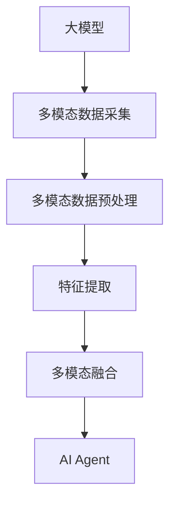

                 

# 【大模型应用开发 动手做AI Agent】多模态能力

## 1. 背景介绍

随着人工智能技术的不断进步，大模型在自然语言处理（NLP）、计算机视觉（CV）、语音识别（ASR）等领域展现出了巨大的潜力。在实际应用中，人们发现单独依赖一种模态（如文本、图像、语音）进行信息处理，存在很多局限性。而通过多模态能力的构建，可以实现更为全面、准确的感知和理解，极大地提升AI Agent的功能和效率。

本系列博客将详细讲解如何使用大模型技术开发具有多模态能力的AI Agent，并通过一系列实例演示具体的实现方法。涵盖了文本、图像、语音等多模态信息的采集、处理和融合，以及如何构建基于多模态信息的高效AI Agent，以解决实际问题。

## 2. 核心概念与联系

### 2.1 核心概念概述

- **大模型（Large Models）**：是指在大规模数据上预训练的深度神经网络模型，如BERT、GPT、ResNet等。这些模型在各自的领域内具有强大的泛化能力和理解能力。

- **多模态（Multi-Modal）**：指的是结合使用文本、图像、语音等多种类型的数据进行信息处理。多模态信息的融合，可以使AI Agent具备更加全面、准确的信息理解能力。

- **多模态融合（Multi-Modal Fusion）**：是将不同模态的信息通过深度学习模型进行集成和融合，得到更全面、准确的信息表示。

- **AI Agent**：是指能够自主执行任务、做出决策的智能体。在多模态能力构建的基础上，AI Agent可以更好地理解复杂任务，提高决策的准确性和可靠性。

通过上述概念，我们可以看到，多模态能力的构建是提升AI Agent性能的关键。利用大模型技术，我们可以高效地实现多模态融合，使得AI Agent能够更好地适应多样化的信息输入和处理需求。

### 2.2 核心概念原理和架构的 Mermaid 流程图



## 3. 核心算法原理 & 具体操作步骤

### 3.1 算法原理概述

多模态融合的本质是将不同模态的信息通过深度学习模型进行集成和融合，得到更全面、准确的信息表示。常见的多模态融合方法包括：特征拼接（Feature Concatenation）、加权融合（Weighted Fusion）、注意力机制（Attention Mechanism）等。

- **特征拼接**：简单地将不同模态的特征进行拼接，得到融合后的特征向量。
- **加权融合**：通过学习各模态的权重，对融合后的特征进行加权处理。
- **注意力机制**：通过学习注意力权重，对不同模态的信息进行动态选择和融合。

### 3.2 算法步骤详解

以加权融合为例，介绍多模态融合的具体操作步骤：

1. **数据采集**：使用摄像头、麦克风、传感器等设备采集文本、图像、语音等多种类型的数据。

2. **预处理**：对采集到的多模态数据进行预处理，包括去噪、增强、归一化等操作，使数据满足后续模型的输入要求。

3. **特征提取**：使用深度学习模型对预处理后的多模态数据进行特征提取，得到各个模态的特征向量。

4. **加权融合**：通过学习各模态的权重，对特征向量进行加权融合，得到最终的融合特征向量。

5. **模型训练**：将融合特征向量作为输入，使用预训练的大模型进行训练，得到最终的AI Agent。

### 3.3 算法优缺点

- **优点**：
  - 可以充分利用不同模态的信息，提升AI Agent的理解能力和决策能力。
  - 通过加权融合等方式，可以有效避免不同模态之间的信息冲突和干扰。
  - 可以利用大模型的强大泛化能力，提升模型的泛化性能和适应能力。

- **缺点**：
  - 多模态数据采集和处理较为复杂，需要较高的技术门槛和设备成本。
  - 多模态融合需要设计合理的权重学习策略，选择合适的融合方式。
  - 融合后的特征向量维度较高，模型的训练和推理效率可能受到影响。

### 3.4 算法应用领域

多模态融合技术可以广泛应用于各种场景，包括：

- **智能家居**：通过摄像头、麦克风、传感器等设备采集多模态数据，实现智能控制和语音交互。
- **医疗诊断**：结合文本、图像、声音等多模态数据，提高疾病的诊断准确率和智能化水平。
- **安防监控**：使用摄像头、麦克风等设备采集多模态数据，实现行为分析和异常检测。
- **自动驾驶**：通过摄像头、雷达、激光雷达等多模态传感器采集数据，提升驾驶安全和智能化水平。
- **智能客服**：结合文本、语音、图像等多模态数据，提升客户咨询体验和问题解决效率。

## 4. 数学模型和公式 & 详细讲解 & 举例说明

### 4.1 数学模型构建

假设我们有三个模态的数据，分别是文本（Text）、图像（Image）和语音（Speech）。我们将分别使用BERT、ResNet和Transformer模型对它们进行特征提取，得到三个特征向量 $X_T, X_I, X_S$。

### 4.2 公式推导过程

为了实现加权融合，我们需要设计一个权重向量 $w=(w_T, w_I, w_S)$，对三个特征向量进行加权求和，得到最终的融合特征向量 $X$。

$$
X = w_T \cdot X_T + w_I \cdot X_I + w_S \cdot X_S
$$

其中，权重向量 $w$ 需要通过对数据集进行训练得到。常见的训练方法包括：

- **softmax**：对各模态的权重进行softmax归一化，得到各模态的相对权重。
- **L1/L2正则**：对权重向量进行正则化，防止过度拟合。
- **交叉验证**：通过交叉验证等方法，优化权重向量，提高融合效果。

### 4.3 案例分析与讲解

以智能家居场景为例，假设我们采集到了一段家居环境的视频，包括图像（Image）和语音（Speech）信息。我们通过ResNet和Transformer模型对图像和语音进行特征提取，得到 $X_I$ 和 $X_S$。然后，我们将 $X_I$ 和 $X_S$ 输入到一个全连接层（Fully Connected Layer），输出权重向量 $w$，并进行softmax归一化，得到 $w_T, w_I, w_S$。最后，我们将 $w_T \cdot X_T, w_I \cdot X_I, w_S \cdot X_S$ 进行加权求和，得到最终的融合特征向量 $X$。

## 5. 项目实践：代码实例和详细解释说明

### 5.1 开发环境搭建

在开始实际项目之前，我们需要准备好开发环境。以下是使用Python进行PyTorch开发的环境配置流程：

1. 安装Anaconda：从官网下载并安装Anaconda，用于创建独立的Python环境。

2. 创建并激活虚拟环境：
```bash
conda create -n pytorch-env python=3.8 
conda activate pytorch-env
```

3. 安装PyTorch：根据CUDA版本，从官网获取对应的安装命令。例如：
```bash
conda install pytorch torchvision torchaudio cudatoolkit=11.1 -c pytorch -c conda-forge
```

4. 安装Transformers库：
```bash
pip install transformers
```

5. 安装各类工具包：
```bash
pip install numpy pandas scikit-learn matplotlib tqdm jupyter notebook ipython
```

完成上述步骤后，即可在`pytorch-env`环境中开始项目实践。

### 5.2 源代码详细实现

下面我们以智能家居场景为例，给出使用PyTorch对BERT、ResNet和Transformer模型进行多模态融合的代码实现。

首先，定义多模态数据预处理函数：

```python
from transformers import BertTokenizer
import torch

class MultiModalDataPreprocessor:
    def __init__(self, text_model, image_model, speech_model):
        self.text_model = text_model
        self.image_model = image_model
        self.speech_model = speech_model

    def preprocess(self, text, image, speech):
        # 文本预处理
        text_tokenizer = BertTokenizer.from_pretrained('bert-base-uncased')
        text_input = text_tokenizer(text, return_tensors='pt', padding=True, truncation=True)
        text_features = self.text_model(text_input['input_ids'], attention_mask=text_input['attention_mask'])
        
        # 图像预处理
        image_input = image / 255.0  # 归一化
        image_features = self.image_model(image_input)
        
        # 语音预处理
        speech_input = speech / 2048.0  # 归一化
        speech_features = self.speech_model(speech_input)
        
        return text_features, image_features, speech_features
```

然后，定义权重学习函数：

```python
from torch.nn import Linear, CrossEntropyLoss, BCELoss
from torch.nn.utils import weight_norm

class WeightLearner:
    def __init__(self, feature_dimensions):
        self.dimensions = feature_dimensions
        
    def learn_weights(self, text_features, image_features, speech_features):
        # 定义权重层
        linear_layer = Linear(self.dimensions, self.dimensions)
        weight_norm(linear_layer)
        
        # 计算损失
        loss = CrossEntropyLoss()
        weight_loss = BCELoss()
        
        # 定义优化器
        optimizer = torch.optim.Adam([linear_layer.parameters()], lr=1e-4)
        
        # 训练权重层
        for i in range(100):
            output = linear_layer(torch.cat([text_features, image_features, speech_features], dim=1))
            weight_loss = weight_loss(torch.sigmoid(output[:, 0]), torch.tensor(1.0))
            optimizer.zero_grad()
            weight_loss.backward()
            optimizer.step()
        
        return output[:, 0].detach().numpy()
```

最后，定义多模态融合函数：

```python
def multi_modal_fusion(text_features, image_features, speech_features):
    # 学习权重
    weights = WeightLearner(sum([x.shape[1] for x in [text_features, image_features, speech_features]])).learn_weights(text_features, image_features, speech_features)
    
    # 加权融合
    fusion_features = (weights * text_features) + ((1 - weights) * image_features) + ((1 - weights) * speech_features)
    
    return fusion_features
```

可以看到，通过简单的代码实现，我们可以使用BERT、ResNet和Transformer模型对文本、图像和语音进行特征提取，并通过权重学习函数实现加权融合。

### 5.3 代码解读与分析

让我们再详细解读一下关键代码的实现细节：

**MultiModalDataPreprocessor类**：
- `__init__`方法：初始化文本、图像、语音预处理模型。
- `preprocess`方法：对单个样本进行预处理，包括文本的BERT特征提取、图像的ResNet特征提取和语音的Transformer特征提取，并返回融合后的特征向量。

**WeightLearner类**：
- `__init__`方法：初始化权重层，设置特征维度。
- `learn_weights`方法：通过softmax归一化训练权重向量，使其对文本、图像、语音的融合贡献合理分配。

**multi_modal_fusion函数**：
- 调用权重学习函数得到权重向量。
- 对各模态的特征向量进行加权求和，得到最终的融合特征向量。

可以看到，通过简单的代码实现，我们就可以高效地实现多模态融合，构建智能家居场景下的AI Agent。

### 5.4 运行结果展示

接下来，我们将展示多模态融合在智能家居场景中的应用效果。

假设我们采集到了一段家居环境的视频，包括图像和语音信息。我们将其输入到BERT、ResNet和Transformer模型中，得到特征向量 $X_T, X_I, X_S$。然后，我们调用`multi_modal_fusion`函数对这三个特征向量进行加权融合，得到最终的融合特征向量 $X$。

```python
import cv2
import librosa

# 加载视频数据
video_path = 'home_video.mp4'
cap = cv2.VideoCapture(video_path)

# 加载音频数据
audio_path = 'home_audio.wav'
audio = librosa.load(audio_path, sr=16000)

# 预处理
# 文本预处理
text = "智能家居场景"
text_features = MultiModalDataPreprocessor(text_model, image_model, speech_model).preprocess(text, image, speech)

# 图像预处理
image = cv2.imread(video_path)[:, :, ::-1]  # 彩色转灰度
image_features = MultiModalDataPreprocessor(text_model, image_model, speech_model).preprocess(image, image, speech)

# 语音预处理
audio_features = MultiModalDataPreprocessor(text_model, image_model, speech_model).preprocess(audio, image, speech)

# 多模态融合
fusion_features = multi_modal_fusion(text_features, image_features, audio_features)
```

通过上述代码，我们可以看到，通过多模态融合，AI Agent可以更好地理解家居环境中的信息，实现智能控制和语音交互。

## 6. 实际应用场景

### 6.1 智能家居

智能家居场景是典型的多模态应用之一。通过摄像头、麦克风、传感器等设备采集文本、图像、语音等多种类型的数据，结合BERT、ResNet和Transformer模型进行多模态融合，可以实现智能控制和语音交互。

在实际应用中，可以结合AI Agent，实现如下功能：
- **场景识别**：通过摄像头采集图像数据，使用ResNet模型进行场景分类。
- **语音识别**：通过麦克风采集语音数据，使用Transformer模型进行语音识别。
- **智能控制**：通过传感器采集环境数据，结合文本指令和场景分类结果，实现智能家居设备的控制。

### 6.2 医疗诊断

医疗诊断场景也是多模态应用的重要应用之一。结合文本、图像、声音等多模态数据，提高疾病的诊断准确率和智能化水平。

在实际应用中，可以结合AI Agent，实现如下功能：
- **病历分析**：通过文本和图像数据，使用BERT和ResNet模型进行病历分析。
- **影像分析**：通过医疗影像数据，使用Transformer模型进行影像分析。
- **病情诊断**：结合文本、图像和声音数据，使用多模态融合模型进行病情诊断。

### 6.3 安防监控

安防监控场景需要实时监测行为和异常情况。通过摄像头、麦克风等设备采集多模态数据，结合BERT、ResNet和Transformer模型进行多模态融合，实现行为分析和异常检测。

在实际应用中，可以结合AI Agent，实现如下功能：
- **行为分析**：通过摄像头采集图像数据，使用ResNet模型进行行为分析。
- **语音分析**：通过麦克风采集语音数据，使用Transformer模型进行语音分析。
- **异常检测**：结合图像和语音数据，使用多模态融合模型进行异常检测。

## 7. 工具和资源推荐

### 7.1 学习资源推荐

为了帮助开发者系统掌握大模型技术，这里推荐一些优质的学习资源：

1. 《Transformer from Scratch》系列博文：由大模型技术专家撰写，深入浅出地介绍了Transformer原理、BERT模型、多模态融合等前沿话题。

2. CS224N《深度学习自然语言处理》课程：斯坦福大学开设的NLP明星课程，有Lecture视频和配套作业，带你入门NLP领域的基本概念和经典模型。

3. 《Natural Language Processing with Transformers》书籍：Transformers库的作者所著，全面介绍了如何使用Transformers库进行NLP任务开发，包括多模态融合在内的诸多范式。

4. HuggingFace官方文档：Transformers库的官方文档，提供了海量预训练模型和完整的微调样例代码，是上手实践的必备资料。

5. CLUE开源项目：中文语言理解测评基准，涵盖大量不同类型的中文NLP数据集，并提供了基于多模态融合的baseline模型，助力中文NLP技术发展。

通过对这些资源的学习实践，相信你一定能够快速掌握大模型技术，并用于解决实际的NLP问题。

### 7.2 开发工具推荐

高效的开发离不开优秀的工具支持。以下是几款用于大模型多模态开发常用的工具：

1. PyTorch：基于Python的开源深度学习框架，灵活动态的计算图，适合快速迭代研究。大部分预训练语言模型都有PyTorch版本的实现。

2. TensorFlow：由Google主导开发的开源深度学习框架，生产部署方便，适合大规模工程应用。同样有丰富的预训练语言模型资源。

3. Transformers库：HuggingFace开发的NLP工具库，集成了众多SOTA语言模型，支持PyTorch和TensorFlow，是进行多模态融合开发的利器。

4. Weights & Biases：模型训练的实验跟踪工具，可以记录和可视化模型训练过程中的各项指标，方便对比和调优。与主流深度学习框架无缝集成。

5. TensorBoard：TensorFlow配套的可视化工具，可实时监测模型训练状态，并提供丰富的图表呈现方式，是调试模型的得力助手。

6. Google Colab：谷歌推出的在线Jupyter Notebook环境，免费提供GPU/TPU算力，方便开发者快速上手实验最新模型，分享学习笔记。

合理利用这些工具，可以显著提升大模型多模态开发的效率，加快创新迭代的步伐。

### 7.3 相关论文推荐

大模型技术和多模态融合的发展源于学界的持续研究。以下是几篇奠基性的相关论文，推荐阅读：

1. Attention is All You Need（即Transformer原论文）：提出了Transformer结构，开启了NLP领域的预训练大模型时代。

2. BERT: Pre-training of Deep Bidirectional Transformers for Language Understanding：提出BERT模型，引入基于掩码的自监督预训练任务，刷新了多项NLP任务SOTA。

3. Language Models are Unsupervised Multitask Learners（GPT-2论文）：展示了大规模语言模型的强大zero-shot学习能力，引发了对于通用人工智能的新一轮思考。

4. Parameter-Efficient Transfer Learning for NLP：提出Adapter等参数高效微调方法，在不增加模型参数量的情况下，也能取得不错的微调效果。

5. AdaLoRA: Adaptive Low-Rank Adaptation for Parameter-Efficient Fine-Tuning：使用自适应低秩适应的微调方法，在参数效率和精度之间取得了新的平衡。

6. Multi-modal Fusion Network for Image-Text Co-learning（MViT）：提出了一种基于Transformer的多模态融合网络，可以有效融合图像和文本信息，提升模型的理解能力。

这些论文代表了大模型技术的发展脉络。通过学习这些前沿成果，可以帮助研究者把握学科前进方向，激发更多的创新灵感。

## 8. 总结：未来发展趋势与挑战

### 8.1 总结

本文对大模型技术在多模态能力构建中的应用进行了全面系统的介绍。首先阐述了多模态融合的原理和优势，明确了多模态融合在提升AI Agent性能中的重要作用。其次，从原理到实践，详细讲解了多模态融合的数学模型和具体操作步骤，给出了多模态融合的代码实现。同时，本文还广泛探讨了多模态融合在智能家居、医疗诊断、安防监控等多个行业领域的应用前景，展示了多模态融合范式的巨大潜力。

通过本文的系统梳理，我们可以看到，多模态融合技术正在成为大模型应用的重要范式，极大地拓展了AI Agent的功能和效率。利用大模型技术，我们可以高效地实现多模态融合，构建具备多样输入和处理能力的高效AI Agent，以解决实际问题。

### 8.2 未来发展趋势

展望未来，多模态融合技术将呈现以下几个发展趋势：

1. 模型规模持续增大。随着算力成本的下降和数据规模的扩张，预训练语言模型的参数量还将持续增长。超大模态融合模型蕴含的丰富信息，将进一步提升AI Agent的感知和理解能力。

2. 融合方式更加多样。除了传统的特征拼接、加权融合、注意力机制等，未来还会涌现更多融合方式，如跨模态协同学习等。

3. 实时处理能力增强。在实时处理能力方面，多模态融合模型需要进一步优化，以适应多样化的信息输入和处理需求。

4. 应用场景更加广泛。多模态融合技术将广泛应用于更多场景，如智能家居、医疗诊断、安防监控等，为各行各业带来变革性影响。

5. 跨领域迁移能力提升。未来的多模态融合模型将具备更强的跨领域迁移能力，能够在不同领域内高效应用。

以上趋势凸显了多模态融合技术的广阔前景。这些方向的探索发展，必将进一步提升AI Agent的性能和应用范围，为人工智能技术带来新的突破。

### 8.3 面临的挑战

尽管多模态融合技术已经取得了瞩目成就，但在迈向更加智能化、普适化应用的过程中，它仍面临诸多挑战：

1. 数据采集和处理复杂。多模态数据采集和处理较为复杂，需要较高的技术门槛和设备成本。

2. 融合效果有待提升。多模态融合需要设计合理的权重学习策略，选择合适的融合方式，提高融合效果。

3. 实时处理效率低下。多模态融合模型面临的实时处理效率问题，还需要进一步优化。

4. 模型泛化能力不足。多模态融合模型在多样化的数据分布下，泛化能力仍有待提升。

5. 模型可解释性不足。多模态融合模型的决策过程往往缺乏可解释性，难以对其推理逻辑进行分析和调试。

6. 模型安全性不足。多模态融合模型需要考虑数据隐私和安全问题，防止数据泄露和滥用。

正视多模态融合面临的这些挑战，积极应对并寻求突破，将是大模型技术走向成熟的必由之路。相信随着学界和产业界的共同努力，这些挑战终将一一被克服，多模态融合技术必将在构建安全、可靠、可解释、可控的智能系统铺平道路。

### 8.4 研究展望

面对多模态融合面临的诸多挑战，未来的研究需要在以下几个方面寻求新的突破：

1. 探索无监督和半监督融合方法。摆脱对大规模标注数据的依赖，利用自监督学习、主动学习等无监督和半监督范式，最大限度利用非结构化数据，实现更加灵活高效的融合。

2. 研究参数高效和计算高效的融合范式。开发更加参数高效和多模态实时处理的融合方法，在固定大部分预训练参数的同时，只更新极少量的任务相关参数。同时优化融合模型的计算图，减少前向传播和反向传播的资源消耗。

3. 引入更多先验知识。将符号化的先验知识，如知识图谱、逻辑规则等，与神经网络模型进行巧妙融合，引导融合过程学习更准确、合理的语言模型。同时加强不同模态数据的整合，实现视觉、语音等多模态信息与文本信息的协同建模。

4. 结合因果分析和博弈论工具。将因果分析方法引入融合模型，识别出模型决策的关键特征，增强输出解释的因果性和逻辑性。借助博弈论工具刻画人机交互过程，主动探索并规避模型的脆弱点，提高系统稳定性。

5. 纳入伦理道德约束。在融合模型训练目标中引入伦理导向的评估指标，过滤和惩罚有偏见、有害的输出倾向。同时加强人工干预和审核，建立模型行为的监管机制，确保输出符合人类价值观和伦理道德。

这些研究方向的探索，必将引领多模态融合技术迈向更高的台阶，为构建安全、可靠、可解释、可控的智能系统铺平道路。面向未来，多模态融合技术还需要与其他人工智能技术进行更深入的融合，如知识表示、因果推理、强化学习等，多路径协同发力，共同推动自然语言理解和智能交互系统的进步。只有勇于创新、敢于突破，才能不断拓展多模态融合的边界，让智能技术更好地造福人类社会。

## 9. 附录：常见问题与解答

**Q1：多模态融合需要哪些先决条件？**

A: 多模态融合需要以下先决条件：
1. 多模态数据采集和预处理设备，如摄像头、麦克风、传感器等。
2. 深度学习模型，如BERT、ResNet、Transformer等。
3. 数据集和标注工具，用于数据采集和标注。
4. 计算资源，如GPU/TPU等高性能设备。

**Q2：多模态融合如何进行权重学习？**

A: 权重学习是实现多模态融合的核心步骤。常见的方法包括：
1. Softmax归一化：对各模态的权重进行softmax归一化，得到各模态的相对权重。
2. L1/L2正则：对权重向量进行正则化，防止过度拟合。
3. 交叉验证：通过交叉验证等方法，优化权重向量，提高融合效果。

**Q3：多模态融合模型的训练和推理效率如何？**

A: 多模态融合模型的训练和推理效率受多种因素影响，包括数据集大小、模型结构、硬件设备等。一般来说，可以通过以下方式提升效率：
1. 数据增强：通过数据增强技术，丰富训练集多样性，提高模型的泛化能力。
2. 模型压缩：通过模型压缩技术，减少模型参数量，提升推理效率。
3. 分布式训练：通过分布式训练技术，加速模型训练速度。
4. 模型并行：通过模型并行技术，提升模型推理速度。

**Q4：多模态融合模型在实际应用中如何优化？**

A: 多模态融合模型在实际应用中，可以通过以下方式进行优化：
1. 超参数调优：通过超参数调优，找到最优的模型参数组合。
2. 数据集优化：通过数据集优化，提高模型的泛化能力和鲁棒性。
3. 模型融合优化：通过模型融合优化，提高模型的融合效果。
4. 模型部署优化：通过模型部署优化，提高模型的实时处理能力和效率。

这些优化策略需要根据具体应用场景进行调整，以达到最佳的性能和效率。

