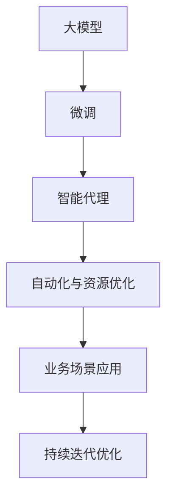

                 

# 【大模型应用开发 动手做AI Agent】流程的自动化与资源的优化

## 1. 背景介绍

人工智能（AI）作为现代科技的重要分支，已经广泛应用于各行各业，包括但不限于自动驾驶、智能客服、医疗诊断、金融交易等。其中，智能代理（AI Agent）是实现自动化决策和任务执行的核心技术，广泛应用于大数据处理、任务调度、自动化交易等领域。近年来，随着深度学习和大模型（如BERT、GPT等）的兴起，利用大模型训练的AI Agent性能不断提升，广泛应用于更多场景。

本文旨在探讨大模型应用开发中的自动化与资源优化流程，从核心概念到实现细节，一步步指导开发者构建高效、可扩展、高精度的AI Agent。

## 2. 核心概念与联系

### 2.1 核心概念概述

- **大模型（Large Model）**：指具有大规模参数量的深度学习模型，如BERT、GPT等。这些模型通常经过大规模无监督预训练，具备强大的语言建模和知识表示能力。
- **智能代理（AI Agent）**：指通过编程和训练的智能体，能够在一定环境下自动执行任务或决策。AI Agent的训练通常依赖于大模型，并在此基础上进行微调或优化。
- **自动化与资源优化**：指在AI Agent开发过程中，通过一系列工具和流程自动化任务执行，同时优化资源配置，提高效率和性能。
- **微调（Fine-Tuning）**：在大模型基础上，通过有监督学习对模型参数进行调整，以适应特定任务。

这些核心概念构成了AI Agent开发的理论基础和实践框架。理解这些概念，将有助于把握AI Agent开发的全局视角，并针对具体任务进行详细设计。

### 2.2 核心概念原理和架构的 Mermaid 流程图



这个流程图展示了从大模型到智能代理的整个流程，包括微调、自动化与资源优化、业务场景应用，以及持续迭代优化的过程。

## 3. 核心算法原理 & 具体操作步骤

### 3.1 算法原理概述

AI Agent的开发通常分为两个阶段：预训练和微调。预训练阶段使用大规模无标签数据对大模型进行自监督学习，使其具备强大的语义理解能力。微调阶段则针对具体业务场景，使用标注数据对模型进行有监督训练，使其能够执行特定任务。

### 3.2 算法步骤详解

#### 3.2.1 预训练阶段

1. **选择大模型**：选择合适的预训练模型，如BERT、GPT等。
2. **准备数据集**：准备预训练所需的无标签数据集，通常使用大规模互联网数据或特定领域的文本数据。
3. **配置预训练任务**：定义预训练任务，如自回归语言建模、掩码语言模型等。
4. **训练大模型**：使用预训练数据集对大模型进行训练，更新模型参数。

#### 3.2.2 微调阶段

1. **选择任务**：根据具体业务需求，选择合适的微调任务，如文本分类、情感分析、命名实体识别等。
2. **准备数据集**：准备微调所需的标注数据集，通常由少量人工标注数据构成。
3. **配置微调任务**：定义微调任务，选择合适的输出层和损失函数。
4. **配置优化器**：选择优化算法和超参数，如学习率、批大小等。
5. **微调模型**：使用微调数据集对模型进行训练，更新模型参数。

#### 3.2.3 自动化与资源优化

1. **自动化流程设计**：使用流水线框架（如Kubeflow、TFX等）设计自动化流程，包括数据预处理、模型训练、评估等环节。
2. **资源优化**：使用资源管理系统（如Kubernetes、Slurm等）进行资源分配和调度，确保训练和推理任务的效率。
3. **模型压缩和剪枝**：对训练好的模型进行压缩和剪枝，减小模型大小，提高推理速度。
4. **模型量化**：将浮点模型转换为定点模型，降低计算资源消耗，提高计算效率。

### 3.3 算法优缺点

#### 3.3.1 优点

1. **高效性**：通过自动化流程设计和资源优化，大大提高了AI Agent开发的效率和性能。
2. **可扩展性**：自动化流程和资源管理系统使得AI Agent的扩展和部署变得更加灵活。
3. **高精度**：大模型的预训练和微调能够提供高质量的语义表示和任务执行能力。

#### 3.3.2 缺点

1. **资源需求高**：大模型和AI Agent的开发需要大量的计算资源和存储空间。
2. **开发成本高**：自动化流程设计和资源优化的复杂性增加了开发成本。
3. **可解释性不足**：大模型和AI Agent的决策过程复杂，难以解释和调试。

### 3.4 算法应用领域

AI Agent的自动化与资源优化流程广泛应用于以下几个领域：

1. **大数据处理**：自动化的数据清洗、特征提取和模型训练，提高了大数据处理的效率和准确性。
2. **任务调度**：智能化的任务调度算法，如Google的Borg、Amazon的ECS，使得任务执行更加高效。
3. **自动化交易**：利用AI Agent进行股票交易、风险管理等，提高了交易系统的稳定性和收益。
4. **自然语言处理**：用于智能客服、自动回复、机器翻译等场景，提高了用户交互体验。

## 4. 数学模型和公式 & 详细讲解 & 举例说明

### 4.1 数学模型构建

以文本分类任务为例，构建微调模型的数学模型。假设文本输入为$x$，输出为$y$，模型参数为$\theta$，则微调模型的损失函数为：

$$
\mathcal{L}(\theta; x, y) = -\log P(y|x; \theta)
$$

其中$P(y|x; \theta)$表示模型在输入$x$下输出$y$的概率，可以通过Softmax函数计算。

### 4.2 公式推导过程

在微调过程中，模型的参数更新公式为：

$$
\theta \leftarrow \theta - \eta \nabla_{\theta}\mathcal{L}(\theta; x, y)
$$

其中$\eta$为学习率，$\nabla_{\theta}\mathcal{L}(\theta; x, y)$为损失函数对参数$\theta$的梯度。

在训练过程中，通过反向传播算法计算梯度，并使用优化器进行参数更新。常见的优化器包括SGD、Adam等。

### 4.3 案例分析与讲解

以BERT微调为例，其微调流程可以分为以下步骤：

1. **准备数据集**：选择并标注文本分类数据集。
2. **配置模型**：使用BERT作为预训练模型，并配置任务层（如Dense层、Attention层等）。
3. **配置优化器**：设置学习率、批大小、优化器等超参数。
4. **微调模型**：使用训练集进行有监督训练，并使用验证集进行模型评估和调参。

## 5. 项目实践：代码实例和详细解释说明

### 5.1 开发环境搭建

以下是使用Python和TensorFlow进行BERT微调的开发环境搭建流程：

1. 安装Anaconda：
```bash
conda create -n pytorch-env python=3.8
conda activate pytorch-env
```

2. 安装TensorFlow和相关库：
```bash
pip install tensorflow transformers datasets tensorflow-addons
```

3. 配置数据路径和模型路径：
```python
import os
os.environ['TRAINING_DATA_DIR'] = 'path/to/training_data'
os.environ['CHECKPOINT_DIR'] = 'path/to/checkpoint'
```

### 5.2 源代码详细实现

以下是使用TensorFlow和Transformers库进行BERT微调的代码实现：

```python
import tensorflow as tf
import transformers
from transformers import BertTokenizer, TFBertForSequenceClassification

# 配置数据集和模型
train_data_path = 'path/to/train_data'
valid_data_path = 'path/to/valid_data'
model_name = 'bert-base-uncased'

tokenizer = BertTokenizer.from_pretrained(model_name)
model = TFBertForSequenceClassification.from_pretrained(model_name, num_labels=num_labels)

# 加载数据集
train_dataset = ...
valid_dataset = ...

# 配置模型超参数
learning_rate = 2e-5
num_epochs = 5
batch_size = 16
...

# 配置优化器
optimizer = tf.keras.optimizers.Adam(learning_rate=learning_rate)
...

# 微调模型
@tf.function
def train_step(inputs, labels):
    with tf.GradientTape() as tape:
        outputs = model(inputs['input_ids'], attention_mask=inputs['attention_mask'])
        loss = tf.keras.losses.SparseCategoricalCrossentropy()(labels, outputs.logits)
    gradients = tape.gradient(loss, model.trainable_variables)
    optimizer.apply_gradients(zip(gradients, model.trainable_variables))
    return loss

@tf.function
def eval_step(inputs):
    outputs = model(inputs['input_ids'], attention_mask=inputs['attention_mask'])
    probabilities = tf.nn.softmax(outputs.logits, axis=-1)
    return probabilities

# 微调过程
for epoch in range(num_epochs):
    for batch in train_dataset:
        train_loss = train_step(batch)
        ...

# 评估过程
for batch in valid_dataset:
    eval_probabilities = eval_step(batch)
    ...
```

### 5.3 代码解读与分析

以上代码实现了使用BERT进行文本分类任务的微调过程。其中，

- `BertTokenizer`用于分词和编码，`TFBertForSequenceClassification`用于配置分类任务层。
- `train_step`和`eval_step`分别定义了训练和评估的计算图，使用`tf.function`进行优化。
- 训练过程中，使用`Adam`优化器进行参数更新，同时通过`tf.GradientTape`计算梯度。
- 评估过程中，计算预测概率，并使用精度、召回率等指标评估模型性能。

## 6. 实际应用场景

### 6.1 智能客服系统

智能客服系统是AI Agent应用的重要场景之一。利用BERT等大模型训练的客服模型，能够理解用户问题并自动生成回复，提升客服效率和用户体验。通过自动化流程设计，可以在数据清洗、模型训练、评估等环节自动化处理，同时使用资源管理系统进行资源优化，确保系统稳定运行。

### 6.2 金融交易

在金融交易领域，AI Agent用于实时交易决策、风险管理等。利用BERT等大模型进行股票价格预测、市场情绪分析等，能够帮助投资者做出更准确的决策。通过自动化流程设计和资源优化，提高了交易系统的稳定性和效率。

### 6.3 自然语言处理

自然语言处理是AI Agent应用的另一个重要场景。利用BERT等大模型进行文本分类、情感分析、命名实体识别等，能够提升NLP系统的准确性和效率。通过自动化流程设计和资源优化，提高了NLP系统的扩展性和可靠性。

## 7. 工具和资源推荐

### 7.1 学习资源推荐

- **《TensorFlow教程》**：官方文档，介绍了TensorFlow的基础知识和高级应用。
- **《Transformers官方文档》**：官方文档，提供了Transformers库的使用方法和示例。
- **《深度学习与强化学习》**：斯坦福大学Andrew Ng教授的课程，涵盖了深度学习的基本概念和前沿技术。
- **《Kubeflow教程》**：官方文档，介绍了Kubeflow的部署和使用。

### 7.2 开发工具推荐

- **TensorFlow**：广泛使用的深度学习框架，支持分布式训练和推理。
- **Kubeflow**：基于Kubernetes的机器学习流程自动化平台。
- **Jupyter Notebook**：交互式的Python代码编辑器，适合原型设计和代码调试。

### 7.3 相关论文推荐

- **Attention is All You Need**：Transformer论文，提出了自注意力机制，推动了NLP预训练模型的发展。
- **BERT: Pre-training of Deep Bidirectional Transformers for Language Understanding**：BERT论文，提出了预训练语言模型的新范式。
- **Parameter-Efficient Transfer Learning for NLP**：提出Adapter等参数高效微调方法，减少了微调过程中的计算资源消耗。

## 8. 总结：未来发展趋势与挑战

### 8.1 研究成果总结

本文系统介绍了大模型应用开发中的自动化与资源优化流程，从核心概念到实现细节，一步步指导开发者构建高效、可扩展、高精度的AI Agent。通过深入探讨预训练、微调、自动化流程设计、资源优化等环节，展示了大模型在AI Agent开发中的广泛应用和前景。

### 8.2 未来发展趋势

未来，大模型应用开发将呈现以下几个发展趋势：

1. **自动化流程更加成熟**：自动化流程设计和资源管理系统将更加成熟，支持更复杂的任务和场景。
2. **分布式训练和推理**：分布式计算和资源调度技术将进一步提升训练和推理效率。
3. **跨模态AI Agent**：多模态数据融合技术将推动跨模态AI Agent的发展，如文本-图像-语音结合。
4. **智能化决策**：基于因果推理、强化学习等前沿技术，构建更智能、更可靠的AI Agent。

### 8.3 面临的挑战

虽然大模型应用开发已经取得了显著进展，但在实际应用中仍面临诸多挑战：

1. **数据获取和标注**：大规模数据获取和标注成本高，且标注质量难以保证。
2. **模型可解释性**：大模型的决策过程复杂，难以解释和调试。
3. **资源需求高**：大模型和AI Agent的开发需要大量的计算资源和存储空间。
4. **持续优化**：AI Agent需要持续优化和更新，以适应数据分布的变化。

### 8.4 研究展望

未来，大模型应用开发需要重点解决以下几个问题：

1. **数据增强技术**：利用数据增强技术提高模型泛化性和鲁棒性。
2. **可解释性技术**：通过可解释性技术提高模型的透明度和可靠性。
3. **资源优化技术**：采用资源优化技术提高AI Agent的效率和性能。
4. **跨领域应用**：推动AI Agent跨领域应用，提升其在不同场景中的性能。

通过在这些方面的不断探索和创新，将推动大模型应用开发迈向更高的层次，为各行各业提供更智能、更高效的解决方案。

## 9. 附录：常见问题与解答

**Q1：大模型和AI Agent的自动化流程如何设计？**

A: 设计自动化流程需要考虑数据预处理、模型训练、模型评估、模型部署等环节。通常使用流水线框架（如Kubeflow、TFX等）进行自动化设计，并通过配置文件和脚本实现自动化执行。

**Q2：如何优化AI Agent的资源配置？**

A: 使用资源管理系统（如Kubernetes、Slurm等）进行资源调度和管理，同时对模型进行压缩和剪枝，减少计算和存储资源的消耗。

**Q3：AI Agent的可解释性有哪些方法？**

A: 采用可解释性技术，如特征重要性分析、LIME、SHAP等，帮助理解和解释AI Agent的决策过程。

**Q4：如何提高AI Agent的泛化性？**

A: 利用数据增强技术，如回译、近义词替换等，丰富训练数据，提高模型的泛化性和鲁棒性。

---

作者：禅与计算机程序设计艺术 / Zen and the Art of Computer Programming

