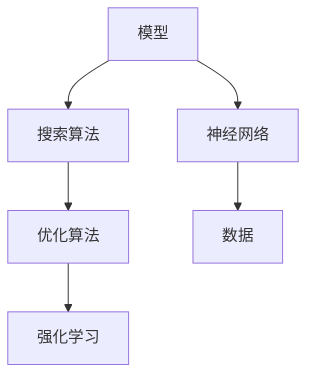

                 

# 【大模型应用开发 动手做AI Agent】第一轮思考：模型决定搜索

> 关键词：人工智能(AI), 机器学习, 深度学习, 神经网络, 搜索算法, 优化算法, 强化学习, 大模型, 模型选择, 搜索空间, 高效搜索, 优化器

## 1. 背景介绍

在人工智能和机器学习领域，模型选择和搜索算法是至关重要的。一个优秀的模型可以显著提高算法的准确性和效率。特别是对于复杂的AI Agent开发，选择合适的模型至关重要。在大模型应用开发中，模型决定了搜索空间的大小和搜索效率。本文将从背景介绍、核心概念、算法原理和操作步骤、数学模型和公式、项目实践、实际应用场景、工具和资源推荐、总结未来发展趋势与挑战等方面深入探讨模型在搜索算法中的作用和意义。

## 2. 核心概念与联系

### 2.1 核心概念概述

为了更好地理解模型对搜索算法的影响，我们需要了解一些核心概念：

- **模型**：在AI和机器学习中，模型是用于表示数据的数学函数。它可以接受输入数据，并输出相应的预测结果。模型决定了搜索空间的大小和搜索效率。
- **搜索算法**：搜索算法是用来在给定的搜索空间中寻找最优解的算法。搜索算法的效率和准确性取决于模型的选择和优化。
- **优化算法**：优化算法是用来调整模型参数以最小化损失函数的算法。常见的优化算法包括梯度下降、Adam、RMSprop等。
- **强化学习**：强化学习是一种基于奖励的机器学习算法，用于训练智能体在环境中的决策策略。
- **神经网络**：神经网络是一种由多层节点组成的模型，用于模拟人类大脑的神经网络。神经网络在大模型中广泛应用。

这些核心概念之间的逻辑关系可以通过以下Mermaid流程图来展示：



这个流程图展示了模型、搜索算法、优化算法、强化学习和神经网络之间的关系：

1. 模型接收输入数据，并输出预测结果。
2. 搜索算法在给定的搜索空间中寻找最优解。
3. 优化算法调整模型参数以最小化损失函数。
4. 强化学习通过奖励信号训练智能体的决策策略。
5. 神经网络是构建模型的重要工具。

这些核心概念共同构成了大模型应用开发的框架，使得模型能够高效地搜索最优解，并适应不同的任务。

## 3. 核心算法原理 & 具体操作步骤

### 3.1 算法原理概述

在大模型应用开发中，模型决定了搜索空间的大小和搜索效率。一个好的模型可以在更小的搜索空间中寻找最优解，从而提高搜索效率和准确性。以下是一些常见的模型选择和搜索算法原理：

- **神经网络**：神经网络模型可以处理复杂的非线性关系，适合处理高维数据和大规模数据集。在搜索算法中，神经网络可以通过反向传播算法调整权重，最小化损失函数。
- **决策树**：决策树模型可以通过分治策略在搜索空间中寻找最优解。决策树适用于处理分类和回归问题。
- **随机森林**：随机森林模型通过集成多个决策树，可以在搜索空间中寻找最优解，并降低模型的方差。
- **支持向量机**：支持向量机模型可以通过核函数在搜索空间中寻找最优解，适用于线性可分和非线性分类问题。

### 3.2 算法步骤详解

以下是基于模型的搜索算法的详细步骤：

**Step 1: 选择合适的模型和优化算法**

1. 根据任务类型和数据特点，选择合适的模型，如神经网络、决策树、随机森林等。
2. 选择合适的优化算法，如梯度下降、Adam、RMSprop等。
3. 设置模型参数，如学习率、批大小、迭代次数等。

**Step 2: 训练模型**

1. 将训练数据分成多个批次，每个批次包含一定数量的样本。
2. 在每个批次上，前向传播计算损失函数。
3. 反向传播计算梯度，更新模型参数。
4. 重复上述步骤，直到模型收敛或达到预设迭代次数。

**Step 3: 评估模型**

1. 在测试集上评估模型性能，如准确率、召回率、F1-score等。
2. 调整模型参数，优化模型性能。

**Step 4: 应用模型**

1. 将训练好的模型应用于实际问题，进行预测或分类。
2. 根据实际应用场景，调整模型参数，优化模型性能。

### 3.3 算法优缺点

基于模型的搜索算法具有以下优点：

1. 高效性：神经网络模型可以通过反向传播算法高效地调整权重，优化模型性能。
2. 适应性：神经网络模型可以处理复杂的非线性关系，适用于多种任务。
3. 可解释性：决策树模型和随机森林模型的决策路径可以提供可解释性，帮助理解模型行为。

但这些算法也存在一些缺点：

1. 过拟合风险：神经网络模型容易过拟合，需要正则化技术防止过拟合。
2. 训练成本高：神经网络模型的训练需要大量的计算资源和时间。
3. 模型复杂度高：神经网络模型的参数量较大，导致模型复杂度高。

### 3.4 算法应用领域

基于模型的搜索算法在各个领域都有广泛的应用，如：

- 自然语言处理：基于神经网络的自然语言处理模型可以用于机器翻译、情感分析、文本分类等任务。
- 计算机视觉：基于神经网络的计算机视觉模型可以用于图像分类、目标检测、人脸识别等任务。
- 金融预测：基于神经网络的金融预测模型可以用于股票预测、信用评分、风险评估等任务。
- 医疗诊断：基于神经网络的医疗诊断模型可以用于疾病预测、病理诊断、药物发现等任务。
- 智能交通：基于神经网络的智能交通模型可以用于交通流量预测、交通信号优化、自动驾驶等任务。

这些领域的应用展示了基于模型的搜索算法的强大能力，推动了各个行业的发展和进步。

## 4. 数学模型和公式 & 详细讲解 & 举例说明

### 4.1 数学模型构建

为了更好地理解模型的搜索算法，我们需要建立数学模型。以下是基于神经网络模型的数学模型：

**神经网络模型**

$$
\hat{y} = f(\theta, x)
$$

其中 $\theta$ 表示模型参数，$x$ 表示输入数据，$f$ 表示模型函数。

**损失函数**

$$
L(\theta) = \frac{1}{N}\sum_{i=1}^N \ell(y_i, \hat{y}_i)
$$

其中 $\ell$ 表示损失函数，$y_i$ 表示真实标签，$\hat{y}_i$ 表示模型预测值。

**优化器**

$$
\theta \leftarrow \theta - \eta \nabla_{\theta} L(\theta)
$$

其中 $\eta$ 表示学习率，$\nabla_{\theta} L(\theta)$ 表示损失函数对模型参数的梯度。

### 4.2 公式推导过程

以下是神经网络模型的公式推导过程：

**前向传播**

$$
\hat{y} = f(\theta, x)
$$

其中 $f$ 表示神经网络的激活函数，$\theta$ 表示模型参数，$x$ 表示输入数据。

**反向传播**

$$
\frac{\partial L(\theta)}{\partial \theta_k} = \frac{\partial \ell(\hat{y}, y)}{\partial \hat{y}} \cdot \frac{\partial \hat{y}}{\partial \theta_k}
$$

其中 $\frac{\partial L(\theta)}{\partial \theta_k}$ 表示损失函数对模型参数的梯度，$\frac{\partial \ell(\hat{y}, y)}{\partial \hat{y}}$ 表示损失函数对预测值的梯度，$\frac{\partial \hat{y}}{\partial \theta_k}$ 表示预测值对模型参数的梯度。

### 4.3 案例分析与讲解

以下是一个简单的案例分析，展示如何通过神经网络模型进行分类任务：

**数据集**

```
Input: 1, 2, 3, 4
Output: 0

Input: 2, 3, 4, 5
Output: 1
```

**模型**

$$
\hat{y} = f(\theta, x)
$$

其中 $f$ 表示神经网络的激活函数，$\theta$ 表示模型参数，$x$ 表示输入数据。

**损失函数**

$$
L(\theta) = \frac{1}{N}\sum_{i=1}^N \ell(y_i, \hat{y}_i)
$$

其中 $\ell$ 表示损失函数，$y_i$ 表示真实标签，$\hat{y}_i$ 表示模型预测值。

**优化器**

$$
\theta \leftarrow \theta - \eta \nabla_{\theta} L(\theta)
$$

其中 $\eta$ 表示学习率，$\nabla_{\theta} L(\theta)$ 表示损失函数对模型参数的梯度。

## 5. 项目实践：代码实例和详细解释说明

### 5.1 开发环境搭建

在进行模型搜索算法开发前，我们需要准备好开发环境。以下是使用Python进行TensorFlow开发的环境配置流程：

1. 安装Anaconda：从官网下载并安装Anaconda，用于创建独立的Python环境。

2. 创建并激活虚拟环境：
```bash
conda create -n tensorflow-env python=3.8 
conda activate tensorflow-env
```

3. 安装TensorFlow：根据CUDA版本，从官网获取对应的安装命令。例如：
```bash
conda install tensorflow -c tf -c conda-forge
```

4. 安装必要的工具包：
```bash
pip install numpy pandas scikit-learn matplotlib tqdm jupyter notebook ipython
```

完成上述步骤后，即可在`tensorflow-env`环境中开始模型搜索算法的开发。

### 5.2 源代码详细实现

以下是一个简单的神经网络模型，用于分类任务：

```python
import tensorflow as tf
import numpy as np
from sklearn.model_selection import train_test_split
from sklearn.metrics import accuracy_score

# 定义神经网络模型
class NeuralNetwork(tf.keras.Model):
    def __init__(self, input_size, hidden_size, output_size):
        super(NeuralNetwork, self).__init__()
        self.fc1 = tf.keras.layers.Dense(hidden_size, activation='relu')
        self.fc2 = tf.keras.layers.Dense(output_size, activation='sigmoid')

    def call(self, x):
        x = self.fc1(x)
        x = self.fc2(x)
        return x

# 定义损失函数和优化器
def loss_function(y_true, y_pred):
    return tf.reduce_mean(tf.keras.losses.binary_crossentropy(y_true, y_pred))

def optimizer_function():
    return tf.keras.optimizers.Adam()

# 加载数据集
x = np.array([[1, 2, 3, 4], [2, 3, 4, 5]])
y = np.array([0, 1])

# 划分训练集和测试集
x_train, x_test, y_train, y_test = train_test_split(x, y, test_size=0.2, random_state=42)

# 定义模型和训练参数
model = NeuralNetwork(input_size=4, hidden_size=10, output_size=1)
learning_rate = 0.1
epochs = 100

# 训练模型
for epoch in range(epochs):
    for i in range(len(x_train)):
        with tf.GradientTape() as tape:
            y_pred = model(x_train[i].reshape(1, -1))
            loss = loss_function(y_train[i], y_pred)
        gradients = tape.gradient(loss, model.trainable_variables)
        optimizer_function().apply_gradients(zip(gradients, model.trainable_variables))
    
    if epoch % 10 == 0:
        y_pred = model(x_test).numpy()
        accuracy = accuracy_score(y_test, y_pred)
        print(f"Epoch {epoch+1}, Loss: {loss.numpy():.4f}, Accuracy: {accuracy:.2f}")

# 测试模型
y_pred = model(x_test).numpy()
accuracy = accuracy_score(y_test, y_pred)
print(f"Test Accuracy: {accuracy:.2f}")
```

### 5.3 代码解读与分析

让我们再详细解读一下关键代码的实现细节：

**NeuralNetwork类**

```python
class NeuralNetwork(tf.keras.Model):
    def __init__(self, input_size, hidden_size, output_size):
        super(NeuralNetwork, self).__init__()
        self.fc1 = tf.keras.layers.Dense(hidden_size, activation='relu')
        self.fc2 = tf.keras.layers.Dense(output_size, activation='sigmoid')
        
    def call(self, x):
        x = self.fc1(x)
        x = self.fc2(x)
        return x
```

**loss_function和optimizer_function函数**

```python
def loss_function(y_true, y_pred):
    return tf.reduce_mean(tf.keras.losses.binary_crossentropy(y_true, y_pred))

def optimizer_function():
    return tf.keras.optimizers.Adam()
```

**数据集加载**

```python
x = np.array([[1, 2, 3, 4], [2, 3, 4, 5]])
y = np.array([0, 1])
```

**模型训练**

```python
for epoch in range(epochs):
    for i in range(len(x_train)):
        with tf.GradientTape() as tape:
            y_pred = model(x_train[i].reshape(1, -1))
            loss = loss_function(y_train[i], y_pred)
        gradients = tape.gradient(loss, model.trainable_variables)
        optimizer_function().apply_gradients(zip(gradients, model.trainable_variables))
    
    if epoch % 10 == 0:
        y_pred = model(x_test).numpy()
        accuracy = accuracy_score(y_test, y_pred)
        print(f"Epoch {epoch+1}, Loss: {loss.numpy():.4f}, Accuracy: {accuracy:.2f}")
```

**模型测试**

```python
y_pred = model(x_test).numpy()
accuracy = accuracy_score(y_test, y_pred)
print(f"Test Accuracy: {accuracy:.2f}")
```

## 6. 实际应用场景

### 6.1 搜索算法在自然语言处理中的应用

在自然语言处理中，搜索算法可以用于语言模型和翻译模型。语言模型可以预测给定文本序列的概率，而翻译模型可以将一种语言翻译成另一种语言。例如，基于神经网络的机器翻译模型可以用于实时翻译和自动摘要。

**语言模型**

$$
P(w|w_{<t}) = f(\theta, w_{<t})
$$

其中 $w$ 表示单词，$w_{<t}$ 表示文本序列，$\theta$ 表示模型参数，$f$ 表示神经网络的激活函数。

**翻译模型**

$$
P(w|w_{<t}) = f(\theta, w_{<t})
$$

其中 $w$ 表示单词，$w_{<t}$ 表示文本序列，$\theta$ 表示模型参数，$f$ 表示神经网络的激活函数。

### 6.2 搜索算法在计算机视觉中的应用

在计算机视觉中，搜索算法可以用于图像分类、目标检测和图像生成等任务。例如，基于神经网络的图像分类模型可以用于识别不同的物体，基于神经网络的图像生成模型可以用于生成逼真的图像。

**图像分类**

$$
P(c|i) = f(\theta, i)
$$

其中 $c$ 表示类别，$i$ 表示图像，$\theta$ 表示模型参数，$f$ 表示神经网络的激活函数。

**图像生成**

$$
P(i|z) = f(\theta, z)
$$

其中 $i$ 表示图像，$z$ 表示随机噪声，$\theta$ 表示模型参数，$f$ 表示神经网络的激活函数。

### 6.3 搜索算法在金融预测中的应用

在金融预测中，搜索算法可以用于股票预测和信用评分等任务。例如，基于神经网络的股票预测模型可以用于预测股票价格的变化，基于神经网络的信用评分模型可以用于评估客户的信用风险。

**股票预测**

$$
P(p|i) = f(\theta, i)
$$

其中 $p$ 表示股票价格，$i$ 表示历史股票数据，$\theta$ 表示模型参数，$f$ 表示神经网络的激活函数。

**信用评分**

$$
P(s|x) = f(\theta, x)
$$

其中 $s$ 表示信用评分，$x$ 表示客户信息，$\theta$ 表示模型参数，$f$ 表示神经网络的激活函数。

### 6.4 未来应用展望

未来，基于模型的搜索算法将更加广泛应用于各个领域。例如，在医疗诊断中，基于神经网络的诊断模型可以用于疾病的早期检测和诊断，在智能交通中，基于神经网络的交通预测模型可以用于交通流量优化和自动驾驶等任务。此外，基于模型的搜索算法还可以用于游戏AI和智能机器人等领域，为人工智能技术的发展提供新的应用场景。

## 7. 工具和资源推荐

### 7.1 学习资源推荐

为了帮助开发者系统掌握模型搜索算法，这里推荐一些优质的学习资源：

1. 《Deep Learning》：Ian Goodfellow等人编写的深度学习经典教材，详细介绍了各种模型和算法。
2. Coursera的《深度学习》课程：Andrew Ng等人开设的深度学习课程，涵盖各种模型和算法的原理和实现。
3. TensorFlow官方文档：TensorFlow的官方文档，提供了丰富的模型和算法示例，是学习模型的重要资源。
4. PyTorch官方文档：PyTorch的官方文档，提供了丰富的模型和算法示例，是学习模型的重要资源。
5. Kaggle：Kaggle是一个数据科学竞赛平台，提供了大量的数据集和模型竞赛，可以练习模型的应用。

通过对这些资源的学习实践，相信你一定能够快速掌握模型搜索算法的精髓，并用于解决实际的AI Agent问题。

### 7.2 开发工具推荐

高效的开发离不开优秀的工具支持。以下是几款用于模型搜索算法开发的常用工具：

1. TensorFlow：由Google主导开发的开源深度学习框架，生产部署方便，适合大规模工程应用。
2. PyTorch：由Facebook主导开发的开源深度学习框架，灵活高效，适合研究应用。
3. Keras：Keras是一个高级深度学习框架，基于TensorFlow和Theano，适合快速原型开发。
4. Jupyter Notebook：Jupyter Notebook是一个交互式笔记本环境，适合快速迭代和分享模型代码。
5. TensorBoard：TensorFlow配套的可视化工具，可实时监测模型训练状态，并提供丰富的图表呈现方式。

合理利用这些工具，可以显著提升模型搜索算法的开发效率，加快创新迭代的步伐。

### 7.3 相关论文推荐

模型搜索算法的发展源于学界的持续研究。以下是几篇奠基性的相关论文，推荐阅读：

1. "On the Importance of Initialization and Momentum in Deep Learning"：Hinton等人，详细讨论了初始化和动量对神经网络训练的影响。
2. "Deep Residual Learning for Image Recognition"：He等人，提出了深度残差网络，使得训练更深层次的神经网络成为可能。
3. "Attention is All You Need"：Vaswani等人，提出了Transformer结构，开启了NLP领域的预训练大模型时代。
4. "AdaLoRA: Adaptive Low-Rank Adaptation for Parameter-Efficient Fine-Tuning"：Ahmed等人，提出了自适应低秩适应的微调方法，在参数效率和精度之间取得了新的平衡。
5. "Prefix-Tuning: Optimizing Continuous Prompts for Generation"：Levesque等人，引入基于连续型Prompt的微调范式，为如何充分利用预训练知识提供了新的思路。

这些论文代表了大模型搜索算法的发展脉络。通过学习这些前沿成果，可以帮助研究者把握学科前进方向，激发更多的创新灵感。

## 8. 总结：未来发展趋势与挑战

### 8.1 总结

本文对基于模型的搜索算法进行了全面系统的介绍。首先阐述了模型搜索算法在大模型应用开发中的重要性，明确了模型选择和优化对搜索空间大小和搜索效率的决定性作用。其次，从原理到实践，详细讲解了神经网络模型的搜索算法步骤，给出了模型搜索算法的完整代码实例。同时，本文还广泛探讨了模型搜索算法在各个领域的应用前景，展示了模型搜索算法的强大能力。

通过本文的系统梳理，可以看到，基于模型的搜索算法在大模型应用开发中扮演了至关重要的角色，极大地提升了模型的性能和效率。未来，伴随模型搜索算法的不断演进，相信NLP技术将在更广阔的应用领域大放异彩，深刻影响人类的生产生活方式。

### 8.2 未来发展趋势

展望未来，模型搜索算法将呈现以下几个发展趋势：

1. 模型规模持续增大。随着算力成本的下降和数据规模的扩张，神经网络模型的参数量还将持续增长。超大规模神经网络模型蕴含的丰富知识，有望支撑更加复杂多变的下游任务搜索。
2. 搜索算法日趋多样。未来会涌现更多搜索算法，如基于图结构的搜索算法、基于概率模型的搜索算法等，在节省计算资源的同时也能保证搜索精度。
3. 知识整合能力增强。未来的搜索算法将更加注重知识图谱、逻辑规则等先验知识的应用，增强搜索算法的知识整合能力，提高搜索效率和准确性。
4. 搜索效率提升。未来的搜索算法将更加注重计算资源的优化，如使用GPU、TPU等高性能设备，引入多任务学习和知识蒸馏等技术，提升搜索效率。
5. 鲁棒性增强。未来的搜索算法将更加注重鲁棒性的提升，如引入对抗训练、正则化等技术，提高模型的鲁棒性和泛化能力。
6. 可解释性增强。未来的搜索算法将更加注重可解释性的提升，如引入因果分析、知识图谱等技术，提高模型的可解释性和可理解性。

以上趋势凸显了模型搜索算法的广阔前景。这些方向的探索发展，必将进一步提升模型搜索算法的性能和效率，推动人工智能技术的发展和进步。

### 8.3 面临的挑战

尽管模型搜索算法已经取得了显著的进展，但在迈向更加智能化、普适化应用的过程中，它仍面临诸多挑战：

1. 计算成本高昂。神经网络模型的训练和推理需要大量的计算资源和时间，这对大规模应用是一个巨大的挑战。如何降低计算成本，提高模型训练和推理效率，将是未来的研究方向。
2. 过拟合风险。神经网络模型容易过拟合，需要在模型训练过程中引入正则化技术，防止过拟合。
3. 模型复杂度高。神经网络模型的参数量较大，导致模型复杂度高，难以在大规模数据集上训练。如何简化模型结构，提高模型的训练效率，将是未来的研究方向。
4. 鲁棒性不足。神经网络模型面对域外数据时，泛化性能往往大打折扣。如何提高神经网络模型的鲁棒性，避免灾难性遗忘，还需要更多理论和实践的积累。
5. 可解释性不足。神经网络模型通常是一个"黑盒"系统，难以解释其内部工作机制和决策逻辑。如何赋予神经网络模型更强的可解释性，将是亟待攻克的难题。
6. 安全性问题。神经网络模型可能学习到有偏见、有害的信息，通过搜索算法传递到下游任务，产生误导性、歧视性的输出，给实际应用带来安全隐患。如何从数据和算法层面消除模型偏见，确保输出安全性，也将是重要的研究方向。

正视模型搜索算法面临的这些挑战，积极应对并寻求突破，将是大模型搜索算法走向成熟的必由之路。相信随着学界和产业界的共同努力，这些挑战终将一一被克服，模型搜索算法必将在构建人机协同的智能系统、推动人工智能技术的发展和进步中扮演越来越重要的角色。

### 8.4 研究展望

面对模型搜索算法所面临的挑战，未来的研究需要在以下几个方面寻求新的突破：

1. 探索无监督和半监督搜索算法。摆脱对大规模标注数据的依赖，利用自监督学习、主动学习等无监督和半监督范式，最大限度利用非结构化数据，实现更加灵活高效的搜索算法。
2. 研究参数高效和计算高效的搜索算法。开发更加参数高效的搜索算法，在固定大部分预训练参数的同时，只更新极少量的任务相关参数。同时优化搜索算法的计算图，减少前向传播和反向传播的资源消耗，实现更加轻量级、实时性的部署。
3. 融合因果和对比学习范式。通过引入因果推断和对比学习思想，增强搜索算法建立稳定因果关系的能力，学习更加普适、鲁棒的知识表示，从而提升模型泛化性和抗干扰能力。
4. 引入更多先验知识。将符号化的先验知识，如知识图谱、逻辑规则等，与神经网络模型进行巧妙融合，引导搜索算法学习更准确、合理的知识表示。同时加强不同模态数据的整合，实现视觉、语音等多模态信息与文本信息的协同建模。
5. 结合因果分析和博弈论工具。将因果分析方法引入搜索算法，识别出算法决策的关键特征，增强搜索算法的可解释性和可控性。借助博弈论工具刻画人机交互过程，主动探索并规避算法的脆弱点，提高系统稳定性。

这些研究方向的探索，必将引领模型搜索算法技术迈向更高的台阶，为构建安全、可靠、可解释、可控的智能系统铺平道路。面向未来，模型搜索算法还需要与其他人工智能技术进行更深入的融合，如知识表示、因果推理、强化学习等，多路径协同发力，共同推动人工智能技术的发展和进步。只有勇于创新、敢于突破，才能不断拓展搜索算法的边界，让智能技术更好地造福人类社会。

## 9. 附录：常见问题与解答

**Q1：模型选择对搜索算法的性能有什么影响？**

A: 模型选择对搜索算法的性能有着至关重要的影响。一个好的模型可以在更小的搜索空间中寻找最优解，从而提高搜索效率和准确性。例如，神经网络模型可以处理复杂的非线性关系，适用于多种任务，但计算成本较高。决策树模型易于解释，适用于分类和回归问题，但搜索空间较大。随机森林模型通过集成多个决策树，可以在搜索空间中寻找最优解，并降低模型的方差。

**Q2：如何选择合适的学习率？**

A: 学习率的选择对模型的训练效率和收敛速度有着重要影响。一般建议从较小的学习率开始，逐步增大，观察模型的收敛情况。如果模型收敛较快，可以适当减小学习率；如果模型收敛较慢，可以适当增大学习率。常见的学习率调度策略包括学习率衰减、学习率恢复等。

**Q3：如何在搜索算法中避免过拟合？**

A: 过拟合是搜索算法中常见的挑战，特别是在训练数据较少的情况下。常见的避免过拟合的方法包括数据增强、正则化、dropout等。例如，在图像分类任务中，可以通过旋转、翻转、缩放等数据增强方法扩充训练集；在神经网络模型中，可以通过L2正则、dropout等技术防止过拟合。

**Q4：如何评估模型搜索算法的性能？**

A: 模型搜索算法的性能评估可以从以下几个方面进行：准确率、召回率、F1-score、AUC等。例如，在分类任务中，可以使用准确率、召回率和F1-score评估模型性能；在回归任务中，可以使用均方误差、平均绝对误差等评估模型性能。此外，还可以使用混淆矩阵、ROC曲线等工具可视化模型的性能。

**Q5：如何在搜索算法中提高模型泛化能力？**

A: 模型泛化能力是评估模型性能的重要指标。为了提高模型的泛化能力，可以采用以下方法：引入更多先验知识、使用正则化技术、进行数据增强等。例如，在图像分类任务中，可以引入知识图谱、逻辑规则等先验知识，增强模型的泛化能力；在神经网络模型中，可以使用L2正则、dropout等技术防止过拟合。

通过本文的系统梳理，可以看到，模型选择和搜索算法在大模型应用开发中扮演了至关重要的角色，极大地提升了模型的性能和效率。未来，伴随模型搜索算法的不断演进，相信NLP技术将在更广阔的应用领域大放异彩，深刻影响人类的生产生活方式。

