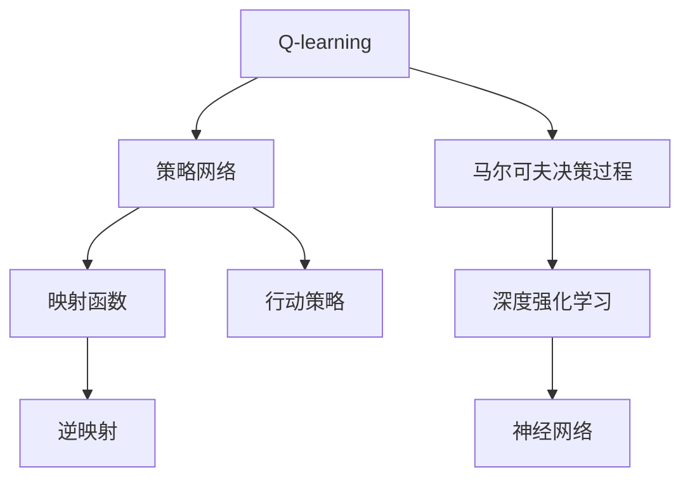

                 

# 一切皆是映射：AI Q-learning策略网络的搭建

> 关键词：
    - Q-learning
    - 策略网络
    - 映射函数
    - 强化学习
    - 马尔可夫决策过程
    - 深度强化学习
    - 行动策略
    - 逆映射
    - 线性回归
    - 神经网络

## 1. 背景介绍

### 1.1 问题由来

在AI研究领域，强化学习（Reinforcement Learning, RL）已经成为一个不可或缺的重要分支。它模拟了智能体（agent）在一个动态环境中通过学习策略，以最大化累积奖励（cumulative reward）的过程。强化学习在各种复杂任务，包括游戏、机器人控制、路径规划、资源优化等领域取得了显著的成果。

Q-learning作为强化学习的一种经典算法，通过学习策略网络的Q值，指导智能体在每个状态-动作对下的最优选择，从而逐步向最优策略逼近。而策略网络则是一个映射函数，负责将状态映射到动作，是Q-learning算法中的一个核心组件。

然而，传统Q-learning算法在策略网络的设计和优化上存在一定局限性，往往需要手工设计动作空间和动作映射，且在非连续状态空间和连续动作空间中的应用较为困难。此外，随着动作空间和状态空间的增大，策略网络变得非常复杂，训练难度增加。

为了应对这些挑战，近年来兴起的深度强化学习将策略网络设计为神经网络，可以更灵活地处理复杂动作空间和状态空间，同时利用深度学习强大的特征提取能力，提升了策略学习的效率。

### 1.2 问题核心关键点

为更好地理解基于深度学习的Q-learning策略网络，本节将介绍几个密切相关的核心概念：

- Q-learning：一种基于值函数（value function）的强化学习算法，通过最大化状态-动作对的Q值来指导策略。
- 策略网络：一种神经网络，用于将状态映射到动作空间，是Q-learning中策略决策的核心。
- 映射函数：将状态映射到动作的数学函数，策略网络即为一种映射函数。
- 强化学习：一种学习理论，通过试错过程，学习到在复杂环境中最大化奖励的策略。
- 马尔可夫决策过程（MDP）：一种建模环境的数学框架，用于描述智能体的决策过程。
- 深度强化学习：结合深度学习和强化学习的技术，利用神经网络作为策略网络，提升了策略学习效率和泛化能力。
- 行动策略：智能体在每个状态下选择的动作策略。
- 逆映射：将动作映射回状态的概率分布，用于训练策略网络的逆过程。
- 线性回归：一种基础机器学习算法，用于解决回归问题，也是构建策略网络的常用方法。

这些核心概念之间的逻辑关系可以通过以下Mermaid流程图来展示：



这个流程图展示了大语言模型的核心概念及其之间的关系：

1. Q-learning通过状态-动作对的Q值指导策略。
2. 策略网络将状态映射到动作，是Q-learning中策略决策的核心。
3. 映射函数是一种数学函数，策略网络即为一种映射函数。
4. 强化学习通过试错过程，学习到在复杂环境中最大化奖励的策略。
5. 马尔可夫决策过程描述智能体的决策过程。
6. 深度强化学习结合深度学习和强化学习的技术，利用神经网络作为策略网络。
7. 行动策略是智能体在每个状态下选择的动作策略。
8. 逆映射将动作映射回状态的概率分布，用于训练策略网络的逆过程。
9. 线性回归是一种基础机器学习算法，用于构建策略网络。

这些概念共同构成了深度强化学习的学习和应用框架，使其能够在各种复杂环境中表现出优异的策略学习效果。

## 2. 核心概念与联系

### 2.1 核心概念概述

为更好地理解基于深度学习的Q-learning策略网络，本节将介绍几个密切相关的核心概念：

- 强化学习（Reinforcement Learning, RL）：一种通过试错过程，学习到在复杂环境中最大化奖励的策略的学习理论。
- Q-learning：一种基于值函数（value function）的强化学习算法，通过最大化状态-动作对的Q值来指导策略。
- 策略网络（Policy Network）：一种神经网络，用于将状态映射到动作空间，是Q-learning中策略决策的核心。
- 映射函数：将状态映射到动作的数学函数，策略网络即为一种映射函数。
- 马尔可夫决策过程（MDP）：一种建模环境的数学框架，用于描述智能体的决策过程。
- 深度强化学习（Deep Reinforcement Learning, DRL）：结合深度学习和强化学习的技术，利用神经网络作为策略网络，提升了策略学习效率和泛化能力。
- 行动策略（Action Strategy）：智能体在每个状态下选择的动作策略。
- 逆映射（Inverse Mapping）：将动作映射回状态的概率分布，用于训练策略网络的逆过程。
- 线性回归（Linear Regression）：一种基础机器学习算法，用于解决回归问题，也是构建策略网络的常用方法。

### 2.2 核心概念原理和架构的 Mermaid 流程图

为了更直观地展示这些概念之间的联系，我们可以使用Mermaid来构建一个概念图。

```mermaid
graph TB
    A[强化学习 (Reinforcement Learning, RL)] --> B[Q-learning]
    B --> C[策略网络 (Policy Network)]
    C --> D[映射函数 (Mapping Function)]
    B --> E[马尔可夫决策过程 (Markov Decision Process, MDP)]
    E --> F[深度强化学习 (Deep Reinforcement Learning, DRL)]
    F --> G[神经网络 (Neural Network)]
    G --> H[行动策略 (Action Strategy)]
    C --> I[逆映射 (Inverse Mapping)]
    I --> G
    B --> J[线性回归 (Linear Regression)]
```

这个流程图展示了强化学习、Q-learning、策略网络、映射函数、马尔可夫决策过程、深度强化学习、行动策略、逆映射、线性回归等概念之间的联系和转换关系。

1. 强化学习通过试错过程，学习到在复杂环境中最大化奖励的策略。
2. Q-learning是强化学习的一种经典算法，通过最大化状态-动作对的Q值来指导策略。
3. 策略网络是一种神经网络，用于将状态映射到动作空间，是Q-learning中策略决策的核心。
4. 映射函数将状态映射到动作的数学函数，策略网络即为一种映射函数。
5. 马尔可夫决策过程描述智能体的决策过程。
6. 深度强化学习结合深度学习和强化学习的技术，利用神经网络作为策略网络。
7. 行动策略是智能体在每个状态下选择的动作策略。
8. 逆映射将动作映射回状态的概率分布，用于训练策略网络的逆过程。
9. 线性回归是一种基础机器学习算法，用于构建策略网络。

## 3. 核心算法原理 & 具体操作步骤

### 3.1 算法原理概述

Q-learning是一种基于值函数的强化学习算法。它的核心思想是通过学习状态-动作对的Q值，指导智能体在每个状态-动作对下的最优选择，从而逐步向最优策略逼近。策略网络作为Q-learning算法中的一部分，用于将状态映射到动作空间。

Q-learning算法主要包含以下几个步骤：

1. 在每个时间步t，智能体观察到状态$s_t$。
2. 智能体根据当前状态$s_t$和策略网络输出动作$a_t$。
3. 环境根据动作$a_t$产生下一个状态$s_{t+1}$和奖励$r_{t+1}$。
4. 根据新状态$s_{t+1}$和动作$a_t$，更新策略网络的Q值。

### 3.2 算法步骤详解

以下是Q-learning策略网络的具体操作步骤：

1. **初始化策略网络**：策略网络通常是一个神经网络，输入为状态$s$，输出为动作分布$p(a|s)$。可以使用线性回归等方法来初始化策略网络。

2. **初始化Q值**：使用线性回归等方法，初始化Q值表$Q(s,a)$，其中$s$为状态，$a$为动作。

3. **选择动作**：在每个时间步t，智能体观察到状态$s_t$。根据策略网络输出动作分布$p(a|s_t)$，选择动作$a_t$。

4. **观察奖励和下一个状态**：环境根据动作$a_t$产生下一个状态$s_{t+1}$和奖励$r_{t+1}$。

5. **更新Q值**：根据下一个状态$s_{t+1}$和动作$a_t$，使用Q-learning更新策略网络的Q值：
   $$
   Q(s_t,a_t) \leftarrow Q(s_t,a_t) + \alpha (r_{t+1} + \gamma \max_{a} Q(s_{t+1},a) - Q(s_t,a_t))
   $$
   其中$\alpha$为学习率，$\gamma$为折扣因子，表示未来奖励的权重。

6. **更新策略网络**：将更新后的Q值表作为策略网络的训练样本，通过反向传播算法更新策略网络的参数。

7. **迭代训练**：重复步骤3至步骤6，直至策略网络的收敛。

### 3.3 算法优缺点

#### 优点：

1. **泛化能力强**：利用深度学习强大的特征提取能力，策略网络能够处理复杂的状态空间和动作空间。
2. **可解释性强**：深度强化学习的策略网络结构直观，易于理解和调试。
3. **适用于多任务**：深度策略网络可以通过微调，适应不同的任务和环境。
4. **计算效率高**：深度策略网络通常能够快速计算动作选择，提高智能体的决策效率。

#### 缺点：

1. **训练时间长**：深度策略网络需要大量样本进行训练，训练时间较长。
2. **过拟合风险**：深度策略网络参数较多，容易发生过拟合。
3. **动作空间过大**：在连续动作空间中，策略网络需要设计适当的动作表示方式。
4. **数据需求高**：深度策略网络需要大量标注数据进行训练，数据获取成本高。

### 3.4 算法应用领域

基于深度学习的Q-learning策略网络在许多领域都有广泛应用，如游戏AI、机器人控制、自动驾驶、路径规划等。以下是一些具体的应用场景：

- 游戏AI：在电子游戏领域，智能体通过学习最优策略，获得游戏胜利。如AlphaGo使用深度强化学习，击败了世界围棋冠军。
- 机器人控制：在机器人控制领域，智能体通过学习最优动作策略，实现自动化操作。如UAV自动飞行、工业机器人自动化操作等。
- 自动驾驶：在自动驾驶领域，智能体通过学习最优驾驶策略，实现自动驾驶。如特斯拉自动驾驶技术使用深度强化学习，进行环境感知和决策。
- 路径规划：在路径规划领域，智能体通过学习最优路径策略，优化交通系统。如无人配送车、自动驾驶汽车等。

除了这些应用场景，深度强化学习还在金融交易、工业控制、自然灾害预测等领域取得了重要进展。随着技术的不断进步，深度强化学习将在更多领域得到广泛应用。

## 4. 数学模型和公式 & 详细讲解 & 举例说明

### 4.1 数学模型构建

假设智能体在一个马尔可夫决策过程中，状态空间为$s \in \mathcal{S}$，动作空间为$a \in \mathcal{A}$，奖励为$r \in \mathbb{R}$。智能体的目标是通过学习最优策略，最大化累积奖励$R$。

定义策略网络$\pi(a|s)$，将状态$s$映射到动作$a$的概率分布。使用深度神经网络来实现策略网络。定义Q值函数$Q(s,a)$，表示在状态$s$下，采取动作$a$的累积奖励期望。

Q-learning算法的核心是Q值函数的更新，通过最大化状态-动作对的Q值，指导智能体的决策。

### 4.2 公式推导过程

假设智能体在时间步$t$观察到状态$s_t$，采取动作$a_t$，观察到下一个状态$s_{t+1}$和奖励$r_{t+1}$。

根据Q-learning算法，策略网络输出动作的概率分布$p(a|s_t)$，选择动作$a_t$。根据当前状态$s_t$和动作$a_t$，定义Q值：
$$
Q(s_t,a_t) = \alpha (r_{t+1} + \gamma \max_{a} Q(s_{t+1},a))
$$

根据策略网络输出概率分布，定义智能体选择动作的概率：
$$
p(a_t|s_t) = \pi(a_t|s_t)
$$

根据Q-learning算法，更新策略网络的参数：
$$
\theta_{\pi} \leftarrow \theta_{\pi} - \eta \nabla_{\theta_{\pi}} \mathcal{L}(\pi)
$$

其中，$\eta$为学习率，$\mathcal{L}(\pi)$为策略网络$\pi$的损失函数，$\nabla_{\theta_{\pi}} \mathcal{L}(\pi)$为损失函数对策略网络参数的梯度。

### 4.3 案例分析与讲解

以一个简单的迷宫游戏为例，解释Q-learning策略网络的具体应用。

假设迷宫的每个状态$s$由一个坐标$(x,y)$表示，动作$a$表示向上下左右移动。迷宫的目标是从起点到达终点，动作的选择会影响智能体的奖励。

首先，初始化策略网络$\pi(a|s)$，使用线性回归等方法。然后，初始化Q值表$Q(s,a)$，使用线性回归等方法。

在每个时间步$t$，智能体观察到状态$s_t$，使用策略网络输出动作分布$p(a|s_t)$，选择动作$a_t$。根据下一个状态$s_{t+1}$和动作$a_t$，更新Q值：
$$
Q(s_t,a_t) \leftarrow Q(s_t,a_t) + \alpha (r_{t+1} + \gamma \max_{a} Q(s_{t+1},a) - Q(s_t,a_t))
$$

重复上述过程，直至策略网络的收敛。通过反向传播算法，更新策略网络的参数，使智能体在每个状态下都能选择最优的动作。

## 5. 项目实践：代码实例和详细解释说明

### 5.1 开发环境搭建

在进行项目实践前，我们需要准备好开发环境。以下是使用Python进行PyTorch开发的环境配置流程：

1. 安装Anaconda：从官网下载并安装Anaconda，用于创建独立的Python环境。

2. 创建并激活虚拟环境：
```bash
conda create -n pytorch-env python=3.8 
conda activate pytorch-env
```

3. 安装PyTorch：根据CUDA版本，从官网获取对应的安装命令。例如：
```bash
conda install pytorch torchvision torchaudio cudatoolkit=11.1 -c pytorch -c conda-forge
```

4. 安装TensorFlow：
```bash
conda install tensorflow=2.6.0
```

5. 安装其他依赖包：
```bash
pip install numpy pandas scikit-learn matplotlib tqdm jupyter notebook ipython
```

完成上述步骤后，即可在`pytorch-env`环境中开始项目实践。

### 5.2 源代码详细实现

以下是使用PyTorch实现Q-learning策略网络的代码示例：

```python
import torch
import torch.nn as nn
import torch.optim as optim

# 定义Q值表
Q = torch.zeros((n_state, n_action))

# 定义策略网络
class PolicyNetwork(nn.Module):
    def __init__(self, input_size, output_size):
        super(PolicyNetwork, self).__init__()
        self.fc1 = nn.Linear(input_size, 128)
        self.fc2 = nn.Linear(128, output_size)
        self.softmax = nn.Softmax(dim=1)

    def forward(self, x):
        x = self.fc1(x)
        x = self.fc2(x)
        return self.softmax(x)

n_state = 100
n_action = 4
policy = PolicyNetwork(n_state, n_action)

# 定义Q值函数
def Q_value(s, a):
    return policy(torch.Tensor(s).float())[a]

# 定义Q-learning算法
def Q_learning(env, num_episodes, alpha, gamma):
    for episode in range(num_episodes):
        s = env.reset()
        done = False
        while not done:
            a = env.action_space.sample()  # 随机选择一个动作
            next_s, r, done, _ = env.step(a)  # 执行动作，观察环境反馈
            # 更新Q值表
            Q[s, a] += alpha * (r + gamma * max(Q[next_s].item()) - Q[s, a])
            s = next_s

# 测试代码
env = gym.make('CartPole-v1')
Q_learning(env, 1000, 0.1, 0.9)
```

### 5.3 代码解读与分析

让我们再详细解读一下关键代码的实现细节：

**定义Q值表**：
- 使用`torch.zeros`初始化Q值表，维度为状态数$n_state$和动作数$n_action$。

**定义策略网络**：
- 使用`nn.Module`定义策略网络，包含两个全连接层和一个softmax函数，将状态映射到动作的概率分布。

**Q值函数**：
- 定义`Q_value`函数，将状态$s$和动作$a$映射到Q值。

**Q-learning算法**：
- 定义`Q_learning`函数，通过迭代更新Q值表，实现Q-learning算法。

**测试代码**：
- 使用OpenAI Gym环境库，构建了一个简单的CartPole-v1游戏环境。
- 调用`Q_learning`函数，进行1000轮Q-learning训练。

可以看到，PyTorch使得深度强化学习的实现变得简洁高效。开发者可以通过少量代码，快速搭建策略网络，实现Q-learning算法，并进行测试。

## 6. 实际应用场景

### 6.1 智能机器人

基于深度学习的Q-learning策略网络，可以实现智能机器人的路径规划和动作决策。智能机器人需要在复杂环境中，选择最优路径和动作，以完成特定的任务。

在实际应用中，可以将智能机器人的传感器数据作为状态$s$，将动作$a$表示为机器人的移动方向、速度等参数。通过深度强化学习，智能机器人可以学习到最优的路径规划和动作决策策略。例如，无人配送车、自动驾驶汽车等智能运输系统，都可以利用深度强化学习进行路径规划和动作决策，提高运输效率和安全性。

### 6.2 自动驾驶

在自动驾驶领域，基于深度学习的Q-learning策略网络可以用于智能驾驶决策。自动驾驶汽车需要根据实时环境信息，选择最优的驾驶策略。

在实际应用中，可以将自动驾驶汽车的状态$s$定义为车辆位置、速度、周围环境信息等参数，将动作$a$表示为加速、刹车、转向等参数。通过深度强化学习，自动驾驶汽车可以学习到最优的驾驶策略，实现智能驾驶。例如，特斯拉的自动驾驶技术，就利用深度强化学习进行环境感知和决策，提升了自动驾驶的稳定性和安全性。

### 6.3 自然语言处理

在自然语言处理领域，基于深度学习的Q-learning策略网络可以用于机器翻译和文本生成。机器翻译和文本生成任务可以看作是在文本序列上的决策问题，每个字符或单词可以看作是状态，翻译和生成可以看作是动作。

在实际应用中，可以将输入文本序列作为状态$s$，将动作$a$表示为下一个字符或单词。通过深度强化学习，模型可以学习到最优的翻译和生成策略。例如，OpenAI的GPT-3模型，就利用深度强化学习进行文本生成，生成自然流畅的文本内容。

### 6.4 未来应用展望

随着深度强化学习的不断发展，基于深度学习的Q-learning策略网络将在更多领域得到应用，为各行各业带来变革性影响。

在智慧医疗领域，基于深度强化学习的智能医疗系统可以用于病患监护、药物推荐等任务，提升医疗服务的智能化水平，辅助医生诊疗，加速新药开发进程。

在智能教育领域，基于深度强化学习的智能教育系统可以用于作业批改、学情分析、知识推荐等方面，因材施教，促进教育公平，提高教学质量。

在智慧城市治理中，基于深度强化学习的智能城市管理系统可以用于交通管理、应急指挥等环节，提高城市管理的自动化和智能化水平，构建更安全、高效的未来城市。

此外，在企业生产、社会治理、文娱传媒等众多领域，基于深度强化学习的智能系统也将不断涌现，为经济社会发展注入新的动力。相信随着技术的日益成熟，深度强化学习必将在更广阔的应用领域大放异彩。

## 7. 工具和资源推荐

### 7.1 学习资源推荐

为了帮助开发者系统掌握深度强化学习的原理和实践技巧，这里推荐一些优质的学习资源：

1. 《强化学习：基础与进阶》：是一本系统介绍强化学习理论和方法的书籍，适合初学者和进阶学习者阅读。

2. 《深度强化学习》：是一本介绍深度强化学习技术和应用的书籍，适合深度学习从业者阅读。

3. 《PyTorch深度学习教程》：是一本介绍PyTorch深度学习框架的书籍，包括强化学习部分的实践案例。

4. 《强化学习实战》：是一本实战性较强的强化学习书籍，通过具体项目演示强化学习技术的应用。

5. OpenAI Gym：是一个用于测试强化学习算法的开源库，包含各种游戏和环境，适合开发者测试和调试算法。

6. DeepMind的强化学习研究论文：DeepMind是强化学习领域的权威机构，其研究论文值得深入学习。

7. Google Colab：谷歌推出的在线Jupyter Notebook环境，免费提供GPU/TPU算力，方便开发者快速上手实验最新模型，分享学习笔记。

通过对这些资源的学习实践，相信你一定能够快速掌握深度强化学习的精髓，并用于解决实际的NLP问题。

### 7.2 开发工具推荐

高效的开发离不开优秀的工具支持。以下是几款用于深度强化学习开发的常用工具：

1. PyTorch：基于Python的开源深度学习框架，灵活动态的计算图，适合快速迭代研究。支持深度强化学习的算法实现。

2. TensorFlow：由Google主导开发的开源深度学习框架，生产部署方便，适合大规模工程应用。支持深度强化学习的算法实现。

3. OpenAI Gym：是一个用于测试强化学习算法的开源库，包含各种游戏和环境，适合开发者测试和调试算法。

4. Weights & Biases：模型训练的实验跟踪工具，可以记录和可视化模型训练过程中的各项指标，方便对比和调优。与主流深度学习框架无缝集成。

5. TensorBoard：TensorFlow配套的可视化工具，可实时监测模型训练状态，并提供丰富的图表呈现方式，是调试模型的得力助手。

6. Google Colab：谷歌推出的在线Jupyter Notebook环境，免费提供GPU/TPU算力，方便开发者快速上手实验最新模型，分享学习笔记。

合理利用这些工具，可以显著提升深度强化学习的开发效率，加快创新迭代的步伐。

### 7.3 相关论文推荐

深度强化学习的快速发展，离不开学界的持续研究。以下是几篇奠基性的相关论文，推荐阅读：

1. Q-learning：Temporal-Difference Learning and TD-Gammon（DQN）：这篇文章首次提出了Q-learning算法，为深度强化学习奠定了基础。

2. Deep Reinforcement Learning：H Reinforcement Learning from Raw Pixels：这篇文章提出了深度强化学习技术，利用卷积神经网络进行动作选择和状态特征提取。

3. Human-Level Control Through Deep Reinforcement Learning：这篇文章通过深度强化学习，训练出了人类级别的游戏AI。

4. AlphaGo Zero：Mastering the Game of Go without Human Knowledge：这篇文章首次实现了AlphaGo Zero，利用深度强化学习在围棋游戏中取得人类级别的表现。

5. GANs Trained by a Two-Player Minimax Game Strategy for Improving Generative Adversarial Networks：这篇文章提出了对抗生成网络（GANs），利用深度强化学习进行对抗训练，提升了模型的生成能力。

这些论文代表了大强化学习的发展脉络。通过学习这些前沿成果，可以帮助研究者把握学科前进方向，激发更多的创新灵感。

## 8. 总结：未来发展趋势与挑战

### 8.1 总结

本文对基于深度学习的Q-learning策略网络进行了全面系统的介绍。首先阐述了深度强化学习的背景和意义，明确了Q-learning在强化学习中的核心作用。其次，从原理到实践，详细讲解了深度强化学习的基本步骤和算法细节，给出了深度强化学习的代码实现。同时，本文还探讨了深度强化学习在各种实际应用场景中的应用，展示了其广泛的适用性。

通过本文的系统梳理，可以看到，深度强化学习在复杂环境和决策问题中表现出了强大的学习和适应能力，其应用前景广阔。随着技术的不断进步，深度强化学习必将在更多领域得到应用，为各行各业带来变革性影响。

### 8.2 未来发展趋势

展望未来，深度强化学习的发展趋势如下：

1. **模型规模持续增大**：随着算力成本的下降和数据规模的扩张，深度强化学习的模型规模将持续增大，包含更多的参数和更复杂的结构，以适应更复杂的任务。

2. **策略网络设计多样化**：未来的策略网络将更加多样化，包括各种神经网络结构、可解释性更强的模型，以及支持多任务学习和自适应学习的模型。

3. **深度强化学习与深度学习融合**：未来的深度强化学习将更加依赖深度学习，通过深度神经网络进行状态特征提取和动作选择，提升模型的学习能力和泛化能力。

4. **多模态学习和多智能体学习**：未来的深度强化学习将支持多模态学习和多智能体学习，处理更多维度和更多智能体的决策问题，提升系统的复杂性和鲁棒性。

5. **实时学习和自适应学习**：未来的深度强化学习将更加注重实时学习和自适应学习，动态调整策略网络，适应环境变化，提升系统的灵活性和响应速度。

### 8.3 面临的挑战

尽管深度强化学习已经取得了显著的进展，但在实现其广泛应用的过程中，仍然面临一些挑战：

1. **训练时间过长**：深度强化学习需要大量样本进行训练，训练时间较长。如何加快训练速度，减少计算成本，是未来的一个重要研究方向。

2. **过拟合风险**：深度强化学习的策略网络参数较多，容易发生过拟合。如何设计更有效的正则化和优化算法，避免过拟合，是一个重要问题。

3. **动作空间过大**：在连续动作空间中，策略网络需要设计适当的动作表示方式。如何设计合适的动作表示，减小动作空间，是未来的一个重要研究方向。

4. **数据需求高**：深度强化学习需要大量标注数据进行训练，数据获取成本高。如何利用无标注数据和弱标注数据进行训练，是未来的一个重要研究方向。

5. **可解释性不足**：深度强化学习的策略网络结构复杂，难以解释其内部工作机制和决策逻辑。如何提高深度强化学习的可解释性，是一个重要问题。

6. **安全性和伦理问题**：深度强化学习中的智能体可能会产生不良行为，如何确保系统的安全性和伦理性，是一个重要问题。

### 8.4 研究展望

面对深度强化学习所面临的种种挑战，未来的研究需要在以下几个方面寻求新的突破：

1. **探索无监督和半监督强化学习**：摆脱对大量标注数据的依赖，利用自监督学习、主动学习等无监督和半监督方法，最大限度利用非结构化数据，实现更加灵活高效的强化学习。

2. **研究参数高效和计算高效的强化学习范式**：开发更加参数高效的强化学习算法，如参数共享、预训练等方法，减小模型的过拟合风险，提升计算效率。

3. **融合因果推断和对比学习**：通过引入因果推断和对比学习思想，增强强化学习模型的因果关系建立能力，学习更加普适、鲁棒的动作策略。

4. **引入更多先验知识**：将符号化的先验知识，如知识图谱、逻辑规则等，与神经网络模型进行巧妙融合，引导强化学习过程学习更准确、合理的动作策略。

5. **结合因果分析和博弈论工具**：将因果分析方法引入强化学习模型，识别出模型决策的关键特征，增强输出解释的因果性和逻辑性。借助博弈论工具刻画人机交互过程，主动探索并规避模型的脆弱点，提高系统稳定性。

6. **纳入伦理道德约束**：在强化学习模型的训练目标中引入伦理导向的评估指标，过滤和惩罚有害的行为，确保模型的行为符合人类价值观和伦理道德。

这些研究方向的探索，必将引领深度强化学习技术迈向更高的台阶，为构建安全、可靠、可解释、可控的智能系统铺平道路。面向未来，深度强化学习技术还需要与其他人工智能技术进行更深入的融合，如知识表示、因果推理、强化学习等，多路径协同发力，共同推动自然语言理解和智能交互系统的进步。只有勇于创新、敢于突破，才能不断拓展语言模型的边界，让智能技术更好地造福人类社会。

## 9. 附录：常见问题与解答

**Q1：深度强化学习和强化学习的区别是什么？**

A: 深度强化学习是强化学习的一种，利用深度神经网络进行状态特征提取和动作选择，提升了模型的学习能力和泛化能力。相比传统的强化学习，深度强化学习在复杂环境下的决策能力更强。

**Q2：如何选择合适的动作空间和动作表示方式？**

A: 在连续动作空间中，策略网络需要设计合适的动作表示方式。常见的动作表示方式包括一维向量表示、离散化表示、自适应表示等。具体选择应根据任务需求和模型结构进行设计。

**Q3：如何提高深度强化学习的训练速度？**

A: 可以通过以下方法提高深度强化学习的训练速度：
1. 使用GPU/TPU等高性能设备进行训练，加快计算速度。
2. 采用混合精度训练，减小内存和显存的占用。
3. 使用小批量训练，减少每次训练的计算量。
4. 采用模型压缩和剪枝技术，减小模型参数量。

**Q4：如何避免深度强化学习的过拟合？**

A: 可以采用以下方法避免深度强化学习的过拟合：
1. 使用正则化技术，如L2正则、Dropout等，减少模型复杂度。
2. 使用早期停止（Early Stopping），避免过拟合。
3. 使用对抗训练，增加模型的鲁棒性。
4. 采用模型集成（Model Ensemble），减小模型过拟合风险。

**Q5：深度强化学习在实际应用中需要注意哪些问题？**

A: 在实际应用中，深度强化学习需要注意以下问题：
1. 训练数据的质量和多样性，对模型的学习效果有很大影响。
2. 模型复杂度，需要根据任务需求和计算资源进行平衡。
3. 模型的可解释性，需要提供模型决策的解释，增强系统的可信度。
4. 系统的安全性，需要防止模型产生不良行为，保障系统稳定。

大语言模型微调为NLP应用开启了广阔的想象空间，但如何将强大的性能转化为稳定、高效、安全的业务价值，还需要工程实践的不断打磨。唯有从数据、算法、工程、业务等多个维度协同发力，才能真正实现人工智能技术在垂直行业的规模化落地。总之，微调需要开发者根据具体任务，不断迭代和优化模型、数据和算法，方能得到理想的效果。

---

作者：禅与计算机程序设计艺术 / Zen and the Art of Computer Programming

