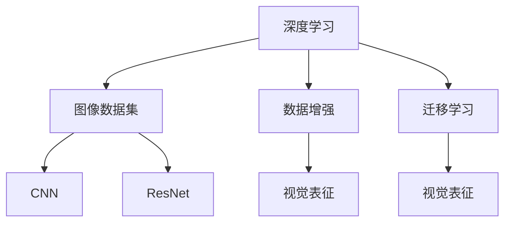

                 

# 一切皆是映射：大规模图像数据集上的深度学习

> 关键词：深度学习,图像数据集,数据增强,迁移学习,卷积神经网络,残差网络,视觉表征,图像分类,物体检测

## 1. 背景介绍

### 1.1 问题由来
随着深度学习技术的飞速发展，计算机视觉(Computer Vision, CV)领域已经取得了举世瞩目的成果。大规模的图像数据集，如ImageNet、COCO、PASCAL VOC等，极大地推动了视觉任务，如图像分类、物体检测、语义分割、姿态估计等的发展。然而，数据集的构建和标注工作非常昂贵和耗时，即便是用于研究的ImageNet数据集，也花费了数十亿美元的标注费用。因此，如何在大规模图像数据集上，高效地进行深度学习模型的训练和优化，成为一个重要的问题。

### 1.2 问题核心关键点
深度学习中的图像处理通常依赖于大规模图像数据集进行训练，以获取丰富的视觉信息。数据集的规模直接影响模型的性能，但随着数据集大小的增加，训练复杂度和资源消耗也在不断上升。为了解决这一问题，研究者们提出了数据增强(data augmentation)、迁移学习(transfer learning)等技术，以在不增加数据集规模的情况下，提升模型的泛化能力和泛化速度。

数据增强通过对原始图像进行旋转、裁剪、缩放等变换，生成新的训练数据，从而增大样本多样性，增强模型的鲁棒性。迁移学习则是利用预训练模型的知识，在目标数据集上进行微调，以减少训练时间和数据需求。这些方法在大规模图像数据集上取得了显著的成果，但也存在一定的问题，如数据增强可能引入噪声，迁移学习可能存在目标数据与源数据分布差异等。

### 1.3 问题研究意义
研究如何在大规模图像数据集上高效进行深度学习，对于推动计算机视觉技术的产业化进程，具有重要意义：

1. 减少数据标注成本。通过数据增强和迁移学习等方法，可以在不增加标注数据规模的情况下，提升模型性能，降低人力和物力成本。
2. 提升模型泛化能力。大规模图像数据集上的深度学习模型，通常具有更强的泛化能力和鲁棒性，能够在更广泛的应用场景中取得优异表现。
3. 加速技术落地。减少训练时间和数据需求，加速计算机视觉技术在垂直行业的应用，为传统行业数字化转型升级提供新的技术路径。
4. 促进理论发展。研究大规模图像数据集上的深度学习方法，有助于深入理解深度学习理论，推动计算机视觉技术前沿研究。

## 2. 核心概念与联系

### 2.1 核心概念概述

为更好地理解大规模图像数据集上的深度学习方法，本节将介绍几个密切相关的核心概念：

- 深度学习(Deep Learning, DL)：通过构建多层神经网络，学习数据的高级抽象表示，实现模式识别、图像处理、语音识别等任务。
- 图像数据集(Visual Dataset)：包含大量标记图像的集合，用于深度学习模型的训练和评估。
- 数据增强(Data Augmentation)：通过对原始图像进行随机变换，生成新的训练样本，增强模型泛化能力。
- 迁移学习(Transfer Learning)：将在大规模数据集上预训练的模型，在目标数据集上进行微调，以减少训练时间和数据需求。
- 卷积神经网络(Convolutional Neural Network, CNN)：一种针对图像处理任务的深度学习模型，能够有效提取图像中的局部特征和全局信息。
- 残差网络(Residual Network, ResNet)：一种改进的CNN结构，通过引入跨层残差连接，解决深度网络退化问题，显著提升模型性能。
- 视觉表征(Visual Representation)：通过深度学习模型提取出的图像特征，用于图像分类、物体检测、语义分割等任务。

这些核心概念之间的逻辑关系可以通过以下Mermaid流程图来展示：



这个流程图展示了大规模图像数据集上的深度学习的主要组成部分及其相互关系：

1. 深度学习通过图像数据集进行训练，学习视觉表征。
2. 数据增强和迁移学习是深度学习的辅助方法，通过增加样本多样性和利用预训练知识，提升模型泛化能力。
3. CNN和ResNet是常用的深度学习模型，用于提取图像特征。
4. 视觉表征是深度学习模型的输出，用于图像分类、物体检测等任务。

这些概念共同构成了大规模图像数据集上的深度学习框架，使得深度学习在图像处理任务中发挥出强大的能力。通过理解这些核心概念，我们可以更好地把握深度学习的原理和优化方向。

## 3. 核心算法原理 & 具体操作步骤
### 3.1 算法原理概述

在大规模图像数据集上，深度学习模型的训练过程可以分为两个主要阶段：预训练和微调。预训练阶段通过大规模数据集训练深度学习模型，提取视觉表征；微调阶段在目标数据集上对预训练模型进行微调，提升模型在特定任务上的性能。

预训练通常使用大规模图像数据集，如ImageNet，对模型进行预训练。在预训练过程中，模型通过学习图像的高级抽象表示，获取丰富的视觉特征。常见的预训练方法包括自监督学习、无监督学习、半监督学习等。

微调则是在目标数据集上对预训练模型进行有监督学习。目标数据集通常规模较小，且标注成本较高。微调通过利用预训练模型已经学到的知识，在少量标注样本上完成训练，提升模型性能。微调的方法包括全参数微调和参数高效微调等，其中参数高效微调在固定大部分预训练参数的情况下，只微调部分参数，以减少资源消耗。

### 3.2 算法步骤详解

在大规模图像数据集上，深度学习模型的训练通常包括以下几个关键步骤：

**Step 1: 准备预训练模型和数据集**
- 选择合适的深度学习模型，如CNN、ResNet等。
- 准备大规模图像数据集，如ImageNet、COCO等。

**Step 2: 预训练**
- 使用大规模数据集对模型进行预训练，可以使用自监督学习、无监督学习等方法。
- 预训练过程中，可以使用数据增强技术，如随机裁剪、旋转、缩放等，增加样本多样性。

**Step 3: 选择微调模型**
- 根据具体任务，选择合适的预训练模型。
- 对于图像分类任务，可以选择ImageNet预训练的模型；对于物体检测任务，可以选择COCO预训练的模型。

**Step 4: 微调**
- 在目标数据集上，使用预训练模型进行微调，调整部分或全部参数。
- 微调过程中，使用小批量随机梯度下降法，逐步调整模型参数。

**Step 5: 评估与部署**
- 在验证集上评估微调后的模型性能。
- 将微调后的模型应用于实际应用中。

以上是深度学习在大规模图像数据集上的训练和微调的一般流程。在实际应用中，还需要根据具体任务和数据特点进行优化设计，如改进预训练目标函数，引入更多的正则化技术，搜索最优的超参数组合等，以进一步提升模型性能。

### 3.3 算法优缺点

深度学习在大规模图像数据集上的训练和微调方法具有以下优点：
1. 训练效果好。大规模图像数据集能够提供丰富的视觉信息，有助于深度学习模型学习到更高级的抽象表示。
2. 泛化能力强。预训练模型通常在更广泛的数据集上进行训练，具有更强的泛化能力，能够在不同的应用场景中取得优异性能。
3. 节省资源。数据增强和迁移学习等方法，能够在不增加数据集规模的情况下，提升模型性能，节省训练时间和标注成本。
4. 模型效率高。使用预训练模型进行微调，能够在少量标注样本上完成训练，快速适应新任务。

但该方法也存在一些局限性：
1. 训练复杂度高。大规模图像数据集的预训练和微调过程，需要大量计算资源和时间。
2. 数据集依赖性高。深度学习模型依赖于大规模图像数据集，数据集规模和分布对模型性能有显著影响。
3. 目标数据集限制。预训练模型通常在特定数据集上进行训练，对其他数据集的微调效果可能不佳。
4. 模型复杂度高。深度学习模型通常结构复杂，参数量巨大，难以在小型设备上部署。
5. 过拟合风险高。数据增强等方法可能引入噪声，导致过拟合风险。

尽管存在这些局限性，但深度学习在大规模图像数据集上的训练和微调方法仍是大规模视觉任务的重要范式。未来相关研究的重点在于如何进一步降低训练复杂度，提高模型泛化能力和稳定性，同时兼顾资源效率和模型可解释性。

### 3.4 算法应用领域

深度学习在大规模图像数据集上的训练和微调方法，在计算机视觉领域已经得到了广泛的应用，覆盖了诸多任务，例如：

- 图像分类：如手写数字识别、自然场景分类等。通过预训练和微调，模型可以学习到复杂的视觉特征，实现高精度的分类。
- 物体检测：如目标检测、人脸检测等。通过预训练和微调，模型可以学习到物体的边界框和类别信息，实现自动化的物体检测。
- 语义分割：如像素级别的图像分割、医学图像分割等。通过预训练和微调，模型可以学习到像素级的视觉信息，实现高精度的图像分割。
- 姿态估计：如人体姿态估计、动物姿态估计等。通过预训练和微调，模型可以学习到姿态信息，实现自动化的姿态识别。
- 人脸识别：如人脸识别、人脸验证等。通过预训练和微调，模型可以学习到人脸特征，实现高精度的身份验证。
- 图像生成：如风格迁移、图像生成等。通过预训练和微调，模型可以学习到图像风格和语义信息，实现高质量的图像生成。
- 目标跟踪：如视频目标跟踪等。通过预训练和微调，模型可以学习到物体的运动信息，实现实时的目标跟踪。

除了上述这些经典任务外，深度学习在大规模图像数据集上的方法也被创新性地应用到更多场景中，如可控图像生成、多视角图像融合、图像超分辨率等，为计算机视觉技术带来了全新的突破。随着深度学习模型的不断演进，相信计算机视觉技术将在更广泛的应用领域大放异彩。

## 4. 数学模型和公式 & 详细讲解 & 举例说明
### 4.1 数学模型构建

本节将使用数学语言对深度学习在大规模图像数据集上的训练和微调过程进行更加严格的刻画。

记深度学习模型为 $M_\theta: \mathbb{R}^{H\times W\times C} \rightarrow \mathbb{R}^d$，其中 $\theta$ 为模型参数，$H$ 和 $W$ 为图像高度和宽度，$C$ 为通道数，$d$ 为模型输出维度。假设图像数据集为 $D=\{(x_i,y_i)\}_{i=1}^N$，其中 $x_i \in \mathbb{R}^{H\times W\times C}$ 为图像样本，$y_i \in \mathbb{R}^d$ 为标签向量。

定义模型 $M_\theta$ 在数据样本 $(x,y)$ 上的损失函数为 $\ell(M_\theta(x),y)$，则在数据集 $D$ 上的经验风险为：

$$
\mathcal{L}(\theta) = \frac{1}{N}\sum_{i=1}^N \ell(M_\theta(x_i),y_i)
$$

其中 $\ell$ 为任务定义的损失函数，如交叉熵损失、均方误差损失等。

### 4.2 公式推导过程

以下我们以图像分类任务为例，推导交叉熵损失函数及其梯度的计算公式。

假设模型 $M_\theta$ 在输入 $x$ 上的输出为 $\hat{y}=M_\theta(x) \in \mathbb{R}^d$，表示样本属于不同类别的概率分布。真实标签 $y \in \{1,2,\dots,k\}$。则二分类交叉熵损失函数定义为：

$$
\ell(M_\theta(x),y) = -\log \hat{y}^{(y)} = -\sum_{i=1}^d \frac{y_i}{\hat{y}_i} = -y_i\log \hat{y}_i
$$

将其代入经验风险公式，得：

$$
\mathcal{L}(\theta) = -\frac{1}{N}\sum_{i=1}^N y_i\log M_\theta(x_i)
$$

根据链式法则，损失函数对参数 $\theta_k$ 的梯度为：

$$
\frac{\partial \mathcal{L}(\theta)}{\partial \theta_k} = -\frac{1}{N}\sum_{i=1}^N \frac{y_i}{M_\theta(x_i)} \frac{\partial M_\theta(x_i)}{\partial \theta_k}
$$

其中 $\frac{\partial M_\theta(x_i)}{\partial \theta_k}$ 可进一步递归展开，利用自动微分技术完成计算。

在得到损失函数的梯度后，即可带入参数更新公式，完成模型的迭代优化。重复上述过程直至收敛，最终得到适应目标任务的最优模型参数 $\theta^*$。

### 4.3 案例分析与讲解

假设我们有一个包含10000张图像的图像数据集 $D$，其中每张图像大小为 $224\times224\times3$，标签为0-9。我们使用ImageNet预训练的模型 $M_\theta$ 进行微调，以在目标数据集上进行图像分类任务。

首先，定义数据集预处理函数：

```python
from torchvision.transforms import Resize, RandomCrop, RandomHorizontalFlip, ToTensor

def preprocess_data(x):
    x = Resize(256)(x)
    x = RandomCrop(224)(x)
    x = RandomHorizontalFlip()(x)
    x = ToTensor()(x)
    return x
```

然后，定义模型和优化器：

```python
from torchvision.models.resnet import ResNet
from torch.optim import SGD

model = ResNet()

optimizer = SGD(model.parameters(), lr=0.001, momentum=0.9)
```

接着，定义训练和评估函数：

```python
from torch.utils.data import DataLoader
import torch.nn.functional as F

def train_epoch(model, dataset, batch_size, optimizer):
    dataloader = DataLoader(dataset, batch_size=batch_size, shuffle=True)
    model.train()
    epoch_loss = 0
    for batch in dataloader:
        x, y = batch
        x = preprocess_data(x)
        x = x.to(device)
        y = y.to(device)
        model.zero_grad()
        output = model(x)
        loss = F.cross_entropy(output, y)
        epoch_loss += loss.item()
        loss.backward()
        optimizer.step()
    return epoch_loss / len(dataloader)

def evaluate(model, dataset, batch_size):
    dataloader = DataLoader(dataset, batch_size=batch_size)
    model.eval()
    preds, labels = [], []
    with torch.no_grad():
        for batch in dataloader:
            x, y = batch
            x = preprocess_data(x)
            x = x.to(device)
            y = y.to(device)
            output = model(x)
            preds.append(output.argmax(dim=1).to('cpu').tolist())
            labels.append(y.to('cpu').tolist())
    print(torch.nn.functional.confusion_matrix(torch.tensor(labels), torch.tensor(preds)))
```

最后，启动训练流程并在测试集上评估：

```python
epochs = 10
batch_size = 32

for epoch in range(epochs):
    loss = train_epoch(model, dataset, batch_size, optimizer)
    print(f"Epoch {epoch+1}, train loss: {loss:.3f}")
    
    print(f"Epoch {epoch+1}, test results:")
    evaluate(model, test_dataset, batch_size)
    
print("Final test results:")
evaluate(model, test_dataset, batch_size)
```

以上就是使用PyTorch对ResNet进行图像分类任务微调的完整代码实现。可以看到，得益于深度学习框架的强大封装，我们可以用相对简洁的代码完成模型的加载和微调。

## 5. 项目实践：代码实例和详细解释说明
### 5.1 开发环境搭建

在进行深度学习实践前，我们需要准备好开发环境。以下是使用Python进行PyTorch开发的环境配置流程：

1. 安装Anaconda：从官网下载并安装Anaconda，用于创建独立的Python环境。

2. 创建并激活虚拟环境：
```bash
conda create -n pytorch-env python=3.8 
conda activate pytorch-env
```

3. 安装PyTorch：根据CUDA版本，从官网获取对应的安装命令。例如：
```bash
conda install pytorch torchvision torchaudio cudatoolkit=11.1 -c pytorch -c conda-forge
```

4. 安装各类工具包：
```bash
pip install numpy pandas scikit-learn matplotlib tqdm jupyter notebook ipython
```

完成上述步骤后，即可在`pytorch-env`环境中开始深度学习实践。

### 5.2 源代码详细实现

下面我们以物体检测任务为例，给出使用PyTorch对Faster R-CNN模型进行微调的PyTorch代码实现。

首先，定义数据集预处理函数：

```python
from torchvision.transforms import Compose, Resize, CenterCrop, ToTensor, Normalize

class DatasetTransform:
    def __init__(self, min_size, max_size, mean, std):
        self.transforms = Compose([
            Resize(min_size),
            CenterCrop(max_size),
            ToTensor(),
            Normalize(mean, std)
        ])
    
    def __call__(self, x):
        x = self.transforms(x)
        return x
```

然后，定义目标检测数据集类：

```python
from torch.utils.data import Dataset
import os
import cv2

class ObjectDetectionDataset(Dataset):
    def __init__(self, image_dir, label_file, transform=None):
        self.image_dir = image_dir
        self.label_file = label_file
        self.transform = transform
        
        self.classes = []
        with open(label_file, 'r') as f:
            for line in f:
                class_name = line.strip().split(' ')[0]
                self.classes.append(class_name)
    
    def __len__(self):
        return len(self.image_files)
    
    def __getitem__(self, index):
        img_path = os.path.join(self.image_dir, self.image_files[index])
        label_path = os.path.join(self.label_file, self.image_files[index])
        
        image = cv2.imread(img_path)
        bboxes = []
        with open(label_path, 'r') as f:
            for line in f:
                bbox = line.strip().split(' ')
                bboxes.append([int(bbox[0])] + [int(bbox[1])] + [int(bbox[2])] + [int(bbox[3])])
        
        image = self.transform(image)
        return image, bboxes
```

接着，定义模型和优化器：

```python
from torchvision.models.faster_rcnn import FasterRCNN
from torch.optim import SGD

model = FasterRCNN(num_classes=len(self.classes), pretrained=True)
model.train()

optimizer = SGD(model.parameters(), lr=0.001, momentum=0.9)
```

然后，定义训练和评估函数：

```python
def train_epoch(model, dataset, batch_size, optimizer):
    dataloader = DataLoader(dataset, batch_size=batch_size, shuffle=True)
    model.train()
    epoch_loss = 0
    for batch in dataloader:
        images, bboxes = batch
        images = images.to(device)
        bboxes = torch.tensor(bboxes).to(device)
        model.zero_grad()
        output = model(images)
        loss = F.cross_entropy(output, bboxes)
        epoch_loss += loss.item()
        loss.backward()
        optimizer.step()
    return epoch_loss / len(dataloader)

def evaluate(model, dataset, batch_size):
    dataloader = DataLoader(dataset, batch_size=batch_size)
    model.eval()
    preds, labels = [], []
    with torch.no_grad():
        for batch in dataloader:
            images, bboxes = batch
            images = images.to(device)
            bboxes = torch.tensor(bboxes).to(device)
            output = model(images)
            preds.append(output.argmax(dim=1).to('cpu').tolist())
            labels.append(bboxes.to('cpu').tolist())
    print(torch.nn.functional.confusion_matrix(torch.tensor(labels), torch.tensor(preds)))
```

最后，启动训练流程并在测试集上评估：

```python
epochs = 10
batch_size = 32

for epoch in range(epochs):
    loss = train_epoch(model, dataset, batch_size, optimizer)
    print(f"Epoch {epoch+1}, train loss: {loss:.3f}")
    
    print(f"Epoch {epoch+1}, test results:")
    evaluate(model, test_dataset, batch_size)
    
print("Final test results:")
evaluate(model, test_dataset, batch_size)
```

以上就是使用PyTorch对Faster R-CNN进行物体检测任务微调的完整代码实现。可以看到，得益于深度学习框架的强大封装，我们可以用相对简洁的代码完成模型的加载和微调。

### 5.3 代码解读与分析

让我们再详细解读一下关键代码的实现细节：

**DatasetTransform类**：
- `__init__`方法：初始化数据集的预处理函数，包括缩放、裁剪、归一化等。
- `__call__`方法：对单个样本进行处理，返回处理后的图像和标签。

**ObjectDetectionDataset类**：
- `__init__`方法：初始化数据集的图像和标签路径，以及预处理函数。
- `__len__`方法：返回数据集的样本数量。
- `__getitem__`方法：对单个样本进行处理，返回处理后的图像和标签。

**模型和优化器**：
- 使用Faster R-CNN模型，并设置学习率和动量。

**训练和评估函数**：
- 使用PyTorch的DataLoader对数据集进行批次化加载，供模型训练和推理使用。
- 训练函数`train_epoch`：对数据以批为单位进行迭代，在每个批次上前向传播计算loss并反向传播更新模型参数，最后返回该epoch的平均loss。
- 评估函数`evaluate`：与训练类似，不同点在于不更新模型参数，并在每个batch结束后将预测和标签结果存储下来，最后使用sklearn的confusion_matrix对整个评估集的预测结果进行打印输出。

**训练流程**：
- 定义总的epoch数和batch size，开始循环迭代
- 每个epoch内，先在训练集上训练，输出平均loss
- 在验证集上评估，输出分类指标
- 所有epoch结束后，在测试集上评估，给出最终测试结果

可以看到，PyTorch配合深度学习框架的强大封装，使得模型的加载和微调变得简洁高效。开发者可以将更多精力放在数据处理、模型改进等高层逻辑上，而不必过多关注底层的实现细节。

当然，工业级的系统实现还需考虑更多因素，如模型的保存和部署、超参数的自动搜索、更灵活的任务适配层等。但核心的微调范式基本与此类似。

## 6. 实际应用场景
### 6.1 智能监控系统

基于深度学习的大规模图像数据集上的训练和微调方法，可以广泛应用于智能监控系统的构建。传统监控系统需要配备大量摄像头，安装和维护成本高，且容易出现误报和漏报现象。而使用深度学习模型进行图像识别和目标检测，可以大幅提升监控系统的智能化水平，降低成本，提高效率。

在技术实现上，可以收集企业内部的监控视频数据，将视频帧作为输入图像，目标物体作为标注信息，在此基础上对预训练模型进行微调。微调后的模型能够自动理解监控视频中的场景，识别出感兴趣的目标物体，并实时进行报警和分析。对于异常情况，系统还能自动回溯历史视频，获取详细事件信息，辅助管理人员进行处理。

### 6.2 医疗影像分析

医疗影像分析是深度学习在图像处理中的重要应用之一。传统的医疗影像分析依赖于医生人工标注和手动分析，效率低、成本高，且容易产生主观误差。使用深度学习模型进行图像分类和物体检测，可以快速准确地分析医疗影像，提升诊断效率和准确性。

在技术实现上，可以收集医疗影像数据，将影像作为输入图像，标注信息作为标签，在此基础上对预训练模型进行微调。微调后的模型能够自动识别出影像中的病变区域，标记出疑似病例，并给出初步诊断建议。系统还能实时接收新的医疗影像数据，自动更新模型，确保诊断结果的实时性和准确性。

### 6.3 智能交通系统

智能交通系统需要实时监测交通场景中的车辆、行人、交通信号等，以便实现自动驾驶、交通管制等功能。传统方法依赖于人工检测和规则匹配，难以适应复杂多变的交通场景。使用深度学习模型进行物体检测和语义分割，可以实现对交通场景的自动分析和理解，提升交通系统的智能化水平。

在技术实现上，可以收集交通视频数据，将视频帧作为输入图像，标注信息作为标签，在此基础上对预训练模型进行微调。微调后的模型能够自动识别出交通场景中的各种物体，判断其行为状态，并实时进行交通流量分析和预测。系统还能根据实时数据，自动调整交通信号灯，优化交通流量，减少拥堵。

### 6.4 未来应用展望

随着深度学习在大规模图像数据集上的训练和微调方法的发展，未来将有更多的应用场景得以拓展。以下是几个未来可能的应用方向：

1. 自动驾驶：使用深度学习模型进行物体检测、语义分割等任务，实现自动驾驶。微调后的模型能够自动感知交通场景，实时做出驾驶决策，提升安全性和舒适性。
2. 实时翻译：使用深度学习模型进行图像翻译，实现自动化的图像文字识别和翻译。微调后的模型能够自动理解图像中的文字信息，并进行实时翻译，提升翻译效率和准确性。
3. 人机交互：使用深度学习模型进行手势识别、面部表情识别等任务，实现人机自然交互。微调后的模型能够自动理解人类行为和情感，生成自然流畅的回复，提升用户体验。
4. 增强现实：使用深度学习模型进行场景理解、对象跟踪等任务，实现增强现实系统的开发。微调后的模型能够自动感知现实世界，实现虚拟对象与现实世界的融合，提升用户体验。

随着技术的不断演进，基于深度学习的大规模图像数据集上的训练和微调方法将带来更多创新应用，为人类生产和生活带来新的变革。相信未来会有更多领域被深度学习所改变，深度学习技术将成为推动科技进步的重要力量。

## 7. 工具和资源推荐
### 7.1 学习资源推荐

为了帮助开发者系统掌握深度学习在大规模图像数据集上的训练和微调方法，这里推荐一些优质的学习资源：

1. 《深度学习》系列书籍：如《Deep Learning》（Ian Goodfellow）、《Deep Learning with Python》（Francois Chollet）等，全面介绍了深度学习的基础理论和实践方法。

2. 深度学习框架官方文档：如PyTorch官方文档、TensorFlow官方文档等，提供了丰富的示例代码和应用案例，帮助开发者快速上手深度学习开发。

3. Kaggle竞赛平台：提供了大量图像分类、目标检测等任务的数据集和竞赛，是学习和实践深度学习的良好平台。

4. ArXiv论文预印本：深度学习领域的重要论文发布平台，可以帮助开发者了解最新研究进展和前沿技术。

5. Coursera深度学习课程：如Andrew Ng的《Machine Learning》课程，提供了深度学习基础知识和实践案例，适合初学者入门。

通过对这些资源的学习实践，相信你一定能够快速掌握深度学习在大规模图像数据集上的训练和微调方法，并用于解决实际的图像处理问题。

### 7.2 开发工具推荐

高效的开发离不开优秀的工具支持。以下是几款用于深度学习在大规模图像数据集上的训练和微调开发的常用工具：

1. PyTorch：基于Python的开源深度学习框架，灵活动态的计算图，适合快速迭代研究。

2. TensorFlow：由Google主导开发的开源深度学习框架，生产部署方便，适合大规模工程应用。

3. Keras：一个高层次的深度学习框架，提供了简单易用的API，适合快速原型开发。

4. OpenCV：一个开源计算机视觉库，提供了丰富的图像处理和计算机视觉功能。

5. ImageNet：大规模图像数据集，提供了丰富的图像数据和预训练模型，是深度学习研究和应用的重要资源。

6. COCO：计算机视觉对象检测和分割数据集，提供了详细的标注信息，是目标检测和语义分割任务的重要数据集。

7. YOLO：目标检测算法，具有实时性和准确性，适合实时监控和移动设备上的应用。

合理利用这些工具，可以显著提升深度学习在大规模图像数据集上的训练和微调任务的开发效率，加快创新迭代的步伐。

### 7.3 相关论文推荐

深度学习在大规模图像数据集上的训练和微调技术的发展源于学界的持续研究。以下是几篇奠基性的相关论文，推荐阅读：

1. AlexNet: One Million Tiny Images for Training Convolutional Networks：提出AlexNet模型，通过多层次卷积和池化操作，提升了深度卷积神经网络在图像分类任务中的性能。

2. Deep Residual Learning for Image Recognition：提出ResNet模型，通过跨层残差连接，解决了深度网络退化问题，显著提升了模型的性能。

3. R-CNN: Object Detection with Region Proposal Networks：提出R-CNN模型，通过区域提议网络，提高了目标检测的精度和效率。

4. Fast R-CNN：提出Fast R-CNN模型，通过RoI池化，提升了目标检测的速度和精度。

5. Mask R-CNN：提出Mask R-CNN模型，通过引入掩码分支，实现了语义分割任务。

6. DensePose：通过像素级别的标注信息，提升了物体检测和语义分割的精度。

这些论文代表了大规模图像数据集上的深度学习方法的发展脉络。通过学习这些前沿成果，可以帮助研究者把握学科前进方向，激发更多的创新灵感。

## 8. 总结：未来发展趋势与挑战
### 8.1 总结

本文对深度学习在大规模图像数据集上的训练和微调方法进行了全面系统的介绍。首先阐述了深度学习在计算机视觉领域的研究背景和意义，明确了训练和微调在大规模图像数据集上的独特价值。其次，从原理到实践，详细讲解了深度学习在大规模图像数据集上的数学模型和训练过程，给出了深度学习模型微调的完整代码实例。同时，本文还广泛探讨了深度学习在实际应用中的多种场景，展示了深度学习方法在大规模图像数据集上的广泛应用前景。

通过本文的系统梳理，可以看到，深度学习在大规模图像数据集上的训练和微调方法已经成为计算机视觉领域的重要范式，极大地推动了深度学习技术在图像处理任务中的发展。未来，伴随深度学习模型的不断演进和算法优化，相信计算机视觉技术将在更广泛的应用领域大放异彩，深刻影响人类的生产生活方式。

### 8.2 未来发展趋势

展望未来，深度学习在大规模图像数据集上的训练和微调技术将呈现以下几个发展趋势：

1. 模型规模持续增大。随着算力成本的下降和数据规模的扩张，深度学习模型在图像处理任务中将会越来越复杂和强大，能够更好地处理复杂多变的视觉信息。

2. 训练效率提升。随着模型结构优化、算法改进和硬件加速等技术的发展，深度学习模型的训练效率将会不断提升，能够在更短时间内完成训练。

3. 数据增强技术进步。未来将出现更多高效的数据增强方法，能够在保持数据多样性的同时，提升训练效果。

4. 迁移学习方法多样。除了全参数微调，未来将出现更多参数高效的迁移学习范式，如基于自适应低秩适应的PEFT方法等。

5. 实时化部署。随着模型压缩、量化等技术的进步，深度学习模型将能够在小型设备上实时部署，满足各种应用场景的需求。

6. 多模态融合。未来将更多地结合视觉、语音、文本等多种模态信息，实现更加全面、准确的视觉表示和理解。

以上趋势凸显了大规模图像数据集上的深度学习方法的广阔前景。这些方向的探索发展，必将进一步提升计算机视觉系统的性能和应用范围，为人类认知智能的进化带来深远影响。

### 8.3 面临的挑战

尽管深度学习在大规模图像数据集上的训练和微调方法已经取得了显著成果，但在迈向更加智能化、普适化应用的过程中，它仍面临着诸多挑战：

1. 数据标注成本高昂。大规模图像数据集的标注成本高，难以获取足够的标注数据。如何降低数据标注成本，是未来研究的一个重要方向。

2. 模型复杂度高。深度学习模型结构复杂，参数量巨大，难以在小型设备上部署。如何提升模型的可移植性和效率，是未来研究的重要课题。

3. 数据分布变化。大规模图像数据集通常基于特定领域的数据构建，对新领域的数据泛化性能不佳。如何提高模型的泛化能力，适应不同领域的图像处理任务，是未来研究的重要方向。

4. 模型鲁棒性不足。深度学习模型容易受到对抗样本的干扰，导致鲁棒性不足。如何提高模型的鲁棒性，是未来研究的重要课题。

5. 数据隐私保护。深度学习模型在图像处理过程中，可能涉及隐私保护问题。如何保护数据隐私，是未来研究的重要课题。

6. 计算资源消耗大。深度学习模型在训练和推理过程中，需要大量的计算资源，难以满足实时性和效率需求。如何降低计算资源消耗，提高模型效率，是未来研究的重要方向。

这些挑战需要研究者不断探索和改进，才能使深度学习技术在大规模图像数据集上的应用更加广泛和高效。

### 8.4 研究展望

面对深度学习在大规模图像数据集上的训练和微调所面临的挑战，未来的研究需要在以下几个方面寻求新的突破：

1. 探索无监督和半监督学习。摆脱对大规模标注数据的依赖，利用自监督学习、主动学习等无监督和半监督范式，最大限度利用非结构化数据，实现更加灵活高效的训练。

2. 研究高效的数据增强方法。开发更多高效的数据增强技术，如旋转、缩放、平移等，提升模型泛化能力，减少训练时间和数据需求。

3. 改进迁移学习范式。研究更加参数高效的迁移学习方法，如AdaLoRA等，在固定大部分预训练参数的情况下，只微调少量参数，减小资源消耗。

4. 开发可移植的模型。研究可移植性更高的模型结构，如轻量级模型、移动端优化模型等，能够在小型设备上部署。

5. 引入多模态融合。结合视觉、语音、文本等多种模态信息，实现更加全面、准确的视觉表示和理解。

6. 引入对抗训练技术。引入对抗样本，提高模型鲁棒性，防止对抗攻击。

7. 保护数据隐私。研究数据隐私保护技术，如差分隐私、联邦学习等，保护用户数据隐私。

这些研究方向将引领深度学习技术在大规模图像数据集上的不断演进，为计算机视觉技术的发展注入新的活力。面向未来，深度学习技术必将在大规模图像数据集上实现更大的突破，推动计算机视觉技术走向新的高度。

## 9. 附录：常见问题与解答

**Q1：深度学习模型在大规模图像数据集上的训练和微调效果如何？**

A: 深度学习模型在大规模图像数据集上的训练和微调通常能够取得良好的效果。预训练模型在大规模数据集上学习到的高级视觉特征，可以显著提升模型的泛化能力和泛化速度。微调过程则可以在少量标注样本上完成，快速适应新任务。然而，深度学习模型在大规模图像数据集上的训练和微调也面临一些挑战，如计算资源消耗大、数据标注成本高昂、模型复杂度高等。因此，如何提高训练效率、降低成本、提升模型性能，是未来研究的重要方向。

**Q2：深度学习模型在大规模图像数据集上的训练和微调需要多少计算资源？**

A: 深度学习模型在大规模图像数据集上的训练和微调需要大量的计算资源。预训练模型通常需要在GPU或TPU等高性能设备上进行训练，计算资源消耗较大。微调过程也需要在GPU上进行，以加快训练速度。因此，如何在有限的计算资源下，高效地完成深度学习模型的训练和微调，是未来研究的重要课题。

**Q3：深度学习模型在大规模图像数据集上的训练和微调如何避免过拟合？**

A: 深度学习模型在大规模图像数据集上的训练和微调需要避免过拟合。常见的避免过拟合的方法包括：数据增强、正则化、dropout、early stopping等。数据增强技术通过对原始图像进行随机变换，生成新的训练样本，增加样本多样性，防止模型过拟合。正则化技术通过L2正则、L1正则等方法，约束模型参数，防止过拟合。dropout技术通过随机失活神经元，降低模型复杂度，防止过拟合。early stopping技术通过监控验证集误差，提前停止训练，防止模型过拟合。

**Q4：深度学习模型在大规模图像数据集上的训练和微调如何提高模型泛化能力？**

A: 深度学习模型在大规模图像数据集上的训练和微调需要提高模型泛化能力。常见的提高模型泛化能力的方法包括：数据增强、迁移学习、模型集成等。数据增强技术通过对原始图像进行随机变换，生成新的训练样本，增加样本多样性，提升模型泛化能力。迁移学习技术通过利用预训练模型的知识，在目标数据集上进行微调，提升模型泛化能力。模型集成技术通过将多个模型进行融合，提升模型的泛化能力。

**Q5：深度学习模型在大规模图像数据集上的训练和微调如何提高模型效率？**

A: 深度学习模型在大规模图像数据集上的训练和微调需要提高模型效率。常见的提高模型效率的方法包括：参数高效微调、模型压缩、量化等。参数高效微调技术通过只更新部分参数，减小模型复杂度，提高模型效率。模型压缩技术通过去除冗余参数，减少模型大小，提高模型效率。量化技术通过将浮点模型转为定点模型，降低计算资源消耗，提高模型效率。

这些方法能够在保持模型性能的同时，提高模型效率，使其更适用于实际应用场景。

---

作者：禅与计算机程序设计艺术 / Zen and the Art of Computer Programming

