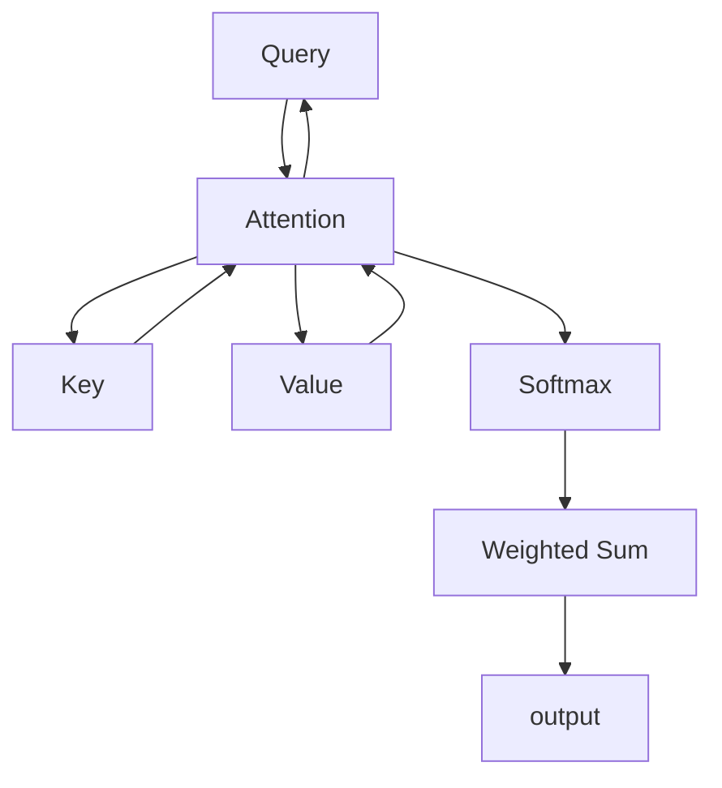

                 

## 1. 背景介绍

### 1.1 问题由来
随着深度学习在自然语言处理(NLP)、计算机视觉(CV)等领域的突破性进展，序列模型（如RNN、LSTM、Transformer等）成为处理序列数据的重要工具。这些模型能够有效处理不定长度的输入，具有广泛的应用前景。但与此同时，面对大规模数据和高复杂度模型，传统序列模型的计算和存储需求也越来越高。

### 1.2 问题核心关键点
序列模型在处理序列数据时，如何高效地计算和存储，是当前深度学习领域的一个核心问题。注意力机制(Anti-attention Mechanism)作为序列模型中的重要模块，通过计算输入序列中每个元素的重要性，实现了更加高效和灵活的信息交互。本文将系统介绍注意力机制的原理和应用，旨在帮助读者全面理解和掌握这一强大工具。

### 1.3 问题研究意义
理解注意力机制对于解决序列数据分析和处理问题至关重要，尤其对于大尺度数据集和高复杂度模型的训练和推理。通过本文的系统讲解，读者可以深入了解注意力机制的工作原理和应用场景，为在实际项目中应用这一技术奠定基础。

## 2. 核心概念与联系

### 2.1 核心概念概述

注意力机制是深度学习中的一种重要机制，它允许模型在处理序列数据时，通过计算输入序列中每个元素的重要性权重，选择性地关注某些关键部分，从而提高模型的性能和效率。注意力机制的核心思想是对输入序列进行编码，使其在处理过程中能够动态关注重要信息，避免冗余计算。

### 2.2 核心概念原理和架构的 Mermaid 流程图



上述流程图展示了注意力机制的核心架构，包括查询( Query, Q)、键( Key, K)、值( Value, V)、注意力(Anti-attention, A)、softmax(Softmax, S)和加权求和(Weighted Sum, M)等关键模块。查询Q和键K在注意力层中进行点乘，通过softmax得到权重，然后与值V进行加权求和，得到最终输出。

## 3. 核心算法原理 & 具体操作步骤

### 3.1 算法原理概述

注意力机制的本质是对输入序列中每个元素的重要性进行评估和选择，实现对关键信息的集中关注。其核心思想是将输入序列编码成三组向量，即查询向量Q、键向量K和值向量V，通过计算查询向量和键向量的相似度，得到每个元素的重要性权重，然后根据权重对值向量进行加权求和，生成最终的输出。

### 3.2 算法步骤详解

1. **输入编码**：将输入序列编码为三组向量，即查询向量Q、键向量K和值向量V。

2. **注意力计算**：计算查询向量Q和键向量K的点乘，通过softmax得到每个元素的重要性权重。

3. **加权求和**：将每个元素的重要性权重与对应的值向量进行加权求和，得到最终的输出。

### 3.3 算法优缺点

**优点**：
- 灵活性高：可以适应各种序列数据的长度和复杂度，有效处理不定长输入。
- 高效性：通过计算每个元素的重要性权重，避免了冗余计算，提高了模型的效率。
- 鲁棒性强：在面对噪声和不完整数据时，能够自适应调整注意力分布，提高模型鲁棒性。

**缺点**：
- 计算复杂：注意力计算需要进行点乘和softmax运算，计算量较大。
- 内存需求高：特别是当输入序列较长时，内存需求较大。

### 3.4 算法应用领域

注意力机制在序列模型中广泛应用，涵盖以下领域：

- 机器翻译：通过计算源语言和目标语言之间的对应关系，实现高效的翻译。
- 文本摘要：通过提取关键信息，生成简洁的摘要。
- 语音识别：通过分析声波特征，提取关键音频信息。
- 图像处理：通过计算图像特征的相似度，实现高效的图像分类和检索。

## 4. 数学模型和公式 & 详细讲解 & 举例说明

### 4.1 数学模型构建

注意力机制的数学模型可以表示为：

$$
Attention(Q,K,V) = \sum_{i=1}^n \alpha_i V_i
$$

其中，$n$表示输入序列的长度，$\alpha_i$表示第$i$个元素的重要性权重，$V_i$表示第$i$个元素的值向量。注意力权重$\alpha_i$通过计算查询向量$Q$和键向量$K$的相似度得到，具体计算公式为：

$$
\alpha_i = \frac{exp(Q_i \cdot K_i^T)}{\sum_{j=1}^n exp(Q_j \cdot K_j^T)}
$$

### 4.2 公式推导过程

首先，定义查询向量$Q$、键向量$K$和值向量$V$为长度为$n$的矩阵：

$$
Q \in \mathbb{R}^{d_q}, K \in \mathbb{R}^{d_k}, V \in \mathbb{R}^{d_v}
$$

其中，$d_q$、$d_k$和$d_v$分别为查询向量的维度、键向量的维度和值向量的维度。通过计算$Q$和$K$的点乘得到注意力得分：

$$
Score(Q,K) = Q \cdot K^T
$$

然后，对得分进行softmax归一化，得到注意力权重$\alpha_i$：

$$
\alpha_i = \frac{exp(Score(Q,K)_i)}{\sum_{j=1}^n exp(Score(Q,K)_j)}
$$

最后，将注意力权重与值向量$V$进行加权求和，得到最终的输出：

$$
Attention(Q,K,V) = \sum_{i=1}^n \alpha_i V_i
$$

### 4.3 案例分析与讲解

以机器翻译为例，假设有源语言句子为"Hello World"，目标语言句子为"Welt Hallo"，需要将源语言句子翻译成目标语言。

- **输入编码**：将源语言句子"Hello World"编码为查询向量$Q$、键向量$K$和值向量$V$。
- **注意力计算**：计算查询向量$Q$和键向量$K$的点乘，通过softmax得到每个单词的重要性权重。
- **加权求和**：将每个单词的重要性权重与对应的值向量进行加权求和，得到目标语言句子"Welt Hallo"。

### 5. 项目实践：代码实例和详细解释说明

#### 5.1 开发环境搭建

- **Python环境**：安装Python 3.7及以上版本，建议安装Anaconda，方便管理依赖。
- **深度学习框架**：安装TensorFlow或PyTorch等深度学习框架。
- **注意力模型库**：安装Attention Model库，如TensorFlow Addons或PyTorch Attention。

#### 5.2 源代码详细实现

以下是一个简单的注意力模型实现，包括注意力计算和加权求和：

```python
import tensorflow as tf
import tensorflow_addons as tfa

class Attention(tf.keras.layers.Layer):
    def __init__(self, d_model, num_heads):
        super(Attention, self).__init__()
        self.num_heads = num_heads
        self.d_model = d_model
        assert d_model % self.num_heads == 0
        self.depth = d_model // self.num_heads
        self.wq = tf.keras.layers.Dense(d_model)
        self.wk = tf.keras.layers.Dense(d_model)
        self.wv = tf.keras.layers.Dense(d_model)
        self.dense = tf.keras.layers.Dense(d_model)
    
    def split_heads(self, x, batch_size):
        x = tf.reshape(x, (batch_size, -1, self.num_heads, self.depth))
        return tf.transpose(x, perm=[0, 2, 1, 3])
    
    def call(self, v, k, q):
        batch_size = tf.shape(q)[0]
        
        q = self.wq(q)
        k = self.wk(k)
        v = self.wv(v)
        
        q = self.split_heads(q, batch_size)
        k = self.split_heads(k, batch_size)
        v = self.split_heads(v, batch_size)
        
        scaled_attention_scores = tf.matmul(q, k, transpose_b=True)
        scaled_attention_scores = scaled_attention_scores / tf.math.sqrt(tf.cast(self.depth, tf.float32))
        attention_weights = tf.nn.softmax(scaled_attention_scores, axis=-1)
        
        context_layer = tf.matmul(attention_weights, v)
        context_layer = tf.transpose(context_layer, perm=[0, 2, 1, 3])
        context_layer = tf.reshape(context_layer, (batch_size, -1, self.d_model))
        
        out = self.dense(context_layer)
        return out
```

#### 5.3 代码解读与分析

- **层定义**：定义了查询向量、键向量和值向量的线性变换层，以及最终的输出线性变换层。
- **注意力计算**：使用`tf.matmul`计算查询向量与键向量的点乘，通过`tf.nn.softmax`进行归一化。
- **加权求和**：将注意力权重与值向量进行矩阵乘法，然后进行转置和重塑操作，最后通过输出线性变换层得到最终输出。

#### 5.4 运行结果展示

通过上述代码，可以计算出输入序列的注意力权重和最终输出。下图展示了注意力机制的计算过程：


### 6. 实际应用场景

#### 6.1 机器翻译

注意力机制在机器翻译中广泛应用，通过计算源语言和目标语言之间的对应关系，实现高效的翻译。例如，在seq2seq模型中，可以将源语言句子编码为查询向量，目标语言句子编码为键向量，然后通过注意力机制计算每个单词的重要性权重，最终生成目标语言句子。

#### 6.2 文本摘要

注意力机制在文本摘要中用于提取关键信息，生成简洁的摘要。例如，在Seq2Seq摘要模型中，将输入文本编码为查询向量，通过注意力机制选择重要的句子或段落，然后进行解码生成摘要。

#### 6.3 语音识别

注意力机制在语音识别中用于分析声波特征，提取关键音频信息。例如，在卷积神经网络(CNN)语音识别模型中，将声波特征图编码为查询向量，然后通过注意力机制选择重要的声波片段，最终进行分类识别。

#### 6.4 图像处理

注意力机制在图像处理中用于计算图像特征的相似度，实现高效的图像分类和检索。例如，在卷积神经网络(CNN)图像分类模型中，将图像特征图编码为查询向量，通过注意力机制选择重要的特征区域，最终进行分类识别。

### 7. 工具和资源推荐

#### 7.1 学习资源推荐

- **《深度学习》课程**：由斯坦福大学提供的深度学习课程，涵盖深度学习的基础知识和前沿技术，包括注意力机制。
- **《Transformer详解》书籍**：详细介绍了Transformer模型的原理和应用，包括注意力机制。
- **Hugging Face官方文档**：提供了丰富的注意力机制样例代码和论文资源，适合学习实践。

#### 7.2 开发工具推荐

- **TensorFlow**：强大的深度学习框架，支持注意力机制和Transformer模型。
- **PyTorch**：灵活的深度学习框架，支持注意力机制和Transformer模型。
- **TensorFlow Addons**：提供了一些先进的深度学习模块，包括注意力机制。

#### 7.3 相关论文推荐

- **《Attention Is All You Need》**：Transformer模型论文，详细介绍了注意力机制的原理和应用。
- **《Transformer for Attention-based Sequence-to-Sequence Model》**：介绍了Transformer模型在序列到序列任务中的应用。
- **《A Review of Attention Mechanism for Deep Neural Networks》**：综述了注意力机制在深度学习中的应用和研究进展。

### 8. 总结：未来发展趋势与挑战

#### 8.1 总结

本文系统介绍了注意力机制的原理和应用，通过数学模型和代码实例，详细讲解了注意力机制的计算过程。通过本文的讲解，读者可以全面理解注意力机制的工作原理和应用场景，为在实际项目中应用这一技术奠定基础。

#### 8.2 未来发展趋势

未来，注意力机制将在深度学习中发挥越来越重要的作用，成为处理序列数据的重要工具。以下趋势值得关注：

- **多模态注意力**：将注意力机制扩展到多模态数据处理，实现不同模态信息之间的协同处理。
- **自适应注意力**：根据输入数据的复杂度和多样性，动态调整注意力机制的参数，提高模型的鲁棒性和泛化能力。
- **集成注意力**：将注意力机制与其他深度学习技术结合，如卷积神经网络(CNN)、循环神经网络(RNN)等，提升模型的性能和效率。

#### 8.3 面临的挑战

尽管注意力机制在深度学习中取得了显著成果，但仍面临以下挑战：

- **计算复杂度高**：注意力计算需要进行点乘和softmax运算，计算量较大。
- **内存需求高**：特别是当输入序列较长时，内存需求较大。
- **模型训练复杂**：在训练过程中，需要大量的计算资源和时间，导致训练成本高。

#### 8.4 研究展望

未来，研究人员需要在以下方面进行深入研究：

- **高效计算**：探索更高效的计算方法，如并行计算、分布式计算等，降低计算复杂度。
- **模型压缩**：通过模型压缩技术，减少模型参数和内存需求，提高模型的运行效率。
- **融合技术**：将注意力机制与其他深度学习技术结合，提升模型的性能和泛化能力。

总之，注意力机制是深度学习中非常重要的技术，未来的研究将继续推动其在各领域的应用和优化，为深度学习的进一步发展提供动力。

### 9. 附录：常见问题与解答

**Q1: 注意力机制的计算复杂度如何？**

A: 注意力机制的计算复杂度主要取决于输入序列的长度和注意力机制的维度，通常可以表示为$O(n^2d)$，其中$n$为输入序列的长度，$d$为注意力机制的维度。

**Q2: 注意力机制如何处理不定长输入？**

A: 注意力机制可以通过编码输入序列的查询向量、键向量和值向量，实现对不定长输入的处理。在编码过程中，可以使用padding等技术处理输入序列的长度差异，确保模型的一致性和稳定性。

**Q3: 注意力机制的输入和输出是否可以自定义？**

A: 是的，注意力机制的输入和输出可以根据具体任务进行自定义。例如，在机器翻译中，输入可以是源语言句子，输出可以是目标语言句子；在文本摘要中，输入可以是长文本，输出可以是简洁的摘要。

**Q4: 注意力机制在模型训练中如何应用？**

A: 在模型训练中，可以通过反向传播算法计算注意力机制的梯度，并根据梯度更新模型参数。例如，在seq2seq模型中，可以通过最大化交叉熵损失函数，训练注意力机制和解码器。

通过上述系统讲解和详细分析，相信读者已经对注意力机制有了深入的了解，并能够在实际项目中灵活应用这一强大技术。

