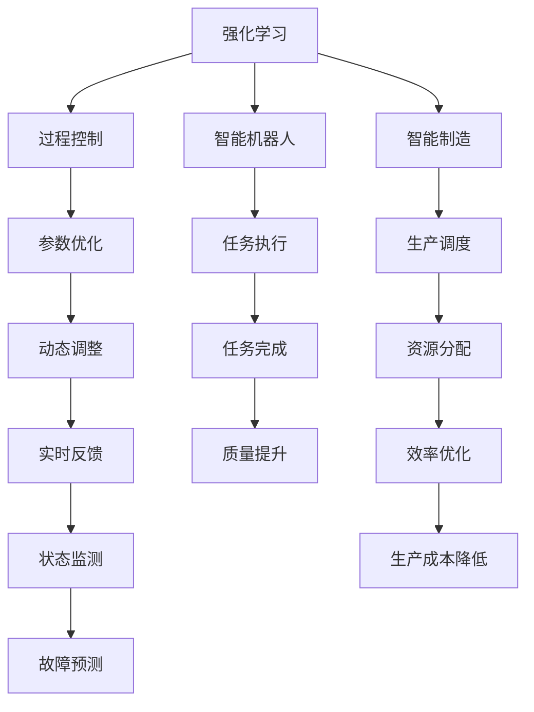

                 

# 一切皆是映射：强化学习在工业自动化中的应用：挑战与机遇

> 关键词：工业自动化,强化学习,优化控制,过程控制,机器人,智能制造,机器学习,AI在工业中的应用

## 1. 背景介绍

### 1.1 问题由来
工业自动化领域正经历着一场由信息技术引领的变革，从传统的离散制造业向更加灵活的连续性生产模式转型。现代工业生产的复杂性、规模化和多样性，使得传统的制造执行系统(MES)难以适应快速变化的生产环境。在这种背景下，强化学习(Reinforcement Learning, RL)作为一种能适应不确定性环境的智能学习算法，为工业自动化带来了新的契机。

强化学习在自动化领域的应用，主要源于其具备的两大核心优势：
- **自适应能力**：强化学习能通过与环境的交互，动态调整策略，实时适应生产环境的变化。
- **优化控制**：通过学习最佳控制策略，强化学习能持续优化生产过程，提升生产效率和经济效益。

本文旨在探讨强化学习在工业自动化中的广泛应用，以及其面临的挑战和未来发展趋势。

### 1.2 问题核心关键点
强化学习在工业自动化中的应用，主要集中在以下几个方面：
- **过程控制**：利用强化学习算法，优化控制参数，提高过程稳定性。
- **智能机器人**：应用强化学习算法，使机器人自主决策，完成复杂任务。
- **智能制造**：通过强化学习优化生产流程，实现生产调度和资源分配的智能化。
- **故障诊断与预测**：利用强化学习进行设备状态监测，预测故障，提升设备可靠性。

强化学习在工业自动化中的应用，对提升生产效率、降低成本、提高产品质量等方面具有重要作用。然而，面对复杂多变的生产环境，强化学习技术也面临诸多挑战，需要不断的技术突破和创新。

## 2. 核心概念与联系

### 2.1 核心概念概述

为更好地理解强化学习在工业自动化中的应用，本节将介绍几个关键概念及其之间的联系：

- **强化学习(Reinforcement Learning, RL)**：通过与环境的交互，智能体通过试错方式，学习最优控制策略的机器学习方法。强化学习主要包括状态、动作、奖励和策略等核心要素。

- **过程控制**：在工业自动化中，过程控制指的是对生产过程中各个参数进行实时调整，以保持生产过程的稳定性。

- **智能机器人**：具有自主决策和执行能力的机器人，能完成复杂的制造任务，是工业自动化的重要组成部分。

- **智能制造**：通过利用现代信息技术，实现生产过程的数字化、网络化和智能化，提升生产效率和灵活性。

- **机器学习**：广义的机器学习方法，包括监督学习、无监督学习、强化学习等，其中强化学习在工业自动化中具有独特优势。

这些核心概念之间的逻辑关系可以通过以下Mermaid流程图来展示：



这个流程图展示强化学习与工业自动化中各应用场景之间的联系：

1. 强化学习通过动态调整策略，优化过程控制参数。
2. 在智能机器人中，强化学习使机器人自主决策，完成复杂任务。
3. 强化学习优化生产流程，支持智能制造。
4. 强化学习实时监测设备状态，预测故障，提高设备可靠性。

## 3. 核心算法原理 & 具体操作步骤

### 3.1 算法原理概述

强化学习在工业自动化中的应用，本质上是一种优化控制策略的过程。强化学习系统由智能体(Agent)、环境(Environment)、状态(State)、动作(Action)、奖励(Reward)和策略(Policy)组成。在工业自动化中，智能体通常是指机器人、控制器等自动化设备，环境则是生产过程，状态和动作分别指生产过程中的各种参数和执行操作，奖励则是对生产效率、产品质量等性能指标的反馈。

强化学习的目标是通过不断与环境交互，学习最优控制策略，使得智能体在特定环境下的累计奖励最大。具体而言，强化学习算法框架包括策略优化、环境建模、奖励设计等关键步骤。

### 3.2 算法步骤详解

强化学习在工业自动化中的典型应用流程包括：

**Step 1: 环境建模**
- 收集生产过程中的各种数据，构建环境的数学模型。如温度、压力、流量等关键参数。

**Step 2: 状态和动作定义**
- 定义生产过程中的状态集合和动作集合，如温度状态、开闭阀门等动作。

**Step 3: 奖励函数设计**
- 定义奖励函数，通常包括性能指标如产量、质量、能耗等。

**Step 4: 选择算法**
- 根据具体问题选择合适的强化学习算法，如Q-Learning、SARSA、Deep Q-Network等。

**Step 5: 训练和优化**
- 利用收集的实际数据，在模拟环境或实际生产环境中进行训练，不断优化策略。
- 利用蒙特卡罗方法、最小二乘法等求解最优策略。

**Step 6: 部署和评估**
- 将训练好的策略部署到实际生产环境中，进行性能评估。
- 持续监控实际生产数据，评估模型效果，及时进行微调。

### 3.3 算法优缺点

强化学习在工业自动化中的应用，具有以下优点：
1. 自适应能力强。能实时调整控制策略，适应生产环境的变化。
2. 优化能力强。通过学习最优控制策略，提高生产效率和质量。
3. 鲁棒性好。能处理生产过程中的不确定性和随机性。
4. 可扩展性好。适用于多种复杂的生产场景。

同时，强化学习也存在一些局限：
1. 训练复杂。需要大量数据和计算资源，训练时间长。
2. 泛化能力有限。过度依赖特定环境，难以泛化到新环境。
3. 策略复杂。智能体的策略学习涉及复杂数学模型，难以解释。
4. 安全性问题。在关键控制系统中，强化学习的决策不可逆，可能带来安全隐患。

### 3.4 算法应用领域

强化学习在工业自动化中的应用，主要体现在以下几个领域：

- **过程控制**：如温度、压力、流量等关键参数的优化控制，以保持生产过程的稳定性。
- **智能机器人**：通过强化学习，使机器人自主决策，完成复杂任务如焊接、装配等。
- **智能制造**：如生产调度、资源分配、故障预测等，以实现生产过程的智能化。
- **质量控制**：通过强化学习优化生产过程，提高产品质量和一致性。
- **能耗优化**：通过强化学习算法，优化生产过程中的能源消耗，降低成本。

这些应用领域展示了强化学习在提升工业生产效率和质量方面的潜力。

## 4. 数学模型和公式 & 详细讲解 & 举例说明

### 4.1 数学模型构建

强化学习在工业自动化中的应用，通常涉及以下几个数学模型：

- **马尔可夫决策过程(MDP)**：工业生产过程可以看作是一个马尔可夫决策过程，包含状态集合$S$、动作集合$A$、状态转移概率$P$、奖励函数$R$和折现因子$\gamma$。

- **策略优化问题**：在MDP框架下，目标是通过策略$\pi$最大化累计奖励：$\mathcal{J}(\pi) = \mathbb{E}_{\pi} \sum_{t=0}^{\infty} \gamma^t R(s_t, a_t)$。

- **Q值函数**：Q值函数$Q(s, a)$表示在状态$s$下采取动作$a$的预期奖励，满足Bellman方程$Q(s, a) = \mathbb{E}[\mathcal{R} + \gamma Q(s', a')]$，其中$s'$和$a'$分别为下一个状态和下一个动作。

- **策略评估和优化**：策略评估通过计算状态-动作对的Q值或价值函数$V(s)$，策略优化则通过求解最优策略$\pi^* = \arg\max_{\pi} \mathcal{J}(\pi)$。

### 4.2 公式推导过程

以一个简单的过程控制系统为例，其数学模型如下：

- 状态集合$S=\{s_1, s_2, \dots, s_n\}$，表示生产过程中的温度、压力等参数。
- 动作集合$A=\{a_1, a_2, \dots, a_m\}$，表示开闭阀门等操作。
- 状态转移概率$P$，即给定状态$s_t$和动作$a_t$，下一状态$s_{t+1}$的概率分布。
- 奖励函数$R(s_t, a_t)$，根据生产过程的性能指标，给出奖励值。
- 折现因子$\gamma \in [0, 1]$，表示未来奖励的重要性。

假设智能体在状态$s_t$采取动作$a_t$后，下一状态为$s_{t+1}$，奖励为$R(s_{t+1}, a_{t+1})$。通过迭代求解，可以得到Q值函数：

$$
Q(s_t, a_t) = \mathbb{E}_{a'} \sum_{i=0}^{\infty} \gamma^i R(s_{t+i}, a_{t+i})
$$

在实际应用中，通过求解最优策略$\pi^* = \arg\max_{\pi} \mathcal{J}(\pi)$，使得生产过程的累计奖励最大化。

### 4.3 案例分析与讲解

以下以工业机器人装配为例，说明强化学习在实际应用中的具体实现：

- **环境建模**：将工业机器人的工作环境建模为一个MDP，包括机器人的位置、姿态、任务状态等。
- **状态和动作定义**：定义机器人的当前位置、当前姿态、当前任务状态、下一步动作等。
- **奖励函数设计**：设计以任务完成时间和准确性为奖励的函数，完成装配任务得高奖励，反之得低奖励。
- **算法选择**：选择Q-Learning算法，训练机器人在复杂环境中自主完成装配任务。
- **训练和优化**：利用机器人历史操作数据进行训练，优化机器人的动作策略。
- **部署和评估**：将训练好的策略部署到实际装配线上，实时调整机器人的操作，提高装配效率和准确性。

## 5. 项目实践：代码实例和详细解释说明

### 5.1 开发环境搭建

在进行强化学习实践前，我们需要准备好开发环境。以下是使用Python进行OpenAI Gym开发的环境配置流程：

1. 安装Anaconda：从官网下载并安装Anaconda，用于创建独立的Python环境。

2. 创建并激活虚拟环境：
```bash
conda create -n reinforcement-env python=3.8 
conda activate reinforcement-env
```

3. 安装OpenAI Gym和相关依赖：
```bash
pip install gym gym-rl
```

4. 安装PyTorch：
```bash
pip install torch torchvision torchaudio
```

5. 安装Tensorboard：
```bash
pip install tensorboard
```

6. 安装其他必要的库：
```bash
pip install numpy matplotlib tqdm
```

完成上述步骤后，即可在`reinforcement-env`环境中开始强化学习实践。

### 5.2 源代码详细实现

这里我们以一个简单的强化学习机器人装配任务为例，给出使用OpenAI Gym和PyTorch实现的具体代码。

首先，定义机器人装配任务的环境：

```python
from gym import spaces
import gym

class AssemblyEnv(gym.Env):
    def __init__(self):
        self.observation_space = spaces.Box(low=0, high=1, shape=(3, ), dtype=np.float32)
        self.action_space = spaces.Box(low=-1, high=1, shape=(2, ), dtype=np.float32)
        self.target_position = [0.5, 0.5, 0]
        self.terminal = False

    def reset(self):
        self.terminal = False
        obs = np.zeros((3,))
        obs[0] = self.target_position[0]
        obs[1] = self.target_position[1]
        obs[2] = 0.0
        return obs

    def step(self, action):
        reward = -0.01
        if self.terminal:
            return np.zeros((3,)), reward, True, {}
        position = action[0]
        pose = action[1]
        target = self.target_position
        if abs(position - target[0]) < 0.05 and abs(pose - target[1]) < 0.05:
            reward = 1.0
            self.terminal = True
        return np.array([position, pose, target[2]]), reward, self.terminal, {}

    def render(self):
        pass
```

然后，定义强化学习模型：

```python
import torch
import torch.nn as nn
import torch.optim as optim

class AssemblyModel(nn.Module):
    def __init__(self):
        super(AssemblyModel, self).__init__()
        self.fc1 = nn.Linear(3, 128)
        self.fc2 = nn.Linear(128, 128)
        self.fc3 = nn.Linear(128, 2)
        self.relu = nn.ReLU()

    def forward(self, x):
        x = self.fc1(x)
        x = self.relu(x)
        x = self.fc2(x)
        x = self.relu(x)
        x = self.fc3(x)
        return x
```

接着，定义强化学习算法：

```python
def assemble_qlearning(env, model, gamma, epochs, batch_size):
    state_dim = env.observation_space.shape[0]
    action_dim = env.action_space.shape[0]
    state_dim = state_dim

    model.to('cuda')
    optimizer = optim.Adam(model.parameters(), lr=0.001)
    reward_loss = 0
    state_loss = 0
    batch = []
    state_batch = []
    action_batch = []
    reward_batch = []

    for episode in range(epochs):
        state = env.reset()
        done = False
        state_batch = []
        action_batch = []
        reward_batch = []

        while not done:
            state_batch.append(state)
            action_batch.append(env.action_space.sample())
            reward_batch.append(env.reward())

            state, reward, done, _ = env.step(action_batch[-1])
            reward_loss += reward
            state_loss += torch.norm(state - state_batch[-1])
            batch.append((state_batch, action_batch, reward_batch))
            if len(batch) >= batch_size:
                state_batch, action_batch, reward_batch = [], [], []
                state = env.reset()
                batch = [(state, action, reward)]

        for state, action, reward in batch:
            action = torch.tensor([action], device='cuda')
            target = reward + gamma * model(torch.tensor([state], device='cuda')).detach().max(1)[0]
            target[torch.tensor([action], device='cuda')] = reward
            optimizer.zero_grad()
            prediction = model(torch.tensor([state], device='cuda'))
            loss = (prediction - target).mean() + state_loss / batch_size
            loss.backward()
            optimizer.step()

        print('Episode: {}, Reward: {:.2f}, Loss: {:.2f}'.format(episode, reward_loss / batch_size, loss.item()))
        reward_loss = 0
        state_loss = 0
```

最后，启动训练流程：

```python
env = AssemblyEnv()
model = AssemblyModel()
gamma = 0.9
epochs = 1000
batch_size = 100

assemble_qlearning(env, model, gamma, epochs, batch_size)

# 测试训练好的模型
state = np.array([0.2, 0.3, 0.4])
observation = torch.tensor([state], device='cuda')
reward = model(observation).detach().max(1)[0].item()
print('Test reward:', reward)
```

以上就是使用OpenAI Gym和PyTorch实现强化学习装配任务的完整代码实现。可以看到，借助OpenAI Gym，我们能够快速定义和测试强化学习环境，利用PyTorch强大的计算能力，实现高效、灵活的模型训练。

### 5.3 代码解读与分析

让我们再详细解读一下关键代码的实现细节：

**AssemblyEnv类**：
- `__init__`方法：定义环境的空间、动作空间和目标位置等。
- `reset`方法：重置环境，返回初始状态。
- `step`方法：执行一个动作，返回奖励、是否结束等信息。
- `render`方法：用于可视化环境状态，此处省略。

**AssemblyModel类**：
- `__init__`方法：定义神经网络的结构，包含输入、隐藏层和输出。
- `forward`方法：前向传播，计算模型的输出。

**assemble_qlearning函数**：
- 利用OpenAI Gym和PyTorch实现强化学习训练。
- `for episode`循环：对每个训练轮次进行模拟，收集状态、动作、奖励等数据。
- `for state, action, reward in batch`循环：在收集足够数据后，进行模型训练。
- 利用神经网络模型计算Q值，计算损失函数，反向传播更新模型参数。

**训练流程**：
- 定义训练轮次、批次大小和折现因子。
- 调用`assemble_qlearning`函数进行训练。
- 在训练完成后，利用模型对测试状态进行推理，输出奖励值。

可以看到，使用OpenAI Gym和PyTorch，强化学习的代码实现变得简洁高效。开发者可以将更多精力放在环境定义、模型优化等高层逻辑上，而不必过多关注底层的实现细节。

当然，工业级的系统实现还需考虑更多因素，如模型的保存和部署、超参数的自动搜索、更灵活的环境定义等。但核心的强化学习过程基本与此类似。

## 6. 实际应用场景

### 6.1 工业机器人装配

工业机器人装配是强化学习在工业自动化中最为典型的应用之一。通过强化学习，机器人可以自主学习最优装配策略，适应不同的装配任务。

在具体实现中，我们可以将装配任务建模为一个MDP环境，每个组件的位置、姿态、动作等作为状态，机器人动作如开合、调整等作为动作，奖励函数根据装配完成的准确性和时间计算。通过训练，机器人能够自主调整动作策略，优化装配效率和质量。

### 6.2 生产过程控制

生产过程控制是工业自动化中另一个重要应用场景。在实际生产过程中，温度、压力、流量等参数需要实时调整，以保持生产过程的稳定性。

通过强化学习算法，可以学习最优控制策略，动态调整生产参数。例如，在半导体生产中，温度和压力的微小变化可能带来巨大的成本损失。通过强化学习，优化控制策略，可有效降低成本，提高生产效率。

### 6.3 智能制造调度

智能制造调度是工业自动化中又一重要应用。在生产调度过程中，需要实时调整生产任务和资源分配，以提高生产效率。

通过强化学习算法，可以学习最优调度策略，动态调整任务优先级和资源分配。例如，在汽车制造中，不同车型的装配顺序可能影响生产效率。通过强化学习，学习最优调度策略，可显著提高生产效率。

### 6.4 未来应用展望

随着强化学习技术的不断进步，其在工业自动化中的应用前景将更加广阔。

1. **无人化制造**：未来的智能制造将实现无人化，完全依赖机器人进行生产，强化学习在智能机器人的自主决策和控制中扮演重要角色。
2. **智能供应链**：通过强化学习优化供应链管理，实时调整订单和库存，提升供应链效率。
3. **智能能源管理**：利用强化学习优化能源分配，降低能源消耗，提高能源利用效率。
4. **智能设备维护**：通过强化学习进行设备状态监测，预测故障，优化维护策略，提高设备可靠性。

未来，强化学习技术将在工业自动化中发挥更大的作用，推动工业生产的智能化和自动化进程，提升生产效率和产品质量，推动产业升级。

## 7. 工具和资源推荐
### 7.1 学习资源推荐

为了帮助开发者系统掌握强化学习在工业自动化中的应用，这里推荐一些优质的学习资源：

1. 《Reinforcement Learning: An Introduction》书籍：由Richard S. Sutton和Andrew G. Barto著，系统介绍了强化学习的基本概念和算法。
2. Udacity强化学习课程：涵盖强化学习的基础理论、算法实现和实际应用，适合初学者和进阶学习者。
3. OpenAI Gym官方文档：提供了丰富的强化学习环境，适合实验和研究。
4. PyTorch官方文档：提供了PyTorch在强化学习中的应用实例，适合工程实践。
5. TensorFlow官方文档：提供了TensorFlow在强化学习中的应用实例，适合工程实践。

通过对这些资源的学习实践，相信你一定能够快速掌握强化学习在工业自动化中的应用技巧，并用于解决实际的自动化问题。

### 7.2 开发工具推荐

高效的开发离不开优秀的工具支持。以下是几款用于强化学习开发的常用工具：

1. OpenAI Gym：提供了丰富的强化学习环境，适合快速实验和研究。
2. PyTorch和TensorFlow：提供了强大的计算能力，适合实现复杂的强化学习模型。
3. TensorBoard：用于可视化强化学习过程和结果，提供丰富的图表展示方式。
4. Weights & Biases：用于实验跟踪和结果管理，支持自动记录和分享实验结果。

合理利用这些工具，可以显著提升强化学习在工业自动化中的应用效率，加速技术创新和落地应用。

### 7.3 相关论文推荐

强化学习在工业自动化中的应用，源于学界的持续研究。以下是几篇奠基性的相关论文，推荐阅读：

1. L. S. Box and G. E. Simpson，"Systematic Parameter and Model Selection in Regressions"：介绍了系统性参数选择方法，为强化学习提供了数学基础。
2. J. A. Nelder and R. Mead，"A Simplex Algorithm for Function Minimization"：介绍了Nelder-Mead算法，为强化学习提供了启发式优化算法。
3. H. Markowitz，"Portfolio Selection"：介绍了投资组合理论，为强化学习在经济系统中的应用提供了参考。
4. J. Q. Smith and P. E. Pankhurst，"Optimal Control of Steady-State Systems"：介绍了最优控制理论，为强化学习在过程控制中的应用提供了理论基础。
5. P. J. Ramadge and W. P. Ray，"Supervised Learning of Feedback Control Policies from Demonstrations"：介绍了强化学习在反馈控制中的应用，为过程控制提供了新的方法。

这些论文代表了大规模机器学习在工业自动化中的应用前沿，通过学习这些经典成果，可以帮助研究者把握学科前进方向，激发更多的创新灵感。

## 8. 总结：未来发展趋势与挑战

### 8.1 总结

本文对强化学习在工业自动化中的应用进行了全面系统的介绍。首先阐述了强化学习在工业自动化中的重要性，明确了其在过程控制、智能机器人、智能制造等领域的独特价值。其次，从原理到实践，详细讲解了强化学习的数学模型和核心算法，给出了强化学习在工业自动化中的实际应用示例。同时，本文还广泛探讨了强化学习在工业自动化中的应用前景，展示了其广阔的潜力。

通过本文的系统梳理，可以看到，强化学习在提升工业生产效率和质量方面的潜力巨大。未来，伴随技术的不断发展，强化学习必将在更多领域发挥作用，成为工业自动化中的重要技术手段。

### 8.2 未来发展趋势

展望未来，强化学习在工业自动化中的应用将呈现以下几个发展趋势：

1. **自动化程度提升**：未来的智能制造将完全依赖机器人进行生产，强化学习在智能机器人的自主决策和控制中扮演重要角色。
2. **过程控制优化**：强化学习将更加深入地应用于过程控制，通过实时调整控制策略，提高生产过程的稳定性和效率。
3. **智能调度优化**：强化学习将优化智能制造的调度策略，实现生产任务的动态调整和资源优化。
4. **设备维护优化**：通过强化学习进行设备状态监测和故障预测，提高设备可靠性，降低维护成本。
5. **跨领域融合**：强化学习将与其他人工智能技术进行深度融合，如计算机视觉、自然语言处理等，实现多模态智能制造。

以上趋势凸显了强化学习在工业自动化中的广阔前景。这些方向的探索发展，必将进一步提升工业生产的智能化和自动化水平，为人类社会的可持续发展提供新的动力。

### 8.3 面临的挑战

尽管强化学习在工业自动化中的应用前景广阔，但在实际应用过程中，仍面临诸多挑战：

1. **数据采集和预处理**：强化学习需要大量的训练数据，数据采集和预处理成本较高。如何在保证数据质量的同时，降低成本，是一个重要问题。
2. **模型复杂度**：强化学习的模型结构复杂，难以解释，难以在工业环境下进行有效部署。如何降低模型复杂度，提高可解释性，是未来的研究方向。
3. **安全性问题**：强化学习在关键控制系统中，决策不可逆，可能带来安全隐患。如何设计鲁棒的控制策略，确保系统的安全性，是急需解决的问题。
4. **模型鲁棒性**：强化学习在面对复杂多变的生产环境时，泛化能力有限，模型鲁棒性不足。如何提升模型鲁棒性，应对不同环境变化，是重要研究方向。
5. **资源消耗**：强化学习的计算复杂度高，资源消耗大，难以在实时环境中进行高效应用。如何降低计算复杂度，提高运行效率，是关键问题。

### 8.4 研究展望

面对强化学习在工业自动化中面临的挑战，未来的研究需要在以下几个方面寻求新的突破：

1. **数据高效采集和处理**：开发高效的数据采集和处理算法，降低数据成本，提升数据质量。
2. **模型简化和可解释性**：开发更加简化和可解释的模型结构，提升模型在工业环境中的可部署性。
3. **安全性和鲁棒性**：设计鲁棒的控制策略，提高系统的安全性和鲁棒性，应对工业环境的不确定性。
4. **跨模态融合**：将强化学习与其他人工智能技术进行深度融合，实现多模态智能制造。
5. **资源优化**：优化强化学习的计算图，降低计算复杂度，提高运行效率。

这些研究方向的探索，必将引领强化学习在工业自动化中的技术突破，推动智能制造的发展进程，为人类社会的可持续发展提供新的动力。总之，强化学习在工业自动化中的未来发展，需要技术、工程、管理等多方面的协同创新，方能实现其潜在价值。面向未来，强化学习技术还需与其他人工智能技术进行更深入的融合，共同推动自然语言理解和智能交互系统的进步。只有勇于创新、敢于突破，才能不断拓展机器学习的边界，让智能技术更好地造福人类社会。

## 9. 附录：常见问题与解答

**Q1：强化学习在工业自动化中的优势是什么？**

A: 强化学习在工业自动化中的优势主要体现在以下几个方面：
1. **自适应能力强**：能实时调整控制策略，适应生产环境的变化。
2. **优化能力强**：通过学习最优控制策略，提高生产效率和质量。
3. **鲁棒性好**：能处理生产过程中的不确定性和随机性。
4. **可扩展性好**：适用于多种复杂的生产场景。

**Q2：强化学习在工业自动化中需要哪些数据？**

A: 强化学习在工业自动化中需要大量的训练数据，数据包含以下几个方面：
1. **状态数据**：生产过程中的各种参数，如温度、压力、流量等。
2. **动作数据**：各种操作，如开闭阀门、调整参数等。
3. **奖励数据**：生产过程中产生的各种性能指标，如产量、质量、能耗等。

**Q3：强化学习在工业自动化中的训练复杂度如何？**

A: 强化学习在工业自动化中的训练复杂度较高，主要原因如下：
1. 需要大量数据和计算资源，训练时间长。
2. 模型结构复杂，难以解释，难以在工业环境下进行有效部署。
3 需要大量时间进行超参数调优，确保模型效果。

**Q4：强化学习在工业自动化中的安全性如何保障？**

A: 强化学习在工业自动化中的安全性保障主要体现在以下几个方面：
1. 设计鲁棒的控制策略，确保系统稳定性和安全性。
2. 进行全面的安全性测试，确保系统的安全性。
3. 引入安全机制，如访问鉴权、数据脱敏等，保障数据和模型安全。

**Q5：强化学习在工业自动化中的资源消耗如何降低？**

A: 强化学习在工业自动化中的资源消耗较高，主要通过以下几个方法进行优化：
1. 使用更加高效的模型结构，降低计算复杂度。
2. 引入模型压缩技术，减少存储空间和计算资源。
3. 优化算法和超参数，提高训练效率。
4. 进行模型并行和分布式计算，提高运行效率。

这些措施可以显著降低强化学习在工业自动化中的资源消耗，提升系统的性能和可扩展性。

