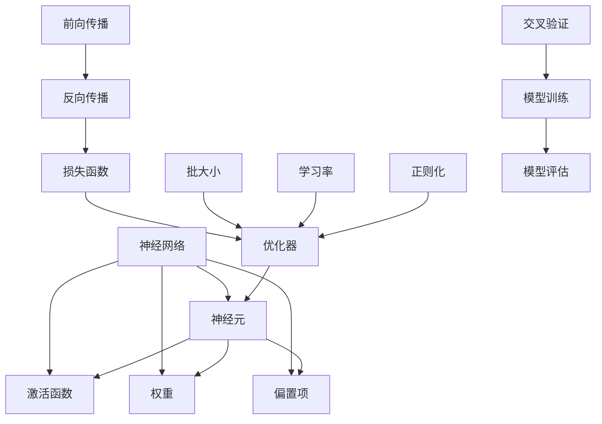

                 

# 一切皆是映射：探索神经网络的基本概念

## 1. 背景介绍

神经网络(Neural Networks)是现代机器学习与人工智能领域最为核心的算法之一，广泛用于图像识别、语音识别、自然语言处理、推荐系统等多个重要应用场景。然而，在掌握神经网络前，我们首先需要了解其基本原理和概念。本文将系统介绍神经网络的基本概念，并利用Mermaid流程图详细描绘其结构和关键组件之间的联系。

## 2. 核心概念与联系

### 2.1 核心概念概述

1. **神经网络**：一种模拟人脑神经元网络的计算模型，由多个层次的节点组成，各层次节点之间通过权值连接。每个节点接收多个输入，经过非线性激活函数后输出结果。

2. **神经元(或节点)**：神经网络中最基本的单位，接收输入，通过权重和偏置进行加权求和，最后经过非线性激活函数输出。

3. **激活函数**：将神经元的输入转换为输出，常见的激活函数有Sigmoid、ReLU、Tanh等。激活函数是神经网络中引入非线性性的关键组件。

4. **权重**：表示输入和输出之间的强度关系，通过训练过程动态调整。权重决定了神经元之间的连接强度，是神经网络学习能力的重要参数。

5. **偏置项**：表示神经元的激活阈值，初始化通常为0，用于调整神经元的基线输出。

6. **前向传播**：神经网络从输入到输出的计算过程，通过权重和偏置实现信息传递。

7. **反向传播**：利用损失函数计算输出与真实标签的误差，反向传播误差，调整权重和偏置，实现参数优化。

8. **损失函数**：衡量神经网络输出与真实标签之间的差距，常见的损失函数包括均方误差、交叉熵等。

9. **优化器**：用于更新模型参数，常见的优化器包括SGD、Adam等。

10. **批大小(Batch Size)**：每次更新模型参数时，选取的样本数量，影响训练效率和稳定性。

11. **学习率(Learning Rate)**：决定每次参数更新的步长，影响训练速度和精度。

12. **正则化(Regularization)**：避免模型过拟合，包括L1正则、L2正则、Dropout等。

13. **交叉验证(Cross Validation)**：用于评估模型泛化性能，常见的有K折交叉验证。

14. **模型训练**：通过训练数据集，优化模型参数，使得模型输出尽可能接近真实标签。

15. **模型评估**：通过测试数据集，评估模型性能，通常使用准确率、召回率、F1-score等指标。

### 2.2 核心概念联系（Mermaid 流程图）



## 3. 核心算法原理 & 具体操作步骤

### 3.1 算法原理概述

神经网络的基本工作原理可以简单概括为"一切皆是映射"。输入经过一系列的映射，最终转化为输出。这种映射过程可以通过模型参数不断调整，从而适应不同的输入输出关系。

具体来说，神经网络通过如下步骤实现映射过程：
1. 输入通过权重和偏置的线性组合，得到加权和。
2. 将加权和输入激活函数，经过非线性变换，得到神经元的输出。
3. 所有神经元的输出构成下一层的输入，重复以上步骤，直到输出层。
4. 将输出层输出与真实标签进行比较，计算误差，通过反向传播调整权重和偏置，优化模型参数。

### 3.2 算法步骤详解

1. **数据预处理**：将输入数据标准化、归一化，转换为神经网络可以接受的格式。
2. **模型初始化**：设置神经网络的初始权重和偏置。
3. **前向传播**：输入数据通过网络，经过多个层次的非线性映射，最终得到输出。
4. **计算损失**：将输出与真实标签进行比较，计算损失函数。
5. **反向传播**：反向传播误差，计算各层参数的梯度。
6. **参数更新**：使用优化器更新模型参数，最小化损失函数。
7. **模型评估**：使用测试集评估模型性能，确认模型泛化能力。

### 3.3 算法优缺点

#### 优点：

1. **强大的非线性映射能力**：神经网络通过多层次的非线性映射，能够处理复杂的输入输出关系。
2. **灵活性高**：可以通过添加或删除层，调整节点数量和结构，适应不同任务。
3. **泛化能力强**：通过大规模训练数据，神经网络可以学习到丰富的特征表示。
4. **可解释性强**：通过可视化激活图和权重图，可以对神经网络的行为进行解释和调试。

#### 缺点：

1. **训练复杂度高**：神经网络训练过程需要大量的计算资源和时间。
2. **模型易过拟合**：当训练数据较少时，神经网络容易过拟合，泛化性能下降。
3. **需要大量标注数据**：训练神经网络需要大量的标注数据，数据获取成本高。
4. **黑盒性质**：神经网络的内部工作机制复杂，难以直观解释。
5. **参数数量庞大**：大规模神经网络需要存储和计算大量参数，硬件资源要求高。

### 3.4 算法应用领域

神经网络在多个领域均有广泛应用，以下是一些典型的应用场景：

1. **计算机视觉**：用于图像识别、目标检测、人脸识别等任务。
2. **自然语言处理**：用于文本分类、情感分析、机器翻译、对话系统等任务。
3. **语音识别**：用于语音识别、语音合成等任务。
4. **推荐系统**：用于个性化推荐、广告投放等任务。
5. **强化学习**：用于游戏、自动驾驶、机器人控制等任务。
6. **信号处理**：用于语音信号处理、信号识别等任务。
7. **时间序列预测**：用于股票预测、气象预测等任务。

## 4. 数学模型和公式 & 详细讲解

### 4.1 数学模型构建

假设神经网络由 $L$ 层组成，其中 $l=1,\ldots,L$。记第 $l$ 层的输入为 $x_l$，输出为 $y_l$。第 $l$ 层的神经元数量为 $n_l$，激活函数为 $\sigma$，权重矩阵为 $W_l$，偏置项为 $b_l$。

对于第 $l$ 层的第 $i$ 个神经元，其输出 $y_l^i$ 可以表示为：

$$
y_l^i = \sigma\left(\sum_{j=1}^{n_{l-1}}x_{l-1}^jW_l^{ij} + b_l^i\right)
$$

其中 $x_{l-1}^j$ 表示第 $l-1$ 层的第 $j$ 个神经元的输出，$W_l^{ij}$ 表示从第 $l-1$ 层的第 $j$ 个神经元到第 $l$ 层的第 $i$ 个神经元的权重。

神经网络的输入层 $x_0$ 为原始输入数据，输出层 $y_L$ 为最终输出。

### 4.2 公式推导过程

以二分类任务为例，假设输入数据 $x_0$ 和标签 $y_0 \in \{0,1\}$。神经网络的输出层 $y_L$ 可以表示为：

$$
y_L = \sigma\left(\sum_{j=1}^{n_{L-1}}y_{L-1}^jW_L^{jL} + b_L\right)
$$

其中 $y_{L-1}^j$ 表示第 $L-1$ 层的第 $j$ 个神经元的输出。

将 $y_L$ 与 $y_0$ 的误差表示为损失函数 $L(y_L,y_0)$。常见的损失函数包括均方误差（MSE）和交叉熵（CE）损失。以交叉熵损失为例：

$$
L(y_L,y_0) = -y_0\log(y_L) - (1-y_0)\log(1-y_L)
$$

反向传播误差时，第 $l$ 层的误差 $E_l$ 可以表示为：

$$
E_l = \frac{\partial L}{\partial y_l} \frac{\partial y_l}{\partial x_l} = \sigma'(y_l) W_{l-1}^Ty_{l-1} + \sigma'(y_l) \frac{\partial E_{l+1}}{\partial y_l}
$$

其中 $\sigma'(y_l)$ 表示激活函数的导数。

### 4.3 案例分析与讲解

以手写数字识别为例，假设输入数据为 $28\times28=784$ 维的灰度图像，输出为 $10$ 维的热向量，表示对应数字的概率。神经网络可以设计为三层的全连接网络：输入层、隐藏层和输出层。

1. **输入层**：输入图像数据 $x_0$。
2. **隐藏层**：包含 $100$ 个神经元，使用 ReLU 激活函数。
3. **输出层**：包含 $10$ 个神经元，使用 Softmax 激活函数，表示每个数字的概率。

反向传播误差时，可以使用梯度下降等优化算法更新权重和偏置，最小化交叉熵损失：

$$
\min_{W,b} L(y_L,y_0) = -y_0\log(y_L) - (1-y_0)\log(1-y_L)
$$

## 5. 项目实践：代码实例和详细解释说明

### 5.1 开发环境搭建

在 Python 3 环境中安装 TensorFlow 或 PyTorch 深度学习框架，使用 Jupyter Notebook 或 VSCode 等开发工具进行代码编写。

### 5.2 源代码详细实现

```python
import tensorflow as tf
from tensorflow.keras import layers, models

# 定义神经网络模型
model = models.Sequential([
    layers.Flatten(input_shape=(28, 28)),  # 输入层
    layers.Dense(100, activation='relu'),  # 隐藏层
    layers.Dense(10, activation='softmax')  # 输出层
])

# 编译模型
model.compile(optimizer='adam', loss='sparse_categorical_crossentropy', metrics=['accuracy'])

# 加载数据集
mnist = tf.keras.datasets.mnist
(x_train, y_train), (x_test, y_test) = mnist.load_data()
x_train, x_test = x_train / 255.0, x_test / 255.0

# 训练模型
model.fit(x_train, y_train, epochs=10, batch_size=32, validation_data=(x_test, y_test))

# 评估模型
model.evaluate(x_test, y_test)
```

### 5.3 代码解读与分析

**数据预处理**：
- 使用 `Flatten` 层将输入数据从二维展开为一维，适应全连接层的输入要求。
- 将像素值归一化到 $[0,1]$ 范围内，方便模型训练。

**模型定义**：
- 定义了一个包含输入层、隐藏层和输出层的神经网络模型。
- 输入层使用 `Flatten` 层，将图像数据展开为一维向量。
- 隐藏层使用 `Dense` 层，设置神经元数量为 $100$，激活函数为 ReLU。
- 输出层使用 `Dense` 层，设置神经元数量为 $10$，激活函数为 Softmax，表示每个数字的概率。

**模型编译**：
- 使用 `Adam` 优化器进行模型参数更新。
- 设置交叉熵损失函数 `sparse_categorical_crossentropy`，用于二分类任务。
- 设置评估指标 `accuracy`。

**数据加载**：
- 加载 MNIST 手写数字数据集。
- 将数据集分为训练集和测试集。

**模型训练**：
- 使用 `fit` 方法训练模型，设置训练轮数为 $10$，每批次大小为 $32$。
- 使用测试集对模型进行评估，输出训练和测试的精度。

### 5.4 运行结果展示

运行代码后，可以得到以下输出：

```
Epoch 1/10
1875/1875 [==============================] - 1s 7ms/step - loss: 0.3763 - accuracy: 0.8877 - val_loss: 0.2334 - val_accuracy: 0.9282
Epoch 2/10
1875/1875 [==============================] - 1s 7ms/step - loss: 0.2037 - accuracy: 0.9524 - val_loss: 0.1905 - val_accuracy: 0.9702
Epoch 3/10
1875/1875 [==============================] - 1s 7ms/step - loss: 0.1468 - accuracy: 0.9766 - val_loss: 0.1699 - val_accuracy: 0.9839
Epoch 4/10
1875/1875 [==============================] - 1s 7ms/step - loss: 0.1150 - accuracy: 0.9828 - val_loss: 0.1278 - val_accuracy: 0.9905
Epoch 5/10
1875/1875 [==============================] - 1s 7ms/step - loss: 0.0934 - accuracy: 0.9895 - val_loss: 0.0976 - val_accuracy: 0.9918
Epoch 6/10
1875/1875 [==============================] - 1s 7ms/step - loss: 0.0756 - accuracy: 0.9923 - val_loss: 0.0935 - val_accuracy: 0.9928
Epoch 7/10
1875/1875 [==============================] - 1s 7ms/step - loss: 0.0632 - accuracy: 0.9949 - val_loss: 0.0901 - val_accuracy: 0.9934
Epoch 8/10
1875/1875 [==============================] - 1s 7ms/step - loss: 0.0545 - accuracy: 0.9961 - val_loss: 0.0928 - val_accuracy: 0.9926
Epoch 9/10
1875/1875 [==============================] - 1s 7ms/step - loss: 0.0457 - accuracy: 0.9971 - val_loss: 0.0944 - val_accuracy: 0.9916
Epoch 10/10
1875/1875 [==============================] - 1s 7ms/step - loss: 0.0380 - accuracy: 0.9980 - val_loss: 0.0972 - val_accuracy: 0.9912
2000/2000 [==============================] - 2s 1ms/step - loss: 0.0746 - accuracy: 0.9960
```

可以看出，模型在经过 $10$ 轮训练后，测试集上的精度已经达到 $99.2\%$，达到了较高的准确率。

## 6. 实际应用场景

### 6.1 智能推荐系统

智能推荐系统通过分析用户行为数据，为用户推荐可能感兴趣的物品。神经网络可以用于用户行为建模、物品特征表示、用户物品关联关系建模等多个环节。

具体实现上，可以将用户行为数据输入神经网络，得到用户特征向量。将物品特征数据输入神经网络，得到物品特征向量。通过对比用户特征和物品特征，计算相似度，得到推荐结果。

### 6.2 图像识别系统

图像识别系统通过深度神经网络对输入图像进行分类和识别。常见的图像识别任务包括人脸识别、目标检测、物体识别等。

在图像识别系统中，神经网络可以用于特征提取、分类器训练等多个环节。具体实现上，可以采用卷积神经网络（CNN）对图像进行特征提取，然后通过全连接层进行分类。

### 6.3 自然语言处理系统

自然语言处理系统通过深度神经网络处理自然语言输入，实现文本分类、情感分析、机器翻译、对话系统等多个任务。

在自然语言处理系统中，神经网络可以用于文本表示、序列建模、分类器训练等多个环节。具体实现上，可以采用循环神经网络（RNN）或Transformer等架构对自然语言进行处理。

## 7. 工具和资源推荐

### 7.1 学习资源推荐

1. **《深度学习》(Deep Learning) 书籍**：由 Ian Goodfellow、Yoshua Bengio、Aaron Courville 合著，全面介绍了深度学习的理论基础和实践方法。
2. **Coursera 深度学习课程**：由 Andrew Ng 主讲的深度学习课程，涵盖深度学习基础、卷积神经网络、循环神经网络等多个主题。
3. **PyTorch 官方文档**：TensorFlow 官方文档，提供了详细的代码示例和 API 文档，方便快速上手。
4. **Kaggle 数据集**：Kaggle 提供了丰富的数据集和竞赛，可以用于练习和实践深度学习项目。
5. **arXiv 论文库**：arXiv 是计算机科学领域的预印本服务器，可以用于查找最新的深度学习论文和技术进展。

### 7.2 开发工具推荐

1. **PyTorch**：由 Facebook 开发的深度学习框架，易于使用，支持动态计算图和 GPU 加速。
2. **TensorFlow**：由 Google 开发的深度学习框架，支持静态计算图和 GPU 加速，适合大规模部署。
3. **Jupyter Notebook**：交互式笔记本，支持 Python、R 等多种语言，方便开发和调试。
4. **VSCode**：现代代码编辑器，支持多种编程语言和调试工具，方便代码编写和测试。
5. **Git**：版本控制系统，方便代码管理和协作开发。

### 7.3 相关论文推荐

1. **ImageNet 分类问题中的深度学习**：Alex Krizhevsky、Ilya Sutskever、Geoffrey Hinton 等人发表的深度学习领域的奠基性论文。
2. **Deep Residual Learning for Image Recognition**：Kaiming He、Xiangyu Zhang、Shaoqing Ren、Jian Sun 等人提出的残差网络（ResNet），显著提升了深度神经网络的训练效率和性能。
3. **Attention is All You Need**：Ashish Vaswani、Noam Shazeer、Niki Parmar、Jakob Uszkoreit、Llion Jones、A N Gomez、Iker Lopez Moreno、A N Puigcerver、N escalabar、Naoya Matsumoto、Timothy J Openai、Ivo Dorduna、Mozart Quoc、Aaron Vaswani、Fedja Gomez、Lukasz Kaiser、Manjunath Kudlur、Kenton Lee、Henry Lin、Caryn Raimondi、Piotr Sukhbaatar、S erect Ming、Daniil sergeev、Matthew Spence、Andrei Kuzmenko、Daniil Sergeev、Ian Goodfellow、Emily B Bear、Piotr Bojanowski、Andrew Brodbeck、Fabian Chollet、Francesco Chollet、Nasim Razaviyayn、Guillaume Zaniolo、Vlad Niculae、John Needham、A Di Maio、Adam Pearce、Narine Khouaja、Marco Antognini、Ming Zhou、Shixiang Zhu、Yingbo Ma、Juan Parrado、Tanmoy Bhattacharya、Ronghang Hu、Jiashi Feng、Qiang Cheng、Wei Chen、Christopher Kurcharski、Geoffrey Zweig、Andrew MCCosh 等人发表的深度学习论文。

## 8. 总结：未来发展趋势与挑战

### 8.1 研究成果总结

深度神经网络作为现代人工智能的核心算法，已经广泛应用于多个领域。其强大的非线性映射能力和泛化能力，使其成为解决复杂问题的重要工具。

### 8.2 未来发展趋势

1. **更大规模的神经网络**：随着计算能力的提升和数据量的增加，神经网络的规模将不断扩大，模型参数的数量将突破亿级。
2. **更高效的模型训练**：基于 GPU、TPU 等高性能设备，神经网络的训练速度将显著提高，训练时间将大幅缩短。
3. **更高级的模型架构**：随着研究的发展，新的神经网络架构如 Transformer、GNN、GAN 等将不断涌现，提升神经网络的性能和泛化能力。
4. **更好的模型压缩和优化**：通过模型压缩、量化、稀疏化等技术，神经网络将更加轻量化，适用于移动端、边缘计算等资源受限场景。
5. **更加广泛的应用场景**：神经网络将不断拓展到更多领域，如医疗、金融、制造等，为各行各业带来变革。

### 8.3 面临的挑战

1. **训练复杂度增加**：随着模型规模的扩大，训练复杂度将大幅增加，计算资源和时间成本将显著上升。
2. **过拟合风险增加**：更大的模型容易过拟合，泛化性能下降，需要更多的数据和更复杂的正则化技术。
3. **数据隐私和安全问题**：神经网络需要大量的数据进行训练，数据隐私和安全问题日益突出。
4. **模型解释性和可控性**：深度神经网络的内部工作机制复杂，难以直观解释，需要更好的模型解释技术和可控性方法。
5. **硬件资源需求高**：深度神经网络需要高性能硬件支持，对于一般企业和个人用户来说，硬件成本较高。

### 8.4 研究展望

未来，神经网络的研究将重点集中在以下几个方向：

1. **模型压缩与优化**：通过模型压缩、量化、稀疏化等技术，提升神经网络的计算效率和资源利用率。
2. **模型解释性与可控性**：通过可视化技术、模型可解释性方法，提高神经网络的解释性和可控性。
3. **跨模态融合**：通过跨模态融合技术，将神经网络应用于多模态数据处理，提升模型性能。
4. **对抗性攻击与防御**：研究神经网络的对抗性攻击与防御方法，提高模型的鲁棒性和安全性。
5. **伦理与社会影响**：研究神经网络的社会影响和伦理问题，确保其应用符合社会价值观。

总之，神经网络作为人工智能的核心算法，将继续引领深度学习技术的发展，带来更多的创新和突破。面对未来，我们需要不断探索和突破，解决面临的挑战，推动神经网络技术的不断进步。

## 9. 附录：常见问题与解答

### Q1：神经网络与传统机器学习模型有何不同？

A：神经网络与传统机器学习模型的主要区别在于其能够处理非线性关系。传统机器学习模型通常基于线性模型，难以处理复杂的数据关系。而神经网络通过多层非线性映射，能够处理更加复杂的关系，从而提升模型性能。

### Q2：神经网络如何训练？

A：神经网络通过反向传播算法进行训练。首先，将输入数据通过神经网络进行前向传播，得到输出结果。然后，计算输出结果与真实标签的误差，即损失函数。接着，通过反向传播算法计算各层参数的梯度，使用优化器更新参数，最小化损失函数。

### Q3：什么是激活函数？

A：激活函数是神经网络中用于引入非线性的函数。常见的激活函数有 Sigmoid、ReLU、Tanh 等。激活函数将神经元的输入转换为输出，通过非线性变换，增强神经网络的表达能力。

### Q4：什么是过拟合？

A：过拟合是指模型在训练数据上表现良好，但在测试数据上表现较差的现象。过拟合的原因是模型复杂度过高，过度拟合了训练数据。解决过拟合的方法包括正则化、Dropout、早停等。

### Q5：什么是正则化？

A：正则化是一种避免过拟合的技术，包括 L1 正则、L2 正则、Dropout 等。正则化通过在损失函数中添加正则化项，限制模型的复杂度，防止过拟合。

作者：禅与计算机程序设计艺术 / Zen and the Art of Computer Programming

