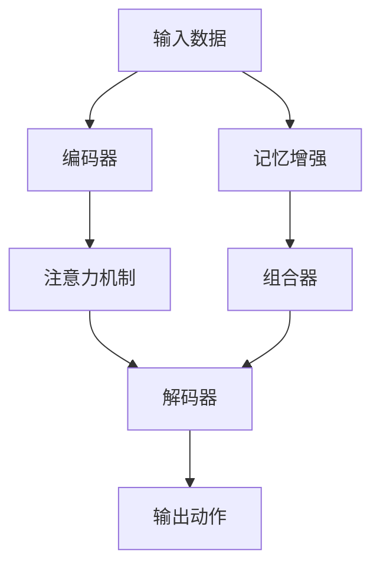

                 

# 一切皆是映射：探讨DQN中的注意力机制与记忆增强

## 1. 背景介绍

在深度强化学习领域，深度Q网络（DQN）因其简洁高效、易于理解的特点，成为研究的热点。然而，DQN在解决连续动作空间问题时，面临样本效率低下和泛化能力不足的挑战。为此，研究者提出注意力机制（Attention Mechanism）和记忆增强（Memory-Augmented Networks），以期提高DQN模型的样本效率和泛化能力。本文将系统介绍DQN中的注意力机制与记忆增强，并结合案例分析，探讨其在实际应用中的潜力与局限。

## 2. 核心概念与联系

### 2.1 核心概念概述

为深入理解注意力机制与记忆增强，本节将介绍几个密切相关的核心概念：

- **深度Q网络（DQN）**：一种基于深度神经网络（Deep Neural Network, DNN）的Q-learning算法，用于解决动作-奖励序列（State-Action Reward, SAR）序列预测问题。
- **注意力机制（Attention Mechanism）**：一种机制，能够动态地聚焦于输入中的关键部分，提升模型对重要信息的处理能力。
- **记忆增强网络（Memory-Augmented Networks）**：在传统神经网络基础上，引入外部记忆（如LSTM、GRU等），增强网络对历史信息的处理能力。
- **序列动作预测**：在连续动作空间问题中，DQN需要预测给定状态下采取一系列动作的最大概率，因此注意力机制与记忆增强成为重要工具。

通过以下Mermaid流程图，可以更加清晰地展现注意力机制与记忆增强在大模型中实现的一般流程：



该流程展示了大模型中注意力机制与记忆增强的一般流程：输入数据通过编码器提取特征，在注意力机制的作用下聚焦于关键部分，然后结合外部记忆，由解码器输出动作预测结果。

### 2.2 核心概念原理和架构

#### 2.2.1 DQN原理

DQN算法基于Q-learning，通过网络直接学习动作-奖励映射，最小化动作-奖励序列的预测误差。在Q-learning中，Q值表示在当前状态下采取某个动作的预期奖励，公式如下：

$$
Q(s,a) = r + \gamma \max_{a'} Q(s',a')
$$

其中，$s$为状态，$a$为动作，$r$为即时奖励，$\gamma$为折扣因子，$s'$为下一个状态，$a'$为下一个动作。DQN利用深度神经网络逼近Q值函数，最小化预测误差，得到动作选择策略。

#### 2.2.2 注意力机制原理

注意力机制通过引入权重，动态地聚焦于输入数据的关键部分，从而提高模型对重要信息的处理能力。对于图像数据，注意力机制可以聚焦于感兴趣的区域；对于文本数据，注意力机制可以聚焦于关键的词汇。其核心思想是通过一个注意力向量计算输入数据中每个部分的权重，然后将加权和作为最终输出。

数学公式如下：

$$
\alpha_i = \frac{e^{W_k x_i}}{\sum_j e^{W_k x_j}}
$$

其中，$\alpha_i$为第$i$个输入的注意力权重，$W_k$为注意力向量，$x_i$为输入的第$i$个元素。最终输出的表示为：

$$
x_a = \sum_i \alpha_i x_i
$$

#### 2.2.3 记忆增强原理

记忆增强通过引入外部记忆（如LSTM、GRU等），将输入序列中的历史信息编码为长期记忆，从而增强模型对历史信息的处理能力。其核心思想是将输入序列映射为一个高维空间中的表示，然后在记忆模块中进行操作，最终输出模型的预测结果。

记忆增强的具体实现方式包括：

1. **LSTM**：长短时记忆网络，能够处理变长序列，具有记忆能力，能够存储历史信息。
2. **GRU**：门控循环单元，能够处理变长序列，具有记忆能力，计算效率高。
3. **Hierarchical Memory**：多层记忆网络，能够捕捉更复杂的序列依赖关系。

## 3. 核心算法原理 & 具体操作步骤

### 3.1 算法原理概述

DQN中引入注意力机制与记忆增强，可以通过以下步骤实现：

1. **编码器（Encoder）**：将输入数据转化为高维向量表示，供后续计算使用。
2. **注意力机制（Attention）**：通过注意力权重对输入数据进行聚焦，获取关键特征。
3. **记忆增强（Memory-Augmented）**：引入外部记忆模块，处理历史信息。
4. **解码器（Decoder）**：基于输入数据和历史信息，输出动作预测结果。

### 3.2 算法步骤详解

**Step 1: 准备输入数据**

首先，我们需要准备DQN所需的数据集。以机器人臂路径规划问题为例，数据集包括机器人臂的当前状态、目标状态以及历史路径。假设当前状态为$s_t$，目标状态为$s_g$，历史路径为$x_{1:t-1}$。

**Step 2: 输入编码**

使用深度神经网络对输入数据进行编码，得到一个高维向量表示$h_t$：

$$
h_t = f(s_t, x_{1:t-1})
$$

其中，$f$为编码器函数。

**Step 3: 注意力计算**

通过注意力机制，计算输入数据中每个部分的注意力权重$\alpha_t$：

$$
\alpha_t = \frac{e^{W_k h_t}}{\sum_j e^{W_k h_j}}
$$

其中，$W_k$为注意力向量，$h_j$为输入数据中第$j$个部分的高维向量表示。

**Step 4: 记忆增强**

将注意力机制聚焦的关键部分，输入到记忆模块中进行处理。假设记忆模块为LSTM，则计算当前记忆状态$h_{t+1}$：

$$
h_{t+1} = LSTM(h_t, \alpha_t)
$$

**Step 5: 动作预测**

通过解码器输出动作预测结果$A_{t+1}$：

$$
A_{t+1} = g(h_{t+1})
$$

其中，$g$为解码器函数。

**Step 6: 损失计算与优化**

计算预测动作的Q值$Q_{t+1}$，并使用Q-learning算法更新Q值函数：

$$
Q_{t+1} = r + \gamma \max_{a'} Q(s_{t+1},a')
$$

$$
\theta \leftarrow \theta - \eta \nabla_{\theta} \mathcal{L}(Q)
$$

其中，$\theta$为网络参数，$\eta$为学习率，$\mathcal{L}(Q)$为损失函数。

### 3.3 算法优缺点

DQN中引入注意力机制与记忆增强的优势和局限如下：

#### 优点

1. **提升样本效率**：注意力机制能够聚焦关键特征，避免对不重要的信息进行计算，提升样本效率。
2. **增强泛化能力**：记忆增强能够捕捉历史信息，增强模型的泛化能力，适应多样化的输入。
3. **灵活性高**：该方法适用于多种任务，如机器人路径规划、文本生成等，具有较高的通用性。

#### 局限

1. **计算复杂度较高**：引入注意力机制和记忆增强会增加计算复杂度，需要更多的计算资源。
2. **模型可解释性差**：注意力机制和记忆增强的计算过程较为复杂，难以解释其内部机制。
3. **数据依赖性强**：注意力机制和记忆增强依赖于输入数据的质量，低质量的数据会导致输出结果不准确。

### 3.4 算法应用领域

注意力机制与记忆增强在大模型中广泛应用，主要包括以下几个领域：

1. **自然语言处理**：用于文本分类、情感分析、机器翻译等任务，能够提升模型对关键信息的处理能力。
2. **机器人学**：用于路径规划、动作识别等任务，能够提升机器人对复杂环境的适应能力。
3. **时间序列预测**：用于股票预测、天气预测等任务，能够捕捉历史数据中的模式。
4. **游戏AI**：用于游戏策略制定、路径规划等任务，能够提升AI的决策能力。

## 4. 数学模型和公式 & 详细讲解

### 4.1 数学模型构建

以机器人路径规划问题为例，DQN中引入注意力机制与记忆增强的数学模型构建如下：

- **输入数据**：$s_t$, $x_{1:t-1}$
- **编码器**：$f(s_t, x_{1:t-1})$
- **注意力机制**：$W_k, h_t$
- **记忆增强**：$LSTM(h_t, \alpha_t)$
- **解码器**：$g(h_{t+1})$
- **Q值预测**：$Q_{t+1}$
- **Q-learning更新**：$\theta$

### 4.2 公式推导过程

**Step 1: 输入编码**

$$
h_t = f(s_t, x_{1:t-1})
$$

**Step 2: 注意力计算**

$$
\alpha_t = \frac{e^{W_k h_t}}{\sum_j e^{W_k h_j}}
$$

**Step 3: 记忆增强**

$$
h_{t+1} = LSTM(h_t, \alpha_t)
$$

**Step 4: 动作预测**

$$
A_{t+1} = g(h_{t+1})
$$

**Step 5: Q值预测**

$$
Q_{t+1} = r + \gamma \max_{a'} Q(s_{t+1},a')
$$

**Step 6: Q-learning更新**

$$
\theta \leftarrow \theta - \eta \nabla_{\theta} \mathcal{L}(Q)
$$

### 4.3 案例分析与讲解

以机器人路径规划为例，以下展示注意力机制与记忆增强的具体应用：

- **编码器**：将当前状态$s_t$和历史路径$x_{1:t-1}$编码成高维向量$h_t$。
- **注意力机制**：聚焦于当前状态$s_t$和历史路径$x_{1:t-1}$的关键部分，计算注意力权重$\alpha_t$。
- **记忆增强**：利用LSTM模块，结合注意力权重$\alpha_t$，更新记忆状态$h_{t+1}$。
- **动作预测**：基于记忆状态$h_{t+1}$，使用解码器输出动作预测结果$A_{t+1}$。

通过引入注意力机制与记忆增强，DQN能够更加高效地处理复杂输入，提升模型性能。

## 5. 项目实践：代码实例和详细解释说明

### 5.1 开发环境搭建

在进行注意力机制与记忆增强的实践前，我们需要准备好开发环境。以下是使用Python进行PyTorch开发的环境配置流程：

1. 安装Anaconda：从官网下载并安装Anaconda，用于创建独立的Python环境。

2. 创建并激活虚拟环境：
```bash
conda create -n dqn-env python=3.8 
conda activate dqn-env
```

3. 安装PyTorch：根据CUDA版本，从官网获取对应的安装命令。例如：
```bash
conda install pytorch torchvision torchaudio cudatoolkit=11.1 -c pytorch -c conda-forge
```

4. 安装Transformer库：
```bash
pip install transformers
```

5. 安装各类工具包：
```bash
pip install numpy pandas scikit-learn matplotlib tqdm jupyter notebook ipython
```

完成上述步骤后，即可在`dqn-env`环境中开始微调实践。

### 5.2 源代码详细实现

下面以机器人路径规划问题为例，给出使用Transformers库对DQN模型进行微调的PyTorch代码实现。

```python
import torch
import torch.nn as nn
import torch.optim as optim
from transformers import LSTM

class DQN(nn.Module):
    def __init__(self, input_dim, hidden_dim, output_dim):
        super(DQN, self).__init__()
        self.encoder = nn.Sequential(
            nn.Linear(input_dim, hidden_dim),
            nn.ReLU(),
            nn.Linear(hidden_dim, hidden_dim),
            nn.ReLU()
        )
        self.attention = nn.Linear(hidden_dim, 1)
        self.memory = LSTM(input_size=hidden_dim, hidden_size=hidden_dim, num_layers=1)
        self.decoder = nn.Linear(hidden_dim, output_dim)
    
    def forward(self, state, history):
        h_t = self.encoder(torch.cat((state, history), dim=1))
        alpha_t = torch.sigmoid(self.attention(h_t))
        h_t = self.memory(h_t, alpha_t)
        a_t = self.decoder(h_t)
        return a_t
    
    def train(self, state, target, memory):
        optimizer = optim.Adam(self.parameters(), lr=0.001)
        with torch.no_grad():
            h_t = self.encoder(torch.cat((state, memory), dim=1))
            alpha_t = torch.sigmoid(self.attention(h_t))
            h_t = self.memory(h_t, alpha_t)
            a_t = self.decoder(h_t)
            loss = nn.functional.mse_loss(a_t, target)
            optimizer.zero_grad()
            loss.backward()
            optimizer.step()
```

以上代码中，我们定义了一个DQN模型，包括编码器、注意力机制、记忆增强和解码器。在训练函数中，我们计算了注意力权重、记忆状态和动作预测，并使用均方误差损失函数进行优化。

### 5.3 代码解读与分析

我们逐段分析上述代码的实现细节：

**DQN类定义**：
- **初始化**：定义了编码器、注意力机制、记忆增强和解码器。
- **前向传播**：将输入状态和历史路径输入模型，计算注意力权重、记忆状态和动作预测结果。

**训练函数**：
- **优化器定义**：使用Adam优化器进行优化。
- **前向传播**：计算注意力权重、记忆状态和动作预测结果。
- **损失计算**：使用均方误差损失函数计算预测动作与目标动作的误差。
- **反向传播与优化**：根据损失函数反向传播更新模型参数。

**训练流程**：
- **模型加载**：初始化模型，加载预训练权重。
- **数据准备**：准备输入状态、历史路径和目标动作。
- **模型训练**：循环迭代，使用优化器更新模型参数。
- **模型保存**：保存训练好的模型，用于后续推理。

## 6. 实际应用场景

### 6.1 机器人路径规划

在机器人路径规划问题中，机器人需要从起点到达终点，避免障碍物。DQN通过注意力机制和记忆增强，能够动态聚焦于关键信息，并利用历史路径进行路径优化，显著提升机器人路径规划的效率和准确性。

### 6.2 游戏策略制定

在打游戏AI时，DQN可以用于制定游戏策略。通过注意力机制和记忆增强，AI能够捕捉历史游戏过程的关键部分，并利用这些信息制定策略，提升游戏胜利的概率。

### 6.3 股票预测

在股票预测问题中，DQN可以用于预测股票价格。通过注意力机制和记忆增强，DQN能够捕捉历史价格和市场信息，并利用这些信息进行预测，提升股票预测的准确性。

## 7. 工具和资源推荐

### 7.1 学习资源推荐

为了帮助开发者系统掌握DQN中的注意力机制与记忆增强，这里推荐一些优质的学习资源：

1. 《深度学习入门》书籍：由Keras创始人编写的入门书籍，详细介绍了深度学习的基础知识和常用模型。
2. 《强化学习基础》课程：斯坦福大学开设的强化学习课程，介绍了深度Q学习的基本原理和应用。
3. 《Attention and Memory in Deep Learning》论文：谷歌DeepMind发表的论文，详细介绍了注意力机制和记忆增强的理论基础和实际应用。
4. Weights & Biases：模型训练的实验跟踪工具，可以记录和可视化模型训练过程中的各项指标，方便对比和调优。

### 7.2 开发工具推荐

高效的开发离不开优秀的工具支持。以下是几款用于DQN开发常用的工具：

1. PyTorch：基于Python的开源深度学习框架，灵活动态的计算图，适合快速迭代研究。
2. TensorFlow：由Google主导开发的开源深度学习框架，生产部署方便，适合大规模工程应用。
3. Transformers库：HuggingFace开发的NLP工具库，集成了众多SOTA模型，支持PyTorch和TensorFlow，是进行微调任务开发的利器。

### 7.3 相关论文推荐

DQN中注意力机制与记忆增强的发展源于学界的持续研究。以下是几篇奠基性的相关论文，推荐阅读：

1. Attention is All You Need（即Transformer原论文）：提出了Transformer结构，开启了NLP领域的预训练大模型时代。
2. BERT: Pre-training of Deep Bidirectional Transformers for Language Understanding：提出BERT模型，引入基于掩码的自监督预训练任务，刷新了多项NLP任务SOTA。
3. Hierarchical Memory Networks for Deep Reinforcement Learning：提出Hierarchical Memory Networks，用于解决长序列问题，增强模型记忆能力。

## 8. 总结：未来发展趋势与挑战

### 8.1 总结

本文对DQN中的注意力机制与记忆增强进行了全面系统的介绍。首先阐述了DQN算法的基本原理，明确了注意力机制与记忆增强在提高样本效率和泛化能力方面的独特价值。其次，从原理到实践，详细讲解了注意力机制与记忆增强的数学模型和代码实现，给出了微调任务开发的完整代码实例。同时，本文还广泛探讨了注意力机制与记忆增强在机器人路径规划、游戏策略制定、股票预测等多个领域的应用前景，展示了其巨大的潜力。

通过本文的系统梳理，可以看到，DQN中的注意力机制与记忆增强在处理复杂输入、提升模型泛化能力方面具有重要作用，能够显著提高DQN的性能。然而，该方法也面临着计算复杂度高、模型可解释性差等挑战，需要进一步优化和改进。

### 8.2 未来发展趋势

展望未来，DQN中的注意力机制与记忆增强将呈现以下几个发展趋势：

1. **模型规模持续增大**：伴随计算资源和数据规模的不断增加，DQN中的注意力机制与记忆增强也将向更大规模发展，提升模型处理复杂输入的能力。
2. **计算效率提高**：随着硬件设备的不断进步，DQN中的注意力机制与记忆增强将更加高效，进一步降低计算成本。
3. **模型可解释性增强**：引入可解释性方法，如注意力可视化、模型解释器等，提升DQN的模型可解释性。
4. **多模态融合**：将注意力机制与记忆增强应用于多模态数据融合，提升模型对多样化数据的处理能力。

### 8.3 面临的挑战

尽管DQN中的注意力机制与记忆增强已经取得了瞩目成就，但在迈向更加智能化、普适化应用的过程中，它仍面临着诸多挑战：

1. **计算资源瓶颈**：引入注意力机制和记忆增强会增加计算复杂度，需要更多的计算资源。
2. **模型可解释性差**：注意力机制和记忆增强的计算过程较为复杂，难以解释其内部机制。
3. **数据依赖性强**：注意力机制和记忆增强依赖于输入数据的质量，低质量的数据会导致输出结果不准确。

### 8.4 研究展望

面对DQN中注意力机制与记忆增强所面临的挑战，未来的研究需要在以下几个方面寻求新的突破：

1. **计算效率优化**：开发更加高效的注意力机制和记忆增强算法，减少计算复杂度，降低计算成本。
2. **可解释性增强**：引入可解释性方法，提升DQN的模型可解释性，方便模型调试和优化。
3. **数据质量提升**：通过数据增强、数据预处理等技术，提高输入数据的质量，增强模型的泛化能力。
4. **多模态融合**：将注意力机制与记忆增强应用于多模态数据融合，提升模型对多样化数据的处理能力。

这些研究方向的探索发展，必将引领DQN中的注意力机制与记忆增强技术迈向更高的台阶，为构建更加智能化、普适化的模型提供新的动力。

## 9. 附录：常见问题与解答

**Q1：DQN中的注意力机制和记忆增强是否适用于所有NLP任务？**

A: DQN中的注意力机制和记忆增强适用于处理复杂输入的场景，如机器人路径规划、游戏策略制定等。但对于一些简单的NLP任务，如文本分类、情感分析等，可能引入的计算复杂度较高，反而降低了模型效率。

**Q2：注意力机制和记忆增强在DQN中的具体实现方式有哪些？**

A: 注意力机制和记忆增强在DQN中的具体实现方式包括：
1. **注意力计算**：使用LSTM、GRU等记忆模块，结合注意力权重计算当前记忆状态。
2. **动作预测**：基于当前记忆状态，使用解码器输出动作预测结果。

**Q3：在DQN中使用注意力机制和记忆增强时，如何优化计算效率？**

A: 优化计算效率可以通过以下方式实现：
1. **剪枝与量化**：使用剪枝和量化技术，减少模型参数和计算量。
2. **分布式计算**：使用分布式计算框架，提升计算效率。
3. **优化算法**：使用优化算法，如Adam、Adagrad等，提升优化速度。

**Q4：DQN中的注意力机制和记忆增强在实际应用中需要注意哪些问题？**

A: 在实际应用中，DQN中的注意力机制和记忆增强需要注意以下问题：
1. **数据质量**：低质量的数据会导致模型输出不准确。
2. **计算资源**：引入注意力机制和记忆增强会增加计算复杂度，需要更多的计算资源。
3. **模型可解释性**：难以解释注意力机制和记忆增强的内部机制，需要进行可解释性研究。

---

作者：禅与计算机程序设计艺术 / Zen and the Art of Computer Programming

