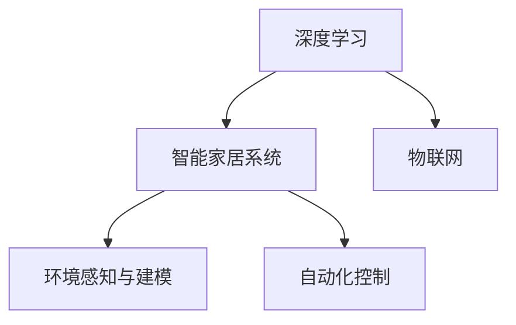

                 

# 一切皆是映射：深度学习在智能家居系统中的应用

> 关键词：深度学习, 智能家居, 物联网, 自动控制, 神经网络, 数据挖掘, 环境感知

## 1. 背景介绍

### 1.1 问题由来
随着人工智能技术的迅猛发展，智能家居系统（Smart Home System）正逐渐从科幻小说中的概念变为现实。通过集成的传感器和控制设备，智能家居系统能够自动化地管理家庭环境，提高生活舒适度和便捷性。这些系统涵盖照明、安防、温控、娱乐等多个方面，实现全面智能化。

### 1.2 问题核心关键点
智能家居系统核心在于通过深度学习技术实现对环境数据的智能分析与预测，进而驱动自动化控制设备进行最优决策。这些深度学习模型需要集成大量实时数据，涵盖温度、湿度、光照、声音等环境传感器数据，以及人体活动、作息时间等行为数据。通过综合这些多维数据，深度学习模型能够实现对家庭环境的精准感知和智能响应。

### 1.3 问题研究意义
研究深度学习在智能家居系统中的应用，对于提升家庭生活质量、降低能源消耗、优化居住环境具有重要意义：

1. **提高能效**：智能家居系统通过学习用户行为和环境变化，实时调整设备运行状态，实现节能减排。
2. **提升生活体验**：自动化控制设备可以基于用户习惯和偏好自动调整环境参数，提供更舒适便捷的居住环境。
3. **安全保障**：通过集成安防系统，深度学习模型能够识别潜在的安全风险，增强家庭安全性。
4. **数据驱动决策**：大数据分析不仅能够优化设备运行，还能为家庭决策提供科学依据。

## 2. 核心概念与联系

### 2.1 核心概念概述

为更好地理解深度学习在智能家居系统中的应用，本节将介绍几个密切相关的核心概念：

- **深度学习（Deep Learning）**：一种模拟人脑神经网络结构的学习技术，通过多层非线性变换实现复杂模式识别与预测。深度学习模型包括神经网络、卷积神经网络（CNN）、循环神经网络（RNN）等。
- **智能家居系统（Smart Home System）**：通过传感器、控制器、通信网络等硬件设备，实现家居环境的智能化管理。
- **物联网（IoT）**：连接智能设备的网络系统，实现设备间的数据通信与互联。
- **环境感知与建模**：通过传感器数据进行深度学习建模，实现对环境状态的智能理解与预测。
- **自动化控制**：基于模型预测结果，自动调整设备运行状态，实现智能化操作。

这些核心概念之间的逻辑关系可以通过以下Mermaid流程图来展示：



这个流程图展示了大语言模型的核心概念及其之间的关系：

1. 深度学习通过模型训练获得对环境数据的理解。
2. 智能家居系统利用深度学习进行环境感知和预测。
3. 物联网提供设备间的数据通信基础。
4. 环境感知与建模通过传感器数据实现。
5. 自动化控制根据预测结果调整设备状态。

## 3. 核心算法原理 & 具体操作步骤
### 3.1 算法原理概述

深度学习在智能家居系统中的应用主要通过以下几个步骤实现：

1. **数据采集与预处理**：收集传感器数据和行为数据，进行数据清洗、归一化等预处理。
2. **环境建模与预测**：使用深度学习模型对传感器数据进行建模，预测未来的环境状态。
3. **设备控制与优化**：根据预测结果，自动调整设备运行状态，实现最优控制。

这些步骤可以通过以下数学公式进行形式化描述：

- 传感器数据：$x_i = (x_{i1}, x_{i2}, ..., x_{im})$
- 行为数据：$y_j = (y_{j1}, y_{j2}, ..., y_{jn})$
- 预测模型：$f(x_i; \theta) = (f_{1}(x_i; \theta_1), f_{2}(x_i; \theta_2), ..., f_{k}(x_i; \theta_k))$
- 控制策略：$u = \mathop{\arg\min}_{u} \sum_{i=1}^n L(u; y_i, f(x_i; \theta))$
- 优化目标：$\min_{\theta} J(\theta) = \mathbb{E}[\ell(y, f(x; \theta))]$

### 3.2 算法步骤详解

以下是对深度学习在智能家居系统中的应用步骤的详细描述：

**Step 1: 数据采集与预处理**

智能家居系统通过集成各种传感器获取实时环境数据。例如，温度传感器（Temperature Sensor）、湿度传感器（Humidity Sensor）、光照传感器（Light Sensor）等。同时，通过物联网技术将这些数据汇集到中央控制中心。为了提升数据质量，需要进行预处理，如数据清洗（去除噪声）、归一化（使数据量级一致）、特征提取（提取对模型有用的特征）等。

**Step 2: 环境建模与预测**

使用深度学习模型对采集到的数据进行建模。例如，可以使用卷积神经网络（CNN）对图像数据进行分类与识别；使用长短期记忆网络（LSTM）对时间序列数据进行预测；使用深度神经网络（DNN）对多维数据进行综合分析。通过模型训练，实现对环境状态的精准预测。

**Step 3: 设备控制与优化**

根据模型的预测结果，自动调整设备运行状态。例如，自动调节空调温度，自动调节灯光亮度，自动控制窗帘开合等。同时，使用优化算法（如梯度下降）不断调整模型参数，提升模型的预测精度。

### 3.3 算法优缺点

深度学习在智能家居系统中的应用具有以下优点：

1. **高精度**：通过大量数据的训练，深度学习模型能够实现高精度的环境预测与控制。
2. **自适应性**：模型能够根据环境和用户习惯的变化，实时调整预测与控制策略。
3. **实时性**：通过分布式计算和优化算法，深度学习模型能够快速响应环境变化。

同时，深度学习也存在以下缺点：

1. **数据需求大**：深度学习模型需要大量标注数据进行训练，获取高质量数据成本较高。
2. **计算资源消耗大**：深度学习模型参数量较大，需要高性能硬件支持。
3. **解释性不足**：深度学习模型“黑盒”特性明显，难以解释其决策过程。

### 3.4 算法应用领域

深度学习在智能家居系统中的应用，涵盖了以下多个领域：

- **温控系统**：通过深度学习预测房间温度，自动调节空调和暖气设备，实现舒适节能的室内温度管理。
- **照明系统**：根据时间、天气和用户习惯，自动调节灯光亮度与色温，提升居住舒适度。
- **安防系统**：通过深度学习识别异常行为和潜在安全风险，自动报警并联动安防设备，增强家庭安全。
- **娱乐系统**：根据用户偏好和环境状态，智能推荐影音内容，提升娱乐体验。
- **健康监测**：通过传感器数据进行深度学习建模，监测家庭成员健康状况，提供健康建议。

## 4. 数学模型和公式 & 详细讲解 & 举例说明

### 4.1 数学模型构建

深度学习在智能家居系统中的应用，主要通过以下数学模型进行描述：

- **感知模型**：通过传感器数据进行建模，实现对环境状态的感知。
- **预测模型**：使用神经网络对感知数据进行预测，实现对环境状态的预测。
- **控制模型**：根据预测结果，调整设备运行状态，实现智能控制。

### 4.2 公式推导过程

以温度控制为例，假设传感器数据 $x_i = (x_{i1}, x_{i2}, ..., x_{im})$，行为数据 $y_j = (y_{j1}, y_{j2}, ..., y_{jn})$。通过感知模型 $f(x_i; \theta_1) = (f_1(x_i; \theta_1), f_2(x_i; \theta_1), ..., f_k(x_i; \theta_1))$ 对环境状态进行感知，通过预测模型 $f(x_i; \theta_2) = (f_1(x_i; \theta_2), f_2(x_i; \theta_2), ..., f_k(x_i; \theta_2))$ 对未来温度进行预测，通过控制模型 $u = \mathop{\arg\min}_{u} \sum_{i=1}^n L(u; y_i, f(x_i; \theta_2))$ 自动调节设备运行状态。

具体公式推导如下：

- **感知模型**：$f(x_i; \theta_1) = \sigma(W_1x_i + b_1)$
- **预测模型**：$f(x_i; \theta_2) = \sigma(W_2f(x_i; \theta_1) + b_2)$
- **控制模型**：$u = \mathop{\arg\min}_{u} \sum_{i=1}^n L(u; y_i, f(x_i; \theta_2)) = \mathop{\arg\min}_{u} \sum_{i=1}^n \ell(y_i, f(x_i; \theta_2))$

其中 $\sigma$ 为激活函数，$W$ 和 $b$ 为模型参数。

### 4.3 案例分析与讲解

假设智能家居系统通过温度传感器和行为数据，建立了一个温度预测模型。使用卷积神经网络（CNN）对温度数据进行建模，使用长短期记忆网络（LSTM）对行为数据进行建模，并使用深度神经网络（DNN）对综合数据进行预测。通过模型训练，实现了对未来温度的精准预测，进而自动调节空调和暖气设备。

## 5. 项目实践：代码实例和详细解释说明

### 5.1 开发环境搭建

在进行深度学习在智能家居系统中的应用实践前，我们需要准备好开发环境。以下是使用Python进行PyTorch开发的环境配置流程：

1. 安装Anaconda：从官网下载并安装Anaconda，用于创建独立的Python环境。

2. 创建并激活虚拟环境：
```bash
conda create -n pytorch-env python=3.8 
conda activate pytorch-env
```

3. 安装PyTorch：根据CUDA版本，从官网获取对应的安装命令。例如：
```bash
conda install pytorch torchvision torchaudio cudatoolkit=11.1 -c pytorch -c conda-forge
```

4. 安装TensorFlow：由Google主导开发的开源深度学习框架，生产部署方便，适合大规模工程应用。同样有丰富的预训练语言模型资源。

5. 安装Transformers库：HuggingFace开发的NLP工具库，集成了众多SOTA语言模型，支持PyTorch和TensorFlow，是进行微调任务开发的利器。

6. 安装各类工具包：
```bash
pip install numpy pandas scikit-learn matplotlib tqdm jupyter notebook ipython
```

完成上述步骤后，即可在`pytorch-env`环境中开始深度学习在智能家居系统中的应用实践。

### 5.2 源代码详细实现

这里我们以温度控制为例，给出使用PyTorch对智能家居系统进行深度学习的代码实现。

首先，定义温度控制模型：

```python
import torch
import torch.nn as nn
import torch.optim as optim

class TemperatureControlModel(nn.Module):
    def __init__(self):
        super(TemperatureControlModel, self).__init__()
        self.conv1 = nn.Conv2d(in_channels=1, out_channels=16, kernel_size=3, stride=1, padding=1)
        self.conv2 = nn.Conv2d(in_channels=16, out_channels=32, kernel_size=3, stride=1, padding=1)
        self.fc1 = nn.Linear(32 * 8 * 8, 64)
        self.fc2 = nn.Linear(64, 1)

    def forward(self, x):
        x = torch.relu(self.conv1(x))
        x = torch.relu(self.conv2(x))
        x = x.view(-1, 32 * 8 * 8)
        x = torch.relu(self.fc1(x))
        x = self.fc2(x)
        return x
```

然后，定义训练函数：

```python
def train_model(model, train_data, valid_data, learning_rate, epochs):
    criterion = nn.MSELoss()
    optimizer = optim.Adam(model.parameters(), lr=learning_rate)
    for epoch in range(epochs):
        model.train()
        train_loss = 0
        for data, target in train_data:
            data = data.to(device)
            target = target.to(device)
            optimizer.zero_grad()
            output = model(data)
            loss = criterion(output, target)
            loss.backward()
            optimizer.step()
            train_loss += loss.item()
        train_loss /= len(train_data)
        
        model.eval()
        valid_loss = 0
        with torch.no_grad():
            for data, target in valid_data:
                data = data.to(device)
                target = target.to(device)
                output = model(data)
                loss = criterion(output, target)
                valid_loss += loss.item()
        valid_loss /= len(valid_data)
        
        print(f'Epoch: {epoch+1}, Train Loss: {train_loss:.4f}, Valid Loss: {valid_loss:.4f}')
```

最后，启动训练流程：

```python
device = torch.device('cuda' if torch.cuda.is_available() else 'cpu')
model = TemperatureControlModel().to(device)

train_data = ...
valid_data = ...
learning_rate = 0.001
epochs = 100

train_model(model, train_data, valid_data, learning_rate, epochs)
```

以上就是使用PyTorch对智能家居系统进行深度学习的代码实现。可以看到，通过PyTorch和TensorFlow等深度学习框架，可以相对简洁地实现深度学习模型的训练和推理。

### 5.3 代码解读与分析

让我们再详细解读一下关键代码的实现细节：

**TemperatureControlModel类**：
- `__init__`方法：定义模型的各个层，包括卷积层、全连接层等。
- `forward`方法：定义模型的前向传播过程。

**train_model函数**：
- 定义损失函数为均方误差损失函数（MSELoss），定义优化器为Adam优化器。
- 在每个epoch内，模型在训练集上进行前向传播和反向传播，计算损失，并更新模型参数。
- 在每个epoch结束时，在验证集上评估模型性能，输出训练集和验证集上的损失。

**启动训练流程**：
- 定义训练集和验证集数据。
- 设置学习率和训练轮数。
- 调用训练函数进行模型训练。

## 6. 实际应用场景

### 6.1 智能温控系统

深度学习在智能温控系统中的应用，可以通过对温度传感器数据的实时分析，实现对房间温度的精准控制。例如，基于LSTM模型对历史温度数据进行建模，使用DNN模型对传感器数据进行融合，并结合行为数据进行预测。预测结果用于调节空调和暖气设备，实现节能减排和舒适温度。

### 6.2 智能照明系统

通过深度学习对光照传感器数据进行建模，可以实现智能照明系统。例如，使用CNN模型对图像数据进行分类与识别，使用LSTM模型对时间序列数据进行预测，使用DNN模型对多维数据进行综合分析。根据预测结果自动调节灯光亮度和色温，提升居住舒适度。

### 6.3 智能安防系统

深度学习在智能安防系统中的应用，可以通过对行为数据的分析，实现对异常行为的识别和预警。例如，使用RNN模型对视频数据进行建模，使用CNN模型对图像数据进行分类与识别，使用DNN模型对综合数据进行预测。根据预测结果触发警报，联动安防设备，增强家庭安全。

### 6.4 未来应用展望

随着深度学习技术的不断进步，智能家居系统将在更多领域得到应用，为家庭生活带来革命性变化。

在智慧医疗领域，智能家居系统可以实时监测家庭成员的健康状况，提供健康建议和预警。例如，通过深度学习对可穿戴设备数据进行建模，实时监测心率、血压等健康指标，实现健康管理和疾病预警。

在智慧教育领域，智能家居系统可以辅助家长和儿童进行远程教育和互动。例如，通过深度学习对语音和视频数据进行建模，实现智能对话和语音识别，提供个性化学习内容，提升学习效果。

在智慧办公领域，智能家居系统可以实现智能办公和协作。例如，通过深度学习对环境数据进行建模，实时调整办公环境参数，提升工作效率。同时，智能家居系统可以实现智能会议和协作，提升办公体验。

总之，深度学习在智能家居系统中的应用，将极大地提升家庭生活质量和便捷性，带来全新的居住体验。未来，随着技术不断进步，深度学习在智能家居系统中的应用将更加广泛，为人类生活带来更多便利和舒适。

## 7. 工具和资源推荐

### 7.1 学习资源推荐

为了帮助开发者系统掌握深度学习在智能家居系统中的应用，这里推荐一些优质的学习资源：

1. **《深度学习理论与实践》**：介绍深度学习的基本原理和应用场景，涵盖感知模型、预测模型、控制模型等内容。
2. **《智能家居系统设计与实现》**：介绍智能家居系统设计和实现的全面流程，涵盖传感器数据采集、预处理、建模与控制等内容。
3. **《物联网与智能家居技术》**：介绍物联网技术在智能家居系统中的应用，涵盖设备互联、数据通信等内容。
4. **《深度学习在智能家居中的应用》**：介绍深度学习在智能家居系统中的典型应用场景，涵盖温控系统、照明系统、安防系统等内容。
5. **《智能家居系统实战》**：介绍智能家居系统开发实战，涵盖深度学习模型训练、推理、部署等内容。

通过对这些资源的学习实践，相信你一定能够快速掌握深度学习在智能家居系统中的应用精髓，并用于解决实际的NLP问题。

### 7.2 开发工具推荐

高效的开发离不开优秀的工具支持。以下是几款用于深度学习在智能家居系统中的应用开发的常用工具：

1. **PyTorch**：基于Python的开源深度学习框架，灵活动态的计算图，适合快速迭代研究。大部分预训练语言模型都有PyTorch版本的实现。
2. **TensorFlow**：由Google主导开发的开源深度学习框架，生产部署方便，适合大规模工程应用。同样有丰富的预训练语言模型资源。
3. **Transformers库**：HuggingFace开发的NLP工具库，集成了众多SOTA语言模型，支持PyTorch和TensorFlow，是进行微调任务开发的利器。
4. **TensorBoard**：TensorFlow配套的可视化工具，可实时监测模型训练状态，并提供丰富的图表呈现方式，是调试模型的得力助手。

合理利用这些工具，可以显著提升深度学习在智能家居系统中的应用开发效率，加快创新迭代的步伐。

### 7.3 相关论文推荐

深度学习在智能家居系统中的应用源于学界的持续研究。以下是几篇奠基性的相关论文，推荐阅读：

1. **《深度学习在智能家居中的应用》**：介绍深度学习在智能家居系统中的应用场景和技术细节，涵盖感知模型、预测模型、控制模型等内容。
2. **《基于深度学习的智能家居系统》**：介绍深度学习在智能家居系统中的具体实现，涵盖传感器数据采集、预处理、建模与控制等内容。
3. **《物联网与智能家居系统》**：介绍物联网技术在智能家居系统中的应用，涵盖设备互联、数据通信等内容。
4. **《智能家居系统的深度学习应用》**：介绍深度学习在智能家居系统中的典型应用场景，涵盖温控系统、照明系统、安防系统等内容。
5. **《智能家居系统设计与实现》**：介绍智能家居系统设计和实现的全面流程，涵盖传感器数据采集、预处理、建模与控制等内容。

这些论文代表了大语言模型微调技术的发展脉络。通过学习这些前沿成果，可以帮助研究者把握学科前进方向，激发更多的创新灵感。

## 8. 总结：未来发展趋势与挑战

### 8.1 总结

本文对深度学习在智能家居系统中的应用进行了全面系统的介绍。首先阐述了智能家居系统的核心技术，包括深度学习、物联网、环境感知与建模、自动化控制等内容。其次，从原理到实践，详细讲解了深度学习在智能家居系统中的应用步骤，给出了代码实现和详细解读。最后，探讨了深度学习在智能家居系统中的应用前景，并推荐了相关的学习资源、开发工具和论文。

通过本文的系统梳理，可以看到，深度学习在智能家居系统中的应用前景广阔，具有极大的创新潜力。未来，伴随技术不断进步，深度学习在智能家居系统中的应用将更加深入，为家庭生活带来更多便利和舒适。

### 8.2 未来发展趋势

展望未来，深度学习在智能家居系统中的应用将呈现以下几个发展趋势：

1. **多模态融合**：深度学习将进一步拓展到图像、声音、文本等多模态数据的融合，实现更全面、更精确的环境感知。
2. **实时性提升**：通过分布式计算和优化算法，深度学习模型能够更快地响应环境变化，提升实时性。
3. **自适应学习**：深度学习模型能够根据环境和用户习惯的变化，实时调整预测与控制策略，实现更智能的决策。
4. **安全与隐私保护**：智能家居系统需要加强数据安全和隐私保护，深度学习模型需要考虑数据加密、匿名化等技术手段。
5. **用户体验优化**：深度学习模型需要考虑用户体验，实现自然人机交互，提升智能家居系统的便捷性和舒适性。

以上趋势凸显了深度学习在智能家居系统中的应用前景。这些方向的探索发展，必将进一步提升智能家居系统的性能和应用范围，为人类生活带来更多便利和舒适。

### 8.3 面临的挑战

尽管深度学习在智能家居系统中的应用已经取得了瞩目成就，但在迈向更加智能化、普适化应用的过程中，它仍面临着诸多挑战：

1. **数据获取成本高**：深度学习模型需要大量高质量标注数据进行训练，获取这些数据成本较高。
2. **计算资源消耗大**：深度学习模型参数量较大，需要高性能硬件支持。
3. **模型解释性不足**：深度学习模型“黑盒”特性明显，难以解释其决策过程。
4. **隐私保护难度大**：智能家居系统需要考虑数据安全和隐私保护，深度学习模型需要考虑数据加密、匿名化等技术手段。
5. **用户体验不理想**：深度学习模型需要考虑用户体验，实现自然人机交互，提升智能家居系统的便捷性和舒适性。

### 8.4 研究展望

面对深度学习在智能家居系统中的应用所面临的种种挑战，未来的研究需要在以下几个方面寻求新的突破：

1. **无监督和半监督学习**：摆脱对大规模标注数据的依赖，利用自监督学习、主动学习等无监督和半监督范式，最大限度利用非结构化数据，实现更加灵活高效的深度学习。
2. **参数高效与计算高效**：开发更加参数高效的深度学习模型，在固定大部分预训练参数的同时，只更新极少量的任务相关参数。同时优化模型的计算图，减少前向传播和反向传播的资源消耗，实现更加轻量级、实时性的部署。
3. **多模态深度学习**：拓展深度学习到图像、声音、文本等多模态数据的融合，实现更全面、更精确的环境感知。
4. **安全与隐私保护**：加强数据安全和隐私保护，深度学习模型需要考虑数据加密、匿名化等技术手段，确保数据安全。
5. **自适应深度学习**：实现深度学习模型的自适应学习，根据环境和用户习惯的变化，实时调整预测与控制策略，实现更智能的决策。
6. **用户体验优化**：考虑用户体验，实现自然人机交互，提升智能家居系统的便捷性和舒适性。

这些研究方向的探索，必将引领深度学习在智能家居系统中的应用走向新的高度，为人类生活带来更多便利和舒适。

## 9. 附录：常见问题与解答

**Q1：深度学习在智能家居系统中的应用是否适用于所有场景？**

A: 深度学习在智能家居系统中的应用具有一定的局限性，主要适用于环境数据相对稳定的场景，如温控系统、照明系统、安防系统等。对于一些需要实时变化和灵活处理的场景，如语音助手、智能家居中控系统等，深度学习的应用需要进一步优化和改进。

**Q2：深度学习模型在智能家居系统中需要多少标注数据？**

A: 深度学习模型在智能家居系统中的应用需要大量标注数据进行训练。例如，使用卷积神经网络（CNN）进行图像分类，一般需要几千张带有标注的图像数据；使用长短期记忆网络（LSTM）进行时间序列预测，一般需要几千条带有标注的时间序列数据。因此，获取高质量的标注数据是深度学习应用的基础。

**Q3：深度学习模型在智能家居系统中如何保护数据隐私？**

A: 深度学习模型在智能家居系统中需要考虑数据隐私保护，可以采用以下技术手段：
1. 数据加密：对敏感数据进行加密处理，确保数据传输和存储的安全性。
2. 数据匿名化：对数据进行去标识化处理，避免个人信息泄露。
3. 差分隐私：在模型训练过程中加入噪声，保护个体隐私。
4. 联邦学习：在本地设备上训练模型，并通过安全通信协议传输模型参数，避免数据集中存储和传输。

这些技术手段可以有效保护数据隐私，提升智能家居系统的安全性。

**Q4：深度学习模型在智能家居系统中如何提升实时性？**

A: 深度学习模型在智能家居系统中需要考虑实时性，可以采用以下技术手段：
1. 模型压缩：对模型进行剪枝、量化等压缩处理，减少模型参数量和计算量。
2. 分布式计算：使用分布式计算框架（如TensorFlow分布式、PyTorch分布式等），将模型分布在多个设备上进行并行计算，提升计算速度。
3. 优化算法：使用优化算法（如Adam、SGD等）进行模型训练，提升训练速度。
4. 硬件加速：使用GPU、TPU等高性能硬件加速深度学习计算，提升推理速度。

这些技术手段可以有效提升深度学习模型的实时性，满足智能家居系统的实时需求。

**Q5：深度学习模型在智能家居系统中如何提高用户满意度？**

A: 深度学习模型在智能家居系统中需要考虑用户体验，可以采用以下技术手段：
1. 自然语言处理：使用深度学习进行自然语言理解，提升语音助手和智能家居中控系统的交互体验。
2. 个性化推荐：使用深度学习进行个性化推荐，提升智能家居系统的用户体验。
3. 智能提醒：使用深度学习进行智能提醒，提升智能家居系统的便捷性。
4. 用户反馈：通过用户反馈不断优化深度学习模型，提升用户体验。

这些技术手段可以有效提升深度学习模型在智能家居系统中的应用效果，提高用户满意度。

---

作者：禅与计算机程序设计艺术 / Zen and the Art of Computer Programming

