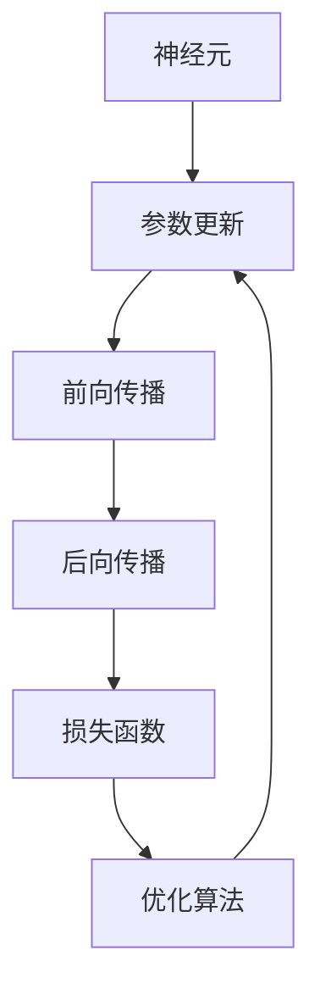

                 

## 1. 背景介绍

### 1.1 问题由来

近年来，神经网络（Neural Networks）在深度学习领域取得了突破性进展，广泛应用于计算机视觉、自然语言处理、语音识别、推荐系统等众多领域。神经网络以其强大的非线性建模能力和自适应学习能力，成为人工智能发展的重要引擎。然而，要深入理解神经网络的原理和工作机制，需要对其结构、算法及应用有一个全面的认识。

### 1.2 问题核心关键点

神经网络的结构和工作原理涉及多个关键点，包括但不限于以下几个方面：

1. **网络结构**：神经网络的层级结构、激活函数、损失函数等。
2. **学习算法**：反向传播算法、梯度下降优化算法等。
3. **前向传播与后向传播**：神经网络的信息流向、损失函数的计算。
4. **正则化技术**：L1正则、L2正则、Dropout等。
5. **模型优化**：权重初始化、学习率调节、模型裁剪等。

这些核心概念构成了神经网络的基本框架，使得模型能够高效地从数据中学习，并泛化到新的场景中。本文将深入探讨神经网络的结构和工作原理，帮助读者理解这一强大的工具。

### 1.3 问题研究意义

理解神经网络的结构和工作原理，对于开发高效、稳定的人工智能模型具有重要意义。这不仅能够提升模型的性能，还能帮助开发者更好地解决实际应用中的问题，如数据预处理、超参数调优、模型部署等。此外，深入研究神经网络的工作机制，也有助于推动人工智能技术的创新和应用。

## 2. 核心概念与联系

### 2.1 核心概念概述

要理解神经网络的工作原理，首先需要明确以下几个关键概念：

- **神经元（Neuron）**：神经网络的基本单位，通过激活函数处理输入并输出结果。
- **层（Layer）**：神经网络的多层结构，不同层的神经元之间通过权重连接。
- **前向传播（Forward Propagation）**：从输入到输出的信息流过程。
- **后向传播（Backward Propagation）**：通过反向传播算法计算梯度，更新模型参数。
- **损失函数（Loss Function）**：衡量模型预测与真实标签之间的差异。
- **优化算法（Optimization Algorithm）**：如梯度下降算法，用于调整模型参数以最小化损失函数。

### 2.2 核心概念联系的Mermaid流程图



这个流程图展示了神经网络的核心概念及其相互关系：神经元组成层，层通过前向传播生成输出，后向传播计算梯度并更新参数，损失函数指导优化算法的运行。

## 3. 核心算法原理 & 具体操作步骤

### 3.1 算法原理概述

神经网络的工作原理可以概括为以下三个步骤：前向传播、损失计算和反向传播。

1. **前向传播**：输入数据经过每一层神经元的处理，输出结果。
2. **损失计算**：将模型的预测输出与真实标签对比，计算损失函数。
3. **反向传播**：通过损失函数计算梯度，并使用优化算法更新模型参数。

这个过程不断迭代，直到损失函数最小化，模型达到收敛。

### 3.2 算法步骤详解

#### 3.2.1 前向传播

前向传播是神经网络处理输入数据的过程。具体步骤如下：

1. 将输入数据 $x$ 送入第一层神经元，计算该层的输出 $z_1$。
2. 将 $z_1$ 作为下一层的输入，依次计算每层的输出，直到最后一层，得到最终的输出 $y$。

公式表示为：
$$
z_l = w_lx_l + b_l \\
y = \sigma(z_n)
$$

其中，$w_l$ 为权重矩阵，$b_l$ 为偏置向量，$\sigma$ 为激活函数，$n$ 为神经网络最后一层。

#### 3.2.2 损失计算

损失函数用于衡量模型的预测结果与真实标签之间的差异。常见的损失函数包括均方误差（MSE）、交叉熵（Cross-Entropy）等。以交叉熵为例：

$$
L(y,\hat{y}) = -\frac{1}{m}\sum_{i=1}^m [y_i\log \hat{y}_i + (1-y_i)\log (1-\hat{y}_i)]
$$

其中，$m$ 为样本数量，$y_i$ 为真实标签，$\hat{y}_i$ 为模型预测结果。

#### 3.2.3 反向传播

反向传播算法用于计算损失函数对每个参数的梯度，并使用梯度下降等优化算法更新参数。具体步骤如下：

1. 从输出层开始，反向计算每层的梯度。
2. 根据梯度更新每一层的权重和偏置。

公式表示为：
$$
\frac{\partial L}{\partial w_l} = \frac{\partial L}{\partial z_l} \frac{\partial z_l}{\partial w_l} = \frac{\partial L}{\partial z_l} w_{l+1} \\
\frac{\partial L}{\partial b_l} = \frac{\partial L}{\partial z_l} \\
\frac{\partial L}{\partial w_{l+1}} = \frac{\partial L}{\partial z_{l+1}} w_l
$$

其中，$\frac{\partial L}{\partial z_l}$ 为损失函数对第 $l$ 层输出的梯度。

### 3.3 算法优缺点

神经网络作为一种强大的机器学习工具，具有以下优点：

1. **强大的非线性建模能力**：神经网络通过多层非线性变换，可以拟合任意复杂的函数关系。
2. **自适应学习能力**：神经网络可以自动学习数据中的模式和规律，适应不同的任务和数据分布。
3. **并行计算能力**：神经网络可以并行计算，提高训练和推理的效率。

然而，神经网络也存在一些缺点：

1. **过拟合问题**：神经网络容易过拟合，需要正则化等技术来缓解。
2. **高计算复杂度**：大规模神经网络需要大量的计算资源和存储空间。
3. **参数敏感性**：神经网络对初始参数和超参数的选择较为敏感。
4. **缺乏理论基础**：尽管神经网络在实践中表现优异，但其工作原理尚未完全理解。

### 3.4 算法应用领域

神经网络已经在计算机视觉、自然语言处理、语音识别、推荐系统等众多领域得到广泛应用。例如：

- **计算机视觉**：神经网络用于图像分类、目标检测、图像生成等任务。
- **自然语言处理**：神经网络用于文本分类、情感分析、机器翻译等任务。
- **语音识别**：神经网络用于语音识别、语音合成等任务。
- **推荐系统**：神经网络用于用户行为预测、物品推荐等任务。

## 4. 数学模型和公式 & 详细讲解 & 举例说明

### 4.1 数学模型构建

神经网络的数学模型可以表示为：

$$
y = f(x; \theta) = \sigma(W_n z_n + b_n)
$$

其中，$\theta = (W_n, b_n)$ 为模型参数，$z_n = W_n z_{n-1} + b_n$，$x$ 为输入，$y$ 为输出。

### 4.2 公式推导过程

以单层感知器为例，推导其前向传播和反向传播公式。

前向传播公式为：

$$
z = wx + b \\
y = \sigma(z)
$$

其中，$w$ 为权重矩阵，$x$ 为输入，$b$ 为偏置向量，$\sigma$ 为激活函数。

损失函数为均方误差损失：

$$
L(y,\hat{y}) = \frac{1}{m} \sum_{i=1}^m (y_i - \hat{y}_i)^2
$$

其中，$m$ 为样本数量，$y_i$ 为真实标签，$\hat{y}_i$ 为模型预测结果。

反向传播公式为：

$$
\frac{\partial L}{\partial w} = \frac{\partial L}{\partial z} \frac{\partial z}{\partial w} = \frac{\partial L}{\partial z} w \\
\frac{\partial L}{\partial b} = \frac{\partial L}{\partial z} \\
\frac{\partial L}{\partial w} = \frac{\partial L}{\partial z} w^T
$$

其中，$\frac{\partial L}{\partial z}$ 为损失函数对输出 $z$ 的梯度。

### 4.3 案例分析与讲解

以手写数字识别为例，分析神经网络的工作原理。

**数据准备**：准备MNIST数据集，包含60000张28x28像素的手写数字图片，分为训练集和测试集。

**模型构建**：使用单层感知器作为基础模型，包含输入层（784个神经元）、隐藏层（64个神经元）和输出层（10个神经元）。

**模型训练**：使用随机梯度下降（SGD）优化算法，设置学习率为0.1，训练5个epoch。

**模型评估**：在测试集上评估模型，计算准确率。

## 5. 项目实践：代码实例和详细解释说明

### 5.1 开发环境搭建

使用Python和TensorFlow搭建神经网络训练环境，步骤如下：

1. 安装TensorFlow：使用pip安装TensorFlow。
2. 准备数据集：将MNIST数据集下载并解压。
3. 构建模型：使用TensorFlow定义神经网络模型。
4. 训练模型：使用TensorFlow训练模型。

### 5.2 源代码详细实现

```python
import tensorflow as tf
from tensorflow.keras.datasets import mnist

# 加载MNIST数据集
(x_train, y_train), (x_test, y_test) = mnist.load_data()

# 数据预处理
x_train = x_train.reshape(60000, 784).astype('float32') / 255.0
x_test = x_test.reshape(10000, 784).astype('float32') / 255.0
y_train = tf.keras.utils.to_categorical(y_train, 10)
y_test = tf.keras.utils.to_categorical(y_test, 10)

# 构建模型
model = tf.keras.Sequential([
    tf.keras.layers.Dense(64, activation='relu', input_shape=(784,)),
    tf.keras.layers.Dense(10, activation='softmax')
])

# 定义损失函数和优化器
loss_fn = tf.keras.losses.CategoricalCrossentropy()
optimizer = tf.keras.optimizers.SGD(learning_rate=0.1)

# 定义评估指标
accuracy = tf.keras.metrics.CategoricalAccuracy()

# 训练模型
model.compile(optimizer=optimizer, loss=loss_fn, metrics=[accuracy])
model.fit(x_train, y_train, epochs=5, validation_data=(x_test, y_test))

# 评估模型
test_loss, test_accuracy = model.evaluate(x_test, y_test)
print('Test Accuracy:', test_accuracy)
```

### 5.3 代码解读与分析

代码中使用了TensorFlow的高级API，简化了模型构建和训练的过程。具体分析如下：

- 数据加载和预处理：使用MNIST数据集，并将其转换为模型所需的格式。
- 模型构建：使用`Sequential`模型定义神经网络，包含两个全连接层。
- 损失函数和优化器：使用交叉熵损失和随机梯度下降优化器。
- 评估指标：使用准确率作为评估指标。
- 模型训练：使用`compile`方法定义训练参数，并使用`fit`方法进行模型训练。
- 模型评估：使用`evaluate`方法评估模型性能。

## 6. 实际应用场景

### 6.1 计算机视觉

在计算机视觉领域，神经网络被广泛用于图像分类、目标检测、图像生成等任务。例如，使用卷积神经网络（CNN）对图像进行分类，可以大大提高分类的准确率。

### 6.2 自然语言处理

在自然语言处理领域，神经网络被广泛用于文本分类、情感分析、机器翻译等任务。例如，使用循环神经网络（RNN）对文本进行情感分析，可以更准确地识别文本的情感倾向。

### 6.3 语音识别

在语音识别领域，神经网络被广泛用于语音识别、语音合成等任务。例如，使用长短时记忆网络（LSTM）对语音进行识别，可以更准确地识别语音中的内容。

### 6.4 推荐系统

在推荐系统领域，神经网络被广泛用于用户行为预测、物品推荐等任务。例如，使用深度神经网络对用户行为进行预测，可以更准确地推荐用户可能感兴趣的商品。

## 7. 工具和资源推荐

### 7.1 学习资源推荐

为了帮助读者深入理解神经网络，推荐以下学习资源：

1. 《深度学习》（Ian Goodfellow等著）：介绍深度学习的理论基础和实践技巧。
2. 《神经网络与深度学习》（Michael Nielsen著）：介绍神经网络的基本概念和数学原理。
3. 《Python深度学习》（Francois Chollet著）：介绍使用Keras进行深度学习开发的技术。
4. 《TensorFlow官方文档》：TensorFlow的详细文档，包含丰富的示例代码和教程。
5. 《PyTorch官方文档》：PyTorch的详细文档，包含丰富的示例代码和教程。

### 7.2 开发工具推荐

为了帮助读者高效开发神经网络，推荐以下开发工具：

1. TensorFlow：开源深度学习框架，提供了丰富的API和工具。
2. Keras：高级神经网络API，易于使用且功能强大。
3. PyTorch：开源深度学习框架，具有动态计算图和灵活性。
4. Jupyter Notebook：交互式开发环境，支持Python代码的实时运行和调试。
5. Visual Studio Code：轻量级代码编辑器，支持各种开发语言和插件。

### 7.3 相关论文推荐

为了帮助读者了解神经网络的最新研究进展，推荐以下相关论文：

1. AlexNet：ImageNet大规模视觉识别挑战赛冠军算法，展示了卷积神经网络的强大性能。
2. ResNet：提出残差网络，解决了深度网络训练中的梯度消失问题。
3. Transformer：提出自注意力机制，使神经网络能够并行处理长序列数据。
4. BERT：提出预训练语言模型，显著提升了自然语言处理任务的性能。
5. GPT-3：提出大规模语言模型，展示了自然语言处理的最新进展。

## 8. 总结：未来发展趋势与挑战

### 8.1 总结

本文系统地介绍了神经网络的结构和工作原理，并提供了实际应用的案例和代码实例。神经网络作为一种强大的机器学习工具，其强大的非线性建模能力和自适应学习能力使其广泛应用于计算机视觉、自然语言处理、语音识别、推荐系统等众多领域。未来，随着深度学习技术的进一步发展，神经网络将面临更多的挑战和机遇。

### 8.2 未来发展趋势

1. **大规模模型**：神经网络模型规模将继续扩大，使用更多的参数和更大的数据集进行训练，以提高模型的准确性和泛化能力。
2. **自适应学习**：神经网络将更加注重自适应学习，通过迁移学习和连续学习等技术，使得模型能够更好地适应不同的数据分布和任务。
3. **联邦学习**：神经网络将更加注重联邦学习，通过分布式训练和数据共享，提高模型的效率和安全性。
4. **自动化调参**：神经网络将更加注重自动化调参，通过自动化超参数调优和模型剪枝等技术，提高模型的效率和可解释性。
5. **多模态融合**：神经网络将更加注重多模态融合，通过融合视觉、语音、文本等多模态数据，提高模型的感知能力和泛化能力。

### 8.3 面临的挑战

尽管神经网络在许多领域取得了显著进展，但也面临着诸多挑战：

1. **计算资源限制**：大规模神经网络需要大量的计算资源和存储空间，计算效率和资源利用率仍需提升。
2. **数据稀缺**：许多领域的数据稀缺，难以通过大规模数据训练出高质量的神经网络模型。
3. **过拟合问题**：神经网络容易过拟合，需要正则化等技术来缓解。
4. **可解释性**：神经网络模型往往是"黑盒"，缺乏可解释性，难以理解其内部工作机制和决策逻辑。
5. **伦理和安全**：神经网络模型可能存在偏见和歧视，需要引入伦理和安全机制来保护用户隐私和数据安全。

### 8.4 研究展望

未来，神经网络的研究方向将更加注重以下几个方面：

1. **模型压缩**：通过模型压缩技术，如剪枝、量化等，提高模型的效率和资源利用率。
2. **自动化调参**：通过自动化超参数调优技术，提高模型的性能和可解释性。
3. **多模态融合**：通过多模态融合技术，提高模型的感知能力和泛化能力。
4. **联邦学习**：通过联邦学习技术，提高模型的效率和安全性。
5. **自适应学习**：通过自适应学习技术，提高模型的泛化能力和适应能力。

## 9. 附录：常见问题与解答

**Q1: 神经网络容易出现过拟合问题，如何缓解？**

A: 缓解过拟合的方法包括：
1. 数据增强：通过旋转、缩放、裁剪等方式，生成更多的训练数据。
2. 正则化：使用L1正则、L2正则、Dropout等技术，减少模型的复杂度。
3. 早停法：在验证集上监控模型的性能，当性能不再提升时，停止训练。
4. 模型裁剪：通过剪枝等技术，减少模型的参数数量。

**Q2: 神经网络模型为什么需要大量的计算资源？**

A: 神经网络模型通常包含大量的参数，每个参数需要进行梯度计算和更新。此外，神经网络模型的前向传播和反向传播计算也非常复杂，需要大量的计算资源和存储空间。

**Q3: 神经网络模型的训练速度慢，有什么优化方法？**

A: 神经网络模型的训练速度可以通过以下方法进行优化：
1. 数据增强：通过数据增强技术，生成更多的训练数据，提高模型的泛化能力。
2. 正则化：使用L1正则、L2正则、Dropout等技术，减少模型的复杂度。
3. 模型裁剪：通过剪枝等技术，减少模型的参数数量。
4. 混合精度训练：使用混合精度技术，提高计算效率。
5. 分布式训练：使用分布式训练技术，加速模型的训练过程。

**Q4: 神经网络模型的可解释性不足，如何解决？**

A: 神经网络模型的可解释性可以通过以下方法进行提升：
1. 可视化技术：使用可视化工具，如TensorBoard，观察模型的训练过程和输出结果。
2. 解释性模型：使用解释性模型，如线性模型，来解释神经网络模型的输出结果。
3. 特征重要性：通过计算特征的重要性，帮助理解模型的决策过程。

**Q5: 神经网络模型的鲁棒性不足，如何解决？**

A: 神经网络模型的鲁棒性可以通过以下方法进行提升：
1. 数据增强：通过数据增强技术，生成更多的训练数据。
2. 正则化：使用L1正则、L2正则、Dropout等技术，减少模型的复杂度。
3. 对抗训练：使用对抗训练技术，提高模型的鲁棒性。
4. 模型裁剪：通过剪枝等技术，减少模型的参数数量。

---

作者：禅与计算机程序设计艺术 / Zen and the Art of Computer Programming

