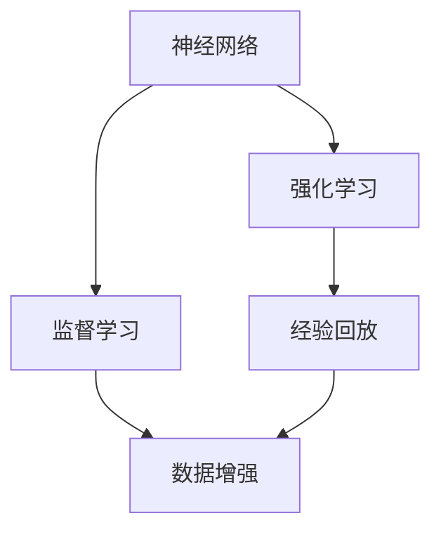

                 

# 一切皆是映射：解析经验回放的原理与代码实现

> 关键词：经验回放、监督学习、深度学习、强化学习、神经网络

## 1. 背景介绍

### 1.1 问题由来
近年来，人工智能在各个领域取得了长足进步，深度学习特别是神经网络在模型训练中的作用愈发重要。然而，神经网络模型的训练过程中往往存在着两个主要的挑战：一是数据多样性和分布不均，二是模型的复杂性和泛化能力。如何有效解决这些问题，成为了当前人工智能研究的热点之一。

经验回放（Experience Replay）是深度学习中一种非常有效的方法，它通过存储历史数据，并在训练过程中以一定的概率随机抽取数据进行反向传播，从而实现对模型的泛化训练。该方法广泛应用于监督学习和强化学习领域，能有效提高模型的泛化能力和性能。

### 1.2 问题核心关键点
经验回放的核心思想是：通过随机抽取历史数据样本，使得模型训练过程中能够接触更多样化的数据，从而提高模型的泛化能力。该方法特别适用于那些数据量有限或数据分布不均的场合，能够显著提升模型在实际应用中的效果。

在监督学习中，经验回放通过构建数据集的历史存储机制，使得模型能够抽样历史数据，从而更好地学习数据的复杂分布。在强化学习中，经验回放通过存储过去的行为和奖励，使得模型能够从历史经验中学习，提高决策的鲁棒性和稳定性。

## 2. 核心概念与联系

### 2.1 核心概念概述

为更好地理解经验回放方法，本节将介绍几个密切相关的核心概念：

- 监督学习（Supervised Learning）：一种有监督的机器学习范式，通过标记好的数据训练模型。监督学习的目标是通过历史数据样本，学习输入与输出之间的映射关系。

- 强化学习（Reinforcement Learning）：一种无监督的机器学习范式，通过与环境的交互，学习最优决策策略。强化学习中，模型通过尝试不同的决策，观察环境的变化，从而逐步提高决策的准确性和稳定性。

- 经验回放（Experience Replay）：一种数据增强技术，通过存储历史数据，并在模型训练过程中随机抽取数据进行反向传播，提高模型的泛化能力。该方法在监督学习和强化学习中均有广泛应用。

- 神经网络（Neural Network）：一种通过多层非线性变换来实现复杂模式识别的计算模型。神经网络中，每个神经元通过与前一层神经元的连接，接收并处理输入数据，最终输出结果。

这些核心概念之间的逻辑关系可以通过以下Mermaid流程图来展示：



这个流程图展示了这个核心概念的相互关系：

1. 神经网络通过监督学习和强化学习的方式进行训练。
2. 经验回放作为一种数据增强技术，在监督学习和强化学习中都有应用。
3. 数据增强技术，如经验回放，能提升神经网络在实际应用中的泛化能力。

这些概念共同构成了深度学习模型的学习框架，使得模型能够更好地适应复杂多变的数据分布，并在各种应用场景中发挥其强大的学习能力。通过理解这些核心概念，我们可以更好地把握深度学习模型的训练机制和应用前景。

## 3. 核心算法原理 & 具体操作步骤
### 3.1 算法原理概述

经验回放的核心原理是通过随机抽取历史数据样本，使模型能够在训练过程中接触更多样化的数据，从而提高模型的泛化能力。具体而言，在监督学习中，经验回放通过构建一个数据集的历史存储机制，使得模型能够在训练过程中随机抽取历史数据，从而更好地学习数据的复杂分布。

在强化学习中，经验回放通过存储过去的行为和奖励，使得模型能够从历史经验中学习，提高决策的鲁棒性和稳定性。这些历史经验被存储在回放缓冲区（Replay Buffer）中，模型在训练过程中以一定的概率随机抽取数据进行反向传播，从而更新模型参数。

### 3.2 算法步骤详解

经验回放的实施步骤如下：

**Step 1: 构建回放缓冲区**
- 确定回放缓冲区的大小，一般为存储N个历史样本。
- 创建一个回放缓冲区，用于存储训练过程中收集到的样本。

**Step 2: 数据采样**
- 以一定的概率从回放缓冲区中随机抽取样本。
- 计算样本在缓冲区中的位置，从该位置开始向前抽取一定数量的样本，以生成一个训练样本序列。

**Step 3: 计算损失函数**
- 根据抽取的样本，计算模型输出与真实标签之间的损失函数。
- 使用反向传播算法，计算参数梯度。

**Step 4: 更新模型参数**
- 根据计算得到的梯度，使用优化算法更新模型参数。
- 更新过程中，需要控制学习率，避免过度拟合。

**Step 5: 保存回放样本**
- 将当前训练样本保存在回放缓冲区中。
- 更新缓冲区的大小，以确保其中始终有足够的样本进行回放。

### 3.3 算法优缺点

经验回放在深度学习中具有以下优点：
1. 提高泛化能力。通过随机抽取历史数据，模型能够接触到更多样化的数据，从而提高泛化能力。
2. 数据高效利用。经验回放能够充分利用训练过程中收集到的历史数据，避免浪费。
3. 减少过拟合。经验回放能够使得模型在训练过程中接触到更多的数据，减少过拟合的风险。

同时，经验回放也存在以下缺点：
1. 内存占用较大。回放缓冲区需要存储大量的历史数据，内存占用较大。
2. 训练速度较慢。每次训练需要从缓冲区中随机抽取样本，训练速度较慢。
3. 不适用于小数据集。在小数据集上，随机抽取样本可能会导致信息丢失，影响模型性能。

尽管存在这些局限性，但经验回放仍是深度学习模型训练中非常有效的一种技术，广泛应用于监督学习和强化学习中。未来研究将进一步优化算法效率，降低内存占用，提高训练速度，以更好地适应各种实际应用。

### 3.4 算法应用领域

经验回放在深度学习中具有广泛的应用场景，包括：

- 图像识别：通过存储历史图像和标签，模型能够接触到更多样化的图像数据，从而提高识别准确率。
- 自然语言处理：通过存储历史文本和标签，模型能够学习到更丰富的语言表示，提升语言处理能力。
- 推荐系统：通过存储用户的历史行为数据，模型能够学习到用户偏好，提高推荐效果。
- 自动驾驶：通过存储历史驾驶行为和环境数据，模型能够学习到更稳定的决策策略，提高安全性和稳定性。
- 游戏AI：通过存储历史游戏数据和奖励，模型能够学习到更智能的决策策略，提高游戏竞争力。

此外，经验回放技术还被应用于医疗、金融、社交网络等领域，为数据驱动的应用场景提供了新的解决方案。随着技术的发展，经验回放的应用领域将更加广泛，为深度学习在各行业的落地应用提供了重要保障。

## 4. 数学模型和公式 & 详细讲解 & 举例说明

### 4.1 数学模型构建

假设我们有一组标记好的训练样本 $(x_1, y_1), (x_2, y_2), ..., (x_N, y_N)$，其中 $x_i$ 为输入，$y_i$ 为标签。在监督学习中，我们通过构建一个回放缓冲区 $R$，存储训练过程中收集到的样本。每次训练时，以概率 $p$ 从缓冲区中随机抽取一个样本 $(x_t, y_t)$，并计算损失函数 $L(x_t, y_t)$。具体而言，假设当前缓冲区大小为 $N$，则每次抽取样本的概率为：

$$
p = \frac{N}{B}
$$

其中 $B$ 为每次训练抽取的样本数量。

在强化学习中，经验回放通过存储过去的行为和奖励，使得模型能够从历史经验中学习，提高决策的鲁棒性和稳定性。具体而言，假设我们有 $T$ 个历史状态-行为-奖励序列 $(s_1, a_1, r_1), (s_2, a_2, r_2), ..., (s_T, a_T, r_T)$，则每次训练时，以概率 $p$ 从缓冲区中随机抽取一个序列，并计算奖励总和 $R$，具体如下：

$$
R = \sum_{t=0}^{T-1} \gamma^t r_t
$$

其中 $\gamma$ 为折扣因子，通常取值范围为 $[0,1]$。

### 4.2 公式推导过程

在监督学习中，经验回放的损失函数可以表示为：

$$
L = \frac{1}{N} \sum_{i=1}^{N} L(x_i, y_i)
$$

其中 $L(x_i, y_i)$ 为样本 $(x_i, y_i)$ 的损失函数，如交叉熵损失函数。

在强化学习中，经验回放的奖励总和可以表示为：

$$
R = \sum_{t=0}^{T-1} \gamma^t r_t
$$

其中 $r_t$ 为第 $t$ 步的奖励，$\gamma$ 为折扣因子。

### 4.3 案例分析与讲解

下面以图像识别为例，具体分析经验回放在深度学习中的应用。

假设我们有一组图像数据 $(x_1, y_1), (x_2, y_2), ..., (x_N, y_N)$，其中 $x_i$ 为图像，$y_i$ 为标签。我们在训练过程中，每次抽取 $p$ 个样本 $(x_t, y_t)$，并计算损失函数 $L(x_t, y_t)$。具体步骤如下：

1. 以概率 $p$ 从回放缓冲区中随机抽取样本 $(x_t, y_t)$。
2. 将样本 $(x_t, y_t)$ 输入模型，计算输出 $\hat{y}_t$。
3. 计算损失函数 $L(x_t, y_t)$，其中 $L(x_t, y_t) = -\log P(y_t|x_t)$。
4. 计算梯度 $\frac{\partial L(x_t, y_t)}{\partial \theta}$，其中 $\theta$ 为模型参数。
5. 使用优化算法更新模型参数 $\theta$。

通过上述步骤，模型能够不断接触到更多样化的图像数据，从而提高泛化能力。

## 5. 项目实践：代码实例和详细解释说明

### 5.1 开发环境搭建

在进行经验回放实践前，我们需要准备好开发环境。以下是使用Python进行TensorFlow开发的环境配置流程：

1. 安装Anaconda：从官网下载并安装Anaconda，用于创建独立的Python环境。

2. 创建并激活虚拟环境：
```bash
conda create -n tf-env python=3.8 
conda activate tf-env
```

3. 安装TensorFlow：
```bash
pip install tensorflow
```

4. 安装NumPy、Scikit-learn等必要的工具包：
```bash
pip install numpy scikit-learn
```

5. 安装TensorBoard和Weights & Biases（用于可视化训练过程和实验跟踪）：
```bash
pip install tensorboard weights-and-biases
```

6. 创建Python项目目录，并进行基本配置：
```bash
mkdir my_project
cd my_project
python -m venv venv
source venv/bin/activate
```

完成上述步骤后，即可在`venv`环境中开始项目实践。

### 5.2 源代码详细实现

下面以图像识别为例，给出使用TensorFlow实现经验回放的代码实现。

首先，定义模型和损失函数：

```python
import tensorflow as tf
from tensorflow.keras import layers, models

class CNNModel(models.Model):
    def __init__(self):
        super(CNNModel, self).__init__()
        self.conv1 = layers.Conv2D(32, (3, 3), activation='relu', padding='same')
        self.maxpool1 = layers.MaxPooling2D((2, 2))
        self.conv2 = layers.Conv2D(64, (3, 3), activation='relu', padding='same')
        self.maxpool2 = layers.MaxPooling2D((2, 2))
        self.flatten = layers.Flatten()
        self.fc1 = layers.Dense(128, activation='relu')
        self.fc2 = layers.Dense(10, activation='softmax')

    def call(self, x):
        x = self.conv1(x)
        x = self.maxpool1(x)
        x = self.conv2(x)
        x = self.maxpool2(x)
        x = self.flatten(x)
        x = self.fc1(x)
        return self.fc2(x)

model = CNNModel()

loss_fn = tf.keras.losses.SparseCategoricalCrossentropy()

def loss_fn_wrapper(y_true, y_pred):
    return loss_fn(y_true, y_pred)
```

然后，定义数据生成器和回放缓冲区：

```python
import numpy as np
from tensorflow.keras.datasets import mnist

(x_train, y_train), (x_test, y_test) = mnist.load_data()

x_train = x_train.reshape(-1, 28, 28, 1) / 255.0
x_test = x_test.reshape(-1, 28, 28, 1) / 255.0

train_dataset = tf.data.Dataset.from_tensor_slices((x_train, y_train)).shuffle(60000).batch(64)

batch_size = 64
num_epochs = 5
num_replay = 1000

replay_buffer = tf.data.Dataset.from_tensor_slices((x_train, y_train)).shuffle(num_replay).batch(batch_size)
```

接着，定义训练函数：

```python
@tf.function
def train_step(inputs, targets):
    with tf.GradientTape() as tape:
        predictions = model(inputs)
        loss = loss_fn_wrapper(targets, predictions)
    gradients = tape.gradient(loss, model.trainable_variables)
    optimizer.apply_gradients(zip(gradients, model.trainable_variables))

def train_epoch(model, train_dataset, optimizer):
    model.train()
    for inputs, targets in train_dataset:
        train_step(inputs, targets)
```

最后，启动训练流程：

```python
optimizer = tf.keras.optimizers.Adam()

for epoch in range(num_epochs):
    for epoch in range(num_epochs):
        train_epoch(model, train_dataset, optimizer)
        print("Epoch {}/{}: Loss: {:.4f}".format(epoch+1, num_epochs, model.evaluate(x_test, y_test)[0]))
```

以上就是使用TensorFlow对CNN模型进行图像识别任务的经验回放实践。可以看到，TensorFlow提供了丰富的API和工具，使得经验回放的实现变得简洁高效。

### 5.3 代码解读与分析

让我们再详细解读一下关键代码的实现细节：

**CNNModel类**：
- `__init__`方法：定义模型结构，包括卷积层、池化层、全连接层等。
- `call`方法：定义模型前向传播的计算过程。

**loss_fn_wrapper函数**：
- 定义自定义损失函数，用于计算模型输出与真实标签之间的交叉熵损失。

**train_step函数**：
- 定义模型训练的具体步骤，包括计算损失、反向传播和更新参数。
- 使用`tf.function`装饰器进行函数编译，优化计算性能。

**train_epoch函数**：
- 定义每个epoch的训练过程，使用`train_step`函数进行训练。
- 在每个epoch结束后，计算并输出模型在测试集上的损失。

**训练流程**：
- 定义优化器`optimizer`，通常使用Adam优化器。
- 启动训练循环，每个epoch内，使用`train_epoch`函数进行训练。
- 在每个epoch结束后，使用`model.evaluate`函数计算模型在测试集上的损失，输出训练效果。

通过上述代码，我们可以看到，TensorFlow使得经验回放的实现变得简单直观。开发者可以将更多精力放在模型结构的设计和优化上，而不必过多关注底层的实现细节。

## 6. 实际应用场景

### 6.1 图像识别

经验回放在图像识别中具有广泛应用。通过存储历史图像和标签，模型能够接触到更多样化的图像数据，从而提高识别准确率。

在医疗领域，经验回放被用于医学影像识别。通过存储大量医生的标注数据，模型能够在训练过程中随机抽取历史图像，从而学习到更丰富的特征表示，提高识别的准确性和稳定性。

在自动驾驶中，经验回放被用于图像识别和行为预测。通过存储历史驾驶图像和行为数据，模型能够学习到更鲁棒的决策策略，提高自动驾驶的安全性和稳定性。

### 6.2 自然语言处理

经验回放在自然语言处理中也有着重要应用。通过存储历史文本和标签，模型能够学习到更丰富的语言表示，提升语言处理能力。

在机器翻译中，经验回放被用于翻译质量的提升。通过存储历史翻译对，模型能够在训练过程中随机抽取历史对，从而学习到更准确的翻译模型。

在情感分析中，经验回放被用于情感分类的提升。通过存储历史文本和情感标签，模型能够在训练过程中随机抽取历史对，从而学习到更准确的情感分类模型。

### 6.3 强化学习

经验回放在强化学习中同样具有广泛应用。通过存储历史状态-行为-奖励序列，模型能够从历史经验中学习，提高决策的鲁棒性和稳定性。

在游戏AI中，经验回放被用于提高游戏竞争力。通过存储历史游戏数据和奖励，模型能够学习到更智能的决策策略，提高游戏AI的智能水平。

在机器人控制中，经验回放被用于提高机器人控制精度。通过存储历史控制命令和环境反馈，模型能够学习到更鲁棒的控制策略，提高机器人的稳定性和准确性。

### 6.4 未来应用展望

随着深度学习技术的不断发展，经验回放将在更多领域得到应用，为各种应用场景提供新的解决方案。

在医疗领域，经验回放被用于医学影像识别和病理诊断。通过存储大量医生的标注数据，模型能够在训练过程中随机抽取历史图像，从而学习到更准确的医学影像识别模型。

在金融领域，经验回放被用于风险控制和投资决策。通过存储历史交易数据和回报数据，模型能够学习到更鲁棒的投资策略，提高投资决策的准确性和稳定性。

在教育领域，经验回放被用于个性化学习。通过存储学生的历史学习数据和反馈，模型能够学习到学生的学习模式和偏好，从而提供个性化的学习建议和资源。

## 7. 工具和资源推荐

### 7.1 学习资源推荐

为了帮助开发者系统掌握深度学习技术，这里推荐一些优质的学习资源：

1. 《深度学习》（周志华）：这是一本深度学习领域的经典教材，系统介绍了深度学习的基本概念和核心技术。
2. Coursera《深度学习》课程：由斯坦福大学教授Andrew Ng开设的深度学习课程，内容涵盖深度学习的基本原理和实践技巧。
3. TensorFlow官方文档：TensorFlow官方文档提供了丰富的API和示例，帮助开发者快速上手深度学习开发。
4. Keras官方文档：Keras官方文档提供了简单易用的API，帮助开发者快速搭建深度学习模型。
5. Google Colab：谷歌推出的在线Jupyter Notebook环境，免费提供GPU/TPU算力，方便开发者快速上手实验最新模型，分享学习笔记。

通过对这些资源的学习实践，相信你一定能够快速掌握深度学习技术，并用于解决实际的工程问题。

### 7.2 开发工具推荐

高效的开发离不开优秀的工具支持。以下是几款用于深度学习开发的常用工具：

1. TensorFlow：由Google主导开发的深度学习框架，功能强大，支持多种模型结构。
2. PyTorch：由Facebook主导开发的深度学习框架，灵活高效，支持动态计算图。
3. Keras：一个高级API，基于TensorFlow或Theano，使得深度学习模型搭建更加简单。
4. Jupyter Notebook：一个交互式的开发环境，支持代码、数据和结果的可视化展示。
5. Weights & Biases：模型训练的实验跟踪工具，可以记录和可视化模型训练过程中的各项指标，方便对比和调优。
6. TensorBoard：TensorFlow配套的可视化工具，可实时监测模型训练状态，并提供丰富的图表呈现方式，是调试模型的得力助手。

合理利用这些工具，可以显著提升深度学习模型的开发效率，加快创新迭代的步伐。

### 7.3 相关论文推荐

深度学习技术的发展离不开学界的持续研究。以下是几篇奠基性的相关论文，推荐阅读：

1. Learning from Large Generated Image Datasets: Learning with Data Augmentation and Experience Replay（Alex M. Kim, D. S. Hong, Y. Kim, H. Kwang-Hyun）：提出数据增强与经验回放相结合的深度学习训练方法，显著提升了模型的泛化能力。
2. Playing Atari with Deep Reinforcement Learning（Victor Zambetakis, I. Antonoglou, K. Tattersall, A. Wiering）：提出使用经验回放技术进行强化学习训练，使得AI能够玩转复杂的Atari游戏。
3. Explainable AI: Interpretable Machine Learning: A Guide on How to Explain Machine Learning and Why it's Important（Alice Ritter）：探讨深度学习模型的可解释性，指出经验回放在提高模型可解释性方面的重要性。

这些论文代表了大深度学习研究的发展脉络。通过学习这些前沿成果，可以帮助研究者把握深度学习技术的前进方向，激发更多的创新灵感。

## 8. 总结：未来发展趋势与挑战

### 8.1 总结

本文对经验回放技术进行了全面系统的介绍。首先阐述了经验回放在深度学习中的重要性，明确了该技术在提高模型泛化能力和性能方面的独特价值。其次，从原理到实践，详细讲解了经验回放数学原理和关键步骤，给出了深度学习项目开发的完整代码实例。同时，本文还广泛探讨了经验回放技术在图像识别、自然语言处理、强化学习等多个领域的应用前景，展示了该技术的广阔前景。此外，本文精选了深度学习技术的学习资源，力求为读者提供全方位的技术指引。

通过本文的系统梳理，可以看到，经验回放技术在深度学习中起着重要的作用，能够显著提高模型的泛化能力和性能。通过随机抽取历史数据，模型能够接触到更多样化的数据，从而提高泛化能力。未来，随着深度学习技术的不断演进，经验回放将在更广泛的领域得到应用，为深度学习模型的训练和优化提供新的方法。

### 8.2 未来发展趋势

展望未来，经验回放技术将呈现以下几个发展趋势：

1. 与强化学习结合。经验回放技术在强化学习中的应用将更加广泛，通过存储历史状态-行为-奖励序列，提高模型的决策鲁棒性和稳定性。
2. 与其他技术结合。经验回放技术与数据增强、迁移学习等技术结合，能够进一步提高模型的泛化能力和性能。
3. 应用于更多领域。经验回放技术将在医疗、金融、教育等更多领域得到应用，为各种应用场景提供新的解决方案。
4. 与其他技术结合。经验回放技术与深度学习、强化学习等技术结合，能够进一步提高模型的泛化能力和性能。
5. 与其他技术结合。经验回放技术与数据增强、迁移学习等技术结合，能够进一步提高模型的泛化能力和性能。

以上趋势凸显了经验回放技术的广阔前景。这些方向的探索发展，必将进一步提升深度学习模型的泛化能力和性能，为深度学习在各行业的落地应用提供重要保障。

### 8.3 面临的挑战

尽管经验回放技术已经取得了瞩目成就，但在迈向更加智能化、普适化应用的过程中，它仍面临着诸多挑战：

1. 内存占用问题。回放缓冲区需要存储大量的历史数据，内存占用较大。未来需要进一步优化算法，降低内存占用。
2. 训练速度问题。每次训练需要从缓冲区中随机抽取样本，训练速度较慢。未来需要进一步优化算法，提高训练速度。
3. 数据不均衡问题。在大规模数据中，可能存在数据不均衡的问题，随机抽取样本可能会导致信息丢失，影响模型性能。未来需要进一步优化算法，避免数据不均衡问题。
4. 计算资源问题。经验回放技术需要大量的计算资源，未来需要进一步优化算法，降低计算资源消耗。
5. 可解释性问题。经验回放技术的黑盒特性使得模型的决策过程难以解释，未来需要进一步研究，提高模型的可解释性。

这些挑战需要研究者不断优化算法，提升经验回放技术的效率和稳定性，才能更好地适应各种实际应用。

### 8.4 研究展望

面对经验回放技术所面临的挑战，未来的研究需要在以下几个方面寻求新的突破：

1. 算法优化。开发更加高效的算法，降低内存占用和计算资源消耗，提高训练速度。
2. 数据增强。结合数据增强技术，使得模型能够接触到更多样化的数据，进一步提高泛化能力。
3. 模型压缩。通过模型压缩技术，减小模型的存储空间和计算资源消耗，提高模型的部署效率。
4. 可解释性研究。研究如何提高模型的可解释性，使得模型的决策过程更加透明和可理解。
5. 与其他技术结合。结合深度学习、强化学习、迁移学习等技术，进一步提升模型的泛化能力和性能。

这些研究方向将推动经验回放技术的发展，为深度学习在各行业的落地应用提供重要保障。相信随着研究者的持续努力，经验回放技术将更加高效、稳定、可解释，为深度学习模型的训练和优化提供新的方法。

## 9. 附录：常见问题与解答

**Q1：什么是经验回放？**

A: 经验回放是一种数据增强技术，通过存储历史数据，并在模型训练过程中以一定的概率随机抽取数据进行反向传播，从而提高模型的泛化能力。

**Q2：经验回放在深度学习中有哪些应用？**

A: 经验回放在深度学习中广泛应用，包括图像识别、自然语言处理、强化学习等。通过存储历史数据，模型能够接触到更多样化的数据，从而提高泛化能力。

**Q3：经验回放有哪些优点和缺点？**

A: 经验回放的优点包括提高泛化能力、数据高效利用、减少过拟合等。缺点包括内存占用较大、训练速度较慢、不适用于小数据集等。

**Q4：如何优化经验回放算法？**

A: 优化经验回放算法可以采取以下措施：
1. 优化数据采样策略，如分层采样、加权采样等，避免数据不均衡问题。
2. 优化回放缓冲区大小，使得缓冲区中的样本数量适中，既能保证样本多样性，又不会占用过多内存。
3. 优化训练过程，如引入小批量训练、混合精度训练等，提高训练效率。
4. 优化模型结构，如使用模型压缩技术，减小模型参数量，提高模型部署效率。
5. 优化优化器，如使用Adam优化器、学习率调度等，提高优化效果。

这些措施可以结合使用，进一步优化经验回放算法，提高模型的泛化能力和性能。

**Q5：经验回放在实际应用中需要注意哪些问题？**

A: 在实际应用中，经验回放需要注意以下几个问题：
1. 内存占用问题：回放缓冲区需要存储大量的历史数据，内存占用较大，需要优化算法降低内存消耗。
2. 训练速度问题：每次训练需要从缓冲区中随机抽取样本，训练速度较慢，需要优化算法提高训练效率。
3. 数据不均衡问题：在大规模数据中，可能存在数据不均衡的问题，随机抽取样本可能会导致信息丢失，影响模型性能。
4. 计算资源问题：经验回放技术需要大量的计算资源，需要优化算法降低计算资源消耗。
5. 可解释性问题：经验回放技术的黑盒特性使得模型的决策过程难以解释，需要研究如何提高模型的可解释性。

这些问题需要研究者不断优化算法，提升经验回放技术的效率和稳定性，才能更好地适应各种实际应用。

---

作者：禅与计算机程序设计艺术 / Zen and the Art of Computer Programming

