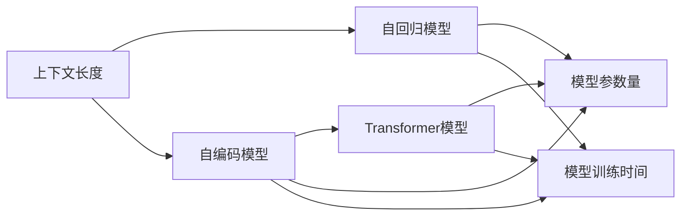

                 

# 上下文长度:语言理解能力的重要体现

## 1. 背景介绍

在自然语言处理(Natural Language Processing, NLP)领域，上下文长度(Context Length)是衡量模型语言理解能力的重要指标。随着预训练语言模型（Pre-trained Language Models, PLMs）的兴起，上下文长度在模型设计和评估中变得尤为重要。本文将详细探讨上下文长度对语言理解的影响，并讨论如何通过合理控制上下文长度，提升NLP模型的性能。

## 2. 核心概念与联系

### 2.1 核心概念概述

在进行深入讨论之前，需要明确几个核心概念：

- **上下文长度(Context Length)**：指在生成或推理过程中，模型需要考虑的文本片段长度。如Transformer模型中的self-attention机制，每个token的上下文长度决定了该token与其他token交互的维度。

- **自回归模型(Autoregressive Model)**：指模型在生成下一个token时，依赖前面生成的token。代表模型包括GPT-2、GPT-3等。

- **自编码模型(Autocoder Model)**：指模型在生成下一个token时，依赖所有前面和后面的token。代表模型包括BERT、XLNet等。

- **Transformer模型(Transformer Model)**：基于自注意力机制的自编码模型，广泛应用于大规模预训练语言模型中。

- **模型参数量(Parameter Size)**：指模型可训练的参数总和，是衡量模型复杂度的重要指标。

- **模型训练时间(Training Time)**：指训练模型所需的时间，是评估模型训练效率的关键指标。

### 2.2 核心概念原理和架构的 Mermaid 流程图



这个流程图展示了上下文长度与其他核心概念之间的联系：

1. 上下文长度决定了模型需要考虑的token范围，从而影响模型的参数量和训练时间。
2. 自回归模型和自编码模型的上下文长度不同，因此设计方式和参数量也不同。
3. Transformer模型在上下文长度控制方面表现灵活，可以通过调整不同层的注意力权重进行优化。

## 3. 核心算法原理 & 具体操作步骤

### 3.1 算法原理概述

上下文长度对语言理解的影响主要体现在以下几个方面：

- **模型复杂度**：上下文长度越长，模型需要处理的token数越多，参数量和训练时间也相应增加。这可能导致模型难以优化，降低性能。
- **模型泛化能力**：过长的上下文可能导致模型在测试集上泛化效果变差，即模型对新数据的适应能力下降。
- **模型推理速度**：上下文长度影响模型的推理速度，过长上下文可能导致推理速度减慢，降低实际应用中的用户体验。

因此，合理控制上下文长度是提升NLP模型性能的关键。

### 3.2 算法步骤详解

控制上下文长度一般涉及以下几个步骤：

**Step 1: 确定上下文长度**  
根据具体任务需求，选择合适的上下文长度。对于较长的文本，可以采用滑动窗口的方式，分别考虑不同的子句或段落，避免单次上下文过长。

**Step 2: 设置模型结构**  
调整模型结构，使其能够有效处理不同长度的上下文。如在大规模预训练模型中，可以通过调整各层的注意力权重，减小某些层的上下文长度，增加其他层的上下文长度。

**Step 3: 设计损失函数**  
根据任务类型，设计适合的损失函数。如分类任务，可以使用交叉熵损失；对于序列生成任务，可以使用负对数似然损失。

**Step 4: 训练与优化**  
在训练过程中，使用合适的优化器（如Adam、SGD等），并设置合适的学习率和正则化参数，以避免过拟合。同时，根据模型性能，调整上下文长度，优化模型。

**Step 5: 测试与评估**  
在测试集上评估模型性能，使用BLEU、ROUGE等指标衡量模型生成的文本与真实文本的匹配度。根据评估结果，进一步调整上下文长度。

### 3.3 算法优缺点

**优点**：  
1. **灵活性**：上下文长度灵活可调，可以根据具体任务需求进行调整。
2. **泛化能力强**：合理控制上下文长度，可以提升模型对新数据的泛化能力。
3. **推理速度快**：控制上下文长度，可以加速模型推理过程，提升用户体验。

**缺点**：  
1. **模型复杂度高**：上下文长度变化可能导致模型结构复杂度增加，训练难度增大。
2. **参数量庞大**：大规模预训练模型的上下文长度控制，需要调整大量参数，优化复杂。
3. **性能提升有限**：过长的上下文长度可能导致模型性能提升有限，甚至降低。

### 3.4 算法应用领域

上下文长度控制在多个NLP任务中都有应用，例如：

- **文本分类**：如情感分析、主题分类、意图识别等。
- **命名实体识别**：识别文本中的人名、地名、机构名等特定实体。
- **关系抽取**：从文本中抽取实体之间的语义关系。
- **问答系统**：对自然语言问题给出答案。
- **机器翻译**：将源语言文本翻译成目标语言。
- **文本摘要**：将长文本压缩成简短摘要。
- **对话系统**：使机器能够与人自然对话。

## 4. 数学模型和公式 & 详细讲解 & 举例说明

### 4.1 数学模型构建

我们以Transformer模型为例，介绍上下文长度对模型性能的影响。

Transformer模型通常采用多头自注意力机制，将文本分成多个小片段（如16个token为一组），然后通过多头自注意力计算得到每个token的表示。假设输入文本长度为$L$，上下文长度为$K$，模型中多头注意力机制的权重矩阵为$W$。

### 4.2 公式推导过程

Transformer模型中，每个token的表示计算公式为：

$$
\mathbf{Z}_i = \text{softmax}(\mathbf{Q}_i\mathbf{K}^T) \mathbf{V}
$$

其中$\mathbf{Q}_i, \mathbf{K}, \mathbf{V}$为查询、键和值矩阵，$\text{softmax}$为归一化函数。假设模型参数总数量为$P$，则每个token的表示计算时间复杂度为$O(KP)$。

如果上下文长度为$K$，则模型的总参数数量为$PK$。随着$K$的增加，模型参数量线性增加，训练时间也相应增加。

### 4.3 案例分析与讲解

以BERT模型为例，分析上下文长度对模型性能的影响。

BERT模型采用自编码框架，将上下文长度分为$L_1$和$L_2$两个部分，分别进行编码和解码。假设$L_1=512$，$L_2=256$，则模型总参数量为$P=512P+256P=768P$，训练时间主要取决于$L_1$和$L_2$的大小。

在实际应用中，可以通过调整$L_1$和$L_2$的大小，控制上下文长度，优化模型性能。例如，在文本分类任务中，可以采用滑动窗口的方式，分别考虑不同长度的子句或段落。

## 5. 项目实践：代码实例和详细解释说明

### 5.1 开发环境搭建

在进行上下文长度控制实践前，需要先准备好开发环境。以下是使用Python进行PyTorch开发的环境配置流程：

1. 安装Anaconda：从官网下载并安装Anaconda，用于创建独立的Python环境。

2. 创建并激活虚拟环境：
```bash
conda create -n pytorch-env python=3.8 
conda activate pytorch-env
```

3. 安装PyTorch：根据CUDA版本，从官网获取对应的安装命令。例如：
```bash
conda install pytorch torchvision torchaudio cudatoolkit=11.1 -c pytorch -c conda-forge
```

4. 安装TensorFlow：
```bash
pip install tensorflow==2.8
```

5. 安装各类工具包：
```bash
pip install numpy pandas scikit-learn matplotlib tqdm jupyter notebook ipython
```

完成上述步骤后，即可在`pytorch-env`环境中开始上下文长度控制的实践。

### 5.2 源代码详细实现

下面我们以BERT模型为例，给出使用PyTorch实现上下文长度控制的代码实现。

```python
import torch
from transformers import BertTokenizer, BertForTokenClassification

# 定义模型和参数
model = BertForTokenClassification.from_pretrained('bert-base-cased')
device = torch.device('cuda') if torch.cuda.is_available() else torch.device('cpu')
model.to(device)

# 定义上下文长度控制函数
def adjust_context_length(model, input_ids, attention_mask, max_seq_length, context_length):
    # 调整输入长度为上下文长度
    adjusted_input_ids = input_ids[:, :context_length]
    adjusted_attention_mask = attention_mask[:, :context_length]
    
    # 将调整后的输入和掩码传入模型
    outputs = model(adjusted_input_ids, attention_mask=adjusted_attention_mask)
    return outputs

# 加载数据集
tokenizer = BertTokenizer.from_pretrained('bert-base-cased')
train_dataset = ...
dev_dataset = ...
test_dataset = ...

# 训练和评估
for epoch in range(epochs):
    for batch in train_dataset:
        input_ids = batch['input_ids'].to(device)
        attention_mask = batch['attention_mask'].to(device)
        labels = batch['labels'].to(device)
        
        # 调整上下文长度
        adjusted_output = adjust_context_length(model, input_ids, attention_mask, max_seq_length, context_length)
        
        # 计算损失函数
        loss = adjusted_output.loss
        
        # 反向传播和参数更新
        loss.backward()
        optimizer.step()
        
    # 评估模型性能
    for batch in dev_dataset:
        input_ids = batch['input_ids'].to(device)
        attention_mask = batch['attention_mask'].to(device)
        labels = batch['labels'].to(device)
        
        # 调整上下文长度
        adjusted_output = adjust_context_length(model, input_ids, attention_mask, max_seq_length, context_length)
        
        # 计算评估指标
        acc = adjusted_output.acc
        print(f'Epoch {epoch+1}, dev acc: {acc:.4f}')
        
    # 测试模型性能
    for batch in test_dataset:
        input_ids = batch['input_ids'].to(device)
        attention_mask = batch['attention_mask'].to(device)
        labels = batch['labels'].to(device)
        
        # 调整上下文长度
        adjusted_output = adjust_context_length(model, input_ids, attention_mask, max_seq_length, context_length)
        
        # 计算评估指标
        acc = adjusted_output.acc
        print(f'Test acc: {acc:.4f}')
```

### 5.3 代码解读与分析

让我们再详细解读一下关键代码的实现细节：

**上下文长度控制函数**：
- `adjust_context_length`函数：根据给定的上下文长度`context_length`，调整输入的`input_ids`和`attention_mask`，使其仅包含前`context_length`个token。
- 调整后的输入和掩码传入模型，计算模型输出。

**训练和评估流程**：
- 每个epoch内，对训练集数据进行迭代，调整上下文长度并计算损失函数。
- 反向传播并更新模型参数。
- 在验证集上评估模型性能，输出评估指标。
- 在测试集上评估模型性能，输出最终测试指标。

可以看到，PyTorch配合Transformers库使得上下文长度控制的代码实现变得简洁高效。开发者可以将更多精力放在数据处理、模型改进等高层逻辑上，而不必过多关注底层的实现细节。

## 6. 实际应用场景

### 6.1 文本分类

上下文长度对文本分类任务的影响主要体现在分类精度和计算效率上。对于较长的文本，可以采用滑动窗口的方式，分别考虑不同长度的子句或段落。

例如，在情感分析任务中，可以分别计算每个句子或段落的情感倾向，然后通过加权平均得到整个文本的情感分类。

### 6.2 命名实体识别

命名实体识别任务通常涉及较长的文本，需要通过上下文长度控制来提高模型的识别能力。可以通过调整模型中不同层的上下文长度，优化模型的注意力机制。

例如，在处理较长的新闻报道时，可以调整不同层的上下文长度，使其能够有效处理不同部分的文本。

### 6.3 关系抽取

关系抽取任务通常涉及长文本，需要通过上下文长度控制来提高模型的关系抽取能力。可以通过调整模型中不同层的上下文长度，优化模型的注意力机制。

例如，在处理多个文档时，可以调整不同层的上下文长度，使其能够有效处理不同文档之间的关系。

### 6.4 未来应用展望

随着上下文长度控制技术的不断演进，其在更多NLP任务中得到应用，为NLP技术带来了新的突破。

在智能客服系统中，上下文长度控制可以用于提升对话系统的准确性和响应速度。通过调整不同层的上下文长度，模型能够更好地理解用户意图，提供更加自然流畅的对话体验。

在金融舆情监测中，上下文长度控制可以用于提升情感分析和文本分类效果。通过调整模型中不同层的上下文长度，模型能够更好地理解金融文本中的情感倾向，提高舆情监测的准确性。

在个性化推荐系统中，上下文长度控制可以用于提升推荐系统的个性化程度。通过调整模型中不同层的上下文长度，模型能够更好地理解用户的兴趣点，提供更加个性化的推荐内容。

## 7. 工具和资源推荐

### 7.1 学习资源推荐

为了帮助开发者系统掌握上下文长度控制的理论基础和实践技巧，这里推荐一些优质的学习资源：

1. 《自然语言处理与深度学习》系列博文：由大模型技术专家撰写，深入浅出地介绍了自然语言处理中的上下文长度控制等前沿话题。

2. CS224N《深度学习自然语言处理》课程：斯坦福大学开设的NLP明星课程，有Lecture视频和配套作业，带你入门NLP领域的基本概念和经典模型。

3. 《自然语言处理与深度学习》书籍：Transformer库的作者所著，全面介绍了如何使用Transformers库进行NLP任务开发，包括上下文长度控制在内的诸多范式。

4. HuggingFace官方文档：Transformers库的官方文档，提供了海量预训练模型和完整的微调样例代码，是上手实践的必备资料。

5. CLUE开源项目：中文语言理解测评基准，涵盖大量不同类型的中文NLP数据集，并提供了基于上下文长度控制的baseline模型，助力中文NLP技术发展。

通过对这些资源的学习实践，相信你一定能够快速掌握上下文长度控制的精髓，并用于解决实际的NLP问题。

### 7.2 开发工具推荐

高效的开发离不开优秀的工具支持。以下是几款用于上下文长度控制开发的常用工具：

1. PyTorch：基于Python的开源深度学习框架，灵活动态的计算图，适合快速迭代研究。大部分预训练语言模型都有PyTorch版本的实现。

2. TensorFlow：由Google主导开发的开源深度学习框架，生产部署方便，适合大规模工程应用。同样有丰富的预训练语言模型资源。

3. Transformers库：HuggingFace开发的NLP工具库，集成了众多SOTA语言模型，支持PyTorch和TensorFlow，是进行上下文长度控制的利器。

4. Weights & Biases：模型训练的实验跟踪工具，可以记录和可视化模型训练过程中的各项指标，方便对比和调优。与主流深度学习框架无缝集成。

5. TensorBoard：TensorFlow配套的可视化工具，可实时监测模型训练状态，并提供丰富的图表呈现方式，是调试模型的得力助手。

6. Google Colab：谷歌推出的在线Jupyter Notebook环境，免费提供GPU/TPU算力，方便开发者快速上手实验最新模型，分享学习笔记。

合理利用这些工具，可以显著提升上下文长度控制的开发效率，加快创新迭代的步伐。

### 7.3 相关论文推荐

上下文长度控制技术的发展源于学界的持续研究。以下是几篇奠基性的相关论文，推荐阅读：

1. Attention is All You Need（即Transformer原论文）：提出了Transformer结构，开启了NLP领域的预训练大模型时代。

2. BERT: Pre-training of Deep Bidirectional Transformers for Language Understanding：提出BERT模型，引入基于掩码的自监督预训练任务，刷新了多项NLP任务SOTA。

3. Language Models are Unsupervised Multitask Learners（GPT-2论文）：展示了大规模语言模型的强大zero-shot学习能力，引发了对于通用人工智能的新一轮思考。

4. Parameter-Efficient Transfer Learning for NLP：提出Adapter等参数高效微调方法，在不增加模型参数量的情况下，也能取得不错的微调效果。

5. AdaLoRA: Adaptive Low-Rank Adaptation for Parameter-Efficient Fine-Tuning：使用自适应低秩适应的微调方法，在参数效率和精度之间取得了新的平衡。

6. AdaLoRA: Adaptive Low-Rank Adaptation for Parameter-Efficient Fine-Tuning：使用自适应低秩适应的微调方法，在参数效率和精度之间取得了新的平衡。

这些论文代表了大语言模型上下文长度控制的发展脉络。通过学习这些前沿成果，可以帮助研究者把握学科前进方向，激发更多的创新灵感。

## 8. 总结：未来发展趋势与挑战

### 8.1 总结

本文对上下文长度在自然语言处理中的应用进行了全面系统的介绍。首先阐述了上下文长度对语言理解的影响，并讨论了如何通过合理控制上下文长度，提升NLP模型的性能。其次，从原理到实践，详细讲解了上下文长度控制的数学原理和关键步骤，给出了上下文长度控制的完整代码实例。同时，本文还广泛探讨了上下文长度控制在智能客服、金融舆情、个性化推荐等多个行业领域的应用前景，展示了上下文长度控制的巨大潜力。最后，本文精选了上下文长度控制的各类学习资源，力求为读者提供全方位的技术指引。

通过本文的系统梳理，可以看到，上下文长度控制技术在NLP领域的应用前景广阔，能够显著提升NLP模型的性能和应用范围，为自然语言理解和智能交互系统的进步提供了重要支撑。

### 8.2 未来发展趋势

展望未来，上下文长度控制技术将呈现以下几个发展趋势：

1. **模型复杂度下降**：随着预训练语言模型的不断优化，上下文长度控制技术将进一步提升模型的泛化能力和推理速度，降低模型的复杂度。

2. **计算效率提升**：通过优化上下文长度控制算法，减少计算资源消耗，提升计算效率，使上下文长度控制技术能够更好地应用于实际应用场景。

3. **多模态融合**：将上下文长度控制技术与多模态信息融合相结合，提升模型对不同类型数据（如文本、图像、语音等）的理解能力。

4. **跨领域迁移**：通过上下文长度控制技术，提升模型在不同领域之间的迁移能力，使模型能够更好地适应新领域、新任务。

5. **自适应上下文长度控制**：开发能够根据数据动态调整上下文长度的技术，提升模型的自适应能力和泛化能力。

6. **模型解释性增强**：通过上下文长度控制技术，提高模型的可解释性，使模型决策过程更加透明、可理解。

以上趋势凸显了上下文长度控制技术的广阔前景。这些方向的探索发展，必将进一步提升NLP系统的性能和应用范围，为自然语言理解和智能交互系统的进步提供重要支撑。

### 8.3 面临的挑战

尽管上下文长度控制技术已经取得了瞩目成就，但在迈向更加智能化、普适化应用的过程中，它仍面临着诸多挑战：

1. **数据依赖问题**：上下文长度控制技术的性能很大程度上依赖于训练数据的质量和数量，如何降低数据依赖，提升模型泛化能力，是未来需要解决的重要问题。

2. **过拟合问题**：上下文长度控制技术在长文本处理中，容易产生过拟合现象，如何降低过拟合风险，提高模型泛化能力，是未来需要解决的重要问题。

3. **计算资源消耗**：上下文长度控制技术的计算复杂度较高，如何优化计算资源消耗，提升模型推理速度，是未来需要解决的重要问题。

4. **模型可解释性**：上下文长度控制技术的决策过程较为复杂，如何提高模型的可解释性，使模型决策过程更加透明、可理解，是未来需要解决的重要问题。

5. **多领域适应性**：上下文长度控制技术在不同领域中的应用效果差异较大，如何提高模型在不同领域中的适应性，是未来需要解决的重要问题。

6. **通用性提升**：现有的上下文长度控制技术主要聚焦于特定任务，如何提高模型的通用性，使模型能够应用于更多NLP任务，是未来需要解决的重要问题。

### 8.4 研究展望

面对上下文长度控制技术面临的种种挑战，未来的研究需要在以下几个方面寻求新的突破：

1. **探索无监督和半监督上下文长度控制方法**：摆脱对大规模标注数据的依赖，利用自监督学习、主动学习等无监督和半监督范式，最大限度利用非结构化数据，实现更加灵活高效的上下文长度控制。

2. **研究上下文长度控制的参数高效和计算高效方法**：开发更加参数高效和计算高效的上下文长度控制方法，在固定大部分预训练参数的情况下，只更新极少量的上下文长度控制参数，提高上下文长度控制的效率和性能。

3. **融合因果和对比学习范式**：通过引入因果推断和对比学习思想，增强上下文长度控制模型建立稳定因果关系的能力，学习更加普适、鲁棒的语言表征，从而提升模型泛化性和抗干扰能力。

4. **引入更多先验知识**：将符号化的先验知识，如知识图谱、逻辑规则等，与神经网络模型进行巧妙融合，引导上下文长度控制过程学习更准确、合理的语言模型。

5. **结合因果分析和博弈论工具**：将因果分析方法引入上下文长度控制模型，识别出模型决策的关键特征，增强输出解释的因果性和逻辑性。借助博弈论工具刻画人机交互过程，主动探索并规避模型的脆弱点，提高系统稳定性。

6. **纳入伦理道德约束**：在上下文长度控制模型训练目标中引入伦理导向的评估指标，过滤和惩罚有偏见、有害的输出倾向。同时加强人工干预和审核，建立模型行为的监管机制，确保输出符合人类价值观和伦理道德。

这些研究方向的探索，必将引领上下文长度控制技术迈向更高的台阶，为自然语言理解和智能交互系统的进步提供重要支撑。总之，上下文长度控制技术需要与其他人工智能技术进行更深入的融合，如知识表示、因果推理、强化学习等，多路径协同发力，共同推动自然语言理解和智能交互系统的进步。只有勇于创新、敢于突破，才能不断拓展语言模型的边界，让智能技术更好地造福人类社会。

## 9. 附录：常见问题与解答

**Q1：上下文长度控制是否适用于所有NLP任务？**

A: 上下文长度控制在大多数NLP任务上都能取得不错的效果，特别是对于长文本处理的任务。但对于一些特定领域的任务，如医学、法律等，仅仅依靠通用语料预训练的模型可能难以很好地适应。此时需要在特定领域语料上进一步预训练，再进行上下文长度控制，才能获得理想效果。此外，对于一些需要时效性、个性化很强的任务，如对话、推荐等，上下文长度控制方法也需要针对性的改进优化。

**Q2：上下文长度控制过程中如何选择合适的上下文长度？**

A: 上下文长度的选择应根据具体任务需求来决定。对于较长的文本，可以采用滑动窗口的方式，分别考虑不同的子句或段落。在实际应用中，通常需要通过实验比较不同的上下文长度，找到最优的长度。同时，上下文长度控制还应结合具体的模型结构和任务特点进行调整。

**Q3：上下文长度控制是否会导致模型过拟合？**

A: 上下文长度控制技术在长文本处理中，容易产生过拟合现象。因此，需要在模型设计中引入正则化技术，如Dropout、L2正则化等，以降低过拟合风险。同时，可以采用自适应上下文长度控制方法，根据数据动态调整上下文长度，提高模型的泛化能力。

**Q4：上下文长度控制是否会影响模型的推理速度？**

A: 上下文长度控制技术在长文本处理中，推理速度可能会减慢。因此，在实际应用中，需要根据具体任务需求，合理控制上下文长度，避免推理速度过慢。同时，可以通过模型裁剪、量化加速等技术，优化上下文长度控制的计算资源消耗，提高推理速度。

**Q5：上下文长度控制是否会影响模型的推理效果？**

A: 上下文长度控制技术在长文本处理中，推理效果可能会受到影响。因此，在实际应用中，需要根据具体任务需求，合理控制上下文长度，避免推理效果过差。同时，可以通过调整模型结构、引入多任务学习等方法，提升上下文长度控制的推理效果。

---

作者：禅与计算机程序设计艺术 / Zen and the Art of Computer Programming

