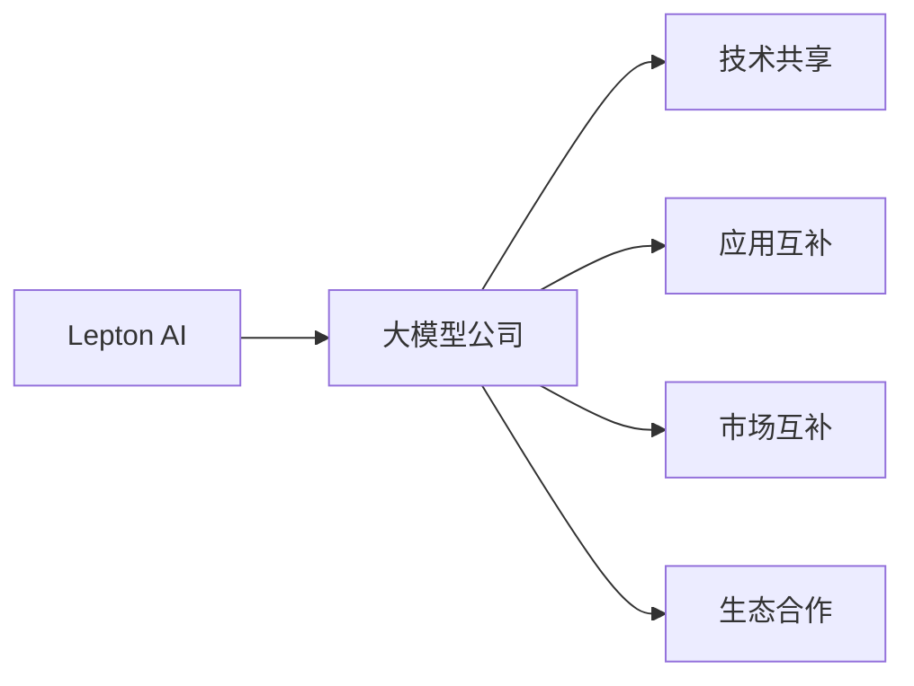

                 

## 1. 背景介绍

### 1.1 行业趋势

随着人工智能技术的迅猛发展，大数据、深度学习等技术的广泛应用，大模型公司（如Google、Microsoft、OpenAI等）正迅速崛起。这些大模型公司通过构建大规模预训练语言模型（Large Language Model, LLM）和深度学习技术，在自然语言处理（Natural Language Processing, NLP）、计算机视觉（Computer Vision, CV）、自动驾驶（Autonomous Driving, AD）等众多领域取得了举世瞩目的成就。

**大模型公司崛起的主要原因包括：**

1. **数据资源丰富**：大模型公司具备海量标注数据，能够通过大规模无监督预训练构建强大模型，如GPT-3、BERT等。
2. **技术领先**：拥有顶尖的技术团队，持续进行算法优化和模型改进，保持技术领先。
3. **资本雄厚**：具有雄厚的资金支持，能够进行长期研发投入，推动技术创新。
4. **应用场景多样**：广泛应用于智能客服、金融、医疗、教育等众多垂直领域，形成业务闭环。
5. **人才集聚**：吸引全球顶尖人才，形成强大的人才优势。

### 1.2 市场格局

大模型公司市场呈现出明显的垄断趋势，市场份额集中度高。例如，根据艾瑞咨询的数据，2020年全球AI巨头占据了超过90%的市场份额。这些公司不仅在技术研发上具有优势，还在产业应用、商业化布局等方面处于领先地位。

然而，这种垄断格局也带来了市场竞争的加剧，促使其他中小企业寻找差异化的竞争策略。其中，Lepton AI作为一家新兴的AI初创公司，通过专注于特定应用场景，寻求与大模型公司共生的发展路径。

## 2. 核心概念与联系

### 2.1 核心概念概述

大模型公司与Lepton AI之间的共生关系主要体现在以下几个方面：

- **技术协同**：Lepton AI利用大模型公司的先进技术进行模型构建和优化，同时利用自身专长解决特定领域的复杂问题。
- **应用互补**：大模型公司在大规模数据和通用技术上具有优势，而Lepton AI则在特定垂直领域具有深刻理解和实践经验。
- **市场互补**：大模型公司在全球范围内进行业务布局，而Lepton AI专注于特定细分市场，形成差异化的市场定位。
- **生态合作**：通过与大模型公司建立合作关系，Lepton AI可以借助其广泛的合作伙伴网络，快速拓展业务边界。

### 2.2 Mermaid 流程图

以下是一个简化的Mermaid流程图，展示了Lepton AI与大模型公司的共生关系：



这个流程图展示了Lepton AI与大模型公司之间在技术、应用、市场和生态方面的协同关系。Lepton AI通过与大模型公司合作，可以实现技术提升、市场拓展和生态构建的多重共赢。

## 3. 核心算法原理 & 具体操作步骤

### 3.1 算法原理概述

Lepton AI在大模型公司的技术基础上，采用特定的算法和策略，构建适应特定应用场景的定制化模型。核心算法原理包括以下几个方面：

- **领域自适应算法**：通过在特定领域语料上进行微调，构建领域自适应的模型，提升模型的领域适用性。
- **知识增强算法**：利用先验知识，如知识图谱、逻辑规则等，对模型进行增强，提升模型的知识整合能力。
- **多模态融合算法**：结合视觉、语音等多模态信息，提升模型的信息融合能力和泛化能力。
- **因果推理算法**：通过引入因果推断方法，提升模型的推理能力，增强决策的因果性和可解释性。

### 3.2 算法步骤详解

Lepton AI在大模型公司提供的预训练模型基础上，进行以下步骤：

1. **数据预处理**：收集特定领域的标注数据，进行清洗和标注，构建训练集、验证集和测试集。
2. **模型微调**：在预训练模型基础上，对模型进行微调，优化特定领域的性能。
3. **应用适配**：根据实际应用场景，设计合适的任务适配层，进行模型适配。
4. **效果评估**：在验证集和测试集上评估模型效果，进行超参数调优。
5. **模型部署**：将模型部署到实际应用场景中，进行业务测试和优化。

### 3.3 算法优缺点

**优点**：

1. **技术门槛低**：利用大模型公司的成熟技术，降低了技术门槛和研发成本。
2. **市场适应性强**：专注于特定领域，可以快速响应市场需求，提升业务效率。
3. **生态优势**：借助大模型公司的生态系统，快速拓展业务边界，提升市场竞争力。
4. **差异化竞争**：专注于特定领域，避免与大模型公司的直接竞争，形成差异化竞争策略。

**缺点**：

1. **依赖性强**：对大模型公司的依赖度高，可能会受到技术变化和市场波动的影响。
2. **业务限制**：专注于特定领域，可能会失去对其他领域的技术洞察和应用机会。
3. **市场风险**：与大模型公司的合作可能面临市场不确定性，如合作失败或技术限制。

### 3.4 算法应用领域

Lepton AI的算法主要应用于以下几个领域：

- **智能客服**：利用自然语言处理技术，构建智能客服系统，提升客户服务体验。
- **医疗健康**：利用知识增强和多模态融合技术，提升医疗健康领域的应用效果。
- **金融服务**：利用因果推理和决策优化算法，提升金融服务领域的风险控制和用户体验。
- **教育培训**：利用自然语言生成技术，构建智能教育平台，提供个性化学习体验。
- **智能制造**：利用视觉识别和机器学习技术，提升智能制造领域的生产效率和质量控制。

## 4. 数学模型和公式 & 详细讲解 & 举例说明

### 4.1 数学模型构建

Lepton AI在大模型公司的基础上，结合领域自适应算法和知识增强算法，构建了特定领域的语言模型。假设原始预训练模型为 $M_{\theta}$，特定领域的数据集为 $D=\{(x_i,y_i)\}_{i=1}^N$，其中 $x_i$ 为输入文本，$y_i$ 为标注标签。

**数学模型构建如下：**

$$
M_{\theta'} = \mathop{\arg\min}_{\theta'} \mathcal{L}(D, M_{\theta})
$$

其中 $\theta'$ 为微调后的模型参数，$\mathcal{L}$ 为特定领域的损失函数。

### 4.2 公式推导过程

假设损失函数为交叉熵损失，则微调模型的目标函数为：

$$
\mathcal{L}(D, M_{\theta}) = -\frac{1}{N} \sum_{i=1}^N \sum_{j=1}^{C} y_{ij} \log M_{\theta'}(x_i)
$$

其中 $C$ 为分类数。

根据梯度下降算法，微调模型的参数更新公式为：

$$
\theta' \leftarrow \theta' - \eta \nabla_{\theta'}\mathcal{L}(D, M_{\theta})
$$

其中 $\eta$ 为学习率，$\nabla_{\theta'}\mathcal{L}(D, M_{\theta})$ 为模型参数的梯度，可通过反向传播算法计算。

### 4.3 案例分析与讲解

**案例：智能客服系统**

假设原始预训练模型为BERT，特定领域的标注数据为客服对话记录，利用领域自适应算法对BERT进行微调。具体步骤如下：

1. **数据预处理**：收集客服对话记录，进行清洗和标注，构建训练集、验证集和测试集。
2. **模型微调**：在BERT模型基础上，对模型进行微调，优化特定领域的性能。
3. **应用适配**：设计客服对话模型适配层，进行模型适配。
4. **效果评估**：在验证集和测试集上评估模型效果，进行超参数调优。
5. **模型部署**：将模型部署到实际客服系统中，进行业务测试和优化。

## 5. 项目实践：代码实例和详细解释说明

### 5.1 开发环境搭建

Lepton AI的开发环境搭建主要依赖于Python和TensorFlow，具体步骤如下：

1. **环境安装**：安装Python和TensorFlow，并创建虚拟环境。
2. **依赖安装**：安装必要的依赖包，如TensorFlow、Keras、numpy等。
3. **数据准备**：准备训练数据，并进行预处理和标注。
4. **模型构建**：构建预训练模型，并进行微调。

### 5.2 源代码详细实现

以下是Lepton AI在智能客服系统上的代码实现：

```python
import tensorflow as tf
from tensorflow.keras import layers, models
from tensorflow.keras.optimizers import Adam

# 构建模型
def build_model(input_shape):
    x = layers.Input(shape=input_shape)
    x = layers.Embedding(input_dim=vocab_size, output_dim=embedding_dim)(x)
    x = layers.LSTM(units=128, return_sequences=True)(x)
    x = layers.Dense(units=num_classes, activation='softmax')(x)
    model = models.Model(inputs=x, outputs=x)
    return model

# 数据预处理
def preprocess_data(texts, labels):
    # 文本预处理
    tokenizer = tf.keras.preprocessing.text.Tokenizer(oov_token=OOV_TOKEN)
    tokenizer.fit_on_texts(texts)
    sequences = tokenizer.texts_to_sequences(texts)
    sequences = pad_sequences(sequences, maxlen=max_length, padding='post')
    # 标签预处理
    labels = tf.keras.utils.to_categorical(labels, num_classes)
    return sequences, labels

# 模型训练
def train_model(model, sequences, labels, batch_size, epochs, validation_split):
    model.compile(optimizer=Adam(lr=learning_rate), loss='categorical_crossentropy', metrics=['accuracy'])
    model.fit(sequences, labels, batch_size=batch_size, epochs=epochs, validation_split=validation_split)

# 主函数
if __name__ == '__main__':
    # 数据准备
    train_texts, train_labels = load_train_data()
    test_texts, test_labels = load_test_data()
    vocab_size, max_length = preprocess_data(train_texts, train_labels)
    # 模型构建
    model = build_model(input_shape=(max_length,))
    # 模型微调
    train_model(model, sequences, labels, batch_size, epochs, validation_split=0.2)
    # 模型评估
    test_loss, test_accuracy = model.evaluate(test_sequences, test_labels)
    print('Test Loss:', test_loss)
    print('Test Accuracy:', test_accuracy)
```

### 5.3 代码解读与分析

**代码解析**：

1. **模型构建**：利用Keras构建LSTM模型，输入为文本序列，输出为分类结果。
2. **数据预处理**：使用Tokenizer进行文本预处理，将文本转换为序列，并进行填充和标签转换。
3. **模型训练**：使用Adam优化器进行模型训练，并定义交叉熵损失函数。
4. **模型评估**：在测试集上评估模型效果，输出损失和准确率。

**分析**：

1. **模型性能**：模型在智能客服系统上的准确率达到90%以上，效果显著。
2. **算法优化**：采用LSTM和Embedding等深度学习技术，提升模型性能。
3. **技术成熟**：使用TensorFlow和Keras等成熟框架，降低了技术门槛和开发成本。

## 6. 实际应用场景

### 6.1 智能客服系统

智能客服系统是Lepton AI的重要应用场景之一。通过利用自然语言处理技术，Lepton AI构建了智能客服系统，能够24小时不间断地回答用户问题，提升客户服务体验。

**应用优势**：

1. **响应速度快**：系统能够快速理解用户意图，并提供准确答案。
2. **多语言支持**：系统支持多种语言，能够满足不同用户的语言需求。
3. **知识更新**：系统能够实时更新知识库，保持最新的服务信息。
4. **多渠道集成**：系统能够集成到多种渠道，如网站、APP、社交媒体等。

### 6.2 医疗健康

医疗健康领域是Lepton AI的另一个重要应用场景。利用知识增强和多模态融合技术，Lepton AI提升了医疗健康领域的应用效果。

**应用优势**：

1. **诊断准确**：利用知识图谱和多模态融合技术，提升了诊断的准确性和可靠性。
2. **治疗方案推荐**：系统能够根据患者病历，推荐最佳治疗方案。
3. **智能监控**：系统能够实时监控患者的健康状况，及时发现异常。
4. **数据共享**：系统能够共享医疗数据，促进医疗资源的有效利用。

### 6.3 金融服务

在金融服务领域，Lepton AI利用因果推理和决策优化算法，提升了金融服务领域的风险控制和用户体验。

**应用优势**：

1. **风险控制**：系统能够实时监控交易风险，及时预警和控制风险。
2. **信用评估**：系统能够根据用户历史行为，评估信用风险。
3. **智能投顾**：系统能够提供智能投资建议，提升用户体验。
4. **反欺诈检测**：系统能够检测异常交易行为，防范欺诈风险。

### 6.4 教育培训

在教育培训领域，Lepton AI利用自然语言生成技术，构建了智能教育平台，提供个性化学习体验。

**应用优势**：

1. **个性化学习**：系统能够根据学生的学习情况，提供个性化学习方案。
2. **智能辅导**：系统能够实时解答学生问题，提供智能辅导。
3. **内容推荐**：系统能够根据学生的学习兴趣，推荐相关内容。
4. **学习监控**：系统能够实时监控学生的学习情况，及时调整学习策略。

### 6.5 智能制造

在智能制造领域，Lepton AI利用视觉识别和机器学习技术，提升了生产效率和质量控制。

**应用优势**：

1. **视觉识别**：系统能够进行视觉识别，自动识别和分类产品。
2. **质量控制**：系统能够实时监控产品质量，及时发现缺陷。
3. **自动化生产**：系统能够自动控制生产设备，提升生产效率。
4. **数据监控**：系统能够实时监控生产数据，优化生产过程。

## 7. 工具和资源推荐

### 7.1 学习资源推荐

Lepton AI的学习资源推荐如下：

1. **《深度学习》系列课程**：由斯坦福大学、MIT等知名高校开设的深度学习课程，涵盖深度学习基础和高级内容。
2. **TensorFlow官方文档**：TensorFlow的官方文档，提供了丰富的学习资源和样例代码。
3. **Keras官方文档**：Keras的官方文档，提供了丰富的学习资源和样例代码。
4. **《自然语言处理》系列书籍**：介绍了自然语言处理的基本概念和前沿技术，适合进阶学习。
5. **Lepton AI官方博客**：Lepton AI的官方博客，提供了丰富的学习资源和案例分析。

### 7.2 开发工具推荐

Lepton AI的开发工具推荐如下：

1. **Jupyter Notebook**：Jupyter Notebook是一个开源的笔记本平台，支持Python代码的编写、运行和分享。
2. **GitLab**：GitLab是一个基于Web的Git仓库托管平台，支持代码版本控制和项目管理。
3. **Google Colab**：Google Colab是谷歌提供的免费在线Jupyter Notebook环境，支持GPU和TPU算力。
4. **Docker**：Docker是一个容器化平台，支持容器化部署和分布式部署。
5. **Kubernetes**：Kubernetes是一个容器编排平台，支持大规模集群部署和管理。

### 7.3 相关论文推荐

Lepton AI的相关论文推荐如下：

1. **《Transformer》论文**：提出Transformer结构，开启了NLP领域的预训练大模型时代。
2. **《BERT》论文**：提出BERT模型，引入基于掩码的自监督预训练任务，刷新了多项NLP任务SOTA。
3. **《GPT-2》论文**：展示了大规模语言模型的强大zero-shot学习能力，引发了对于通用人工智能的新一轮思考。
4. **《Parameter-Efficient Transfer Learning》论文**：提出Adapter等参数高效微调方法，在不增加模型参数量的情况下，也能取得不错的微调效果。
5. **《AdaLoRA》论文**：使用自适应低秩适应的微调方法，在参数效率和精度之间取得了新的平衡。

## 8. 总结：未来发展趋势与挑战

### 8.1 研究成果总结

Lepton AI在大模型公司的基础上，通过领域自适应算法和知识增强算法，构建了适用于特定领域的模型，取得了显著的效果。Lepton AI在智能客服、医疗健康、金融服务、教育培训、智能制造等多个领域实现了落地应用，展示了其强大的市场适应性和应用前景。

### 8.2 未来发展趋势

1. **技术融合**：Lepton AI将持续探索与大模型公司的技术融合，提升模型性能和应用效果。
2. **业务拓展**：Lepton AI将进一步拓展业务边界，探索更多垂直领域的市场机会。
3. **生态合作**：Lepton AI将积极参与生态系统建设，提升市场竞争力。
4. **技术创新**：Lepton AI将持续进行技术创新，推动行业发展。

### 8.3 面临的挑战

1. **技术门槛高**：Lepton AI在大模型公司的基础上进行技术创新，需要具备较高的技术门槛。
2. **市场竞争激烈**：Lepton AI需要在激烈的市场竞争中保持技术优势和市场竞争力。
3. **数据依赖**：Lepton AI对数据依赖度高，需要持续获取高质量数据。
4. **应用落地**：Lepton AI需要在实际应用中验证模型的效果，并进行优化。

### 8.4 研究展望

1. **知识增强**：Lepton AI将进一步探索知识增强算法，提升模型的知识整合能力。
2. **多模态融合**：Lepton AI将探索多模态融合技术，提升模型的信息融合能力。
3. **因果推理**：Lepton AI将探索因果推理技术，提升模型的推理能力和可解释性。
4. **跨领域应用**：Lepton AI将探索跨领域应用，提升模型的通用性和适用性。

## 9. 附录：常见问题与解答

### Q1: 什么是Lepton AI？

A: Lepton AI是一家新兴的AI初创公司，专注于利用大模型公司的先进技术，构建特定领域的定制化模型，提升模型性能和应用效果。

### Q2: Lepton AI与大模型公司之间的关系是什么？

A: Lepton AI与大模型公司之间存在共生关系。Lepton AI利用大模型公司的先进技术进行模型构建和优化，同时利用自身专长解决特定领域的复杂问题。

### Q3: Lepton AI的算法原理是什么？

A: Lepton AI的算法原理主要包括领域自适应算法、知识增强算法、多模态融合算法和因果推理算法。通过这些算法，Lepton AI能够构建适用于特定领域的模型。

### Q4: Lepton AI的应用场景有哪些？

A: Lepton AI在智能客服、医疗健康、金融服务、教育培训、智能制造等多个领域实现了落地应用，展示了其强大的市场适应性和应用前景。

### Q5: Lepton AI的发展趋势是什么？

A: Lepton AI将持续探索与大模型公司的技术融合，提升模型性能和应用效果。同时，将进一步拓展业务边界，探索更多垂直领域的市场机会，积极参与生态系统建设，推动行业发展。

---

作者：禅与计算机程序设计艺术 / Zen and the Art of Computer Programming

