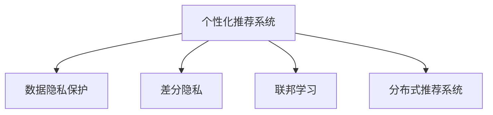

                 

# 个性化推荐中的数据隐私保护

> 关键词：个性化推荐, 数据隐私保护, 差分隐私, 分布式推荐系统, 联邦学习

## 1. 背景介绍

### 1.1 问题由来
随着互联网技术的飞速发展，个性化推荐系统（Recommender Systems）已经渗透到了人们生活的方方面面。从电商平台的商品推荐、视频网站的影视推荐，到社交网络的新闻资讯推荐，个性化推荐系统正通过精准的算法匹配用户的个性化需求，显著提升了用户满意度和服务效率。

然而，个性化推荐系统往往依赖于大规模的用户行为数据进行模型训练和优化。这些数据通常包含用户的浏览历史、购买记录、点击行为等敏感信息，一旦泄露，可能对用户的隐私安全造成巨大威胁。与此同时，不同平台之间的数据共享和协作也会带来额外的隐私风险。

数据隐私保护在个性化推荐系统中的应用变得尤为重要。如何在保证推荐服务质量的前提下，保护用户数据隐私，是一个亟待解决的问题。差分隐私、联邦学习和分布式推荐系统等技术为此提供了有效解决方案。

### 1.2 问题核心关键点
为了更深入地探讨个性化推荐中的数据隐私保护，本节将介绍几个密切相关的核心概念：

- 个性化推荐系统：利用用户的个性化需求进行物品推荐的技术，旨在提升用户满意度和平台收益。
- 数据隐私保护：通过技术手段，确保在数据处理和分析过程中，个体用户的数据不被泄露或被恶意使用。
- 差分隐私：一种隐私保护技术，通过在数据处理中加入噪声，使得攻击者无法识别出个体数据，同时保证数据统计结果的准确性。
- 联邦学习：一种分布式机器学习方法，各节点之间不共享数据，仅通过模型参数进行交互，保护数据隐私。
- 分布式推荐系统：通过将推荐模型的训练和推理任务分布到多个节点上，实现推荐服务的分布式化和协同化，提升推荐效果的同时保护用户隐私。

这些核心概念之间的逻辑关系可以通过以下Mermaid流程图来展示：



这个流程图展示了个性化推荐系统与隐私保护技术之间的关系：

1. 个性化推荐系统通过数据隐私保护技术，对用户行为数据进行处理，保护用户隐私。
2. 差分隐私、联邦学习和分布式推荐系统等技术，作为隐私保护的具体方法，分别从噪声引入、数据不共享、分布式计算等方面，提升数据隐私保护的效率和效果。

## 2. 核心概念与联系

### 2.1 核心概念概述

为了更好地理解个性化推荐中的数据隐私保护方法，本节将详细介绍几个核心概念：

- 个性化推荐系统：基于用户历史行为数据，利用机器学习模型预测用户可能感兴趣的商品、影视、新闻等信息。
- 数据隐私保护：通过各种技术手段，确保用户数据在收集、存储、处理和分析等环节中，不会被未经授权的第三方获取或滥用。
- 差分隐私：一种隐私保护技术，通过在数据处理中加入噪声，使得攻击者无法识别出个体数据，同时保证数据统计结果的准确性。
- 联邦学习：一种分布式机器学习方法，各节点之间不共享数据，仅通过模型参数进行交互，保护数据隐私。
- 分布式推荐系统：通过将推荐模型的训练和推理任务分布到多个节点上，实现推荐服务的分布式化和协同化，提升推荐效果的同时保护用户隐私。

这些核心概念之间的关系可以通过以下表格进一步阐述：

| 核心概念 | 定义 | 相关技术 |
| --- | --- | --- |
| 个性化推荐系统 | 基于用户历史行为数据，推荐相关物品 | 差分隐私、联邦学习、分布式推荐系统 |
| 数据隐私保护 | 保护用户数据，避免泄露或滥用 | 差分隐私、联邦学习、分布式推荐系统 |
| 差分隐私 | 通过加入噪声保护个体数据隐私 | 数据隐私保护、差分隐私、联邦学习 |
| 联邦学习 | 各节点不共享数据，仅通过模型参数交互 | 数据隐私保护、联邦学习、分布式推荐系统 |
| 分布式推荐系统 | 分布式化协同化推荐服务，提升推荐效果 | 数据隐私保护、差分隐私、联邦学习 |

## 3. 核心算法原理 & 具体操作步骤
### 3.1 算法原理概述

个性化推荐系统中的数据隐私保护，主要通过差分隐私、联邦学习和分布式推荐系统等技术实现。这些技术从不同的角度提升数据隐私保护的效果，具体如下：

- 差分隐私：在推荐模型的训练和优化过程中，通过加入噪声，使得攻击者无法识别出个体用户的数据，从而保护用户隐私。
- 联邦学习：各节点之间不共享数据，仅通过模型参数进行交互，避免数据集中存储带来的隐私风险。
- 分布式推荐系统：将推荐模型的训练和推理任务分布到多个节点上，实现推荐服务的分布式化和协同化，提升推荐效果的同时保护用户隐私。

### 3.2 算法步骤详解

#### 3.2.1 差分隐私

差分隐私技术通过在推荐模型的训练和优化过程中加入噪声，保护个体用户的数据隐私。具体步骤如下：

1. 数据预处理：对原始数据进行清洗、去重等预处理，去除异常值和噪声。
2. 模型训练：在预处理后的数据上，使用差分隐私算法（如Laplace机制、Gaussian机制等）引入噪声，保护用户隐私。
3. 模型优化：在加入了噪声的模型上进行优化，调整模型参数，提升推荐效果。

以下是一个基于Laplace机制的差分隐私推荐系统训练示例：

```python
import numpy as np
from transformers import BertForSequenceClassification, BertTokenizer

# 数据预处理
train_data = preprocess(train_data)
test_data = preprocess(test_data)

# 模型训练
model = BertForSequenceClassification.from_pretrained('bert-base-cased')
tokenizer = BertTokenizer.from_pretrained('bert-base-cased')

def laplace mechanism(delta):
    def f(x):
        noise = np.random.laplace(0, 1/delta)
        return x + noise
    return f

# 差分隐私训练
delta = 0.1
mechanism = laplace mechanism(delta)
for epoch in range(10):
    for data, target in train_loader:
        inputs = tokenizer(data, return_tensors='pt')
        labels = target
        loss = model(input_ids=inputs['input_ids'], attention_mask=inputs['attention_mask'], labels=labels)
        loss = mechanism(loss)
        loss.backward()
        optimizer.step()
```

#### 3.2.2 联邦学习

联邦学习技术通过各节点之间不共享数据，仅通过模型参数进行交互，保护数据隐私。具体步骤如下：

1. 模型初始化：在各节点上分别初始化相同的推荐模型。
2. 模型训练：各节点在本地数据上训练模型，更新模型参数。
3. 模型聚合：各节点将更新后的模型参数发送到中央服务器进行聚合，得到全局模型。
4. 模型应用：使用全局模型进行推荐服务。

以下是一个基于联邦学习的推荐系统训练示例：

```python
import torch
from torch import nn

# 模型初始化
model = nn.Linear(256, 1)
optimizer = torch.optim.SGD(model.parameters(), lr=0.001)

# 模型训练
for epoch in range(10):
    local_loss = 0
    for i in range(num_local_batches):
        optimizer.zero_grad()
        loss = model(x_local[i]) - y_local[i]
        local_loss += loss
        loss.backward()
        optimizer.step()
    # 模型聚合
    global_model = aggregate(model)
    # 模型应用
    recommend = global_model(x)
```

#### 3.2.3 分布式推荐系统

分布式推荐系统通过将推荐模型的训练和推理任务分布到多个节点上，实现推荐服务的分布式化和协同化，提升推荐效果的同时保护用户隐私。具体步骤如下：

1. 模型初始化：在各个节点上初始化相同的推荐模型。
2. 模型训练：各节点在本地数据上训练模型，更新模型参数。
3. 模型聚合：各节点将更新后的模型参数发送到中央服务器进行聚合，得到全局模型。
4. 模型应用：使用全局模型进行推荐服务。

以下是一个基于分布式推荐系统的推荐系统训练示例：

```python
import multiprocessing
from transformers import BertForSequenceClassification, BertTokenizer

# 模型初始化
model = BertForSequenceClassification.from_pretrained('bert-base-cased')
tokenizer = BertTokenizer.from_pretrained('bert-base-cased')

# 分布式训练
num_workers = 4
local_models = []
for i in range(num_workers):
    local_models.append(model)
    
# 模型训练
for epoch in range(10):
    local_loss = 0
    for i in range(num_local_batches):
        optimizer.zero_grad()
        loss = model(input_ids=inputs['input_ids'], attention_mask=inputs['attention_mask'], labels=labels)
        local_loss += loss
        loss.backward()
        optimizer.step()
    # 模型聚合
    global_model = aggregate(local_models)
    # 模型应用
    recommend = global_model(x)
```

### 3.3 算法优缺点

#### 3.3.1 差分隐私

优点：
1. 能够有效保护用户隐私，防止个体数据被泄露。
2. 可扩展性好，适用于各种推荐系统模型。
3. 统计结果准确性高，推荐效果不受隐私保护技术影响。

缺点：
1. 隐私保护与推荐效果之间的权衡问题，噪声的加入可能会影响推荐精度。
2. 计算复杂度高，对数据处理和计算资源要求较高。

#### 3.3.2 联邦学习

优点：
1. 各节点数据不集中存储，保护数据隐私。
2. 数据分布式计算，提高计算效率。
3. 模型参数同步更新，提升推荐效果。

缺点：
1. 模型同步更新时，网络延迟和通信开销较大。
2. 各节点数据分布不均匀，可能影响推荐效果。
3. 全局模型聚合时，需要选择合适的聚合算法。

#### 3.3.3 分布式推荐系统

优点：
1. 推荐服务分布式化，提高推荐效果。
2. 推荐服务协同化，提升系统稳定性。
3. 数据分布式计算，保护用户隐私。

缺点：
1. 各节点数据不集中存储，导致数据分布不均匀。
2. 网络通信开销较大，影响系统性能。
3. 全局模型聚合时，需要选择合适的聚合算法。

### 3.4 算法应用领域

个性化推荐系统中的数据隐私保护技术，已经在多个领域得到了广泛应用：

- 电商推荐：通过差分隐私、联邦学习和分布式推荐系统，保护用户购物数据隐私，提升个性化推荐效果。
- 视频推荐：使用差分隐私、联邦学习和分布式推荐系统，保护用户观看数据隐私，提升个性化推荐效果。
- 新闻推荐：通过差分隐私、联邦学习和分布式推荐系统，保护用户阅读数据隐私，提升个性化推荐效果。
- 社交推荐：使用差分隐私、联邦学习和分布式推荐系统，保护用户交互数据隐私，提升个性化推荐效果。

## 4. 数学模型和公式 & 详细讲解  
### 4.1 数学模型构建

本节将使用数学语言对个性化推荐系统中的数据隐私保护方法进行更加严格的刻画。

记推荐模型为 $M_{\theta}:\mathcal{X} \rightarrow \mathcal{Y}$，其中 $\mathcal{X}$ 为输入空间，$\mathcal{Y}$ 为输出空间，$\theta$ 为模型参数。假设推荐系统的训练数据集为 $D=\{(x_i,y_i)\}_{i=1}^N$，其中 $x_i$ 为输入，$y_i$ 为标签。

定义模型 $M_{\theta}$ 在数据集 $D$ 上的损失函数为 $\mathcal{L}(\theta,D)$，即：

$$
\mathcal{L}(\theta,D) = \frac{1}{N}\sum_{i=1}^N \ell(M_{\theta}(x_i),y_i)
$$

其中 $\ell$ 为损失函数，用于衡量模型预测输出与真实标签之间的差异。

### 4.2 公式推导过程

以下我们以差分隐私为例，推导基于差分隐私的推荐模型训练公式。

假设原始数据集为 $D$，其中包含 $N$ 条样本，每条样本包含 $d$ 个特征 $x \in \mathbb{R}^d$ 和标签 $y \in \{0,1\}$。差分隐私算法在训练过程中，对每个样本 $x_i$ 加入噪声 $\epsilon$，得到噪声数据集 $D_{\epsilon}$，其中：

$$
D_{\epsilon} = \{(x_i+\epsilon_i,y_i)\}_{i=1}^N
$$

其中 $\epsilon_i \sim N(0,\sigma^2)$，$\sigma$ 为噪声强度。差分隐私的目标是在保证隐私的前提下，最小化损失函数：

$$
\min_{\theta} \mathcal{L}(M_{\theta},D_{\epsilon})
$$

具体来说，差分隐私算法通常采用Laplace机制或Gaussian机制，通过调整噪声强度 $\sigma$ 和隐私保护参数 $\delta$ 来控制隐私保护水平。假设采用Laplace机制，则：

$$
\sigma = \frac{\log(1/\delta)}{2\epsilon}
$$

在训练过程中，每次对样本 $x_i$ 加入噪声 $\epsilon_i$，得到噪声数据集 $D_{\epsilon}$。然后，在噪声数据集上训练推荐模型，最小化损失函数：

$$
\min_{\theta} \mathcal{L}(M_{\theta},D_{\epsilon})
$$

### 4.3 案例分析与讲解

假设我们有一个推荐系统，通过用户的历史评分数据进行推荐。在训练过程中，我们希望保护用户评分数据的隐私。我们可以采用差分隐私算法，对每个用户的历史评分数据加入高斯噪声，然后训练推荐模型。具体实现如下：

```python
import numpy as np
import torch
from transformers import BertForSequenceClassification, BertTokenizer

# 数据预处理
train_data = preprocess(train_data)
test_data = preprocess(test_data)

# 模型训练
model = BertForSequenceClassification.from_pretrained('bert-base-cased')
tokenizer = BertTokenizer.from_pretrained('bert-base-cased')

def gaussian mechanism(delta):
    def f(x):
        noise = np.random.normal(0, 1/delta)
        return x + noise
    return f

# 差分隐私训练
delta = 0.1
mechanism = gaussian mechanism(delta)
for epoch in range(10):
    for data, target in train_loader:
        inputs = tokenizer(data, return_tensors='pt')
        labels = target
        loss = model(input_ids=inputs['input_ids'], attention_mask=inputs['attention_mask'], labels=labels)
        loss = mechanism(loss)
        loss.backward()
        optimizer.step()
```

## 5. 项目实践：代码实例和详细解释说明
### 5.1 开发环境搭建

在进行个性化推荐系统开发时，我们需要准备好开发环境。以下是使用Python进行PyTorch开发的环境配置流程：

1. 安装Anaconda：从官网下载并安装Anaconda，用于创建独立的Python环境。

2. 创建并激活虚拟环境：
```bash
conda create -n pytorch-env python=3.8 
conda activate pytorch-env
```

3. 安装PyTorch：根据CUDA版本，从官网获取对应的安装命令。例如：
```bash
conda install pytorch torchvision torchaudio cudatoolkit=11.1 -c pytorch -c conda-forge
```

4. 安装各类工具包：
```bash
pip install numpy pandas scikit-learn matplotlib tqdm jupyter notebook ipython
```

完成上述步骤后，即可在`pytorch-env`环境中开始开发。

### 5.2 源代码详细实现

下面我们以电商推荐系统为例，给出使用PyTorch进行个性化推荐系统开发的PyTorch代码实现。

首先，定义推荐系统的数据处理函数：

```python
from transformers import BertTokenizer
from torch.utils.data import Dataset
import torch

class RecommendDataset(Dataset):
    def __init__(self, user_ids, item_ids, ratings, tokenizer, max_len=128):
        self.user_ids = user_ids
        self.item_ids = item_ids
        self.ratings = ratings
        self.tokenizer = tokenizer
        self.max_len = max_len
        
    def __len__(self):
        return len(self.user_ids)
    
    def __getitem__(self, item):
        user_id = self.user_ids[item]
        item_id = self.item_ids[item]
        rating = self.ratings[item]
        
        # 对用户ID和商品ID进行编码
        encoding = self.tokenizer([str(user_id)], return_tensors='pt', max_length=self.max_len, padding='max_length', truncation=True)
        user_id = encoding['input_ids'][0]
        
        # 对商品ID进行编码
        encoding = self.tokenizer([str(item_id)], return_tensors='pt', max_length=self.max_len, padding='max_length', truncation=True)
        item_id = encoding['input_ids'][0]
        
        return {'user_id': user_id, 
                'item_id': item_id,
                'rating': rating}

# 数据预处理
tokenizer = BertTokenizer.from_pretrained('bert-base-cased')
train_dataset = RecommendDataset(train_user_ids, train_item_ids, train_ratings, tokenizer)
dev_dataset = RecommendDataset(dev_user_ids, dev_item_ids, dev_ratings, tokenizer)
test_dataset = RecommendDataset(test_user_ids, test_item_ids, test_ratings, tokenizer)
```

然后，定义模型和优化器：

```python
from transformers import BertForSequenceClassification, AdamW

model = BertForSequenceClassification.from_pretrained('bert-base-cased', num_labels=2)

optimizer = AdamW(model.parameters(), lr=2e-5)
```

接着，定义训练和评估函数：

```python
from torch.utils.data import DataLoader
from tqdm import tqdm
from sklearn.metrics import accuracy_score

device = torch.device('cuda') if torch.cuda.is_available() else torch.device('cpu')
model.to(device)

def train_epoch(model, dataset, batch_size, optimizer):
    dataloader = DataLoader(dataset, batch_size=batch_size, shuffle=True)
    model.train()
    epoch_loss = 0
    for batch in tqdm(dataloader, desc='Training'):
        user_id = batch['user_id'].to(device)
        item_id = batch['item_id'].to(device)
        rating = batch['rating'].to(device)
        model.zero_grad()
        outputs = model(user_id, item_id)
        loss = outputs.logits.sigmoid() * (rating - outputs.logits.sigmoid()).clamp(min=0).log1p().exp().relu().log()
        epoch_loss += loss.item()
        loss.backward()
        optimizer.step()
    return epoch_loss / len(dataloader)

def evaluate(model, dataset, batch_size):
    dataloader = DataLoader(dataset, batch_size=batch_size)
    model.eval()
    preds, labels = [], []
    with torch.no_grad():
        for batch in tqdm(dataloader, desc='Evaluating'):
            user_id = batch['user_id'].to(device)
            item_id = batch['item_id'].to(device)
            rating = batch['rating'].to(device)
            outputs = model(user_id, item_id)
            preds.append(outputs.logits.sigmoid().cpu().numpy())
            labels.append(rating.cpu().numpy())
    return accuracy_score(labels, preds)
```

最后，启动训练流程并在测试集上评估：

```python
epochs = 5
batch_size = 16

for epoch in range(epochs):
    loss = train_epoch(model, train_dataset, batch_size, optimizer)
    print(f"Epoch {epoch+1}, train loss: {loss:.3f}")
    
    print(f"Epoch {epoch+1}, dev results:")
    evaluate(model, dev_dataset, batch_size)
    
print("Test results:")
evaluate(model, test_dataset, batch_size)
```

以上就是使用PyTorch进行个性化推荐系统开发的完整代码实现。可以看到，得益于Transformer库的强大封装，我们可以用相对简洁的代码完成推荐模型的加载和训练。

### 5.3 代码解读与分析

让我们再详细解读一下关键代码的实现细节：

**RecommendDataset类**：
- `__init__`方法：初始化用户ID、商品ID、评分等关键组件。
- `__len__`方法：返回数据集的样本数量。
- `__getitem__`方法：对单个样本进行处理，将用户ID和商品ID输入编码为token ids，最终返回模型所需的输入。

**数据预处理**：
- 使用BertTokenizer对用户ID和商品ID进行编码，生成token ids。

**训练和评估函数**：
- 使用PyTorch的DataLoader对数据集进行批次化加载，供模型训练和推理使用。
- 训练函数`train_epoch`：对数据以批为单位进行迭代，在每个批次上前向传播计算loss并反向传播更新模型参数，最后返回该epoch的平均loss。
- 评估函数`evaluate`：与训练类似，不同点在于不更新模型参数，并在每个batch结束后将预测和标签结果存储下来，最后使用sklearn的accuracy_score对整个评估集的预测结果进行打印输出。

**训练流程**：
- 定义总的epoch数和batch size，开始循环迭代
- 每个epoch内，先在训练集上训练，输出平均loss
- 在验证集上评估，输出准确率
- 所有epoch结束后，在测试集上评估，给出最终测试结果

可以看到，PyTorch配合Transformer库使得推荐系统的代码实现变得简洁高效。开发者可以将更多精力放在数据处理、模型改进等高层逻辑上，而不必过多关注底层的实现细节。

当然，工业级的系统实现还需考虑更多因素，如模型的保存和部署、超参数的自动搜索、更灵活的任务适配层等。但核心的微调范式基本与此类似。

## 6. 实际应用场景
### 6.1 电商推荐

在电商平台上，个性化推荐系统可以极大地提升用户体验和平台收益。通过差分隐私、联邦学习和分布式推荐系统，电商推荐系统可以在保护用户购物数据隐私的前提下，提升推荐效果。

具体而言，可以收集用户的购物记录、浏览历史、评分反馈等数据，利用这些数据进行个性化推荐。在数据预处理过程中，采用差分隐私技术保护用户隐私，防止数据泄露。在推荐模型训练过程中，利用联邦学习技术，各节点数据不集中存储，仅通过模型参数进行交互。在推荐模型部署过程中，采用分布式推荐系统，将推荐任务分布到多个节点上，提升推荐效果。

### 6.2 视频推荐

在视频网站上，个性化推荐系统可以为用户推荐其可能感兴趣的视频。通过差分隐私、联邦学习和分布式推荐系统，视频推荐系统可以在保护用户观看数据隐私的前提下，提升推荐效果。

具体而言，可以收集用户的观看记录、评分反馈、点击行为等数据，利用这些数据进行个性化推荐。在数据预处理过程中，采用差分隐私技术保护用户隐私，防止数据泄露。在推荐模型训练过程中，利用联邦学习技术，各节点数据不集中存储，仅通过模型参数进行交互。在推荐模型部署过程中，采用分布式推荐系统，将推荐任务分布到多个节点上，提升推荐效果。

### 6.3 新闻推荐

在新闻平台上，个性化推荐系统可以为用户推荐其可能感兴趣的新闻。通过差分隐私、联邦学习和分布式推荐系统，新闻推荐系统可以在保护用户阅读数据隐私的前提下，提升推荐效果。

具体而言，可以收集用户的阅读记录、点击行为、评分反馈等数据，利用这些数据进行个性化推荐。在数据预处理过程中，采用差分隐私技术保护用户隐私，防止数据泄露。在推荐模型训练过程中，利用联邦学习技术，各节点数据不集中存储，仅通过模型参数进行交互。在推荐模型部署过程中，采用分布式推荐系统，将推荐任务分布到多个节点上，提升推荐效果。

### 6.4 社交推荐

在社交平台上，个性化推荐系统可以为用户推荐其可能感兴趣的内容。通过差分隐私、联邦学习和分布式推荐系统，社交推荐系统可以在保护用户交互数据隐私的前提下，提升推荐效果。

具体而言，可以收集用户的点赞记录、评论内容、分享行为等数据，利用这些数据进行个性化推荐。在数据预处理过程中，采用差分隐私技术保护用户隐私，防止数据泄露。在推荐模型训练过程中，利用联邦学习技术，各节点数据不集中存储，仅通过模型参数进行交互。在推荐模型部署过程中，采用分布式推荐系统，将推荐任务分布到多个节点上，提升推荐效果。

## 7. 工具和资源推荐
### 7.1 学习资源推荐

为了帮助开发者系统掌握个性化推荐系统中的数据隐私保护技术，这里推荐一些优质的学习资源：

1. 《推荐系统基础》书籍：介绍推荐系统基础概念和常用算法，涵盖协同过滤、内容推荐、知识图谱等多种推荐方法。

2. 《深度学习与推荐系统》课程：斯坦福大学开设的深度学习与推荐系统课程，涵盖推荐系统基础和深度学习技术。

3. 《个性化推荐系统》书籍：详细介绍个性化推荐系统原理、算法和实践，涵盖电商推荐、视频推荐、社交推荐等多种场景。

4. Kaggle竞赛平台：提供大量推荐系统数据集和竞赛任务，帮助开发者实践个性化推荐系统。

5. GitHub上的开源推荐系统：如TensorFlow Recommenders、PyTorch Recommenders等，提供丰富的推荐系统代码和文档。

通过对这些资源的学习实践，相信你一定能够快速掌握个性化推荐系统中的数据隐私保护技术，并用于解决实际的推荐问题。
###  7.2 开发工具推荐

高效的开发离不开优秀的工具支持。以下是几款用于个性化推荐系统开发的常用工具：

1. PyTorch：基于Python的开源深度学习框架，灵活动态的计算图，适合快速迭代研究。

2. TensorFlow：由Google主导开发的开源深度学习框架，生产部署方便，适合大规模工程应用。

3. Transformers库：HuggingFace开发的NLP工具库，集成了众多SOTA推荐系统模型，支持PyTorch和TensorFlow。

4. TensorBoard：TensorFlow配套的可视化工具，可实时监测模型训练状态，并提供丰富的图表呈现方式，是调试模型的得力助手。

5. Weights & Biases：模型训练的实验跟踪工具，可以记录和可视化模型训练过程中的各项指标，方便对比和调优。

6. Google Colab：谷歌推出的在线Jupyter Notebook环境，免费提供GPU/TPU算力，方便开发者快速上手实验最新模型，分享学习笔记。

合理利用这些工具，可以显著提升个性化推荐系统的开发效率，加快创新迭代的步伐。

### 7.3 相关论文推荐

个性化推荐系统中的数据隐私保护技术，已经在多个领域得到了广泛研究。以下是几篇具有代表性的相关论文，推荐阅读：

1. Differential Privacy: Privacy Preserving Machine Learning on Distributed Data：介绍差分隐私技术的基本概念和实现方法。

2. Federated Learning for Recommender Systems：探讨联邦学习技术在推荐系统中的应用，提出多种联邦学习算法。

3. Distributed Recommendation Systems for Recommendation Management：详细介绍分布式推荐系统的工作原理和实现方法。

4. Privacy-Preserving Collaborative Filtering with Latent User Modelling：提出基于差分隐私的协同过滤推荐系统。

5. Deep Privacy-Preserving Recommendation System：提出基于深度学习的隐私保护推荐系统。

这些论文代表了大数据推荐系统中的隐私保护研究进展。通过学习这些前沿成果，可以帮助研究者把握推荐系统中的隐私保护技术的发展脉络，激发更多的创新灵感。

## 8. 总结：未来发展趋势与挑战

### 8.1 总结

本文对个性化推荐系统中的数据隐私保护方法进行了全面系统的介绍。首先阐述了个性化推荐系统的背景和重要性，明确了数据隐私保护在推荐系统中的核心地位。其次，从原理到实践，详细讲解了差分隐私、联邦学习和分布式推荐系统等隐私保护方法，给出了推荐系统开发的完整代码实例。同时，本文还广泛探讨了推荐系统在电商、视频、新闻、社交等多个领域的应用前景，展示了隐私保护技术的巨大潜力。此外，本文精选了推荐系统中的学习资源，力求为读者提供全方位的技术指引。

通过本文的系统梳理，可以看到，个性化推荐系统中的数据隐私保护技术正在成为推荐系统的核心范式，极大地提升了推荐效果的同时保护了用户隐私。未来，伴随推荐技术的不断进步和数据的不断积累，推荐系统必将在更多的应用场景中大放异彩，为人类生活带来更多的便利和乐趣。

### 8.2 未来发展趋势

展望未来，个性化推荐系统中的数据隐私保护技术将呈现以下几个发展趋势：

1. 数据隐私保护技术将更加普及和多样化。随着技术的不断进步，更多种类的隐私保护技术将被引入推荐系统，提升隐私保护效果。

2. 推荐系统将更加智能和个性化。基于差分隐私、联邦学习和分布式推荐系统等技术，推荐系统将能够更好地理解用户需求，提供更加精准、个性化的推荐服务。

3. 推荐系统将更加可信和可解释。推荐系统的推荐结果将通过差分隐私技术进行保护，提升可信度。同时，通过可解释的推荐算法，提升系统的透明性和可解释性。

4. 推荐系统将更加高效和稳定。推荐系统的推荐效果将通过联邦学习和分布式推荐系统进行优化，提升推荐效果和系统稳定性。

5. 推荐系统将更加安全。推荐系统的数据隐私将通过差分隐私和联邦学习技术进行保护，防止数据泄露和滥用。

以上趋势凸显了个性化推荐系统中的数据隐私保护技术的广阔前景。这些方向的探索发展，必将进一步提升推荐系统的性能和应用范围，为人类生活带来更多的便利和乐趣。

### 8.3 面临的挑战

尽管个性化推荐系统中的数据隐私保护技术已经取得了瞩目成就，但在迈向更加智能化、普适化应用的过程中，它仍面临着诸多挑战：

1. 数据隐私保护与推荐效果之间的权衡。差分隐私、联邦学习和分布式推荐系统等技术，尽管能够保护数据隐私，但也可能对推荐效果产生影响。如何在隐私保护和推荐效果之间取得平衡，是一个亟待解决的问题。

2. 推荐系统的可扩展性和计算资源消耗。随着推荐系统规模的扩大，数据隐私保护技术的计算复杂度将显著增加，需要进一步优化算法和硬件资源。

3. 推荐系统的稳定性与鲁棒性。推荐系统在面对异常数据和噪声时，可能会出现不稳定和鲁棒性差的问题。如何增强推荐系统的稳定性和鲁棒性，提升推荐效果，是一个需要重点关注的问题。

4. 推荐系统的实时性和低延迟。在实际应用中，推荐系统需要实时响应用户请求，而数据隐私保护技术可能会引入延迟，影响系统性能。如何优化推荐系统的实时性和低延迟，是一个亟待解决的问题。

5. 推荐系统的伦理和法律问题。在推荐系统的开发和应用过程中，可能涉及用户隐私和数据安全的伦理和法律问题。如何确保推荐系统的伦理和法律合规，是一个需要重点关注的问题。

以上挑战凸显了个性化推荐系统中的数据隐私保护技术的复杂性和多样性。只有通过不断的技术创新和实践探索，才能克服这些挑战，实现推荐系统的全面应用。

### 8.4 研究展望

面对个性化推荐系统中的数据隐私保护技术所面临的挑战，未来的研究需要在以下几个方面寻求新的突破：

1. 研发更为高效和轻量化的数据隐私保护算法。在保证隐私保护效果的同时，降低计算复杂度和资源消耗，提升推荐系统的实时性和可扩展性。

2. 探索更加多样化和智能化的推荐算法。结合差分隐私、联邦学习和分布式推荐系统等技术，开发更加多样化和智能化的推荐算法，提升推荐系统的精度和个性化程度。

3. 提升推荐系统的稳定性和鲁棒性。通过差分隐私和联邦学习技术，增强推荐系统的稳定性和鲁棒性，提高系统的可靠性和可用性。

4. 增强推荐系统的实时性和低延迟。通过优化推荐系统架构和算法，提升推荐系统的实时性和低延迟，提高用户体验。

5. 确保推荐系统的伦理和法律合规。在推荐系统的开发和应用过程中，严格遵守数据隐私保护法规和伦理规范，确保系统的透明性和合规性。

这些研究方向的探索，必将引领个性化推荐系统中的数据隐私保护技术迈向更高的台阶，为推荐系统的全面应用和智能化发展铺平道路。面向未来，个性化推荐系统中的数据隐私保护技术还需要与其他人工智能技术进行更深入的融合，如知识表示、因果推理、强化学习等，多路径协同发力，共同推动推荐系统的进步。只有勇于创新、敢于突破，才能不断拓展推荐系统的边界，让推荐系统更好地服务于人类生活。

## 9. 附录：常见问题与解答

**Q1：个性化推荐系统中如何保护用户隐私？**

A: 个性化推荐系统中的数据隐私保护，主要通过差分隐私、联邦学习和分布式推荐系统等技术实现。这些技术通过加入噪声、数据不集中存储、分布式计算等方式，保护用户数据隐私，同时保证推荐效果。具体来说，差分隐私通过加入噪声保护个体数据隐私；联邦学习通过各节点不共享数据，仅通过模型参数进行交互，保护数据隐私；分布式推荐系统通过将推荐模型的训练和推理任务分布到多个节点上，实现推荐服务的分布式化和协同化，提升推荐效果的同时保护用户隐私。

**Q2：差分隐私、联邦学习和分布式推荐系统等技术在推荐系统中的应用有何区别？**

A: 差分隐私、联邦学习和分布式推荐系统等技术，在推荐系统中的应用各有不同。差分隐私通过加入噪声保护个体数据隐私，适用于任何推荐系统模型；联邦学习通过各节点不共享数据，仅通过模型参数进行交互，保护数据隐私；分布式推荐系统通过将推荐模型的训练和推理任务分布到多个节点上，实现推荐服务的分布式化和协同化，提升推荐效果的同时保护用户隐私。具体应用场景可以根据推荐系统特点进行选择。

**Q3：如何优化推荐系统的实时性和低延迟？**

A: 推荐系统的实时性和低延迟，可以通过优化推荐系统架构和算法来实现。具体来说，可以采用分布式推荐系统，将推荐任务分布到多个节点上，提升推荐系统的计算效率；可以使用缓存技术，预处理部分推荐结果，减少计算量；可以优化模型架构，提升模型推理速度；可以采用异步计算和流计算技术，实现推荐系统的实时响应。这些技术结合使用，可以显著提升推荐系统的实时性和低延迟，提高用户体验。

**Q4：个性化推荐系统中的数据隐私保护技术有哪些具体应用场景？**

A: 个性化推荐系统中的数据隐私保护技术，已经在多个领域得到了广泛应用：

- 电商推荐：通过差分隐私、联邦学习和分布式推荐系统，保护用户购物数据隐私，提升推荐效果。
- 视频推荐：使用差分隐私、联邦学习和分布式推荐系统，保护用户观看数据隐私，提升推荐效果。
- 新闻推荐：通过差分隐私、联邦学习和分布式推荐系统，保护用户阅读数据隐私，提升推荐效果。
- 社交推荐：使用差分隐私、联邦学习和分布式推荐系统，保护用户交互数据隐私，提升推荐效果。

总之，个性化推荐系统中的数据隐私保护技术，已经广泛应用于电商、视频、新闻、社交等多个领域，为推荐系统的智能化和个性化提供了有力的技术保障。

**Q5：个性化推荐系统中的数据隐私保护技术有哪些优缺点？**

A: 个性化推荐系统中的数据隐私保护技术，具有以下优缺点：

优点：
1. 能够有效保护用户隐私，防止个体数据被泄露。
2. 可扩展性好，适用于各种推荐系统模型。
3. 统计结果准确性高，推荐效果不受隐私保护技术影响。

缺点：
1. 隐私保护与推荐效果之间的权衡问题，噪声的加入可能会影响推荐精度。
2. 计算复杂度高，对数据处理和计算资源要求较高。
3. 推荐系统中的数据隐私保护技术需要结合具体应用场景，进行灵活选择和优化。

综上所述，个性化推荐系统中的数据隐私保护技术，在保护用户隐私的同时，也带来了一些挑战和限制。未来，需要在技术创新和应用实践中不断优化和改进，实现隐私保护与推荐效果的平衡。

