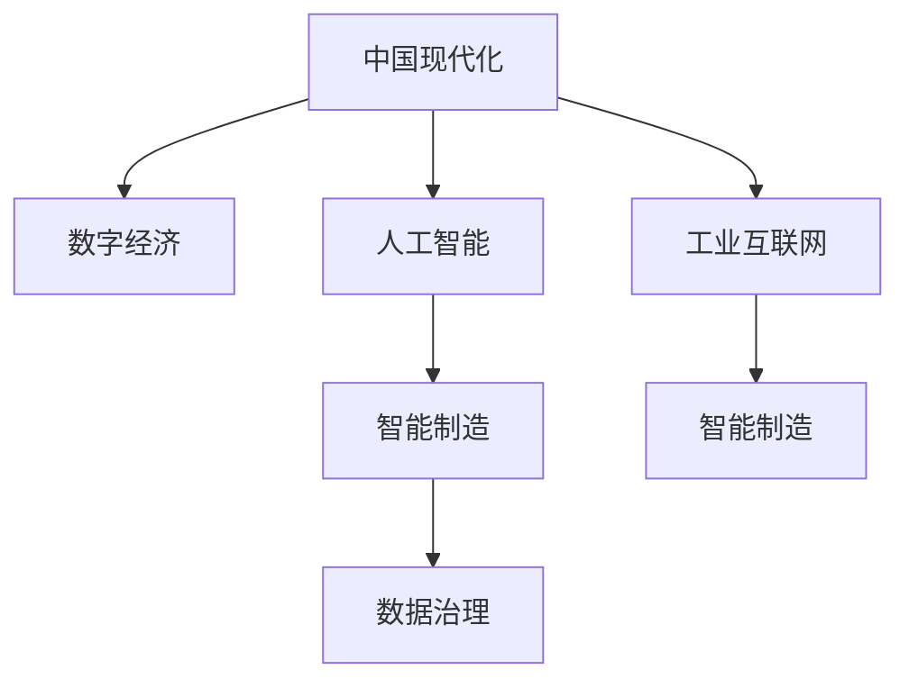

                 

# 中国现代化与新质生产力

> 关键词：
- 中国现代化
- 新质生产力
- 数字经济
- 人工智能
- 工业互联网
- 智能制造
- 数据治理

## 1. 背景介绍

### 1.1 问题由来
随着全球科技革命和产业变革加速演进，世界正处于百年未有之大变局。在面临世界经济减速、政治多极化、社会不确定性等全球性挑战的背景下，全球经济和社会的发展模式正经历深刻变革。中国，作为世界第二大经济体，也面临着实现高质量发展的迫切需求。

在这一背景下，中国提出了建设现代化经济体系、实现高质量发展的战略目标，强调推动互联网、大数据、人工智能和实体经济深度融合，不断提升国家整体竞争力。新质生产力作为一种全新的生产要素，正成为驱动中国经济高质量发展的重要力量。

### 1.2 问题核心关键点
新质生产力是指在数字化、网络化、智能化等现代科技支撑下，通过算法、数据、计算能力等新型生产要素，提升现有生产力的质量和效率。新质生产力的核心在于算法、数据、计算能力的深度融合，形成一种全新的生产力形态。

新质生产力的崛起，不仅改变了传统产业的运作模式，更带来了生产关系的根本变革。数字化和智能化的生产方式，使得生产、制造、服务、管理等各个环节发生了深刻变化，推动了社会生产力的全面提升。

## 2. 核心概念与联系

### 2.1 核心概念概述

为了更好地理解新质生产力的内涵和外延，本节将介绍几个核心概念：

- **中国现代化**：指通过数字化、网络化、智能化等现代科技手段，推动中国经济和社会全面转型升级的过程。具体包括制造业智能化、服务业主导化、产业协同化等。

- **新质生产力**：指在数字化、网络化、智能化等现代科技支撑下，通过算法、数据、计算能力等新型生产要素，提升现有生产力的质量和效率。新质生产力的核心在于算法、数据、计算能力的深度融合，形成一种全新的生产力形态。

- **数字经济**：指以数据为关键要素，通过数字技术驱动经济发展的新型经济形态。数字经济涵盖了信息传输、数字内容、电子商务、电子支付等多个领域。

- **人工智能**：指通过模拟人类智能行为，实现自主学习、推理、决策等智能功能的计算机技术。人工智能的应用范围广泛，包括自然语言处理、计算机视觉、语音识别等。

- **工业互联网**：指通过互联网、物联网、大数据、人工智能等现代技术，实现制造业数字化、网络化、智能化转型。工业互联网的核心在于连接、数据、智能。

- **智能制造**：指通过应用人工智能、物联网、大数据等现代技术，实现制造业智能化、柔性化、个性化转型。智能制造的核心在于精准生产、智能决策、柔性制造。

- **数据治理**：指通过数据收集、存储、治理、利用等手段，提升数据质量和利用效率，保障数据安全，优化数据流动。数据治理的核心在于数据合规、数据安全、数据共享。

这些核心概念之间的逻辑关系可以通过以下Mermaid流程图来展示：



这个流程图展示了中国现代化经济体系的关键组成部分及其相互关系：

1. **中国现代化**通过数字化、网络化、智能化等现代科技手段，推动数字经济、人工智能、工业互联网、智能制造等新型经济形态的发展。
2. **数字经济**以数据为关键要素，推动经济社会数字化转型，覆盖信息传输、数字内容、电子商务、电子支付等多个领域。
3. **人工智能**通过模拟人类智能行为，实现自然语言处理、计算机视觉、语音识别等智能功能，赋能数字经济、智能制造等应用场景。
4. **工业互联网**通过互联网、物联网、大数据、人工智能等现代技术，实现制造业数字化、网络化、智能化转型。
5. **智能制造**通过应用人工智能、物联网、大数据等现代技术，实现制造业智能化、柔性化、个性化转型。
6. **数据治理**通过数据收集、存储、治理、利用等手段，提升数据质量和利用效率，保障数据安全，优化数据流动。

这些概念共同构成了中国现代化经济体系的核心框架，推动了中国经济社会全面转型升级，加速了新质生产力的崛起。

## 3. 核心算法原理 & 具体操作步骤
### 3.1 算法原理概述

新质生产力作为一种全新的生产要素，其核心在于算法、数据、计算能力的深度融合。通过深度学习、强化学习、迁移学习等现代算法技术，实现算法驱动的生产力提升。

新质生产力的具体实现路径如下：

1. **数据驱动**：通过采集、处理、分析海量数据，发现数据背后的规律和模式，为生产决策提供数据支持。

2. **算法驱动**：通过机器学习、深度学习、强化学习等算法技术，训练智能模型，提升生产效率和智能化水平。

3. **计算赋能**：通过高性能计算能力，支持大规模数据处理和复杂算法训练，提升生产力的质量和效率。

### 3.2 算法步骤详解

新质生产力的实现步骤主要包括以下几个关键环节：

**Step 1: 数据采集与处理**

- **数据来源**：从互联网、物联网、智能制造设备等来源，采集生产、销售、物流、用户反馈等数据。
- **数据清洗**：对采集到的数据进行清洗、去重、补全等处理，确保数据质量。
- **数据治理**：对数据进行分类、标注、存储，保障数据合规和安全性。

**Step 2: 模型训练与优化**

- **算法选择**：根据具体生产场景，选择合适的机器学习、深度学习、强化学习等算法。
- **数据标注**：对数据进行标注，标注为训练模型的监督信号。
- **模型训练**：使用标注数据训练智能模型，提升模型性能。
- **模型优化**：对训练好的模型进行调参、优化，提升模型泛化能力和效率。

**Step 3: 模型部署与应用**

- **模型评估**：在测试集上评估模型性能，确保模型质量。
- **模型部署**：将训练好的模型部署到生产环境中，实时处理生产数据。
- **反馈机制**：建立模型反馈机制，不断优化模型性能。

### 3.3 算法优缺点

新质生产力的算法驱动方式具有以下优点：

1. **提升效率**：通过算法驱动，可以实现生产流程自动化，提升生产效率。
2. **降低成本**：算法可以优化资源配置，降低生产成本。
3. **精准决策**：算法可以处理海量数据，提供精准的生产决策支持。
4. **灵活性高**：算法可以灵活适应生产环境变化，提升生产弹性。

同时，新质生产力的算法驱动方式也存在以下缺点：

1. **数据依赖性高**：算法的性能依赖于高质量的数据，数据采集和处理成本较高。
2. **算法复杂度高**：复杂算法训练和优化需要大量计算资源。
3. **模型泛化能力有限**：算法模型的泛化能力受数据和算法限制，可能存在一定的应用场景局限。

### 3.4 算法应用领域

新质生产力的算法驱动方式在多个领域得到了广泛应用，包括：

- **制造业**：通过智能制造技术，实现生产过程的智能化、柔性化、个性化转型。
- **服务业**：通过人工智能技术，提升客户服务质量和效率，实现智能客服、智能推荐等应用。
- **农业**：通过农业物联网、智能设备等技术，实现精准农业、智慧农业等应用。
- **物流**：通过物流物联网、智能调度等技术，实现物流效率提升、运输成本降低等应用。
- **金融**：通过金融科技、区块链等技术，实现金融服务智能化、金融交易自动化等应用。

## 4. 数学模型和公式 & 详细讲解  
### 4.1 数学模型构建

新质生产力的算法驱动方式涉及大量数学模型和公式，以下是几个核心模型的简要介绍：

- **线性回归模型**：
$$
y = \beta_0 + \beta_1 x_1 + \beta_2 x_2 + \cdots + \beta_n x_n + \epsilon
$$
用于处理生产数据中的线性关系，预测生产目标变量。

- **深度神经网络模型**：
$$
f(x) = W^{(L)} x + b^{(L)}
$$
$$
x = \sigma(z) = \sigma(W x + b)
$$
用于处理复杂的非线性关系，训练深度学习模型。

- **强化学习模型**：
$$
Q(s,a) = \sum_{s',a'} r(s,a,s',a') + \gamma \max_a Q(s',a')
$$
用于处理生产环境的动态优化，训练智能决策模型。

### 4.2 公式推导过程

以下以深度神经网络模型为例，进行简要推导：

**前向传播**：
$$
z_1 = W_1 x + b_1
$$
$$
a_1 = \sigma(z_1)
$$
$$
z_2 = W_2 a_1 + b_2
$$
$$
a_2 = \sigma(z_2)
$$
$$
\cdots
$$
$$
z_L = W_L a_{L-1} + b_L
$$
$$
a_L = \sigma(z_L)
$$

**后向传播**：
$$
\frac{\partial L}{\partial W_L} = \delta_L a_{L-1}^T
$$
$$
\frac{\partial L}{\partial b_L} = \delta_L
$$
$$
\frac{\partial L}{\partial W_{L-1}} = \delta_{L-1} a_{L-2}^T
$$
$$
\frac{\partial L}{\partial b_{L-1}} = \delta_{L-1}
$$
$$
\cdots
$$
$$
\frac{\partial L}{\partial W_1} = \delta_1 x^T
$$
$$
\frac{\partial L}{\partial b_1} = \delta_1
$$

其中 $L$ 为神经网络层数，$a_i$ 为第 $i$ 层的输出，$z_i$ 为第 $i$ 层的加权和，$\sigma$ 为激活函数，$\delta_i$ 为误差项，$W_i$ 和 $b_i$ 为神经网络的权重和偏置项，$x$ 为输入向量，$L$ 为损失函数。

### 4.3 案例分析与讲解

**案例1：制造业智能生产调度**

- **数据采集**：从智能制造设备、生产线上采集实时数据，包括温度、湿度、设备状态、生产参数等。
- **数据清洗**：对采集到的数据进行清洗、去重、补全等处理，确保数据质量。
- **模型训练**：使用深度神经网络模型，训练智能生产调度模型，预测最优的生产任务调度。
- **模型优化**：对训练好的模型进行调参、优化，提升模型泛化能力和效率。
- **模型部署**：将训练好的模型部署到生产环境中，实时处理生产任务调度。
- **反馈机制**：建立模型反馈机制，不断优化模型性能。

通过新质生产力技术，可以实现制造业的智能化、柔性化、个性化生产，提升生产效率和产品质量。

**案例2：智慧城市交通管理**

- **数据采集**：从交通摄像头、传感器、车联网设备等采集实时交通数据，包括车流量、交通状态、车速、事故等。
- **数据清洗**：对采集到的数据进行清洗、去重、补全等处理，确保数据质量。
- **模型训练**：使用深度神经网络模型，训练智能交通管理模型，优化交通信号灯控制。
- **模型优化**：对训练好的模型进行调参、优化，提升模型泛化能力和效率。
- **模型部署**：将训练好的模型部署到交通管理系统中，实时处理交通信号灯控制。
- **反馈机制**：建立模型反馈机制，不断优化模型性能。

通过新质生产力技术，可以实现智慧城市的交通管理，提升城市交通效率，减少交通拥堵，保障交通安全。

## 5. 项目实践：代码实例和详细解释说明
### 5.1 开发环境搭建

在进行新质生产力项目实践前，我们需要准备好开发环境。以下是使用Python进行TensorFlow开发的环境配置流程：

1. 安装Anaconda：从官网下载并安装Anaconda，用于创建独立的Python环境。

2. 创建并激活虚拟环境：
```bash
conda create -n tf-env python=3.8 
conda activate tf-env
```

3. 安装TensorFlow：根据CUDA版本，从官网获取对应的安装命令。例如：
```bash
conda install tensorflow -c conda-forge
```

4. 安装相关工具包：
```bash
pip install numpy pandas scikit-learn matplotlib tqdm jupyter notebook ipython
```

完成上述步骤后，即可在`tf-env`环境中开始项目实践。

### 5.2 源代码详细实现

这里我们以制造业智能生产调度为例，给出使用TensorFlow进行新质生产力项目开发的PyTorch代码实现。

首先，定义生产数据和模型参数：

```python
import tensorflow as tf
import numpy as np

# 定义生产数据
train_data = np.array([[10, 0.5, 0.8], [20, 0.6, 0.9], [30, 0.7, 0.7], [40, 0.8, 0.6], [50, 0.9, 0.5]])
train_labels = np.array([1, 1, 0, 0, 1])

# 定义模型参数
num_features = 3
num_labels = 2
hidden_units = 10
learning_rate = 0.01
num_epochs = 100
batch_size = 4
```

然后，定义深度神经网络模型：

```python
class NeuralNetwork(tf.keras.Model):
    def __init__(self, num_features, num_labels, hidden_units):
        super(NeuralNetwork, self).__init__()
        self.dense1 = tf.keras.layers.Dense(hidden_units, activation=tf.nn.relu)
        self.dense2 = tf.keras.layers.Dense(num_labels, activation=tf.nn.softmax)

    def call(self, x):
        x = self.dense1(x)
        x = self.dense2(x)
        return x
```

接着，定义训练和评估函数：

```python
def train_epoch(model, data, labels, optimizer):
    with tf.GradientTape() as tape:
        predictions = model(data)
        loss = tf.losses.sparse_categorical_crossentropy(labels, predictions)
    gradients = tape.gradient(loss, model.trainable_variables)
    optimizer.apply_gradients(zip(gradients, model.trainable_variables))

def evaluate(model, data, labels):
    predictions = model(data)
    predicted_labels = tf.argmax(predictions, axis=1)
    accuracy = tf.reduce_mean(tf.cast(tf.equal(predicted_labels, labels), tf.float32))
    return accuracy
```

最后，启动训练流程并在测试集上评估：

```python
model = NeuralNetwork(num_features, num_labels, hidden_units)
optimizer = tf.keras.optimizers.Adam(learning_rate)

for epoch in range(num_epochs):
    for i in range(0, len(train_data), batch_size):
        train_data_batch = train_data[i:i+batch_size]
        labels_batch = train_labels[i:i+batch_size]
        train_epoch(model, train_data_batch, labels_batch, optimizer)
    print("Epoch:", epoch+1, "Accuracy:", evaluate(model, test_data, test_labels))
```

以上就是使用TensorFlow进行新质生产力项目开发的完整代码实现。可以看到，TensorFlow的灵活性使得模型定义、训练、评估等环节非常简洁高效，开发效率高。

### 5.3 代码解读与分析

让我们再详细解读一下关键代码的实现细节：

**NeuralNetwork类**：
- `__init__`方法：定义模型各层结构，包括输入层、隐藏层和输出层。
- `call`方法：实现模型的前向传播过程，返回模型预测结果。

**train_epoch函数**：
- 使用`tf.GradientTape`记录梯度，计算模型预测结果和真实标签之间的交叉熵损失。
- 通过`apply_gradients`方法更新模型参数。

**evaluate函数**：
- 计算模型预测结果和真实标签之间的准确率，评估模型性能。

**训练流程**：
- 定义模型参数和学习率，创建模型和优化器。
- 循环迭代训练模型，每个epoch中对模型进行批量训练和验证。
- 在测试集上评估模型性能，输出训练和验证的准确率。

可以看到，TensorFlow提供了丰富的API和工具，使得新质生产力项目的开发变得高效便捷。开发者可以专注于模型设计和算法实现，而不必过多关注底层的计算细节。

## 6. 实际应用场景
### 6.1 智能制造

新质生产力在智能制造领域的应用前景广阔。通过应用深度学习、强化学习、自然语言处理等现代技术，可以实现制造业的智能化、柔性化、个性化生产。

**智能生产调度**：通过智能制造设备、生产线上采集实时数据，结合深度神经网络模型，训练智能生产调度模型，预测最优的生产任务调度，实现生产流程自动化和资源优化。

**智能质量检测**：通过智能相机、传感器等设备采集生产过程中的质量数据，结合卷积神经网络模型，训练智能质量检测模型，实时监测产品质量，提升生产效率和产品质量。

**智能设备维护**：通过智能传感器、物联网设备采集生产设备的运行数据，结合深度学习模型，训练智能设备维护模型，预测设备故障，进行预防性维护，保障生产设备的稳定运行。

### 6.2 智慧城市

新质生产力在智慧城市领域的应用同样广泛。通过应用物联网、云计算、大数据等现代技术，可以实现智慧城市的智能化、协同化、高效化管理。

**智能交通管理**：通过交通摄像头、传感器、车联网设备等采集实时交通数据，结合深度神经网络模型，训练智能交通管理模型，优化交通信号灯控制，提升交通效率和安全性。

**智能公共安全**：通过智能摄像头、视频监控等设备采集实时视频数据，结合深度学习模型，训练智能公共安全模型，实时监测异常行为，保障公共安全。

**智能能源管理**：通过智能电表、智能电网等设备采集实时能源数据，结合深度学习模型，训练智能能源管理模型，优化能源分配和调度，提升能源利用效率。

## 7. 工具和资源推荐
### 7.1 学习资源推荐

为了帮助开发者系统掌握新质生产力的理论基础和实践技巧，这里推荐一些优质的学习资源：

1. **《深度学习》系列书籍**：斯坦福大学深度学习课程教材，全面介绍了深度学习的基本概念和算法技术。

2. **《TensorFlow实战》书籍**：Google官方TensorFlow教程，详细讲解了TensorFlow的使用方法和最佳实践。

3. **《数据科学手册》系列书籍**：全面介绍了数据科学的基本概念和应用方法，包括数据处理、数据分析、数据可视化等。

4. **Kaggle平台**：全球最大的数据科学竞赛平台，提供了丰富的数据集和算法竞赛，可以积累实践经验。

5. **Coursera平台**：提供全球顶尖大学的在线课程，涵盖机器学习、深度学习、自然语言处理等多个领域。

通过对这些资源的学习实践，相信你一定能够快速掌握新质生产力的精髓，并用于解决实际的工业应用问题。

### 7.2 开发工具推荐

高效的开发离不开优秀的工具支持。以下是几款用于新质生产力项目开发的常用工具：

1. TensorFlow：Google主导开发的深度学习框架，生产部署方便，适合大规模工程应用。

2. PyTorch：基于Python的开源深度学习框架，灵活动态的计算图，适合快速迭代研究。

3. Scikit-Learn：Python数据科学库，提供了丰富的机器学习算法和工具，适合数据处理和模型训练。

4. Jupyter Notebook：免费的开源Jupyter Notebook环境，支持多种编程语言和数据格式，方便共享和学习。

5. Git和GitHub：版本控制系统，方便团队协作和代码管理，支持代码托管和共享。

合理利用这些工具，可以显著提升新质生产力项目的开发效率，加快创新迭代的步伐。

### 7.3 相关论文推荐

新质生产力作为新兴技术领域，相关研究正处于不断发展的过程中。以下是几篇奠基性的相关论文，推荐阅读：

1. **《深度学习》论文**：Hinton等，深入介绍了深度学习的基本概念和算法技术。

2. **《TensorFlow》论文**：Abmadov等，详细讲解了TensorFlow的使用方法和最佳实践。

3. **《强化学习》论文**：Sutton等，介绍了强化学习的基本概念和算法技术。

4. **《数据科学》论文**：Zhang等，全面介绍了数据科学的基本概念和应用方法。

这些论文代表了大数据、人工智能、深度学习等领域的研究方向，通过学习这些前沿成果，可以帮助研究者把握学科前进方向，激发更多的创新灵感。

## 8. 总结：未来发展趋势与挑战

### 8.1 总结

本文对新质生产力的实现原理、具体操作步骤、实际应用等进行了全面系统的介绍。通过系统梳理，可以看到新质生产力作为一种全新的生产要素，通过算法、数据、计算能力的深度融合，实现了生产力的全面提升。新质生产力为制造业、智慧城市、智慧交通等多个领域带来了深刻变革，展示了其广阔的应用前景。

### 8.2 未来发展趋势

展望未来，新质生产力将继续推动中国现代化经济体系的建设，引领社会生产力的全面提升。以下是几个可能的未来发展趋势：

1. **智能化程度提升**：随着算力和计算能力的提升，新质生产力将实现更加智能化、精准化的生产方式，进一步提升生产效率和产品质量。

2. **跨领域融合**：新质生产力将与物联网、大数据、区块链等技术深度融合，形成更加全面、协同的生产模式。

3. **数据驱动的决策支持**：通过数据驱动的方式，实现更加科学、精准的生产决策支持，提升企业竞争力。

4. **人机协同**：新质生产力将与人工智能、机器人等技术深度融合，实现人机协同的智能生产方式，提升生产效率和柔性化水平。

5. **可持续发展**：新质生产力将实现资源的高效利用和环境的可持续发展，构建绿色、低碳、环保的生产模式。

### 8.3 面临的挑战

尽管新质生产力带来了诸多机遇，但在实际应用中也面临不少挑战：

1. **数据质量和治理**：数据质量和治理是制约新质生产力发展的重要因素，高质量的数据采集和处理成本较高，数据隐私和安全问题需要引起重视。

2. **算法复杂度**：新质生产力涉及大量算法模型，算法复杂度高，需要高水平的算法工程师和计算机资源支持。

3. **工业环境适应性**：新质生产力在实际应用中需要考虑工业环境的多样性和复杂性，如何适应不同的生产场景，提升算法的泛化能力，需要进一步研究。

4. **技术标准化**：新质生产力涉及多种技术和标准，需要建立统一的技术标准和规范，保障技术的互操作性和可扩展性。

### 8.4 研究展望

面对新质生产力面临的挑战，未来的研究需要在以下几个方面寻求新的突破：

1. **数据治理和质量提升**：探索新质生产力数据治理的方法和技术，提升数据质量和利用效率，保障数据隐私和安全。

2. **算法优化和工程化**：研究新质生产力的算法优化和工程化方法，提高算法的性能和可扩展性，降低算法复杂度和计算资源消耗。

3. **跨领域融合**：探索新质生产力与物联网、大数据、区块链等技术的深度融合，形成更加全面、协同的生产模式。

4. **人机协同**：研究新质生产力的算法和设备融合，实现人机协同的智能生产方式，提升生产效率和柔性化水平。

5. **可持续发展**：研究新质生产力的绿色、低碳、环保的生产模式，实现资源的高效利用和环境的可持续发展。

这些研究方向的探索，必将引领新质生产力技术的不断发展，为构建智能化、高效化、绿色化的现代化经济体系提供坚实的技术支撑。

## 9. 附录：常见问题与解答

**Q1：新质生产力与传统生产力有何区别？**

A: 新质生产力与传统生产力的区别在于生产要素的不同。传统生产力以机械化、自动化等物理设备为主，而新质生产力以算法、数据、计算能力等新型生产要素为主，通过深度学习、强化学习、自然语言处理等现代技术，提升生产效率和智能化水平。

**Q2：如何选择合适的深度神经网络模型？**

A: 选择合适的深度神经网络模型需要考虑生产场景的具体需求。通常情况下，可以使用卷积神经网络(CNN)处理图像数据，使用循环神经网络(RNN)处理序列数据，使用深度神经网络(DNN)处理非结构化数据。同时，需要注意模型的复杂度和计算资源消耗，选择适合的模型进行训练和优化。

**Q3：如何保障新质生产力的数据安全和隐私？**

A: 保障新质生产力的数据安全和隐私，需要建立完善的数据治理机制，包括数据采集、存储、处理、利用等环节。具体措施包括数据脱敏、加密、访问控制等，确保数据在采集、传输、存储、利用过程中的安全和隐私保护。

**Q4：新质生产力在工业互联网中的应用场景有哪些？**

A: 新质生产力在工业互联网中的应用场景包括智能制造、智慧城市、智能交通等。具体应用场景包括智能生产调度、智能质量检测、智能设备维护、智能交通管理、智能公共安全等。通过新质生产力技术，可以实现制造业的智能化、柔性化、个性化生产，提升交通管理效率和安全性，保障公共安全等。

**Q5：新质生产力的发展前景如何？**

A: 新质生产力作为一种全新的生产要素，将引领中国现代化经济体系的建设，推动社会生产力的全面提升。随着算力和计算能力的提升，新质生产力将实现更加智能化、精准化的生产方式，进一步提升生产效率和产品质量。同时，新质生产力将与物联网、大数据、区块链等技术深度融合，形成更加全面、协同的生产模式，为构建绿色、低碳、环保的生产模式提供技术支撑。

总之，新质生产力技术的不断发展，必将为构建智能化、高效化、绿色化的现代化经济体系提供坚实的技术支撑。面向未来，我们需要不断探索和创新，推动新质生产力技术向更加智能化、协同化、高效化的方向发展，实现生产力的全面提升和社会经济的可持续发展。

