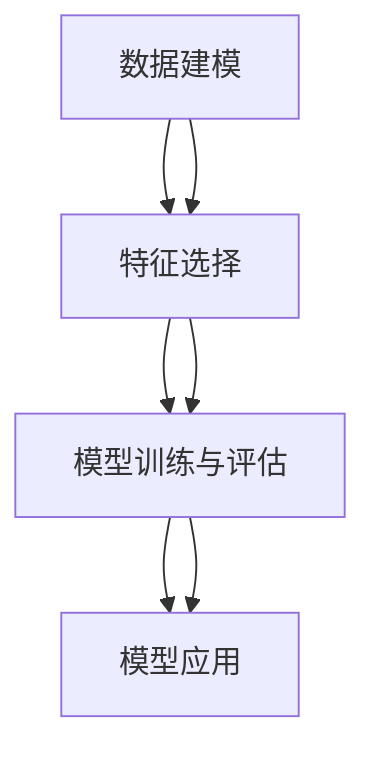

                 

# 丰富模型思维:增强管理者洞悉力

## 1. 背景介绍

### 1.1 问题由来

随着信息技术的快速发展，现代企业面临着前所未有的复杂性和不确定性。如何在瞬息万变的环境中保持敏锐的洞察力，及时调整战略，成为管理者的核心挑战。在此背景下，数据驱动决策、模型驱动洞察成为了企业管理者不可或缺的工具。然而，庞大的数据集和复杂的模型结构，往往让管理者望而却步。本文将通过系统性地介绍数据建模方法，帮助管理者掌握模型思维，提升决策效率和准确性。

### 1.2 问题核心关键点

模型思维的核心在于将复杂问题抽象为数学模型，通过模型求解获得洞悉力。其中，数据建模、特征选择、模型训练与评估、模型应用是关键环节。好的模型思维能帮助管理者从海量数据中提取有用信息，发现数据背后的规律，从而在管理决策中发挥重要作用。

### 1.3 问题研究意义

掌握模型思维，对于提升管理者的洞悉力和决策质量具有重要意义：

1. **数据驱动决策**：通过模型分析数据，发现关键因素和趋势，为决策提供科学依据。
2. **提高效率**：模型自动化处理大量数据，大幅缩短决策周期，加速企业响应速度。
3. **降低风险**：模型提供统计意义上的最优解，帮助管理者规避决策失误。
4. **增强竞争优势**：模型预测未来趋势，帮助企业抢占先机，保持市场领先。
5. **持续改进**：模型可动态更新，帮助管理者及时调整策略，保持竞争优势。

## 2. 核心概念与联系

### 2.1 核心概念概述

为了深入理解模型思维，首先介绍几个核心概念：

- **数据建模**：将现实问题抽象为数学模型，用数据来描述模型，并通过求解模型获取洞悉力。
- **特征选择**：从原始数据中提取最有用的特征，提高模型精度和泛化能力。
- **模型训练与评估**：通过训练模型和评估模型性能，选择最优模型用于预测。
- **模型应用**：将模型应用于实际问题，提供预测、决策支持。

这些概念之间的关系可以用以下Mermaid流程图表示：



这个流程图示意图表示了数据建模的整个过程：从数据收集开始，经过特征选择和模型训练与评估，最终应用于实际问题。每个环节都在向管理者提供洞悉力。

## 3. 核心算法原理 & 具体操作步骤
### 3.1 算法原理概述

模型思维的核心在于建立并求解数学模型，以发现数据背后的规律和趋势。该过程一般包括以下几个关键步骤：

1. **问题建模**：将实际问题抽象为数学模型。
2. **数据收集**：收集与问题相关的数据。
3. **特征选择**：从数据中选择最有用的特征。
4. **模型训练**：用数据训练模型，调整模型参数。
5. **模型评估**：评估模型性能，选择合适的模型。
6. **模型应用**：将模型应用于实际问题，提供预测和决策支持。

### 3.2 算法步骤详解

以回归分析为例，详细讲解模型思维的步骤：

**Step 1: 问题建模**

假设某企业的销售额与多个因素有关，包括广告投入、市场价格、季节性因素等。将销售额表示为这些因素的线性组合：

$$
Y = \beta_0 + \beta_1X_1 + \beta_2X_2 + ... + \beta_nX_n + \epsilon
$$

其中，$Y$ 为销售额，$X_i$ 为第 $i$ 个因素，$\beta_i$ 为回归系数，$\epsilon$ 为误差项。

**Step 2: 数据收集**

收集历史销售数据，并记录每个销售数据对应的广告投入、市场价格、季节性因素等数据。

**Step 3: 特征选择**

从收集的数据中选择最有用的特征。例如，市场价格和季节性因素可能对销售额有显著影响，而其他因素的影响较小。选择这些特征后，数据变为：

$$
(X_1, X_2, ..., X_n)
$$

**Step 4: 模型训练**

使用历史数据训练线性回归模型，调整回归系数 $\beta_i$，使得模型能最小化预测误差：

$$
\min_{\beta} \sum_{i=1}^n (Y_i - \hat{Y}_i)^2
$$

其中，$\hat{Y}_i$ 为模型预测的销售额。

**Step 5: 模型评估**

使用测试集数据评估模型的性能，通常使用均方误差(MSE)或决定系数(R^2)等指标：

$$
MSE = \frac{1}{n} \sum_{i=1}^n (Y_i - \hat{Y}_i)^2
$$

$$
R^2 = 1 - \frac{\sum_{i=1}^n (Y_i - \hat{Y}_i)^2}{\sum_{i=1}^n (Y_i - \bar{Y})^2}
$$

**Step 6: 模型应用**

使用训练好的模型预测未来的销售额，并进行决策支持。例如，根据预测结果调整广告预算和市场策略。

### 3.3 算法优缺点

模型思维在提升管理者洞悉力方面具有以下优点：

1. **系统性强**：通过数学模型，能够系统地处理和分析数据，避免人为主观偏差。
2. **精度高**：数学模型能准确地量化变量之间的关系，提供更可靠的预测。
3. **可解释性强**：模型中的回归系数表示各个因素对结果的影响程度，便于解释和管理者理解。
4. **可复用性**：模型一旦训练完成，可以反复应用于不同数据集，减少重复工作。

同时，模型思维也存在一些局限性：

1. **模型假设**：模型通常需要一些假设条件，如线性关系、误差项独立等，现实问题可能不符合这些假设。
2. **过拟合风险**：过度复杂模型可能过拟合训练数据，无法泛化到新数据。
3. **数据依赖性**：模型性能依赖于数据质量和数量，数据不足或数据偏差会影响模型结果。
4. **计算复杂度**：复杂模型训练和求解过程可能计算量大，耗时较长。

## 4. 数学模型和公式 & 详细讲解 & 举例说明

### 4.1 数学模型构建

以回归分析为例，构建数学模型的一般步骤为：

1. **问题抽象**：将实际问题抽象为数学表达式，找出变量之间的关系。
2. **模型假设**：基于问题特点，选择合适的模型假设。
3. **模型求解**：使用数据训练模型，调整模型参数，得到最优解。

### 4.2 公式推导过程

以线性回归为例，公式推导过程如下：

假设数据集 $D=\{(X_i,Y_i)\}_{i=1}^n$，其中 $X_i$ 为输入变量，$Y_i$ 为输出变量。

根据最小二乘法，回归系数 $\beta_i$ 的求解公式为：

$$
\beta = (X^TX)^{-1}X^TY
$$

其中，$X^TX$ 为数据矩阵的转置与自身的乘积，$(X^TX)^{-1}$ 为 $X^TX$ 的逆矩阵，$Y$ 为数据向量。

### 4.3 案例分析与讲解

假设某电商企业希望预测一个月销售额 $Y$，已知的预测变量包括广告投入 $X_1$、市场价格 $X_2$、季节性因素 $X_3$ 等。

**Step 1: 问题建模**

建立线性回归模型：

$$
Y = \beta_0 + \beta_1X_1 + \beta_2X_2 + \beta_3X_3 + \epsilon
$$

**Step 2: 数据收集**

收集历史销售数据，并记录每个销售数据对应的广告投入、市场价格、季节性因素等数据。

**Step 3: 特征选择**

选择广告投入、市场价格和季节性因素作为预测变量。

**Step 4: 模型训练**

使用历史数据训练线性回归模型，调整回归系数 $\beta_i$。

**Step 5: 模型评估**

使用测试集数据评估模型的性能，通常使用均方误差(MSE)或决定系数(R^2)等指标。

**Step 6: 模型应用**

使用训练好的模型预测未来的销售额，并进行决策支持。

## 5. 项目实践：代码实例和详细解释说明
### 5.1 开发环境搭建

在进行数据建模实践前，我们需要准备好开发环境。以下是使用Python进行Scikit-learn开发的环境配置流程：

1. 安装Anaconda：从官网下载并安装Anaconda，用于创建独立的Python环境。

2. 创建并激活虚拟环境：
```bash
conda create -n sklearn-env python=3.8 
conda activate sklearn-env
```

3. 安装Scikit-learn：
```bash
conda install scikit-learn
```

4. 安装其他工具包：
```bash
pip install pandas numpy matplotlib seaborn
```

完成上述步骤后，即可在`sklearn-env`环境中开始数据建模实践。

### 5.2 源代码详细实现

下面我们以线性回归模型为例，给出使用Scikit-learn进行数据建模的Python代码实现。

首先，定义数据集和模型：

```python
from sklearn.linear_model import LinearRegression
from sklearn.metrics import mean_squared_error, r2_score
import pandas as pd

# 加载数据集
data = pd.read_csv('sales_data.csv')

# 划分数据集
X = data[['ad_spending', 'price', 'seasonality']]
y = data['sales']

# 创建线性回归模型
model = LinearRegression()
```

接着，进行数据拆分和模型训练：

```python
from sklearn.model_selection import train_test_split

# 数据拆分
X_train, X_test, y_train, y_test = train_test_split(X, y, test_size=0.2, random_state=42)

# 模型训练
model.fit(X_train, y_train)
```

然后，进行模型评估：

```python
# 模型预测
y_pred = model.predict(X_test)

# 计算评估指标
mse = mean_squared_error(y_test, y_pred)
r2 = r2_score(y_test, y_pred)

print(f'Mean Squared Error: {mse:.2f}')
print(f'R^2 Score: {r2:.2f}')
```

最后，进行模型应用：

```python
# 应用模型
new_data = pd.DataFrame({
    'ad_spending': 1000,
    'price': 50,
    'seasonality': 1
})
y_pred_new = model.predict(new_data)

print(f'Predicted Sales: {y_pred_new[0]}')
```

以上就是使用Scikit-learn进行线性回归模型构建的完整代码实现。可以看到，Scikit-learn提供了丰富的建模工具，使得数据建模过程变得简洁高效。

### 5.3 代码解读与分析

让我们再详细解读一下关键代码的实现细节：

**数据加载与拆分**：
- `pd.read_csv('sales_data.csv')`：使用Pandas加载历史销售数据。
- `train_test_split(X, y, test_size=0.2, random_state=42)`：将数据集分为训练集和测试集，测试集占总数据的20%。

**模型训练**：
- `model.fit(X_train, y_train)`：使用训练数据拟合线性回归模型。

**模型评估**：
- `mean_squared_error(y_test, y_pred)`：计算测试集上的均方误差。
- `r2_score(y_test, y_pred)`：计算决定系数R^2，衡量模型的拟合程度。

**模型应用**：
- `new_data`：创建新数据样本。
- `model.predict(new_data)`：使用训练好的模型预测新数据的销售额。

可以看出，Scikit-learn在模型训练、评估和应用等方面都提供了便捷的工具，使得数据建模过程变得直观易用。

## 6. 实际应用场景
### 6.1 电商销售预测

电商企业可以利用回归模型预测未来销售额，优化库存管理和营销策略。具体而言，通过收集历史销售数据和相关因素（如广告投入、市场价格等），训练线性回归模型。模型可以预测未来的销售额，帮助企业优化广告预算和商品价格，提升销售业绩。

### 6.2 客户流失预警

金融机构可以通过回归模型预测客户流失概率，提前采取措施。具体而言，收集客户的历史行为数据，如交易频率、账户余额、投诉次数等，建立回归模型预测客户流失概率。模型可以提前预警高风险客户，帮助金融机构挽留客户，提升客户满意度。

### 6.3 供应链优化

制造业企业可以利用回归模型优化供应链管理。具体而言，收集历史订单数据和相关因素（如生产成本、物流费用等），建立回归模型预测未来订单需求。模型可以优化生产计划和物流安排，降低成本，提升供应链效率。

### 6.4 未来应用展望

随着模型思维的不断发展，未来在更多领域得到应用，为管理决策提供有力支持。

在智慧城市管理中，通过建立交通流量、环境污染等预测模型，可以优化城市交通和环境管理，提升城市治理水平。

在农业生产中，通过建立农作物产量预测模型，可以科学指导种植，提高农业生产效率和产品质量。

在金融风险管理中，通过建立信用评分、风险评估等预测模型，可以预测风险，防范金融危机。

此外，在教育、医疗、能源等多个领域，回归模型都可以发挥重要作用，提升管理和决策质量。相信随着模型思维的不断应用，管理者的决策过程将更加科学、高效。

## 7. 工具和资源推荐
### 7.1 学习资源推荐

为了帮助管理者掌握模型思维，推荐以下学习资源：

1. 《Python机器学习》书籍：通过实际案例，深入浅出地介绍了机器学习的基本概念和建模方法。
2. 《回归分析》课程：经典回归分析课程，系统讲解回归分析的基本原理和应用。
3. Coursera《数据科学》专业课程：涵盖数据科学的基础知识，包括数据预处理、建模、评估等。
4. Kaggle平台：通过实际比赛，提升数据分析和建模技能。
5. Scikit-learn官方文档：详细介绍了Scikit-learn库的各种建模工具和算法。

通过对这些资源的学习实践，相信管理者可以迅速掌握模型思维，提升数据分析和决策能力。

### 7.2 开发工具推荐

高效的数据建模离不开优秀的工具支持。以下是几款常用的开发工具：

1. Python：免费且功能强大的编程语言，适合进行数据分析和建模。
2. R：经典的数据分析工具，广泛应用于学术研究和企业应用。
3. Scikit-learn：开源机器学习库，提供了丰富的建模工具。
4. SPSS：商业数据分析软件，提供了强大的统计分析和建模功能。
5. Excel：常用的数据处理工具，适合简单的数据分析和建模。

合理利用这些工具，可以显著提升数据建模的效率，加速决策过程。

### 7.3 相关论文推荐

模型思维的研究源于学界的不断探索。以下是几篇经典的相关论文，推荐阅读：

1. "An Introduction to Statistical Learning"：经典统计学习教材，涵盖回归分析、决策树、神经网络等建模方法。
2. "Pattern Recognition and Machine Learning"：机器学习教材，系统讲解了回归分析、分类、聚类等建模方法。
3. "Linear Regression Analysis"：回归分析教材，详细介绍了线性回归的基本原理和应用。
4. "Modeling Data with Regression"：Scikit-learn官方文档，介绍了回归模型在实际应用中的使用。

这些论文代表了模型思维的研究前沿，通过学习这些经典成果，可以更好地理解模型思维的基本原理和应用方法。

## 8. 总结：未来发展趋势与挑战

### 8.1 研究成果总结

本文系统介绍了数据建模方法，帮助管理者掌握模型思维，提升决策质量和效率。主要研究成果包括：

1. 数据建模基本步骤：问题建模、数据收集、特征选择、模型训练与评估、模型应用。
2. 线性回归模型的构建和应用：通过实际案例，展示模型思维的实践过程。
3. 模型思维的优势与局限：系统性地分析了模型思维在管理决策中的应用效果。

### 8.2 未来发展趋势

展望未来，模型思维在企业管理中的应用将呈现以下几个发展趋势：

1. **模型自动化**：随着自动化工具的不断发展，模型构建和应用将变得更加自动化，减少人工干预。
2. **数据融合**：多源数据融合技术的发展，将使模型更加全面和准确。
3. **实时预测**：模型预测能力的提升，使得实时数据分析和决策成为可能。
4. **模型可解释性**：提高模型可解释性，使管理者能够更好地理解模型决策过程。
5. **跨领域应用**：模型思维将进一步应用于更多领域，推动企业管理创新。

### 8.3 面临的挑战

尽管模型思维在管理决策中发挥了重要作用，但仍面临诸多挑战：

1. **数据质量**：数据的质量直接影响模型的准确性，如何保证数据质量是一个重要问题。
2. **模型复杂性**：复杂的模型往往难以理解和解释，如何简化模型结构，增强可解释性是一个关键问题。
3. **资源限制**：模型训练和预测需要大量计算资源，如何优化资源配置是一个挑战。
4. **模型公平性**：模型可能存在偏见，如何消除偏见，保证模型公平性是一个重要问题。

### 8.4 研究展望

面对模型思维面临的挑战，未来的研究需要在以下几个方面寻求新的突破：

1. **数据预处理**：通过数据清洗和特征工程，提高数据质量，增强模型性能。
2. **模型简化**：开发简化模型结构的方法，提高模型的可解释性。
3. **模型集成**：通过模型集成技术，提升模型的准确性和鲁棒性。
4. **模型公平性**：引入公平性约束，消除模型偏见，保证模型公平性。

这些研究方向将引领模型思维技术迈向更高的台阶，为管理决策提供更科学、可靠的工具。相信随着技术的发展和应用的深入，模型思维必将在更多领域发挥重要作用，提升管理者的决策水平。

## 9. 附录：常见问题与解答

**Q1：数据建模是否适用于所有管理问题？**

A: 数据建模在许多管理问题中都能提供洞悉力，但对于某些定性问题或非量化数据，可能无法直接应用。此时需要结合定性分析方法，进行综合决策。

**Q2：如何选择适当的模型？**

A: 选择模型需要考虑数据特点、问题类型、业务需求等多个因素。常见模型包括线性回归、决策树、随机森林、神经网络等。一般来说，先尝试简单模型，再逐步增加复杂度，选择最优模型。

**Q3：如何处理模型过拟合问题？**

A: 处理过拟合问题可以采取以下方法：
1. 数据增强：通过数据扩充和数据合成，增加训练数据量。
2. 正则化：通过L1、L2正则化，避免模型复杂度过高。
3. 交叉验证：使用交叉验证方法，评估模型泛化能力。
4. 模型简化：通过特征选择和模型简化，降低模型复杂度。

**Q4：模型应用中需要注意哪些问题？**

A: 模型应用需要注意以下问题：
1. 数据质量：保证输入数据的质量，避免数据噪声影响模型结果。
2. 模型解释：提高模型的可解释性，便于理解和管理者决策。
3. 业务需求：根据业务需求调整模型参数，增强模型适用性。
4. 实时更新：定期更新模型，确保模型适应新数据和新环境。

通过本文的系统梳理，管理者可以更好地掌握模型思维，提升数据驱动决策的能力。希望在未来的管理实践中，模型思维能发挥更大的作用，推动企业不断创新，实现卓越管理。

---

作者：禅与计算机程序设计艺术 / Zen and the Art of Computer Programming

