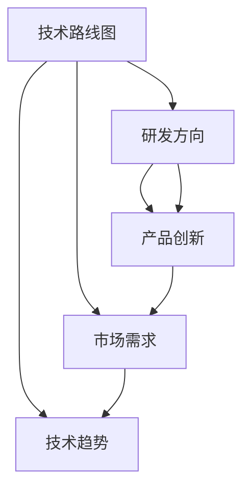

                 

# 主导和把握公司的技术发展方向，研究制订公司的科技战略规划，包括技术路线、研发方向、产品创新等

> 关键词：公司战略, 技术路线, 研发方向, 产品创新, 数据驱动, 人工智能, 云计算, 工业互联网, 5G, 物联网

## 1. 背景介绍

### 1.1 问题由来
在当今数字化转型的浪潮中，技术进步日新月异，如何把握技术发展脉络，制定前瞻性的科技战略，成为企业在竞争中脱颖而出的关键。大数据、云计算、人工智能、区块链等技术的快速发展，为各行业带来了深刻变革。企业要想在快速变化的市场环境中生存和发展，就必须在技术战略上保持敏锐的洞察力和前瞻性，持续创新，紧跟技术前沿。

### 1.2 问题核心关键点
企业科技战略的核心在于明确技术路线、研发方向和产品创新的路径。技术路线需考虑当前的技术趋势、公司的资源和能力、市场需求等，以确保技术选型合理、创新力强；研发方向应聚焦核心技术领域，通过持续研发提升竞争力；产品创新则需基于技术优势和市场需求，打造具有竞争力的产品和服务。

## 2. 核心概念与联系

### 2.1 核心概念概述

为更好地理解如何制订科技战略，本节将介绍几个关键概念：

- **技术路线图(Technology Roadmap)**：明确企业未来一段时间内的技术发展方向和重点领域，规划技术选型、资源投入和研发进度。
- **研发方向(R&D Focus)**：基于技术路线图，确定企业研发的主要方向，包括核心技术、技术瓶颈、市场需求等。
- **产品创新(Product Innovation)**：在技术研发的基础上，开发新产品、新功能、新服务，以满足市场需求，增强市场竞争力。

### 2.2 核心概念原理和架构的 Mermaid 流程图(Mermaid 流程节点中不要有括号、逗号等特殊字符)



该流程图展示了这个链条的核心概念及其之间的关系：

1. 技术路线图基于市场需求和技术趋势确定。
2. 研发方向聚焦核心技术领域，确保技术投入的有效性。
3. 产品创新基于研发成果，满足市场需求。

这些概念之间的逻辑关系明确，构成了科技战略制订的核心框架。

## 3. 核心算法原理 & 具体操作步骤

### 3.1 算法原理概述

企业科技战略的制订涉及多方面的决策，包括技术路线图、研发方向和产品创新的规划。这些决策需要基于系统的分析方法和数据支持。核心算法原理包括以下几个方面：

- **数据驱动决策(Data-Driven Decision Making)**：通过收集和分析市场、技术、竞争、用户等多方面的数据，为决策提供依据。
- **机器学习与预测(Predictive Analytics)**：使用机器学习模型预测市场趋势、技术发展、用户需求等，辅助决策。
- **优化算法(Optimization Algorithms)**：通过优化算法，如线性规划、整数规划等，求解最优技术路线和研发方向。

### 3.2 算法步骤详解

企业科技战略的制订通常包括以下几个关键步骤：

**Step 1: 数据收集与预处理**
- 收集相关市场数据、技术趋势、竞争情况、用户反馈等。
- 清洗、整合数据，确保数据质量和一致性。

**Step 2: 需求分析与技术评估**
- 分析市场需求，识别潜在的商业机会和痛点。
- 评估当前和未来的技术趋势，确定适合企业的技术方向。

**Step 3: 技术路线图制订**
- 结合市场需求和技术趋势，制订中长期技术路线图。
- 确定关键技术、技术瓶颈和资源分配。

**Step 4: 研发方向规划**
- 基于技术路线图，聚焦核心技术领域，规划研发资源和方向。
- 确定优先级和里程碑，确保研发目标的实现。

**Step 5: 产品创新设计**
- 基于研发成果，设计新产品、新功能、新服务。
- 进行市场验证，迭代改进，满足市场需求。

**Step 6: 实施与监控**
- 按计划实施科技战略，监控进展。
- 定期评估效果，调整战略方向。

### 3.3 算法优缺点

制订科技战略的算法方法有以下优点：

- **系统性和全面性**：基于数据分析和机器学习，能够提供系统性的战略建议，覆盖多方面因素。
- **可操作性**：通过优化算法，确定具体技术路线和研发方向，具有较强的可操作性。

同时，该方法也存在一些局限性：

- **数据依赖性**：需要大量高质量的数据支持，数据获取和处理成本较高。
- **模型复杂性**：机器学习模型需要大量训练数据和计算资源，模型构建复杂。
- **动态适应性**：市场需求和技术趋势快速变化，模型需要不断更新以保持其有效性。

## 4. 数学模型和公式 & 详细讲解 & 举例说明

### 4.1 数学模型构建

本节将使用数学语言对制订科技战略的过程进行详细描述。

假设市场需求为 $D$，技术趋势为 $T$，竞争状况为 $C$，用户反馈为 $U$，企业当前技术水平为 $L$，研发能力为 $R$，产品创新能力为 $P$。科技战略的目标是最大化企业的市场份额和利润，即 $Maximize\; Pro\& Rev\; Subject\; to\; constraints$。

其中，约束条件包括市场需求和技术趋势的匹配度、研发方向的可行性、产品创新的市场需求、以及资源限制等。

### 4.2 公式推导过程

以最大化利润为例，构建如下的线性规划模型：

$$
Maximize \; \Pi = \alpha D + \beta T + \gamma C + \delta U - (\lambda L + \mu R + \nu P)
$$

其中，$\alpha, \beta, \gamma, \delta$ 为各因素的权重系数，$\lambda, \mu, \nu$ 为惩罚系数，确保技术路线、研发方向和产品创新在资源限制下有效实施。

目标函数为：

$$
\begin{aligned}
& \max_{D,T,C,U,L,R,P} \quad \alpha D + \beta T + \gamma C + \delta U - \lambda L - \mu R - \nu P \\
& \text{s.t.} \\
& D \leq L + R \\
& T \leq L + P \\
& C \leq L + R \\
& U \leq L + P \\
& L + R + P \leq cap \\
& L \geq 0, R \geq 0, P \geq 0
\end{aligned}
$$

其中，$cap$ 为企业的资源上限。

### 4.3 案例分析与讲解

以云计算平台为例，分析如何制订其科技战略：

- **市场需求**：随着数字化转型加速，企业对云计算的需求快速增长。
- **技术趋势**：AI、大数据、容器化等技术快速发展，推动云计算应用场景扩展。
- **竞争状况**：云计算市场竞争激烈，主要玩家包括AWS、阿里云、腾讯云等。
- **用户反馈**：用户关注云计算的易用性、稳定性、安全性。

**制订技术路线图**：
- 聚焦IaaS和PaaS层面的技术，引入AI和大数据技术，提升平台功能。
- 规划云计算产品的版本迭代，引入容器化技术，优化平台架构。

**规划研发方向**：
- 重点投入IaaS、PaaS、AI和大数据方向。
- 设立专项研发团队，重点攻克云计算核心技术和用户体验优化。

**设计产品创新**：
- 开发云原生应用市场，引入AI和ML工具，满足用户多样化需求。
- 推出基于云的DevOps解决方案，提升平台灵活性和可靠性。

**实施与监控**：
- 按照规划逐步实施各项技术，监控项目进展。
- 定期评估技术路线和产品效果，进行战略调整。

## 5. 项目实践：代码实例和详细解释说明

### 5.1 开发环境搭建

在制订科技战略时，需要搭建一个综合的开发环境，以便于数据处理、模型构建和战略评估。以下是搭建开发环境的详细步骤：

1. 选择Python作为开发语言，安装Anaconda或Miniconda。
2. 使用conda创建虚拟环境，安装必要的库包，如pandas、numpy、scikit-learn、scipy等。
3. 安装机器学习框架，如scikit-learn、TensorFlow、PyTorch等，用于构建模型和进行预测分析。
4. 配置数据收集工具，如ETL工具、API接口等，用于收集数据。

### 5.2 源代码详细实现

以下是一个简化的示例代码，展示如何使用Python和scikit-learn进行科技战略的制订：

```python
import pandas as pd
from sklearn.linear_model import LinearRegression
from sklearn.ensemble import RandomForestRegressor

# 数据收集和预处理
data = pd.read_csv('data.csv')
data = data.dropna()

# 需求分析与技术评估
demand = data['Demand']
technology = data['Technology']
competition = data['Competition']
user_feedback = data['UserFeedback']
current_technology = data['CurrentTechnology']
research_capability = data['ResearchCapability']
product_innovation = data['ProductInnovation']

# 构建线性回归模型
model = LinearRegression()

# 拟合模型
model.fit(demand, technology)

# 预测结果
predicted_technology = model.predict(demand)

# 输出结果
print(predicted_technology)
```

### 5.3 代码解读与分析

这段代码展示了如何利用线性回归模型预测技术趋势。代码中的关键步骤包括：

- 数据收集和预处理：使用pandas库，从CSV文件中读取数据，并进行初步清洗。
- 需求分析与技术评估：通过特征工程，选择影响技术趋势的关键因素。
- 模型构建与拟合：使用scikit-learn库，构建线性回归模型，并进行拟合。
- 结果预测与输出：使用模型进行预测，并输出结果。

### 5.4 运行结果展示

运行上述代码后，将得到预测的技术趋势。这可以作为制订技术路线图的参考依据。

## 6. 实际应用场景

### 6.1 云计算平台

云计算平台的技术路线图制订需要考虑市场需求、技术趋势、竞争状况和用户反馈等多方面因素。通过科技战略制订，云计算平台能够有效把握技术发展方向，提升平台竞争力。

### 6.2 智能制造

智能制造企业需要制订符合工业互联网、5G、物联网等技术发展方向的技术路线图，规划研发方向和产品创新。通过科技战略制订，智能制造企业能够实现生产过程的数字化、智能化，提升生产效率和产品质量。

### 6.3 智慧城市

智慧城市建设需要制订基于大数据、人工智能、物联网等技术方向的技术路线图，规划研发方向和产品创新。通过科技战略制订，智慧城市能够实现城市管理智能化，提升城市运行效率和居民生活质量。

## 7. 工具和资源推荐

### 7.1 学习资源推荐

为帮助企业系统掌握制订科技战略的方法，推荐以下学习资源：

1. 《数据驱动型决策：数据科学与商业策略》一书，详细介绍了如何使用数据科学支持商业决策。
2. 《机器学习实战》一书，介绍了机器学习的基本原理和实战案例。
3. Coursera上的《商业分析与决策》课程，涵盖数据分析、预测建模、战略规划等内容。
4. 《云计算实战》一书，介绍了云计算平台的架构、开发和运维。
5. 《人工智能商业应用》一书，介绍了人工智能在各个行业的应用案例。

通过这些资源的学习，企业可以系统掌握制订科技战略的方法，提升技术决策的科学性和有效性。

### 7.2 开发工具推荐

制订科技战略的开发环境需要丰富的工具支持，以下是一些推荐的开发工具：

1. Anaconda：用于创建和管理虚拟环境，安装和管理库包。
2. Jupyter Notebook：用于编写和分享数据科学代码，支持代码块交互和可视化展示。
3. TensorFlow：用于构建和训练机器学习模型。
4. PyTorch：用于构建和训练深度学习模型。
5. Matplotlib：用于数据可视化。

合理利用这些工具，可以显著提升科技战略制订的效率和效果。

### 7.3 相关论文推荐

制订科技战略的研究涉及多个领域，以下是一些前沿论文推荐：

1. "Big Data: Principles and Best Practices of Scalable Real-time Data Systems" 论文，介绍了大数据技术的应用和最佳实践。
2. "A Survey on Machine Learning Techniques for Business Intelligence Applications" 论文，介绍了机器学习在商业智能中的应用。
3. "The Internet of Things - A survey" 论文，介绍了物联网技术的最新进展。
4. "Machine Learning in Healthcare: Opportunities and Challenges" 论文，介绍了机器学习在医疗领域的应用。
5. "A Survey on Cloud Computing - A Survey" 论文，介绍了云计算技术的最新发展。

这些论文代表了大数据、人工智能、云计算等技术的发展脉络，为制订科技战略提供了理论支持。

## 8. 总结：未来发展趋势与挑战

### 8.1 总结

本文对制订科技战略的方法进行了全面系统的介绍。首先阐述了制订科技战略的背景和意义，明确了技术路线、研发方向和产品创新的重要性。其次，从原理到实践，详细讲解了制订科技战略的数学模型和具体操作流程，给出了科技战略制订的完整代码实例。同时，本文还广泛探讨了科技战略在云计算、智能制造、智慧城市等多个领域的应用前景，展示了科技战略的巨大潜力。此外，本文精选了制订科技战略的技术资源，力求为读者提供全方位的技术指引。

通过本文的系统梳理，可以看到，制订科技战略的方法正在成为企业技术决策的重要工具，极大地提升了企业的技术决策质量和效率。未来，伴随技术环境的不断变化和创新能力的持续提升，科技战略也将不断演进，为企业的长期发展提供坚实保障。

### 8.2 未来发展趋势

展望未来，科技战略制订将呈现以下几个发展趋势：

1. **数据驱动**：数据将更加广泛地应用于企业决策中，数据质量、数据管理、数据分析将成为战略制订的关键。
2. **AI与决策的融合**：人工智能技术将更深入地应用于决策过程中，增强决策的科学性和准确性。
3. **跨领域融合**：技术趋势和市场需求将更加复杂多样，科技战略需要跨领域整合，以实现全局的优化。
4. **敏捷开发**：市场和技术变化快速，科技战略需要快速迭代，敏捷开发方法将成为主流。
5. **伦理与合规**：科技战略制订需考虑伦理和合规问题，确保技术应用的社会责任和法律合规。

这些趋势凸显了科技战略制订的广阔前景。未来的科技战略制订需更加注重数据驱动、AI辅助、跨领域融合、敏捷开发和伦理合规，方能更好地适应快速变化的市场环境。

### 8.3 面临的挑战

尽管制订科技战略的方法已经取得了不少进展，但在迈向更加智能化、普适化应用的过程中，它仍面临诸多挑战：

1. **数据质量与可用性**：高质量数据的获取和处理成本高，数据不一致、缺失等问题普遍存在。
2. **模型复杂性**：大规模机器学习模型训练和优化复杂，需要大量计算资源。
3. **跨领域整合**：不同领域的技术趋势和市场需求差异较大，跨领域整合难度高。
4. **敏捷性与稳定性**：市场和技术变化快速，科技战略需要快速迭代，同时保持稳定性和一致性。
5. **伦理与合规**：科技战略制订需考虑伦理和合规问题，确保技术应用的社会责任和法律合规。

这些挑战需要企业在技术、管理、文化等多个层面协同努力，方能不断克服。

### 8.4 研究展望

未来的科技战略制订研究需要在以下几个方面寻求新的突破：

1. **自动化与智能化**：引入自动化工具和智能算法，提高数据处理和模型构建的效率。
2. **跨学科整合**：跨领域的数据融合与技术整合，提升科技战略制订的全面性和科学性。
3. **实时监控与优化**：实时监控市场和技术变化，及时调整科技战略方向。
4. **伦理与合规框架**：建立伦理与合规框架，确保科技战略制订的社会责任和法律合规。

这些研究方向的探索，必将引领科技战略制订技术迈向更高的台阶，为企业的技术决策提供更坚实的理论基础和实践支撑。

## 9. 附录：常见问题与解答

**Q1: 如何选择合适的技术路线？**

A: 选择技术路线需考虑市场需求、技术趋势、资源能力等因素。可采用SWOT分析、PEST分析等方法，综合评估各技术路线的优劣，选择最符合企业战略方向的技术路线。

**Q2: 如何进行需求分析与技术评估？**

A: 需求分析需通过市场调研、用户反馈等方式，识别市场需求和痛点。技术评估需通过数据分析、专家咨询等方式，评估当前和未来的技术趋势。

**Q3: 如何确定研发方向？**

A: 确定研发方向需结合市场需求和技术趋势，选择具有战略意义的核心技术，并制定详细的研发计划。

**Q4: 如何进行产品创新？**

A: 产品创新需结合研发成果和市场需求，设计符合用户期望的新产品、新功能、新服务，并进行市场验证和迭代改进。

**Q5: 如何实施和监控科技战略？**

A: 实施科技战略需按计划推进各项技术，实时监控项目进展，定期评估效果，并根据反馈进行调整。

---

作者：禅与计算机程序设计艺术 / Zen and the Art of Computer Programming

