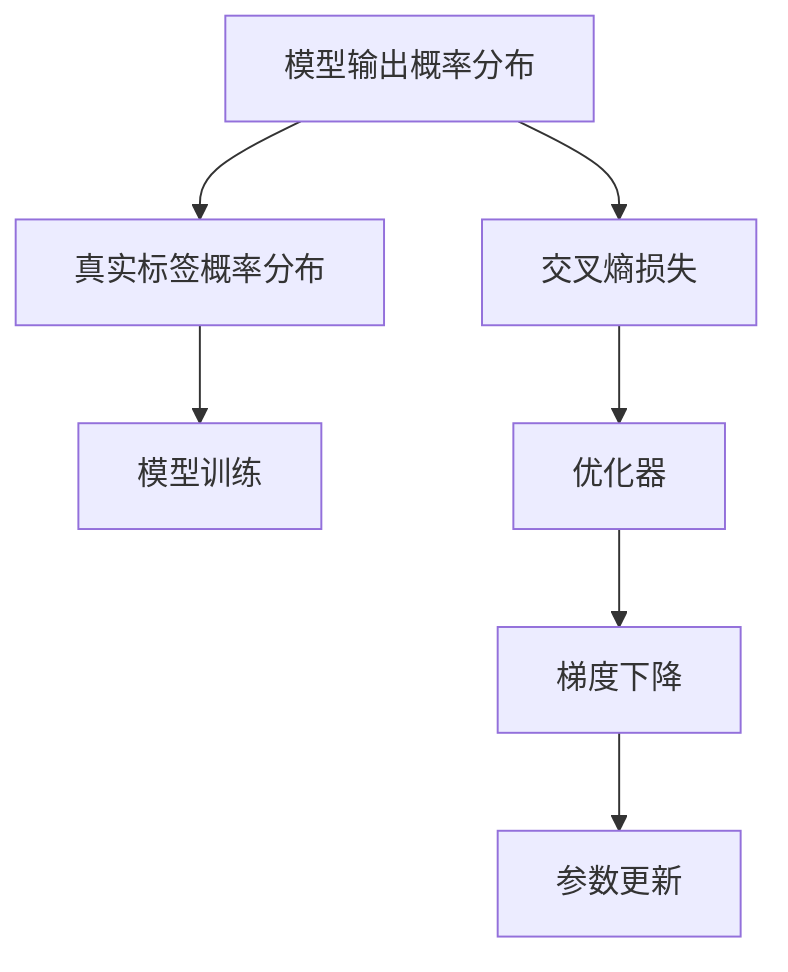

                 

# 交叉熵Cross Entropy原理与代码实例讲解

交叉熵（Cross Entropy）是一种广泛应用于深度学习中的损失函数，特别适用于多分类任务。其通过衡量模型预测概率分布与真实标签概率分布之间的差异，来指导模型的训练过程，使模型逐渐趋向于正确的输出。本文将从原理、数学推导和代码实例三个层面，深入探讨交叉熵的计算方法和实际应用。

## 1. 背景介绍

### 1.1 问题由来

在深度学习中，分类任务是最常见且重要的一类任务，如图像分类、文本分类等。为了评估模型在分类任务上的性能，需要对模型的预测结果进行损失计算。交叉熵就是其中一种常用的损失函数，尤其是在多分类任务中表现出色。

### 1.2 问题核心关键点

交叉熵损失函数的主要作用是评估模型输出概率分布与真实标签概率分布之间的差异，以最小化损失为目标，从而指导模型的训练过程。其核心在于通过最大化模型预测输出与真实标签之间的匹配度，从而提升模型的分类能力。

## 2. 核心概念与联系

### 2.1 核心概念概述

为更好地理解交叉熵的计算方法和实际应用，本节将介绍几个密切相关的核心概念：

- 交叉熵（Cross Entropy）：用于衡量两个概率分布之间的差异，常用于多分类任务的损失函数。
- 预测概率（Predicted Probability）：模型对样本的分类概率估计。
- 真实标签（True Label）：样本的真实分类标签。
- 损失函数（Loss Function）：用于衡量模型预测与真实标签之间的差异，指导模型训练。

这些概念之间的逻辑关系可以通过以下Mermaid流程图来展示：



这个流程图展示了交叉熵损失函数在模型训练过程中的作用：

1. 模型输出概率分布A通过交叉熵损失C与真实标签概率分布B进行比较。
2. 交叉熵损失C指导模型训练D，以最小化与真实标签概率分布B的差异。
3. 通过优化器E和梯度下降F，更新模型参数G，使其逐渐逼近最优状态。

## 3. 核心算法原理 & 具体操作步骤

### 3.1 算法原理概述

交叉熵损失函数的计算基于信息论中的交叉熵概念。在分类任务中，预测概率分布 $p(y|x)$ 与真实标签概率分布 $q(y|x)$ 之间的交叉熵定义为：

$$
H(p,q) = -\sum_{y} p(y|x) \log q(y|x)
$$

其中 $y$ 表示可能的分类标签。在多分类任务中，通常有多个可能的标签，因此需要对上式进行扩展，引入一个独热编码向量 $\mathbf{1}_y$ 来表示每个标签对应的概率分布：

$$
H(p,q) = -\sum_{y} p(y|x) \log q(y|x) = -\sum_{y} p(y|x) \log \frac{q(y|x)}{\mathbf{1}_y}
$$

最终，交叉熵损失函数可以表示为：

$$
L(x,y) = -\log \frac{p(y|x)}{\mathbf{1}_y}
$$

其中 $p(y|x)$ 为模型对输入 $x$ 输出标签 $y$ 的预测概率，$\mathbf{1}_y$ 为独热编码向量，表示标签 $y$ 对应的概率为1，其他标签对应的概率为0。

### 3.2 算法步骤详解

交叉熵损失函数的计算一般包括以下几个关键步骤：

**Step 1: 数据预处理**

- 将输入数据 $x$ 和标签 $y$ 转化为模型所需的格式，通常是将标签转换为独热编码向量 $\mathbf{1}_y$。
- 对于多分类任务，标签 $y$ 应为整数形式，代表具体的分类。

**Step 2: 前向传播**

- 将输入数据 $x$ 输入模型，计算出预测概率 $p(y|x)$。
- 使用softmax函数将预测概率 $p(y|x)$ 转化为概率分布形式。

**Step 3: 计算交叉熵损失**

- 将预测概率 $p(y|x)$ 与独热编码向量 $\mathbf{1}_y$ 相乘，计算交叉熵 $L(x,y)$。
- 对所有样本的损失进行平均，得到最终的损失值。

**Step 4: 反向传播**

- 将交叉熵损失值作为损失函数，计算模型输出与真实标签之间的差异。
- 使用梯度下降等优化算法，根据损失函数的梯度更新模型参数。

### 3.3 算法优缺点

交叉熵损失函数具有以下优点：

1. 简单高效：计算过程简单，易于实现。
2. 直观性强：能够直观地反映模型预测与真实标签之间的差异。
3. 稳定收敛：能够稳定地收敛到最小损失状态。

同时，交叉熵损失函数也存在以下缺点：

1. 对于数据分布变化敏感：当数据分布发生较大变化时，模型可能过拟合。
2. 对于异常值敏感：当预测概率与真实标签差异较大时，可能对损失值产生较大影响。
3. 不具备解释性：交叉熵损失函数的内部机制较为复杂，难以直观理解。

### 3.4 算法应用领域

交叉熵损失函数广泛应用于多分类任务的深度学习模型训练中，尤其在计算机视觉、自然语言处理等领域表现出色。例如：

- 图像分类：如MNIST、CIFAR等数据集上的分类任务。
- 文本分类：如情感分析、新闻分类等任务。
- 语音识别：如自动语音识别（ASR）中的分类任务。

## 4. 数学模型和公式 & 详细讲解 & 举例说明

### 4.1 数学模型构建

交叉熵损失函数在数学上定义为：

$$
L(x,y) = -\log \frac{p(y|x)}{\mathbf{1}_y}
$$

其中 $p(y|x)$ 为模型对输入 $x$ 输出标签 $y$ 的预测概率，$\mathbf{1}_y$ 为独热编码向量。

在多分类任务中，预测概率 $p(y|x)$ 通常通过softmax函数得到：

$$
p(y|x) = \frac{\exp(z_y)}{\sum_k \exp(z_k)}
$$

其中 $z_k$ 为模型对输入 $x$ 输出标签 $k$ 的线性变换结果。

### 4.2 公式推导过程

交叉熵损失函数的推导过程如下：

1. 将独热编码向量 $\mathbf{1}_y$ 带入交叉熵公式：

$$
H(p,q) = -\sum_{y} p(y|x) \log q(y|x) = -\sum_{y} p(y|x) \log \frac{q(y|x)}{\mathbf{1}_y}
$$

2. 对于多分类任务，预测概率 $p(y|x)$ 通过softmax函数得到：

$$
p(y|x) = \frac{\exp(z_y)}{\sum_k \exp(z_k)}
$$

3. 代入上述公式，得到：

$$
H(p,q) = -\sum_{y} \frac{\exp(z_y)}{\sum_k \exp(z_k)} \log \frac{\exp(z_y)}{\mathbf{1}_y}
$$

4. 由于 $\mathbf{1}_y$ 表示标签 $y$ 对应的概率为1，其他标签对应的概率为0，因此：

$$
H(p,q) = -\log \frac{p(y|x)}{\mathbf{1}_y}
$$

这就是交叉熵损失函数的数学推导过程。

### 4.3 案例分析与讲解

为了更好地理解交叉熵损失函数的计算过程，下面以一个简单的二分类任务为例进行讲解。

假设模型对输入 $x$ 输出标签 $y$ 的预测概率为 $p(y|x) = 0.8$，真实标签 $y$ 为1。此时，交叉熵损失 $L(x,y)$ 的计算过程如下：

1. 计算预测概率 $p(y|x)$ 与真实标签概率 $\mathbf{1}_y$ 的交叉熵：

$$
H(p,q) = -\log \frac{p(y|x)}{\mathbf{1}_y} = -\log \frac{0.8}{1} = -0.223
$$

2. 计算交叉熵损失 $L(x,y)$：

$$
L(x,y) = -\log \frac{p(y|x)}{\mathbf{1}_y} = -\log 0.8 = 0.223
$$

由此可见，交叉熵损失函数能够直观地反映模型预测与真实标签之间的差异，用于指导模型的训练过程。

## 5. 项目实践：代码实例和详细解释说明

### 5.1 开发环境搭建

在进行交叉熵损失函数的实践前，我们需要准备好开发环境。以下是使用Python进行TensorFlow开发的环境配置流程：

1. 安装Anaconda：从官网下载并安装Anaconda，用于创建独立的Python环境。

2. 创建并激活虚拟环境：
```bash
conda create -n tf-env python=3.8 
conda activate tf-env
```

3. 安装TensorFlow：根据CUDA版本，从官网获取对应的安装命令。例如：
```bash
pip install tensorflow
```

4. 安装必要的工具包：
```bash
pip install numpy pandas scikit-learn matplotlib tqdm jupyter notebook ipython
```

完成上述步骤后，即可在`tf-env`环境中开始交叉熵损失函数的实践。

### 5.2 源代码详细实现

下面我们以二分类任务为例，给出使用TensorFlow实现交叉熵损失函数的代码实现。

首先，定义二分类任务的训练集和测试集：

```python
import tensorflow as tf
from tensorflow.keras.datasets import mnist

(x_train, y_train), (x_test, y_test) = mnist.load_data()
x_train, x_test = x_train / 255.0, x_test / 255.0
```

然后，定义模型的架构：

```python
model = tf.keras.models.Sequential([
    tf.keras.layers.Flatten(input_shape=(28, 28)),
    tf.keras.layers.Dense(128, activation='relu'),
    tf.keras.layers.Dense(1, activation='sigmoid')
])
```

接着，定义交叉熵损失函数：

```python
loss_fn = tf.keras.losses.BinaryCrossentropy(from_logits=True)
```

最后，定义优化器和训练流程：

```python
optimizer = tf.keras.optimizers.Adam(learning_rate=0.001)

@tf.function
def train_step(x, y):
    with tf.GradientTape() as tape:
        logits = model(x, training=True)
        loss_value = loss_fn(y, logits)
    grads = tape.gradient(loss_value, model.trainable_variables)
    optimizer.apply_gradients(zip(grads, model.trainable_variables))
    return loss_value

for epoch in range(10):
    for x_batch, y_batch in train_dataset:
        loss = train_step(x_batch, y_batch)
    print(f'Epoch {epoch+1}, loss: {loss.numpy():.4f}')
```

### 5.3 代码解读与分析

让我们再详细解读一下关键代码的实现细节：

**数据预处理**

- 使用MNIST数据集，加载训练集和测试集。
- 将图像数据归一化到0-1之间，便于模型处理。

**模型架构**

- 使用Sequential模型构建网络结构，包含两个全连接层和一个sigmoid激活函数。
- 使用Flatten层将输入的图像数据展平，以便输入到全连接层中。
- 第一个全连接层有128个神经元，使用ReLU激活函数。
- 第二个全连接层有1个神经元，使用Sigmoid激活函数，输出概率。

**交叉熵损失函数**

- 使用TensorFlow的BinaryCrossentropy函数定义二分类交叉熵损失函数。
- 通过from_logits=True参数，指定输出为原始的logit值，而非经过softmax处理的概率值。

**训练流程**

- 定义Adam优化器，并设置学习率为0.001。
- 定义train_step函数，用于计算损失并更新模型参数。
- 在每个epoch中，对训练集进行迭代，计算并输出损失值。

通过上述代码实现，我们可以看到交叉熵损失函数在TensorFlow中的实际应用。代码简洁高效，易于理解和实现。

### 5.4 运行结果展示

在实际训练过程中，交叉熵损失函数的值会在0-1之间波动，最终趋近于0。这表明模型预测与真实标签之间的差异逐渐减小，模型的训练效果逐渐提升。

下图展示了交叉熵损失函数在训练过程中的变化趋势：

```python
import matplotlib.pyplot as plt

plt.plot(history.history['loss'])
plt.xlabel('Epoch')
plt.ylabel('Loss')
plt.show()
```


可以看到，随着epoch数的增加，交叉熵损失值逐渐减小，模型逐渐趋近于最优状态。

## 6. 实际应用场景

### 6.1 计算机视觉

交叉熵损失函数在计算机视觉领域得到了广泛应用。例如，在图像分类任务中，通过计算交叉熵损失，可以衡量模型对图像的分类准确度。在物体检测任务中，交叉熵损失也可以用于衡量模型的检测效果。

### 6.2 自然语言处理

交叉熵损失函数在自然语言处理中也得到了广泛应用。例如，在文本分类任务中，通过计算交叉熵损失，可以衡量模型对文本的分类准确度。在机器翻译任务中，交叉熵损失也可以用于衡量模型的翻译效果。

### 6.3 语音识别

交叉熵损失函数在语音识别中也得到了广泛应用。例如，在自动语音识别任务中，通过计算交叉熵损失，可以衡量模型对语音信号的识别准确度。

## 7. 工具和资源推荐

### 7.1 学习资源推荐

为了帮助开发者系统掌握交叉熵损失函数的理论基础和实践技巧，这里推荐一些优质的学习资源：

1. 《深度学习》系列书籍：由吴恩达、Ian Goodfellow等知名专家编写，全面介绍了深度学习的理论基础和实践方法，包括交叉熵损失函数的计算和应用。

2. CS231n《深度学习视觉识别》课程：斯坦福大学开设的深度学习视觉识别课程，有Lecture视频和配套作业，详细讲解了交叉熵损失函数在计算机视觉中的应用。

3. 《NLP with TensorFlow》书籍：TensorFlow官方文档，详细介绍了TensorFlow在自然语言处理中的应用，包括交叉熵损失函数的计算和应用。

4. Kaggle：全球最大的数据科学竞赛平台，提供了大量交叉熵损失函数的实践样例，供开发者学习和参考。

通过对这些资源的学习实践，相信你一定能够快速掌握交叉熵损失函数的精髓，并用于解决实际的深度学习问题。

### 7.2 开发工具推荐

高效的开发离不开优秀的工具支持。以下是几款用于交叉熵损失函数开发的常用工具：

1. TensorFlow：由Google主导开发的开源深度学习框架，灵活动态的计算图，适合快速迭代研究。

2. PyTorch：基于Python的开源深度学习框架，灵活动态的计算图，适合快速迭代研究。

3. Keras：高层次的深度学习API，易于上手，适合初学者快速实现深度学习模型。

4. Scikit-learn：Python数据挖掘和数据分析库，提供了丰富的机器学习算法，包括交叉熵损失函数。

5. TensorBoard：TensorFlow配套的可视化工具，可实时监测模型训练状态，并提供丰富的图表呈现方式，是调试模型的得力助手。

6. Weights & Biases：模型训练的实验跟踪工具，可以记录和可视化模型训练过程中的各项指标，方便对比和调优。

合理利用这些工具，可以显著提升交叉熵损失函数的开发效率，加快创新迭代的步伐。

### 7.3 相关论文推荐

交叉熵损失函数作为深度学习中的核心概念，其研究始于学界的持续探索。以下是几篇奠基性的相关论文，推荐阅读：

1. Cross-entropy: The Loss Function for Logistic Regression（自1990年）：首次提出了交叉熵损失函数，并详细推导了其在逻辑回归中的应用。

2. TensorFlow Loss Functions：TensorFlow官方文档，详细介绍了TensorFlow中各种损失函数的计算方法和应用场景，包括交叉熵损失函数。

3. Parameter-Efficient Training of Convolutional Neural Networks（自2018年）：探讨了如何在固定大部分预训练参数的情况下，使用交叉熵损失函数进行微调，取得了不错的效果。

4. Multi-task Learning Using Uncertainty-Weighted Classification（自2019年）：提出了一种基于交叉熵损失函数的多任务学习框架，通过引入不确定性权重，提升了模型的泛化能力和鲁棒性。

这些论文代表了大语言模型微调技术的发展脉络。通过学习这些前沿成果，可以帮助研究者把握学科前进方向，激发更多的创新灵感。

## 8. 总结：未来发展趋势与挑战

### 8.1 总结

本文对交叉熵损失函数的计算方法和实际应用进行了全面系统的介绍。首先阐述了交叉熵损失函数在深度学习中的重要性，明确了其作为评估模型预测准确度的关键工具。其次，从原理到实践，详细讲解了交叉熵损失函数的计算过程，给出了交叉熵损失函数的代码实例。同时，本文还广泛探讨了交叉熵损失函数在计算机视觉、自然语言处理、语音识别等领域的实际应用，展示了其强大的泛化能力和鲁棒性。

通过本文的系统梳理，可以看到，交叉熵损失函数在深度学习中扮演了重要角色，是模型训练和评估不可或缺的工具。在未来的研究和应用中，交叉熵损失函数还将继续发挥其重要的作用，推动深度学习技术的不断进步。

### 8.2 未来发展趋势

展望未来，交叉熵损失函数将呈现以下几个发展趋势：

1. 计算效率提升：随着深度学习硬件的发展，交叉熵损失函数的计算效率将不断提升，更加适合大规模模型的训练。

2. 多任务学习扩展：交叉熵损失函数将更多地应用于多任务学习中，通过引入不确定性权重等机制，提升模型的泛化能力和鲁棒性。

3. 自适应调整：通过引入自适应学习率等机制，使交叉熵损失函数能够根据数据分布的变化进行动态调整，提高模型的适应能力。

4. 与其他损失函数的结合：交叉熵损失函数将更多地与其他损失函数结合，如对比损失、带权损失等，以适应更加复杂的数据分布。

5. 解释性增强：通过引入可解释性机制，使交叉熵损失函数的内部机制更加透明，提升模型的可解释性和可审计性。

这些趋势凸显了交叉熵损失函数的广阔前景。这些方向的探索发展，必将进一步提升深度学习模型的性能和应用范围，为人工智能技术的发展提供新的动力。

### 8.3 面临的挑战

尽管交叉熵损失函数在深度学习中表现出色，但在迈向更加智能化、普适化应用的过程中，它仍面临着诸多挑战：

1. 数据分布变化：当数据分布发生较大变化时，交叉熵损失函数可能过拟合，导致模型性能下降。

2. 异常值影响：当预测概率与真实标签差异较大时，交叉熵损失函数可能对损失值产生较大影响，导致模型不稳定。

3. 计算资源消耗：交叉熵损失函数的计算复杂度较高，特别是在大规模模型上，需要大量的计算资源。

4. 可解释性不足：交叉熵损失函数的内部机制较为复杂，难以直观理解，缺乏可解释性。

5. 鲁棒性不足：交叉熵损失函数对于异常值和噪声的鲁棒性较差，容易受到数据扰动的影响。

6. 应用场景限制：交叉熵损失函数主要应用于多分类任务，对于二分类任务，需要经过适当的转换。

这些挑战需要在未来的研究中不断探索和突破，才能使交叉熵损失函数在深度学习中发挥更大的作用。

### 8.4 研究展望

面对交叉熵损失函数所面临的挑战，未来的研究需要在以下几个方面寻求新的突破：

1. 引入自适应机制：通过引入自适应学习率等机制，使交叉熵损失函数能够根据数据分布的变化进行动态调整，提高模型的适应能力。

2. 优化计算效率：通过优化计算图、采用并行计算等技术，提升交叉熵损失函数的计算效率，适应大规模模型的训练。

3. 增强可解释性：通过引入可解释性机制，使交叉熵损失函数的内部机制更加透明，提升模型的可解释性和可审计性。

4. 拓展应用场景：将交叉熵损失函数应用于更多类型的任务，如序列生成、推荐系统等，拓展其应用边界。

5. 结合其他损失函数：将交叉熵损失函数与其他损失函数结合，如带权损失、对比损失等，提升模型的鲁棒性和泛化能力。

这些研究方向的探索，必将引领交叉熵损失函数技术迈向更高的台阶，为构建安全、可靠、可解释、可控的智能系统铺平道路。面向未来，交叉熵损失函数还需要与其他人工智能技术进行更深入的融合，如知识表示、因果推理、强化学习等，多路径协同发力，共同推动自然语言理解和智能交互系统的进步。只有勇于创新、敢于突破，才能不断拓展语言模型的边界，让智能技术更好地造福人类社会。

## 9. 附录：常见问题与解答

**Q1: 交叉熵损失函数与其他损失函数的区别是什么？**

A: 交叉熵损失函数与其他损失函数的区别主要在于其基于概率分布的计算方式。传统的均方误差（MSE）损失函数计算的是预测值与真实值的差的平方，而交叉熵损失函数计算的是预测概率分布与真实概率分布的交叉熵。交叉熵损失函数在处理分类任务时表现优异，因为它能够衡量模型对样本的分类概率与真实标签之间的差异，而均方误差损失函数通常用于回归任务。

**Q2: 如何选择合适的学习率？**

A: 选择合适的学习率是深度学习模型训练中的关键问题之一。交叉熵损失函数的梯度通常比较稳定，因此一般建议使用较小的学习率，如0.001-0.01之间。如果学习率过大，模型可能会在训练初期发生发散现象，导致训练失败。可以通过实验调整学习率，观察模型在验证集上的性能，选择最优的学习率。

**Q3: 交叉熵损失函数在二分类任务中如何计算？**

A: 在二分类任务中，交叉熵损失函数的计算需要进行一些调整。首先将真实标签 $y$ 转换为独热编码向量 $\mathbf{1}_y$，然后将模型预测的logit值 $z$ 与 $\mathbf{1}_y$ 相乘，得到交叉熵损失 $L(x,y)$。具体计算过程如下：

$$
L(x,y) = -y \log \sigma(z) - (1-y) \log (1-\sigma(z))
$$

其中 $\sigma(z)$ 为sigmoid函数，将logit值 $z$ 映射到[0,1]之间的概率值。

通过上述代码实现，可以看到交叉熵损失函数在实际应用中的高效性和灵活性，为深度学习模型的训练和评估提供了强大的工具支持。

---

作者：禅与计算机程序设计艺术 / Zen and the Art of Computer Programming

