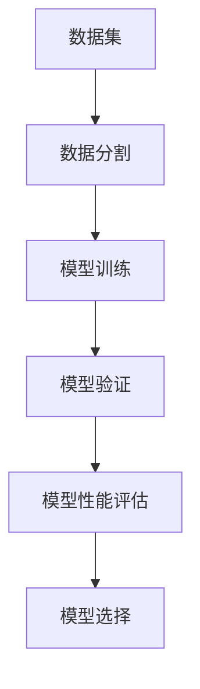

                 

## 1. 背景介绍

### 1.1 问题由来

交叉验证(Cross-Validation, CV)是机器学习领域中一种重要的模型评估和调优技术。由于机器学习模型通常具有高复杂度和过拟合倾向，仅使用训练集和验证集进行评估和选择，可能无法准确反映模型的泛化性能。交叉验证通过构建多个训练和验证子集，多次重复训练和评估模型，在减少数据和模型参数过拟合的同时，也能更全面地评估模型在不同数据子集上的表现。

交叉验证方法最早由W.S. Durbin提出，并在统计学和机器学习中广泛应用。近年来，随着深度学习模型的流行，交叉验证也成为了训练、评估深度神经网络的重要技术手段之一。

### 1.2 问题核心关键点

交叉验证的核心思想是通过多次分割数据集，利用未用于模型训练的数据子集进行验证和调优，以此评估模型的泛化能力。常见的方法包括k折交叉验证(K-Fold CV)、留一法(Leave-One-Out CV, LOOCV)等。

交叉验证的三个主要步骤包括：
1. **数据分割**：将数据集分为训练集和验证集。
2. **模型训练和验证**：对训练集进行多次训练和验证，每次使用不同的验证集。
3. **性能评估**：计算模型在各个验证集上的性能指标，并取平均值，评估模型的泛化能力。

交叉验证的优点包括：
- 减少数据和模型参数过拟合的风险。
- 更全面地评估模型泛化性能。
- 提供更加稳健的模型选择依据。

## 2. 核心概念与联系

### 2.1 核心概念概述

为更好地理解交叉验证的原理和流程，本节将介绍几个关键概念：

- **模型训练**：使用训练数据对模型进行参数学习，使得模型能够拟合训练数据。
- **模型验证**：使用验证数据对训练后的模型进行评估，衡量模型在未见过的数据上的泛化性能。
- **过拟合**：模型在训练集上表现很好，但在验证集或测试集上表现较差的现象。
- **泛化性能**：模型在新数据上的预测准确性。
- **交叉验证**：通过多次分割数据集，利用未用于模型训练的数据子集进行验证和调优，以此评估模型的泛化能力。

这些核心概念之间的逻辑关系可以通过以下Mermaid流程图来展示：



这个流程图展示了交叉验证的核心流程：
1. 将数据集分割为训练集和验证集。
2. 对训练集进行多次训练和验证。
3. 根据验证集上的表现选择最优模型。

## 3. 核心算法原理 & 具体操作步骤

### 3.1 算法原理概述

交叉验证的数学原理相对简单，主要基于统计学的假设检验和模型评估理论。假设数据集$D$被分割成$n$个互不重叠的子集，其中$n-1$个子集作为训练集，1个子集作为验证集。通过多次重复训练和验证过程，最终得到模型在各个验证集上的性能指标的平均值，用于评估模型的泛化能力。

假设数据集$D$被分成$k$个互不重叠的子集$D_1, D_2, ..., D_k$，其中$D_i$是第$i$个训练集，$D_{k+1}$是验证集。交叉验证的过程如下：
1. 对每个$D_i$进行模型训练，得到模型$M_i$。
2. 对每个$D_i$进行模型验证，记录性能指标（如准确率、F1分数等）。
3. 重复第1和第2步$k$次，得到$k$个模型性能指标。
4. 计算性能指标的平均值，作为模型的最终评估指标。

### 3.2 算法步骤详解

以下将详细介绍k折交叉验证的具体操作步骤：

1. **数据分割**：将数据集$D$随机分成$k$个子集$D_1, D_2, ..., D_k$。

2. **模型训练和验证**：
   - 选择其中一个子集$D_j$作为验证集，剩余的$D_1, D_2, ..., D_{j-1}, D_{j+1}, ..., D_k$作为训练集。
   - 在训练集上训练模型$M$。
   - 在验证集$D_j$上验证模型$M$。

3. **性能评估**：
   - 重复上述步骤$k$次，每次选择不同的$D_j$作为验证集。
   - 计算每次验证的性能指标，并取平均值作为模型$M$的泛化性能指标。

4. **模型选择**：
   - 根据模型在各个验证集上的性能指标，选择泛化性能最优的模型。

## 3.3 算法优缺点

### 3.3.1 优点

交叉验证的主要优点包括：
- **减少过拟合**：由于每次使用不同的验证集，可以减少模型对特定数据子集的过拟合。
- **更全面评估**：通过多次分割和验证，更全面地评估模型在不同数据子集上的泛化性能。
- **稳健选择**：交叉验证提供的性能指标更加稳健，减少了随机因素的影响，提供更可靠的模型选择依据。

### 3.3.2 缺点

交叉验证的主要缺点包括：
- **计算复杂度高**：交叉验证需要进行多次分割和训练，增加了计算复杂度。
- **数据消耗多**：每个数据子集都要进行一次验证，对数据消耗较多。
- **可能产生偏差**：当数据集分割不均匀时，某些数据子集可能被用作验证集的次数较多，导致偏差。

## 3.4 算法应用领域

交叉验证广泛应用于机器学习领域的模型评估和选择。在深度学习模型中，交叉验证也常用于：

- **超参数调优**：利用交叉验证评估不同超参数组合的效果，选择最优的超参数。
- **模型融合**：利用交叉验证评估多个模型的效果，选择性能最优的模型进行融合。
- **公平性评估**：利用交叉验证评估模型在不同数据子集上的公平性，避免模型偏差。
- **异常检测**：利用交叉验证评估模型对异常数据的识别能力。
- **时间序列分析**：利用交叉验证评估模型在不同时间段上的表现。

## 4. 数学模型和公式 & 详细讲解 & 举例说明

### 4.1 数学模型构建

假设数据集$D$包含$m$个样本$x_i$，$i=1,...,m$，每个样本包含$n$个特征。设模型$M$的预测输出为$y_i$。交叉验证的数学模型如下：

$$
\begin{aligned}
\mathcal{L}(D,M) &= \frac{1}{k}\sum_{j=1}^{k} \mathcal{L}(D_j \backslash D_j,M) \\
&= \frac{1}{k}\sum_{j=1}^{k} \frac{1}{|D_j \backslash D_j|} \sum_{i \in D_j \backslash D_j} \ell(y_i, M(x_i))
\end{aligned}
$$

其中，$\ell$为损失函数，$D_j \backslash D_j$表示从数据集$D_j$中排除自身，得到$k-1$个子集，分别作为训练集和验证集。

### 4.2 公式推导过程

交叉验证的数学推导相对简单，主要基于平均损失函数的定义。假设数据集$D$被分为$k$个子集$D_1, D_2, ..., D_k$，其中$D_i$是第$i$个训练集，$D_{k+1}$是验证集。每次使用$D_j$作为验证集，其余$k-1$个子集作为训练集，计算模型的平均损失：

$$
\mathcal{L}(D,M) = \frac{1}{k}\sum_{j=1}^{k} \frac{1}{|D_j|} \sum_{i \in D_j} \ell(y_i, M(x_i))
$$

其中，$|D_j|$表示$D_j$中样本的数量。通过多次分割和训练，最终得到模型在各个验证集上的性能指标的平均值。

### 4.3 案例分析与讲解

假设有一个二分类问题，数据集$D$包含1000个样本，每个样本有10个特征。使用5折交叉验证对模型$M$进行评估。

1. 将数据集$D$随机分成5个子集$D_1, D_2, D_3, D_4, D_5$，每个子集包含200个样本。
2. 选择$D_1$作为验证集，$D_2, D_3, D_4, D_5$作为训练集，对模型$M$进行训练和验证。
3. 记录$M$在$D_1$上的准确率$R_1$。
4. 重复步骤2和3，每次选择不同的子集作为验证集，共5次。
5. 计算准确率$R_1, R_2, R_3, R_4, R_5$的平均值，作为模型$M$的最终泛化性能指标。

例如，假设$R_1, R_2, R_3, R_4, R_5$分别为0.85, 0.82, 0.88, 0.81, 0.86。则模型$M$的平均准确率为：

$$
\bar{R} = \frac{1}{5} \sum_{i=1}^{5} R_i = \frac{1}{5} (0.85 + 0.82 + 0.88 + 0.81 + 0.86) = 0.847
$$

## 5. 项目实践：代码实例和详细解释说明

### 5.1 开发环境搭建

在进行交叉验证实践前，我们需要准备好开发环境。以下是使用Python进行Scikit-learn开发的环境配置流程：

1. 安装Anaconda：从官网下载并安装Anaconda，用于创建独立的Python环境。

2. 创建并激活虚拟环境：
```bash
conda create -n sklearn-env python=3.8 
conda activate sklearn-env
```

3. 安装Scikit-learn：
```bash
pip install scikit-learn
```

4. 安装各类工具包：
```bash
pip install numpy pandas matplotlib scikit-learn
```

完成上述步骤后，即可在`sklearn-env`环境中开始交叉验证实践。

### 5.2 源代码详细实现

下面以鸢尾花数据集为例，给出使用Scikit-learn进行5折交叉验证的Python代码实现。

```python
from sklearn.model_selection import cross_val_score
from sklearn.datasets import load_iris
from sklearn.tree import DecisionTreeClassifier
from sklearn.metrics import accuracy_score

# 加载鸢尾花数据集
iris = load_iris()
X = iris.data
y = iris.target

# 创建决策树分类器
clf = DecisionTreeClassifier()

# 进行5折交叉验证
scores = cross_val_score(clf, X, y, cv=5, scoring='accuracy')

# 输出交叉验证结果
print('交叉验证结果：', scores)
print('平均准确率：', scores.mean())
```

### 5.3 代码解读与分析

让我们再详细解读一下关键代码的实现细节：

1. **cross_val_score函数**：
   - `cross_val_score`是Scikit-learn提供的交叉验证函数，用于评估模型在多个数据子集上的性能。
   - 参数`clf`为待评估的模型，`X`为特征矩阵，`y`为目标向量，`cv`为交叉验证折数。
   - `scoring`参数指定性能评估指标，如`'accuracy'`表示准确率。

2. **模型训练和验证**：
   - 在每次交叉验证中，模型`clf`在训练集上进行训练，并在验证集上进行验证。
   - `scores`变量存储了每个验证集上的性能指标。

3. **性能评估**：
   - `scores.mean()`计算了所有验证集上的性能指标的平均值。
   - 根据平均值，可以评估模型在不同数据子集上的泛化性能。

4. **代码输出**：
   - `print(scores)`输出每次交叉验证的性能指标。
   - `print(scores.mean())`输出模型的平均性能指标。

## 6. 实际应用场景

### 6.1 金融风险评估

在金融领域，交叉验证常用于评估信用评分模型的风险预测能力。假设有一家银行，收集了历史贷款数据，包括客户的基本信息、收入、信用记录等。使用交叉验证对信用评分模型进行评估，可以发现模型在不同客户群体上的表现是否一致，是否存在数据偏见。

具体而言，可以将历史数据分为训练集和验证集，对模型进行训练和验证。通过多次分割和验证，计算模型在不同客户群体上的准确率和召回率，评估模型的公平性和泛化性能。如果模型在特定客户群体上的表现明显优于其他群体，则需要进行调整，以避免数据偏见。

### 6.2 医疗疾病诊断

在医疗领域，交叉验证常用于评估医学影像分类模型的性能。假设有一家医院，收集了大量的医学影像数据，包括胸片、CT扫描等，每个影像包含多个特征。使用交叉验证对医学影像分类模型进行评估，可以发现模型在不同疾病类型上的表现是否一致，是否存在过拟合现象。

具体而言，可以将影像数据分为训练集和验证集，对模型进行训练和验证。通过多次分割和验证，计算模型在不同疾病类型上的准确率和召回率，评估模型的泛化性能。如果模型在某些疾病类型上的表现明显优于其他类型，则需要进行调整，以避免过拟合。

### 6.3 电子商务推荐系统

在电子商务领域，交叉验证常用于评估推荐系统的推荐准确性。假设有一家电商平台，收集了用户的历史浏览和购买数据，每个用户包含多个行为特征。使用交叉验证对推荐系统进行评估，可以发现模型在不同用户群体上的表现是否一致，是否存在数据偏差。

具体而言，可以将用户数据分为训练集和验证集，对模型进行训练和验证。通过多次分割和验证，计算模型在不同用户群体上的准确率和召回率，评估模型的公平性和泛化性能。如果模型在特定用户群体上的表现明显优于其他群体，则需要进行调整，以避免数据偏差。

### 6.4 未来应用展望

随着数据科学和人工智能技术的不断发展，交叉验证在更多领域的应用将不断拓展，为各个行业带来深远的变革。

在智慧医疗领域，交叉验证将用于评估医疗影像分类模型、疾病预测模型等，提高医疗诊断的准确性和公平性。

在智能制造领域，交叉验证将用于评估工业预测模型、质量控制模型等，提高制造业的效率和质量。

在智慧城市治理中，交叉验证将用于评估智能交通模型、公共安全模型等，提高城市管理的自动化和智能化水平。

此外，在教育、金融、农业等多个领域，交叉验证也将发挥重要作用，推动各个行业的数据驱动决策和智能服务。

## 7. 工具和资源推荐

### 7.1 学习资源推荐

为了帮助开发者系统掌握交叉验证的理论基础和实践技巧，这里推荐一些优质的学习资源：

1. 《机器学习实战》书籍：由Peter Harrington所著，介绍了机器学习的基本概念和常用技术，包括交叉验证等。

2. 《Python机器学习》书籍：由Sebastian Raschka所著，介绍了Python在机器学习中的应用，包括交叉验证等。

3. CS229《机器学习》课程：斯坦福大学开设的机器学习经典课程，有Lecture视频和配套作业，带你深入理解机器学习的基本原理和常用方法。

4. Kaggle机器学习竞赛：提供大量数据集和挑战题目，实践交叉验证等模型评估方法，积累实际经验。

5. Coursera机器学习专项课程：包含多个高质量的机器学习课程，涵盖交叉验证等基本概念和实践技巧。

通过对这些资源的学习实践，相信你一定能够快速掌握交叉验证的精髓，并用于解决实际的机器学习问题。

### 7.2 开发工具推荐

高效的开发离不开优秀的工具支持。以下是几款用于交叉验证开发的常用工具：

1. Python：开源、易用的编程语言，拥有丰富的机器学习库和框架，如Scikit-learn、TensorFlow等。

2. R：统计分析软件，拥有强大的数据处理和统计分析能力，常用于交叉验证等模型评估。

3. Scikit-learn：Python的机器学习库，提供了丰富的模型评估和选择函数，如交叉验证、网格搜索等。

4. TensorFlow：由Google主导开发的深度学习框架，支持分布式计算，适用于大规模机器学习任务。

5. PyTorch：由Facebook主导开发的深度学习框架，易于使用和扩展，支持多种模型评估方法。

合理利用这些工具，可以显著提升交叉验证任务的开发效率，加快创新迭代的步伐。

### 7.3 相关论文推荐

交叉验证在机器学习领域已经有较长的研究历史，以下是几篇经典的研究论文，推荐阅读：

1. "On the Selection and Validation of Search Strategies in Multivariate Analysis"：W.S. Durbin的研究，首次提出交叉验证方法。

2. "Breiman on Bagging and Pasting"：Leo Breiman对Bagging和Boosting等集成学习方法的解释和应用，包括交叉验证的应用。

3. "Cross-Validation: Workings, Assumptions, Further Improvement, and Recommendations"：Alexandre Lacoste对交叉验证的深入分析，提出了改进方法。

4. "Robust Cross-Validation Procedures for Time Series Prediction"：T.L. Sarkar等人的研究，探讨了时间序列预测中的交叉验证方法。

5. "A Survey of Cross-Validation Techniques for Model Selection"：D.J. Graham的研究，总结了多种交叉验证方法及其应用。

这些论文代表了交叉验证技术的发展脉络，通过学习这些前沿成果，可以帮助研究者把握学科前进方向，激发更多的创新灵感。

## 8. 总结：未来发展趋势与挑战

### 8.1 总结

本文对交叉验证方法进行了全面系统的介绍。首先阐述了交叉验证的背景和意义，明确了交叉验证在减少过拟合、全面评估模型性能方面的独特价值。其次，从原理到实践，详细讲解了交叉验证的数学原理和操作步骤，给出了具体的代码实现。同时，本文还探讨了交叉验证在金融风险评估、医疗疾病诊断、电子商务推荐等实际应用场景中的应用前景，展示了交叉验证方法的广泛适用性。

通过本文的系统梳理，可以看到，交叉验证技术已经成为机器学习中不可或缺的重要手段。在深度学习模型中，交叉验证也常用于超参数调优、模型融合等任务。未来，伴随机器学习技术的发展，交叉验证将会在更多领域得到应用，为各行业带来深远的变革。

### 8.2 未来发展趋势

展望未来，交叉验证技术将呈现以下几个发展趋势：

1. **自动化调参**：交叉验证将与其他自动化调参技术结合，如网格搜索、贝叶斯优化等，自动选择最优的超参数组合，进一步提升模型性能。

2. **多模态融合**：交叉验证将与其他多模态融合技术结合，如多任务学习、多源数据融合等，综合利用多种数据源的信息，提高模型的泛化能力和鲁棒性。

3. **增量学习**：交叉验证将与其他增量学习技术结合，如在线学习、增量样本学习等，实时更新模型，应对数据分布的变化。

4. **分布式训练**：交叉验证将与其他分布式训练技术结合，如Spark、TensorFlow分布式等，在多台机器上进行并行训练和验证，提高训练效率。

5. **元学习**：交叉验证将与其他元学习技术结合，如主动学习、迁移学习等，利用有限的标注数据，提升模型的泛化能力。

6. **可解释性增强**：交叉验证将与其他可解释性技术结合，如因果推断、图模型等，提高模型的可解释性和透明性。

以上趋势凸显了交叉验证技术的广阔前景。这些方向的探索发展，必将进一步提升机器学习模型的性能和应用范围，为各行业带来深远的变革。

### 8.3 面临的挑战

尽管交叉验证技术已经取得了瞩目成就，但在迈向更加智能化、普适化应用的过程中，它仍面临着诸多挑战：

1. **数据质量和分布**：交叉验证对数据质量和分布的要求较高，数据偏差和异常可能会影响模型的泛化能力。

2. **计算资源消耗**：交叉验证需要进行多次分割和训练，对计算资源消耗较大，需要优化算法和硬件配置。

3. **模型复杂度**：交叉验证对模型复杂度的要求较高，复杂模型可能需要进行多次分割和验证，增加计算负担。

4. **模型解释性**：交叉验证对模型的解释性要求较高，复杂的黑盒模型可能难以解释其内部工作机制。

5. **实时性要求**：在实时系统或流数据处理中，交叉验证的多次验证过程可能不符合实时性要求。

6. **可扩展性**：在处理大规模数据集时，交叉验证的复杂度和计算资源消耗可能变得不可扩展。

7. **数据隐私保护**：在跨领域数据共享和隐私保护中，交叉验证可能涉及数据泄露和隐私问题。

正视交叉验证面临的这些挑战，积极应对并寻求突破，将使交叉验证技术更好地服务于机器学习和人工智能的发展。

### 8.4 研究展望

面对交叉验证所面临的挑战，未来的研究需要在以下几个方面寻求新的突破：

1. **提高数据质量**：改进数据预处理和特征工程方法，提高数据质量，减少数据偏差和异常。

2. **优化算法**：研究高效的交叉验证算法，减少计算资源消耗，提高模型训练和验证效率。

3. **简化模型**：探索模型压缩和简化方法，降低模型复杂度，减少计算负担。

4. **增强可解释性**：研究模型的可解释性和透明性技术，提高模型的解释性和透明性。

5. **提升实时性**：研究实时数据处理和在线学习技术，提高交叉验证的实时性。

6. **增强可扩展性**：研究分布式训练和并行计算方法，提高交叉验证的可扩展性。

7. **加强隐私保护**：研究数据共享和隐私保护技术，确保数据安全和隐私保护。

这些研究方向将推动交叉验证技术的发展，使交叉验证方法更好地服务于机器学习和人工智能的实践。面向未来，交叉验证技术需要在数据质量、算法优化、模型复杂度等方面进行深入研究，才能更好地适应复杂多变的数据和任务需求。

## 9. 附录：常见问题与解答

**Q1：什么是交叉验证？**

A: 交叉验证是一种常用的机器学习评估方法，通过多次分割数据集，利用未用于模型训练的数据子集进行验证和调优，以此评估模型的泛化能力。

**Q2：如何进行交叉验证？**

A: 进行交叉验证的步骤如下：
1. 将数据集随机分成若干个子集，其中$k-1$个子集作为训练集，1个子集作为验证集。
2. 对每个训练集进行模型训练。
3. 对每个验证集进行模型验证，记录性能指标。
4. 重复上述步骤$k$次，计算每次验证的性能指标的平均值，作为模型的最终评估指标。

**Q3：交叉验证的优缺点是什么？**

A: 交叉验证的优点包括：
- 减少过拟合：由于每次使用不同的验证集，可以减少模型对特定数据子集的过拟合。
- 更全面评估：通过多次分割和验证，更全面地评估模型在不同数据子集上的泛化性能。
- 稳健选择：交叉验证提供的性能指标更加稳健，减少了随机因素的影响，提供更可靠的模型选择依据。

交叉验证的缺点包括：
- 计算复杂度高：交叉验证需要进行多次分割和训练，增加了计算复杂度。
- 数据消耗多：每个数据子集都要进行一次验证，对数据消耗较多。
- 可能产生偏差：当数据集分割不均匀时，某些数据子集可能被用作验证集的次数较多，导致偏差。

**Q4：交叉验证适用于哪些模型？**

A: 交叉验证适用于各种机器学习模型，包括线性回归、逻辑回归、决策树、随机森林、神经网络等。

**Q5：如何选择合适的交叉验证参数？**

A: 交叉验证的参数包括折数$k$、验证集大小、评估指标等。一般建议从简单的折数开始，如5折或10折，根据数据集大小和模型复杂度选择合适的参数。常用的评估指标包括准确率、召回率、F1分数等。

通过本文的系统梳理，可以看到，交叉验证技术已经成为机器学习中不可或缺的重要手段。在深度学习模型中，交叉验证也常用于超参数调优、模型融合等任务。未来，伴随机器学习技术的发展，交叉验证将会在更多领域得到应用，为各行业带来深远的变革。

