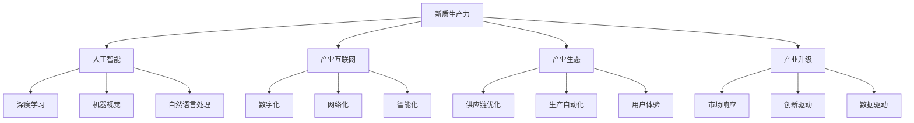

                 

# 产业升级的新质生产力推动力

## 1. 背景介绍

### 1.1 产业升级的必要性
在全球经济面临深刻变革的背景下，产业升级已成为各国政府和企业提升竞争力、实现可持续发展的重要战略。产业升级不仅包括传统制造业的数字化转型，还包括服务业的智能化、自动化、个性化发展。新一轮的科技革命和产业变革正在重塑全球价值链，企业需要运用新技术和新业态，提升全要素生产率，从而增强国际竞争力。

### 1.2 新质生产力的内涵
所谓新质生产力，是指以信息技术和数字技术为驱动力的新型生产力形态，强调的是以智能化、数字化、网络化为主要特征的创新型能力。这种生产力形态要求企业能够快速响应市场需求变化，通过优化供应链、提升生产效率、改善用户体验等方式，实现从生产导向向用户导向的转变，从而在激烈的竞争中取得优势。

### 1.3 人工智能在新质生产力中的地位
人工智能作为新一轮科技革命的重要驱动力，通过深度学习、机器视觉、自然语言处理等技术，实现了信息处理、数据分析、决策优化等方面的重大突破。其与工业互联网、物联网、区块链等技术的深度融合，为产业升级提供了新质生产力的有力支撑，加速了传统产业的智能化、数字化进程。

## 2. 核心概念与联系

### 2.1 核心概念概述

为了更好地理解新质生产力及其与人工智能的联系，本节将介绍几个核心概念：

- **新质生产力**：以信息技术和数字技术为驱动力的新型生产力形态，强调智能化、数字化、网络化。
- **人工智能**：通过计算机模拟人的智能行为，实现信息处理、数据分析、决策优化等能力的技术体系。
- **产业互联网**：将工业互联网与各垂直行业结合，构建数字化、网络化、智能化的新经济生态。
- **产业生态**：由产业链上下游企业、平台、用户、数据等构成的复杂系统，通过数字化手段实现协同创新。
- **产业升级**：通过新技术和新业态的应用，优化产业结构，提升全要素生产率，增强企业竞争力。

这些核心概念之间的关系可以通过以下Mermaid流程图来展示：



这个流程图展示了大语言模型的核心概念及其之间的关系：

1. 新质生产力通过人工智能技术，实现了数字化、网络化、智能化。
2. 人工智能涵盖了深度学习、机器视觉、自然语言处理等关键技术，为产业升级提供了技术支持。
3. 产业互联网通过数字化手段，推动产业生态各要素协同创新。
4. 产业升级旨在通过新技术和新业态的应用，优化产业结构，提升全要素生产率。

## 3. 核心算法原理 & 具体操作步骤

### 3.1 算法原理概述

新质生产力的驱动，离不开人工智能技术的应用。人工智能通过深度学习、强化学习等算法，实现了对海量数据的深度挖掘，提升了决策的精准性和效率。同时，人工智能技术的引入，也为传统产业的智能化改造提供了新的方向和路径。

以深度学习为例，其基本原理是通过多层神经网络，对大量数据进行学习，提取特征，建立模型，从而实现对未知数据的预测和决策。深度学习的核心在于反向传播算法，通过不断调整神经网络的权重参数，使得模型输出的预测结果与实际结果尽可能一致。

### 3.2 算法步骤详解

新质生产力的实现，主要包括以下几个关键步骤：

**Step 1: 数据准备**
- 收集并清洗大量行业数据，构建数据集，确保数据质量。
- 对数据进行标注，添加标签，标注数据集需尽可能覆盖典型场景。

**Step 2: 模型选择与训练**
- 选择合适的深度学习模型，如卷积神经网络(CNN)、循环神经网络(RNN)、Transformer等。
- 设计合适的模型结构，对模型进行训练，调整超参数，以获得最优模型性能。
- 使用正则化技术，如L2正则、Dropout等，防止过拟合。

**Step 3: 模型评估与优化**
- 在测试集上评估模型性能，如精度、召回率、F1-score等指标。
- 根据评估结果，优化模型结构，调整超参数，进行模型迭代优化。

**Step 4: 模型部署与应用**
- 将优化后的模型部署到实际应用场景中，实现业务智能化升级。
- 通过API接口，将模型提供给业务系统调用，实现实时决策和智能分析。

### 3.3 算法优缺点

人工智能技术在实现新质生产力的过程中，既有优点也有不足：

**优点：**
1. 提升决策精准性。深度学习、强化学习等算法，通过对海量数据的深度挖掘，提取有效特征，实现对未知数据的精准预测和决策。
2. 提高生产效率。通过自动化流程，提升生产线的智能化水平，减少人力投入，提高生产效率。
3. 改善用户体验。通过智能推荐、个性化定制等方式，提升用户满意度和忠诚度。
4. 优化供应链管理。通过智能分析，优化供应链流程，提高供应链效率和灵活性。

**缺点：**
1. 对数据质量要求高。人工智能技术的效果很大程度上取决于数据质量，需投入大量资源进行数据清洗和标注。
2. 模型复杂度大。深度学习模型的复杂度较高，训练和推理速度较慢，需高性能硬件支持。
3. 模型泛化能力有限。当训练数据和测试数据分布差异较大时，模型的泛化能力受限。
4. 模型安全性不足。深度学习模型可能受到对抗样本攻击，产生误判。
5. 模型解释性不足。深度学习模型通常缺乏可解释性，难以理解和调试。

## 4. 数学模型和公式 & 详细讲解

### 4.1 数学模型构建

新质生产力的实现，离不开数学模型作为理论支撑。这里以深度学习为例，介绍其数学模型构建过程。

**输入**：$x \in \mathbb{R}^d$，表示样本特征向量。

**输出**：$y \in \mathbb{R}^k$，表示模型预测结果。

**模型**：$h_{\theta}(x)$，表示神经网络的参数化表示。

深度学习模型的目标函数为：

$$
\mathcal{L}(\theta) = \frac{1}{N}\sum_{i=1}^N \ell(h_{\theta}(x_i),y_i)
$$

其中，$\ell$ 为损失函数，常用的有均方误差、交叉熵等。

### 4.2 公式推导过程

深度学习模型的训练过程，主要通过反向传播算法实现。以均方误差损失函数为例，推导过程如下：

$$
\frac{\partial \mathcal{L}(\theta)}{\partial x} = \frac{\partial \ell(h_{\theta}(x),y)}{\partial x}
$$

根据链式法则，可以进一步展开得到：

$$
\frac{\partial \mathcal{L}(\theta)}{\partial x} = \frac{\partial \ell(h_{\theta}(x),y)}{\partial y} \cdot \frac{\partial h_{\theta}(x)}{\partial x}
$$

其中，$\frac{\partial h_{\theta}(x)}{\partial x}$ 为神经网络的权重参数，通过反向传播算法计算得到。

### 4.3 案例分析与讲解

以图像识别为例，介绍深度学习模型的应用。

**输入**：$x \in \mathbb{R}^{m \times n \times c}$，表示输入图像数据。

**输出**：$y \in \{1,2,3,\dots,K\}$，表示图像的类别标签。

**模型**：$h_{\theta}(x)$，表示卷积神经网络(CNN)。

**损失函数**：交叉熵损失函数。

训练过程如下：

1. 收集大量带标注的图像数据，构建数据集。
2. 选择卷积神经网络模型，对模型进行训练，调整权重参数。
3. 在测试集上评估模型性能，如精度、召回率等指标。
4. 根据评估结果，优化模型结构，调整超参数。
5. 将优化后的模型部署到实际应用场景中，实现图像识别。

## 5. 项目实践：代码实例和详细解释说明

### 5.1 开发环境搭建

在进行深度学习项目开发前，需要准备好开发环境。以下是使用Python进行TensorFlow开发的环境配置流程：

1. 安装Anaconda：从官网下载并安装Anaconda，用于创建独立的Python环境。

2. 创建并激活虚拟环境：
```bash
conda create -n tf-env python=3.7 
conda activate tf-env
```

3. 安装TensorFlow：从官网获取对应的安装命令，并根据系统环境安装。例如：
```bash
pip install tensorflow
```

4. 安装各类工具包：
```bash
pip install numpy pandas scikit-learn matplotlib tqdm jupyter notebook ipython
```

完成上述步骤后，即可在`tf-env`环境中开始深度学习项目开发。

### 5.2 源代码详细实现

这里我们以图像识别项目为例，给出使用TensorFlow实现卷积神经网络(CNN)的代码实现。

首先，定义CNN模型：

```python
import tensorflow as tf

model = tf.keras.models.Sequential([
    tf.keras.layers.Conv2D(32, (3, 3), activation='relu', input_shape=(28, 28, 1)),
    tf.keras.layers.MaxPooling2D((2, 2)),
    tf.keras.layers.Flatten(),
    tf.keras.layers.Dense(10, activation='softmax')
])
```

然后，定义损失函数和优化器：

```python
model.compile(optimizer='adam', loss='categorical_crossentropy', metrics=['accuracy'])
```

接着，定义训练函数：

```python
def train(model, train_dataset, validation_dataset, epochs):
    history = model.fit(train_dataset, validation_data=validation_dataset, epochs=epochs, batch_size=32)
    return history
```

最后，启动训练流程：

```python
epochs = 10

history = train(model, train_dataset, validation_dataset, epochs)
```

以上就是使用TensorFlow对CNN进行图像识别任务开发的完整代码实现。可以看到，使用TensorFlow库的高级API，构建CNN模型的代码实现非常简洁高效。

### 5.3 代码解读与分析

让我们再详细解读一下关键代码的实现细节：

**CNN模型定义**：
- 使用Sequential模型，依次添加卷积层、池化层、全连接层，构建CNN模型。
- 卷积层使用3x3的卷积核，激活函数为ReLU。
- 池化层使用2x2的最大池化。
- 全连接层输出10个神经元，使用Softmax激活函数。

**损失函数和优化器**：
- 使用交叉熵损失函数和Adam优化器。
- 通过compile方法，将模型、损失函数和优化器封装在一起，方便后续调用。

**训练函数**：
- 使用fit方法，对模型进行训练。
- 设置训练轮数为epochs，批次大小为32。
- 通过history记录训练过程中的损失和准确率变化情况。

**训练流程**：
- 定义训练轮数为epochs，调用训练函数，启动训练过程。
- 训练结束后，返回训练记录history。

可以看到，TensorFlow库的高级API使得深度学习模型的构建和训练变得非常简单。开发者可以专注于算法和模型改进，而不必过多关注底层实现细节。

## 6. 实际应用场景

### 6.1 智慧工厂

基于深度学习的智能工厂，能够实时监控生产设备的运行状态，预测设备故障，优化生产流程，提升生产效率。例如，使用深度学习算法对传感器数据进行建模，实时监控设备状态，预测设备故障，提前进行维护，避免设备停机时间。通过智能调度系统，优化生产计划，提升生产效率，降低生产成本。

### 6.2 智能医疗

人工智能在医疗领域的应用，已经从简单的图像识别扩展到病理诊断、疾病预测、治疗方案推荐等多个环节。例如，使用深度学习算法对医学影像进行分析，辅助医生进行病理诊断，提高诊断准确率。使用自然语言处理算法对电子病历进行自动分类和摘要，辅助医生进行病历管理。通过智能推荐系统，推荐治疗方案，优化医疗资源配置，提高患者治疗效果。

### 6.3 智能客服

基于深度学习的智能客服系统，能够处理大量的客户咨询，快速响应客户需求，提高客户满意度。例如，使用自然语言处理算法对客户咨询进行自动分类，并匹配最合适的回答模板进行回复。通过智能推荐系统，推荐最合适的解决方案，提高客户问题解决率。使用对话生成模型，提升对话自然度，增强客户互动体验。

### 6.4 未来应用展望

随着深度学习技术的不断进步，基于新质生产力的应用将更加广泛。未来，人工智能技术将在更多领域实现落地，为社会和经济带来深远影响：

1. 智能交通：使用深度学习算法对交通数据进行实时分析，优化交通流量，提高交通效率。
2. 智慧物流：使用深度学习算法对物流数据进行建模，优化物流路线和运输方案，降低物流成本。
3. 金融科技：使用深度学习算法对金融数据进行分析和预测，优化投资决策，降低风险。
4. 智能制造：使用深度学习算法对制造数据进行建模，优化生产流程，提升生产效率。
5. 智慧农业：使用深度学习算法对农业数据进行分析和预测，优化农业生产，提高农业产量和质量。

## 7. 工具和资源推荐

### 7.1 学习资源推荐

为了帮助开发者系统掌握深度学习技术，这里推荐一些优质的学习资源：

1. 《深度学习》课程：由斯坦福大学Andrew Ng教授主讲，系统讲解深度学习的基本原理和算法。
2. 《TensorFlow实战Google深度学习框架》书籍：由Google深度学习团队撰写，详细讲解TensorFlow的高级API和实践技巧。
3. 《动手学深度学习》：由清华大学发布，提供从入门到精通的深度学习课程，包含大量实例和项目。
4. PyTorch官方文档：PyTorch库的官方文档，提供全面且详细的API文档和示例代码。
5. Kaggle平台：数据科学竞赛平台，提供大量数据集和挑战赛，助力深度学习实践。

通过对这些资源的学习实践，相信你一定能够快速掌握深度学习技术，并将其应用于实际项目中。

### 7.2 开发工具推荐

高效的深度学习开发离不开优秀的工具支持。以下是几款用于深度学习开发的常用工具：

1. TensorFlow：由Google主导开发的深度学习框架，生产部署方便，支持多种硬件平台。
2. PyTorch：由Facebook开发的深度学习框架，具有动态计算图和灵活性，适合研究和实验。
3. Keras：高层次的深度学习API，易于上手，支持多种深度学习框架，包括TensorFlow和PyTorch。
4. Jupyter Notebook：交互式编程环境，支持Python、R等多种编程语言，便于分享和学习。
5. Anaconda：Python科学计算环境，提供高效的包管理工具，方便管理和安装第三方库。

合理利用这些工具，可以显著提升深度学习项目的开发效率，加快创新迭代的步伐。

### 7.3 相关论文推荐

深度学习技术的发展离不开学界的持续研究。以下是几篇奠基性的相关论文，推荐阅读：

1. AlexNet：卷积神经网络的经典之作，提出了多层次卷积网络结构，提升了图像识别精度。
2. ResNet：引入了残差连接，解决了深度网络训练中的梯度消失问题，提升了模型深度和精度。
3. InceptionNet：提出了多分支卷积结构，提升了模型复杂度和精度。
4. VGGNet：提出了小尺寸卷积核，降低了参数数量，提升了模型可解释性。
5. AlphaGo：使用深度学习和强化学习技术，实现计算机对弈围棋世界冠军，推动了人工智能技术的发展。

这些论文代表了大语言模型微调技术的发展脉络。通过学习这些前沿成果，可以帮助研究者把握学科前进方向，激发更多的创新灵感。

## 8. 总结：未来发展趋势与挑战

### 8.1 总结

本文对新质生产力及其与人工智能的联系进行了全面系统的介绍。首先阐述了新质生产力的内涵，并明确了其与人工智能技术的联系。通过深度学习、强化学习等技术，人工智能在新质生产力的实现中发挥了重要作用。其次，本文从原理到实践，详细讲解了深度学习模型的构建和训练过程，给出了深度学习项目开发的完整代码实例。同时，本文还广泛探讨了深度学习技术在各个行业领域的应用前景，展示了其巨大的潜力。

通过本文的系统梳理，可以看到，人工智能技术在新质生产力推动产业升级中具有不可替代的地位，引领了新一轮科技革命和产业变革。未来，人工智能技术还将进一步提升全要素生产率，增强企业的国际竞争力，为经济社会发展注入新的动力。

### 8.2 未来发展趋势

展望未来，深度学习技术将呈现以下几个发展趋势：

1. 模型规模持续增大。随着算力成本的下降和数据规模的扩张，深度学习模型的参数量还将持续增长。超大规模深度学习模型蕴含的丰富知识，有望支撑更加复杂多变的任务。
2. 模型应用场景增多。深度学习技术不仅应用于计算机视觉、自然语言处理等传统领域，还将在医疗、金融、制造等多个行业实现应用，推动各行业的智能化升级。
3. 模型优化技术发展。深度学习模型的优化技术不断进步，如量化加速、模型压缩、模型蒸馏等技术，将进一步提升模型的效率和可部署性。
4. 模型解释性增强。深度学习模型的可解释性研究不断深入，通过因果推断、符号化表示等技术，增强模型输出结果的解释性。
5. 模型安全性保障。深度学习模型面临的安全威胁不断增加，如何保障模型的安全性和鲁棒性，成为未来研究的重要方向。
6. 模型泛化能力提升。深度学习模型面临的泛化挑战，需要通过迁移学习、少样本学习等技术，提升模型的泛化能力，应对更多未知领域。

以上趋势凸显了深度学习技术的广阔前景。这些方向的探索发展，必将进一步提升新质生产力的内涵，推动人工智能技术在更多领域实现落地应用。

### 8.3 面临的挑战

尽管深度学习技术在新质生产力推动产业升级中取得了显著成效，但在迈向更加智能化、普适化应用的过程中，仍面临诸多挑战：

1. 数据质量瓶颈。深度学习模型的效果很大程度上取决于数据质量，但获取高质量标注数据成本较高，数据分布变化带来的泛化问题难以解决。
2. 模型复杂性增加。深度学习模型的复杂性不断增加，训练和推理速度较慢，硬件资源需求大，部署成本高。
3. 模型解释性不足。深度学习模型通常缺乏可解释性，难以理解和调试，影响模型的可信度。
4. 模型安全问题。深度学习模型可能受到对抗样本攻击，产生误判，影响系统的安全性。
5. 模型泛化能力有限。深度学习模型面临的泛化挑战，需要通过迁移学习、少样本学习等技术，提升模型的泛化能力，应对更多未知领域。

### 8.4 研究展望

面对深度学习技术面临的挑战，未来的研究需要在以下几个方面寻求新的突破：

1. 探索无监督和半监督学习。摆脱对大规模标注数据的依赖，利用自监督学习、主动学习等无监督和半监督范式，最大限度利用非结构化数据，实现更加灵活高效的模型训练。
2. 研究模型优化技术。开发更加高效的模型压缩、量化加速等技术，提升模型的效率和可部署性。
3. 加强模型解释性研究。通过因果推断、符号化表示等技术，增强模型输出结果的解释性，提升模型的可信度。
4. 研究模型安全性保障。通过对抗样本防御、鲁棒性训练等技术，提升模型的鲁棒性和安全性。
5. 提升模型泛化能力。通过迁移学习、少样本学习等技术，提升模型的泛化能力，应对更多未知领域。

这些研究方向的探索，必将引领深度学习技术迈向更高的台阶，为构建安全、可靠、可解释、可控的智能系统铺平道路。面向未来，深度学习技术还需要与其他人工智能技术进行更深入的融合，如知识表示、因果推理、强化学习等，多路径协同发力，共同推动新质生产力的发展。

## 9. 附录：常见问题与解答

**Q1：新质生产力是如何与人工智能技术结合的？**

A: 新质生产力的实现离不开人工智能技术。通过深度学习、强化学习等算法，人工智能技术实现了对海量数据的深度挖掘，提取有效特征，建立模型，从而实现对未知数据的精准预测和决策。同时，人工智能技术的引入，也为传统产业的智能化改造提供了新的方向和路径，提升了生产效率和用户体验。

**Q2：深度学习模型在实际应用中面临哪些挑战？**

A: 深度学习模型在实际应用中面临诸多挑战：
1. 数据质量瓶颈。深度学习模型的效果很大程度上取决于数据质量，但获取高质量标注数据成本较高。
2. 模型复杂性增加。深度学习模型的复杂性不断增加，训练和推理速度较慢，硬件资源需求大。
3. 模型解释性不足。深度学习模型通常缺乏可解释性，难以理解和调试，影响模型的可信度。
4. 模型安全问题。深度学习模型可能受到对抗样本攻击，产生误判，影响系统的安全性。
5. 模型泛化能力有限。深度学习模型面临的泛化挑战，需要通过迁移学习、少样本学习等技术，提升模型的泛化能力，应对更多未知领域。

**Q3：如何提升深度学习模型的泛化能力？**

A: 提升深度学习模型的泛化能力，需要从数据、模型、算法等多个方面进行优化：
1. 数据方面：收集更多、更丰富的数据，进行数据增强和数据扩充，提升模型对数据分布变化的鲁棒性。
2. 模型方面：引入迁移学习、少样本学习等技术，提升模型的泛化能力。
3. 算法方面：使用对抗样本防御、鲁棒性训练等技术，提升模型的鲁棒性和安全性。

**Q4：深度学习模型在实际应用中如何部署？**

A: 将深度学习模型部署到实际应用中，需要进行以下步骤：
1. 模型训练和优化。对模型进行训练和优化，确保模型性能达到预期。
2. 模型裁剪和量化。对模型进行裁剪和量化，减小模型大小，提升推理速度。
3. 模型部署和接口封装。将模型部署到服务器或嵌入式设备上，并提供API接口，供业务系统调用。
4. 模型监控和优化。实时监控模型性能，根据使用情况进行优化和调整。

**Q5：未来深度学习技术的发展方向是什么？**

A: 未来深度学习技术的发展方向包括：
1. 模型规模持续增大。随着算力成本的下降和数据规模的扩张，深度学习模型的参数量还将持续增长，模型将具备更丰富的知识。
2. 模型应用场景增多。深度学习技术不仅应用于计算机视觉、自然语言处理等传统领域，还将在医疗、金融、制造等多个行业实现应用，推动各行业的智能化升级。
3. 模型优化技术发展。深度学习模型的优化技术不断进步，如量化加速、模型压缩、模型蒸馏等技术，将进一步提升模型的效率和可部署性。
4. 模型解释性增强。深度学习模型的可解释性研究不断深入，通过因果推断、符号化表示等技术，增强模型输出结果的解释性。
5. 模型安全性保障。深度学习模型面临的安全威胁不断增加，如何保障模型的安全性和鲁棒性，成为未来研究的重要方向。

这些方向凸显了深度学习技术的广阔前景，推动新质生产力的进一步提升，为人工智能技术在更多领域实现落地应用铺平道路。

---

作者：禅与计算机程序设计艺术 / Zen and the Art of Computer Programming

