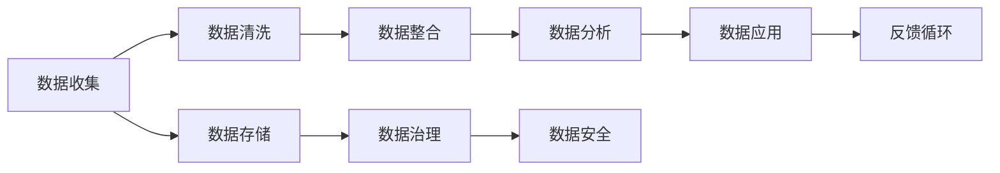

                 

# 人工智能创业数据管理的创新经验

> 关键词：人工智能,数据管理,创新经验,创业,数据分析,机器学习,数据仓库,数据湖,大数据,数据安全

## 1. 背景介绍

在当下这个数据驱动的时代，数据管理成为了人工智能创业企业中至关重要的环节。无论是在模型训练、业务预测，还是在个性化推荐、风险评估等方面，数据质量、数据集成和数据治理都有着不可忽视的作用。尤其是在人工智能创业初期，数据的管理和利用方式直接决定了项目的成败。本文将从数据管理的核心概念、核心算法、具体操作步骤、数学模型和公式、项目实践、实际应用场景、工具和资源推荐、未来发展趋势与挑战等各个方面，深入探讨人工智能创业企业如何进行数据管理，并提供一些实用的创新经验。

## 2. 核心概念与联系

### 2.1 核心概念概述

数据管理是人工智能创业企业的基础设施之一，涉及到数据的收集、存储、清洗、整合、分析和应用等环节。数据管理不仅包括了对数据的技术处理，还涵盖了数据安全、合规、隐私保护等方面的内容。在人工智能创业过程中，数据管理的重要性不言而喻，尤其是在数据驱动的业务决策中，数据的质量、完整性和及时性直接影响着模型的准确性和可靠性。

为了更好地理解数据管理的核心概念，我们通过一个简单的Mermaid流程图来展示数据管理的各个环节和它们之间的联系：



在这个流程图中，数据的各个环节相互关联，共同构成了数据管理的大框架。接下来，我们将逐一解释这些核心概念及其之间的联系。

## 3. 核心算法原理 & 具体操作步骤

### 3.1 算法原理概述

数据管理涉及到许多核心算法，其中最基础的就是数据清洗算法。数据清洗旨在去除噪声和错误，保证数据的一致性和完整性。在人工智能创业企业中，数据清洗尤为重要，因为数据往往来自不同的来源，格式各异，存在大量的缺失值、异常值和错误。数据清洗的目标是通过算法识别并处理这些问题，确保数据的准确性。

此外，数据整合算法也是数据管理中的重要组成部分。数据整合指的是将来自不同数据源的数据进行统一和协调，以便进行进一步的分析和应用。数据整合可以通过合并、去重、归并等操作实现，并需考虑数据之间的关联和一致性。

数据分析算法则是利用统计、机器学习等方法，对数据进行深入的分析和挖掘，以发现潜在的规律和趋势。数据分析在人工智能创业企业中有着广泛的应用，如客户行为分析、市场趋势预测、产品推荐等。

数据安全算法则着重于保护数据免受未经授权的访问和篡改，确保数据在存储和传输过程中的安全性。数据安全算法通常包括数据加密、访问控制、审计记录等技术手段。

### 3.2 算法步骤详解

数据管理的算法步骤可以分为以下几个主要环节：

1. **数据收集**：收集来自不同渠道的数据，包括线上数据、线下数据、传感器数据等。数据收集是一个动态的过程，需要不断更新和补充。

2. **数据清洗**：对收集到的数据进行初步筛选和处理，去除重复、错误和不完整的数据，确保数据的质量和一致性。

3. **数据整合**：将清洗后的数据进行合并、去重、归并等操作，形成统一的数据仓库或数据湖。数据整合需要考虑数据的关联性和一致性。

4. **数据分析**：利用统计和机器学习等方法，对整合后的数据进行深入分析，发现数据中的规律和趋势，为业务决策提供支持。

5. **数据应用**：将分析结果应用到实际业务中，如客户个性化推荐、市场趋势预测、风险评估等，提升业务效率和效果。

6. **数据治理**：对数据管理过程进行监督和管理，确保数据的质量、安全、合规和隐私。数据治理包括数据标准制定、数据权限管理、数据质量监控等。

7. **数据安全**：采取各种技术手段保护数据的安全，防止数据泄露和未经授权的访问。数据安全包括数据加密、访问控制、审计记录等。

### 3.3 算法优缺点

数据管理的算法具有以下优点：

- **提高数据质量**：通过数据清洗和整合，保证数据的准确性和一致性，提升数据的质量。
- **提升业务决策效率**：利用数据分析结果，为业务决策提供数据支持，提升决策的科学性和准确性。
- **保障数据安全**：通过数据加密、访问控制等手段，保障数据的安全性和隐私性，防止数据泄露和滥用。

同时，数据管理算法也存在一些缺点：

- **算法复杂性高**：数据清洗、整合、分析等操作往往涉及复杂的算法和模型，需要较高的技术门槛。
- **数据处理成本高**：数据收集、清洗、整合、治理等环节需要大量的计算资源和时间成本，特别是在大数据量的情况下。
- **数据隐私风险**：数据的安全性和隐私保护需要精心设计和严格管理，稍有不慎可能引发数据泄露和隐私问题。

### 3.4 算法应用领域

数据管理算法在人工智能创业中有着广泛的应用，涵盖以下几个领域：

- **客户关系管理(CRM)**：利用数据分析和客户行为预测，提升客户满意度和忠诚度，增加客户转化率。
- **市场分析**：通过市场趋势分析和客户画像，制定精准的市场策略和营销方案。
- **风险管理**：利用数据分析和预测模型，评估和控制业务风险，如信用风险、欺诈风险等。
- **个性化推荐**：根据用户行为和偏好，推荐个性化产品和服务，提升用户体验。
- **智能客服**：利用自然语言处理和数据分析，提升客服响应效率和质量，降低人工成本。
- **供应链管理**：通过数据分析和预测模型，优化供应链流程，提高效率和降低成本。

## 4. 数学模型和公式 & 详细讲解

### 4.1 数学模型构建

数据管理的数学模型构建主要围绕数据的描述和分析展开。以客户行为分析为例，我们可以构建以下数学模型：

设 $X$ 表示客户特征向量，$Y$ 表示客户行为标签，$\theta$ 表示模型参数，$f(x;\theta)$ 表示预测函数。则我们的目标是找到最优参数 $\theta^*$，使得预测值 $f(x;\theta)$ 与真实值 $y$ 尽可能接近。

### 4.2 公式推导过程

我们以线性回归模型为例，进行公式推导：

设 $Y = \beta_0 + \beta_1x_1 + \beta_2x_2 + ... + \beta_nx_n + \epsilon$，其中 $\epsilon$ 为误差项，$n$ 为特征数量。则线性回归模型的最小二乘解为：

$$
\hat{\beta} = (X^TX)^{-1}X^TY
$$

其中 $X$ 为特征矩阵，$Y$ 为标签向量。

### 4.3 案例分析与讲解

以客户行为分析为例，假设我们收集了客户的历史购买数据，通过构建线性回归模型，可以预测客户未来的购买行为。我们通过最小二乘法求解最优参数 $\beta$，然后利用训练好的模型对新客户进行预测，提升客户转化率和销售额。

## 5. 项目实践：代码实例和详细解释说明

### 5.1 开发环境搭建

在进行数据管理实践前，我们需要准备好开发环境。以下是使用Python进行Pandas、Scikit-learn、TensorFlow等库的开发环境配置流程：

1. 安装Anaconda：从官网下载并安装Anaconda，用于创建独立的Python环境。

2. 创建并激活虚拟环境：
```bash
conda create -n data-management python=3.8 
conda activate data-management
```

3. 安装所需库：
```bash
conda install pandas scikit-learn numpy matplotlib seaborn
```

4. 安装TensorFlow：
```bash
pip install tensorflow
```

5. 安装Jupyter Notebook：
```bash
pip install jupyter notebook
```

完成上述步骤后，即可在`data-management`环境中开始数据管理实践。

### 5.2 源代码详细实现

这里我们以客户行为分析为例，给出使用Pandas、Scikit-learn等库对数据进行清洗、整合、分析和应用的代码实现。

首先，定义数据处理函数：

```python
import pandas as pd
from sklearn.preprocessing import MinMaxScaler

def clean_data(data):
    # 去除缺失值和异常值
    data = data.dropna()
    data = data[data['x1'] > 0]
    data = data[data['x2'] < 100]
    
    # 归一化处理
    scaler = MinMaxScaler()
    data[['x1', 'x2']] = scaler.fit_transform(data[['x1', 'x2']])
    
    return data

# 读取数据
data = pd.read_csv('customer_data.csv')
data = clean_data(data)
```

然后，定义数据整合函数：

```python
def merge_data(data):
    # 合并不同来源的数据
    merged_data = pd.merge(data, 'source1', on='key1')
    merged_data = pd.merge(merged_data, 'source2', on='key2')
    
    return merged_data
```

接着，定义数据分析函数：

```python
from sklearn.linear_model import LinearRegression

def analyze_data(data):
    # 构建线性回归模型
    X = data[['x1', 'x2']]
    Y = data['y']
    model = LinearRegression()
    model.fit(X, Y)
    
    # 预测新数据
    new_data = pd.DataFrame({'x1': [1.5, 2.5], 'x2': [3, 4]})
    new_data = clean_data(new_data)
    new_data = merge_data(new_data)
    new_data['y_pred'] = model.predict(new_data[['x1', 'x2']])
    
    return new_data
```

最后，启动数据处理流程并在测试数据上进行应用：

```python
# 训练集和测试集划分
train_data = data.sample(frac=0.7, random_state=0)
test_data = data.drop(train_data.index)

# 训练模型
train_data = analyze_data(train_data)
test_data = analyze_data(test_data)

# 评估模型
print(train_data.describe())
print(test_data.describe())
print(train_data['y_pred'].describe())
```

以上就是使用Pandas、Scikit-learn等库对客户行为数据进行清洗、整合、分析和应用的完整代码实现。可以看到，得益于这些库的强大封装，我们可以用相对简洁的代码完成数据管理的各个环节。

### 5.3 代码解读与分析

让我们再详细解读一下关键代码的实现细节：

**clean_data函数**：
- 定义了数据清洗的步骤，包括去除缺失值和异常值，以及归一化处理。

**merge_data函数**：
- 定义了数据整合的步骤，使用`pd.merge`方法合并不同来源的数据，生成统一的数据仓库。

**analyze_data函数**：
- 定义了数据分析和应用的步骤，首先使用线性回归模型训练预测模型，然后对测试数据进行清洗、整合和预测。

**训练集和测试集划分**：
- 使用`sample`方法将数据划分为训练集和测试集，分别进行训练和测试。

**训练和测试模型**：
- 对训练集和测试集分别进行清洗、整合、分析和预测，并打印描述性统计信息。

可以看到，Pandas、Scikit-learn等库提供了丰富的数据处理和分析功能，使得数据管理任务变得简洁高效。开发者可以将更多精力放在数据处理、模型改进等高层逻辑上，而不必过多关注底层的实现细节。

当然，工业级的系统实现还需考虑更多因素，如数据安全、模型调优、性能优化等，但核心的数据管理流程基本与此类似。

## 6. 实际应用场景

### 6.1 金融风险管理

在金融领域，数据管理对于风险管理尤为重要。金融机构需要实时监控市场动态和客户行为，及时发现和规避潜在的风险。通过数据管理，金融机构可以构建完整的客户画像，评估客户的信用风险、欺诈风险等，从而制定更加精准的风险管理策略。

具体而言，可以收集客户的交易记录、社交媒体信息、信用报告等数据，通过数据清洗和整合，构建客户行为分析模型。该模型可以预测客户的违约概率、信用评级等，为风险评估和贷款审批提供数据支持。

### 6.2 电商个性化推荐

电商企业需要根据用户的行为和偏好，推荐个性化的商品和服务，提升用户体验和销售额。通过数据管理，电商企业可以构建用户画像，分析用户的历史购买行为、浏览记录、搜索习惯等，从而生成个性化的推荐列表。

具体而言，可以收集用户的交易记录、浏览记录、搜索记录等数据，通过数据清洗和整合，构建用户行为分析模型。该模型可以预测用户的购买意向、感兴趣的商品类型等，为个性化推荐提供数据支持。

### 6.3 医疗健康管理

在医疗领域，数据管理对于健康管理和疾病预防尤为关键。医疗机构需要收集和分析患者的健康数据，及时发现和预防疾病。通过数据管理，医疗机构可以构建完整的患者画像，评估患者的健康风险、疾病倾向等，从而制定个性化的健康管理方案。

具体而言，可以收集患者的电子病历、健康记录、生活方式等信息，通过数据清洗和整合，构建患者健康分析模型。该模型可以预测患者的患病风险、疾病发展趋势等，为健康管理和疾病预防提供数据支持。

### 6.4 未来应用展望

随着人工智能技术的发展，数据管理将在更多领域得到应用，为各行各业带来变革性影响。

在智慧城市治理中，数据管理可以用于城市事件监测、舆情分析、应急指挥等环节，提高城市管理的自动化和智能化水平，构建更安全、高效的未来城市。

在智能交通领域，数据管理可以用于交通流量分析、智能调度、事故预警等环节，提高交通系统的效率和安全性。

在智能制造领域，数据管理可以用于设备故障预测、生产优化、质量控制等环节，提高生产效率和产品质量。

此外，在智慧农业、智能家居、智能能源等领域，数据管理也将发挥重要作用，推动各个行业的数字化转型升级。

## 7. 工具和资源推荐

### 7.1 学习资源推荐

为了帮助开发者系统掌握数据管理的理论基础和实践技巧，这里推荐一些优质的学习资源：

1. 《Python数据科学手册》：由Jake VanderPlas著，全面介绍了Python在数据科学中的应用，包括数据清洗、数据整合、数据可视化等。

2. 《数据科学与机器学习》课程：由斯坦福大学开设的在线课程，涵盖了数据科学和机器学习的基础概念和实践技巧，适合初学者入门。

3. 《机器学习实战》书籍：由Peter Harrington著，介绍了各种机器学习算法的实现和应用，包括线性回归、分类、聚类等。

4. Kaggle：一个数据科学竞赛平台，提供了大量的数据集和竞赛题目，适合学习和实践数据处理和分析技能。

5. Coursera：一个在线学习平台，提供了各种数据科学和机器学习课程，适合深度学习。

通过对这些资源的学习实践，相信你一定能够快速掌握数据管理的精髓，并用于解决实际的数据处理问题。

### 7.2 开发工具推荐

高效的开发离不开优秀的工具支持。以下是几款用于数据管理开发的常用工具：

1. Pandas：一个强大的数据分析库，支持数据清洗、整合、分析等多种功能。

2. Scikit-learn：一个机器学习库，支持各种机器学习算法和模型，适合数据分析和预测。

3. TensorFlow：一个深度学习框架，支持大规模数据处理和模型训练。

4. Hive和Spark：一个分布式数据处理框架，支持大数据量的数据管理。

5. Jupyter Notebook：一个交互式开发环境，支持Python等语言的数据处理和分析。

6. Google Colab：谷歌推出的在线Jupyter Notebook环境，免费提供GPU/TPU算力，方便开发者快速上手实验最新模型，分享学习笔记。

合理利用这些工具，可以显著提升数据管理的开发效率，加快创新迭代的步伐。

### 7.3 相关论文推荐

数据管理的研究涉及多个学科，包括计算机科学、统计学、运筹学等。以下是几篇奠基性的相关论文，推荐阅读：

1. "Data Cleaning Techniques: A Survey"：详细介绍了数据清洗的多种方法，包括缺失值处理、异常值检测等。

2. "A Survey on Data Warehousing"：全面介绍了数据仓库的概念、技术、应用等，适合了解数据管理的整体框架。

3. "Data Mining: Concepts and Techniques"：一本经典的数据挖掘教材，涵盖了各种数据处理和分析算法。

4. "Big Data Analytics: Concepts, Technology, and Applications"：介绍了大数据分析的概念、技术和应用，适合了解数据管理的最新趋势。

这些论文代表了大数据管理的研究方向，通过学习这些前沿成果，可以帮助研究者把握学科前进方向，激发更多的创新灵感。

## 8. 总结：未来发展趋势与挑战

### 8.1 总结

本文对人工智能创业数据管理的核心概念、核心算法、操作步骤、数学模型和公式、项目实践、实际应用场景、工具和资源推荐、未来发展趋势与挑战等各个方面进行了深入探讨。通过本文的系统梳理，可以看到数据管理在人工智能创业中的重要性，以及如何通过数据清洗、整合、分析和应用，提升业务决策的科学性和准确性。

通过本文的介绍，相信你对数据管理有了更深刻的认识，能够更好地在实际项目中应用数据管理技术，提升项目的成功率和效果。

### 8.2 未来发展趋势

展望未来，数据管理技术将呈现以下几个发展趋势：

1. **大数据技术的应用**：随着大数据技术的发展，数据管理将更加注重数据量和分布式处理。大数据平台如Hadoop、Spark等，将在数据管理中发挥重要作用，支持海量数据的存储和处理。

2. **机器学习与数据管理融合**：机器学习算法将进一步融入数据管理流程，利用机器学习进行数据清洗、异常检测、分类、聚类等任务，提升数据管理的自动化和智能化水平。

3. **数据治理与数据安全**：数据治理和数据安全将成为数据管理的重要组成部分。数据治理将进一步规范化数据管理流程，提升数据质量和管理效率。数据安全将采用更加先进的技术手段，保护数据的安全性和隐私性。

4. **实时数据处理**：实时数据处理技术将成为数据管理的重要方向，支持数据流计算、实时分析等应用场景，提升数据管理的实时性和响应速度。

5. **数据可视化与交互**：数据可视化技术将进一步发展，支持数据驱动的业务决策和实时监控。交互式数据管理工具将提供更好的用户体验，提升数据管理的便捷性和易用性。

6. **边缘计算与云计算的融合**：边缘计算将与云计算相融合，支持分布式数据管理和远程数据处理，提升数据管理的效率和性能。

### 8.3 面临的挑战

尽管数据管理技术已经取得了不小的进步，但在迈向更加智能化、普适化应用的过程中，仍面临诸多挑战：

1. **数据隐私和安全**：数据管理和隐私保护是密切相关的，如何在保护数据隐私的同时，满足业务需求和合规要求，仍是一个挑战。

2. **数据质量管理**：数据质量管理是数据管理的核心问题之一。数据清洗、去重、归并等操作需要高质量的数据支持，但在实际项目中，数据质量往往难以保证。

3. **数据集成和管理**：不同来源的数据集成和管理是一个复杂的问题，如何确保数据的关联性和一致性，需要技术和管理双重保障。

4. **数据治理和合规**：数据治理和合规是数据管理的必要组成部分，但不同行业的合规要求各不相同，如何在不同行业间实现一致的数据治理，仍是一个挑战。

5. **技术门槛高**：数据管理和分析涉及多种技术和工具，技术门槛较高，需要具备一定的技术背景和经验。

6. **数据管理和业务结合**：数据管理和业务需求需要紧密结合，但实际项目中，数据管理和业务需求往往存在脱节，影响数据管理的实际效果。

### 8.4 研究展望

面对数据管理所面临的挑战，未来的研究需要在以下几个方面寻求新的突破：

1. **自动化数据清洗和处理**：通过自动化的算法和工具，减少人工干预，提升数据管理的效率和精度。

2. **数据质量和隐私保护**：进一步提升数据清洗和异常检测的精度，同时保护数据的隐私和安全性。

3. **分布式数据管理**：利用大数据平台和分布式计算技术，支持大规模数据的存储和处理。

4. **实时数据处理**：利用流计算和实时分析技术，支持实时数据管理，提升数据管理的实时性和响应速度。

5. **数据可视化和交互**：开发更加智能的数据可视化工具，支持数据驱动的业务决策和实时监控。

6. **数据治理和合规**：进一步规范数据治理流程，提升数据管理的标准化和合规性。

通过这些研究方向的探索发展，将能够更好地应对数据管理面临的挑战，推动数据管理技术的进步和应用。

## 9. 附录：常见问题与解答

**Q1：数据管理如何提高业务决策效率？**

A: 数据管理通过清洗、整合、分析和应用，为业务决策提供了高质量的数据支持。通过数据管理，业务决策者可以更加全面、准确地理解业务场景，制定更加科学的决策方案。例如，客户行为分析模型可以预测客户的购买意向和推荐，提升销售转化率。

**Q2：数据管理在人工智能创业中起到了什么作用？**

A: 数据管理是人工智能创业的基础设施之一，决定了模型训练和业务预测的质量。数据管理通过清洗、整合、分析和应用，提高了模型的准确性和鲁棒性，为业务决策提供了数据支持。例如，客户行为分析模型可以预测客户的购买意向和推荐，提升销售转化率。

**Q3：数据管理的核心算法有哪些？**

A: 数据管理的核心算法包括数据清洗、数据整合、数据分析、数据应用等。数据清洗算法通过去除噪声和错误，保证数据的一致性和完整性。数据整合算法通过合并、去重、归并等操作，形成统一的数据仓库。数据分析算法利用统计和机器学习等方法，对数据进行深入分析，发现数据中的规律和趋势。数据应用算法将分析结果应用到实际业务中，提升业务决策的科学性和准确性。

**Q4：数据管理的未来发展趋势是什么？**

A: 数据管理的未来发展趋势包括大数据技术的应用、机器学习与数据管理的融合、数据治理与数据安全、实时数据处理、数据可视化与交互、边缘计算与云计算的融合等。这些趋势将推动数据管理的自动化、智能化和实时化，提升数据管理的效率和效果。

**Q5：数据管理和数据隐私保护如何平衡？**

A: 数据管理和数据隐私保护是密切相关的，需要在保护数据隐私的同时，满足业务需求和合规要求。数据隐私保护可以通过数据脱敏、访问控制、加密等手段实现，而数据管理需要根据业务需求，选择合适的数据公开程度和处理方式。例如，可以采用数据脱敏和访问控制，保护客户隐私，同时提供业务需要的数据支持。

通过本文的系统梳理，相信你对数据管理有了更深刻的认识，能够更好地在实际项目中应用数据管理技术，提升项目的成功率和效果。

---

作者：禅与计算机程序设计艺术 / Zen and the Art of Computer Programming

