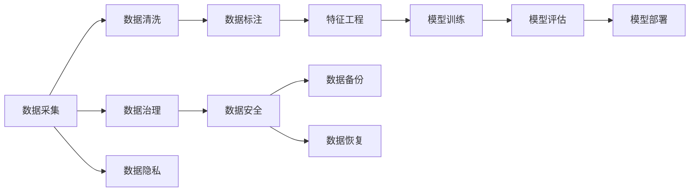
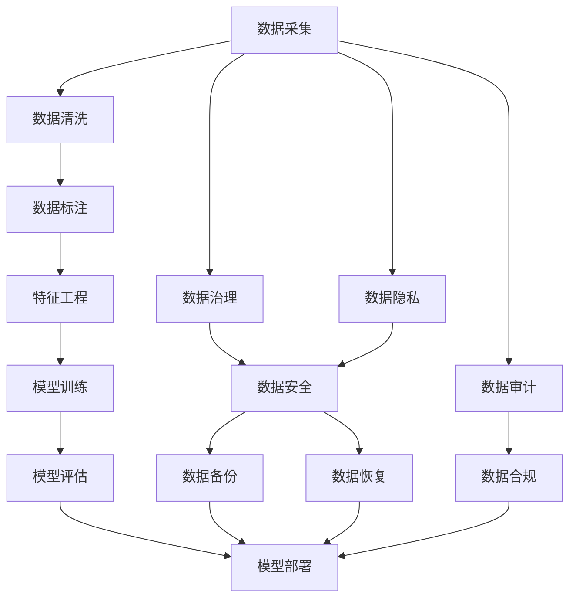

                 

# 人工智能创业数据管理的策略指南

> 关键词：人工智能,数据管理,创业策略,数据治理,数据隐私,数据安全

## 1. 背景介绍

### 1.1 问题由来
随着人工智能技术的迅猛发展，越来越多的初创企业开始探索其商业化应用，而数据管理成为了核心竞争力之一。由于人工智能系统的性能高度依赖于数据质量，数据管理的重要性不言而喻。然而，如何在资源有限的情况下，高效、安全地管理数据，是困扰许多初创企业的重要难题。本指南将针对这一问题，提供一系列策略和方法，帮助初创企业构建有效的数据管理体系，从而提升其人工智能项目的成功概率。

### 1.2 问题核心关键点
数据管理涉及数据的收集、存储、清洗、标注、处理和应用等环节。有效的数据管理需要考虑数据质量、数据隐私、数据安全、数据治理等多个维度。以下是数据管理中需要注意的关键点：

- 数据收集：确保数据的广泛性、多样性和代表性，以便模型训练出更加通用和鲁棒的算法。
- 数据清洗：处理缺失值、异常值、噪音等数据问题，提升数据质量。
- 数据标注：为模型提供高质量的标签信息，确保训练数据与实际应用场景相匹配。
- 数据处理：进行特征工程，提取、筛选、组合、降维等操作，提升模型的性能。
- 数据治理：制定数据标准、流程和责任体系，保障数据管理的规范性和一致性。
- 数据安全：保护数据不被未经授权的访问、篡改和使用，确保数据的隐私和安全。

### 1.3 问题研究意义
数据管理不仅是技术问题，更是战略问题。有效的数据管理能够保障企业的人工智能项目顺利进行，提升项目的成功率，从而加速其商业化进程。具体而言，数据管理对于人工智能创业项目的重要性体现在以下几个方面：

1. **数据质量**：高质量的数据是机器学习算法成功的关键，能有效提升模型性能和泛化能力。
2. **成本控制**：数据管理有助于降低数据采集、清洗、标注和处理的成本，优化资源分配。
3. **风险防范**：合理的数据治理和隐私保护策略，能够有效防范数据泄露和滥用，保障企业利益。
4. **合规性**：遵循数据法律法规，确保企业在运营过程中符合合规要求，避免法律风险。
5. **可持续发展**：建立长期的数据积累和优化机制，提升企业的可持续发展能力。

## 2. 核心概念与联系

### 2.1 核心概念概述

为更好地理解人工智能创业项目的数据管理策略，本节将介绍几个关键概念及其相互关系：

- **数据管理(Data Management)**：涉及数据的采集、存储、清洗、标注、处理和应用等多个环节，是确保数据质量、隐私和安全的核心手段。
- **数据治理(Data Governance)**：制定数据标准、流程和责任体系，确保数据管理的规范性和一致性。
- **数据隐私(Data Privacy)**：保护数据不被未经授权的访问和使用，保障用户隐私权益。
- **数据安全(Data Security)**：防止数据泄露、篡改和滥用，确保数据完整性和可用性。
- **人工智能(AI)**：利用数据驱动的算法和模型，实现自动化决策和智能交互，解决实际问题。
- **机器学习(Machine Learning)**：从数据中学习和改进算法，提升模型的预测和推理能力。

这些概念通过数据流图表示，如下所示：



### 2.2 核心概念原理和架构的 Mermaid 流程图

通过以下流程图，可以更直观地理解数据管理的各个环节及其相互关系：



### 2.3 核心概念联系

数据管理涉及数据的收集、清洗、标注、处理和应用等多个环节，每个环节都有相应的技术和策略支持。例如，数据采集需要确保数据的广度和多样性，数据清洗和标注需要遵循数据标准，特征工程和模型训练需要优化算法，数据治理和隐私保护需要规范流程，数据安全需要技术手段保障。

## 3. 核心算法原理 & 具体操作步骤

### 3.1 算法原理概述

数据管理的具体技术手段包括数据清洗、数据标注、特征工程、模型训练等。其中，数据清洗和标注是数据管理的基础，特征工程和模型训练是数据管理的关键。以下是这些技术手段的算法原理概述：

- **数据清洗**：包括缺失值处理、异常值检测、噪音过滤等，通过统计分析、规则匹配等方法，提升数据质量。
- **数据标注**：通过人工或半自动方式，为数据添加标签信息，为模型提供训练信号。
- **特征工程**：通过提取、筛选、组合、降维等操作，提升数据的表征能力和模型的泛化能力。
- **模型训练**：通过优化算法和损失函数，最小化模型预测与真实标签的差异，提升模型的性能。

### 3.2 算法步骤详解

基于以上算法原理，数据管理的具体操作步骤可以概括为以下几个步骤：

**Step 1: 数据采集**
- 收集业务相关的数据，确保数据的广度和多样性，涵盖各个业务场景。
- 确保数据的合法性，遵守数据收集法律法规。

**Step 2: 数据清洗**
- 对数据进行缺失值处理、异常值检测和噪音过滤，确保数据质量。
- 使用统计分析、规则匹配等方法，提升数据准确性。

**Step 3: 数据标注**
- 根据任务需求，设计合理的标注标准和流程。
- 对数据进行标注，确保标签信息的质量和一致性。

**Step 4: 特征工程**
- 设计特征提取和筛选策略，提升数据的表征能力。
- 对数据进行降维、组合等操作，减少冗余信息，提升模型效率。

**Step 5: 模型训练**
- 选择合适的算法和损失函数，进行模型训练。
- 在训练过程中，进行模型评估和调整，优化模型性能。

**Step 6: 模型部署**
- 将训练好的模型部署到生产环境中，确保模型可用性。
- 进行模型监控和调优，确保模型稳定运行。

### 3.3 算法优缺点

数据管理技术具有以下优点：

- **提升模型性能**：通过数据清洗和标注，提升数据质量，从而提升模型的性能和泛化能力。
- **降低成本**：通过自动化清洗和标注，降低数据处理成本，优化资源分配。
- **规范流程**：通过数据治理和隐私保护，确保数据管理的规范性和一致性，降低法律风险。

同时，数据管理也存在以下缺点：

- **技术复杂性**：数据清洗、标注和处理等环节需要较高的技术水平和经验。
- **数据隐私风险**：数据泄露和滥用可能带来隐私风险和法律责任。
- **数据依赖性强**：数据质量对模型性能有直接影响，数据不足或质量差可能导致模型失效。

### 3.4 算法应用领域

数据管理技术在多个领域都有广泛应用，例如：

- **金融风控**：通过数据采集、清洗、标注和处理，提升金融模型的准确性和稳定性。
- **医疗健康**：通过数据治理和隐私保护，确保患者数据的隐私和安全，提升医疗诊断的准确性。
- **智能制造**：通过数据清洗和特征工程，提升工业数据的质量，优化生产过程。
- **电商推荐**：通过数据标注和特征工程，提升推荐系统的个性化和精准度。
- **交通出行**：通过数据采集和处理，提升交通预测和调度的准确性和实时性。

## 4. 数学模型和公式 & 详细讲解 & 举例说明

### 4.1 数学模型构建

数据管理的数学模型包括数据清洗模型、数据标注模型、特征工程模型和模型训练模型。以下是这些模型的数学构建和公式推导：

**数据清洗模型**：
- 缺失值处理：使用均值、中位数等方法填补缺失值。
- 异常值检测：使用Z-score、IQR等方法检测异常值。

**数据标注模型**：
- 标签分布：假设标注数据服从二项分布，使用极大似然估计方法计算标签概率。
- 标注算法：使用半监督学习算法，如LDA、CTM等，进行标注任务。

**特征工程模型**：
- 特征提取：使用PCA、ICA等方法，进行主成分分析和独立成分分析。
- 特征降维：使用PCA、LDA等方法，进行特征降维。

**模型训练模型**：
- 监督学习：使用交叉熵损失函数，最小化模型预测与真实标签的差异。
- 无监督学习：使用KL散度损失函数，最小化模型输出的概率分布与真实分布的差异。

### 4.2 公式推导过程

以下是数据管理中常用的数学公式推导过程：

**缺失值处理**：
- 均值填补：$\hat{x}_i = \frac{\sum_{j=1}^n x_j}{n}$
- 中位数填补：$\hat{x}_i = \text{median}(x_1, x_2, ..., x_n)$

**异常值检测**：
- Z-score：$z = \frac{x - \mu}{\sigma}$
- IQR：$IQR = \text{Q}_3 - \text{Q}_1$

**标签分布**：
- 二项分布：$P(X=k) = \binom{n}{k}p^k(1-p)^{n-k}$
- 极大似然估计：$\hat{p} = \frac{\sum_{i=1}^n x_i}{n}$

**特征提取**：
- PCA：$\hat{X} = U \Sigma V^T$
- ICA：$\hat{X} = S V^T$

**特征降维**：
- PCA：$\hat{X} = U \Sigma$
- LDA：$\hat{X} = U \Lambda V^T$

**监督学习**：
- 交叉熵损失：$\mathcal{L} = -\frac{1}{N}\sum_{i=1}^N \sum_{j=1}^C y_{ij}\log \hat{y}_{ij} + (1-y_{ij})\log(1-\hat{y}_{ij})$

**无监督学习**：
- KL散度损失：$\mathcal{L} = \frac{1}{N}\sum_{i=1}^N \sum_{j=1}^C (y_{ij}\log\frac{y_{ij}}{\hat{y}_{ij}} + (1-y_{ij})\log\frac{1-y_{ij}}{1-\hat{y}_{ij}})$

### 4.3 案例分析与讲解

以下以一个具体的金融风控项目为例，讲解数据管理的步骤和方法：

**项目背景**：一家金融科技公司需要构建风控模型，预测客户的违约概率，以便及时采取措施。

**数据采集**：
- 收集客户的个人信息、交易记录、信用记录等数据。
- 确保数据的合法性，遵守数据隐私法律法规。

**数据清洗**：
- 检测并处理缺失值和异常值，确保数据质量。
- 使用统计分析方法，提升数据准确性。

**数据标注**：
- 设计合理的标注标准，标注客户的违约与否。
- 使用半监督学习算法，提升标注效率和质量。

**特征工程**：
- 提取客户的个人信息、交易行为、信用记录等特征。
- 使用PCA降维，减少特征冗余，提升模型效率。

**模型训练**：
- 选择合适的算法和损失函数，进行模型训练。
- 在训练过程中，进行模型评估和调整，优化模型性能。

## 5. 项目实践：代码实例和详细解释说明

### 5.1 开发环境搭建

进行数据管理项目实践前，需要准备好开发环境。以下是使用Python进行Pandas、Scikit-learn等库的开发环境配置流程：

1. 安装Anaconda：从官网下载并安装Anaconda，用于创建独立的Python环境。

2. 创建并激活虚拟环境：
```bash
conda create -n data-management python=3.8 
conda activate data-management
```

3. 安装Pandas、Scikit-learn等库：
```bash
conda install pandas scikit-learn numpy matplotlib tqdm jupyter notebook ipython
```

4. 安装TensorFlow和PyTorch等深度学习框架：
```bash
conda install tensorflow pytorch torchvision torchaudio
```

完成上述步骤后，即可在`data-management`环境中开始项目实践。

### 5.2 源代码详细实现

以下是使用Pandas和Scikit-learn进行数据清洗和特征工程的代码实现。

```python
import pandas as pd
from sklearn.preprocessing import StandardScaler, MinMaxScaler
from sklearn.decomposition import PCA
from sklearn.model_selection import train_test_split

# 读取数据集
data = pd.read_csv('data.csv')

# 处理缺失值
data.fillna(data.mean(), inplace=True)

# 处理异常值
z_scores = data.zscore()
abs_z_scores = np.abs(z_scores)
filtered_entries = (abs_z_scores < 3).all(axis=1)
data = data[filtered_entries]

# 数据标准化
scaler = StandardScaler()
data_scaled = scaler.fit_transform(data)

# 特征降维
pca = PCA(n_components=2)
data_reduced = pca.fit_transform(data_scaled)

# 划分训练集和测试集
X_train, X_test, y_train, y_test = train_test_split(data_reduced, data['target'], test_size=0.2, random_state=42)
```

### 5.3 代码解读与分析

**数据读取**：
- 使用Pandas的`read_csv`方法读取数据集，方便后续操作。

**缺失值处理**：
- 使用均值填补缺失值，确保数据完整性。
- 使用Z-score检测异常值，通过统计分析方法提升数据质量。

**数据标准化**：
- 使用`StandardScaler`进行数据标准化，使数据分布更符合正态分布，提升模型性能。

**特征降维**：
- 使用PCA进行特征降维，减少特征冗余，提升模型效率。
- 使用`train_test_split`方法划分训练集和测试集，方便模型评估和调优。

## 6. 实际应用场景

### 6.1 金融风控

数据管理在金融风控领域有广泛应用。金融风控模型需要处理大量的客户数据，包括个人信息、交易记录、信用记录等。通过数据清洗、标注和特征工程，能够提升模型的准确性和稳定性，帮助金融机构预测客户违约概率，及时采取措施，降低损失。

### 6.2 医疗健康

医疗数据管理涉及患者隐私保护和数据安全。通过数据治理和隐私保护，确保患者数据的隐私和安全，提升医疗诊断的准确性。例如，在电子病历系统中，通过数据标注和特征工程，提升诊断模型的精准度，帮助医生进行更准确的疾病预测和诊断。

### 6.3 智能制造

在智能制造领域，数据管理可以优化生产过程，提升生产效率和质量。通过数据采集、清洗和标注，提升工业数据的质量，优化生产过程，减少生产成本和资源浪费。

### 6.4 电商推荐

电商推荐系统需要处理大量的用户行为数据，包括浏览记录、购买记录等。通过数据清洗和特征工程，提升推荐系统的个性化和精准度，帮助电商平台提升用户满意度和销售额。

### 6.5 交通出行

交通出行领域的数据管理可以提升交通预测和调度的准确性和实时性。通过数据采集和处理，实时获取交通流量和路况信息，优化交通调度，减少交通拥堵，提升交通效率。

## 7. 工具和资源推荐

### 7.1 学习资源推荐

为了帮助开发者系统掌握数据管理的技术基础和实践技巧，这里推荐一些优质的学习资源：

1. **Python数据科学手册**：由Jake VanderPlas所著，全面介绍了Python数据科学的基础知识和高级技巧，是数据管理领域的经典教材。
2. **Scikit-learn官方文档**：Scikit-learn的官方文档，详细介绍了机器学习和数据预处理的方法和案例，适合初学者和进阶者。
3. **TensorFlow官方文档**：TensorFlow的官方文档，包含深度学习模型的实现和调优方法，是深度学习领域的权威资源。
4. **Kaggle竞赛**：Kaggle举办的数据科学竞赛，提供丰富的数据集和挑战任务，适合实战练习。
5. **Coursera课程**：Coursera提供的机器学习和数据科学课程，由斯坦福、MIT等知名大学开设，涵盖广泛的内容和案例。

通过对这些资源的学习实践，相信你一定能够快速掌握数据管理的精髓，并用于解决实际的NLP问题。

### 7.2 开发工具推荐

高效的数据管理开发离不开优秀的工具支持。以下是几款常用的数据管理开发工具：

1. **Jupyter Notebook**：用于数据探索和分析，支持代码执行、结果可视化等，适合初学者和中级开发者。
2. **Pandas**：数据处理和分析工具，提供丰富的数据清洗、处理和分析方法，适合中级开发者。
3. **Scikit-learn**：机器学习库，提供丰富的模型训练和评估方法，适合中级和高级开发者。
4. **TensorFlow**：深度学习框架，提供丰富的模型训练和优化方法，适合高级开发者。
5. **Dask**：分布式计算框架，支持大规模数据处理和分析，适合高级开发者。

合理利用这些工具，可以显著提升数据管理的开发效率，加快创新迭代的步伐。

### 7.3 相关论文推荐

数据管理技术的发展得益于学界的持续研究。以下是几篇奠基性的相关论文，推荐阅读：

1. **Big Data: A Revolution That Will Transform How We Live, Work, and Think**：Viktor Mayer-Schönberger和Kenneth Cukier所著，深入分析了大数据时代的机遇与挑战，适合宏观理解和战略思考。
2. **Data Governance: The Power of Its Structure to Develop Datasets for Analysis and Reporting**：John Miller所著，介绍了数据治理的概念和实践，适合学习数据管理的基础知识。
3. **Data Privacy: How to Implement a Successful Privacy Program**：Carl Staelin所著，介绍了数据隐私保护的方法和策略，适合了解数据隐私管理的实践方法。
4. **The Datasets of All Machine Learning Practice Notebooks**：Andrew Ng所著，介绍了大规模数据集管理和处理的案例，适合学习数据管理的实战技巧。
5. **Deep Learning with Python**：François Chollet所著，介绍了深度学习模型的实现和调优方法，适合深入学习数据管理的高级应用。

这些论文代表了大数据和人工智能领域的研究进展，通过学习这些前沿成果，可以帮助研究者把握学科前进方向，激发更多的创新灵感。

## 8. 总结：未来发展趋势与挑战

### 8.1 研究成果总结

本节对人工智能创业数据管理策略进行总结，明确了数据管理的重要性和当前面临的挑战。通过分析数据管理的核心概念和关键技术，提出了具体的操作方法，为初创企业提供了系统化的指导。

### 8.2 未来发展趋势

展望未来，数据管理技术将呈现以下几个发展趋势：

1. **自动化和智能化**：通过AI技术自动化数据管理流程，提升数据处理效率和质量。
2. **大数据与云计算结合**：利用云计算平台处理大规模数据，提升数据处理能力和资源利用率。
3. **实时数据管理**：通过实时数据采集和处理，提升数据的时效性和实时性。
4. **数据隐私保护**：随着数据泄露事件的频发，数据隐私保护技术将更加重要，成为数据管理的核心课题。
5. **数据治理**：数据治理将成为数据管理的核心手段，确保数据管理的规范性和一致性。

### 8.3 面临的挑战

尽管数据管理技术已经取得了一定的进展，但在实际应用中仍面临诸多挑战：

1. **数据质量控制**：数据采集、清洗和标注的自动化程度有待提升，数据质量控制仍需依赖人工干预。
2. **数据隐私保护**：数据隐私保护技术仍需进一步完善，确保数据安全性和合规性。
3. **数据治理复杂性**：数据治理流程涉及多个环节，规范化和一致性的保障难度较大。
4. **技术平台选择**：选择合适的数据管理工具和平台，优化资源配置，仍需大量的实践经验和评估。
5. **成本控制**：数据管理和处理的成本较高，如何在资源有限的情况下高效管理数据，仍需不断探索和优化。

### 8.4 研究展望

数据管理技术的研究展望主要集中在以下几个方面：

1. **自动化和智能化**：探索自动化数据管理方法，提升数据处理效率和质量。
2. **大数据与云计算结合**：利用云计算平台处理大规模数据，提升数据处理能力和资源利用率。
3. **实时数据管理**：通过实时数据采集和处理，提升数据的时效性和实时性。
4. **数据隐私保护**：探索更加有效的数据隐私保护技术，确保数据安全性和合规性。
5. **数据治理**：建立系统化的数据治理流程，确保数据管理的规范性和一致性。

总之，数据管理技术在人工智能创业项目中具有重要地位，未来需要在自动化、智能化、大数据、云计算等多个方向寻求突破，进一步提升数据管理的效率和质量，为人工智能项目的成功奠定坚实基础。

## 9. 附录：常见问题与解答

**Q1：数据管理是否适合所有项目？**

A: 数据管理适合大多数需要数据支持的项目，尤其是涉及复杂决策和智能交互的项目。例如，金融风控、医疗健康、智能制造、电商推荐、交通出行等。但数据管理的效果和成本也取决于项目的复杂度和数据量。对于数据量较小、数据类型简单的项目，可以考虑简化数据管理流程。

**Q2：如何选择合适的数据管理工具？**

A: 选择合适的数据管理工具需要考虑多个因素，包括数据量、数据类型、项目需求、技术栈等。对于大规模数据处理和分布式计算，可以选择Dask、Hadoop、Spark等工具。对于数据分析和探索，可以选择Pandas、Jupyter Notebook等工具。对于机器学习建模和优化，可以选择Scikit-learn、TensorFlow等工具。选择合适的工具可以提高数据管理的效率和质量。

**Q3：数据管理是否需要大量标注数据？**

A: 数据管理需要一定量的标注数据来训练模型，提升数据标注的质量和一致性。但数据标注的成本较高，需要权衡数据量和标注成本之间的关系。对于标注成本高、标注数据不足的项目，可以考虑使用无监督学习或半监督学习的方法，降低对标注数据的依赖。

**Q4：数据管理是否需要大量技术资源？**

A: 数据管理需要一定的技术资源和经验，包括数据清洗、特征工程、模型训练等环节。但可以通过自动化和智能化技术提升数据管理的效率，降低技术资源的需求。例如，使用自动化的数据清洗工具、半监督学习算法、自动化特征工程工具等，可以显著提升数据管理的效率和质量。

**Q5：数据管理是否需要高成本？**

A: 数据管理确实需要一定的成本，包括数据采集、清洗、标注和处理的成本。但通过优化数据管理流程，可以降低成本。例如，选择合适的数据采集方式、优化数据清洗流程、使用半监督学习算法等，可以降低数据管理的成本和复杂度。

**Q6：数据管理如何保障数据安全？**

A: 数据安全是数据管理的核心问题之一。通过数据加密、访问控制、数据备份和恢复等技术手段，可以保障数据的安全性和隐私性。同时，制定严格的数据管理和使用规范，建立数据安全和隐私保护机制，确保数据管理的安全性和合规性。

**Q7：数据管理如何确保数据质量？**

A: 数据质量是数据管理的核心目标之一。通过数据清洗、标注和处理等技术手段，可以提升数据的质量和一致性。同时，建立数据质量控制机制，定期评估和优化数据质量，确保数据管理的效果和可靠性。

总之，数据管理是人工智能创业项目成功的重要保障，需要系统化的管理和技术手段支持。通过自动化、智能化、大数据、云计算等技术的不断进步，未来数据管理将更加高效、便捷和可靠，为人工智能项目的成功奠定坚实基础。

---

作者：禅与计算机程序设计艺术 / Zen and the Art of Computer Programming

