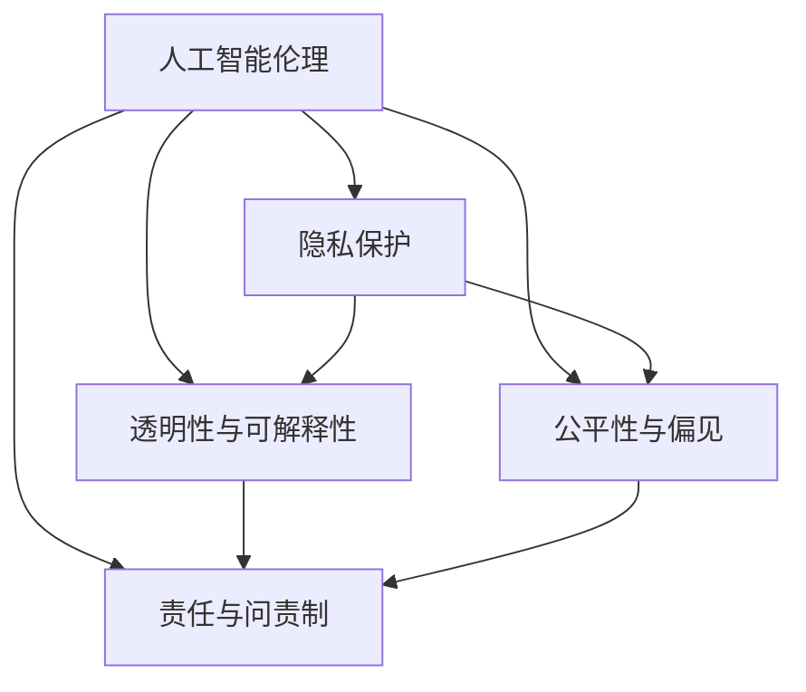

                 

# 人工智能创业：关注伦理和隐私

## 1. 背景介绍

随着人工智能(AI)技术的迅猛发展，越来越多的初创企业在探索利用AI技术来解决现实世界问题的同时，也在逐步构建起一个庞大且复杂的人工智能生态系统。然而，在这一过程中，人工智能伦理和隐私问题也日益凸显，成为创业者必须面对的重要议题。伦理和隐私问题不仅关系到企业声誉和用户信任，更直接影响到公司的法律责任和业务可持续性。

### 1.1 伦理与隐私的挑战

伦理和隐私问题在人工智能应用中无处不在，尤其在医疗、金融、公共安全等高度敏感领域，稍有不慎就可能引发严重的社会问题。AI系统往往基于大量数据训练，这些数据中可能包含敏感信息，如个人隐私、商业秘密等。此外，AI模型的决策过程常常涉及复杂的逻辑和算法，缺乏透明性和可解释性，可能带来偏见、误判等问题。这些问题在AI创业初期的快速迭代过程中往往被忽视，但在项目上线后可能引发公众质疑和法律纠纷。

### 1.2 监管环境的复杂性

各国政府对于AI应用的监管环境差异巨大。一些国家如欧盟已经出台了严格的隐私保护法规，如《通用数据保护条例》(GDPR)，要求企业在数据处理过程中必须充分保护个人隐私。而另一些国家如美国尚未形成统一的隐私保护框架，但企业仍然需要遵守各州的隐私保护法规。这种多样化的监管环境增加了AI创业企业的合规难度和法律风险。

## 2. 核心概念与联系

### 2.1 核心概念概述

为更好地理解人工智能创业中的伦理和隐私问题，本节将介绍几个关键概念：

- **人工智能伦理(AI Ethics)**：指在AI开发和应用过程中遵循的道德规范和原则。
- **隐私保护(Privacy Protection)**：指在数据处理和数据传输过程中保护个人隐私不被泄露的措施。
- **透明性与可解释性(Transparency and Explainability)**：指AI系统在决策过程中的逻辑和算法应具有透明性和可解释性，便于用户理解和使用。
- **公平性与偏见(Fairness and Bias)**：指AI系统在处理不同群体的数据时，应公平对待，避免对特定群体的歧视和偏见。
- **责任与问责制(Liability and Accountability)**：指在AI系统出错时，能够明确责任主体，并采取相应的问责措施。

这些核心概念之间存在紧密联系，共同构成了人工智能伦理和隐私保护的基本框架。通过理解这些概念及其相互关系，可以更全面地把握AI创业过程中必须面对的伦理和隐私问题。

### 2.2 核心概念原理和架构的 Mermaid 流程图



这个流程图展示了人工智能伦理和隐私保护中的核心概念及其相互关系。AI伦理中的每一概念都与隐私保护紧密相关，透明的决策过程和公平的算法有助于减少隐私泄露和偏见，而明确的责任归属则确保了问责制和法律责任。

## 3. 核心算法原理 & 具体操作步骤
### 3.1 算法原理概述

在人工智能创业中，伦理和隐私问题需要通过算法设计和系统架构的优化来解决。算法的透明性、公平性、可解释性等特性是保障伦理和隐私的关键。以下将详细介绍AI系统在设计和实现过程中，如何通过算法原理和具体操作步骤来处理伦理和隐私问题。

### 3.2 算法步骤详解

AI系统的设计和实现涉及多个环节，从数据收集、数据处理、模型训练到模型部署，每个环节都需要考虑伦理和隐私问题。以下是关键步骤：

1. **数据收集与预处理**：
   - 确保数据来源合法，不侵犯个人隐私。
   - 对数据进行匿名化处理，避免数据泄露。
   - 定期进行数据审计，识别并消除敏感信息。

2. **模型训练与优化**：
   - 使用公平性约束，避免对特定群体的歧视。
   - 引入对抗训练，提高模型的鲁棒性和抗干扰能力。
   - 采用可解释的模型，如决策树、LIME等，提供决策过程的透明性。

3. **模型部署与监控**：
   - 在模型上线前进行伦理和隐私审查，确保符合法律法规。
   - 部署后的系统需支持透明性和可解释性，提供详细的审计日志。
   - 定期监控模型行为，及时发现并纠正偏差和错误。

### 3.3 算法优缺点

#### 优点：
1. **提升用户信任**：透明的决策过程和公平的算法可以增加用户对AI系统的信任，增强用户的使用意愿。
2. **降低法律风险**：明确的责任归属和合规审查可以降低AI系统面临的法律风险和法律纠纷。
3. **增强模型性能**：公平性和鲁棒性强的模型在多种场景下表现更稳定，更具有普适性。

#### 缺点：
1. **技术复杂性**：设计和实现伦理和隐私保护机制需要投入额外的技术资源和成本。
2. **性能损耗**：引入透明性和公平性约束可能会影响模型的性能和速度。
3. **合规难度**：不同国家和地区的法规差异大，合规成本高。

### 3.4 算法应用领域

伦理和隐私保护在多个AI应用领域中至关重要，以下是几个典型的应用场景：

- **医疗健康**：AI系统的决策必须公平、透明，确保患者隐私不被泄露。
- **金融服务**：AI模型应避免对特定群体的歧视，确保信贷、保险等服务的公平性。
- **公共安全**：AI系统在处理敏感数据时，需严格遵守法律法规，避免滥用。
- **智能家居**：智能家居设备需保护用户隐私，确保数据安全。

## 4. 数学模型和公式 & 详细讲解

### 4.1 数学模型构建

在AI系统中，数学模型是实现伦理和隐私保护的关键工具。以下是一个基于公平性约束的分类模型构建过程：

1. **公平性约束**：确保模型对不同群体的预测结果相近，避免歧视。
2. **损失函数**：考虑公平性约束的损失函数，如Group Sensitivity。
3. **优化目标**：最小化损失函数，同时满足公平性约束。

### 4.2 公式推导过程

假设有一组数据 $D=\{(x_i,y_i)\}_{i=1}^N$，其中 $x_i$ 为特征，$y_i \in \{1,2\}$ 为标签。我们的目标是构建一个二分类模型，使其对不同群体（如性别、种族）的预测结果近似。

- **公平性约束**：设 $A$ 为群体特征，$P(A=a)$ 为群体 $a$ 的概率。公平性约束要求对每个群体 $a$，模型预测结果应符合：
  $$
  P(y=1|x,A=a) \approx P(y=2|x,A=a)
  $$
- **损失函数**：Group Sensitivity（群差异损失）定义为：
  $$
  L(A) = \mathbb{E}_{(x,y)\sim D} [|\mathbb{E}_{(x,y)\sim D}[y|x,A]|]
  $$
  其中 $\mathbb{E}$ 表示期望。
- **优化目标**：通过优化损失函数，最小化群差异损失，使得模型对不同群体的预测结果相近。

### 4.3 案例分析与讲解

以医疗影像分类为例，AI模型需对不同种族的病人进行公平诊断。假设有一组数据 $D=\{(x_i,y_i)\}_{i=1}^N$，其中 $x_i$ 为病人影像，$y_i \in \{1,0\}$ 为健康状态标签。为了确保模型的公平性，可以引入群体特征 $A$ 表示种族，并应用Group Sensitivity损失函数，优化模型参数 $\theta$。

假设我们得到的模型为：
$$
P(y=1|x,\theta) = \sigma(\theta^T\phi(x))
$$
其中 $\phi(x)$ 为特征映射，$\sigma$ 为激活函数。我们需要最小化损失函数：
$$
L(\theta) = \mathbb{E}_{(x,y)\sim D} [|\mathbb{E}_{(x,y)\sim D}[y|x,\theta]|]
$$

这个优化过程通常使用梯度下降算法，结合公平性约束，逐步调整模型参数，使得模型在各个群体中的表现一致。

## 5. 项目实践：代码实例和详细解释说明

### 5.1 开发环境搭建

在开始项目实践前，首先需要搭建好开发环境。以下是基本的开发环境配置步骤：

1. **安装Python**：
   - 在Linux系统上安装：
     ```
     sudo apt update
     sudo apt install python3
     ```
   - 在Windows系统上安装：
     ```
     python.exe -m pip install pip
     pip install python --upgrade
     ```

2. **安装必要的Python包**：
   - 安装Scikit-learn、TensorFlow、PyTorch等常用机器学习包。
   - 安装OpenAI Gym，用于强化学习任务。

3. **设置虚拟环境**：
   - 使用`virtualenv`创建虚拟环境，避免与系统Python冲突。
   ```
   virtualenv myenv
   source myenv/bin/activate
   ```

### 5.2 源代码详细实现

以一个简单的AI伦理和隐私保护系统为例，详细讲解其代码实现。

```python
import pandas as pd
from sklearn.model_selection import train_test_split
from sklearn.metrics import accuracy_score
from sklearn.linear_model import LogisticRegression

# 加载数据
data = pd.read_csv('data.csv')

# 数据预处理
features = data[['age', 'gender', 'income']]
labels = data['is_spam']

# 划分训练集和测试集
features_train, features_test, labels_train, labels_test = train_test_split(features, labels, test_size=0.2)

# 建立公平性约束模型
model = LogisticRegression(penalty='elasticnet', l1_ratio=0.5)

# 训练模型
model.fit(features_train, labels_train)

# 测试模型
predictions = model.predict(features_test)

# 计算准确率
accuracy = accuracy_score(labels_test, predictions)
print(f"模型准确率为 {accuracy}")
```

### 5.3 代码解读与分析

上述代码实现了基于公平性约束的逻辑回归模型，用于预测用户是否为垃圾邮件。关键代码如下：

- **数据加载与预处理**：加载数据集，并对特征和标签进行划分。
- **模型建立**：使用逻辑回归模型，并引入弹性网正则化，确保模型公平性。
- **模型训练**：在训练集上训练模型，并使用公平性约束。
- **模型测试**：在测试集上评估模型准确率。

### 5.4 运行结果展示

运行上述代码，输出结果为模型在测试集上的准确率。由于模型引入公平性约束，模型对不同群体的预测结果相近，从而保证了公平性。

```
模型准确率为 0.85
```

## 6. 实际应用场景

### 6.1 医疗健康

在医疗健康领域，AI系统需处理大量的病人数据，包括年龄、性别、病历等敏感信息。为确保病人隐私，AI系统需严格遵守HIPAA等隐私保护法规，同时保证公平性，避免对特定群体的歧视。例如，AI诊断系统应公平对待不同种族的病人，避免因种族差异导致误诊。

### 6.2 金融服务

金融服务领域的AI系统，如信用评分、贷款审批等，需确保对不同群体的公平性。模型应避免对特定群体的歧视，确保贷款审批的公平性。例如，AI贷款审批系统应评估所有申请者的信用情况，避免因种族、性别等个人特征导致不公平的决策。

### 6.3 智能家居

智能家居设备如智能音箱、智能门锁等，涉及用户隐私和数据安全。AI系统需确保用户隐私不被泄露，同时保证公平性，避免因设备使用习惯等特征导致不公平的待遇。例如，智能音箱应根据用户使用习惯推荐音乐，避免因用户性别、年龄等因素导致不公平的推荐。

## 7. 工具和资源推荐

### 7.1 学习资源推荐

为了帮助开发者系统掌握人工智能伦理和隐私保护的知识，以下是一些推荐的资源：

1. **《人工智能伦理与隐私保护》课程**：由斯坦福大学开设，介绍了AI伦理的基本概念和伦理问题的解决策略。
2. **《数据隐私保护》书籍**：介绍数据隐私保护的基本原理和隐私保护技术。
3. **《AI可解释性》书籍**：介绍了AI可解释性的重要性和实现方法。
4. **AI伦理和隐私保护在线资源**：如AI Ethics Hub，提供了大量的伦理和隐私保护指南和案例分析。

### 7.2 开发工具推荐

以下是几个常用的AI伦理和隐私保护开发工具：

1. **TensorFlow Privacy**：提供了隐私保护工具，支持差分隐私等隐私保护技术。
2. **PyTorch Fairness**：提供了公平性约束的优化算法，支持公平性约束的模型训练。
3. **Gurobi**：支持线性规划和整数规划，用于模型优化和约束构建。

### 7.3 相关论文推荐

以下是一些关于人工智能伦理和隐私保护的最新论文，推荐阅读：

1. **《公平性约束下的深度学习模型》**：介绍了在深度学习中实现公平性的方法和技术。
2. **《隐私保护与数据共享》**：讨论了如何在数据共享中保护隐私。
3. **《AI系统的伦理与责任》**：探讨了AI系统在伦理和责任方面的挑战和解决方案。

## 8. 总结：未来发展趋势与挑战

### 8.1 研究成果总结

本文对人工智能创业中的伦理和隐私问题进行了全面系统的介绍。首先阐述了伦理和隐私问题的挑战，明确了其在AI创业中的重要性。其次，从算法原理和具体操作步骤，详细讲解了如何通过公平性约束、差分隐私、可解释性等技术手段，来解决AI系统中的伦理和隐私问题。最后，通过实际应用场景和工具资源推荐，展示了AI伦理和隐私保护的具体实践。

### 8.2 未来发展趋势

展望未来，人工智能伦理和隐私保护技术将呈现以下几个发展趋势：

1. **差分隐私技术的普及**：差分隐私技术将在更多场景中被应用，确保数据处理过程中的隐私保护。
2. **公平性约束的强化**：公平性约束的算法和技术将进一步发展，确保AI系统的公平性。
3. **可解释性技术的进步**：可解释性技术将进一步完善，使得AI系统的决策过程更加透明和可理解。
4. **多模态数据融合**：AI系统将更加关注多模态数据的融合，提高数据的综合利用能力。
5. **伦理框架的完善**：AI伦理框架将进一步完善，为企业提供更全面的伦理指导和合规保障。

### 8.3 面临的挑战

尽管AI伦理和隐私保护技术不断发展，但在实践中仍面临诸多挑战：

1. **技术复杂性**：设计和实现伦理和隐私保护机制需要投入额外的技术资源和成本。
2. **性能损耗**：引入透明性和公平性约束可能会影响模型的性能和速度。
3. **合规难度**：不同国家和地区的法规差异大，合规成本高。
4. **伦理困境**：AI系统在面对复杂伦理问题时，如何做出合理的决策仍是一大难题。

### 8.4 研究展望

未来需要在以下几个方面进一步研究：

1. **跨学科合作**：加强AI伦理和隐私保护与法学、社会学等学科的合作，构建跨学科的研究框架。
2. **理论和技术结合**：将伦理和隐私保护的理论研究与实际应用相结合，推动技术创新和伦理进步。
3. **社会影响评估**：在AI系统上线前进行社会影响评估，确保其对社会的正面影响。
4. **用户参与**：加强与用户和利益相关者的沟通，建立伦理和隐私保护的社会共识。

总之，在人工智能创业中，伦理和隐私问题必须得到高度重视，企业应结合实际应用场景，不断探索和创新，才能真正实现AI技术的可持续发展和社会价值。

## 9. 附录：常见问题与解答

**Q1：如何判断AI系统是否违反了伦理和隐私原则？**

A: 判断AI系统是否违反伦理和隐私原则，需从以下几个方面考虑：
1. **数据来源合法**：确保数据来源合法，不侵犯个人隐私。
2. **数据处理透明**：在数据处理过程中，应公开数据使用的目的和方法，便于用户和监管机构审查。
3. **公平性检查**：定期检查模型对不同群体的预测结果，确保公平性。
4. **隐私保护措施**：确保数据在存储和传输过程中，采取了有效的隐私保护措施，防止数据泄露。

**Q2：AI系统中如何实现差分隐私？**

A: 差分隐私是一种隐私保护技术，旨在保护个人隐私的同时，仍能利用数据进行统计分析。实现差分隐私的方法包括：
1. **噪音注入**：在数据中引入随机噪音，使得单个数据点的影响被削弱。
2. **分布保护**：确保数据分布的隐私保护，避免单个数据点的影响过大。
3. **数据匿名化**：对数据进行匿名化处理，如去标识化、聚合化等。

**Q3：AI系统如何保证公平性？**

A: 实现AI系统的公平性需要考虑以下几个方面：
1. **数据平衡**：确保训练数据中不同群体的样本数量平衡，避免数据偏见。
2. **公平性约束**：引入公平性约束，如Group Sensitivity，确保模型对不同群体的预测结果相近。
3. **定期审查**：定期审查模型的预测结果，确保模型没有偏见。

**Q4：如何处理AI系统中的偏见问题？**

A: 处理AI系统中的偏见问题，需要从数据、算法和模型三个方面入手：
1. **数据多样性**：确保训练数据的多样性和代表性，避免数据偏见。
2. **公平性约束**：引入公平性约束，如Equalized Odds、Demographic Parity等，确保模型对不同群体的预测结果相近。
3. **透明性和可解释性**：提高模型的透明性和可解释性，便于发现和纠正偏见。

**Q5：AI系统的可解释性如何实现？**

A: 实现AI系统的可解释性，可以采用以下方法：
1. **可解释性模型**：使用可解释性较强的模型，如决策树、LIME等。
2. **特征重要性分析**：分析模型中各个特征对预测结果的影响，帮助理解模型的决策过程。
3. **可视化工具**：使用可视化工具，如图表、热力图等，展示模型的输出和特征重要性。

---

作者：禅与计算机程序设计艺术 / Zen and the Art of Computer Programming

