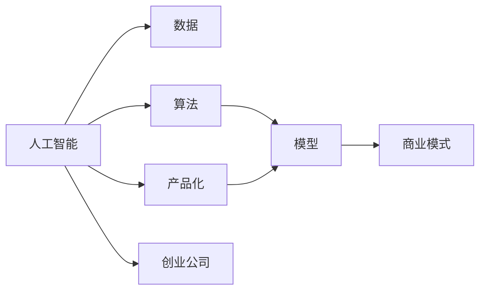

                 

# 人工智能创业：成功的秘诀

## 1. 背景介绍

在过去十年里，人工智能(AI)技术快速发展，从语音识别、图像处理到自然语言处理(NLP)等各个领域，AI逐渐从实验室走向实际应用，催生了无数颠覆性创新。在这个过程中，AI创业公司如雨后春笋般涌现，成为推动AI技术落地的重要力量。然而，创业成功从来不是一蹴而就的。成功的AI创业公司背后，离不开对技术、市场、产品和商业模式的深刻理解。本文将深入探讨AI创业公司成功的秘诀，从核心概念、算法原理、项目实践、实际应用场景、工具资源等多个维度，全面分析AI创业的战略和执行方法。

## 2. 核心概念与联系

### 2.1 核心概念概述

- **人工智能**：使用计算机算法来模拟人类智能过程的技术，包括机器学习、深度学习、强化学习等多种方法。
- **创业公司**：以创新为目标，通过创造新产品或服务来获取收入的组织形式。
- **算法**：解决问题的一系列规则和步骤，如深度学习算法用于图像识别、自然语言处理。
- **数据**：算法训练和模型预测的基础，AI创业公司需要收集、处理和分析大量数据。
- **产品化**：将技术成果转化为可用的产品或服务，以满足市场需求。
- **商业模式**：公司如何赚钱，包括收入来源、成本结构、盈利模式等。

### 2.2 核心概念原理和架构的 Mermaid 流程图



## 3. 核心算法原理 & 具体操作步骤

### 3.1 算法原理概述

AI创业的核心在于通过先进的算法和模型，解决实际问题，创造价值。AI创业公司需要具备以下核心算法和模型：

- **深度学习**：用于图像识别、语音处理、自然语言处理等领域，具有强大的非线性建模能力。
- **强化学习**：通过与环境的交互，学习最优策略，适用于智能机器人、游戏AI等领域。
- **计算机视觉**：利用图像和视频数据进行对象检测、分类和识别。
- **自然语言处理(NLP)**：处理和理解人类语言，用于对话系统、文本分析、机器翻译等。
- **推荐系统**：根据用户行为和偏好，推荐个性化内容，如电商、音乐、视频等。

### 3.2 算法步骤详解

AI创业公司的算法步骤主要包括以下几个关键步骤：

1. **需求分析**：确定目标市场的痛点和需求，明确AI解决方案的定位。
2. **数据获取**：收集相关领域的数据，进行清洗和预处理。
3. **模型训练**：选择合适的算法和模型，使用数据进行训练。
4. **模型评估**：在验证集上评估模型性能，调整超参数和优化算法。
5. **产品实现**：将模型集成到产品中，实现用户交互和反馈收集。
6. **迭代优化**：根据用户反馈和市场变化，持续优化算法和模型。

### 3.3 算法优缺点

深度学习等算法在处理大规模数据和复杂模型时具有显著优势，但需要大量标注数据和计算资源。强化学习能够自适应动态环境，但需要长时间训练和实验调整。计算机视觉和NLP算法需要处理自然语言的多样性和复杂性，对模型和算法的要求较高。推荐系统需要处理用户行为数据，对数据隐私和安全有较高要求。

### 3.4 算法应用领域

AI算法在各个领域都有广泛应用，如医疗、金融、教育、零售、制造等。AI创业公司可以根据市场需求，选择特定的领域和应用场景进行突破。

## 4. 数学模型和公式 & 详细讲解 & 举例说明

### 4.1 数学模型构建

假设我们要构建一个用于图像分类的AI模型，其数学模型可以表示为：

$$
P(Y|X,\theta) = \frac{e^{f(X;\theta)}}{\sum_{y\in Y}e^{f(X;\theta)}}
$$

其中 $X$ 表示输入的图像数据，$Y$ 表示分类标签，$\theta$ 表示模型参数，$f(X;\theta)$ 表示输入数据通过模型得到的输出。

### 4.2 公式推导过程

对于上述模型，我们需要求解最大化对数似然：

$$
\mathcal{L}(\theta) = \frac{1}{N}\sum_{i=1}^N \log P(Y_i|X_i;\theta)
$$

通过对数似然最大化，可以估计出模型参数 $\theta$。常见的优化算法包括梯度下降、Adam、SGD等。

### 4.3 案例分析与讲解

以图像分类为例，我们可以使用卷积神经网络(CNN)来构建模型。CNN通过卷积层、池化层、全连接层等组件，学习输入图像的特征表示。训练时，我们将标注好的数据集输入模型，通过反向传播更新模型参数，使模型输出逼近真实标签。

## 5. 项目实践：代码实例和详细解释说明

### 5.1 开发环境搭建

在搭建AI项目开发环境时，需要考虑以下因素：

1. **编程语言**：通常使用Python，因为其丰富的科学计算库和框架支持。
2. **框架和库**：如TensorFlow、PyTorch、Keras等深度学习框架，以及NumPy、Pandas、Matplotlib等科学计算库。
3. **硬件设备**：使用GPU或TPU进行模型训练，提高计算效率。

### 5.2 源代码详细实现

以下是一个简单的图像分类项目实现示例：

```python
import tensorflow as tf
from tensorflow.keras import layers, models

# 定义模型结构
model = models.Sequential([
    layers.Conv2D(32, (3,3), activation='relu', input_shape=(28,28,1)),
    layers.MaxPooling2D((2,2)),
    layers.Conv2D(64, (3,3), activation='relu'),
    layers.MaxPooling2D((2,2)),
    layers.Flatten(),
    layers.Dense(64, activation='relu'),
    layers.Dense(10, activation='softmax')
])

# 编译模型
model.compile(optimizer='adam',
              loss='sparse_categorical_crossentropy',
              metrics=['accuracy'])

# 训练模型
model.fit(train_images, train_labels, epochs=10, validation_data=(test_images, test_labels))
```

### 5.3 代码解读与分析

- **模型结构**：使用卷积层和池化层提取图像特征，最后通过全连接层进行分类。
- **编译模型**：选择合适的优化器、损失函数和评估指标，准备模型训练。
- **训练模型**：使用训练集数据进行模型训练，并在验证集上进行性能评估。

### 5.4 运行结果展示

训练模型后，可以使用测试集数据进行评估，计算准确率和损失函数值，验证模型的性能。

## 6. 实际应用场景

### 6.1 医疗影像分析

AI在医疗影像分析中具有重要应用，如CT、MRI等影像的自动诊断。通过深度学习算法，可以训练模型对影像中的病灶进行检测和分类。

### 6.2 金融风控

AI可以帮助金融机构进行信用评估、风险预测和欺诈检测。通过分析用户的历史行为数据，预测其还款能力或欺诈风险，提升金融服务的质量和效率。

### 6.3 智能制造

AI技术在制造业中的应用，如设备故障预测、供应链优化、质量控制等，可以显著提高生产效率和产品质量。

### 6.4 未来应用展望

未来，AI技术将继续在各个领域深入应用，推动社会进步和经济发展。AI创业公司需要不断创新，探索新领域和新技术，才能在竞争中保持领先地位。

## 7. 工具和资源推荐

### 7.1 学习资源推荐

- **Coursera**：提供大量AI和机器学习课程，如Andrew Ng的《机器学习》。
- **Udacity**：提供AI和深度学习纳米学位项目，涵盖从基础到高级的多个课程。
- **Kaggle**：数据科学和机器学习竞赛平台，通过实践项目提升技能。

### 7.2 开发工具推荐

- **TensorFlow**：Google开源的深度学习框架，适用于大规模模型训练和部署。
- **PyTorch**：Facebook开源的深度学习框架，以动态计算图著称，易于调试和迭代。
- **Jupyter Notebook**：交互式编程环境，支持Python、R等多种语言，方便开发和分享项目。

### 7.3 相关论文推荐

- **ImageNet大规模视觉识别挑战赛**：LSVRC 2012年提出的大规模视觉识别竞赛，推动了计算机视觉技术的进步。
- **AlphaGo**：DeepMind开发的围棋AI，展示了深度强化学习的强大能力。
- **BERT预训练模型**：Google发布的自然语言处理模型，推动了NLP技术的突破。

## 8. 总结：未来发展趋势与挑战

### 8.1 研究成果总结

AI创业公司通过不断的技术创新和市场探索，推动了AI技术在不同领域的落地应用，取得了显著成果。从计算机视觉到自然语言处理，从机器人到智能制造，AI技术正在改变世界的面貌。

### 8.2 未来发展趋势

未来，AI技术将更加普及和深入应用，推动社会进步和经济发展。AI创业公司需要关注以下趋势：

- **自动化和智能化**：自动化流程和智能化决策将普及各个领域，提升效率和质量。
- **跨领域融合**：AI技术与各行业融合，形成新业态和新模式。
- **数据驱动**：数据成为重要的生产要素，数据的获取、处理和分析能力将成为核心竞争力。

### 8.3 面临的挑战

AI创业公司面临诸多挑战：

- **技术难度**：深度学习、强化学习等算法需要高超的技术水平和丰富的实践经验。
- **数据获取**：高质量、大规模的数据获取和处理需要大量人力和资源。
- **市场竞争**：AI市场竞争激烈，需要不断创新才能保持领先地位。
- **伦理和安全**：AI模型可能带来的伦理问题和安全性风险，需要严格控制。

### 8.4 研究展望

AI创业公司需要关注以下研究领域：

- **可解释性AI**：提高AI模型的可解释性，增强决策透明性。
- **自适应AI**：开发自适应AI系统，根据环境变化动态调整策略。
- **多模态AI**：融合视觉、听觉、触觉等多种模态数据，增强AI系统的感知能力。
- **伦理AI**：研究AI伦理问题，确保技术的应用符合社会价值观。

## 9. 附录：常见问题与解答

**Q1: 如何选择合适的算法和模型？**

A: 需要综合考虑数据类型、问题规模、计算资源等因素。例如，图像识别适合使用卷积神经网络，自然语言处理适合使用循环神经网络和Transformer。

**Q2: 数据预处理需要注意哪些问题？**

A: 数据预处理包括数据清洗、归一化、特征工程等步骤。需要确保数据质量，避免过拟合和欠拟合。

**Q3: 模型评估指标有哪些？**

A: 常见的评估指标包括准确率、精确率、召回率、F1分数等。根据具体问题和应用场景选择合适的指标。

**Q4: 如何提高模型的可解释性？**

A: 使用可解释性技术，如LIME、SHAP等，分析模型的特征重要性和决策路径。增强模型透明性和可理解性。

**Q5: 如何处理数据隐私和安全问题？**

A: 采用数据匿名化、差分隐私等技术，保护用户隐私。同时，建立数据使用规范和法律法规，确保数据安全。

---

作者：禅与计算机程序设计艺术 / Zen and the Art of Computer Programming

