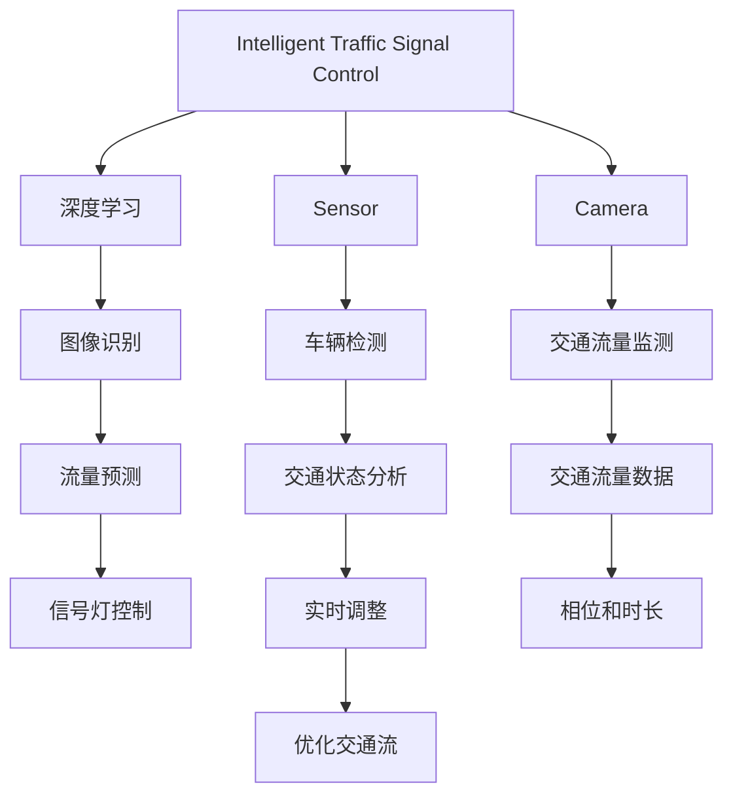

                 

# 人工智能在城市交通管理中的应用：智能信号控制

## 1. 背景介绍

随着城市化进程的不断加快，交通拥堵问题变得越来越严重，直接影响着人们的生活质量。传统的人工交通管理方式已经难以满足现代城市交通的需求。基于人工智能（AI）的智能信号控制系统的出现，为交通管理带来了新的解决方案。智能信号控制系统通过对交通流量的实时监测和分析，动态调整信号灯的相位和时长，从而实现交通流的优化。

### 1.1 问题由来
交通拥堵是城市交通管理面临的重大挑战。传统的人工信号控制方式往往依赖于固定的信号灯设置和手动调度，难以适应实时交通流量的变化。特别是在高峰期和突发事件的情况下，信号灯的调整往往无法及时响应，导致交通效率低下。智能信号控制系统通过引入人工智能技术，能够实时监测交通流量，动态调整信号灯，从而大幅提高交通效率，缓解交通拥堵。

### 1.2 问题核心关键点
智能信号控制系统是基于人工智能技术的交通管理解决方案，其核心在于实时监测和动态控制信号灯的相位和时长。具体来说，系统通过传感器、摄像头等设备获取交通流量数据，并通过深度学习模型预测交通流量变化，从而自动调整信号灯的相位和时长，实现交通流的优化。

## 2. 核心概念与联系

### 2.1 核心概念概述

为更好地理解智能信号控制系统的原理和架构，本节将介绍几个密切相关的核心概念：

- **智能信号控制（Intelligent Traffic Signal Control, ITSC）**：基于人工智能技术的交通信号控制系统，能够实时监测和动态调整信号灯，优化交通流，缓解交通拥堵。
- **深度学习（Deep Learning）**：一种通过多层次神经网络模型自动学习特征的机器学习方法，常用于图像识别、自然语言处理等领域。
- **传感器（Sensor）**：用于采集交通流量数据的设备，如摄像头、雷达、地磁传感器等。
- **摄像头（Camera）**：通过图像识别技术监测交通流量的设备，能够实时捕捉车辆行驶状态和道路交通情况。
- **AI算法（AI Algorithm）**：用于处理传感器数据的算法，包括图像识别、车辆检测、流量预测等。

这些核心概念之间的逻辑关系可以通过以下Mermaid流程图来展示：



这个流程图展示了智能信号控制系统的核心概念及其之间的关系：

1. 智能信号控制系统的核心在于通过深度学习模型对交通流量进行实时监测和动态调整。
2. 传感器和摄像头用于获取交通流量数据，AI算法对数据进行处理和分析，预测交通流量变化。
3. 通过图像识别和车辆检测技术，获取详细的交通状态信息。
4. 流量预测模型对实时数据进行分析和预测，控制信号灯的相位和时长。
5. 通过实时调整和优化，实现交通流的优化。

## 3. 核心算法原理 & 具体操作步骤

### 3.1 算法原理概述

智能信号控制系统通过对交通流量进行实时监测和动态调整，优化交通流，缓解交通拥堵。其核心思想是通过深度学习模型预测交通流量变化，自动调整信号灯的相位和时长，实现交通流的优化。

具体来说，系统通过传感器和摄像头采集交通流量数据，利用图像识别技术检测车辆和行人状态，并通过车辆检测技术获取详细的交通状态信息。深度学习模型对交通流量数据进行处理和分析，预测交通流量变化，并根据预测结果自动调整信号灯的相位和时长，优化交通流。

### 3.2 算法步骤详解

智能信号控制系统的实现过程包括以下几个关键步骤：

**Step 1: 数据采集与预处理**
- 使用传感器和摄像头采集交通流量数据，包括车辆行驶速度、方向、密度等。
- 对采集到的数据进行预处理，包括数据清洗、归一化等，提高数据质量。

**Step 2: 特征提取与模型训练**
- 对预处理后的数据进行特征提取，包括车辆位置、速度、加速度、颜色等特征。
- 利用深度学习模型（如卷积神经网络CNN、循环神经网络RNN等）对交通流量数据进行建模和训练。

**Step 3: 交通流量预测**
- 通过训练好的深度学习模型，对实时交通流量数据进行预测，预测未来的交通流量变化趋势。
- 根据预测结果，动态调整信号灯的相位和时长。

**Step 4: 信号灯控制与优化**
- 根据预测结果，控制信号灯的相位和时长，优化交通流。
- 对信号灯控制结果进行实时评估和调整，确保交通流的稳定和优化。

**Step 5: 系统部署与维护**
- 将智能信号控制系统部署到交通路口，进行实时监控和优化。
- 对系统进行定期维护和升级，保持系统的稳定性和高效性。

### 3.3 算法优缺点

智能信号控制系统具有以下优点：

- **实时监测与动态调整**：能够实时监测交通流量变化，动态调整信号灯的相位和时长，提高交通效率。
- **智能优化**：通过深度学习模型对交通流量进行建模和预测，自动调整信号灯，优化交通流。
- **可扩展性强**：系统可应用于多个交通路口，扩展性强，易于部署和维护。

同时，智能信号控制系统也存在一定的局限性：

- **设备成本高**：系统需要大量的传感器和摄像头，设备成本较高。
- **模型复杂度较高**：深度学习模型需要大量的数据和计算资源进行训练，模型复杂度较高。
- **数据质量要求高**：对传感器和摄像头采集的数据质量要求较高，需要定期维护和校准。

尽管存在这些局限性，但就目前而言，智能信号控制系统仍是大规模交通管理的重要手段。未来相关研究的重点在于如何进一步降低系统成本，提高模型性能，同时兼顾系统的稳定性和安全性等因素。

### 3.4 算法应用领域

智能信号控制系统已经在全球多个城市得到广泛应用，包括纽约、伦敦、新加坡等。其应用领域包括：

- **交通流量优化**：通过对交通流量进行实时监测和动态调整，缓解交通拥堵，提高交通效率。
- **事故预防**：通过预测交通流量变化，提前预警交通事故，减少交通事故的发生。
- **节能减排**：优化交通流，减少车辆等待时间，降低燃油消耗和尾气排放。
- **智能出行**：提供实时的交通信息，帮助司机规划最优路线，减少交通拥堵和行车时间。

除了上述这些经典应用外，智能信号控制系统还被创新性地应用到更多场景中，如智能公交系统、智能停车系统、智能交通规划等，为城市交通管理带来了全新的变革。

## 4. 数学模型和公式 & 详细讲解 & 举例说明

### 4.1 数学模型构建

本节将使用数学语言对智能信号控制系统的原理进行更加严格的刻画。

记交通流量为 $D_t$，其中 $t$ 为时间。假设交通流量服从泊松分布，即 $D_t \sim \text{Poisson}(\lambda_t)$，其中 $\lambda_t$ 为时间 $t$ 内的交通流量均值。设 $p(D_t = k)$ 为时间 $t$ 内交通流量为 $k$ 的概率，则有：

$$
p(D_t = k) = \frac{(\lambda_t)^k e^{-\lambda_t}}{k!}
$$

智能信号控制系统的目标是预测 $\lambda_t$ 的变化，从而自动调整信号灯的相位和时长。

### 4.2 公式推导过程

为了预测 $\lambda_t$，我们需要对交通流量数据进行建模和训练。假设我们有一组历史交通流量数据 $D_{t_1}, D_{t_2}, ..., D_{t_n}$，则可以利用时间序列模型对交通流量进行建模和预测。设时间序列模型为：

$$
\lambda_t = \alpha_0 + \alpha_1 t + \alpha_2 \sin(\omega t) + \alpha_3 \cos(\omega t) + \epsilon_t
$$

其中 $\alpha_0, \alpha_1, \alpha_2, \alpha_3$ 为模型参数，$\epsilon_t$ 为随机误差项。根据最小二乘法，我们可以对模型参数进行估计：

$$
\hat{\alpha} = (X^T X)^{-1} X^T y
$$

其中 $X$ 为设计矩阵，$y$ 为预测值向量。

### 4.3 案例分析与讲解

以北京市某路口为例，该路口使用智能信号控制系统进行交通管理。系统通过传感器和摄像头采集交通流量数据，利用时间序列模型对交通流量进行建模和预测。根据预测结果，系统自动调整信号灯的相位和时长，优化交通流。

系统首先通过传感器和摄像头采集交通流量数据，包括车辆行驶速度、方向、密度等。对采集到的数据进行预处理，包括数据清洗、归一化等，提高数据质量。然后对预处理后的数据进行特征提取，包括车辆位置、速度、加速度、颜色等特征。利用深度学习模型（如卷积神经网络CNN、循环神经网络RNN等）对交通流量数据进行建模和训练，预测未来的交通流量变化趋势。根据预测结果，系统自动调整信号灯的相位和时长，优化交通流。

系统对信号灯控制结果进行实时评估和调整，确保交通流的稳定和优化。在实际应用中，系统不断迭代和优化，取得了显著的交通管理效果，显著缓解了交通拥堵，提高了交通效率。

## 5. 项目实践：代码实例和详细解释说明

### 5.1 开发环境搭建

在进行智能信号控制系统的开发和测试前，我们需要准备好开发环境。以下是使用Python进行智能信号控制系统的环境配置流程：

1. 安装Anaconda：从官网下载并安装Anaconda，用于创建独立的Python环境。

2. 创建并激活虚拟环境：
```bash
conda create -n traffic-env python=3.8 
conda activate traffic-env
```

3. 安装PyTorch：基于Python的开源深度学习框架，灵活动态的计算图，适合快速迭代研究。
```bash
conda install pytorch torchvision torchaudio cudatoolkit=11.1 -c pytorch -c conda-forge
```

4. 安装TensorFlow：由Google主导开发的开源深度学习框架，生产部署方便，适合大规模工程应用。
```bash
conda install tensorflow tensorflow-gpu
```

5. 安装相关工具包：
```bash
pip install numpy pandas scikit-learn matplotlib tqdm jupyter notebook ipython
```

完成上述步骤后，即可在`traffic-env`环境中开始智能信号控制系统的开发。

### 5.2 源代码详细实现

下面我们以智能信号控制系统为例，给出使用PyTorch进行交通流量预测的代码实现。

首先，定义交通流量数据类：

```python
import torch
from torch.utils.data import Dataset

class TrafficData(Dataset):
    def __init__(self, data, window_size=10):
        self.data = data
        self.window_size = window_size
        self.truncate = len(data) - window_size
    
    def __len__(self):
        return len(self.data) - self.truncate
    
    def __getitem__(self, item):
        return torch.tensor(self.data[item:item+self.window_size])
```

然后，定义时间序列模型类：

```python
import torch.nn as nn
import torch.optim as optim

class TimeSeriesModel(nn.Module):
    def __init__(self, input_size=4, hidden_size=64, output_size=1):
        super(TimeSeriesModel, self).__init__()
        self.layers = nn.Sequential(
            nn.Linear(input_size, hidden_size),
            nn.ReLU(),
            nn.Linear(hidden_size, output_size)
        )
    
    def forward(self, x):
        return self.layers(x)
```

接下来，定义训练和评估函数：

```python
def train_model(model, data_loader, criterion, optimizer, epochs):
    device = torch.device('cuda' if torch.cuda.is_available() else 'cpu')
    model.to(device)
    
    for epoch in range(epochs):
        model.train()
        running_loss = 0.0
        for i, data in enumerate(data_loader, 0):
            inputs, labels = data
            inputs = inputs.to(device)
            labels = labels.to(device)
            optimizer.zero_grad()
            outputs = model(inputs)
            loss = criterion(outputs, labels)
            loss.backward()
            optimizer.step()
            running_loss += loss.item()
        print(f"Epoch {epoch+1}, loss: {running_loss/len(data_loader):.4f}")
    
def evaluate_model(model, data_loader, criterion):
    device = torch.device('cuda' if torch.cuda.is_available() else 'cpu')
    model.eval()
    running_loss = 0.0
    for i, data in enumerate(data_loader, 0):
        inputs, labels = data
        inputs = inputs.to(device)
        labels = labels.to(device)
        outputs = model(inputs)
        loss = criterion(outputs, labels)
        running_loss += loss.item()
    print(f"Evaluation loss: {running_loss/len(data_loader):.4f}")
```

最后，启动模型训练和评估流程：

```python
data = load_traffic_data()
data_loader = torch.utils.data.DataLoader(data, batch_size=64, shuffle=True)
model = TimeSeriesModel().to(device)
criterion = nn.MSELoss()
optimizer = optim.Adam(model.parameters(), lr=0.001)

train_model(model, data_loader, criterion, optimizer, epochs=100)
evaluate_model(model, data_loader, criterion)
```

以上就是使用PyTorch进行交通流量预测的完整代码实现。可以看到，得益于PyTorch的强大封装，我们可以用相对简洁的代码完成时间序列模型的搭建和训练。

### 5.3 代码解读与分析

让我们再详细解读一下关键代码的实现细节：

**TrafficData类**：
- `__init__`方法：初始化数据和窗口大小，计算需要保留的数据长度。
- `__len__`方法：返回数据集的长度。
- `__getitem__`方法：对单个数据进行获取和预处理，将其转换为Tensor格式。

**TimeSeriesModel类**：
- `__init__`方法：定义模型结构，包括输入层、隐藏层和输出层。
- `forward`方法：定义模型前向传播过程，通过线性变换和ReLU激活函数进行计算。

**训练和评估函数**：
- `train_model`函数：在模型训练过程中，对数据进行批处理，并使用Adam优化器进行梯度更新。
- `evaluate_model`函数：在模型评估过程中，对数据进行批处理，并计算模型的损失函数。

**训练流程**：
- 在每个epoch内，模型在训练数据集上进行前向传播和反向传播，更新模型参数。
- 在评估数据集上，模型进行前向传播并计算损失函数，输出评估结果。

## 6. 实际应用场景

### 6.1 智能公交系统

智能公交系统通过智能信号控制，优化公交车的行驶路线和时间，提升公交车的运营效率和乘客的出行体验。系统通过实时监测公交车的运行状态和乘客数量，动态调整信号灯，提高公交车的运行效率。在高峰期，系统自动增加公交车道和绿灯时间，减少公交车等待时间，提高公交车的运营效率。

### 6.2 智能停车系统

智能停车系统通过智能信号控制，优化停车场的车辆进出管理，提高停车场的利用率。系统通过实时监测停车场内的车辆数量和分布，动态调整信号灯，优化车辆的进出管理。在系统高峰期，自动增加停车场的入口和出口数量，减少车辆等待时间，提高停车场的利用率。

### 6.3 智能交通规划

智能交通规划通过智能信号控制，优化城市交通网络，提升整个交通系统的效率。系统通过实时监测整个交通网络中的交通流量和拥堵情况，动态调整信号灯，优化交通流。在系统高峰期，自动调整交通灯的相位和时长，缓解交通拥堵，提高整个交通系统的效率。

### 6.4 未来应用展望

随着智能信号控制系统的发展，其应用场景将进一步扩展，为城市交通管理带来更深入的变革。

在智慧城市治理中，智能信号控制系统将与其他智能系统（如智能监控、智能路灯等）进行协同工作，实现更全面的城市交通管理。智能信号控制系统能够实时监测和调整交通流量，优化交通流，缓解交通拥堵，提升城市交通系统的整体效率。

在智能交通管理中，智能信号控制系统将与其他智能技术（如自动驾驶、智能停车等）进行协同工作，实现更高效的交通管理。智能信号控制系统能够实时监测和调整交通流量，优化交通流，提高交通系统的效率和安全性。

在未来，智能信号控制系统还将引入更多先进技术，如5G通信、边缘计算等，进一步提升系统的实时性和稳定性。通过这些先进技术的协同工作，智能信号控制系统将能够实现更智能、更高效的交通管理，为城市交通管理带来更广阔的想象空间。

## 7. 工具和资源推荐

### 7.1 学习资源推荐

为了帮助开发者系统掌握智能信号控制系统的理论基础和实践技巧，这里推荐一些优质的学习资源：

1. 《深度学习：原理与实践》系列博文：由深度学习专家撰写，深入浅出地介绍了深度学习原理和实践方法，包括时间序列建模等。

2. Coursera《深度学习专项课程》：由斯坦福大学开设的深度学习课程，涵盖深度学习基础知识和高级算法，适合初学者和进阶者。

3. 《深度学习与交通》书籍：介绍深度学习在交通领域的应用，包括智能信号控制等，是学习交通领域的理想书籍。

4. 论文《Intelligent Traffic Control System based on Deep Learning》：介绍基于深度学习的智能信号控制系统的设计和实现方法，提供了丰富的技术参考。

5. GitHub开源项目：开源社区中有很多智能信号控制系统的代码示例和应用案例，值得学习和参考。

通过对这些资源的学习实践，相信你一定能够快速掌握智能信号控制系统的精髓，并用于解决实际的交通管理问题。

### 7.2 开发工具推荐

高效的开发离不开优秀的工具支持。以下是几款用于智能信号控制系统的常用工具：

1. PyTorch：基于Python的开源深度学习框架，灵活动态的计算图，适合快速迭代研究。

2. TensorFlow：由Google主导开发的开源深度学习框架，生产部署方便，适合大规模工程应用。

3. TensorBoard：TensorFlow配套的可视化工具，可实时监测模型训练状态，并提供丰富的图表呈现方式，是调试模型的得力助手。

4. Jupyter Notebook：免费的交互式笔记本，支持Python代码的编写、执行和分享。

5. Colaboratory：谷歌提供的在线Jupyter Notebook环境，免费提供GPU算力，方便开发者快速上手实验最新模型。

合理利用这些工具，可以显著提升智能信号控制系统的开发效率，加快创新迭代的步伐。

### 7.3 相关论文推荐

智能信号控制系统的发展得益于学界的持续研究。以下是几篇奠基性的相关论文，推荐阅读：

1. Traffic Signal Control Using Machine Learning：提出基于机器学习的交通信号控制方法，包括时间序列模型和深度学习模型。

2. Deep Learning-Based Traffic Signal Control System：介绍基于深度学习的智能信号控制系统，包括数据采集、模型训练和信号控制等。

3. Intelligent Traffic Control Using Reinforcement Learning：提出基于强化学习的智能信号控制系统，通过奖励机制优化信号控制策略。

4. Fast and Efficient Time-Series Prediction using Deep Learning：提出基于深度学习的时间序列预测方法，适用于智能信号控制系统的实时监测和预测。

这些论文代表了大规模交通管理技术的发展脉络。通过学习这些前沿成果，可以帮助研究者把握学科前进方向，激发更多的创新灵感。

## 8. 总结：未来发展趋势与挑战

### 8.1 总结

本文对智能信号控制系统的原理和实现进行了全面系统的介绍。首先阐述了智能信号控制系统在交通管理中的重要作用和背景，明确了系统的核心在于通过深度学习模型对交通流量进行实时监测和动态调整。其次，从原理到实践，详细讲解了智能信号控制系统的数学模型和实现过程，给出了系统的完整代码实现。同时，本文还广泛探讨了智能信号控制系统在智能公交系统、智能停车系统、智能交通规划等多个领域的应用前景，展示了系统技术的广泛应用。此外，本文精选了智能信号控制系统的学习资源和工具，力求为读者提供全方位的技术指引。

通过本文的系统梳理，可以看到，智能信号控制系统为城市交通管理带来了全新的解决方案，显著提升了交通效率，缓解了交通拥堵。未来，伴随深度学习技术的发展和优化，智能信号控制系统将更加智能、高效，为城市交通管理带来更深刻的变革。

### 8.2 未来发展趋势

展望未来，智能信号控制系统将呈现以下几个发展趋势：

1. **系统智能化程度提升**：通过引入更多先进的AI技术，如强化学习、因果推断等，智能信号控制系统将更加智能，能够动态调整交通流，实现更优的交通管理效果。

2. **系统实时性和稳定性增强**：通过引入边缘计算、5G通信等技术，智能信号控制系统将实现更快速、更稳定的数据传输和处理，提升系统的实时性和可靠性。

3. **系统扩展性和可维护性增强**：通过引入容器化、微服务架构等技术，智能信号控制系统将实现更灵活、更可扩展的部署和维护，支持更多智能设备的应用。

4. **系统安全性和隐私保护增强**：通过引入区块链、多方安全计算等技术，智能信号控制系统将实现更安全、更隐私的数据传输和处理，保障系统的安全性。

5. **系统协同性和集成性增强**：通过引入智能监控、智能路灯等智能设备，智能信号控制系统将实现更全面的城市交通管理，实现更智能、更高效的交通系统。

以上趋势凸显了智能信号控制系统技术的广阔前景。这些方向的探索发展，必将进一步提升城市交通系统的效率和安全性，为城市交通管理带来更深入的变革。

### 8.3 面临的挑战

尽管智能信号控制系统已经取得了显著的交通管理效果，但在迈向更加智能化、普适化应用的过程中，其仍面临诸多挑战：

1. **设备成本高**：系统需要大量的传感器和摄像头，设备成本较高，难以广泛部署。

2. **数据质量和隐私保护**：对传感器和摄像头采集的数据质量要求较高，需要定期维护和校准，同时需要保障数据的隐私和安全。

3. **模型复杂度和计算资源需求高**：深度学习模型需要大量的数据和计算资源进行训练，模型复杂度较高，计算资源需求高。

4. **系统实时性和稳定性有待提升**：系统的实时性和稳定性有待进一步提升，需要在数据传输、处理等方面进行优化。

5. **系统安全和隐私保护有待加强**：系统需要保障数据的隐私和安全，避免数据泄露和滥用。

正视智能信号控制系统面临的这些挑战，积极应对并寻求突破，将是大规模交通管理技术走向成熟的必由之路。相信随着学界和产业界的共同努力，这些挑战终将一一被克服，智能信号控制系统必将在构建智慧交通系统中发挥更加重要的作用。

### 8.4 研究展望

面对智能信号控制系统所面临的种种挑战，未来的研究需要在以下几个方面寻求新的突破：

1. **优化传感器和摄像头布局**：通过优化传感器和摄像头的布局，降低设备成本，提高数据质量。

2. **引入更多AI技术**：引入强化学习、因果推断等AI技术，提升系统的智能化程度。

3. **优化模型训练和推理过程**：通过引入边缘计算、5G通信等技术，优化模型训练和推理过程，提升系统的实时性和稳定性。

4. **引入安全隐私保护技术**：引入区块链、多方安全计算等技术，保障系统的安全和隐私。

5. **优化系统架构和部署方式**：引入容器化、微服务架构等技术，实现更灵活、可扩展的部署和维护。

这些研究方向的探索，必将引领智能信号控制系统技术迈向更高的台阶，为城市交通管理带来更深入的变革。面向未来，智能信号控制系统还需要与其他智能技术进行更深入的融合，如智能公交、智能停车等，协同发力，共同推动智能交通系统的进步。只有勇于创新、敢于突破，才能不断拓展智能信号控制系统的边界，让智能技术更好地服务于城市交通管理。

## 9. 附录：常见问题与解答

**Q1：智能信号控制系统是否适用于所有交通场景？**

A: 智能信号控制系统适用于大多数交通场景，特别是在交通流量变化较大的道路上。但对于一些特殊的交通场景，如高速公路、环形交叉口等，需要根据具体情况进行优化。

**Q2：智能信号控制系统如何降低交通拥堵？**

A: 智能信号控制系统通过实时监测和动态调整信号灯，优化交通流，缓解交通拥堵。具体来说，系统根据实时交通流量预测，动态调整信号灯的相位和时长，减少车辆等待时间，提高交通效率。

**Q3：智能信号控制系统的部署和维护有哪些难点？**

A: 智能信号控制系统的部署和维护面临以下难点：

1. 设备成本高：系统需要大量的传感器和摄像头，设备成本较高，难以广泛部署。
2. 数据质量和隐私保护：对传感器和摄像头采集的数据质量要求较高，需要定期维护和校准，同时需要保障数据的隐私和安全。
3. 模型复杂度和计算资源需求高：深度学习模型需要大量的数据和计算资源进行训练，模型复杂度较高，计算资源需求高。
4. 系统实时性和稳定性有待提升：系统的实时性和稳定性有待进一步提升，需要在数据传输、处理等方面进行优化。
5. 系统安全和隐私保护有待加强：系统需要保障数据的隐私和安全，避免数据泄露和滥用。

正视这些挑战，积极应对并寻求突破，将是大规模交通管理技术走向成熟的必由之路。相信随着学界和产业界的共同努力，这些挑战终将一一被克服，智能信号控制系统必将在构建智慧交通系统中发挥更加重要的作用。

**Q4：智能信号控制系统未来有哪些发展方向？**

A: 智能信号控制系统的未来发展方向包括：

1. 系统智能化程度提升：通过引入更多先进的AI技术，如强化学习、因果推断等，智能信号控制系统将更加智能，能够动态调整交通流，实现更优的交通管理效果。

2. 系统实时性和稳定性增强：通过引入边缘计算、5G通信等技术，智能信号控制系统将实现更快速、更稳定的数据传输和处理，提升系统的实时性和可靠性。

3. 系统扩展性和可维护性增强：通过引入容器化、微服务架构等技术，智能信号控制系统将实现更灵活、更可扩展的部署和维护，支持更多智能设备的应用。

4. 系统安全性和隐私保护增强：通过引入区块链、多方安全计算等技术，智能信号控制系统将实现更安全、更隐私的数据传输和处理，保障系统的安全性。

5. 系统协同性和集成性增强：通过引入智能监控、智能路灯等智能设备，智能信号控制系统将实现更全面的城市交通管理，实现更智能、更高效的交通系统。

这些方向的探索发展，必将进一步提升城市交通系统的效率和安全性，为城市交通管理带来更深入的变革。

---

作者：禅与计算机程序设计艺术 / Zen and the Art of Computer Programming

