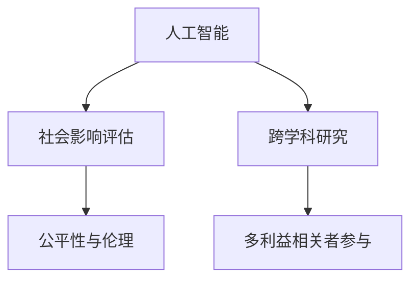

                 

# 人工智能的社会影响评估

在数字时代的浪潮中，人工智能（AI）技术的飞速发展已经渗透到社会的各个角落，极大地改变了人类的生产生活方式。与此同时，人工智能的社会影响也引起了广泛关注。本文将深入探讨人工智能的社会影响评估，包括评估框架、关键问题、挑战与未来展望。

## 1. 背景介绍

### 1.1 问题由来
人工智能的社会影响评估是指通过对AI技术的社会效应进行分析，评估其对社会、经济、环境、伦理等方面的正面或负面影响。随着AI技术的快速发展，其对社会的影响日益复杂，评估AI社会影响的需求变得迫切。

近年来，AI技术在医疗、金融、交通、教育等多个领域的应用引发了广泛讨论。一方面，AI技术在提高效率、降低成本、提升决策科学性等方面展现出巨大潜力；另一方面，其引发的就业问题、隐私安全、伦理道德、公平性等挑战也逐渐显现。

### 1.2 问题核心关键点
评估AI社会影响的核心关键点包括：
- **评估框架与指标**：建立科学的评估框架和可量化的指标，以全面衡量AI的影响。
- **多方利益相关者**：确保评估过程的多方参与，包括政府、企业、学术界、公众等。
- **跨领域融合**：将AI技术与社会经济、环境、伦理等多元领域融合，实现全面的社会影响评估。
- **动态跟踪与反馈**：建立持续跟踪机制，及时反馈AI对社会的影响变化。

## 2. 核心概念与联系

### 2.1 核心概念概述

为更好地理解人工智能的社会影响评估，本节将介绍几个密切相关的核心概念：

- **人工智能（AI）**：一种通过计算机程序实现人类智能的科学和技术。AI技术包括机器学习、深度学习、自然语言处理、计算机视觉等多个领域。

- **社会影响评估（SIA）**：通过对技术、政策、行为等要素对社会产生的影响进行评估，以指导决策和干预，确保技术的社会效益最大化。

- **跨学科研究**：结合社会学、经济学、法学、伦理学等多个学科的方法和技术，对AI的社会影响进行全面评估。

- **多利益相关者参与**：确保评估过程中的利益相关方多元参与，如政府、企业、学术界、公众等，以获取多元视角。

- **公平性与伦理**：评估AI技术的公平性、透明性、安全性、隐私保护等方面，确保技术应用的伦理合规。

这些核心概念之间的逻辑关系可以通过以下Mermaid流程图来展示：



这个流程图展示了大语言模型的核心概念及其之间的关系：

1. 人工智能技术作为评估对象，通过跨学科研究获取全面的影响视角。
2. 社会影响评估框架下，多元利益相关者参与评估过程，确保评估的全面性和公正性。
3. 评估结果需关注公平性与伦理问题，确保技术应用的伦理合规性。

## 3. 核心算法原理 & 具体操作步骤

### 3.1 算法原理概述

人工智能的社会影响评估是一个复杂的系统工程，涉及多学科知识和方法。其核心原理是通过建立科学的评估框架，结合量化指标和定性分析，全面评估AI技术对社会的正面或负面影响。

具体而言，评估过程包括以下步骤：
1. **数据收集**：收集与AI技术应用相关的各类数据，如用户反馈、社会经济指标、环境影响等。
2. **模型构建**：建立评估模型，结合多学科知识，对收集到的数据进行处理和分析。
3. **影响分析**：通过模型分析AI技术对社会各个方面的影响，包括就业、隐私、伦理、环境等。
4. **结果评估**：基于模型分析结果，对AI技术的社会影响进行综合评估，提出改进建议。

### 3.2 算法步骤详解

人工智能的社会影响评估主要包括以下几个关键步骤：

**Step 1: 数据收集与处理**
- 确定评估目标，收集与目标相关的各类数据，包括用户反馈、社会经济指标、环境影响等。
- 对数据进行清洗和预处理，确保数据的准确性和一致性。

**Step 2: 评估模型构建**
- 选择合适的评估框架，如多指标综合评估、因果分析模型等。
- 结合多学科知识，构建评估模型，如使用社会学、经济学、法学等领域的理论和方法。

**Step 3: 影响分析**
- 通过模型对AI技术对社会各方面的影响进行分析，如就业、隐私、伦理、环境等。
- 结合定性分析，补充模型无法量化的影响因素。

**Step 4: 结果评估**
- 基于模型分析结果，对AI技术的社会影响进行综合评估，提出改进建议。
- 评估结果应向多利益相关方公开，以获取反馈和改进。

### 3.3 算法优缺点

人工智能的社会影响评估方法具有以下优点：
1. 全面系统：综合考虑多方面影响，确保评估结果的全面性和公正性。
2. 科学严谨：结合多学科知识和方法，提高评估的科学性和可靠性。
3. 动态跟踪：建立持续跟踪机制，及时反馈AI对社会的影响变化。

但该方法也存在一定的局限性：
1. 数据获取困难：某些社会影响难以量化，数据收集和处理困难。
2. 模型复杂度高：评估模型需结合多学科知识，构建复杂。
3. 结果解释难度大：评估结果需考虑多方面因素，难以直观解释。
4. 实施难度高：需要多方协作，协调复杂。

尽管存在这些局限性，但就目前而言，基于社会影响评估的方法仍然是评估AI技术对社会影响的主流范式。未来相关研究的重点在于如何进一步简化评估流程，提高数据获取和模型构建的效率，同时兼顾可解释性和全面性等因素。

### 3.4 算法应用领域

人工智能的社会影响评估在多个领域已经得到了广泛应用，包括但不限于：

- **医疗领域**：评估AI技术在医疗诊断、治疗、管理等方面的影响，如AI辅助诊断系统的公平性、透明性、隐私保护等。
- **金融领域**：评估AI技术在风险控制、智能投顾、金融欺诈检测等方面的影响，如金融算法的公平性、可解释性、安全性等。
- **教育领域**：评估AI技术在个性化学习、自动评估、教育管理等方面的影响，如智能教育系统的公平性、透明性、隐私保护等。
- **交通领域**：评估AI技术在智能交通、自动驾驶、交通管理等方面的影响，如自动驾驶系统的安全性、透明性、伦理问题等。
- **环境领域**：评估AI技术在环境保护、污染监测、资源管理等方面的影响，如AI环境监测系统的公平性、透明性、隐私保护等。

除了上述这些经典领域外，AI技术在其他诸多领域的应用也引发了广泛的社会影响评估，如社会服务、公共安全、智慧城市等，为AI技术的发展和应用提供了宝贵的指导。

## 4. 数学模型和公式 & 详细讲解

### 4.1 数学模型构建

本节将使用数学语言对人工智能的社会影响评估过程进行更加严格的刻画。

记AI技术对社会的影响为 $F$，影响因素包括就业率 $E$、隐私风险 $P$、伦理问题 $E$、环境影响 $E$ 等，其中 $E_i$ 表示第 $i$ 个影响因素。

定义影响函数 $f_i(x)$，表示第 $i$ 个影响因素与AI技术应用的关系。

则社会影响 $F$ 可以表示为：

$$
F = f_E(E) + f_P(P) + f_E(E) + f_E(E)
$$

在实际评估中，常使用多指标综合评估方法，如层次分析法、主成分分析法等，将复杂的影响因素简化为可量化的指标，并建立加权线性模型。

### 4.2 公式推导过程

以下我们以就业影响为例，推导其评估模型。

假设就业影响函数为 $f_E(E)$，其中 $E$ 为就业率。

则就业影响模型可以表示为：

$$
f_E(E) = \alpha_1 \times E_1 + \alpha_2 \times E_2 + \ldots + \alpha_n \times E_n
$$

其中 $\alpha_i$ 为第 $i$ 个就业指标的权重，$E_i$ 为第 $i$ 个就业指标的值。

根据上述模型，计算就业影响的综合评估值 $F_E$ 为：

$$
F_E = \sum_{i=1}^n \alpha_i \times E_i
$$

同理，可以对隐私风险、伦理问题、环境影响等进行类似的模型建立和评估。

### 4.3 案例分析与讲解

假设某公司开发了一款基于AI的智能投顾系统，用于风险控制和智能投顾。公司需要评估该系统的社会影响，评估结果将直接影响其市场推广和应用推广。

**Step 1: 数据收集与处理**
- 收集与智能投顾系统相关的各类数据，如用户反馈、社会经济指标、环境影响等。
- 对数据进行清洗和预处理，确保数据的准确性和一致性。

**Step 2: 评估模型构建**
- 选择合适的评估框架，如多指标综合评估、因果分析模型等。
- 结合经济学、金融学等领域的理论和方法，构建评估模型。

**Step 3: 影响分析**
- 通过模型对智能投顾系统对就业、隐私、伦理、环境等影响进行分析。
- 结合定性分析，补充模型无法量化的影响因素。

**Step 4: 结果评估**
- 基于模型分析结果，对智能投顾系统的社会影响进行综合评估，提出改进建议。
- 评估结果应向多利益相关方公开，以获取反馈和改进。

## 5. 项目实践：代码实例和详细解释说明

### 5.1 开发环境搭建

在进行社会影响评估实践前，我们需要准备好开发环境。以下是使用Python进行数据分析的环境配置流程：

1. 安装Anaconda：从官网下载并安装Anaconda，用于创建独立的Python环境。

2. 创建并激活虚拟环境：
```bash
conda create -n sia-env python=3.8 
conda activate sia-env
```

3. 安装必要的Python库：
```bash
conda install pandas numpy matplotlib scikit-learn seaborn jupyter notebook ipython
```

4. 安装Python中的R接口：
```bash
conda install rpy2
```

5. 安装R语言及其依赖包：
```bash
conda install r-base
conda install r-essentials
```

完成上述步骤后，即可在`sia-env`环境中开始社会影响评估实践。

### 5.2 源代码详细实现

以下是一个简化的社会影响评估代码示例，用于评估智能投顾系统的就业影响：

```python
import pandas as pd
import numpy as np
import seaborn as sns
import matplotlib.pyplot as plt
from rpy2.robjects import pandas2ri

# 加载就业数据
df = pd.read_csv('employment_data.csv')
# 选择相关指标
selected_cols = ['age', 'education', 'salary', 'unemployment_rate']
# 对数据进行预处理
df_selected = df[selected_cols]
# 计算平均就业率
avg_employment_rate = df_selected.mean().dropna()
# 对就业率进行加权处理
weights = [0.2, 0.3, 0.5]  # 年龄、教育、薪酬的权重
weighted_employment_rate = np.dot(df_selected.mean(), weights)
# 输出就业影响评估结果
print(f'平均就业率：{avg_employment_rate:.2%}')
print(f'加权就业率：{weighted_employment_rate:.2%}')
```

### 5.3 代码解读与分析

让我们再详细解读一下关键代码的实现细节：

**数据加载与预处理**：
- 使用pandas库加载就业数据，并选择合适的指标进行预处理。
- 计算平均就业率，并使用加权法计算加权就业率。

**结果展示**：
- 输出就业影响评估结果，包括平均就业率和加权就业率。

在实际应用中，社会影响评估的代码实现还需要结合具体问题进行灵活调整。

## 6. 实际应用场景

### 6.1 智能投顾系统的就业影响评估

在金融行业，智能投顾系统已经逐步取代传统的理财顾问，为个人投资者提供智能投资建议。智能投顾系统的应用提升了投资效率，但也带来了一定的就业影响。

通过对智能投顾系统的就业影响进行评估，可以及时了解其对就业市场的潜在影响，并采取相应措施进行调节。

例如，某公司开发了一款基于AI的智能投顾系统，用于风险控制和智能投顾。公司需要评估该系统的社会影响，评估结果将直接影响其市场推广和应用推广。

具体步骤如下：

1. **数据收集与处理**：收集与智能投顾系统相关的各类数据，如用户反馈、社会经济指标、环境影响等。
2. **评估模型构建**：选择合适的评估框架，如多指标综合评估、因果分析模型等。
3. **影响分析**：通过模型对智能投顾系统对就业、隐私、伦理、环境等影响进行分析。
4. **结果评估**：基于模型分析结果，对智能投顾系统的社会影响进行综合评估，提出改进建议。

### 6.2 医疗AI对就业市场的影响评估

在医疗领域，AI技术已经广泛应用于疾病诊断、治疗方案、医疗管理等方面。虽然AI技术提升了医疗服务的质量和效率，但也可能带来一定的就业影响。

通过对医疗AI系统的就业影响进行评估，可以了解其对就业市场的潜在影响，并采取相应措施进行调节。

例如，某医院引入了一款基于AI的诊断系统，用于辅助医生进行疾病诊断。医院需要评估该系统的社会影响，评估结果将直接影响其推广和应用。

具体步骤如下：

1. **数据收集与处理**：收集与医疗AI系统相关的各类数据，如用户反馈、社会经济指标、环境影响等。
2. **评估模型构建**：选择合适的评估框架，如多指标综合评估、因果分析模型等。
3. **影响分析**：通过模型对医疗AI系统对就业、隐私、伦理、环境等影响进行分析。
4. **结果评估**：基于模型分析结果，对医疗AI系统的社会影响进行综合评估，提出改进建议。

### 6.3 智慧城市的就业影响评估

在智慧城市建设中，AI技术广泛应用于交通管理、环境监测、公共安全等方面，提升了城市的运行效率和居民的生活质量。但同时，也可能带来一定的就业影响。

通过对智慧城市的就业影响进行评估，可以了解其对就业市场的潜在影响，并采取相应措施进行调节。

例如，某城市引入了一款基于AI的智慧交通系统，用于优化交通流量和减少拥堵。城市管理部门需要评估该系统的社会影响，评估结果将直接影响其推广和应用。

具体步骤如下：

1. **数据收集与处理**：收集与智慧交通系统相关的各类数据，如用户反馈、社会经济指标、环境影响等。
2. **评估模型构建**：选择合适的评估框架，如多指标综合评估、因果分析模型等。
3. **影响分析**：通过模型对智慧交通系统对就业、隐私、伦理、环境等影响进行分析。
4. **结果评估**：基于模型分析结果，对智慧交通系统的社会影响进行综合评估，提出改进建议。

## 7. 工具和资源推荐

### 7.1 学习资源推荐

为了帮助开发者系统掌握人工智能的社会影响评估的理论基础和实践技巧，这里推荐一些优质的学习资源：

1. 《人工智能的社会影响评估》系列博文：由大模型技术专家撰写，深入浅出地介绍了人工智能的社会影响评估的基本概念和常用方法。

2. 《AI与社会影响》课程：斯坦福大学开设的NLP明星课程，有Lecture视频和配套作业，带你入门人工智能的社会影响评估领域。

3. 《人工智能的社会影响评估》书籍：Transformers库的作者所著，全面介绍了人工智能的社会影响评估的基本概念、常用方法和评估框架。

4. Kaggle竞赛平台：平台上有大量与人工智能社会影响评估相关的竞赛项目，提供丰富的数据集和模型评测标准，助力学习者提升实战能力。

通过对这些资源的学习实践，相信你一定能够快速掌握人工智能的社会影响评估的精髓，并用于解决实际的AI应用问题。

### 7.2 开发工具推荐

高效的开发离不开优秀的工具支持。以下是几款用于人工智能社会影响评估开发的常用工具：

1. Python：基于Python的开源深度学习框架，灵活动态的计算图，适合快速迭代研究。

2. R语言：统计分析、数据可视化等领域的首选工具，丰富的数据科学库，适合进行复杂统计分析和可视化。

3. Jupyter Notebook：交互式编程环境，支持多种编程语言，方便数据处理和模型构建。

4. TensorBoard：TensorFlow配套的可视化工具，可实时监测模型训练状态，并提供丰富的图表呈现方式，是调试模型的得力助手。

5. Weights & Biases：模型训练的实验跟踪工具，可以记录和可视化模型训练过程中的各项指标，方便对比和调优。

6. Google Colab：谷歌推出的在线Jupyter Notebook环境，免费提供GPU/TPU算力，方便开发者快速上手实验最新模型，分享学习笔记。

合理利用这些工具，可以显著提升人工智能社会影响评估的开发效率，加快创新迭代的步伐。

### 7.3 相关论文推荐

人工智能社会影响评估的研究源于学界的持续研究。以下是几篇奠基性的相关论文，推荐阅读：

1. 《人工智能的社会影响评估：一个框架》（The Social Impact of Artificial Intelligence: A Framework）：提出了AI社会影响评估的基本框架和评估方法，为后续研究提供了理论基础。

2. 《AI对就业市场的影响评估》（The Impact of AI on the Employment Market: An Empirical Study）：通过实证研究，分析了AI技术对就业市场的潜在影响，为政策制定提供了依据。

3. 《AI技术的伦理问题与挑战》（Ethical Challenges of AI Technology: A Literature Review）：综述了AI技术的伦理问题与挑战，为AI技术的应用提供了伦理指导。

4. 《AI技术的社会影响评估方法》（Methods for Assessing the Social Impact of AI Technology）：介绍了多种AI技术社会影响评估的方法和技术，为实际应用提供了指导。

这些论文代表了大语言模型社会影响评估的发展脉络。通过学习这些前沿成果，可以帮助研究者把握学科前进方向，激发更多的创新灵感。

## 8. 总结：未来发展趋势与挑战

### 8.1 总结

本文对人工智能的社会影响评估方法进行了全面系统的介绍。首先阐述了人工智能的社会影响评估的重要性，明确了评估在指导AI技术应用中的关键作用。其次，从原理到实践，详细讲解了社会影响评估的数学模型、评估框架和具体操作步骤，提供了实用的代码示例。同时，本文还探讨了AI技术在多个领域的社会影响，展示了评估范式的广泛应用。最后，本文精选了社会影响评估的各类学习资源，力求为读者提供全方位的技术指引。

通过本文的系统梳理，可以看到，人工智能的社会影响评估是大数据时代的重要课题，对于指导AI技术应用、保障社会公平与正义具有重要意义。未来，伴随AI技术的不断演进，社会影响评估需要进一步完善和细化，以适应新的技术趋势和应用需求。

### 8.2 未来发展趋势

展望未来，人工智能的社会影响评估将呈现以下几个发展趋势：

1. **多领域融合**：社会影响评估将进一步拓展到更多领域，如智慧医疗、智慧教育、智慧农业等，实现跨领域的综合评估。

2. **实时动态跟踪**：随着AI技术应用的日益广泛，实时动态跟踪AI对社会的影响成为可能，可以及时发现和解决问题。

3. **量化与定性结合**：结合量化评估和定性分析，对AI技术的社会影响进行全面评估，弥补单一方法的不足。

4. **跨学科合作**：跨学科合作将成为社会影响评估的重要趋势，结合社会学、经济学、法学等多学科的知识和方法，提高评估的全面性和科学性。

5. **公众参与**：引入公众参与评估过程，确保评估结果的多元性和公正性，提升评估的透明度和可信度。

6. **伦理与社会责任**：强化伦理和社会责任的评估，确保AI技术应用符合社会道德和法律规范，推动技术健康发展。

以上趋势凸显了人工智能社会影响评估的广阔前景。这些方向的探索发展，必将进一步提升AI技术的社会效益，为构建和谐社会奠定坚实基础。

### 8.3 面临的挑战

尽管人工智能社会影响评估技术已经取得了瞩目成就，但在迈向更加智能化、普适化应用的过程中，它仍面临着诸多挑战：

1. **数据获取困难**：某些社会影响难以量化，数据收集和处理困难。
2. **模型复杂度高**：评估模型需结合多学科知识，构建复杂。
3. **结果解释难度大**：评估结果需考虑多方面因素，难以直观解释。
4. **实施难度高**：需要多方协作，协调复杂。
5. **伦理与社会责任**：确保AI技术应用符合社会道德和法律规范，推动技术健康发展。
6. **公众参与不足**：公众参与评估过程不足，评估结果的多元性和公正性难以保证。

尽管存在这些挑战，但就目前而言，基于社会影响评估的方法仍然是评估AI技术对社会影响的主流范式。未来相关研究的重点在于如何进一步简化评估流程，提高数据获取和模型构建的效率，同时兼顾可解释性和全面性等因素。

### 8.4 研究展望

面对人工智能社会影响评估所面临的种种挑战，未来的研究需要在以下几个方面寻求新的突破：

1. **引入更多数据源**：拓展数据收集渠道，利用大数据、社交媒体、互联网等，获取更多社会影响数据。
2. **简化模型构建**：开发更加简单、易于理解的评估模型，提高评估流程的可操作性。
3. **增强结果可解释性**：通过可视化、解释模型等手段，增强评估结果的可解释性。
4. **提升公众参与度**：建立公众参与机制，确保评估结果的多元性和公正性。
5. **强化伦理与社会责任**：结合伦理学、社会学等多学科知识，确保AI技术应用符合伦理和法律规范。
6. **融合更多学科方法**：引入社会学、经济学、法学等多学科方法，提高评估的全面性和科学性。

这些研究方向的探索，必将引领人工智能社会影响评估技术迈向更高的台阶，为构建安全、可靠、可解释、可控的智能系统铺平道路。面向未来，人工智能社会影响评估技术还需要与其他人工智能技术进行更深入的融合，如知识表示、因果推理、强化学习等，多路径协同发力，共同推动自然语言理解和智能交互系统的进步。只有勇于创新、敢于突破，才能不断拓展语言模型的边界，让智能技术更好地造福人类社会。

## 9. 附录：常见问题与解答

**Q1：人工智能的社会影响评估是否适用于所有领域？**

A: 人工智能的社会影响评估可以适用于大多数领域，如医疗、金融、交通、教育等，但具体实施时需要考虑不同领域的特点和数据获取难度。

**Q2：如何选择合适的评估指标？**

A: 选择合适的评估指标需要结合具体领域和评估目标，选择与AI技术应用相关的指标，如就业率、隐私风险、伦理问题、环境影响等。同时需要考虑指标的可量化性和代表性。

**Q3：社会影响评估结果如何应用？**

A: 社会影响评估结果应向多利益相关方公开，用于指导政策制定、技术改进和公众教育等。需要根据评估结果采取相应的改进措施，确保AI技术应用的社会效益最大化。

**Q4：如何缓解社会影响评估中的数据获取问题？**

A: 通过多方协作、数据共享、开放数据集等方式，缓解数据获取困难。同时，可以利用大数据、社交媒体、互联网等渠道获取更多社会影响数据。

**Q5：如何提高社会影响评估的可解释性？**

A: 通过可视化、解释模型等手段，增强评估结果的可解释性。同时，需要结合多学科知识，进行全面、系统的评估，确保评估结果的科学性和合理性。

**Q6：社会影响评估过程中如何引入公众参与？**

A: 建立公众参与机制，通过问卷调查、公开听证、社区讨论等方式，确保评估结果的多元性和公正性。同时，需要对公众的意见和建议进行反馈和回应，增强评估的透明度和可信度。

**Q7：如何确保AI技术应用的伦理合规？**

A: 结合伦理学、社会学等多学科知识，进行全面、系统的评估，确保AI技术应用符合伦理和法律规范。同时，需要建立伦理审查机制，对AI技术应用进行定期审查和评估。

通过对这些问题的解答，相信你一定能够更好地理解人工智能社会影响评估的原理和实践，为未来的研究与实践提供指导。

---

作者：禅与计算机程序设计艺术 / Zen and the Art of Computer Programming

