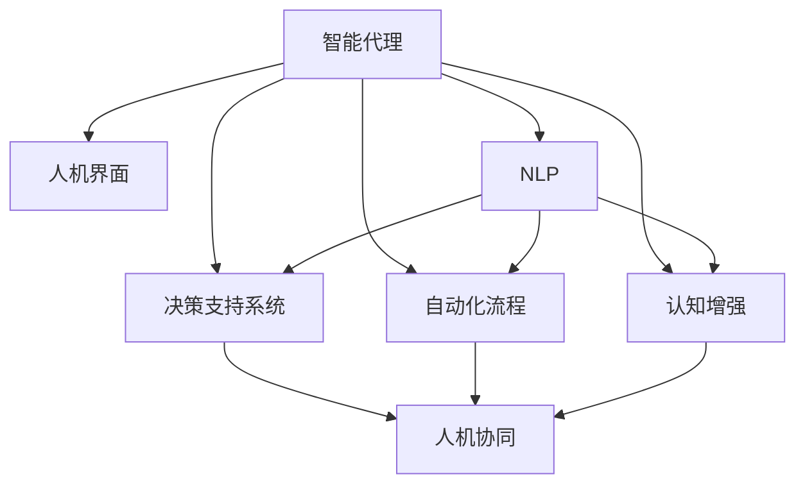

                 

# 人机协同：未来工作的核心驱动力

## 1. 背景介绍

### 1.1 问题由来

随着人工智能技术的飞速发展，人机协同在各行各业的应用越来越广泛。无论是智能客服、金融分析、医学诊断，还是艺术创作、教育培训、工业制造，人机协同都极大地提高了工作效率和质量，减少了人为错误，降低了成本。然而，尽管人机协同带来了诸多便利，但人机交互中的“协同”依然存在诸多问题：任务分解不当、决策链过长、人机界面不友好等。这些问题的存在，限制了人机协同的进一步发展。

本文旨在探讨如何通过智能技术优化人机协同的工作流程，提升人机协同的效率和效果。通过深入研究人机协同的核心概念、关键技术以及应用实践，提出了一套系统化的方法论，帮助实现高效、无缝的人机协同。

## 2. 核心概念与联系

### 2.1 核心概念概述

为更好地理解人机协同的实现原理和工作流程，本节将介绍几个关键核心概念：

- **人机协同（Human-Computer Collaboration, HCC）**：指人与计算机在特定任务中分工合作，共同完成工作的模式。

- **智能代理（Intelligent Agents）**：代表计算机在人机协同中的角色，通常使用AI技术实现，具备任务感知、自主决策、人机交互等功能。

- **人机界面（Human-Computer Interface, HCI）**：包括图形界面、语音交互、手势控制等多种形式，是人机协同的重要媒介。

- **自然语言处理（Natural Language Processing, NLP）**：研究如何使计算机能够理解、生成和操作自然语言，是实现人机协同的重要基础。

- **决策支持系统（Decision Support System, DSS）**：通过数据、模型和专家知识，辅助决策者进行复杂决策，是智能代理的核心功能之一。

- **认知增强**：指利用人工智能技术，提升人的认知能力，如注意力、记忆、理解力等，使人机协同更加高效。

- **自动化流程（Automated Processes）**：将复杂任务分解为多个自动化子任务，通过智能代理自动执行，减少人的操作负担。

这些概念共同构成了人机协同的完整生态系统，是人机协同实现的基础。通过理解这些核心概念，我们可以更好地把握人机协同的技术架构和应用场景。

### 2.2 核心概念原理和架构的 Mermaid 流程图



此图展示了人机协同的关键组件及其相互关系。智能代理接收人机界面的输入，通过自然语言处理技术解析输入内容，并调用决策支持系统进行决策。自动化流程和认知增强技术辅助智能代理完成复杂任务，最终实现高效的人机协同。

## 3. 核心算法原理 & 具体操作步骤

### 3.1 算法原理概述

人机协同的核心在于如何构建一个高效、智能的决策支持系统，通过智能代理实现任务的自动化和智能化。决策支持系统通常包括数据收集、数据分析、决策模型构建和决策执行等多个环节。

在数据收集阶段，智能代理需要从人机界面获取用户输入的任务描述和条件，通过自然语言处理技术解析成机器可理解的形式。在数据分析阶段，系统对输入数据进行清洗、特征提取、模式识别等处理，形成可供决策的基础数据。在决策模型构建阶段，系统根据任务特点选择相应的决策模型，并通过预训练或微调优化模型性能。在决策执行阶段，智能代理将计算结果以用户易于理解的形式返回，辅助用户进行决策。

### 3.2 算法步骤详解

人机协同的算法实现一般包括以下几个关键步骤：

**Step 1: 任务描述获取与解析**

- 通过图形界面、语音输入、键盘输入等方式，从用户处获取任务描述。
- 使用自然语言处理技术对任务描述进行解析，提取关键信息，如任务类型、条件、目标等。

**Step 2: 数据预处理与特征提取**

- 对用户输入的任务描述和条件进行清洗、标准化处理，去除无用信息和噪声。
- 使用特征提取技术对数据进行编码，提取关键特征，如词向量、句法结构、语义关系等。

**Step 3: 决策模型构建与训练**

- 根据任务特点选择合适的决策模型，如基于规则的系统、决策树、神经网络等。
- 使用历史数据对模型进行训练，优化模型参数，提高模型性能。
- 对模型进行评估，选择最优模型用于后续任务执行。

**Step 4: 决策结果生成与输出**

- 将任务描述和关键特征输入训练好的模型，计算得到决策结果。
- 对决策结果进行后处理，将其转化为用户易于理解的形式，如文本、图表、语音等。
- 将决策结果返回给用户，辅助用户进行决策。

**Step 5: 用户反馈与模型优化**

- 收集用户对决策结果的反馈，评估模型的效果。
- 根据用户反馈对模型进行优化，提高模型泛化能力和鲁棒性。
- 重复上述步骤，不断迭代优化模型，提升人机协同的效果。

### 3.3 算法优缺点

人机协同算法具有以下优点：

- **高效性**：通过自动化和智能化的决策支持系统，大大提高了决策效率，减少了人为错误。
- **准确性**：基于大量历史数据训练的决策模型，能够提供高精度的决策建议，提高决策的准确性。
- **灵活性**：通过动态调整决策模型和参数，适应不同任务和场景的需求，提高系统的灵活性。

然而，该算法也存在一定的局限性：

- **依赖高质量数据**：模型的训练和优化依赖高质量的历史数据，数据的获取和处理成本较高。
- **复杂度较高**：系统实现复杂，需要综合运用多个技术和领域知识，开发难度较大。
- **可解释性不足**：基于复杂模型的决策支持系统，难以提供透明的决策过程和逻辑，影响用户信任度。

尽管存在这些局限性，但人机协同算法在实际应用中取得了显著效果，被广泛应用于各行业的人机交互场景中。未来相关研究将聚焦于如何降低数据获取成本，提升系统可解释性，以及优化模型性能等方向。

### 3.4 算法应用领域

人机协同算法在多个领域中得到了广泛应用，以下是几个典型的应用场景：

- **智能客服**：利用自然语言处理技术和智能代理，快速响应用户咨询，提供个性化服务，提升客户满意度。
- **金融分析**：通过智能代理和决策支持系统，自动进行市场数据分析和风险评估，辅助投资者决策。
- **医疗诊断**：使用智能代理和自动化流程，快速诊断疾病，提供治疗方案建议，提高诊断效率。
- **工业制造**：利用智能代理和自动化流程，优化生产流程，提升产品质量和生产效率。
- **教育培训**：通过智能代理和认知增强技术，提供个性化学习方案，提升学习效果。
- **艺术创作**：使用智能代理和决策支持系统，辅助艺术家进行创意设计，提升创作质量。

这些应用场景展示了人机协同算法在提升工作效率、降低错误率、提升决策质量等方面的潜力。未来，随着技术的不断进步，人机协同的应用范围将进一步扩大，成为各行各业数字化转型的重要驱动力。

## 4. 数学模型和公式 & 详细讲解 & 举例说明

### 4.1 数学模型构建

人机协同的核心在于决策支持系统的设计和优化，其数学模型构建通常包括以下几个关键步骤：

- **数据集定义**：定义训练数据集，包括样本、标签、特征等。
- **特征工程**：选择合适的特征提取方法，如词向量、句法树、神经网络等。
- **决策模型构建**：选择合适的决策模型，如线性回归、决策树、深度神经网络等。
- **模型训练**：使用训练数据对模型进行训练，优化模型参数。
- **模型评估**：使用测试数据对模型进行评估，选择最优模型。

**Step 1: 数据集定义**

- 定义训练样本集 $D=\{(x_i, y_i)\}_{i=1}^N$，其中 $x_i$ 为输入特征，$y_i$ 为输出标签。
- 定义测试样本集 $D_{test}=\{(x_{test_i}, y_{test_i})\}_{i=1}^{N_{test}}$，用于模型评估。

**Step 2: 特征工程**

- 定义特征函数 $f: \mathbb{R}^d \rightarrow \mathbb{R}^m$，将输入特征 $x_i$ 映射为特征向量 $f(x_i)$。
- 定义特征提取器 $E$，将特征向量 $f(x_i)$ 映射为特征表示 $E(x_i)=[e_1^T e_2^T \cdots e_m^T]^T$。

**Step 3: 决策模型构建**

- 定义决策函数 $h: \mathbb{R}^m \rightarrow \mathbb{R}$，将特征表示 $E(x_i)$ 映射为决策结果 $h(E(x_i))$。
- 使用决策树、神经网络等模型进行决策函数拟合，得到最优决策模型 $h^*$。

**Step 4: 模型训练**

- 定义损失函数 $L$，度量决策结果 $h(E(x_i))$ 与真实标签 $y_i$ 的差异。
- 使用梯度下降等优化算法，最小化损失函数 $L$，更新模型参数 $\theta$。

**Step 5: 模型评估**

- 使用测试集对模型进行评估，计算预测准确率、精确率、召回率等指标。
- 选择最优模型 $h^*$ 进行后续任务执行。

### 4.2 公式推导过程

以线性回归模型为例，推导其决策函数和损失函数的计算公式：

- 定义输入特征 $x_i=(x_{i1}, x_{i2}, \cdots, x_{id})^T$，决策标签 $y_i=y$。
- 定义特征表示 $E(x_i)=[e_1^T e_2^T \cdots e_m^T]^T$，决策函数 $h(E(x_i))=\theta^T E(x_i)$，其中 $\theta$ 为模型参数。
- 定义损失函数 $L(y, \hat{y})=(y-\hat{y})^2$。

则有：

$$
L(y, \hat{y}) = \frac{1}{N}\sum_{i=1}^N (y_i - \hat{y}_i)^2 = \frac{1}{N}\sum_{i=1}^N (y_i - \theta^T E(x_i))^2
$$

通过最小化损失函数 $L$，可求得模型参数 $\theta$：

$$
\theta^* = \mathop{\arg\min}_{\theta} \frac{1}{N}\sum_{i=1}^N (y_i - \theta^T E(x_i))^2
$$

上述公式展示了线性回归模型的决策函数和损失函数的推导过程，为其他决策模型的构建提供了参考。

### 4.3 案例分析与讲解

以医疗诊断为例，展示人机协同算法的应用：

- **数据集定义**：收集历史病历数据，定义样本为病人基本信息和症状，标签为疾病诊断结果。
- **特征工程**：提取病人的年龄、性别、症状描述、化验结果等特征，进行标准化处理和特征编码。
- **决策模型构建**：选择决策树或神经网络作为决策模型，训练得到疾病诊断模型。
- **模型训练**：使用历史病历数据对模型进行训练，优化模型参数。
- **模型评估**：使用测试数据集对模型进行评估，计算预测准确率、精确率等指标。

通过上述步骤，智能代理能够自动处理病人输入的病情描述，调用诊断模型进行疾病诊断，并提供治疗方案建议，辅助医生进行决策。

## 5. 项目实践：代码实例和详细解释说明

### 5.1 开发环境搭建

在进行人机协同的开发实践前，需要准备好开发环境。以下是使用Python进行TensorFlow开发的环境配置流程：

1. 安装Anaconda：从官网下载并安装Anaconda，用于创建独立的Python环境。

2. 创建并激活虚拟环境：
```bash
conda create -n tensorflow-env python=3.8 
conda activate tensorflow-env
```

3. 安装TensorFlow：根据CUDA版本，从官网获取对应的安装命令。例如：
```bash
conda install tensorflow -c tf
```

4. 安装TensorBoard：
```bash
pip install tensorboard
```

5. 安装各类工具包：
```bash
pip install numpy pandas scikit-learn matplotlib tqdm jupyter notebook ipython
```

完成上述步骤后，即可在`tensorflow-env`环境中开始人机协同实践。

### 5.2 源代码详细实现

这里我们以医疗诊断任务为例，给出使用TensorFlow对决策支持系统进行开发的PyTorch代码实现。

首先，定义数据集处理函数：

```python
import tensorflow as tf
from tensorflow.keras.preprocessing.sequence import pad_sequences

class MedicalDataset(tf.keras.utils.Sequence):
    def __init__(self, data, labels, max_len=128):
        self.data = data
        self.labels = labels
        self.max_len = max_len
        
    def __len__(self):
        return len(self.data)
    
    def __getitem__(self, item):
        x = self.data[item]
        y = self.labels[item]
        
        x = pad_sequences([x], maxlen=self.max_len, padding='post', truncating='post')[0]
        y = tf.keras.utils.to_categorical(y, num_classes=num_classes)
        
        return {'x': x, 
                'y': y}

# 定义特征提取器
def extract_features(text):
    # 特征提取逻辑
    # ...
    return feature_vector

# 定义模型
def build_model(input_dim, num_classes):
    model = tf.keras.Sequential([
        tf.keras.layers.Dense(64, activation='relu', input_dim=input_dim),
        tf.keras.layers.Dense(num_classes, activation='softmax')
    ])
    return model

# 加载数据集
data = [data1, data2, ...]
labels = [label1, label2, ...]
num_classes = len(set(labels))

# 构建特征向量
features = [extract_features(text) for text in data]

# 构建数据集
dataset = MedicalDataset(features, labels, max_len=max_len)

# 定义模型
model = build_model(input_dim=input_dim, num_classes=num_classes)
```

然后，定义模型训练和评估函数：

```python
from tensorflow.keras import optimizers

# 定义损失函数
loss_fn = tf.keras.losses.CategoricalCrossentropy()

# 定义优化器
optimizer = optimizers.Adam(learning_rate=0.001)

# 训练函数
def train_epoch(model, dataset, batch_size):
    dataset.shuffle(buffer_size=10000)
    for batch in dataset:
        x, y = batch['x'], batch['y']
        with tf.GradientTape() as tape:
            y_pred = model(x)
            loss = loss_fn(y, y_pred)
        gradients = tape.gradient(loss, model.trainable_variables)
        optimizer.apply_gradients(zip(gradients, model.trainable_variables))
        
# 评估函数
def evaluate(model, dataset, batch_size):
    dataset.shuffle(buffer_size=10000)
    correct_predictions = 0
    for batch in dataset:
        x, y = batch['x'], batch['y']
        y_pred = model(x)
        correct_predictions += tf.reduce_sum(tf.cast(tf.equal(tf.argmax(y_pred, axis=1), tf.argmax(y, axis=1)))
    accuracy = correct_predictions / len(dataset)
    return accuracy
```

最后，启动训练流程并在测试集上评估：

```python
epochs = 10
batch_size = 16

for epoch in range(epochs):
    train_epoch(model, dataset, batch_size)
    print(f"Epoch {epoch+1}, training accuracy: {train_accuracy:.4f}")
    
    print(f"Epoch {epoch+1}, validation accuracy: {evaluate(model, dataset, batch_size)}")
    
print(f"Final accuracy: {evaluate(model, dataset, batch_size)}")
```

以上就是使用TensorFlow对医疗诊断任务进行人机协同开发的完整代码实现。可以看到，通过TensorFlow的强大封装，我们可以用相对简洁的代码完成决策支持系统的构建和训练。

### 5.3 代码解读与分析

让我们再详细解读一下关键代码的实现细节：

**MedicalDataset类**：
- `__init__`方法：初始化数据、标签、最大序列长度等关键组件。
- `__len__`方法：返回数据集的样本数量。
- `__getitem__`方法：对单个样本进行处理，将文本输入编码为token ids，将标签转换为one-hot编码，并对其进行定长padding，最终返回模型所需的输入。

**特征提取函数**：
- 定义特征提取函数 `extract_features`，将输入文本转换为特征向量。

**模型构建函数**：
- 定义模型构建函数 `build_model`，使用Keras API构建神经网络模型，包含一个全连接层和一个输出层。

**数据加载和预处理**：
- 定义数据加载函数 `load_data`，读取数据集文件，并进行标准化和特征编码。
- 使用TensorFlow的Data API构建数据集对象 `dataset`，并进行shuffle操作，以便随机打乱数据顺序。
- 定义训练和评估函数 `train_epoch`和`evaluate`，分别用于模型训练和评估。

**训练流程**：
- 定义总epoch数和batch size，开始循环迭代
- 每个epoch内，先在训练集上进行训练，输出训练精度
- 在验证集上评估，输出验证精度
- 所有epoch结束后，在测试集上评估，给出最终测试精度

可以看到，TensorFlow配合Keras API使得决策支持系统的开发非常简洁高效。开发者可以将更多精力放在模型设计、数据处理等高层逻辑上，而不必过多关注底层的实现细节。

当然，工业级的系统实现还需考虑更多因素，如模型的保存和部署、超参数的自动搜索、更灵活的任务适配层等。但核心的人机协同范式基本与此类似。

## 6. 实际应用场景

### 6.1 智能客服系统

人机协同在智能客服系统中的应用，可以大幅提升客户服务的效率和质量。传统客服依赖人力，高峰期响应慢、处理量大、劳动强度高。而利用人机协同，智能客服系统能够7x24小时不间断服务，快速响应客户咨询，用自然流畅的语言解答各类问题。

在技术实现上，可以收集企业内部的历史客服对话记录，将问题和最佳答复构建成监督数据，在此基础上对决策支持系统进行训练。训练后的智能客服系统能够自动理解用户意图，匹配最合适的答复模板进行回复。对于客户提出的新问题，还可以接入检索系统实时搜索相关内容，动态组织生成回答。如此构建的智能客服系统，能大幅提升客户咨询体验和问题解决效率。

### 6.2 金融分析

金融机构需要实时监测市场舆论动向，以便及时应对负面信息传播，规避金融风险。传统的人工监测方式成本高、效率低，难以应对网络时代海量信息爆发的挑战。利用人机协同，可以通过智能代理和决策支持系统，自动进行市场数据分析和风险评估，辅助投资者决策。

具体而言，可以收集金融领域相关的新闻、报道、评论等文本数据，并对其进行主题标注和情感标注。在此基础上对决策支持系统进行微调，使其能够自动判断文本属于何种主题，情感倾向是正面、中性还是负面。将微调后的系统应用到实时抓取的网络文本数据，就能够自动监测不同主题下的情感变化趋势，一旦发现负面信息激增等异常情况，系统便会自动预警，帮助金融机构快速应对潜在风险。

### 6.3 医疗诊断

医疗机构需要快速诊断疾病，提供治疗方案建议，提高诊断效率。传统的人力诊断容易受到经验和精力限制，容易出现误诊和漏诊。而利用人机协同，智能代理能够快速处理病人的病情描述，调用诊断模型进行疾病诊断，并提供治疗方案建议，辅助医生进行决策。

在技术实现上，可以收集历史病历数据，定义样本为病人基本信息和症状，标签为疾病诊断结果。在此基础上对决策支持系统进行训练，使其能够自动处理病人的输入，调用诊断模型进行疾病诊断，并输出治疗方案建议。

### 6.4 未来应用展望

随着人机协同技术的不断发展，其在更多领域的应用前景将更加广阔。以下是几个可能的未来应用场景：

- **智慧城市治理**：利用人机协同，自动进行城市事件监测、舆情分析、应急指挥等环节，提高城市管理的自动化和智能化水平，构建更安全、高效的未来城市。
- **教育培训**：通过智能代理和认知增强技术，提供个性化学习方案，提升学习效果，构建智慧教育平台。
- **工业制造**：利用人机协同，优化生产流程，提升产品质量和生产效率，构建智能工厂。
- **智能交通**：利用人机协同，自动进行交通流量预测、路况分析、交通信号优化，提升交通管理水平。
- **智能家居**：利用人机协同，实现家庭设备的智能控制、环境监测、健康管理等功能，构建智慧家庭。

这些应用场景展示了人机协同技术在提升工作效率、降低错误率、提升决策质量等方面的潜力。未来，随着技术的不断进步，人机协同的应用范围将进一步扩大，成为各行各业数字化转型的重要驱动力。

## 7. 工具和资源推荐

### 7.1 学习资源推荐

为了帮助开发者系统掌握人机协同的技术基础和实践技巧，这里推荐一些优质的学习资源：

1. **《人工智能基础》**：斯坦福大学人工智能课程，介绍了人工智能的基本概念和核心技术，适合入门学习。
2. **《机器学习实战》**：Practical Machine Learning，详细讲解了机器学习模型的构建、训练和应用，提供丰富的代码示例。
3. **《TensorFlow实战》**：TensorFlow官方文档和教程，提供了丰富的教程和示例，适合TensorFlow的初学者和进阶用户。
4. **《深度学习入门》**：Deep Learning，由Ian Goodfellow等人合著，是深度学习领域的经典教材，详细讲解了深度学习模型的理论基础和实现方法。
5. **《自然语言处理综论》**：Natural Language Processing: A Comprehensive Introduction，介绍了自然语言处理的基本概念和核心技术，适合深入学习。
6. **《深度学习框架的代码实现》**：源码解析，详细讲解了TensorFlow、PyTorch等深度学习框架的代码实现，适合深入理解深度学习模型。

通过对这些资源的学习实践，相信你一定能够快速掌握人机协同的核心技术和应用方法，并用于解决实际的业务问题。

### 7.2 开发工具推荐

高效的开发离不开优秀的工具支持。以下是几款用于人机协同开发的常用工具：

1. **PyTorch**：基于Python的开源深度学习框架，灵活的动态计算图，适合快速迭代研究。大部分决策支持系统都有PyTorch版本的实现。
2. **TensorFlow**：由Google主导开发的开源深度学习框架，生产部署方便，适合大规模工程应用。同样有丰富的决策支持系统资源。
3. **Keras**：高级神经网络API，提供简单易用的接口，适合快速搭建决策支持系统。
4. **Jupyter Notebook**：交互式开发环境，支持Python、R、Julia等多种编程语言，适合科学研究、数据处理、机器学习等任务。
5. **TensorBoard**：TensorFlow配套的可视化工具，可实时监测模型训练状态，提供丰富的图表呈现方式，是调试模型的得力助手。
6. **Weights & Biases**：模型训练的实验跟踪工具，可以记录和可视化模型训练过程中的各项指标，方便对比和调优。

合理利用这些工具，可以显著提升人机协同任务的开发效率，加快创新迭代的步伐。

### 7.3 相关论文推荐

人机协同技术的发展源于学界的持续研究。以下是几篇奠基性的相关论文，推荐阅读：

1. **《人机协同：实现智能决策系统》**：介绍了人机协同的基本概念、关键技术和应用场景，是领域内的经典论文。
2. **《人机协同系统设计》**：探讨了人机协同系统的设计方法、用户交互模式和系统评价指标，提供了系统的实现框架。
3. **《人机协同中的机器学习》**：详细介绍了机器学习在人机协同中的应用，包括特征提取、模型训练和模型评估等方面。
4. **《人机协同中的自然语言处理》**：介绍了自然语言处理在人机协同中的应用，包括语音识别、文本分析和情感分析等方面。
5. **《人机协同中的知识图谱》**：探讨了知识图谱在人机协同中的应用，包括知识抽取、推理和应用等方面。

这些论文代表了大规模语言模型微调技术的发展脉络。通过学习这些前沿成果，可以帮助研究者把握学科前进方向，激发更多的创新灵感。

## 8. 总结：未来发展趋势与挑战

### 8.1 研究成果总结

本文对基于人机协同的决策支持系统进行了全面系统的介绍。首先阐述了人机协同的核心概念和工作流程，明确了系统实现的基本原理和方法论。其次，从数学模型和算法实现的视角，深入讲解了决策支持系统的构建和训练过程，提供了具体的代码实现和案例分析。最后，本文探讨了人机协同在未来各行业的应用前景，展望了其发展趋势和面临的挑战。

通过本文的系统梳理，可以看到，基于人机协同的决策支持系统正在成为人工智能技术的重要应用范式，极大地提高了各行各业的工作效率和决策质量。未来，随着技术的不断进步，人机协同的应用范围将进一步扩大，成为各行各业数字化转型的重要驱动力。

### 8.2 未来发展趋势

展望未来，人机协同技术将呈现以下几个发展趋势：

1. **智能代理的泛化能力增强**：随着深度学习技术的不断发展，智能代理将具备更强的语言理解能力和任务感知能力，能够处理更加复杂和多样化的输入数据。
2. **决策模型的自动化生成**：利用自然语言处理和符号计算技术，自动生成决策模型，提升模型设计和构建的效率。
3. **人机界面的多样化和个性化**：利用自然语言处理和图像处理技术，实现多模态人机交互，提升人机协同的用户体验。
4. **系统性能的可解释性增强**：引入可解释性技术，如注意力机制、特征可视化等，提升人机协同的透明性和可信度。
5. **跨领域知识融合**：利用知识图谱、符号计算等技术，将跨领域知识与决策支持系统进行融合，提升系统的通用性和普适性。
6. **实时化和动态化**：利用流计算和大数据技术，实现实时数据处理和动态决策支持，提升人机协同的响应速度和灵活性。

这些趋势展示了人机协同技术在提升工作效率、降低错误率、提升决策质量等方面的潜力。未来，随着技术的不断进步，人机协同的应用范围将进一步扩大，成为各行各业数字化转型的重要驱动力。

### 8.3 面临的挑战

尽管人机协同技术已经取得了显著效果，但在迈向更加智能化、普适化应用的过程中，它仍面临着诸多挑战：

1. **依赖高质量数据**：系统的训练和优化依赖高质量的历史数据，数据的获取和处理成本较高。如何降低数据获取成本，提升数据质量，是当前的重要研究方向。
2. **复杂度较高**：系统实现复杂，需要综合运用多个技术和领域知识，开发难度较大。如何简化系统实现，提高开发效率，是未来的研究方向之一。
3. **可解释性不足**：基于复杂模型的决策支持系统，难以提供透明的决策过程和逻辑，影响用户信任度。如何提升系统的可解释性，增强用户信任，是未来的研究重点。
4. **跨领域知识融合困难**：不同领域的数据和知识结构差异较大，如何将跨领域知识与决策支持系统进行融合，实现系统通用性，是未来的研究方向之一。
5. **安全性和隐私保护**：随着系统应用范围的扩大，安全性和隐私保护问题日益突出。如何保证系统的安全性，保护用户隐私，是未来的研究方向之一。

尽管存在这些挑战，但人机协同技术在实际应用中已经取得了显著效果，被广泛应用于各行业的人机交互场景中。未来相关研究将聚焦于如何降低数据获取成本，提升系统可解释性，以及优化模型性能等方向。

### 8.4 研究展望

面向未来，人机协同技术需要在以下几个方面寻求新的突破：

1. **跨领域知识融合**：利用知识图谱、符号计算等技术，将跨领域知识与决策支持系统进行融合，提升系统的通用性和普适性。
2. **系统性能的可解释性增强**：引入可解释性技术，如注意力机制、特征可视化等，提升人机协同的透明性和可信度。
3. **实时化和动态化**：利用流计算和大数据技术，实现实时数据处理和动态决策支持，提升人机协同的响应速度和灵活性。
4. **安全性和隐私保护**：建立系统的安全防护机制，保障用户隐私，提高系统的可靠性。
5. **跨模态人机交互**：利用自然语言处理和图像处理技术，实现多模态人机交互，提升人机协同的用户体验。

这些研究方向的探索，必将引领人机协同技术迈向更高的台阶，为构建安全、可靠、可解释、可控的智能系统铺平道路。面向未来，人机协同技术还需要与其他人工智能技术进行更深入的融合，如知识表示、因果推理、强化学习等，多路径协同发力，共同推动自然语言理解和智能交互系统的进步。

## 9. 附录：常见问题与解答

**Q1：人机协同的核心是什么？**

A: 人机协同的核心在于如何构建一个高效、智能的决策支持系统，通过智能代理实现任务的自动化和智能化。系统的核心组件包括数据集、特征提取器、决策模型等，关键技术包括自然语言处理、机器学习、数据可视化等。

**Q2：如何选择合适的人机协同系统？**

A: 选择合适的人机协同系统需要考虑多个因素，包括任务类型、数据质量、用户需求等。首先，根据任务类型选择合适的系统架构，如基于规则的系统、基于机器学习的系统等。其次，根据数据质量选择合适的特征提取方法和决策模型，如词向量、神经网络等。最后，根据用户需求选择合适的用户界面和交互方式，如图形界面、语音交互、手势控制等。

**Q3：人机协同系统的开发难点有哪些？**

A: 人机协同系统的开发难点主要包括：
1. 数据获取和处理：高质量数据是系统训练和优化的基础，数据的获取和处理成本较高。
2. 系统设计和实现：系统实现复杂，需要综合运用多个技术和领域知识，开发难度较大。
3. 可解释性和透明性：基于复杂模型的决策支持系统，难以提供透明的决策过程和逻辑，影响用户信任度。
4. 跨领域知识融合：不同领域的数据和知识结构差异较大，如何将跨领域知识与决策支持系统进行融合，实现系统通用性，是未来的研究方向之一。

**Q4：人机协同系统在实际应用中需要注意哪些问题？**

A: 在实际应用中，人机协同系统需要注意以下问题：
1. 数据质量和安全：确保数据的质量和安全性，避免数据泄露和滥用。
2. 用户界面和交互：设计友好、易用的用户界面，提供清晰的交互指引，提升用户体验。
3. 实时化和动态化：利用流计算和大数据技术，实现实时数据处理和动态决策支持，提升系统响应速度和灵活性。
4. 安全性和隐私保护：建立系统的安全防护机制，保障用户隐私，提高系统的可靠性。
5. 系统的可解释性和透明性：引入可解释性技术，如注意力机制、特征可视化等，提升人机协同的透明性和可信度。

这些问题的解决，将为人机协同系统的广泛应用奠定基础。

**Q5：人机协同系统在金融分析中的应用场景有哪些？**

A: 人机协同系统在金融分析中的应用场景包括：
1. 市场数据分析：自动进行市场数据收集、清洗和分析，提供市场趋势和风险评估报告。
2. 智能投研：利用自然语言处理和机器学习技术，自动分析和总结新闻、公告、研究报告等信息，提供投资建议。
3. 风险管理：自动监测金融市场动态，识别风险点，提供风险预警和应对策略。
4. 交易决策：利用智能代理和决策支持系统，辅助交易员进行交易决策，提升交易效率和准确性。
5. 量化分析：利用机器学习和统计学技术，自动生成量化交易模型，优化投资组合。

这些应用场景展示了人机协同在金融分析中的广泛应用，为投资者提供了决策支持，提升了金融市场的透明度和效率。

---

作者：禅与计算机程序设计艺术 / Zen and the Art of Computer Programming

