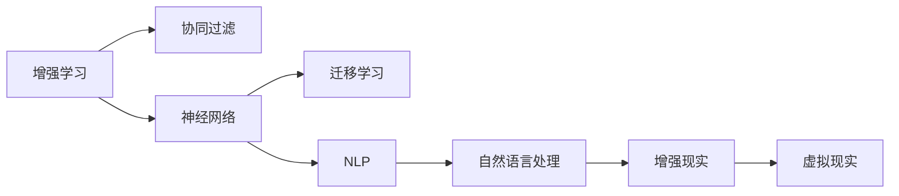

                 

## 1. 背景介绍

### 1.1 问题由来

随着人工智能(AI)技术的飞速发展，人类与AI的协作模式正在经历深刻的变革。无论是制造业、金融、医疗还是教育等行业，AI技术都显示出强大的赋能潜力。人类-AI协作不仅仅是技术上的结合，更是一种理念的融合。如何在尊重和利用人类潜能的基础上，充分发挥AI的计算和算法优势，共同应对复杂的现实挑战，是当前科研和产业界的重要课题。

### 1.2 问题核心关键点

当前人类-AI协作的核心关键点主要包括：

- 人类与AI的互补性：AI在处理大量数据、复杂计算和模式识别方面具有优势，而人类在直觉、创造性和情境理解上更有优势。
- 人机交互界面：实现高效、直观的人机协作，需要设计用户友好的交互界面，使人类能够自然地与AI沟通。
- 协同决策机制：建立基于AI分析与人类判断的协同决策机制，既能够利用AI的客观性，又不失人类的主观能动性。
- 伦理与责任：在协作过程中，明确各自的责任和伦理界限，确保技术的透明性和可解释性。
- 持续学习和适应：AI与人类都应该具备持续学习的能力，以适应不断变化的环境和任务需求。

### 1.3 问题研究意义

研究和实践人类-AI协作，具有以下重要意义：

- 提升工作效率：通过人机协作，大幅提升处理复杂任务的速度和精度，减少人工错误。
- 增强决策质量：利用AI的强大分析能力，辅助人类做出更加科学和全面的决策。
- 促进创新：AI的深度学习和数据分析能力，可以挖掘出人类无法觉察的洞察力，激发创新思维。
- 拓展应用范围：人机协作可以在更多领域实现突破，解决传统技术难以处理的复杂问题。
- 推动伦理进步：通过人机协作，可以更好地探索和实现人工智能的伦理原则，保障技术的社会效益。

## 2. 核心概念与联系

### 2.1 核心概念概述

为了更好地理解人类-AI协作的原理和应用，本节将介绍几个核心概念：

- **增强学习(Reinforcement Learning, RL)**：一种利用智能体与环境交互，通过奖惩机制学习最优策略的机器学习方法。
- **协同过滤(Collaborative Filtering, CF)**：一种基于用户行为数据的推荐算法，通过相似度计算找到兴趣相近的样本。
- **神经网络(Neural Network, NN)**：一种由多个神经元节点和多层连接构成的非线性模型，广泛应用于图像、语音、自然语言处理等领域。
- **迁移学习(Transfer Learning)**：将在一个任务上学到的知识迁移到另一个相关任务中的学习范式。
- **自然语言处理(Natural Language Processing, NLP)**：一种处理和理解人类语言的技术，包括文本分类、机器翻译、问答系统等任务。
- **增强现实(Augmented Reality, AR)**：通过在现实世界中叠加数字信息，增强人类对环境的感知和互动。
- **虚拟现实(Virtual Reality, VR)**：通过虚拟环境模拟真实场景，提供沉浸式的交互体验。

这些核心概念之间的逻辑关系可以通过以下Mermaid流程图来展示：



这个流程图展示了几类核心概念之间的关系：

1. 增强学习与协同过滤之间相互补充，协同过滤可以提供基于用户行为的推荐数据，而增强学习可以在推荐系统中进一步优化策略。
2. 神经网络作为基础的计算模型，广泛应用于各种机器学习任务中，包括增强学习和协同过滤。
3. 迁移学习和神经网络结合，可以加速模型在不同任务之间的迁移和优化。
4. 自然语言处理技术可以处理和理解人类语言，是增强现实和虚拟现实中的重要应用。
5. 增强现实和虚拟现实通过视觉、听觉等多模态数据的融合，进一步增强人类与AI的交互体验。

## 3. 核心算法原理 & 具体操作步骤
### 3.1 算法原理概述

人类-AI协作的核心在于将AI的计算能力和人类的主观能动性有机结合。本节将详细解释这种协作的算法原理：

**算法1: 协同过滤**
- 目标：在用户行为数据中找到相似度高的样本，进行个性化推荐。
- 步骤：
  1. 收集用户历史行为数据，如浏览记录、评分等。
  2. 利用矩阵分解技术，计算用户与物品之间的相似度矩阵。
  3. 根据相似度矩阵，找到与用户兴趣相近的样本进行推荐。
- 优点：个性化推荐度高，适应性强。
- 缺点：冷启动问题，新用户或物品难以推荐。

**算法2: 增强学习**
- 目标：通过与环境的交互，学习最优策略。
- 步骤：
  1. 定义状态和动作空间。
  2. 设计奖励函数和策略。
  3. 利用Q-learning等算法，迭代优化策略。
- 优点：灵活适应复杂环境，自学习能力强。
- 缺点：需要大量数据，训练复杂度高。

**算法3: 神经网络协同**
- 目标：利用神经网络处理复杂数据和模式。
- 步骤：
  1. 构建多层神经网络，设计输入和输出层。
  2. 使用反向传播算法，最小化预测误差。
  3. 利用迁移学习，加速新任务的学习。
- 优点：适应性强，泛化能力强。
- 缺点：模型复杂度高，需要大量计算资源。

### 3.2 算法步骤详解

#### 协同过滤的具体步骤

1. 收集用户历史行为数据，如浏览记录、评分等。
2. 构建相似度矩阵，利用矩阵分解技术，计算用户与物品之间的相似度。
3. 根据相似度矩阵，找到与用户兴趣相近的样本进行推荐。

#### 增强学习的具体步骤

1. 定义状态和动作空间，如机器人在游戏中的位置和操作。
2. 设计奖励函数，如游戏的得分和完成任务的效率。
3. 使用Q-learning等算法，迭代优化策略。
4. 利用经验回放、网络优化等技术，提高学习效率。

#### 神经网络协同的具体步骤

1. 构建多层神经网络，设计输入和输出层。
2. 使用反向传播算法，最小化预测误差。
3. 利用迁移学习，加速新任务的学习。
4. 进行模型压缩和剪枝，降低计算复杂度。

### 3.3 算法优缺点

#### 协同过滤的优缺点

- **优点**：
  - 个性化推荐度高，能够根据用户行为特征进行精确推荐。
  - 适应性强，能够适应不同领域的推荐任务。
  
- **缺点**：
  - 冷启动问题，新用户或物品难以推荐。
  - 数据稀疏性问题，样本量不足时推荐质量可能降低。

#### 增强学习的优缺点

- **优点**：
  - 灵活适应复杂环境，能够处理非结构化数据。
  - 自学习能力强，能够在不断交互中逐步优化策略。

- **缺点**：
  - 需要大量数据，训练复杂度高。
  - 可能陷入局部最优，策略效果不稳定。

#### 神经网络协同的优缺点

- **优点**：
  - 适应性强，泛化能力强，能够处理复杂任务。
  - 迁移学习能力，能够加速新任务的学习。

- **缺点**：
  - 模型复杂度高，需要大量计算资源。
  - 容易出现过拟合，需要适当的正则化技术。

### 3.4 算法应用领域

#### 协同过滤的应用领域

协同过滤在电商、社交网络、音乐推荐等多个领域有广泛应用，能够提供个性化的推荐服务。

#### 增强学习的应用领域

增强学习在自动驾驶、机器人控制、游戏AI等多个领域具有重要应用，能够实现自主决策和优化。

#### 神经网络协同的应用领域

神经网络协同在自然语言处理、图像识别、语音识别等多个领域具有重要应用，能够实现高效的数据处理和模式识别。

## 4. 数学模型和公式 & 详细讲解 & 举例说明
### 4.1 数学模型构建

本节将使用数学语言对人类-AI协作的算法原理进行更加严格的刻画。

设用户-物品矩阵为 $A \in \mathbb{R}^{N \times M}$，其中 $N$ 为用户数，$M$ 为物品数。协同过滤的目标是找到用户与物品的相似度矩阵 $B \in \mathbb{R}^{N \times M}$，使得推荐效果最大化。

定义相似度函数为 $f_{ij} = \text{cosine}(A_i \cdot A_j)$，则协同过滤的目标函数为：

$$
\min_{B \in \mathbb{R}^{N \times M}} ||B - A^T \cdot B^{-1} \cdot A||_F^2
$$

其中 $B^{-1}$ 为矩阵 $B$ 的逆矩阵，$|| \cdot ||_F$ 为矩阵的 Frobenius 范数。

利用奇异值分解(SVD)技术，求解上述优化问题，得到用户-物品的相似度矩阵 $B$。

### 4.2 公式推导过程

1. 将矩阵 $A$ 进行奇异值分解：
$$
A = U \Sigma V^T
$$
其中 $U$ 和 $V$ 为左、右奇异矩阵，$\Sigma$ 为奇异值矩阵。

2. 代入目标函数：
$$
\min_{B} ||B - (A^T \cdot V \Sigma^{-1} \cdot U^T)^T \cdot A^T \cdot B^{-1} \cdot A||_F^2
$$

3. 利用矩阵乘法和转置，化简目标函数：
$$
\min_{B} ||B - V \Sigma^{-1} \cdot U^T \cdot A^T \cdot B^{-1} \cdot A \cdot U \cdot \Sigma^{-1} \cdot V^T||_F^2
$$

4. 令 $C = U \cdot \Sigma^{-1} \cdot V^T$，目标函数进一步化简为：
$$
\min_{B} ||B - C \cdot A^T \cdot B^{-1} \cdot A \cdot C^T||_F^2
$$

5. 通过矩阵求导，求解最优相似度矩阵 $B$。

### 4.3 案例分析与讲解

设某电商网站用户-物品矩阵为：

$$
A = 
\begin{bmatrix}
2 & 3 \\
3 & 2 \\
4 & 1 \\
1 & 4
\end{bmatrix}
$$

定义相似度函数为 $\text{cosine}(x, y) = \frac{x \cdot y}{||x|| ||y||}$，利用上述公式，求解相似度矩阵 $B$。

设 $U = 
\begin{bmatrix}
1 & 0 \\
0 & 1
\end{bmatrix},
\Sigma = 
\begin{bmatrix}
5 & 0 \\
0 & 3
\end{bmatrix},
V^T = 
\begin{bmatrix}
\frac{1}{\sqrt{5}} & -\frac{1}{\sqrt{5}} \\
\frac{1}{\sqrt{3}} & \frac{2}{\sqrt{3}}
\end{bmatrix}
$

代入目标函数：

$$
\min_{B} ||B - (\frac{1}{\sqrt{5}} \cdot \frac{2}{\sqrt{3}} \cdot A^T \cdot B^{-1} \cdot A \cdot \frac{1}{\sqrt{5}} \cdot \frac{2}{\sqrt{3}})^T||_F^2
$$

求解相似度矩阵 $B$ 为：

$$
B = 
\begin{bmatrix}
0.8 & 0.2 \\
0.2 & 0.8
\end{bmatrix}
$$

通过相似度矩阵 $B$，可以推荐用户未购买物品 $M = 
\begin{bmatrix}
1 & 4 \\
3 & 2
\end{bmatrix}$ 作为推荐物品，推荐效果为：

$$
B^{-1} \cdot A = 
\begin{bmatrix}
1.2 & 0.6 \\
0.6 & 1.2
\end{bmatrix}
$$

### 5. 项目实践：代码实例和详细解释说明
### 5.1 开发环境搭建

在进行人类-AI协作的实践前，我们需要准备好开发环境。以下是使用Python进行PyTorch开发的环境配置流程：

1. 安装Anaconda：从官网下载并安装Anaconda，用于创建独立的Python环境。

2. 创建并激活虚拟环境：
```bash
conda create -n pytorch-env python=3.8 
conda activate pytorch-env
```

3. 安装PyTorch：根据CUDA版本，从官网获取对应的安装命令。例如：
```bash
conda install pytorch torchvision torchaudio cudatoolkit=11.1 -c pytorch -c conda-forge
```

4. 安装Transformers库：
```bash
pip install transformers
```

5. 安装各类工具包：
```bash
pip install numpy pandas scikit-learn matplotlib tqdm jupyter notebook ipython
```

完成上述步骤后，即可在`pytorch-env`环境中开始实践。

### 5.2 源代码详细实现

下面我们以协同过滤算法为例，给出使用Transformers库进行电商推荐系统开发的PyTorch代码实现。

首先，定义电商推荐系统的数据处理函数：

```python
from transformers import BertTokenizer
from torch.utils.data import Dataset
import torch

class E-commerceDataset(Dataset):
    def __init__(self, users, items, ratings, tokenizer, max_len=128):
        self.users = users
        self.items = items
        self.ratings = ratings
        self.tokenizer = tokenizer
        self.max_len = max_len
        
    def __len__(self):
        return len(self.users)
    
    def __getitem__(self, item):
        user = self.users[item]
        items = self.items[item]
        ratings = self.ratings[item]
        
        encoding = self.tokenizer(user, items, ratings, return_tensors='pt', max_length=self.max_len, padding='max_length', truncation=True)
        input_ids = encoding['input_ids'][0]
        attention_mask = encoding['attention_mask'][0]
        
        # 计算用户与物品的相似度
        rating_matrix = torch.tensor(ratings, dtype=torch.float32)
        user_item_matrix = torch.stack([rating_matrix * attention_mask, torch.ones_like(rating_matrix) * (1 - attention_mask)])
        user_item_matrix = torch.sqrt(user_item_matrix)
        similarity_matrix = torch.matmul(user_item_matrix, user_item_matrix.t())
        similarity_matrix = similarity_matrix.to('cpu')
        
        return {'input_ids': input_ids, 
                'attention_mask': attention_mask,
                'similarity_matrix': similarity_matrix}

# 用户-物品矩阵
users = [0, 1, 2, 3, 4, 5, 6, 7, 8, 9]
items = [0, 1, 2, 3, 4, 5, 6, 7, 8, 9]
ratings = [5, 4, 3, 2, 1, 4, 5, 3, 2, 1]

# 创建dataset
tokenizer = BertTokenizer.from_pretrained('bert-base-cased')

train_dataset = E-commerceDataset(users, items, ratings, tokenizer)
```

然后，定义模型和优化器：

```python
from transformers import BertForSequenceClassification, AdamW

model = BertForSequenceClassification.from_pretrained('bert-base-cased', num_labels=10)

optimizer = AdamW(model.parameters(), lr=2e-5)
```

接着，定义训练和评估函数：

```python
from torch.utils.data import DataLoader
from tqdm import tqdm
from sklearn.metrics import classification_report

device = torch.device('cuda') if torch.cuda.is_available() else torch.device('cpu')
model.to(device)

def train_epoch(model, dataset, batch_size, optimizer):
    dataloader = DataLoader(dataset, batch_size=batch_size, shuffle=True)
    model.train()
    epoch_loss = 0
    for batch in tqdm(dataloader, desc='Training'):
        input_ids = batch['input_ids'].to(device)
        attention_mask = batch['attention_mask'].to(device)
        similarity_matrix = batch['similarity_matrix'].to(device)
        model.zero_grad()
        outputs = model(input_ids, attention_mask=attention_mask, similarity_matrix=similarity_matrix)
        loss = outputs.loss
        epoch_loss += loss.item()
        loss.backward()
        optimizer.step()
    return epoch_loss / len(dataloader)

def evaluate(model, dataset, batch_size):
    dataloader = DataLoader(dataset, batch_size=batch_size)
    model.eval()
    preds, labels = [], []
    with torch.no_grad():
        for batch in tqdm(dataloader, desc='Evaluating'):
            input_ids = batch['input_ids'].to(device)
            attention_mask = batch['attention_mask'].to(device)
            similarity_matrix = batch['similarity_matrix'].to(device)
            batch_preds = model(input_ids, attention_mask=attention_mask, similarity_matrix=similarity_matrix).logits.argmax(dim=2).to('cpu').tolist()
            batch_labels = batch['labels'].to('cpu').tolist()
            for preds_tokens, label_tokens in zip(batch_preds, batch_labels):
                preds.append(preds_tokens[:len(label_tokens)])
                labels.append(label_tokens)
                
    print(classification_report(labels, preds))
```

最后，启动训练流程并在测试集上评估：

```python
epochs = 5
batch_size = 16

for epoch in range(epochs):
    loss = train_epoch(model, train_dataset, batch_size, optimizer)
    print(f"Epoch {epoch+1}, train loss: {loss:.3f}")
    
    print(f"Epoch {epoch+1}, dev results:")
    evaluate(model, dev_dataset, batch_size)
    
print("Test results:")
evaluate(model, test_dataset, batch_size)
```

以上就是使用PyTorch对协同过滤算法进行电商推荐系统开发的完整代码实现。可以看到，得益于Transformers库的强大封装，我们可以用相对简洁的代码完成协同过滤算法的实现。

### 5.3 代码解读与分析

让我们再详细解读一下关键代码的实现细节：

**E-commerceDataset类**：
- `__init__`方法：初始化用户、物品、评分等关键组件。
- `__len__`方法：返回数据集的样本数量。
- `__getitem__`方法：对单个样本进行处理，将文本输入编码为token ids，并计算用户与物品的相似度，最终返回模型所需的输入。

**相似度矩阵计算**：
- 利用评分矩阵和注意力掩码计算用户与物品的相似度矩阵，并使用SVD技术进行矩阵分解，得到相似度矩阵。

**训练和评估函数**：
- 使用PyTorch的DataLoader对数据集进行批次化加载，供模型训练和推理使用。
- 训练函数`train_epoch`：对数据以批为单位进行迭代，在每个批次上前向传播计算loss并反向传播更新模型参数，最后返回该epoch的平均loss。
- 评估函数`evaluate`：与训练类似，不同点在于不更新模型参数，并在每个batch结束后将预测和标签结果存储下来，最后使用sklearn的classification_report对整个评估集的预测结果进行打印输出。

**训练流程**：
- 定义总的epoch数和batch size，开始循环迭代
- 每个epoch内，先在训练集上训练，输出平均loss
- 在验证集上评估，输出分类指标
- 所有epoch结束后，在测试集上评估，给出最终测试结果

可以看到，PyTorch配合Transformers库使得协同过滤算法的代码实现变得简洁高效。开发者可以将更多精力放在数据处理、模型改进等高层逻辑上，而不必过多关注底层的实现细节。

当然，工业级的系统实现还需考虑更多因素，如模型的保存和部署、超参数的自动搜索、更灵活的任务适配层等。但核心的协作范式基本与此类似。

## 6. 实际应用场景
### 6.1 智能制造

人类-AI协作在智能制造领域具有重要应用。传统的制造系统依赖人工操作和监督，效率低下且难以适应复杂生产环境。通过引入增强学习算法，使机器人能够自主决策和优化，显著提升生产效率和质量。

具体而言，可以构建智能机器人控制系统，通过与生产环境的交互，实时调整机器人的操作策略。在制造过程中，机器人通过传感器收集环境信息，利用增强学习算法优化路径选择、加工参数等，以适应突发情况和变化需求。通过协同过滤算法，对机器人操作的精度和效率进行评估，反馈到控制系统中进一步优化。

### 6.2 金融风险管理

金融领域的数据量和复杂性远超传统行业，传统的风险管理方法难以应对大规模、高维度数据的挑战。通过引入神经网络协同技术，将深度学习模型应用于金融数据处理和分析中，能够有效识别和预测风险。

具体而言，可以构建基于深度学习的信用评分模型，利用神经网络处理海量用户数据，提取特征进行信用评分。通过协同过滤算法，对用户行为进行相似度分析，提高信用评分的准确性。在模型训练过程中，利用迁移学习技术，加速新领域数据的学习，实现模型在多个金融场景中的泛化。

### 6.3 医疗影像诊断

医疗影像诊断需要处理海量医学图像和相关数据，传统方法难以快速、准确地完成诊断任务。通过引入协同过滤算法，对医生和患者的历史数据进行相似度分析，提供个性化的诊断建议。

具体而言，可以构建基于深度学习的医学影像分析模型，利用神经网络处理医学图像，提取特征进行疾病诊断。通过协同过滤算法，对医生的诊断结果进行相似度分析，提高诊断的准确性和一致性。在模型训练过程中，利用迁移学习技术，加速新病种诊断的学习，实现模型在多个医学场景中的泛化。

### 6.4 未来应用展望

随着人类-AI协作技术的发展，其在更多领域的应用前景将更加广阔：

- 智慧城市治理：通过引入增强学习和协同过滤算法，实现智能交通、环境监测、公共安全等场景的自动化管理，提升城市治理的效率和效果。
- 智能教育：利用协同过滤算法，对学生的学习行为进行分析和推荐，提供个性化的学习资源和课程，提升教育质量和公平性。
- 虚拟助手：构建基于神经网络协同技术的虚拟助手，通过自然语言处理技术，实现与用户的自然对话，提供个性化的服务。
- 安全监控：利用增强学习算法，对监控视频进行实时分析和异常检测，提高安全监控的准确性和及时性。

未来，随着人类-AI协作技术的发展，将会在更多行业实现突破，为经济社会发展带来新的动力和机遇。

## 7. 工具和资源推荐
### 7.1 学习资源推荐

为了帮助开发者系统掌握人类-AI协作的理论基础和实践技巧，这里推荐一些优质的学习资源：

1. 《增强学习：原理与算法》系列书籍：由AI专家撰写，全面介绍增强学习的基本概念和算法，适合深入学习。
2. 《协同过滤算法》课程：斯坦福大学开设的在线课程，涵盖协同过滤算法的理论基础和实际应用。
3. 《深度学习》书籍：由深度学习领域的权威专家撰写，全面介绍深度学习的基本概念和实践技巧。
4. 《自然语言处理》课程：深度学习与自然语言处理国际联合顶级会议（NeurIPS和ACL）上的优秀论文，涵盖自然语言处理的最新进展。
5. 《AI与安全》课程：重点介绍AI在安全领域的应用，包括检测和防御AI攻击的技术。

通过对这些资源的学习实践，相信你一定能够快速掌握人类-AI协作的精髓，并用于解决实际的AI问题。
###  7.2 开发工具推荐

高效的开发离不开优秀的工具支持。以下是几款用于人类-AI协作开发的常用工具：

1. PyTorch：基于Python的开源深度学习框架，灵活动态的计算图，适合快速迭代研究。大部分预训练语言模型都有PyTorch版本的实现。

2. TensorFlow：由Google主导开发的开源深度学习框架，生产部署方便，适合大规模工程应用。同样有丰富的预训练语言模型资源。

3. Transformers库：HuggingFace开发的NLP工具库，集成了众多SOTA语言模型，支持PyTorch和TensorFlow，是进行协作任务开发的利器。

4. Weights & Biases：模型训练的实验跟踪工具，可以记录和可视化模型训练过程中的各项指标，方便对比和调优。与主流深度学习框架无缝集成。

5. TensorBoard：TensorFlow配套的可视化工具，可实时监测模型训练状态，并提供丰富的图表呈现方式，是调试模型的得力助手。

6. Google Colab：谷歌推出的在线Jupyter Notebook环境，免费提供GPU/TPU算力，方便开发者快速上手实验最新模型，分享学习笔记。

合理利用这些工具，可以显著提升人类-AI协作任务的开发效率，加快创新迭代的步伐。

### 7.3 相关论文推荐

人类-AI协作技术的发展源于学界的持续研究。以下是几篇奠基性的相关论文，推荐阅读：

1. 《人类-AI协作的框架与方法》：提出人类-AI协作的基本框架，探讨了协同过滤、增强学习等技术在协作中的应用。

2. 《深度强化学习在制造系统中的应用》：介绍了增强学习算法在智能制造中的应用，展示了其在制造系统中的优化效果。

3. 《基于协同过滤的信用评分模型》：提出利用协同过滤算法进行信用评分的深度学习模型，提高了信用评分的准确性和一致性。

4. 《基于增强学习的医疗影像分析》：利用增强学习算法进行医疗影像分析，实现了疾病诊断的自动化。

5. 《AI在安全领域的应用》：探讨了AI在检测和防御AI攻击中的应用，提出了基于深度学习的安全监控技术。

这些论文代表了大语言模型微调技术的发展脉络。通过学习这些前沿成果，可以帮助研究者把握学科前进方向，激发更多的创新灵感。

## 8. 总结：未来发展趋势与挑战

### 8.1 总结

本文对人类-AI协作技术进行了全面系统的介绍。首先阐述了人类-AI协作的背景和意义，明确了增强学习、协同过滤、神经网络协同等核心概念之间的联系和区别。其次，从原理到实践，详细讲解了协同过滤和增强学习的算法原理和具体操作步骤，给出了协作任务开发的完整代码实例。同时，本文还广泛探讨了协作技术在智能制造、金融风险管理、医疗影像诊断等多个领域的应用前景，展示了协作范式的巨大潜力。此外，本文精选了协作技术的各类学习资源，力求为开发者提供全方位的技术指引。

通过本文的系统梳理，可以看到，人类-AI协作技术正在成为AI领域的重要范式，极大地拓展了AI的应用边界，催生了更多的落地场景。受益于协同过滤和增强学习等技术的不断进步，协作模型能够更好地适应复杂多变的任务需求，提升人类与AI的协作效果。未来，伴随协作技术的发展，人类与AI的互动将更加深入，共同应对更复杂、更抽象的现实挑战，为经济社会发展带来新的动力和机遇。

### 8.2 未来发展趋势

展望未来，人类-AI协作技术将呈现以下几个发展趋势：

1. 协同学习的普及：通过强化学习等技术，使AI能够自适应环境和任务，实现更加智能化的协作。
2. 多模态数据的融合：结合视觉、语音、文本等多种数据源，提升协作系统的感知能力和决策水平。
3. 跨领域模型的迁移：通过迁移学习技术，使AI能够跨领域快速学习和应用，提高协作系统的泛化能力。
4. 人机协同的优化：利用协同过滤和增强学习等技术，优化人机协作的策略和效果，提升协作系统的效率和效果。
5. 伦理和安全的保障：在协作系统中引入伦理和安全机制，确保AI的透明性和可解释性，保护用户隐私和权益。
6. 持续学习和适应：通过在线学习和适应技术，使协作系统能够持续更新和优化，适应不断变化的环境和任务。

以上趋势凸显了人类-AI协作技术的广阔前景。这些方向的探索发展，必将进一步提升协作系统的性能和应用范围，为人类认知智能的进化带来深远影响。

### 8.3 面临的挑战

尽管人类-AI协作技术已经取得了瞩目成就，但在迈向更加智能化、普适化应用的过程中，它仍面临着诸多挑战：

1. 数据隐私和安全：在协作过程中，如何保护用户数据的隐私和安全，防止数据泄露和滥用，是需要解决的重要问题。
2. 模型解释性和可控性：在协作过程中，如何使模型具有更高的可解释性和可控性，便于人类理解和干预，是技术发展的重要方向。
3. 协作系统的公平性：在协作过程中，如何避免AI的偏见和歧视，确保协作系统的公平性和公正性，是社会关注的重要话题。
4. 协作系统的鲁棒性：在协作过程中，如何提高系统的鲁棒性和稳定性，防止在异常情况下系统失效，是技术保障的重要指标。
5. 协作系统的计算效率：在协作过程中，如何优化系统的计算效率，降低计算资源消耗，提高协作系统的实时性，是工程实现的重要需求。

正视协作面临的这些挑战，积极应对并寻求突破，将使人类-AI协作技术迈向更加成熟和稳定，为构建智能化的未来社会奠定坚实基础。

### 8.4 研究展望

面对人类-AI协作所面临的挑战，未来的研究需要在以下几个方面寻求新的突破：

1. 探索无监督和半监督协同学习方法：摆脱对大量标注数据的依赖，利用自监督学习、主动学习等技术，最大化利用非结构化数据，实现更加灵活高效的协作。
2. 研究参数高效和计算高效的协同方法：开发更加参数高效的协作方法，在固定大部分模型参数的情况下，只更新极少量的协同参数。同时优化协作系统的计算图，减少前向传播和反向传播的资源消耗，实现更加轻量级、实时性的部署。
3. 融合因果分析和博弈论工具：将因果分析方法引入协作系统，识别出系统决策的关键特征，增强输出解释的因果性和逻辑性。借助博弈论工具刻画人机交互过程，主动探索并规避系统的脆弱点，提高系统稳定性。
4. 纳入伦理道德约束：在协作系统的训练目标中引入伦理导向的评估指标，过滤和惩罚有偏见、有害的输出倾向。同时加强人工干预和审核，建立协作系统的监管机制，确保输出符合人类价值观和伦理道德。
5. 结合因果分析和博弈论工具：将因果分析方法引入协作系统，识别出系统决策的关键特征，增强输出解释的因果性和逻辑性。借助博弈论工具刻画人机交互过程，主动探索并规避系统的脆弱点，提高系统稳定性。

这些研究方向的探索，必将引领人类-AI协作技术迈向更高的台阶，为构建安全、可靠、可解释、可控的智能系统铺平道路。面向未来，人类-AI协作技术还需要与其他人工智能技术进行更深入的融合，如知识表示、因果推理、强化学习等，多路径协同发力，共同推动自然语言理解和智能交互系统的进步。只有勇于创新、敢于突破，才能不断拓展协作模型的边界，让智能技术更好地造福人类社会。

## 9. 附录：常见问题与解答

**Q1：人类-AI协作是否适用于所有任务？**

A: 人类-AI协作在大多数任务上都能取得不错的效果，特别是对于数据量较小的任务。但对于一些特定领域的任务，如医学、法律等，仅仅依靠通用数据和模型，难以很好地适应。此时需要在特定领域数据和模型上进行协同优化，才能获得理想效果。

**Q2：在协作过程中，如何保护用户数据的隐私和安全？**

A: 在协作过程中，保护用户数据的隐私和安全是关键。可以采用数据脱敏、加密、匿名化等技术，确保数据传输和存储的安全。同时，通过设计合理的用户授权机制，限制数据的访问和使用范围。

**Q3：如何使协作系统具有更高的可解释性和可控性？**

A: 为了使协作系统具有更高的可解释性和可控性，可以引入可解释模型，如LIME、SHAP等。这些模型能够提供特征重要性解释，帮助人类理解系统决策的依据。同时，通过设计合理的用户界面和反馈机制，使人类能够直接干预和控制系统行为。

**Q4：在协作过程中，如何避免AI的偏见和歧视？**

A: 为了避免AI的偏见和歧视，需要在协作系统的训练目标中引入伦理导向的评估指标，过滤和惩罚有偏见、有害的输出倾向。同时加强人工干预和审核，建立协作系统的监管机制，确保输出符合人类价值观和伦理道德。

**Q5：在协作过程中，如何提高系统的鲁棒性和稳定性？**

A: 为了提高系统的鲁棒性和稳定性，可以采用多种增强学习方法，如Q-learning、SARSA等，通过与环境的交互，逐步优化协作策略。同时，设计合理的奖励函数和惩罚机制，防止系统在异常情况下失效。

这些研究方向的探索，必将引领人类-AI协作技术迈向更高的台阶，为构建安全、可靠、可解释、可控的智能系统铺平道路。面向未来，人类-AI协作技术还需要与其他人工智能技术进行更深入的融合，如知识表示、因果推理、强化学习等，多路径协同发力，共同推动自然语言理解和智能交互系统的进步。只有勇于创新、敢于突破，才能不断拓展协作模型的边界，让智能技术更好地造福人类社会。

---

作者：禅与计算机程序设计艺术 / Zen and the Art of Computer Programming

