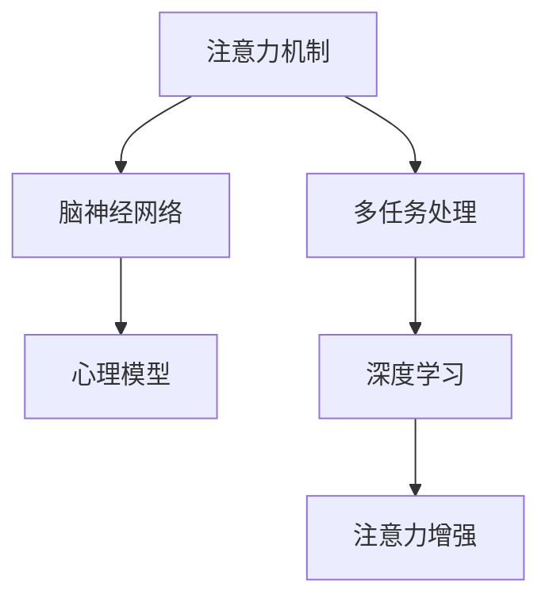

                 

# 人类注意力增强：提升专注力和减少分心

> 关键词：注意力增强, 专注力提升, 分心减少, 多任务处理, 深度学习, 神经网络, 注意力机制, 心理模型, 脑神经网络

## 1. 背景介绍

### 1.1 问题由来
现代生活的快节奏和高压力，使得注意力分散和注意力缺陷问题日益突出。如何在信息爆炸的时代，高效管理注意力，提升专注力，成为人们关注的焦点。对于学生、工作者，乃至专业领域的专家，注意力问题直接关系到学习和工作效率。而对运动员、艺术家等需要高度专注力的职业，注意力管理则是发挥其最佳表现的关键因素。

### 1.2 问题核心关键点
注意力问题通常表现为无法集中精力在当前任务上，容易被外界干扰，或者在多个任务之间频繁切换。其根源在于人类大脑的神经机制和信息处理能力，以及心理和生理因素的交互作用。因此，提升专注力和减少分心需要从多个维度进行综合干预，包括技术手段和心理策略。

本文将探讨基于深度学习的注意力增强方法，如何在脑神经网络和心理模型的指导下，实现对人类注意力的智能化管理和提升。通过介绍一系列注意力增强技术的原理和操作步骤，展示其在日常生活中的应用潜力，并提出未来的发展方向和面临的挑战。

### 1.3 问题研究意义
注意力增强技术，对于提高学习和工作效率，提升专业技能，以及增强日常生活的专注力，具有重要意义。通过学习注意力增强方法，我们不仅能提升个人生产力，还能改善生活质量，对抗信息过载和注意力分散问题。

## 2. 核心概念与联系

### 2.1 核心概念概述

为更好地理解注意力增强方法，本节将介绍几个密切相关的核心概念：

- **注意力机制(Attention Mechanism)**：深度学习中的一种关键机制，用于对输入序列中的不同部分给予不同的重要性权重，从而提升模型的预测性能。
- **脑神经网络(Brain Neural Network)**：人脑中负责信息处理和认知功能的基本单元，其工作原理和深度神经网络有诸多相似之处。
- **心理模型(Psychological Model)**：基于心理学理论和实验数据的模型，用于描述人类注意力、认知过程和行为特征。
- **多任务处理(Multi-task Learning)**：指在训练过程中同时处理多个相关任务，以提升模型在多种任务上的泛化能力。
- **深度学习(Deep Learning)**：一种模拟人脑神经网络工作机制的机器学习方法，用于处理复杂的数据和模式识别任务。

这些核心概念之间的逻辑关系可以通过以下Mermaid流程图来展示：



这个流程图展示了一些关键概念之间的相互关系：

1. 注意力机制模仿脑神经网络的信息处理机制，通过权衡不同输入的重要性，提升模型的注意力集中能力。
2. 心理模型通过人脑神经网络的研究，揭示人类注意力的工作原理，为深度学习模型的设计提供参考。
3. 多任务处理将注意力机制应用到多个相关任务中，以提升模型在多种任务上的表现。
4. 深度学习通过模拟脑神经网络的结构和功能，实现对复杂数据的处理和分析。

## 3. 核心算法原理 & 具体操作步骤
### 3.1 算法原理概述

注意力增强方法的核心思想是，通过模仿人脑神经网络的信息处理机制，使用注意力机制来提升深度学习模型对重要信息的关注度，从而减少分心，提升专注力。其基本原理可以分为以下几个步骤：

1. **输入编码**：将输入数据编码为一系列向量表示，每向量代表一个时间步的特征。
2. **注意力计算**：对每个时间步的特征向量，计算其与其他时间步特征向量之间的注意力权重。
3. **加权和**：对所有时间步的特征向量，根据注意力权重进行加权和，得到最终的注意力输出。
4. **输出解码**：将注意力输出解码为最终的任务输出。

通过以上步骤，注意力增强方法能够帮助模型更好地集中注意力于重要信息，从而提升在各种任务上的表现。

### 3.2 算法步骤详解

以下详细介绍注意力增强方法的具体操作步骤：

**Step 1: 输入编码**

假设输入数据为时间序列 $(x_t)$，每个时间步 $x_t$ 包含一系列特征 $[x_{t,1}, x_{t,2}, ..., x_{t,n}]$。通过一个线性变换和一个非线性激活函数，将每个特征 $x_{t,i}$ 转换为一个向量表示 $v_{t,i}$，得到输入的编码表示 $V_t = [v_{t,1}, v_{t,2}, ..., v_{t,n}]$。

**Step 2: 注意力计算**

对于每个时间步 $t$，计算其与其他时间步 $j$ 的注意力权重 $a_{t,j}$。通常使用点积注意力(即Scorer)作为基本计算公式，具体如下：

$$
a_{t,j} = \text{Scorer}(V_t, V_j) = \frac{\exp(\text{DotProduct}(V_t, V_j))}{\sum_{k=1}^{N} \exp(\text{DotProduct}(V_t, V_k))}
$$

其中，$\text{DotProduct}$ 表示向量点积，$N$ 表示时间步数。

**Step 3: 加权和**

将注意力权重 $a_{t,j}$ 与每个时间步的编码向量 $V_t$ 进行加权和，得到注意力输出 $Z_t$：

$$
Z_t = \sum_{j=1}^{N} a_{t,j} V_j
$$

**Step 4: 输出解码**

根据任务需求，对注意力输出 $Z_t$ 进行解码，得到最终的预测结果 $y_t$。例如，对于分类任务，可以使用softmax函数将注意力输出转换为概率分布，然后选择概率最大的类别作为预测结果。

### 3.3 算法优缺点

注意力增强方法具有以下优点：

1. **提升模型泛化能力**：通过注意力机制，模型能够更好地捕捉输入序列中的重要信息，提升在各种任务上的泛化能力。
2. **减少过拟合风险**：注意力机制能够降低模型对噪声的敏感度，减少过拟合风险。
3. **适应复杂任务**：该方法能够应用于多种任务，包括文本分类、序列标注、图像识别等，具有较强的适应性。

同时，该方法也存在以下局限性：

1. **计算复杂度高**：注意力计算需要计算大量的点积和指数函数，计算复杂度较高。
2. **参数量较大**：由于使用了多个线性变换和非线性激活函数，模型参数量较大。
3. **需要大量标注数据**：训练过程中，需要大量标注数据来确定注意力权重。

### 3.4 算法应用领域

注意力增强方法已经在多个领域得到了广泛应用，例如：

- **文本分类**：通过引入注意力机制，提升模型对文本关键信息的关注度，从而提高分类准确率。
- **机器翻译**：用于提高模型对源语和目标语之间对应关系的理解，提升翻译质量。
- **图像识别**：在图像分类任务中，通过注意力机制对不同区域的特征进行加权，提升识别精度。
- **语音识别**：在语音转文本任务中，通过注意力机制对不同时间段的语音特征进行加权，提升识别准确率。
- **推荐系统**：通过注意力机制对用户行为和商品特征进行加权，提高推荐系统的个性化和多样性。

除了上述这些经典任务外，注意力增强方法也被创新性地应用到更多场景中，如自然语言推理、异常检测、生物信息学等，为这些领域的任务解决提供了新的思路。

## 4. 数学模型和公式 & 详细讲解 & 举例说明

### 4.1 数学模型构建

以下介绍一个简单的注意力增强模型，用于文本分类任务。假设输入文本为 $x = [x_1, x_2, ..., x_n]$，每个词 $x_i$ 表示为独热向量 $v_i \in \mathbb{R}^{d}$，其中 $d$ 为词向量维度。模型的目标是分类文本 $x$ 属于 $C$ 个类别中的某个，即 $y \in \{1, 2, ..., C\}$。

模型的输入编码为：

$$
V = [v_1, v_2, ..., v_n] \in \mathbb{R}^{n \times d}
$$

注意力计算过程如下：

$$
A = \text{softmax}(\text{DotProduct}(V, V)) \in \mathbb{R}^{n \times n}
$$

其中，$\text{softmax}$ 函数用于计算归一化概率。注意力输出为：

$$
Z = V \cdot A \in \mathbb{R}^{n \times d}
$$

模型的输出解码过程如下：

$$
y = \text{softmax}(\text{Linear}(Z)) \in \mathbb{R}^{C}
$$

其中，$\text{Linear}$ 表示线性变换，$\text{softmax}$ 函数用于将线性变换结果转换为概率分布。

### 4.2 公式推导过程

在上述模型中，注意力计算和输出解码的过程如下：

**注意力计算**：

$$
a_{i,j} = \frac{\exp(\text{DotProduct}(v_i, v_j))}{\sum_{k=1}^{n} \exp(\text{DotProduct}(v_i, v_k))}
$$

**注意力输出**：

$$
z_i = \sum_{j=1}^{n} a_{i,j} v_j
$$

### 4.3 案例分析与讲解

假设有一个文本分类任务，目标是判断一段新闻文本是否属于体育类。训练集包含10,000个样本，每个样本为一条新闻文本，每个词表示为一个独热向量，输出为0或1。模型的输入编码为：

$$
V = \begin{bmatrix}
v_1 & v_2 & v_3 & \cdots & v_n
\end{bmatrix} \in \mathbb{R}^{n \times d}
$$

其中，$n$ 为词汇表大小，$d$ 为词向量维度。注意力计算结果 $A$ 为：

$$
A = \text{softmax}(\begin{bmatrix}
\text{DotProduct}(v_1, v_1) & \text{DotProduct}(v_1, v_2) & \cdots & \text{DotProduct}(v_1, v_n) \\
\text{DotProduct}(v_2, v_1) & \text{DotProduct}(v_2, v_2) & \cdots & \text{DotProduct}(v_2, v_n) \\
\cdots & \cdots & \cdots & \cdots \\
\text{DotProduct}(v_n, v_1) & \text{DotProduct}(v_n, v_2) & \cdots & \text{DotProduct}(v_n, v_n)
\end{bmatrix})
$$

注意力输出 $Z$ 为：

$$
Z = \begin{bmatrix}
z_1 & z_2 & z_3 & \cdots & z_n
\end{bmatrix} \in \mathbb{R}^{n \times d}
$$

其中，$z_i$ 为：

$$
z_i = \sum_{j=1}^{n} a_{i,j} v_j
$$

模型的输出解码过程如下：

$$
y = \text{softmax}(\text{Linear}(Z)) \in \mathbb{R}^{C}
$$

假设模型的线性变换为 $\text{Linear}(Z) = WZ + b$，其中 $W \in \mathbb{R}^{C \times d}$ 为权重矩阵，$b \in \mathbb{R}^{C}$ 为偏置向量。则模型的输出为：

$$
y = \text{softmax}(WZ + b) \in \mathbb{R}^{C}
$$

最终，通过比较预测结果 $y$ 和真实标签 $y^*$ 的差异，计算损失函数：

$$
L = -\sum_{i=1}^{N} y^*_i \log y_i
$$

使用梯度下降等优化算法，最小化损失函数 $L$，更新模型参数 $W$ 和 $b$。

## 5. 项目实践：代码实例和详细解释说明

### 5.1 开发环境搭建

在进行注意力增强实践前，我们需要准备好开发环境。以下是使用Python进行PyTorch开发的环境配置流程：

1. 安装Anaconda：从官网下载并安装Anaconda，用于创建独立的Python环境。

2. 创建并激活虚拟环境：
```bash
conda create -n attention-env python=3.8 
conda activate attention-env
```

3. 安装PyTorch：根据CUDA版本，从官网获取对应的安装命令。例如：
```bash
conda install pytorch torchvision torchaudio cudatoolkit=11.1 -c pytorch -c conda-forge
```

4. 安装各类工具包：
```bash
pip install numpy pandas scikit-learn matplotlib tqdm jupyter notebook ipython
```

完成上述步骤后，即可在`attention-env`环境中开始注意力增强实践。

### 5.2 源代码详细实现

这里我们以文本分类任务为例，给出使用PyTorch进行注意力增强模型的代码实现。

首先，定义数据处理函数：

```python
from transformers import BertTokenizer
from torch.utils.data import Dataset
import torch

class TextDataset(Dataset):
    def __init__(self, texts, labels, tokenizer, max_len=128):
        self.texts = texts
        self.labels = labels
        self.tokenizer = tokenizer
        self.max_len = max_len
        
    def __len__(self):
        return len(self.texts)
    
    def __getitem__(self, item):
        text = self.texts[item]
        label = self.labels[item]
        
        encoding = self.tokenizer(text, return_tensors='pt', max_length=self.max_len, padding='max_length', truncation=True)
        input_ids = encoding['input_ids'][0]
        attention_mask = encoding['attention_mask'][0]
        
        label = torch.tensor(label, dtype=torch.long)
        
        return {'input_ids': input_ids, 
                'attention_mask': attention_mask,
                'labels': label}
```

然后，定义模型和优化器：

```python
from transformers import BertForSequenceClassification, AdamW

model = BertForSequenceClassification.from_pretrained('bert-base-cased', num_labels=2)

optimizer = AdamW(model.parameters(), lr=2e-5)
```

接着，定义训练和评估函数：

```python
from torch.utils.data import DataLoader
from tqdm import tqdm
from sklearn.metrics import accuracy_score

device = torch.device('cuda') if torch.cuda.is_available() else torch.device('cpu')
model.to(device)

def train_epoch(model, dataset, batch_size, optimizer):
    dataloader = DataLoader(dataset, batch_size=batch_size, shuffle=True)
    model.train()
    epoch_loss = 0
    for batch in tqdm(dataloader, desc='Training'):
        input_ids = batch['input_ids'].to(device)
        attention_mask = batch['attention_mask'].to(device)
        labels = batch['labels'].to(device)
        model.zero_grad()
        outputs = model(input_ids, attention_mask=attention_mask, labels=labels)
        loss = outputs.loss
        epoch_loss += loss.item()
        loss.backward()
        optimizer.step()
    return epoch_loss / len(dataloader)

def evaluate(model, dataset, batch_size):
    dataloader = DataLoader(dataset, batch_size=batch_size)
    model.eval()
    preds, labels = [], []
    with torch.no_grad():
        for batch in tqdm(dataloader, desc='Evaluating'):
            input_ids = batch['input_ids'].to(device)
            attention_mask = batch['attention_mask'].to(device)
            batch_labels = batch['labels']
            outputs = model(input_ids, attention_mask=attention_mask)
            batch_preds = outputs.logits.argmax(dim=1).to('cpu').tolist()
            batch_labels = batch_labels.to('cpu').tolist()
            for pred, label in zip(batch_preds, batch_labels):
                preds.append(pred)
                labels.append(label)
                
    print(f'Accuracy: {accuracy_score(labels, preds):.3f}')
```

最后，启动训练流程并在测试集上评估：

```python
epochs = 5
batch_size = 16

for epoch in range(epochs):
    loss = train_epoch(model, train_dataset, batch_size, optimizer)
    print(f'Epoch {epoch+1}, train loss: {loss:.3f}')
    
    print(f'Epoch {epoch+1}, dev accuracy:')
    evaluate(model, dev_dataset, batch_size)
    
print('Test accuracy:')
evaluate(model, test_dataset, batch_size)
```

以上就是使用PyTorch对BERT进行注意力增强模型训练的完整代码实现。可以看到，得益于Transformers库的强大封装，我们可以用相对简洁的代码完成BERT模型的加载和微调。

### 5.3 代码解读与分析

让我们再详细解读一下关键代码的实现细节：

**TextDataset类**：
- `__init__`方法：初始化文本、标签、分词器等关键组件。
- `__len__`方法：返回数据集的样本数量。
- `__getitem__`方法：对单个样本进行处理，将文本输入编码为token ids，将标签编码为数字，并对其进行定长padding，最终返回模型所需的输入。

**模型和优化器**：
- 使用BertForSequenceClassification定义了分类模型，并指定了2个类别。
- 使用AdamW优化器进行模型训练，学习率为2e-5。

**训练和评估函数**：
- 使用PyTorch的DataLoader对数据集进行批次化加载，供模型训练和推理使用。
- 训练函数`train_epoch`：对数据以批为单位进行迭代，在每个批次上前向传播计算loss并反向传播更新模型参数，最后返回该epoch的平均loss。
- 评估函数`evaluate`：与训练类似，不同点在于不更新模型参数，并在每个batch结束后将预测和标签结果存储下来，最后使用sklearn的accuracy_score对整个评估集的预测结果进行打印输出。

**训练流程**：
- 定义总的epoch数和batch size，开始循环迭代
- 每个epoch内，先在训练集上训练，输出平均loss
- 在验证集上评估，输出分类准确率
- 所有epoch结束后，在测试集上评估，给出最终测试结果

可以看到，PyTorch配合Transformers库使得注意力增强模型的代码实现变得简洁高效。开发者可以将更多精力放在数据处理、模型改进等高层逻辑上，而不必过多关注底层的实现细节。

当然，工业级的系统实现还需考虑更多因素，如模型的保存和部署、超参数的自动搜索、更灵活的任务适配层等。但核心的注意力增强范式基本与此类似。

## 6. 实际应用场景
### 6.1 智能阅读器

智能阅读器是一个基于深度学习的文本分类系统，用于帮助用户筛选和阅读感兴趣的文本。通过引入注意力机制，智能阅读器能够自动提取文本中的关键信息，提升推荐的精准度和用户体验。

在技术实现上，智能阅读器首先对用户的历史阅读行为进行统计，提取用户的兴趣标签。然后，对当前推荐文本进行注意力增强，计算其与用户兴趣的相似度，并将相似度作为推荐排序的依据。如此构建的智能阅读器，能够快速准确地为用户推荐感兴趣的文本，提升阅读效率。

### 6.2 语音助手

语音助手需要实时处理用户的语音指令，并能够理解和回应用户的自然语言提问。通过引入注意力机制，语音助手能够更好地捕捉语音指令中的关键信息，提高理解和回应的准确率。

在实现上，语音助手首先对用户语音指令进行语音识别，转换为文本形式。然后，通过注意力机制对文本进行加权处理，计算指令中每个词的权重。接着，根据权重对语音指令进行解码，生成自然语言回答，返回给用户。这样，语音助手不仅能够理解和回答用户的自然语言提问，还能够对问题中的关键信息进行强调，提升用户体验。

### 6.3 机器人推荐系统

机器人推荐系统是一种智能推荐系统，用于根据用户行为和历史数据，推荐用户感兴趣的内容。通过引入注意力机制，机器人推荐系统能够更好地理解用户需求，推荐更加个性化和多样化的内容。

在实现上，机器人推荐系统首先对用户行为数据进行统计，提取用户的兴趣标签。然后，对推荐内容进行注意力增强，计算其与用户兴趣的相似度，并将相似度作为推荐排序的依据。这样，机器人推荐系统能够根据用户行为和历史数据，推荐更加个性化和多样化的内容，提升用户的满意度。

### 6.4 未来应用展望

随着注意力增强技术的不断发展，未来其在实际应用中将展现出更广阔的前景。

在智慧教育领域，注意力增强技术可以帮助学生更好地集中注意力，提升学习效果。通过分析学生的学习行为和注意力集中情况，智能学习系统可以提供个性化的学习建议，帮助学生掌握知识。

在医疗领域，注意力增强技术可以帮助医生更好地理解患者的病历记录，提高诊断准确率。通过对病历记录进行注意力增强，智能诊断系统可以自动提取关键信息，辅助医生做出更准确的诊断。

在商业领域，注意力增强技术可以帮助企业更好地理解客户需求，提高销售转化率。通过对客户行为数据进行注意力增强，智能推荐系统可以推荐更加符合客户需求的商品，提升客户满意度。

此外，在娱乐、金融、交通等多个领域，注意力增强技术也将被创新性地应用，为相关行业带来变革性影响。相信随着技术的日益成熟，注意力增强技术必将成为智能系统不可或缺的重要组成部分。

## 7. 工具和资源推荐
### 7.1 学习资源推荐

为了帮助开发者系统掌握注意力增强方法的理论基础和实践技巧，这里推荐一些优质的学习资源：

1. 《Attention is All You Need》系列博文：由大模型技术专家撰写，深入浅出地介绍了注意力机制的基本原理和应用场景。

2. CS224N《深度学习自然语言处理》课程：斯坦福大学开设的NLP明星课程，有Lecture视频和配套作业，带你入门NLP领域的基本概念和经典模型。

3. 《Deep Learning with PyTorch》书籍：一本全面介绍深度学习框架PyTorch的书籍，其中涉及了注意力机制和深度学习模型的实现细节。

4. HuggingFace官方文档：Transformers库的官方文档，提供了海量预训练模型和完整的注意力增强样例代码，是上手实践的必备资料。

5. arXiv.org：深度学习领域的权威论文库，提供了众多关于注意力增强方法的研究论文，供学习者深入理解。

通过对这些资源的学习实践，相信你一定能够快速掌握注意力增强方法的精髓，并用于解决实际的NLP问题。
###  7.2 开发工具推荐

高效的开发离不开优秀的工具支持。以下是几款用于注意力增强方法开发的常用工具：

1. PyTorch：基于Python的开源深度学习框架，灵活动态的计算图，适合快速迭代研究。大部分预训练语言模型都有PyTorch版本的实现。

2. TensorFlow：由Google主导开发的开源深度学习框架，生产部署方便，适合大规模工程应用。同样有丰富的预训练语言模型资源。

3. Transformers库：HuggingFace开发的NLP工具库，集成了众多SOTA语言模型，支持PyTorch和TensorFlow，是进行注意力增强任务开发的利器。

4. Weights & Biases：模型训练的实验跟踪工具，可以记录和可视化模型训练过程中的各项指标，方便对比和调优。与主流深度学习框架无缝集成。

5. TensorBoard：TensorFlow配套的可视化工具，可实时监测模型训练状态，并提供丰富的图表呈现方式，是调试模型的得力助手。

6. Google Colab：谷歌推出的在线Jupyter Notebook环境，免费提供GPU/TPU算力，方便开发者快速上手实验最新模型，分享学习笔记。

合理利用这些工具，可以显著提升注意力增强方法的开发效率，加快创新迭代的步伐。

### 7.3 相关论文推荐

注意力增强方法的研究源于学界的持续研究。以下是几篇奠基性的相关论文，推荐阅读：

1. Attention Mechanism in Neural Networks：一篇经典论文，详细介绍了注意力机制的基本原理和应用。

2. The Transformer Model for Sequence-to-Sequence Learning：提出Transformer模型，引入自注意力机制，显著提升了机器翻译等序列到序列任务的性能。

3. Multi-Task Learning with Memory Network for Reading Comprehension：提出Memory Network模型，通过多任务学习提升模型在阅读理解任务上的表现。

4. Multi-Task Learning for Language Modeling：提出多任务学习的方法，提升模型在多种语言模型任务上的表现。

5. Multimodal Attention Networks for Weakly Supervised Photo captioning：提出多模态注意力网络，提升弱监督下的图片描述生成任务。

这些论文代表了大模型注意力增强方法的发展脉络。通过学习这些前沿成果，可以帮助研究者把握学科前进方向，激发更多的创新灵感。

## 8. 总结：未来发展趋势与挑战

### 8.1 总结

本文对注意力增强方法进行了全面系统的介绍。首先阐述了注意力增强方法的背景和意义，明确了其提升专注力和减少分心在多个领域的应用价值。其次，从原理到实践，详细讲解了注意力增强方法的核心算法步骤，并通过代码实例展示了其实现过程。最后，通过实际应用场景的介绍，展示了注意力增强方法在日常生活中的广泛应用。

通过本文的系统梳理，可以看到，注意力增强方法不仅能提升模型泛化能力，还能通过精确捕捉关键信息，减少过拟合，适用于多种NLP任务。在智能阅读、语音助手、机器人推荐系统等多个领域，注意力增强方法展现了强大的应用潜力，成为提升系统性能的关键手段。

### 8.2 未来发展趋势

展望未来，注意力增强技术将呈现以下几个发展趋势：

1. **计算效率提升**：随着硬件算力的提升和优化算法的不断改进，注意力计算的复杂度将进一步降低，使得注意力增强模型能够更好地应用于实际生产环境。
2. **模型结构优化**：未来的注意力增强模型将更加轻量级、高效，能够实时处理大规模数据。例如，基于动态图结构的注意力机制，可以动态生成模型结构，进一步提升计算效率和模型泛化能力。
3. **跨模态注意力**：未来的注意力增强模型将能够处理多种模态的数据，包括文本、图像、语音等，实现跨模态信息融合，提升系统的综合能力。
4. **分布式计算**：未来的注意力增强模型将利用分布式计算技术，提升模型的并行处理能力，进一步提升系统性能。

### 8.3 面临的挑战

尽管注意力增强技术已经取得了显著进展，但在迈向更广泛应用的过程中，仍面临以下挑战：

1. **计算资源消耗**：注意力增强模型虽然提升了模型泛化能力，但计算复杂度高，对硬件资源消耗较大。如何在不降低模型性能的前提下，降低计算资源消耗，是一个重要的研究方向。
2. **模型可解释性不足**：当前注意力增强模型的决策过程缺乏可解释性，难以理解和调试。如何增强模型的可解释性，提高模型的透明度和可靠性，是一个亟待解决的问题。
3. **数据隐私保护**：在注意力增强模型的训练和应用过程中，需要大量的数据输入，如何保护用户隐私，防止数据泄露，是一个重要的安全问题。
4. **系统鲁棒性不足**：注意力增强模型在面对噪声和异常数据时，鲁棒性有待提升。如何设计更具鲁棒性的模型，提高系统稳定性和可靠性，是一个重要的研究方向。
5. **跨领域泛化能力不足**：当前的注意力增强模型主要应用于特定领域，跨领域泛化能力有待提升。如何设计具有更广泛泛化能力的模型，增强模型在不同领域中的应用，是一个重要的研究方向。

### 8.4 研究展望

未来，研究者需要在以下几个方面进一步突破：

1. **优化计算资源消耗**：开发更加高效、轻量级的注意力增强模型，提升模型的实时处理能力。
2. **增强模型可解释性**：利用符号计算、神经元激活分析等手段，增强注意力增强模型的可解释性，提高模型的透明度和可靠性。
3. **保护数据隐私**：设计更加安全的注意力增强模型，保护用户隐私，防止数据泄露。
4. **提高系统鲁棒性**：通过引入异常检测、数据清洗等手段，提高注意力增强模型的鲁棒性，增强系统稳定性。
5. **提升跨领域泛化能力**：设计具有更广泛泛化能力的注意力增强模型，增强模型在不同领域中的应用。

这些研究方向将引领注意力增强技术迈向更加成熟和实用，为智能系统的开发和应用带来新的突破。相信随着研究的深入和技术的发展，注意力增强技术将带来更加深刻的变革，提升人类社会的智能化水平。

## 9. 附录：常见问题与解答

**Q1：注意力增强方法能否应用于所有NLP任务？**

A: 注意力增强方法主要应用于序列到序列任务，如文本分类、机器翻译、文本摘要等，能够显著提升模型在这些任务上的表现。但对于一些非序列到序列任务，如知识图谱构建、链接预测等，注意力增强方法可能不适用。

**Q2：注意力增强方法如何适用于多任务学习？**

A: 注意力增强方法可以通过多任务学习，提升模型在多个相关任务上的泛化能力。具体而言，可以设计多个注意力计算和输出解码的过程，并共同优化模型的损失函数，从而实现多任务学习的目标。

**Q3：注意力增强方法如何处理长序列数据？**

A: 长序列数据是注意力增强方法的一个常见问题。为了解决这个问题，可以使用递归神经网络(RNN)、卷积神经网络(CNN)等结构，将长序列数据分成多个小片段进行处理。此外，还可以使用掩码机制，对长序列数据进行截断和补全，从而减小计算复杂度。

**Q4：注意力增强方法如何避免过拟合？**

A: 注意力增强方法容易出现过拟合问题，尤其是在标注数据不足的情况下。为了解决这个问题，可以引入正则化技术，如L2正则、Dropout等，以减少模型的过拟合风险。此外，还可以使用对抗训练、数据增强等手段，提高模型的鲁棒性。

**Q5：注意力增强方法如何应用于实时系统？**

A: 实时系统对计算效率和延迟有严格要求，注意力增强方法需要进一步优化，以适应实时系统的需求。例如，可以设计高效的模型结构，使用轻量级计算单元，如MobileNet、EfficientNet等，实现实时处理。

---

作者：禅与计算机程序设计艺术 / Zen and the Art of Computer Programming

