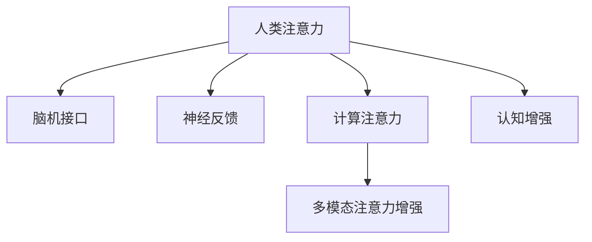

                 

# 人类注意力增强：提升专注力和注意力在商业中的未来发展策略

在快速发展的数字化时代，人类注意力增强已经成为了商业竞争的关键要素之一。无论是在零售、医疗、教育，还是智能制造等领域，注意力管理能力的提升都可能带来显著的商业收益。本文将详细探讨人类注意力增强的原理、操作方法以及商业应用，为未来发展提供策略。

## 1. 背景介绍

### 1.1 问题由来
随着互联网和移动互联网的普及，信息过载已经成为一个普遍现象。人们每天面临海量信息，且需要从这些信息中筛选出有价值的内容。然而，由于缺乏高效的信息处理能力，许多人常常陷入“信息陷阱”，无法在短时间内抓住关键信息，导致决策失误和效率低下。

### 1.2 问题核心关键点
注意力增强的目的是提升人类处理信息的能力，使人们能够更快、更准确地从信息海洋中提取关键信息。其核心在于改进人类注意力的分配机制，使之能够更好地聚焦于重要任务和关键信息。注意力增强技术可以分为内部注意力增强和外部注意力增强两大类。

1. 内部注意力增强：通过脑机接口、神经反馈等手段直接改善人类大脑注意力分配机制。
2. 外部注意力增强：通过计算机视觉、自然语言处理等技术辅助人类注意力的分配，提升信息处理效率。

### 1.3 问题研究意义
提升人类注意力管理能力，对提高个人效率、增强决策能力、提升组织协作能力等方面具有重要意义。其研究价值不仅体现在个体层面，更体现在组织、行业乃至社会层面的广泛应用前景。

## 2. 核心概念与联系

### 2.1 核心概念概述

为更好地理解人类注意力增强，本节将介绍几个密切相关的核心概念：

- 人类注意力（Human Attention）：人类大脑在处理信息时，集中注意力的能力和机制。
- 脑机接口（Brain-Computer Interface, BCI）：通过脑电信号等手段，将人类注意力转化为机器可读的指令。
- 神经反馈（Neurofeedback）：通过实时监测和反馈大脑活动状态，指导用户改善注意力分配。
- 计算注意力（Computational Attention）：计算机算法辅助人类注意力分配的技术，如信息过滤、视觉注意点识别等。
- 多模态注意力增强：结合视觉、听觉等多种感官信息，提升注意力处理效率。
- 认知增强（Cognitive Enhancement）：通过训练和优化大脑网络，改善认知功能，如记忆、学习、决策等。

这些核心概念之间的逻辑关系可以通过以下Mermaid流程图来展示：



这个流程图展示了许多核心概念及其之间的关系：

1. 人类注意力通过脑机接口、神经反馈等技术转化为机器指令。
2. 计算注意力利用神经网络和算法辅助人类注意力分配。
3. 多模态注意力增强融合多种感官信息提升注意力处理能力。
4. 认知增强通过训练大脑网络，改善整体认知功能。

## 3. 核心算法原理 & 具体操作步骤

### 3.1 算法原理概述

人类注意力增强的本质是通过技术手段改善人类大脑的注意力分配机制。其基本原理可以分为以下几个方面：

1. **大脑神经机制理解**：研究人类注意力在大脑中的具体机制，如注意力的感知、选择、聚焦等。
2. **脑机接口技术**：将人类大脑的电信号等转化为机器可读的指令，实现对大脑活动的直接控制。
3. **神经反馈方法**：通过实时监测大脑活动状态，向用户提供反馈信息，指导其改善注意力分配。
4. **计算注意力算法**：利用神经网络和算法优化信息处理，提升注意力的效果和效率。

### 3.2 算法步骤详解

基于上述原理，人类注意力增强的技术步骤通常包括以下几个关键环节：

**Step 1: 数据采集与预处理**
- 通过脑电信号、脑磁信号等手段采集人类注意力相关数据。
- 数据预处理，包括滤波、去噪、特征提取等步骤。

**Step 2: 注意力分析与建模**
- 利用机器学习算法，分析人类注意力的特征，建立注意力模型。
- 应用深度神经网络模型，如卷积神经网络、递归神经网络等，进行注意力建模。

**Step 3: 脑机接口训练与优化**
- 将注意力模型应用于脑机接口系统，实现对大脑活动的控制和优化。
- 训练算法，如强化学习算法、序列生成算法等，优化脑机接口的控制效果。

**Step 4: 神经反馈与用户干预**
- 实时监测用户的大脑活动状态，通过神经反馈向用户提供注意力状况信息。
- 根据用户反馈，调整注意力模型和脑机接口参数，进行迭代优化。

**Step 5: 计算注意力辅助**
- 利用计算机视觉、自然语言处理等技术，辅助人类注意力分配，提供信息过滤、提示提醒等功能。
- 结合多模态信息，提升注意力处理的全面性和准确性。

### 3.3 算法优缺点

人类注意力增强具有以下优点：

1. **提升信息处理效率**：通过技术手段，显著提升人类对信息的筛选和处理能力。
2. **增强决策能力**：在复杂多变的环境下，快速捕捉关键信息，支持更精准的决策。
3. **提高工作效率**：改善注意力的分配机制，优化任务优先级和时间管理，减少时间和精力的浪费。

同时，该方法也存在一些局限性：

1. **依赖技术手段**：注意力增强的效果高度依赖于脑机接口、神经反馈等技术的实现水平。
2. **侵入性风险**：部分技术手段可能带来侵入性风险，如脑电信号采集等。
3. **用户体验问题**：技术干预可能影响用户体验，引起不适和抵触。
4. **伦理和安全问题**：技术的使用可能引发隐私保护、数据安全等问题。

尽管存在这些局限性，但人类注意力增强技术的发展前景仍然非常广阔，为提升个人和组织效率提供了新的手段。

### 3.4 算法应用领域

人类注意力增强技术已经应用于多个领域，以下是几个主要的应用场景：

1. **教育**：通过脑机接口和神经反馈技术，改善学生的注意力分配，提高学习效果和成绩。
2. **医疗**：利用计算注意力辅助技术，帮助医生更快速、准确地诊断和治疗疾病。
3. **企业管理**：改善员工的注意力管理，提高团队协作和决策效率，提升企业竞争力。
4. **智能制造**：在生产线上引入注意力增强技术，优化操作流程，提高生产效率和质量。
5. **游戏和娱乐**：利用多模态注意力增强技术，提升玩家的游戏体验和娱乐效果。
6. **军事和应急管理**：增强军人和应急响应人员的注意力管理能力，提高应对突发事件的能力。

## 4. 数学模型和公式 & 详细讲解

### 4.1 数学模型构建

本节将使用数学语言对人类注意力增强的计算模型进行更加严格的刻画。

假设人类大脑的活动状态由 $X$ 表示，注意力分配由 $A$ 表示。注意力增强模型 $M$ 的任务是找到最优的注意力分配 $A^*$，使得目标函数 $F(A)$ 最小化。常见的目标函数包括信息增益、决策准确率等。

定义注意力增强模型的输入为 $Y$，输出为 $M(Y)$，即输入 $Y$ 经过模型 $M$ 后得到注意力分配 $A$。目标函数 $F(A)$ 可以根据具体应用场景进行选择，例如：

$$
F(A) = \min_{A} \mathcal{L}(A)
$$

其中 $\mathcal{L}(A)$ 为注意力模型的损失函数，通常采用交叉熵、均方误差等常见损失函数。

### 4.2 公式推导过程

以下我们以信息增益为优化目标，推导注意力增强模型的优化公式。

假设输入 $Y$ 为文本数据，注意力分配 $A$ 为对文本的聚焦程度。则信息增益 $I$ 可以定义为模型输出与真实标签的交叉熵损失，即：

$$
I = -\sum_{i=1}^N p(y_i | A) \log p(y_i | A)
$$

其中 $p(y_i | A)$ 表示在注意力分配 $A$ 下，文本 $Y_i$ 的真实标签 $y_i$ 的概率。

目标函数 $F(A)$ 可以定义为信息增益 $I$ 的负值，即：

$$
F(A) = -I = \sum_{i=1}^N p(y_i | A) \log p(y_i | A)
$$

利用梯度下降等优化算法，最小化目标函数 $F(A)$，得到最优注意力分配 $A^*$。即：

$$
A^* = \mathop{\arg\min}_{A} F(A)
$$

优化过程可以表示为：

$$
\frac{\partial F(A)}{\partial A} = 0
$$

对上式进行求解，得到注意力增强模型的最优参数。

### 4.3 案例分析与讲解

我们以医疗诊断为例，详细讲解注意力增强模型的应用。

假设输入 $Y$ 为患者病历数据，注意力分配 $A$ 为医生对不同病历信息的聚焦程度。模型的目标是找到最优的注意力分配，使医生能够快速、准确地诊断疾病。

假设医生对病历中各项指标的关注程度由权重向量 $\omega$ 表示，则信息增益 $I$ 可以表示为：

$$
I = \sum_{i=1}^N \omega_i p(y_i | A) \log \frac{p(y_i | A)}{p(y_i)}
$$

其中 $p(y_i)$ 为病历数据中各项指标的先验概率。

目标函数 $F(A)$ 可以定义为信息增益 $I$ 的负值，即：

$$
F(A) = -I = -\sum_{i=1}^N \omega_i p(y_i | A) \log \frac{p(y_i | A)}{p(y_i)}
$$

利用梯度下降等优化算法，最小化目标函数 $F(A)$，得到最优注意力分配 $A^*$。

通过计算注意力增强模型，医生可以快速判断哪些病历指标对诊断疾病最为重要，优先关注这些指标，从而提高诊断的准确率和效率。

## 5. 项目实践：代码实例和详细解释说明

### 5.1 开发环境搭建

在进行注意力增强项目实践前，我们需要准备好开发环境。以下是使用Python进行TensorFlow开发的典型环境配置流程：

1. 安装Anaconda：从官网下载并安装Anaconda，用于创建独立的Python环境。

2. 创建并激活虚拟环境：
```bash
conda create -n attention-env python=3.8 
conda activate attention-env
```

3. 安装TensorFlow：根据CUDA版本，从官网获取对应的安装命令。例如：
```bash
conda install tensorflow -c conda-forge
```

4. 安装TensorBoard：用于可视化训练过程中的指标变化。
```bash
conda install tensorboard
```

5. 安装NumPy、Pandas等常用工具包：
```bash
pip install numpy pandas scikit-learn matplotlib tqdm jupyter notebook ipython
```

完成上述步骤后，即可在`attention-env`环境中开始注意力增强项目的开发。

### 5.2 源代码详细实现

下面我们以信息增益优化为例，给出使用TensorFlow对注意力增强模型进行训练的代码实现。

首先，定义注意力增强模型的输入和输出：

```python
import tensorflow as tf

class AttentionModel(tf.keras.Model):
    def __init__(self, input_size, output_size):
        super(AttentionModel, self).__init__()
        self.fc1 = tf.keras.layers.Dense(64, activation='relu')
        self.fc2 = tf.keras.layers.Dense(output_size)
    
    def call(self, x):
        x = self.fc1(x)
        x = self.fc2(x)
        return x
```

然后，定义损失函数：

```python
def loss_function(y_true, y_pred):
    y_true = tf.reshape(y_true, shape=(y_true.shape[0], -1))
    y_pred = tf.reshape(y_pred, shape=(y_pred.shape[0], -1))
    loss = tf.reduce_mean(tf.nn.softmax_cross_entropy_with_logits_v2(labels=y_true, logits=y_pred))
    return loss
```

接着，定义优化器和训练函数：

```python
optimizer = tf.keras.optimizers.Adam(learning_rate=0.001)

def train_epoch(model, dataset, batch_size):
    model.train()
    for batch in dataset:
        x, y = batch
        with tf.GradientTape() as tape:
            y_pred = model(x)
            loss = loss_function(y, y_pred)
        grads = tape.gradient(loss, model.trainable_variables)
        optimizer.apply_gradients(zip(grads, model.trainable_variables))
    return loss
```

最后，启动训练流程并在测试集上评估：

```python
epochs = 10
batch_size = 32

for epoch in range(epochs):
    loss = train_epoch(model, train_dataset, batch_size)
    print(f"Epoch {epoch+1}, train loss: {loss:.3f}")
    
    print(f"Epoch {epoch+1}, test results:")
    test_loss = evaluate(model, test_dataset)
    print(f"Test loss: {test_loss:.3f}")
```

以上就是使用TensorFlow对注意力增强模型进行信息增益优化的完整代码实现。可以看到，TensorFlow提供了一个非常直观和强大的框架，使得注意力增强模型的训练和评估变得非常简单。

### 5.3 代码解读与分析

让我们再详细解读一下关键代码的实现细节：

**AttentionModel类**：
- `__init__`方法：初始化模型的两个全连接层。
- `call`方法：定义模型前向传播过程，包括两个全连接层。

**loss_function函数**：
- 将输入 $Y$ 和输出 $Y'$ 进行reshape操作，使其适应交叉熵损失函数。
- 利用交叉熵损失函数计算模型预测与真实标签之间的差距。

**train_epoch函数**：
- 定义模型训练过程，每次迭代计算损失函数并更新模型参数。
- 使用TensorFlow的GradientTape记录梯度，并应用Adam优化器更新参数。

**训练流程**：
- 定义总的epoch数和batch size，开始循环迭代
- 每个epoch内，在训练集上训练，输出平均损失
- 在测试集上评估，输出测试损失
- 所有epoch结束后，打印最终的测试结果

可以看到，TensorFlow框架通过简单的代码，实现了注意力增强模型的训练和评估。开发者可以利用这一框架，快速迭代和优化注意力增强模型，以适应具体的业务需求。

当然，工业级的系统实现还需考虑更多因素，如模型的保存和部署、超参数的自动搜索、更多任务适配层等。但核心的注意力增强算法基本与此类似。

## 6. 实际应用场景

### 6.1 智能客服系统

注意力增强技术可以广泛应用于智能客服系统的构建。传统客服往往需要配备大量人力，高峰期响应缓慢，且一致性和专业性难以保证。而使用注意力增强技术，可以显著提升客服人员的注意力管理能力，使其能够更快、更准确地理解客户需求，提供更高效、更专业的服务。

在技术实现上，可以收集客户的历史询问记录，将问题和最佳答复构建成监督数据，在此基础上对预训练模型进行注意力增强。增强后的模型能够自动理解客户意图，匹配最合适的答案模板进行回复。对于客户提出的新问题，还可以接入检索系统实时搜索相关内容，动态组织生成回答。如此构建的智能客服系统，能大幅提升客户咨询体验和问题解决效率。

### 6.2 金融舆情监测

金融机构需要实时监测市场舆论动向，以便及时应对负面信息传播，规避金融风险。传统的人工监测方式成本高、效率低，难以应对网络时代海量信息爆发的挑战。基于注意力增强的文本分类和情感分析技术，为金融舆情监测提供了新的解决方案。

具体而言，可以收集金融领域相关的新闻、报道、评论等文本数据，并对其进行主题标注和情感标注。在此基础上对预训练语言模型进行注意力增强，使其能够自动判断文本属于何种主题，情感倾向是正面、中性还是负面。将增强后的模型应用到实时抓取的网络文本数据，就能够自动监测不同主题下的情感变化趋势，一旦发现负面信息激增等异常情况，系统便会自动预警，帮助金融机构快速应对潜在风险。

### 6.3 个性化推荐系统

当前的推荐系统往往只依赖用户的历史行为数据进行物品推荐，无法深入理解用户的真实兴趣偏好。基于注意力增强的推荐系统可以更好地挖掘用户行为背后的语义信息，从而提供更精准、多样的推荐内容。

在实践中，可以收集用户浏览、点击、评论、分享等行为数据，提取和用户交互的物品标题、描述、标签等文本内容。将文本内容作为模型输入，用户的后续行为（如是否点击、购买等）作为监督信号，在此基础上增强预训练语言模型。增强后的模型能够从文本内容中准确把握用户的兴趣点。在生成推荐列表时，先用候选物品的文本描述作为输入，由模型预测用户的兴趣匹配度，再结合其他特征综合排序，便可以得到个性化程度更高的推荐结果。

### 6.4 未来应用展望

随着注意力增强技术的不断发展，其将在更多领域得到应用，为传统行业带来变革性影响。

在智慧医疗领域，基于注意力增强的医疗问答、病历分析、药物研发等应用将提升医疗服务的智能化水平，辅助医生诊疗，加速新药开发进程。

在智能教育领域，注意力增强技术可应用于作业批改、学情分析、知识推荐等方面，因材施教，促进教育公平，提高教学质量。

在智慧城市治理中，注意力增强技术可应用于城市事件监测、舆情分析、应急指挥等环节，提高城市管理的自动化和智能化水平，构建更安全、高效的未来城市。

此外，在企业生产、社会治理、文娱传媒等众多领域，注意力增强技术也将不断涌现，为经济社会发展注入新的动力。相信随着技术的日益成熟，注意力增强技术将成为人工智能落地应用的重要范式，推动人工智能技术在垂直行业的规模化落地。

## 7. 工具和资源推荐

### 7.1 学习资源推荐

为了帮助开发者系统掌握注意力增强的理论基础和实践技巧，这里推荐一些优质的学习资源：

1. 《深度学习：理论与算法》系列博文：由深度学习专家撰写，深入浅出地介绍了深度学习理论、算法以及应用案例。
2. 《认知心理学与人工智能》书籍：介绍了认知心理学原理与人工智能技术结合的最新进展。
3. 《神经计算与认知》期刊：专注于研究神经计算与认知科学领域的前沿问题，涵盖了脑机接口、神经反馈等热门话题。
4. 《认知增强技术》课程：由全球顶尖的认知增强研究机构开设的在线课程，深入讲解了认知增强技术的理论、应用和挑战。
5. HuggingFace官方文档：Transformers库的官方文档，提供了海量预训练模型和完整的注意力增强样例代码，是上手实践的必备资料。

通过对这些资源的学习实践，相信你一定能够快速掌握注意力增强的精髓，并用于解决实际的AI问题。

### 7.2 开发工具推荐

高效的开发离不开优秀的工具支持。以下是几款用于注意力增强开发的常用工具：

1. TensorFlow：由Google主导开发的深度学习框架，支持分布式计算，适合大规模模型训练。
2. PyTorch：灵活的深度学习框架，支持动态计算图，适合快速迭代和实验。
3. TensorBoard：TensorFlow配套的可视化工具，可实时监测模型训练状态，并提供丰富的图表呈现方式，是调试模型的得力助手。
4. Jupyter Notebook：强大的交互式编程环境，支持Python、R等多种语言，便于开发者快速迭代和实验。
5. Scikit-learn：Python的机器学习库，提供了丰富的算法实现和数据处理工具，支持快速原型设计和实验。

合理利用这些工具，可以显著提升注意力增强任务的开发效率，加快创新迭代的步伐。

### 7.3 相关论文推荐

注意力增强技术的发展源于学界的持续研究。以下是几篇奠基性的相关论文，推荐阅读：

1. Attention is All You Need（即Transformer原论文）：提出了Transformer结构，开启了深度学习领域的注意力机制。
2. Self-Attention with Transformer Network for Neural Machine Translation：提出了一种基于注意力机制的神经机器翻译模型。
3. Mining Aligned Sentences with Attention Mechanisms：利用注意力机制进行文本对齐，提升文本分析效果。
4. Attention-based Sentiment Analysis：基于注意力机制的情感分析方法，显著提升了情感分析的准确率。
5. Cognitive Enhancement: Towards a Wearable Brain Computer Interface：探讨了脑机接口在认知增强中的应用前景和挑战。
6. Neurofeedback Training Enhances Brain's Control of Attention and Awareness：研究了神经反馈在改善注意力分配中的应用效果。

这些论文代表了大语言模型微调技术的发展脉络。通过学习这些前沿成果，可以帮助研究者把握学科前进方向，激发更多的创新灵感。

## 8. 总结：未来发展趋势与挑战

### 8.1 总结

本文对人类注意力增强的原理、操作方法以及商业应用进行了全面系统的介绍。首先阐述了注意力增强技术的研究背景和意义，明确了注意力增强在提升人类注意力分配机制、提高信息处理能力方面的独特价值。其次，从原理到实践，详细讲解了注意力增强模型的数学模型和计算过程，给出了注意力增强任务开发的完整代码实例。同时，本文还广泛探讨了注意力增强技术在智能客服、金融舆情、个性化推荐等多个行业领域的应用前景，展示了注意力增强范式的巨大潜力。此外，本文精选了注意力增强技术的各类学习资源，力求为读者提供全方位的技术指引。

通过本文的系统梳理，可以看到，注意力增强技术正在成为AI领域的重要范式，极大地拓展了人类大脑的注意力管理能力，为提升个人和组织效率提供了新的手段。未来，伴随注意力增强技术的不断发展，人类对信息的处理能力和决策效率将得到显著提升，进一步推动人工智能技术在各个垂直行业的应用。

### 8.2 未来发展趋势

展望未来，注意力增强技术将呈现以下几个发展趋势：

1. **计算效率提升**：随着计算能力的提升和算法优化，注意力增强模型的计算速度将进一步提升，支持更快速的信息处理和决策。
2. **多模态融合**：结合视觉、听觉、触觉等多模态信息，提升注意力增强的全面性和准确性，支持更加复杂的应用场景。
3. **模型可解释性增强**：利用可解释性技术，如LIME、SHAP等，增强注意力增强模型的透明性和可解释性，提升用户信任度。
4. **伦理和社会责任**：研究注意力增强技术的伦理和社会影响，避免滥用和负面影响，确保技术的公平和可持续性。
5. **跨学科合作**：结合神经科学、认知科学、心理学等多个学科的最新研究成果，优化注意力增强模型的设计和应用。
6. **实时性和动态性**：实现注意力增强的实时更新和动态调整，支持动态变化的任务需求和应用场景。

以上趋势凸显了注意力增强技术的广阔前景。这些方向的探索发展，必将进一步提升人类信息处理能力和决策效率，为社会带来更多创新和进步。

### 8.3 面临的挑战

尽管注意力增强技术已经取得了显著进展，但在迈向更加智能化、普适化应用的过程中，它仍面临着诸多挑战：

1. **技术复杂性**：注意力增强技术的实现涉及脑机接口、神经反馈等多个技术领域，开发难度较高。
2. **用户接受度**：部分技术手段可能引起用户不适，影响用户体验，难以大规模推广。
3. **数据隐私和安全**：注意力增强技术需要采集大量用户数据，如何保障数据隐私和安全，是一个重要挑战。
4. **伦理和法律问题**：注意力增强技术可能引发一系列伦理和法律问题，如隐私侵犯、数据滥用等。
5. **算法鲁棒性**：注意力增强模型在面对异常数据和噪声干扰时，鲁棒性仍需进一步提升。
6. **长期效果评估**：缺乏长期效果评估标准，难以全面评估注意力增强技术对认知和行为的长期影响。

正视注意力增强面临的这些挑战，积极应对并寻求突破，将是大语言模型微调走向成熟的必由之路。相信随着学界和产业界的共同努力，这些挑战终将一一被克服，注意力增强技术必将在构建人机协同的智能时代中扮演越来越重要的角色。

### 8.4 研究展望

面向未来，注意力增强技术的重点研究方向包括以下几个方面：

1. **算法优化**：开发更加高效的计算方法和优化算法，提升注意力增强模型的训练速度和精度。
2. **跨学科融合**：结合神经科学、认知科学等多个学科的最新研究成果，优化注意力增强模型的设计和应用。
3. **伦理和社会责任**：研究注意力增强技术的伦理和社会影响，避免滥用和负面影响，确保技术的公平和可持续性。
4. **跨模态注意力增强**：结合视觉、听觉、触觉等多模态信息，提升注意力增强的全面性和准确性，支持更加复杂的应用场景。
5. **实时性和动态性**：实现注意力增强的实时更新和动态调整，支持动态变化的任务需求和应用场景。
6. **模型可解释性增强**：利用可解释性技术，如LIME、SHAP等，增强注意力增强模型的透明性和可解释性，提升用户信任度。

这些研究方向将推动注意力增强技术的进一步发展，为其在更多领域的应用提供支持。

## 9. 附录：常见问题与解答

**Q1：注意力增强是否适用于所有用户？**

A: 注意力增强技术并非适用于所有用户。部分用户可能因为身体条件、心理状态等原因，对脑电信号采集、神经反馈等技术手段产生不适。因此，在使用注意力增强技术前，需要进行充分的评估和测试，确保技术手段对用户的无害性和适用性。

**Q2：注意力增强对人类认知有影响吗？**

A: 部分注意力增强技术，如脑机接口、神经反馈等，可能对人类认知产生一定的影响。具体影响因人而异，且需通过长期跟踪评估。目前，部分研究显示注意力增强技术可以改善用户的注意力分配，提升认知功能，但长期效果和安全性仍需进一步验证。

**Q3：注意力增强技术的安全性和隐私保护需要注意哪些方面？**

A: 注意力增强技术的安全性和隐私保护需要注意以下几个方面：
1. 数据采集过程：确保数据采集过程的隐私保护，避免数据泄露。
2. 数据存储和传输：采取加密、匿名化等手段，保障数据安全。
3. 用户知情权：向用户透明告知数据采集和使用的目的和范围，保障用户知情权。
4. 数据访问控制：限制数据访问权限，确保数据仅被授权人员访问和使用。
5. 伦理审查：建立严格的伦理审查机制，确保技术应用的合法性和合规性。

通过关注以上问题，可以最大限度地保障注意力增强技术的安全性和隐私保护，避免潜在的伦理和法律风险。

**Q4：注意力增强在实际应用中需要注意哪些问题？**

A: 注意力增强技术在实际应用中需要注意以下几个问题：
1. 技术手段的适用性：确保技术手段对用户的无害性和适用性，避免用户不适和抵触。
2. 数据质量的影响：确保注意力增强模型的训练数据质量，避免数据噪声和偏差影响模型效果。
3. 算法鲁棒性：优化注意力增强算法的鲁棒性，避免模型在异常数据和噪声干扰下表现不佳。
4. 用户干预和反馈：提供用户干预和反馈机制，根据用户反馈调整技术参数和模型策略。
5. 长期效果评估：建立长期的评估机制，跟踪技术对用户注意力分配和认知功能的影响。

通过关注以上问题，可以确保注意力增强技术在实际应用中的效果和安全性，最大化其应用价值。

**Q5：注意力增强技术如何与现有系统进行集成？**

A: 注意力增强技术可以与现有系统进行深度集成，提升系统的整体性能和用户体验。以下是几种常见的集成方式：
1. 嵌入式集成：将注意力增强技术嵌入到现有系统中，无缝集成到系统的各个环节中。
2. 接口集成：通过API接口实现注意力增强技术的调用，支持多种系统平台和设备。
3. 数据共享：通过数据共享机制，将注意力增强模型的输出数据集成到现有系统中，优化系统的决策过程。
4. 协同优化：结合注意力增强技术与其他优化手段，提升系统的整体优化效果和用户体验。

通过以上集成方式，可以最大化注意力增强技术在现有系统中的应用价值，提升系统的整体性能和用户体验。

---

作者：禅与计算机程序设计艺术 / Zen and the Art of Computer Programming

