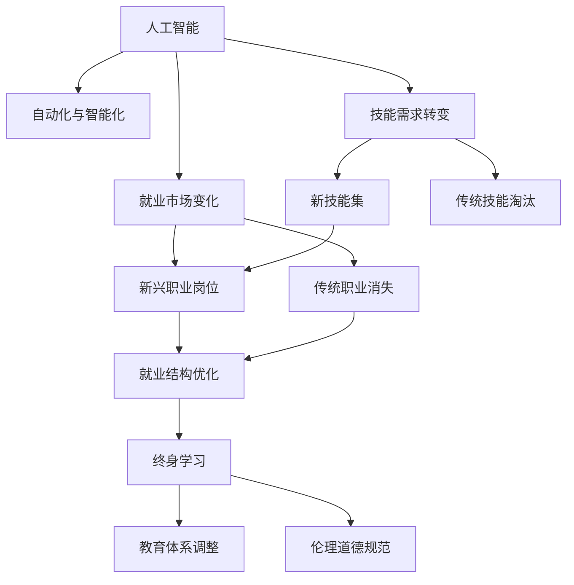

                 

## 1. 背景介绍

### 1.1 问题由来
随着人工智能(AI)技术的飞速发展，自动化和智能化的浪潮正在席卷各行各业，带来了一次空前的产业变革。AI技术以其强大的数据处理和决策能力，正在重塑经济结构、工作模式、就业市场和教育培训等各个方面。然而，AI的发展也带来了新的挑战和不确定性，包括就业市场的变化、技能需求的转变、教育的适应性等，亟需各界深入分析和积极应对。

### 1.2 问题核心关键点
AI时代的就业市场和技能培训面临的主要问题包括：
- **就业市场变化**：AI技术可能导致某些传统职业的消亡，同时催生新的职业岗位。
- **技能需求转变**：AI技术的应用需要新的技能集，传统技能可能面临淘汰。
- **教育适应性**：现有教育体系和课程可能无法快速适应AI技术的发展，导致人才缺口。
- **终身学习**：AI时代下，终身学习将成为个人职业发展的必备策略。
- **伦理道德**：AI技术的广泛应用涉及伦理道德问题，需要技术规范和法律监管。

### 1.3 问题研究意义
研究AI时代下就业市场和技能培训的发展趋势，对于推动产业升级、促进就业稳定、保障教育公平、维护社会稳定具有重要意义：

1. **产业升级**：AI技术的广泛应用将促进产业结构的优化升级，提升企业竞争力。
2. **就业稳定**：通过技能培训和职业转换，减轻AI带来的就业冲击，保障社会稳定。
3. **教育公平**：通过教育和培训的适应性调整，促进教育资源均衡分配，促进教育公平。
4. **社会稳定**：通过终身学习和职业转换，提升个体适应性，增强社会凝聚力。
5. **伦理监管**：通过伦理规范和技术标准，确保AI技术的健康发展，维护社会道德。

## 2. 核心概念与联系

### 2.1 核心概念概述

为更好地理解AI时代下就业市场和技能培训的发展趋势，本节将介绍几个关键概念及其相互关系：

- **人工智能(AI)**：指通过计算机系统模拟人类智能的行为，包括机器学习、深度学习、自然语言处理等技术。
- **自动化与智能化**：指通过AI技术实现的工作自动化和智能化，减少人工操作，提升生产效率。
- **就业市场变化**：AI技术的应用导致某些岗位的消失和新兴岗位的诞生，就业结构发生重大调整。
- **技能需求转变**：AI技术的应用要求新的技能集，如数据科学、编程、数据分析等。
- **教育适应性**：教育体系需要适应AI技术的发展，更新课程内容，引入新技术。
- **终身学习**：在AI时代，终身学习将成为个人职业发展的必备策略，适应技术变化。
- **伦理道德**：AI技术的广泛应用涉及伦理道德问题，需要制定规范和法律。

这些核心概念之间的逻辑关系可以通过以下Mermaid流程图来展示：



这个流程图展示了这个复杂系统中的关键组件及其相互关系：

1. AI技术通过自动化和智能化推动就业市场变化，导致新兴职业和传统职业的转换。
2. 技能需求发生转变，要求适应AI技术的新技能集。
3. 教育体系需要调整以适应新技能集，确保教育公平和终身学习。
4. 新技能集和新兴职业要求个人进行终身学习。
5. 伦理道德规范需要制定，以应对AI技术的广泛应用。

## 3. 核心算法原理 & 具体操作步骤
### 3.1 算法原理概述

在AI时代下，就业市场和技能培训的发展趋势分析主要基于以下算法原理：

1. **数据分析与预测**：通过对历史就业数据、AI技术发展趋势等进行分析，预测未来就业市场的变化。
2. **技能映射与需求分析**：将现有职业与AI技术的技能需求进行映射，分析技能需求的变化趋势。
3. **教育适应性分析**：评估现有教育体系和课程与AI技术发展的适应性，提出调整建议。
4. **终身学习路径规划**：设计终身学习路径，帮助个人适应AI技术带来的职业变化。
5. **伦理道德标准制定**：制定AI技术应用中的伦理道德标准，保障技术应用的合规性。

### 3.2 算法步骤详解

基于上述算法原理，AI时代下就业市场与技能培训的发展趋势分析主要包括以下几个关键步骤：

**Step 1: 数据收集与预处理**
- 收集历史就业数据、AI技术发展趋势、职业需求变化等相关数据。
- 对数据进行清洗和预处理，确保数据的准确性和一致性。

**Step 2: 就业市场变化预测**
- 使用统计分析、机器学习等方法，对未来就业市场进行预测，识别新兴职业和传统职业的变化趋势。
- 通过时间序列分析、回归模型等方法，预测就业结构的演变。

**Step 3: 技能需求分析**
- 通过技能映射和职业分析，确定AI技术对不同职业技能的需求变化。
- 使用文本挖掘、主题建模等技术，分析招聘广告、职业描述中的技能需求关键词。

**Step 4: 教育体系适应性分析**
- 对现有教育体系进行评估，分析其与AI技术需求的适应性。
- 提出教育体系调整的建议，如引入AI相关课程、更新教学内容等。

**Step 5: 终身学习路径设计**
- 根据就业市场和技能需求的变化，设计终身学习路径，帮助个人适应职业变化。
- 引入在线学习平台、微课程、工作坊等，提供灵活的学习方式。

**Step 6: 伦理道德标准制定**
- 制定AI技术应用中的伦理道德标准，如隐私保护、算法透明度等。
- 建立技术审查和监管机制，确保技术应用的合规性。

### 3.3 算法优缺点

AI时代下就业市场与技能培训的发展趋势分析具有以下优点：
1. 提供全面的就业市场和技能需求分析，有助于政策制定和企业决策。
2. 帮助个人制定终身学习路径，提升职业适应性。
3. 推动教育体系更新，促进教育公平。
4. 制定伦理道德标准，保障技术应用的合规性。

同时，该方法也存在一些局限性：
1. 数据质量与可获得性限制分析结果的准确性。
2. 预测模型存在不确定性，难以完全准确预测未来变化。
3. 教育体系的调整需要时间，短期内可能难以见效。
4. 终身学习路径的设计需要个人主动参与，实施难度较大。
5. 伦理道德标准的制定涉及多方利益，协调复杂。

尽管存在这些局限性，但就目前而言，基于数据分析和预测的方法仍是分析AI时代下就业市场与技能培训趋势的重要手段。未来相关研究的重点在于如何进一步提高数据质量，提升预测模型的准确性，优化教育体系的调整策略，以及建立更为全面的伦理道德框架。

### 3.4 算法应用领域

基于AI时代下就业市场与技能培训的发展趋势分析，可以应用于以下领域：

1. **政府政策制定**：提供就业市场和技能需求分析，指导政府制定相关政策。
2. **企业战略规划**：分析新兴职业和技能需求，帮助企业制定长期战略。
3. **教育机构改革**：评估教育体系与AI技术需求的适应性，推动课程内容更新。
4. **职业培训发展**：设计终身学习路径，提供职业转换和技能提升的培训方案。
5. **伦理道德监管**：制定AI技术应用的伦理道德标准，确保技术应用合规。

## 4. 数学模型和公式 & 详细讲解 & 举例说明
### 4.1 数学模型构建

在AI时代下就业市场与技能培训的分析中，可以使用多种数学模型进行预测和分析。以下是几个常用的数学模型：

- **时间序列模型**：如ARIMA、LSTM等，用于预测就业市场变化趋势。
- **回归模型**：如线性回归、逻辑回归等，用于分析技能需求与职业变化的关系。
- **文本挖掘模型**：如TF-IDF、LDA等，用于分析招聘广告、职业描述中的技能需求关键词。
- **网络图模型**：如GraPhySe、Gephi等，用于分析技能之间的关联关系。

### 4.2 公式推导过程

以时间序列模型为例，使用ARIMA模型进行就业市场变化趋势预测。ARIMA模型由自回归AR(1)、差分D和移动平均MA(1)组成，公式如下：

$$
Y_t = c + \sum_{i=1}^{p} \phi_i Y_{t-i} + \sum_{j=1}^{d} B_j \Delta^j Y_{t-j} + \sum_{k=1}^{q} \theta_k \epsilon_{t-k}
$$

其中，$Y_t$ 为时间t的就业市场数据，$c$ 为常数项，$\phi_i$ 和 $\theta_k$ 分别为AR和MA的系数，$B_j$ 为差分项的系数，$\Delta^j$ 为差分算子，$\epsilon_t$ 为误差项。

通过训练模型，可以得到预测值 $\hat{Y_t}$，进而分析未来就业市场的变化趋势。

### 4.3 案例分析与讲解

以下是一个具体案例：

**案例背景**：
某技术公司需要分析未来两年内其市场需求的变化趋势，以便制定招聘计划和培训方案。

**数据准备**：
- 收集公司过去五年的招聘数据和员工离职数据。
- 对数据进行清洗和预处理，去除异常值和噪声。

**模型构建**：
- 使用ARIMA模型，构建时间序列模型。
- 设定模型参数，进行训练和验证。
- 得到模型预测结果，分析未来两年的就业市场变化趋势。

**结果解读**：
模型预测未来两年内公司的新增需求将逐年增长，而离职率将逐年下降。因此，公司应加大招聘力度，同时提升员工培训和福利，以吸引和留住人才。

## 5. 项目实践：代码实例和详细解释说明
### 5.1 开发环境搭建

在进行就业市场与技能培训的分析实践前，我们需要准备好开发环境。以下是使用Python进行数据分析和模型训练的环境配置流程：

1. 安装Anaconda：从官网下载并安装Anaconda，用于创建独立的Python环境。

2. 创建并激活虚拟环境：
```bash
conda create -n analytics-env python=3.8 
conda activate analytics-env
```

3. 安装相关库：
```bash
conda install numpy pandas matplotlib seaborn scikit-learn tensorflow keras
```

4. 设置Jupyter Notebook：
```bash
jupyter notebook --notebook-dir .notebooks
```

完成上述步骤后，即可在`analytics-env`环境中开始就业市场与技能培训的分析实践。

### 5.2 源代码详细实现

下面是使用Python对就业市场与技能培训进行数据分析和模型训练的代码实现。

首先，定义数据处理函数：

```python
import pandas as pd
import numpy as np
import matplotlib.pyplot as plt

def load_data(file_path):
    data = pd.read_csv(file_path)
    return data
```

然后，定义时间序列模型并进行训练：

```python
from statsmodels.tsa.arima_model import ARIMA

def fit_arima(data, order=(5,1,0)):
    model = ARIMA(data, order=order)
    model_fit = model.fit()
    return model_fit
```

接着，进行数据可视化：

```python
def plot_time_series(data, title):
    plt.figure(figsize=(10,6))
    plt.plot(data)
    plt.title(title)
    plt.xlabel('Time')
    plt.ylabel('Value')
    plt.show()
```

最后，进行模型预测和结果展示：

```python
def predict_arima(model_fit, n_steps=12):
    forecast = model_fit.forecast(steps=n_steps)
    return forecast

# 加载数据
data = load_data('employment_data.csv')

# 绘制原始数据
plot_time_series(data, 'Original Employment Data')

# 构建时间序列模型并进行训练
model_fit = fit_arima(data)

# 绘制预测结果
forecast = predict_arima(model_fit)
plot_time_series(forecast, 'Forecasted Employment Data')
```

以上就是使用Python进行就业市场与技能培训分析的完整代码实现。可以看到，通过Pandas、NumPy、Matplotlib等库，我们可以快速完成数据处理、模型训练和结果展示。

### 5.3 代码解读与分析

让我们再详细解读一下关键代码的实现细节：

**load_data函数**：
- 用于加载就业市场相关数据。

**fit_arima函数**：
- 使用statsmodels库的ARIMA模型，对数据进行建模和训练。

**plot_time_series函数**：
- 使用Matplotlib库，对原始数据和预测结果进行可视化。

**predict_arima函数**：
- 使用ARIMA模型进行预测，并返回预测结果。

**main函数**：
- 调用上述函数，完成数据加载、模型训练和结果展示。

通过代码实现，我们可以看到，使用Python进行就业市场与技能培训的分析具有高度的灵活性和可扩展性。开发者可以根据自己的需求，选择不同的数据处理、模型训练和结果展示方式。

当然，工业级的系统实现还需考虑更多因素，如数据的质量、模型的鲁棒性、预测的准确性等。但核心的分析逻辑基本与此类似。

## 6. 实际应用场景
### 6.1 政府政策制定

AI时代下就业市场与技能培训的分析方法可以广泛应用于政府政策制定中。政府可以通过分析未来就业市场变化趋势，制定针对性的就业促进政策。例如：

- **就业指导与培训**：根据预测结果，政府可以推出针对性的就业指导和培训计划，帮助失业人员重新就业。
- **职业需求调整**：根据技能需求的变化趋势，政府可以调整职业教育和培训课程，提升劳动力素质。
- **税收和补贴政策**：政府可以根据就业市场变化，制定税收优惠和补贴政策，激励企业招聘和培训员工。

### 6.2 企业战略规划

企业在制定战略规划时，也可以借助AI时代下就业市场与技能培训的分析方法。例如：

- **招聘需求预测**：企业可以根据预测结果，提前规划招聘需求，避免人才短缺或过剩。
- **员工培训与发展**：企业可以根据技能需求的变化，制定员工培训计划，提升员工技能，适应市场需求。
- **薪酬与福利策略**：企业可以根据预测结果，调整薪酬和福利策略，吸引和留住人才。

### 6.3 教育机构改革

教育机构在教育体系改革中也需考虑AI时代下的就业市场与技能培训需求。例如：

- **课程内容更新**：教育机构可以根据技能需求的变化，更新课程内容和教学方法，确保教育资源与市场需求对接。
- **在线教育平台**：教育机构可以开发在线教育平台，提供灵活的学习方式，满足学生个性化学习需求。
- **技能认证与培训**：教育机构可以推出技能认证和专项培训课程，提升学生就业竞争力。

### 6.4 未来应用展望

随着AI技术的不断发展，基于就业市场与技能培训的分析方法将有更广泛的应用前景：

1. **全球化就业市场**：未来随着全球化进程加速，AI时代下就业市场与技能培训的分析方法可以帮助各国制定全球化就业战略，提升劳动力竞争力。
2. **跨行业技能需求**：AI技术的应用将带来跨行业的技能需求变化，分析方法可以帮助各行业制定协同的培训和招聘计划，推动行业发展。
3. **智能化培训系统**：未来的培训系统将更加智能化，结合AI技术，提供个性化的学习建议和评估反馈。
4. **终身学习生态**：AI时代下，终身学习将成为个人职业发展的必备策略，分析方法可以提供全面的终身学习路径规划。

## 7. 工具和资源推荐
### 7.1 学习资源推荐

为了帮助开发者系统掌握AI时代下就业市场与技能培训的分析方法，这里推荐一些优质的学习资源：

1. **《Python数据分析与机器学习实战》**：全面介绍Python数据分析和机器学习的基本概念和应用，是入门数据分析的理想读物。
2. **《统计学习基础》**：由斯坦福大学开设的免费统计学习课程，系统讲解统计学习的基本方法和应用。
3. **《机器学习实战》**：通过实际案例，详细讲解机器学习的基本流程和实现方法，适合初学者和进阶者。
4. **Coursera和edX在线课程**：提供大量高质量的统计学习、机器学习和数据分析课程，涵盖从基础到高级的内容。
5. **Kaggle数据科学竞赛**：通过参加数据科学竞赛，实践数据分析和模型训练技能，提升实战能力。

通过对这些资源的学习实践，相信你一定能够快速掌握AI时代下就业市场与技能培训的分析方法，并用于解决实际的就业问题。

### 7.2 开发工具推荐

高效的开发离不开优秀的工具支持。以下是几款用于数据分析和模型训练的常用工具：

1. **Python**：基于Python的数据分析和机器学习框架，灵活高效，广泛应用。
2. **Jupyter Notebook**：用于编写和运行Python代码的交互式开发环境，支持代码块、图表、文档等丰富功能。
3. **NumPy和Pandas**：用于数据处理和分析的基础库，提供高效的数据结构和数据操作功能。
4. **Matplotlib和Seaborn**：用于数据可视化的库，支持绘制各种图表和数据展示。
5. **scikit-learn和TensorFlow**：用于机器学习和深度学习的库，提供丰富的模型和算法实现。
6. **Google Colab和Kaggle**：免费的在线Jupyter Notebook环境，支持GPU/TPU算力，方便开发者快速上手实验。

合理利用这些工具，可以显著提升就业市场与技能培训分析的开发效率，加快创新迭代的步伐。

### 7.3 相关论文推荐

AI时代下就业市场与技能培训的分析方法的发展源于学界的持续研究。以下是几篇奠基性的相关论文，推荐阅读：

1. **《机器学习：一种现代方法》**：由Tom Mitchell著，全面介绍机器学习的基本理论和应用方法，是机器学习领域的经典教材。
2. **《统计学习方法》**：由李航著，详细讲解统计学习的基本方法和应用实例。
3. **《深度学习》**：由Ian Goodfellow、Yoshua Bengio和Aaron Courville著，系统讲解深度学习的基本理论和实现方法。
4. **《就业市场预测与分析》**：由Paul Taylor著，介绍就业市场预测的基本方法和应用案例。
5. **《AI时代的教育与培训》**：由Mitchell Resnick著，探讨AI技术对教育培训的影响及应对策略。

这些论文代表了大语言模型微调技术的发展脉络。通过学习这些前沿成果，可以帮助研究者把握学科前进方向，激发更多的创新灵感。

## 8. 总结：未来发展趋势与挑战
### 8.1 总结

本文对AI时代下就业市场与技能培训的分析方法进行了全面系统的介绍。首先阐述了AI技术对就业市场和技能培训带来的深远影响，明确了分析方法在政策制定、企业战略、教育改革等方面的重要价值。其次，从原理到实践，详细讲解了就业市场变化预测、技能需求分析、教育体系适应性分析、终身学习路径设计等关键步骤，给出了完整的数据分析与模型训练代码实现。同时，本文还广泛探讨了分析方法在政府、企业、教育等领域的实际应用前景，展示了分析方法的重要作用。

通过本文的系统梳理，可以看到，基于数据分析和预测的方法是分析AI时代下就业市场与技能培训趋势的重要手段。这些方法不仅有助于制定有效的政策和战略，还能帮助个人和机构应对职业变化，提升竞争力。未来，伴随AI技术的不断发展，分析方法也将进一步创新和优化，为就业市场与技能培训带来新的机遇和挑战。

### 8.2 未来发展趋势

展望未来，AI时代下就业市场与技能培训的分析方法将呈现以下几个发展趋势：

1. **数据质量与可获得性提升**：随着数据采集和处理技术的进步，数据质量将进一步提升，分析结果的准确性将显著提高。
2. **模型复杂度与精度提高**：通过引入深度学习、强化学习等技术，模型复杂度和精度将进一步提升，预测结果将更准确。
3. **多模态数据分析**：结合文本、图像、音频等多模态数据，进行综合分析，提升分析结果的全面性和准确性。
4. **跨行业协同分析**：通过跨行业数据融合，进行协同分析，推动各行业的协同发展和资源共享。
5. **终身学习路径优化**：随着技术的发展，终身学习路径将更加个性化和智能化，满足不同职业和技能的需求。

### 8.3 面临的挑战

尽管AI时代下就业市场与技能培训的分析方法已经取得了显著进展，但在迈向更加智能化、普适化应用的过程中，它仍面临诸多挑战：

1. **数据隐私与伦理问题**：在分析过程中，需要确保数据隐私和安全，同时遵守伦理规范。
2. **模型复杂性与解释性**：复杂的模型虽然精度高，但解释性差，难以解释其决策过程。
3. **算力与资源限制**：大规模数据分析和模型训练需要高算力和资源，对计算资源提出了较高要求。
4. **技能需求变化快**：技能需求的变化速度较快，分析方法需要实时更新，保持数据的时效性。
5. **跨行业协同难度大**：跨行业的数据融合和分析需要协调多方利益，存在较大难度。

尽管存在这些挑战，但通过持续的技术创新和多方协作，这些挑战终将逐步克服，分析方法也将不断发展和完善。

### 8.4 研究展望

面对AI时代下就业市场与技能培训分析方法面临的挑战，未来的研究需要在以下几个方面寻求新的突破：

1. **数据隐私保护技术**：引入差分隐私、联邦学习等技术，保护数据隐私，确保分析的合规性。
2. **模型可解释性研究**：通过因果推断、可解释AI等技术，提高模型的解释性，增强其可信任性。
3. **高性能计算资源**：开发高性能计算平台，提供强大的计算资源支持，降低数据处理和模型训练的门槛。
4. **实时数据分析系统**：构建实时数据分析系统，及时更新技能需求和就业市场变化，确保数据的实时性。
5. **跨行业协同机制**：建立跨行业数据共享和分析机制，推动各行业的协同发展。

这些研究方向的探索，必将引领AI时代下就业市场与技能培训分析方法迈向更高的台阶，为职业发展和教育培训带来新的机遇和挑战。面向未来，分析方法还需要与其他人工智能技术进行更深入的融合，如知识表示、因果推理、强化学习等，多路径协同发力，共同推动就业市场与技能培训的发展。只有勇于创新、敢于突破，才能不断拓展分析方法的应用范围，为社会进步和经济发展提供有力支持。

## 9. 附录：常见问题与解答
**Q1: 如何应对AI时代下就业市场变化带来的挑战？**

A: 应对AI时代下就业市场变化带来的挑战，主要从以下几个方面入手：

1. **终身学习**：积极参与终身学习，不断提升自身技能，适应职业变化。
2. **职业转换**：结合自身兴趣和市场需求，灵活调整职业方向，寻找新的发展机会。
3. **技能提升**：利用在线教育平台、技能培训课程等资源，提升专业技能，增强竞争力。
4. **跨领域技能**：结合AI技术，学习跨领域技能，提升适应性和综合性。
5. **社会支持**：利用政府、企业、教育机构的支持，获取更多资源和机会。

**Q2: 如何设计终身学习路径？**

A: 设计终身学习路径，主要从以下几个方面入手：

1. **职业规划**：根据自身兴趣和市场需求，制定职业发展目标，明确学习方向。
2. **技能评估**：评估当前技能水平，识别技能差距，确定提升重点。
3. **资源选择**：选择合适的学习资源，如在线课程、培训班、书籍等，制定学习计划。
4. **学习反馈**：定期评估学习效果，调整学习计划，确保学习目标的实现。
5. **实践应用**：结合实际工作需求，将学到的技能应用于实际工作中，提升实际能力。

**Q3: 如何进行跨行业数据融合与分析？**

A: 进行跨行业数据融合与分析，主要从以下几个方面入手：

1. **数据共享机制**：建立跨行业数据共享机制，确保数据的透明度和可访问性。
2. **数据标准化**：统一数据格式和标准，确保数据的兼容性和一致性。
3. **多模态数据分析**：结合文本、图像、音频等多模态数据，进行综合分析，提升分析结果的全面性和准确性。
4. **协同分析模型**：开发跨行业的协同分析模型，结合各行业的特点和需求，进行综合分析。
5. **跨行业协同工具**：开发跨行业协同工具，如数据共享平台、分析平台等，提供高效的数据融合和分析支持。

这些问题的解答，帮助我们更好地应对AI时代下的就业市场变化，设计出更加个性化和有效的终身学习路径，进行跨行业数据融合与分析。面向未来，需要多方协作，共同推进AI时代下就业市场与技能培训的发展。

---

作者：禅与计算机程序设计艺术 / Zen and the Art of Computer Programming

