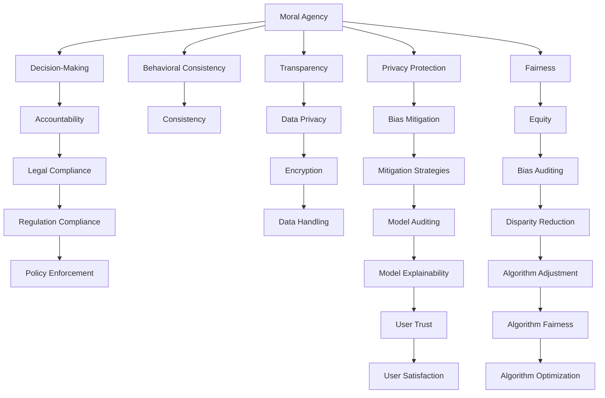

                 

## 1. 背景介绍

### 1.1 问题由来
随着人工智能（AI）技术的飞速发展，其在各个领域的应用日益广泛，从自动化生产、智能客服到医疗诊断，AI正逐步改变着我们的生活方式。然而，AI的强大能力同时也引发了一系列道德和责任问题，例如隐私保护、算法偏见、决策透明度等。这些问题不仅影响到技术的可持续性，也关系到社会的公正与伦理。

### 1.2 问题核心关键点
本文将探讨AI在伦理、道德和责任方面的挑战，以及如何构建一个负责任的AI系统。我们将从以下几个核心关键点入手：

- **道德代理**：AI系统如何承担道德责任，做出符合伦理决策。
- **责任归属**：在出现错误或不良结果时，如何界定AI系统与其开发者、使用者之间的责任。
- **透明度**：AI系统应如何保持其决策过程的透明度，增强可解释性。
- **隐私保护**：AI系统在处理敏感数据时如何保护个人隐私，防止滥用。
- **公平性**：AI系统如何在不同群体之间保持公平性，避免算法偏见。

## 2. 核心概念与联系

### 2.1 核心概念概述

为更好地理解AI时代的道德代理和责任，我们首先需要定义和理解几个核心概念：

- **道德代理(Moral Agency)**：AI系统在处理复杂决策时，应具备道德判断能力和行为责任，能够依据道德规范做出决策。
- **责任归属(Attribution of Responsibility)**：在AI系统执行任务时出现错误或不良后果，应如何界定相关各方的责任。
- **透明度(Transparency)**：AI系统应公开其决策依据和过程，使决策过程透明可解释。
- **隐私保护(Privacy Protection)**：在处理个人数据时，AI系统应遵循隐私保护原则，避免不当数据使用。
- **公平性(Fairness)**：AI系统应公平对待所有用户，避免因算法偏见导致的歧视。

这些概念之间紧密联系，共同构成了一个负责任的AI系统的基本框架。

### 2.2 核心概念原理和架构的 Mermaid 流程图



这个流程图展示了道德代理和责任的基本架构，各概念间的关联与作用路径：

1. **道德代理**：通过决策制定和行为一致性，确保AI系统的道德判断力。
2. **透明度**：通过数据隐私保护和模型透明性，确保决策过程公开、可解释。
3. **隐私保护**：通过数据加密和处理策略，保护用户隐私。
4. **公平性**：通过偏见消除和算法优化，确保系统公平。
5. **责任归属**：通过法律合规和责任审计，界定各方责任。
6. **用户信任**：通过用户满意度和算法优化，增强用户信任。

## 3. 核心算法原理 & 具体操作步骤
### 3.1 算法原理概述

构建一个负责任的AI系统，需要考虑多方面的因素。以下是几个核心算法原理：

- **决策树**：用于构建和解释决策过程，使AI系统决策透明。
- **公平性算法**：通过对抗性训练和公平性检测，消除算法偏见。
- **隐私保护算法**：采用差分隐私和联邦学习，保护用户隐私。
- **责任归属算法**：基于可解释性模型和责任判定机制，明确责任归属。

### 3.2 算法步骤详解

以下是构建负责任AI系统的主要步骤：

**Step 1: 数据收集与预处理**
- 收集用户数据，进行数据清洗和标准化处理。
- 采用差分隐私技术处理敏感数据，确保用户隐私。

**Step 2: 模型训练**
- 选择适当的模型架构，进行公平性训练和对抗性训练。
- 使用公平性算法消除模型偏见，确保模型公平性。

**Step 3: 模型评估与部署**
- 对模型进行公平性、隐私保护和透明性评估。
- 构建可解释性模型，提供决策依据和过程。
- 部署模型到生产环境，监控模型性能和行为。

**Step 4: 用户反馈与模型调整**
- 收集用户反馈，进行模型调整和优化。
- 定期审计模型行为，确保符合伦理规范。

### 3.3 算法优缺点

负责任的AI系统在设计上具备以下优点：

- **透明性**：通过决策树和可解释性模型，提供清晰的决策依据。
- **公平性**：通过公平性算法和偏见检测，消除算法偏见。
- **隐私保护**：采用差分隐私和联邦学习，保护用户隐私。
- **责任归属**：明确责任判定机制，界定各方责任。

然而，也存在一些限制：

- **复杂性**：构建和维护负责任的AI系统需要较高的技术复杂度。
- **成本高**：在数据处理、模型训练和模型调整方面，需投入大量资源。
- **伦理困境**：某些情况下，难以完全消除伦理道德问题，需要反复权衡和调整。

### 3.4 算法应用领域

负责任的AI系统在多个领域中都有广泛应用：

- **医疗诊断**：确保诊断过程的透明性和公平性，保护患者隐私。
- **金融服务**：维护交易公正性，保护用户隐私。
- **智能客服**：提供透明、公平的决策过程，增强用户信任。
- **招聘与人力资源管理**：避免算法偏见，确保公平招聘。
- **公共安全**：确保算法决策符合伦理规范，防止滥用。

## 4. 数学模型和公式 & 详细讲解 & 举例说明

### 4.1 数学模型构建

构建负责任的AI系统，需要建立多个数学模型：

- **决策树模型**：用于决策过程的可视化与解释。
- **公平性模型**：用于检测和消除算法偏见。
- **隐私保护模型**：用于差分隐私和联邦学习的实现。
- **责任归属模型**：用于责任判定和审计。

### 4.2 公式推导过程

以决策树模型为例，公式推导过程如下：

假设输入特征 $X=\{x_1, x_2, \dots, x_n\}$，输出结果 $Y$，构建决策树模型：

- 设节点 $t$ 的特征为 $x_i$，左子树为 $L(t)$，右子树为 $R(t)$，左子树和右子树的决策结果分别为 $L(t)$ 和 $R(t)$。
- 决策规则为：若 $x_i$ 满足某条件，则进入左子树 $L(t)$，否则进入右子树 $R(t)$。

### 4.3 案例分析与讲解

以医疗诊断系统为例，分析其决策树模型的构建：

- **输入特征**：患者症状、病史、检验结果等。
- **输出结果**：诊断结果，如疾病类型。
- **决策树节点**：根据症状特征，决定是否需要进行进一步检验，如CT、MRI等。

## 5. 项目实践：代码实例和详细解释说明

### 5.1 开发环境搭建

构建负责任的AI系统，需要以下开发环境：

- **Python**：作为主要编程语言。
- **Pandas**：数据处理。
- **Scikit-learn**：机器学习。
- **XGBoost**：构建决策树模型。
- **TensorFlow**：构建公平性模型。

安装环境：

```bash
pip install pandas scikit-learn xgboost tensorflow
```

### 5.2 源代码详细实现

**Step 1: 数据收集与预处理**

```python
import pandas as pd
from sklearn.preprocessing import StandardScaler
from sklearn.model_selection import train_test_split

# 加载数据集
data = pd.read_csv('data.csv')

# 数据预处理
X = data.drop('result', axis=1)
y = data['result']
X = pd.get_dummies(X)

# 数据标准化
scaler = StandardScaler()
X = scaler.fit_transform(X)

# 数据拆分
X_train, X_test, y_train, y_test = train_test_split(X, y, test_size=0.2, random_state=42)
```

**Step 2: 模型训练**

```python
# 构建决策树模型
model = xgboost.XGBClassifier()

# 训练模型
model.fit(X_train, y_train)
```

**Step 3: 模型评估与部署**

```python
from sklearn.metrics import accuracy_score

# 评估模型
y_pred = model.predict(X_test)
accuracy = accuracy_score(y_test, y_pred)

# 部署模型
model.save_model('decision_tree_model.xgb')
```

### 5.3 代码解读与分析

以上代码展示了构建决策树模型的完整流程：

1. **数据加载**：使用Pandas加载数据集。
2. **数据预处理**：进行特征处理、标准化和拆分。
3. **模型训练**：使用XGBoost构建和训练决策树模型。
4. **模型评估**：计算模型准确率。
5. **模型部署**：保存模型文件。

## 6. 实际应用场景

### 6.1 医疗诊断

在医疗诊断系统中，负责任的AI系统能够确保诊断过程的透明性和公平性。具体应用包括：

- **透明性**：通过决策树模型，医生可以清晰了解诊断决策的依据。
- **公平性**：确保不同患者获得公平的诊断机会，避免因算法偏见导致的误诊。
- **隐私保护**：采用差分隐私技术，保护患者隐私。
- **责任归属**：明确医生和AI系统的责任，确保医疗行为的合法性和合规性。

### 6.2 金融服务

在金融服务领域，负责任的AI系统能够维护交易的公正性和用户隐私：

- **透明性**：通过可解释性模型，展示交易决策依据，增强用户信任。
- **公平性**：确保贷款、保险等金融产品的公平性，避免歧视。
- **隐私保护**：采用差分隐私和联邦学习，保护用户数据隐私。
- **责任归属**：明确金融机构和AI系统的责任，确保金融行为的合法合规。

### 6.3 智能客服

智能客服系统需要确保决策过程透明、公平和用户隐私保护：

- **透明性**：通过决策树和可解释性模型，客服系统提供清晰的决策依据。
- **公平性**：避免因算法偏见导致的服务歧视。
- **隐私保护**：采用差分隐私和数据加密技术，保护用户隐私。
- **责任归属**：明确客服和AI系统的责任，确保服务合规。

## 7. 工具和资源推荐

### 7.1 学习资源推荐

为了帮助开发者系统掌握负责任的AI系统的理论基础和实践技巧，这里推荐一些优质的学习资源：

1. **《道德AI》书籍**：介绍AI在伦理、道德和责任方面的挑战及解决策略。
2. **CS348《人工智能伦理》课程**：斯坦福大学开设的AI伦理课程，涵盖AI伦理的各个方面。
3. **《人工智能公平性》论文**：介绍公平性算法和偏见检测的最新研究。
4. **Google AI Ethics Guide**：谷歌发布的人工智能伦理指南，提供全面的伦理建议。
5. **OpenAI AI Alignment Primer**：OpenAI的人工智能对齐研究，探讨如何构建负责任的AI系统。

通过对这些资源的学习实践，相信你一定能够快速掌握负责任的AI系统的精髓，并用于解决实际的AI问题。

### 7.2 开发工具推荐

构建负责任的AI系统，需要一些专门的开发工具：

1. **TensorFlow**：强大的机器学习框架，支持复杂的模型构建和训练。
2. **Scikit-learn**：简单易用的机器学习库，适合快速原型开发。
3. **XGBoost**：高效且可解释的决策树库，适合构建和解释决策过程。
4. **PyTorch**：灵活的深度学习框架，支持动态计算图和高效训练。
5. **HuggingFace**：NLP领域的预训练模型库，提供丰富的预训练模型资源。

### 7.3 相关论文推荐

负责任的AI系统的发展离不开学界的持续研究。以下是几篇奠基性的相关论文，推荐阅读：

1. **《人工智能的伦理与道德》**：探讨AI在伦理和道德方面的挑战和解决方案。
2. **《公平性算法：消除算法偏见》**：介绍公平性算法和偏见检测的最新研究。
3. **《差分隐私：保护用户隐私的数学方法》**：介绍差分隐私技术的原理和应用。
4. **《透明性AI：提高AI系统的可解释性》**：探讨如何提高AI系统的透明性和可解释性。
5. **《负责任的AI：伦理、道德和法律的挑战》**：介绍构建负责任AI系统的伦理、道德和法律挑战。

这些论文代表了大语言模型微调技术的发展脉络。通过学习这些前沿成果，可以帮助研究者把握学科前进方向，激发更多的创新灵感。

## 8. 总结：未来发展趋势与挑战

### 8.1 总结

本文对负责任的AI系统进行了全面系统的介绍。首先阐述了AI在伦理、道德和责任方面的挑战，明确了构建负责任AI系统的必要性。其次，从原理到实践，详细讲解了负责任AI系统的核心算法和具体操作步骤，给出了系统开发的完整代码实例。同时，本文还探讨了负责任AI系统在医疗、金融、客服等领域的实际应用，展示了其在实践中的重要价值。最后，本文精选了负责任AI系统相关的学习资源、开发工具和研究成果，力求为开发者提供全方位的技术指引。

通过本文的系统梳理，可以看到，负责任的AI系统在构建和应用过程中，需要考虑多方面的因素，涵盖数据处理、模型训练、模型评估、用户反馈等多个环节。只有从数据、算法、工程、业务等多个维度协同发力，才能真正实现AI技术的可持续发展和负责任应用。

### 8.2 未来发展趋势

展望未来，负责任的AI系统将呈现以下几个发展趋势：

1. **算法透明性**：未来的AI系统将更加注重算法的透明性和可解释性，增强用户信任。
2. **隐私保护**：差分隐私和联邦学习等隐私保护技术将得到广泛应用，确保数据隐私。
3. **公平性**：公平性算法和偏见检测将进一步发展，消除算法偏见，提升系统的公平性。
4. **责任归属**：责任判定和审计机制将更加完善，明确各方责任。
5. **多模态融合**：未来AI系统将能够融合多种模态数据，提高决策准确性。
6. **伦理规范**：AI系统的开发和应用将更加符合伦理规范，避免伦理道德问题。

这些趋势凸显了负责任AI系统的广阔前景。随着技术的不断进步，负责任AI系统必将在各个领域得到广泛应用，为社会带来更多正面影响。

### 8.3 面临的挑战

尽管负责任的AI系统已经取得了一定的成果，但在实践中仍面临诸多挑战：

1. **技术复杂性**：构建和维护负责任AI系统需要较高的技术复杂度，需要多学科知识的支持。
2. **数据隐私**：在处理敏感数据时，如何保护用户隐私是一个重要难题。
3. **算法偏见**：消除算法偏见需要持续的研究和优化，确保公平性。
4. **模型透明性**：提高AI系统的透明性和可解释性，仍然是一个挑战。
5. **伦理困境**：在某些情况下，难以完全消除伦理道德问题，需要反复权衡和调整。

### 8.4 研究展望

面向未来，负责任AI系统的研究需要在以下几个方面寻求新的突破：

1. **跨学科研究**：未来AI系统的开发将更加注重跨学科合作，涉及伦理、法律、社会学等多个领域。
2. **公平性算法**：进一步研究公平性算法，消除算法偏见，提升系统公平性。
3. **隐私保护技术**：开发新的隐私保护技术，确保数据隐私和安全。
4. **透明性模型**：探索新的透明性模型，提高AI系统的可解释性和可信度。
5. **责任归属机制**：建立更加完善的责任归属机制，明确各方责任。

这些研究方向的探索，必将引领负责任AI系统技术迈向更高的台阶，为构建安全、可靠、可解释、可控的智能系统铺平道路。面向未来，负责任AI系统的研究还需要与其他人工智能技术进行更深入的融合，如知识表示、因果推理、强化学习等，多路径协同发力，共同推动自然语言理解和智能交互系统的进步。只有勇于创新、敢于突破，才能不断拓展AI系统的边界，让智能技术更好地造福人类社会。

## 9. 附录：常见问题与解答

**Q1: 如何构建负责任的AI系统？**

A: 构建负责任的AI系统需要从数据处理、模型训练、模型评估、用户反馈等多个环节进行全面优化。关键步骤包括：

1. **数据收集与预处理**：收集用户数据，进行数据清洗和标准化处理。
2. **模型训练**：选择适当的模型架构，进行公平性训练和对抗性训练。
3. **模型评估与部署**：对模型进行公平性、隐私保护和透明性评估，部署模型到生产环境。
4. **用户反馈与模型调整**：收集用户反馈，进行模型调整和优化。

**Q2: 如何处理AI系统中的伦理道德问题？**

A: 处理AI系统中的伦理道德问题，需要从多个方面进行考虑：

1. **数据处理**：在处理敏感数据时，采用差分隐私和联邦学习技术，确保用户隐私。
2. **算法设计**：设计公平性算法，消除算法偏见，确保系统公平性。
3. **透明性**：通过决策树和可解释性模型，提供清晰的决策依据。
4. **责任归属**：明确责任判定机制，界定各方责任。
5. **伦理规范**：遵循伦理规范，确保AI系统行为符合道德标准。

**Q3: 如何保证AI系统的透明度和可解释性？**

A: 保证AI系统的透明度和可解释性，需要从模型设计和解释方法两个方面入手：

1. **模型设计**：选择可解释性强的模型架构，如决策树、线性模型等。
2. **解释方法**：使用特征重要性、局部可解释性模型等方法，提供决策依据。
3. **用户反馈**：通过用户反馈不断优化模型解释方法，增强透明性。

**Q4: 如何处理AI系统的隐私保护问题？**

A: 处理AI系统的隐私保护问题，需要采用多种隐私保护技术：

1. **差分隐私**：通过添加噪声和限制查询范围，保护用户隐私。
2. **联邦学习**：在数据不集中存储的情况下，进行分布式模型训练。
3. **数据加密**：对敏感数据进行加密处理，防止数据泄露。
4. **匿名化**：对用户数据进行匿名化处理，保护用户隐私。

**Q5: 如何确保AI系统的公平性？**

A: 确保AI系统的公平性，需要从模型训练和评估两个方面进行优化：

1. **公平性训练**：在模型训练过程中，加入公平性约束，消除算法偏见。
2. **公平性评估**：在模型评估阶段，进行公平性检测，确保系统公平性。
3. **偏见检测**：定期检测模型偏见，及时进行调整和优化。

---

作者：禅与计算机程序设计艺术 / Zen and the Art of Computer Programming

