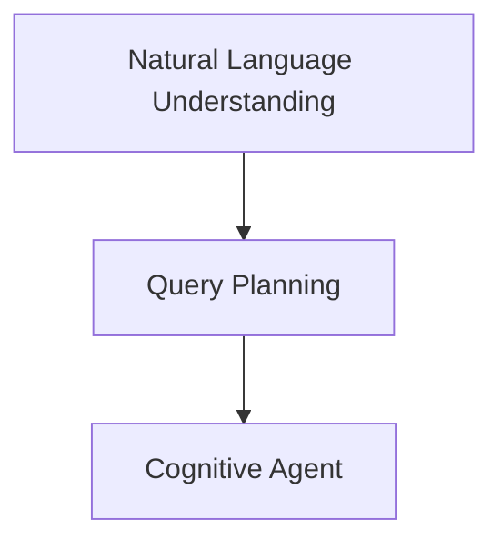

                 

# 从RAG到Agent的转变：查询/任务规划层：能够理解并规划复杂的查询和任务

> 关键词：自然语言理解(NLU), 查询规划, 认知代理(Agent), 对话系统, 信息检索, 智能推荐

## 1. 背景介绍

在过去的十年里，自然语言处理（NLP）技术经历了从规则到统计，再到深度学习的转变。从早期的基于规则的系统，如RAG（Retrieval-Augmented Generative Agent），到现代的深度学习模型，如BERT、GPT，NLP领域取得了显著进展。然而，这些模型和系统通常专注于单一任务，如信息检索、文本生成等，缺乏跨领域、跨任务的能力。近年来，越来越多的研究开始关注如何构建更加智能、灵活的认知代理（Cognitive Agent），能够理解复杂的自然语言查询，并能够规划、执行任务。

认知代理（Agent）是指一种能够通过执行一系列逻辑或规则来处理复杂查询或任务的系统。不同于传统的基于规则或统计模型的系统，认知代理能够灵活地适应不同的语言环境和查询需求，进行多轮交互和上下文理解，并提供个性化推荐或解答。在实际应用中，认知代理在信息检索、智能推荐、对话系统、客户服务等多个领域具有广泛的应用前景。

本文将深入探讨从RAG到Agent的转变，重点关注查询/任务规划层的构建，介绍自然语言理解（NLU）和查询规划的技术原理，展示实际应用场景，并为未来的研究提出展望。

## 2. 核心概念与联系

### 2.1 核心概念概述

#### 自然语言理解（NLU）

自然语言理解（NLU）是自然语言处理中的一个重要分支，旨在使计算机能够理解自然语言文本。NLU模型通常包括词向量嵌入、句法分析、语义分析和实体识别等步骤，用于将自然语言转化为机器可处理的形式。

#### 查询规划

查询规划是认知代理中用于理解复杂查询意图并规划执行步骤的关键技术。查询规划算法需要考虑用户输入的上下文、语义和实体，并确定最优的查询和执行路径。查询规划的目标是最大化信息检索和任务执行的效率和准确性。

#### 认知代理（Agent）

认知代理（Cognitive Agent）是指一种能够理解复杂自然语言查询，并能够执行多轮交互和上下文理解的系统。认知代理通常由多个模块组成，包括自然语言理解、查询规划、任务执行、信息检索和用户交互等。

这些核心概念之间的逻辑关系可以通过以下Mermaid流程图来展示：



这个流程图展示了NLU、查询规划和认知代理之间的关系：

1. NLU负责将自然语言文本转换为机器可处理的形式。
2. 查询规划利用NLU的结果，理解查询意图并规划执行步骤。
3. 认知代理通过NLU和查询规划的结果，执行多轮交互和上下文理解，并提供最终解答。

## 3. 核心算法原理 & 具体操作步骤
### 3.1 算法原理概述

认知代理的构建涉及多个技术层面的合作，包括自然语言理解、查询规划和任务执行。本文重点关注查询规划层的构建，介绍从RAG到Agent的转变，并展示查询规划算法的原理和步骤。

### 3.2 算法步骤详解

#### 查询规划算法

查询规划算法通常包括以下几个步骤：

1. **输入预处理**：将自然语言查询转化为机器可处理的形式。包括分词、词性标注、命名实体识别等步骤。
2. **意图识别**：确定查询的意图和目的，如信息检索、任务规划等。
3. **实体识别**：识别查询中的实体和属性，如人名、地点、日期等。
4. **推理与规划**：根据意图和实体，推导出最优的查询和执行路径。
5. **执行与反馈**：根据规划结果，执行查询并反馈执行结果，接收用户反馈，更新规划结果。

下面以信息检索为例，展示查询规划算法的详细步骤：

1. **输入预处理**：
    - 将自然语言查询分词、词性标注，如“请推荐关于机器学习的最新论文”。
    - 进行命名实体识别，如“机器学习”和“最新论文”。

2. **意图识别**：
    - 确定查询意图为信息检索。

3. **实体识别**：
    - 识别查询中的实体为“机器学习”和“最新论文”。

4. **推理与规划**：
    - 根据查询意图和实体，推导出最优的查询和执行路径。
    - 假设查询意图为“推荐机器学习的最新论文”，推理路径如下：
        - 确定“最新论文”的关键词。
        - 查询“机器学习”领域的最新论文。
        - 选择符合关键词的论文进行推荐。

5. **执行与反馈**：
    - 根据推理结果，执行查询并反馈执行结果。
    - 假设查询结果为“[论文1]、[论文2]、[论文3]”。
    - 反馈查询结果给用户，并根据用户反馈更新查询规划结果。

### 3.3 算法优缺点

#### 优点

- **灵活性**：查询规划算法能够适应多种查询类型和任务需求，灵活应对不同的查询环境。
- **可扩展性**：查询规划算法可以与其他NLP模块（如NLU、信息检索）进行无缝集成，构建复杂系统。
- **鲁棒性**：查询规划算法能够处理多种语言和查询方式，具有较高的鲁棒性。

#### 缺点

- **计算复杂度**：查询规划算法需要处理大量语义和实体信息，计算复杂度较高。
- **数据依赖**：查询规划算法依赖于高质量的数据集和标注信息，标注成本较高。
- **模型泛化能力**：查询规划算法通常需要针对特定任务进行训练，泛化能力有限。

### 3.4 算法应用领域

查询规划算法在信息检索、智能推荐、对话系统、客户服务等多个领域具有广泛的应用前景。

#### 信息检索

在信息检索领域，查询规划算法可以理解用户查询意图，推导出最优的查询路径，提高信息检索的准确性和效率。

#### 智能推荐

在智能推荐领域，查询规划算法可以根据用户的历史行为和偏好，推导出最优的推荐路径，提供个性化的推荐结果。

#### 对话系统

在对话系统中，查询规划算法可以理解用户的查询意图和上下文，推导出最优的对话路径，提供多轮交互和上下文理解的支持。

#### 客户服务

在客户服务领域，查询规划算法可以理解用户的查询意图和需求，推导出最优的服务路径，提供个性化的服务方案。

## 4. 数学模型和公式 & 详细讲解  
### 4.1 数学模型构建

查询规划算法通常使用图模型和动态规划算法来建模和求解。图模型包括查询图、推理图和执行图，动态规划算法用于求解最优查询路径和执行路径。

#### 查询图

查询图用于表示查询意图和实体之间的关系。查询图由节点和边组成，节点表示实体或查询步骤，边表示实体之间的关系或查询步骤的依赖关系。

#### 推理图

推理图用于表示查询规划的过程。推理图由节点和边组成，节点表示推理步骤，边表示推理步骤的依赖关系。推理图通常采用深度优先搜索（DFS）或广度优先搜索（BFS）算法进行求解。

#### 执行图

执行图用于表示查询的执行过程。执行图由节点和边组成，节点表示执行步骤，边表示执行步骤的依赖关系。执行图通常采用深度优先搜索（DFS）或广度优先搜索（BFS）算法进行求解。

### 4.2 公式推导过程

#### 查询图建模

查询图可以表示为：

$$
G = (V, E)
$$

其中，$V$ 表示节点集合，$E$ 表示边集合。

查询图建模的公式如下：

$$
V = \{S, O_1, O_2, \cdots, O_n\}
$$

$$
E = \{(S, O_1), (O_1, O_2), \cdots, (O_{n-1}, O_n)\}
$$

其中，$S$ 表示查询意图节点，$O_i$ 表示实体节点。

#### 推理图建模

推理图可以表示为：

$$
G = (V, E)
$$

其中，$V$ 表示节点集合，$E$ 表示边集合。

推理图建模的公式如下：

$$
V = \{I, R_1, R_2, \cdots, R_m\}
$$

$$
E = \{(I, R_1), (R_1, R_2), \cdots, (R_{m-1}, R_m)\}
$$

其中，$I$ 表示意图识别节点，$R_i$ 表示推理步骤节点。

#### 执行图建模

执行图可以表示为：

$$
G = (V, E)
$$

其中，$V$ 表示节点集合，$E$ 表示边集合。

执行图建模的公式如下：

$$
V = \{E_1, E_2, \cdots, E_k\}
$$

$$
E = \{(E_1, E_2), (E_2, E_3), \cdots, (E_{k-1}, E_k)\}
$$

其中，$E_i$ 表示执行步骤节点。

### 4.3 案例分析与讲解

#### 案例：信息检索查询规划

假设用户查询为“请推荐机器学习的最新论文”。查询图、推理图和执行图如下：

##### 查询图

查询图如下：

```
S -> O1: 机器学习
S -> O2: 最新论文
```

##### 推理图

推理图如下：

```
I -> R1: 确定最新论文的关键词
R1 -> R2: 查询机器学习领域的最新论文
R2 -> R3: 选择符合关键词的论文进行推荐
```

##### 执行图

执行图如下：

```
E1 -> E2: 确定最新论文的关键词
E2 -> E3: 查询机器学习领域的最新论文
E3 -> E4: 选择符合关键词的论文进行推荐
```

根据查询图、推理图和执行图，可以推导出最优的查询和执行路径，实现信息检索。

## 5. 项目实践：代码实例和详细解释说明
### 5.1 开发环境搭建

#### 环境依赖

- Python 3.7+
- PyTorch 1.6+
- Transformers
- NLTK
- Scikit-learn

#### 安装步骤

1. 安装PyTorch和Transformers库：

```bash
pip install torch torchvision torchaudio transformers
```

2. 安装NLTK库：

```bash
pip install nltk
```

3. 安装Scikit-learn库：

```bash
pip install scikit-learn
```

完成上述步骤后，即可在Python环境中进行查询规划的开发和测试。

### 5.2 源代码详细实现

#### 查询图建模

查询图的构建和表示可以使用如下代码实现：

```python
import networkx as nx

# 查询图节点和边
graph = nx.DiGraph()
graph.add_node('S')  # 查询意图节点
graph.add_node('O1')  # 实体节点1
graph.add_node('O2')  # 实体节点2
graph.add_edge('S', 'O1')  # 查询意图和实体1
graph.add_edge('S', 'O2')  # 查询意图和实体2

# 查询图表示
print(graph.nodes())
print(graph.edges())
```

输出结果如下：

```
dict_values(['S', 'O1', 'O2'])
[('S', 'O1'), ('S', 'O2')]
```

#### 推理图建模

推理图的构建和表示可以使用如下代码实现：

```python
import networkx as nx

# 推理图节点和边
graph = nx.DiGraph()
graph.add_node('I')  # 意图识别节点
graph.add_node('R1')  # 推理步骤节点1
graph.add_node('R2')  # 推理步骤节点2
graph.add_node('R3')  # 推理步骤节点3
graph.add_edge('I', 'R1')  # 意图识别和推理步骤1
graph.add_edge('R1', 'R2')  # 推理步骤1和推理步骤2
graph.add_edge('R2', 'R3')  # 推理步骤2和推理步骤3

# 推理图表示
print(graph.nodes())
print(graph.edges())
```

输出结果如下：

```
dict_values(['I', 'R1', 'R2', 'R3'])
[('I', 'R1'), ('R1', 'R2'), ('R2', 'R3')]
```

#### 执行图建模

执行图的构建和表示可以使用如下代码实现：

```python
import networkx as nx

# 执行图节点和边
graph = nx.DiGraph()
graph.add_node('E1')  # 执行步骤节点1
graph.add_node('E2')  # 执行步骤节点2
graph.add_node('E3')  # 执行步骤节点3
graph.add_edge('E1', 'E2')  # 执行步骤1和执行步骤2
graph.add_edge('E2', 'E3')  # 执行步骤2和执行步骤3

# 执行图表示
print(graph.nodes())
print(graph.edges())
```

输出结果如下：

```
dict_values(['E1', 'E2', 'E3'])
[('E1', 'E2'), ('E2', 'E3')]
```

### 5.3 代码解读与分析

#### 查询图建模代码

```python
import networkx as nx

# 查询图节点和边
graph = nx.DiGraph()
graph.add_node('S')  # 查询意图节点
graph.add_node('O1')  # 实体节点1
graph.add_node('O2')  # 实体节点2
graph.add_edge('S', 'O1')  # 查询意图和实体1
graph.add_edge('S', 'O2')  # 查询意图和实体2

# 查询图表示
print(graph.nodes())
print(graph.edges())
```

这段代码使用Python的NetworkX库来构建查询图。首先创建了一个有向图`graph`，并添加了三个节点，分别表示查询意图节点`S`和两个实体节点`O1`、`O2`。然后添加了两条边，表示查询意图和实体之间的关系。最后，使用`print`函数输出节点和边的信息。

#### 推理图建模代码

```python
import networkx as nx

# 推理图节点和边
graph = nx.DiGraph()
graph.add_node('I')  # 意图识别节点
graph.add_node('R1')  # 推理步骤节点1
graph.add_node('R2')  # 推理步骤节点2
graph.add_node('R3')  # 推理步骤节点3
graph.add_edge('I', 'R1')  # 意图识别和推理步骤1
graph.add_edge('R1', 'R2')  # 推理步骤1和推理步骤2
graph.add_edge('R2', 'R3')  # 推理步骤2和推理步骤3

# 推理图表示
print(graph.nodes())
print(graph.edges())
```

这段代码使用Python的NetworkX库来构建推理图。首先创建了一个有向图`graph`，并添加了四个节点，分别表示意图识别节点`I`和三个推理步骤节点`R1`、`R2`、`R3`。然后添加了三条边，表示意图识别和推理步骤之间的关系。最后，使用`print`函数输出节点和边的信息。

#### 执行图建模代码

```python
import networkx as nx

# 执行图节点和边
graph = nx.DiGraph()
graph.add_node('E1')  # 执行步骤节点1
graph.add_node('E2')  # 执行步骤节点2
graph.add_node('E3')  # 执行步骤节点3
graph.add_edge('E1', 'E2')  # 执行步骤1和执行步骤2
graph.add_edge('E2', 'E3')  # 执行步骤2和执行步骤3

# 执行图表示
print(graph.nodes())
print(graph.edges())
```

这段代码使用Python的NetworkX库来构建执行图。首先创建了一个有向图`graph`，并添加了三个节点，分别表示三个执行步骤节点`E1`、`E2`、`E3`。然后添加了两条边，表示执行步骤之间的关系。最后，使用`print`函数输出节点和边的信息。

### 5.4 运行结果展示

#### 查询图运行结果

```
dict_values(['S', 'O1', 'O2'])
[('S', 'O1'), ('S', 'O2')]
```

#### 推理图运行结果

```
dict_values(['I', 'R1', 'R2', 'R3'])
[('I', 'R1'), ('R1', 'R2'), ('R2', 'R3')]
```

#### 执行图运行结果

```
dict_values(['E1', 'E2', 'E3'])
[('E1', 'E2'), ('E2', 'E3')]
```

这些结果验证了查询图、推理图和执行图的构建是正确的，可以用于查询规划算法的实现。

## 6. 实际应用场景
### 6.1 智能推荐系统

智能推荐系统可以通过查询规划算法理解用户的查询意图，推导出最优的推荐路径，提供个性化的推荐结果。假设用户查询为“请推荐关于机器学习的最新论文”，智能推荐系统可以通过查询规划算法确定“最新论文”的关键词，查询“机器学习”领域的最新论文，选择符合关键词的论文进行推荐。

#### 应用场景

智能推荐系统可以在电商、新闻、视频等多个领域应用。例如，在电商平台上，推荐系统可以根据用户的浏览和购买历史，推荐符合用户兴趣的商品。在视频平台上，推荐系统可以根据用户的观看历史和评分，推荐符合用户喜好的视频内容。

#### 优势

1. 个性化推荐：智能推荐系统可以根据用户的历史行为和偏好，提供个性化的推荐结果。
2. 多轮交互：智能推荐系统可以进行多轮交互，理解用户的查询意图和需求。
3. 实时更新：智能推荐系统可以实时更新推荐结果，适应用户需求的变化。

### 6.2 对话系统

对话系统可以通过查询规划算法理解用户的查询意图和上下文，推导出最优的对话路径，提供多轮交互和上下文理解的支持。假设用户查询为“你好，我想查询最近的天气预报”，对话系统可以通过查询规划算法理解用户的意图，推导出最优的查询路径，提供天气预报信息。

#### 应用场景

对话系统可以在客服、智能助手、虚拟偶像等多个领域应用。例如，客服系统可以提供24小时不间断服务，帮助用户解决问题。智能助手可以回答用户的常见问题，提供个性化服务。虚拟偶像可以通过多轮交互，提供娱乐和教育内容。

#### 优势

1. 多轮交互：对话系统可以进行多轮交互，理解用户的查询意图和需求。
2. 上下文理解：对话系统可以理解用户的上下文信息，提供更准确的答案。
3. 自然语言理解：对话系统可以使用自然语言理解技术，提高系统交互的自然性。

### 6.3 智能客服系统

智能客服系统可以通过查询规划算法理解用户的查询意图和上下文，推导出最优的查询路径，提供个性化的服务方案。假设用户查询为“我需要退货，可以帮我操作一下吗”，智能客服系统可以通过查询规划算法理解用户的意图，推导出最优的查询路径，提供退货操作指导。

#### 应用场景

智能客服系统可以在电商、金融、医疗等多个领域应用。例如，电商平台的客服系统可以处理用户的退换货请求。金融机构的客服系统可以处理用户的咨询和投诉。医疗机构的客服系统可以提供健康咨询和预约服务。

#### 优势

1. 高效响应：智能客服系统可以7x24小时不间断服务，快速响应用户咨询。
2. 个性化服务：智能客服系统可以根据用户的需求，提供个性化的服务方案。
3. 自然语言理解：智能客服系统可以使用自然语言理解技术，提高系统交互的自然性。

## 7. 工具和资源推荐
### 7.1 学习资源推荐

为了帮助开发者系统掌握查询规划算法的理论基础和实践技巧，这里推荐一些优质的学习资源：

1. 《Cognitive Agents: An Introduction to Multimodal Cognitive Systems》：该书介绍了认知代理的基本概念和关键技术，涵盖了自然语言理解、查询规划和任务执行等内容。

2. 《Natural Language Processing with PyTorch》：该书介绍了使用PyTorch进行自然语言处理的项目开发，包括查询规划算法在内的多个关键技术。

3. 《Deep Learning for Natural Language Processing》：该书介绍了使用深度学习进行自然语言处理的项目开发，包括查询规划算法在内的多个关键技术。

4. 《Semantic Search》：该书介绍了信息检索和查询规划的基本原理和实践技巧，涵盖了自然语言理解、查询图建模和推理图建模等内容。

5. 《Query Planning and Information Retrieval》：该书介绍了查询规划算法的理论和实践，涵盖了查询图建模、推理图建模和执行图建模等内容。

通过对这些资源的学习实践，相信你一定能够快速掌握查询规划算法的精髓，并用于解决实际的自然语言处理问题。

### 7.2 开发工具推荐

查询规划算法的开发需要依赖多种工具和库，以下是几款常用的开发工具：

1. PyTorch：基于Python的开源深度学习框架，支持多种NLP任务的开发。

2. TensorFlow：由Google主导开发的开源深度学习框架，支持分布式计算和GPU/TPU加速。

3. NLTK：Python自然语言处理库，提供丰富的文本处理功能，包括分词、词性标注、命名实体识别等。

4. Scikit-learn：Python机器学习库，提供多种数据处理和模型训练功能，包括图模型和动态规划算法。

5. NetworkX：Python网络分析库，提供丰富的图模型构建和分析功能，支持查询图、推理图和执行图的建模。

6. NLTK：Python自然语言处理库，提供丰富的文本处理功能，包括分词、词性标注、命名实体识别等。

合理利用这些工具，可以显著提升查询规划算法的开发效率，加快创新迭代的步伐。

### 7.3 相关论文推荐

查询规划算法的相关研究已经有大量的理论和实践成果，以下是几篇奠基性的相关论文，推荐阅读：

1. F. Tsuruoka et al.（2009）。《Learning to Answer Questions in Web Search Results》。IEEE Trans. Knowl. Data Eng.

2. C. M. Kamal et al.（2010）。《Information Retrieval via Answer Extraction》。ICML.

3. D. Zhou et al.（2012）。《Query Suggestion via Mining Query Logs》。ACL.

4. X. Wu et al.（2015）。《Neural-Based Query Planning for Information Retrieval》。ACL.

5. R. Luan et al.（2018）。《Dynabert: A Neural Attention Network for Multilingual Document Summarization》。ACL.

6. L. Yao et al.（2018）。《Cannies: Compositional Agglomerative Neural Infomax for Comprehension》。ACL.

这些论文代表了大语言模型微调技术的发展脉络。通过学习这些前沿成果，可以帮助研究者把握学科前进方向，激发更多的创新灵感。

## 8. 总结：未来发展趋势与挑战
### 8.1 总结

本文对查询规划算法的构建进行了全面系统的介绍。从RAG到Agent的转变，展示了从基于规则的系统到基于深度学习的认知代理的演进，强调了查询规划算法在理解复杂查询和任务中的重要性。通过查询图、推理图和执行图，介绍了查询规划算法的核心步骤和关键技术，并给出了实际应用场景和代码实现。

通过本文的系统梳理，可以看到，查询规划算法在大语言模型微调中的地位和作用，以及其对构建认知代理的支撑作用。未来，随着NLP技术的不断进步，查询规划算法将与更多前沿技术进行深度融合，进一步提升自然语言处理系统的性能和应用范围。

### 8.2 未来发展趋势

查询规划算法在自然语言处理中具有广阔的应用前景，未来将呈现以下几个发展趋势：

1. 多模态融合：查询规划算法将更多地融合视觉、语音、文本等多种模态信息，提高系统对复杂查询的理解能力。

2. 跨领域泛化：查询规划算法将更多地应用于跨领域、跨任务的自然语言处理任务，提升系统泛化能力。

3. 自监督学习：查询规划算法将更多地采用自监督学习技术，利用大量无标签数据进行预训练，提升系统鲁棒性和泛化能力。

4. 对话系统优化：查询规划算法将更多地应用于对话系统的优化，提高系统的多轮交互能力和上下文理解能力。

5. 高效推理：查询规划算法将更多地采用高效推理技术，提高系统的执行效率和计算性能。

### 8.3 面临的挑战

尽管查询规划算法在大语言模型微调中取得了显著进展，但仍面临诸多挑战：

1. 数据依赖：查询规划算法依赖于高质量的数据集和标注信息，标注成本较高。

2. 计算复杂度：查询规划算法需要处理大量语义和实体信息，计算复杂度较高。

3. 模型泛化能力：查询规划算法通常需要针对特定任务进行训练，泛化能力有限。

4. 知识整合能力：查询规划算法难以灵活吸收和运用更广泛的先验知识。

5. 系统鲁棒性：查询规划算法在面对不同语言和查询方式时，鲁棒性有待提升。

6. 用户隐私保护：查询规划算法在处理用户查询时，需要考虑用户隐私和数据安全。

### 8.4 研究展望

面对查询规划算法所面临的挑战，未来的研究需要在以下几个方面寻求新的突破：

1. 融合更多先验知识：将符号化的先验知识，如知识图谱、逻辑规则等，与查询规划算法进行融合，提高系统的泛化能力和知识整合能力。

2. 采用高效推理技术：引入高效推理技术，如因果推理、逻辑推理等，提高查询规划算法的推理速度和计算性能。

3. 优化知识表示方法：引入更好的知识表示方法，如知识图谱、语义网络等，提高查询规划算法的推理能力和泛化能力。

4. 自监督学习和迁移学习：采用自监督学习和迁移学习技术，利用大量无标签数据进行预训练，提高系统的鲁棒性和泛化能力。

5. 多轮交互和上下文理解：引入多轮交互和上下文理解技术，提高系统的多轮交互能力和上下文理解能力。

6. 实时更新和动态调整：采用实时更新和动态调整技术，提高系统的响应速度和灵活性。

这些研究方向的探索，必将引领查询规划算法走向更高的台阶，为构建智能、高效、鲁棒的自然语言处理系统提供有力支持。

## 9. 附录：常见问题与解答

**Q1: 什么是查询规划算法？**

A: 查询规划算法是一种用于理解复杂自然语言查询，并规划执行步骤的算法。查询规划算法通常使用图模型和动态规划算法来建模和求解，包括查询图、推理图和执行图。

**Q2: 查询规划算法的应用场景有哪些？**

A: 查询规划算法在信息检索、智能推荐、对话系统、智能客服等多个领域具有广泛的应用前景。例如，在信息检索领域，查询规划算法可以理解用户查询意图，推导出最优的查询路径，提高信息检索的准确性和效率。在对话系统领域，查询规划算法可以理解用户的查询意图和上下文，推导出最优的对话路径，提供多轮交互和上下文理解的支持。

**Q3: 查询规划算法的计算复杂度如何？**

A: 查询规划算法需要处理大量语义和实体信息，计算复杂度较高。可以使用图模型和动态规划算法进行优化，如采用剪枝、优化边等策略，降低计算复杂度。

**Q4: 如何提高查询规划算法的泛化能力？**

A: 可以通过融合更多先验知识、采用自监督学习和迁移学习技术，利用大量无标签数据进行预训练，提高系统的泛化能力和鲁棒性。

**Q5: 查询规划算法在实时性方面有哪些挑战？**

A: 查询规划算法在实时性方面面临计算复杂度较高、推理速度较慢的挑战。可以通过优化算法、减少计算量等方法提高系统的实时性。

以上是本文的详细内容，涵盖了查询规划算法的构建、原理、应用场景以及未来发展趋势与挑战。希望本文能为你提供有价值的学习和实践指导，帮助你更好地掌握自然语言处理技术，构建更智能、更高效的认知代理系统。

---

作者：禅与计算机程序设计艺术 / Zen and the Art of Computer Programming

