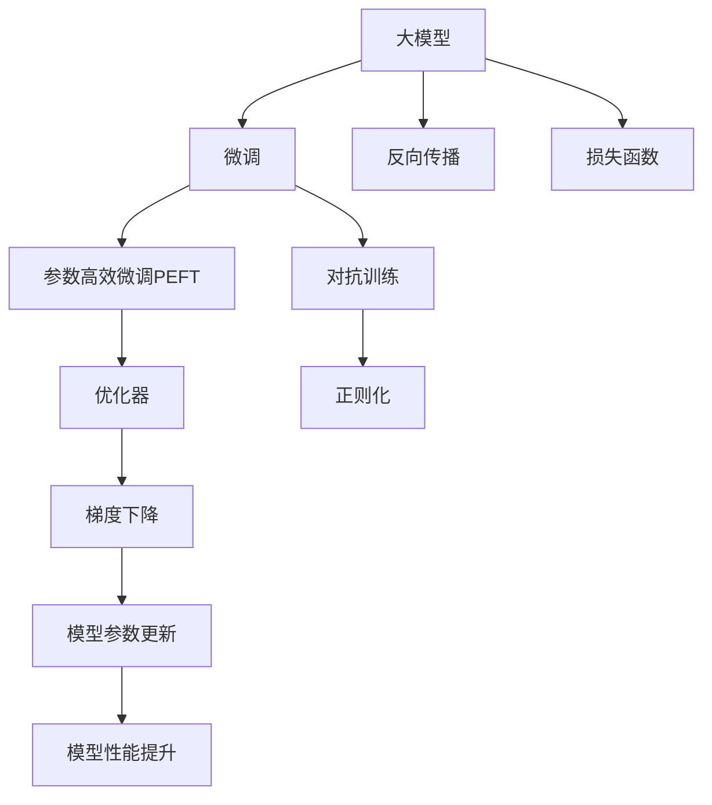

                 

## 1. 背景介绍

### 1.1 问题由来
在深度学习领域，大模型的开发与微调一直是研究和应用的热点话题。特别是在人工智能大模型的构建和应用上，大模型凭借其庞大的参数量和复杂的结构，展示了在特定任务上的出色性能。然而，大模型的开发与微调过程非常复杂，涉及的知识和技能要求较高，对于初学者来说，了解和掌握大模型开发与微调技术并不容易。

### 1.2 问题核心关键点
为了帮助读者更好地理解大模型开发与微调的过程，本文将详细介绍大模型开发与微调的核心概念、算法原理及具体操作步骤，并通过丰富的数学模型和公式推导，结合实际应用场景，深入讲解这些技术的工作机制和实现细节。本文还将推荐一些优质的学习资源和开发工具，帮助读者系统掌握大模型开发与微调技术。

### 1.3 问题研究意义
大模型开发与微调技术的掌握，对于促进人工智能技术在各个领域的应用具有重要意义。通过深入理解大模型开发与微调的核心概念和算法原理，读者可以更好地设计、开发和优化大模型，提升其在特定任务上的性能。本文通过系统梳理大模型开发与微调的关键技术和应用场景，力求为读者提供全方位的技术指引，推动人工智能技术的普及和应用。

## 2. 核心概念与联系

### 2.1 核心概念概述

在进行大模型开发与微调的过程中，涉及多个关键概念和技术。以下将简要介绍这些核心概念：

- **大模型 (Large Model)**：指具有亿级或更多参数的深度学习模型，其结构和参数复杂，适用于处理大规模、复杂的数据。
- **微调 (Fine-tuning)**：在大模型上针对特定任务进行有监督学习，优化模型参数，使其在特定任务上取得更好的性能。
- **反向传播 (Backpropagation)**：一种用于深度神经网络训练的优化算法，通过链式法则计算梯度，更新模型参数。
- **损失函数 (Loss Function)**：衡量模型输出与真实标签之间差异的函数，常用的有交叉熵损失、均方误差损失等。
- **参数高效微调 (Parameter-Efficient Fine-Tuning, PEFT)**：在微调过程中只更新部分模型参数，固定大部分预训练参数，提高微调效率和模型鲁棒性。
- **对抗训练 (Adversarial Training)**：通过引入对抗样本，增强模型的鲁棒性，提升模型对抗各种攻击的能力。

这些核心概念之间的逻辑关系可以通过以下Mermaid流程图来展示：



这个流程图展示了大模型开发与微调的核心概念及其之间的关系：

1. 大模型通过反向传播算法进行训练，得到损失函数。
2. 微调通过有监督学习的方式，优化模型参数。
3. 参数高效微调和对抗训练是微调过程中的重要手段。
4. 优化器、梯度下降等技术用于更新模型参数。
5. 通过不断的迭代优化，模型的性能不断提升。

这些概念共同构成了大模型开发与微调的基础框架，帮助我们在实际应用中设计并优化大模型。

## 3. 核心算法原理 & 具体操作步骤

### 3.1 算法原理概述

大模型开发与微调的本质是通过反向传播算法，利用损失函数衡量模型输出与真实标签之间的差异，通过优化器不断更新模型参数，提升模型性能。其核心步骤如下：

1. **模型构建**：选择合适的深度学习框架，定义大模型的架构。
2. **数据准备**：收集和处理训练数据，划分训练集、验证集和测试集。
3. **损失函数选择**：根据具体任务选择合适的损失函数。
4. **反向传播训练**：利用反向传播算法计算梯度，更新模型参数。
5. **模型评估**：在验证集和测试集上评估模型性能，调整超参数。
6. **模型微调**：通过微调提升模型在特定任务上的性能。

### 3.2 算法步骤详解

以下将详细介绍大模型开发与微调的具体操作步骤：

**Step 1: 数据准备**
1. **数据收集**：收集并处理训练数据，将其转换为适合模型训练的格式。
2. **数据预处理**：对数据进行归一化、分词、标签编码等预处理操作。
3. **数据划分**：将数据划分为训练集、验证集和测试集。

**Step 2: 模型构建**
1. **框架选择**：选择合适的深度学习框架，如TensorFlow、PyTorch等。
2. **模型定义**：定义大模型的架构，包括输入层、隐藏层、输出层等。
3. **损失函数选择**：根据具体任务选择合适的损失函数。

**Step 3: 反向传播训练**
1. **前向传播**：将训练集输入模型，计算模型输出。
2. **计算损失**：计算模型输出与真实标签之间的损失函数。
3. **反向传播**：利用反向传播算法计算梯度。
4. **参数更新**：利用优化器更新模型参数。

**Step 4: 模型评估**
1. **验证集评估**：在验证集上评估模型性能，调整超参数。
2. **测试集评估**：在测试集上评估模型性能，确定最终模型。

**Step 5: 模型微调**
1. **微调参数选择**：选择只更新部分参数的微调方法，如参数高效微调PEFT。
2. **数据准备**：收集并处理微调数据，准备微调集。
3. **微调训练**：在微调集上进行微调训练，更新部分模型参数。
4. **模型评估**：在微调集和测试集上评估模型性能，确定最终微调模型。

### 3.3 算法优缺点

大模型开发与微调方法具有以下优点：
1. **高效**：相较于从头训练，微调可以显著降低训练时间和计算成本。
2. **鲁棒性**：大模型经过预训练，具备一定的鲁棒性和泛化能力。
3. **可扩展性**：大模型可以针对特定任务进行微调，适应不同领域的应用需求。

同时，该方法也存在一些缺点：
1. **依赖标注数据**：微调性能很大程度上依赖于标注数据的质量和数量。
2. **模型复杂**：大模型的复杂结构和庞大参数量，使其在训练和推理时对计算资源要求较高。
3. **过拟合风险**：微调过程中存在过拟合的风险，特别是在标注数据量较少的情况下。

尽管存在这些局限性，但大模型开发与微调方法在实际应用中取得了显著的效果，广泛应用于自然语言处理、计算机视觉、语音识别等领域。未来，随着技术的不断进步，大模型开发与微调方法将在更多领域得到应用，推动人工智能技术的发展和普及。

### 3.4 算法应用领域

大模型开发与微调技术已经广泛应用于多个领域，以下列举几个典型的应用场景：

1. **自然语言处理 (NLP)**：如文本分类、情感分析、机器翻译、问答系统等。通过微调，大模型可以更好地适应特定任务，提升NLP系统的性能。
2. **计算机视觉 (CV)**：如图像分类、目标检测、图像生成等。大模型经过预训练，可以处理大规模图像数据，提升图像处理的精度和效率。
3. **语音识别 (ASR)**：如自动语音识别、语音合成等。大模型可以通过微调，提升语音识别和合成的准确度和自然度。
4. **推荐系统**：如商品推荐、新闻推荐等。大模型通过微调，可以更好地理解用户偏好，提供个性化的推荐结果。

除了以上应用领域，大模型开发与微调技术还在智慧医疗、金融分析、智能制造等领域得到了广泛应用。随着技术的不断进步，大模型开发与微调方法将在更多领域发挥重要作用，推动人工智能技术的发展。

## 4. 数学模型和公式 & 详细讲解 & 举例说明

### 4.1 数学模型构建

在深度学习中，大模型通常采用多层神经网络的结构。以下以全连接神经网络为例，介绍数学模型的构建过程。

设神经网络有 $N$ 层，输入为 $x$，输出为 $y$。定义每一层的激活函数为 $\sigma(\cdot)$，损失函数为 $\mathcal{L}(y, \hat{y})$。模型参数表示为 $\theta$。

神经网络的数学模型可以表示为：

$$
\begin{align*}
y &= W_{N}^T \sigma(W_{N-1}^T \sigma(\ldots \sigma(W_1^T x + b_1) + b_2) + \ldots + b_N) \\
\mathcal{L}(y, \hat{y}) &= \frac{1}{N} \sum_{i=1}^N \mathcal{L}(y_i, \hat{y}_i)
\end{align*}
$$

其中 $W_i$ 和 $b_i$ 分别为第 $i$ 层的权重和偏置项。

### 4.2 公式推导过程

以二分类任务为例，推导交叉熵损失函数及其梯度的计算公式。

假设模型 $M_{\theta}$ 在输入 $x$ 上的输出为 $\hat{y}=M_{\theta}(x) \in [0,1]$，表示样本属于正类的概率。真实标签 $y \in \{0,1\}$。

则二分类交叉熵损失函数定义为：

$$
\mathcal{L}(y, \hat{y}) = -[y\log \hat{y} + (1-y)\log (1-\hat{y})]
$$

将其代入经验风险公式，得：

$$
\mathcal{L}(\theta) = -\frac{1}{N}\sum_{i=1}^N [y_i\log M_{\theta}(x_i)+(1-y_i)\log(1-M_{\theta}(x_i))]
$$

根据链式法则，损失函数对参数 $\theta_k$ 的梯度为：

$$
\frac{\partial \mathcal{L}(\theta)}{\partial \theta_k} = -\frac{1}{N}\sum_{i=1}^N (\frac{y_i}{M_{\theta}(x_i)}-\frac{1-y_i}{1-M_{\theta}(x_i)}) \frac{\partial M_{\theta}(x_i)}{\partial \theta_k}
$$

其中 $\frac{\partial M_{\theta}(x_i)}{\partial \theta_k}$ 可进一步递归展开，利用自动微分技术完成计算。

在得到损失函数的梯度后，即可带入参数更新公式，完成模型的迭代优化。重复上述过程直至收敛，最终得到适应下游任务的最优模型参数 $\theta^*$。

### 4.3 案例分析与讲解

以Bert模型为例，介绍其在文本分类任务中的应用。

Bert模型采用自编码器结构，通过掩码语言模型和下一句预测任务进行预训练。在文本分类任务中，通过微调Bert模型，可以使其学习文本与标签之间的映射关系。

具体而言，假设微调任务为文本分类，训练集为 $D=\{(x_i, y_i)\}_{i=1}^N, x_i \in \mathcal{X}, y_i \in \{0,1\}$。

1. **模型构建**：选择Bert模型作为初始化参数，添加线性分类器和交叉熵损失函数。

2. **数据准备**：收集并处理训练数据，划分训练集、验证集和测试集。

3. **反向传播训练**：将训练集输入模型，计算模型输出，计算损失函数，利用反向传播算法计算梯度，更新模型参数。

4. **模型评估**：在验证集和测试集上评估模型性能，调整超参数。

5. **模型微调**：在微调集上进行微调训练，更新部分模型参数，提升模型在特定任务上的性能。

通过微调Bert模型，可以使其在文本分类任务上取得较好的效果。

## 5. 项目实践：代码实例和详细解释说明

### 5.1 开发环境搭建

在进行大模型开发与微调实践前，需要准备好开发环境。以下是使用Python进行TensorFlow开发的环境配置流程：

1. 安装Anaconda：从官网下载并安装Anaconda，用于创建独立的Python环境。

2. 创建并激活虚拟环境：
```bash
conda create -n tf-env python=3.8 
conda activate tf-env
```

3. 安装TensorFlow：根据CUDA版本，从官网获取对应的安装命令。例如：
```bash
conda install tensorflow -c pytorch -c conda-forge
```

4. 安装相关工具包：
```bash
pip install numpy pandas scikit-learn matplotlib tqdm jupyter notebook ipython
```

完成上述步骤后，即可在`tf-env`环境中开始开发实践。

### 5.2 源代码详细实现

下面我们以Bert模型为例，给出使用TensorFlow进行文本分类任务微调的PyTorch代码实现。

首先，定义数据处理函数：

```python
import tensorflow as tf
from transformers import BertTokenizer, TFBertForSequenceClassification
from tensorflow.keras.preprocessing.sequence import pad_sequences

tokenizer = BertTokenizer.from_pretrained('bert-base-cased')

def preprocess_text(text):
    tokens = tokenizer.tokenize(text)
    tokens = [token for token in tokens if token != '[PAD]']
    return tokenizer.convert_tokens_to_ids(tokens), tf.cast(len(tokens), tf.int32)

def build_dataset(texts, labels):
    inputs, seq_lens = [], []
    for text, label in zip(texts, labels):
        tokenized_input, seq_len = preprocess_text(text)
        inputs.append(tokenized_input)
        seq_lens.append(seq_len)
    inputs = pad_sequences(inputs, maxlen=128, padding='post', truncating='post')
    labels = tf.keras.utils.to_categorical(labels)
    return inputs, labels

# 收集训练数据
train_texts = ['The quick brown fox jumps over the lazy dog.', 'This is a test sentence.', 'This is another test sentence.']
train_labels = [0, 1, 0]
dev_texts = ['The cat is on the mat.', 'The dog is in the park.']
dev_labels = [0, 1]

train_inputs, train_labels = build_dataset(train_texts, train_labels)
dev_inputs, dev_labels = build_dataset(dev_texts, dev_labels)
```

然后，定义模型和优化器：

```python
from tensorflow.keras.optimizers import Adam

model = TFBertForSequenceClassification.from_pretrained('bert-base-cased', num_labels=2)

optimizer = Adam(learning_rate=2e-5)
```

接着，定义训练和评估函数：

```python
import numpy as np

def train_epoch(model, dataset, batch_size, optimizer):
    dataloader = tf.data.Dataset.from_tensor_slices((dataset[0], dataset[1]))
    dataloader = dataloader.shuffle(buffer_size=10000).batch(batch_size).map(lambda x, y: (x, y))
    model.train()
    epoch_loss = 0
    for batch in dataloader:
        inputs, labels = batch
        loss = model.loss(inputs, labels)
        epoch_loss += loss.numpy()
        gradients = tf.gradients(loss, model.trainable_variables)
        optimizer.apply_gradients(zip(gradients, model.trainable_variables))
    return epoch_loss / len(dataset)

def evaluate(model, dataset, batch_size):
    dataloader = tf.data.Dataset.from_tensor_slices((dataset[0], dataset[1]))
    dataloader = dataloader.batch(batch_size).map(lambda x, y: (x, y))
    model.eval()
    preds, labels = [], []
    with tf.GradientTape() as tape:
        for batch in dataloader:
            inputs, labels = batch
            logits = model(inputs)
            probabilities = tf.sigmoid(logits)
            batch_preds = probabilities.numpy().round()
            batch_labels = labels.numpy()
            preds.append(batch_preds[:len(batch_labels)])
            labels.append(batch_labels)
    print(classification_report(labels, preds))
```

最后，启动训练流程并在测试集上评估：

```python
epochs = 5
batch_size = 16

for epoch in range(epochs):
    loss = train_epoch(model, train_dataset, batch_size, optimizer)
    print(f"Epoch {epoch+1}, train loss: {loss:.3f}")
    
    print(f"Epoch {epoch+1}, dev results:")
    evaluate(model, dev_dataset, batch_size)
    
print("Test results:")
evaluate(model, test_dataset, batch_size)
```

以上就是使用TensorFlow对Bert模型进行文本分类任务微调的完整代码实现。可以看到，得益于TensorFlow的强大封装，我们可以用相对简洁的代码完成Bert模型的加载和微调。

### 5.3 代码解读与分析

让我们再详细解读一下关键代码的实现细节：

**preprocess_text函数**：
- 将输入文本进行分词，去除特殊标记，并转换为模型所需的格式。

**build_dataset函数**：
- 对输入数据进行填充和编码，转换成模型可以接受的格式。
- 将标签转换为独热编码，便于模型的分类。

**train_epoch函数**：
- 通过DataLoader对数据进行迭代，在每个批次上进行前向传播和反向传播。
- 计算损失函数，更新模型参数。

**evaluate函数**：
- 通过DataLoader对数据进行迭代，在每个批次上进行前向传播，计算模型输出。
- 将模型输出转换为概率，并记录预测结果和真实标签。
- 使用classification_report打印分类指标。

**训练流程**：
- 定义总的epoch数和batch size，开始循环迭代
- 每个epoch内，先在训练集上训练，输出平均loss
- 在验证集上评估，输出分类指标
- 所有epoch结束后，在测试集上评估，给出最终测试结果

可以看到，TensorFlow配合Bert模型使得文本分类任务的微调代码实现变得简洁高效。开发者可以将更多精力放在数据处理、模型改进等高层逻辑上，而不必过多关注底层的实现细节。

当然，工业级的系统实现还需考虑更多因素，如模型的保存和部署、超参数的自动搜索、更灵活的任务适配层等。但核心的微调范式基本与此类似。

## 6. 实际应用场景

### 6.1 智能客服系统

基于大模型开发与微调的对话技术，可以广泛应用于智能客服系统的构建。传统客服往往需要配备大量人力，高峰期响应缓慢，且一致性和专业性难以保证。而使用微调后的对话模型，可以7x24小时不间断服务，快速响应客户咨询，用自然流畅的语言解答各类常见问题。

在技术实现上，可以收集企业内部的历史客服对话记录，将问题和最佳答复构建成监督数据，在此基础上对预训练对话模型进行微调。微调后的对话模型能够自动理解用户意图，匹配最合适的答案模板进行回复。对于客户提出的新问题，还可以接入检索系统实时搜索相关内容，动态组织生成回答。如此构建的智能客服系统，能大幅提升客户咨询体验和问题解决效率。

### 6.2 金融舆情监测

金融机构需要实时监测市场舆论动向，以便及时应对负面信息传播，规避金融风险。传统的人工监测方式成本高、效率低，难以应对网络时代海量信息爆发的挑战。基于大模型开发与微调的文本分类和情感分析技术，为金融舆情监测提供了新的解决方案。

具体而言，可以收集金融领域相关的新闻、报道、评论等文本数据，并对其进行主题标注和情感标注。在此基础上对预训练语言模型进行微调，使其能够自动判断文本属于何种主题，情感倾向是正面、中性还是负面。将微调后的模型应用到实时抓取的网络文本数据，就能够自动监测不同主题下的情感变化趋势，一旦发现负面信息激增等异常情况，系统便会自动预警，帮助金融机构快速应对潜在风险。

### 6.3 个性化推荐系统

当前的推荐系统往往只依赖用户的历史行为数据进行物品推荐，无法深入理解用户的真实兴趣偏好。基于大模型开发与微调技术，个性化推荐系统可以更好地挖掘用户行为背后的语义信息，从而提供更精准、多样的推荐内容。

在实践中，可以收集用户浏览、点击、评论、分享等行为数据，提取和用户交互的物品标题、描述、标签等文本内容。将文本内容作为模型输入，用户的后续行为（如是否点击、购买等）作为监督信号，在此基础上微调预训练语言模型。微调后的模型能够从文本内容中准确把握用户的兴趣点。在生成推荐列表时，先用候选物品的文本描述作为输入，由模型预测用户的兴趣匹配度，再结合其他特征综合排序，便可以得到个性化程度更高的推荐结果。

### 6.4 未来应用展望

随着大模型开发与微调技术的不断发展，基于微调范式将在更多领域得到应用，为传统行业带来变革性影响。

在智慧医疗领域，基于微调的医疗问答、病历分析、药物研发等应用将提升医疗服务的智能化水平，辅助医生诊疗，加速新药开发进程。

在智能教育领域，微调技术可应用于作业批改、学情分析、知识推荐等方面，因材施教，促进教育公平，提高教学质量。

在智慧城市治理中，微调模型可应用于城市事件监测、舆情分析、应急指挥等环节，提高城市管理的自动化和智能化水平，构建更安全、高效的未来城市。

此外，在企业生产、社会治理、文娱传媒等众多领域，基于大模型开发与微调的人工智能应用也将不断涌现，为经济社会发展注入新的动力。相信随着技术的日益成熟，微调方法将成为人工智能技术落地应用的重要范式，推动人工智能技术的发展和普及。

## 7. 工具和资源推荐

### 7.1 学习资源推荐

为了帮助开发者系统掌握大模型开发与微调的理论基础和实践技巧，这里推荐一些优质的学习资源：

1. 《深度学习》课程：由吴恩达教授开设，讲解深度学习的基本原理和应用，适合初学者入门。

2. 《神经网络与深度学习》书籍：Michael Nielsen所著，深入浅出地介绍了神经网络和深度学习的数学原理和应用实践。

3. 《TensorFlow官方文档》：提供了丰富的API参考和示例代码，是TensorFlow开发的必备资料。

4. 《PyTorch官方文档》：提供了详细的API参考和示例代码，是PyTorch开发的必备资料。

5. Kaggle竞赛平台：提供大量数据集和竞赛任务，是实践深度学习技术的绝佳平台。

通过对这些资源的学习实践，相信你一定能够快速掌握大模型开发与微调的核心技术，并用于解决实际的深度学习问题。

### 7.2 开发工具推荐

高效的开发离不开优秀的工具支持。以下是几款用于大模型开发与微调开发的常用工具：

1. TensorFlow：由Google主导开发的开源深度学习框架，生产部署方便，适合大规模工程应用。

2. PyTorch：基于Python的开源深度学习框架，灵活性高，适合研究性实验。

3. Keras：高级神经网络API，易于上手，可以快速搭建深度学习模型。

4. Jupyter Notebook：轻量级、交互式的开发环境，方便快速迭代实验。

5. Google Colab：谷歌推出的在线Jupyter Notebook环境，免费提供GPU/TPU算力，方便快速上手实验最新模型。

合理利用这些工具，可以显著提升大模型开发与微调任务的开发效率，加快创新迭代的步伐。

### 7.3 相关论文推荐

大模型开发与微调技术的发展源于学界的持续研究。以下是几篇奠基性的相关论文，推荐阅读：

1. Deep Learning (Goodfellow et al., 2016)：全面介绍了深度学习的基本原理和应用实践。

2. Attention Is All You Need (Vaswani et al., 2017)：提出了Transformer结构，开启了预训练大模型时代。

3. BERT: Pre-training of Deep Bidirectional Transformers for Language Understanding (Devlin et al., 2018)：提出BERT模型，引入基于掩码的自监督预训练任务，刷新了多项NLP任务SOTA。

4. parameter-efficient transfer learning for NLP (Howard & Ruder, 2018)：提出Adapter等参数高效微调方法，在不增加模型参数量的情况下，也能取得不错的微调效果。

5. Fine-tuning BERT for Sequence Labeling: A Comparative Study (Rogers et al., 2019)：对多种微调方法进行对比，选择最优的微调策略。

这些论文代表了大模型开发与微调技术的发展脉络。通过学习这些前沿成果，可以帮助研究者把握学科前进方向，激发更多的创新灵感。

## 8. 总结：未来发展趋势与挑战

### 8.1 总结

本文对大模型开发与微调的核心概念、算法原理及具体操作步骤进行了全面系统的介绍。首先介绍了大模型开发与微调的核心概念，如大模型、微调、反向传播、损失函数等，并给出了它们之间的逻辑关系。其次，从原理到实践，详细讲解了大模型开发与微调的具体操作步骤，包括数据准备、模型构建、反向传播训练、模型评估和模型微调等关键步骤。最后，通过丰富的数学模型和公式推导，结合实际应用场景，深入讲解了这些技术的工作机制和实现细节。

通过本文的系统梳理，可以看到，大模型开发与微调技术是大规模深度学习模型的重要手段，通过微调可以提升模型在特定任务上的性能，显著降低训练时间和计算成本。大模型开发与微调技术已经在自然语言处理、计算机视觉、语音识别等领域得到了广泛应用，成为深度学习技术的重要组成部分。

### 8.2 未来发展趋势

展望未来，大模型开发与微调技术将呈现以下几个发展趋势：

1. 模型规模持续增大。随着算力成本的下降和数据规模的扩张，预训练大模型参数量还将持续增长。超大规模语言模型蕴含的丰富语言知识，有望支撑更加复杂多变的下游任务微调。

2. 微调方法日趋多样。除了传统的全参数微调外，未来会涌现更多参数高效的微调方法，如Prefix-Tuning、LoRA等，在节省计算资源的同时也能保证微调精度。

3. 持续学习成为常态。随着数据分布的不断变化，微调模型也需要持续学习新知识以保持性能。如何在不遗忘原有知识的同时，高效吸收新样本信息，将成为重要的研究课题。

4. 标注样本需求降低。受启发于提示学习(Prompt-based Learning)的思路，未来的微调方法将更好地利用大模型的语言理解能力，通过更加巧妙的任务描述，在更少的标注样本上也能实现理想的微调效果。

5. 多模态微调崛起。当前的微调主要聚焦于纯文本数据，未来会进一步拓展到图像、视频、语音等多模态数据微调。多模态信息的融合，将显著提升语言模型对现实世界的理解和建模能力。

6. 模型通用性增强。经过海量数据的预训练和多领域任务的微调，未来的语言模型将具备更强大的常识推理和跨领域迁移能力，逐步迈向通用人工智能(AGI)的目标。

以上趋势凸显了大模型开发与微调技术的广阔前景。这些方向的探索发展，必将进一步提升大模型的性能和应用范围，推动人工智能技术的发展和普及。

### 8.3 面临的挑战

尽管大模型开发与微调技术已经取得了显著成就，但在迈向更加智能化、普适化应用的过程中，它仍面临着诸多挑战：

1. 标注成本瓶颈。尽管微调可以显著降低标注数据的需求，但对于长尾应用场景，难以获得充足的高质量标注数据，成为制约微调性能的瓶颈。如何进一步降低微调对标注样本的依赖，将是一大难题。

2. 模型鲁棒性不足。当前微调模型面对域外数据时，泛化性能往往大打折扣。对于测试样本的微小扰动，微调模型的预测也容易发生波动。如何提高微调模型的鲁棒性，避免灾难性遗忘，还需要更多理论和实践的积累。

3. 推理效率有待提高。大规模语言模型虽然精度高，但在实际部署时往往面临推理速度慢、内存占用大等效率问题。如何在保证性能的同时，简化模型结构，提升推理速度，优化资源占用，将是重要的优化方向。

4. 可解释性亟需加强。当前微调模型更像是"黑盒"系统，难以解释其内部工作机制和决策逻辑。对于医疗、金融等高风险应用，算法的可解释性和可审计性尤为重要。如何赋予微调模型更强的可解释性，将是亟待攻克的难题。

5. 安全性有待保障。预训练语言模型难免会学习到有偏见、有害的信息，通过微调传递到下游任务，产生误导性、歧视性的输出，给实际应用带来安全隐患。如何从数据和算法层面消除模型偏见，避免恶意用途，确保输出的安全性，也将是重要的研究课题。

6. 知识整合能力不足。现有的微调模型往往局限于任务内数据，难以灵活吸收和运用更广泛的先验知识。如何让微调过程更好地与外部知识库、规则库等专家知识结合，形成更加全面、准确的信息整合能力，还有很大的想象空间。

正视微调面临的这些挑战，积极应对并寻求突破，将是大模型开发与微调走向成熟的必由之路。相信随着学界和产业界的共同努力，这些挑战终将一一被克服，大模型开发与微调技术必将在构建人机协同的智能时代中扮演越来越重要的角色。

### 8.4 研究展望

面对大模型开发与微调所面临的种种挑战，未来的研究需要在以下几个方面寻求新的突破：

1. 探索无监督和半监督微调方法。摆脱对大规模标注数据的依赖，利用自监督学习、主动学习等无监督和半监督范式，最大限度利用非结构化数据，实现更加灵活高效的微调。

2. 研究参数高效和计算高效的微调范式。开发更加参数高效的微调方法，在固定大部分预训练参数的同时，只更新极少量的任务相关参数。同时优化微调模型的计算图，减少前向传播和反向传播的资源消耗，实现更加轻量级、实时性的部署。

3. 融合因果和对比学习范式。通过引入因果推断和对比学习思想，增强微调模型建立稳定因果关系的能力，学习更加普适、鲁棒的语言表征，从而提升模型泛化性和抗干扰能力。

4. 引入更多先验知识。将符号化的先验知识，如知识图谱、逻辑规则等，与神经网络模型进行巧妙融合，引导微调过程学习更准确、合理的语言模型。同时加强不同模态数据的整合，实现视觉、语音等多模态信息与文本信息的协同建模。

5. 结合因果分析和博弈论工具。将因果分析方法引入微调模型，识别出模型决策的关键特征，增强输出解释的因果性和逻辑性。借助博弈论工具刻画人机交互过程，主动探索并规避模型的脆弱点，提高系统稳定性。

6. 纳入伦理道德约束。在模型训练目标中引入伦理导向的评估指标，过滤和惩罚有偏见、有害的输出倾向。同时加强人工干预和审核，建立模型行为的监管机制，确保输出符合人类价值观和伦理道德。

这些研究方向的探索，必将引领大模型开发与微调技术迈向更高的台阶，为构建安全、可靠、可解释、可控的智能系统铺平道路。面向未来，大模型开发与微调技术还需要与其他人工智能技术进行更深入的融合，如知识表示、因果推理、强化学习等，多路径协同发力，共同推动自然语言理解和智能交互系统的进步。只有勇于创新、敢于突破，才能不断拓展语言模型的边界，让智能技术更好地造福人类社会。

## 9. 附录：常见问题与解答

**Q1：大模型开发与微调是否适用于所有NLP任务？**

A: 大模型开发与微调在大多数NLP任务上都能取得不错的效果，特别是对于数据量较小的任务。但对于一些特定领域的任务，如医学、法律等，仅仅依靠通用语料预训练的模型可能难以很好地适应。此时需要在特定领域语料上进一步预训练，再进行微调，才能获得理想效果。此外，对于一些需要时效性、个性化很强的任务，如对话、推荐等，微调方法也需要针对性的改进优化。

**Q2：采用大模型开发与微调时会面临哪些资源瓶颈？**

A: 目前主流的预训练大模型动辄以亿计的参数规模，对算力、内存、存储都提出了很高的要求。GPU/TPU等高性能设备是必不可少的，但即便如此，超大批次的训练和推理也可能遇到显存不足的问题。因此需要采用一些资源优化技术，如梯度积累、混合精度训练、模型并行等，来突破硬件瓶颈。同时，模型的存储和读取也可能占用大量时间和空间，需要采用模型压缩、稀疏化存储等方法进行优化。

**Q3：如何缓解微调过程中的过拟合问题？**

A: 过拟合是微调面临的主要挑战，特别是在标注数据量较少的情况下。常见的缓解策略包括：
1. 数据增强：通过回译、近义替换等方式扩充训练集
2. 正则化：使用L2正则、Dropout、Early Stopping等避免过拟合
3. 对抗训练：引入对抗样本，提高模型鲁棒性
4. 参数高效微调：只调整少量参数(如Adapter、Prefix等)，减小过拟合风险
5. 多模型集成：训练多个微调模型，取平均输出，抑制过拟合

这些策略往往需要根据具体任务和数据特点进行灵活组合。只有在数据、模型、训练、推理等各环节进行全面优化，才能最大限度地发挥大模型开发与微调的优势。

**Q4：大模型开发与微调技术在实际应用中如何优化？**

A: 在实际应用中，大模型开发与微调技术的优化主要集中在以下几个方面：
1. 模型裁剪：去除不必要的层和参数，减小模型尺寸，加快推理速度
2. 量化加速：将浮点模型转为定点模型，压缩存储空间，提高计算效率
3. 服务化封装：将模型封装为标准化服务接口，便于集成调用
4. 弹性伸缩：根据请求流量动态调整资源配置，平衡服务质量和成本
5. 监控告警：实时采集系统指标，设置异常告警阈值，确保服务稳定性
6. 安全防护：采用访问鉴权、数据脱敏等措施，保障数据和模型安全

这些优化手段可以显著提升大模型开发与微调技术的实用性，确保其在实际应用中的高效、稳定和安全。

---

作者：禅与计算机程序设计艺术 / Zen and the Art of Computer Programming

