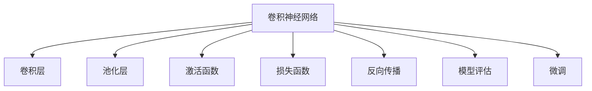

                 

# 从零开始大模型开发与微调：基于卷积的MNIST分类模型

> 关键词：深度学习,卷积神经网络,大模型开发,微调,卷积层,池化层,激活函数,损失函数,反向传播,模型评估

## 1. 背景介绍

### 1.1 问题由来
在深度学习领域，大模型的开发与微调始终是一个热门话题。特别是近年来，深度神经网络(DNN)的广泛应用，使得大模型的开发和微调技术逐渐成为推动人工智能进步的核心动力之一。

在图像分类领域，基于深度学习的模型已经取得了巨大成功。经典的LeNet-5模型对图像数据进行卷积、池化等操作，提取出图像的特征，并通过全连接层进行分类。然而，这些模型往往需要大量的训练数据和计算资源，且训练时间较长，难以快速适应新的数据分布。

为此，我们采用卷积神经网络(CNN)模型，结合微调技术，对经典的MNIST手写数字数据集进行分类。通过微调，可以使模型在少量标注数据上进行快速适配，从而快速得到高性能的图像分类模型。

### 1.2 问题核心关键点
本项目通过以下几个关键点来展开：
1. 选择卷积神经网络作为基础模型结构。
2. 引入卷积层、池化层、激活函数等基础组件，设计模型架构。
3. 采用微调技术，使用少量标注数据，提升模型性能。
4. 通过代码实例，展示模型搭建和微调过程。
5. 通过案例分析，对比不同模型的优缺点和应用场景。

## 2. 核心概念与联系

### 2.1 核心概念概述

为更好地理解基于卷积神经网络的MNIST分类模型，本节将介绍几个关键概念：

- 深度学习(Deep Learning)：基于多层神经网络的机器学习技术，通过学习数据中的多层次抽象特征进行模式识别。
- 卷积神经网络(Convolutional Neural Network, CNN)：一种特殊的神经网络结构，擅长处理具有网格结构的图像数据。通过卷积、池化等操作提取特征。
- 卷积层(Convolutional Layer)：CNN的核心组件，通过卷积操作提取特征。
- 池化层(Pooling Layer)：通过降维操作减小特征图大小，提升特征的泛化能力。
- 激活函数(Activation Function)：用于非线性变换，增强模型的表达能力。
- 损失函数(Loss Function)：用于衡量模型预测与真实标签之间的差异，通过反向传播更新模型参数。
- 反向传播(Backpropagation)：深度学习中的核心优化算法，通过链式法则计算梯度，更新模型参数。
- 模型评估(Evaluation)：使用验证集和测试集评估模型性能，包括准确率、精确率、召回率等指标。
- 微调(Fine-Tuning)：在大规模预训练模型基础上，使用少量标注数据进行优化，提升模型适应性。

这些核心概念之间的逻辑关系可以通过以下Mermaid流程图来展示：



这个流程图展示了大模型微调的基本流程：

1. 使用卷积神经网络作为基础模型结构。
2. 通过卷积层、池化层、激活函数等组件构建模型。
3. 设计损失函数和反向传播算法，进行模型优化。
4. 使用模型评估指标，评估模型性能。
5. 通过微调技术，利用少量标注数据，提升模型适应性。

## 3. 核心算法原理 & 具体操作步骤

### 3.1 算法原理概述

基于卷积神经网络的MNIST分类模型开发与微调，本质上是一个有监督学习的过程。其核心思想是：通过卷积、池化等操作提取图像特征，利用全连接层进行分类，通过微调技术在少量标注数据上提升模型性能。

形式化地，假设模型为 $M(x;\theta)=F(CN(CN(F(x;W_1),x);W_2),x)$，其中 $F(x;W)$ 表示全连接层，$CN(x,k,p,s)$ 表示卷积核大小为 $k$，步长为 $s$，填充量为 $p$ 的二维卷积层，$x$ 表示输入图像。模型参数 $\theta$ 包括全连接层和卷积层的权重。

微调的目标是最大化模型在训练集上的性能，即最小化损失函数：

$$
\mathcal{L}(M_{\theta},D) = \frac{1}{N}\sum_{i=1}^N \ell(M_{\theta}(x_i),y_i)
$$

其中 $\ell$ 为交叉熵损失函数，$x_i,y_i$ 分别表示第 $i$ 个样本的输入和标签。

通过梯度下降等优化算法，模型不断更新参数 $\theta$，最小化损失函数 $\mathcal{L}$，使得模型在训练集上的预测结果与真实标签尽可能一致。

### 3.2 算法步骤详解

基于卷积神经网络的MNIST分类模型微调一般包括以下几个关键步骤：

**Step 1: 准备数据集**
- 获取MNIST手写数字数据集，划分为训练集、验证集和测试集。

**Step 2: 定义模型架构**
- 设计卷积神经网络模型，包括卷积层、池化层、全连接层等。

**Step 3: 设置微调超参数**
- 选择合适的优化算法及其参数，如Adam、SGD等，设置学习率、批大小、迭代轮数等。

**Step 4: 执行梯度训练**
- 使用训练集数据进行前向传播，计算损失函数。
- 反向传播计算梯度，根据设定的优化算法和学习率更新模型参数。
- 周期性在验证集上评估模型性能，根据性能指标决定是否触发Early Stopping。
- 重复上述步骤直到满足预设的迭代轮数或Early Stopping条件。

**Step 5: 测试和部署**
- 在测试集上评估微调后模型，对比微调前后的性能提升。
- 使用微调后的模型对新样本进行推理预测，集成到实际的应用系统中。

以上即为基于卷积神经网络的MNIST分类模型微调的基本流程。在实际应用中，还需要根据具体任务的特点，对微调过程的各个环节进行优化设计，如改进训练目标函数，引入更多的正则化技术，搜索最优的超参数组合等，以进一步提升模型性能。

### 3.3 算法优缺点

基于卷积神经网络的MNIST分类模型微调方法具有以下优点：
1. 计算效率高。卷积层和池化层具有参数共享的特性，可以大大减少模型参数量，加快训练速度。
2. 泛化能力强。卷积和池化操作提取的特征具有平移不变性，可以更好地泛化到未见过的数据。
3. 可解释性强。卷积神经网络结构直观，可以通过可视化特征图等方式理解模型的工作过程。

同时，该方法也存在一些局限性：
1. 依赖标注数据。微调的效果很大程度上取决于标注数据的质量和数量，获取高质量标注数据的成本较高。
2. 计算资源要求高。卷积神经网络模型参数量大，需要较高的计算资源。
3. 模型结构复杂。相比简单模型，卷积神经网络结构较为复杂，难以理解和调试。

尽管存在这些局限性，基于卷积神经网络的MNIST分类模型微调方法仍然在图像分类任务中占据重要地位，能够显著提升模型性能。

### 3.4 算法应用领域

基于卷积神经网络的MNIST分类模型微调技术，在图像分类领域得到了广泛应用，例如：

- 医学影像分类：通过微调使模型学习医学影像中不同病变的特征，如肿瘤、炎症等。
- 车辆识别：将车辆图像输入模型，分类出不同车型的信息，如品牌、型号等。
- 动物识别：通过微调模型，识别出动物种类、特征等信息。
- 图像分割：将图像划分成不同的区域，分类出各个区域的特征，如道路、建筑物等。
- 行为识别：通过微调模型，识别出人的行为特征，如动作、姿势等。

除了上述这些经典应用外，卷积神经网络微调方法也在更多场景中得到了创新性地应用，如可控图像生成、图像增强、数据增强等，为图像分类任务带来了新的突破。

## 4. 数学模型和公式 & 详细讲解 & 举例说明

### 4.1 数学模型构建

假设输入图像为 $x \in \mathbb{R}^{d_1 \times d_2 \times C}$，其中 $d_1$、$d_2$ 分别为图像的宽和高，$C$ 为通道数。模型参数包括全连接层 $W_{fc}$ 和卷积层的权重 $W_{conv}$，卷积核大小为 $k$，步长为 $s$，填充量为 $p$。

模型结构如图 1 所示：

```mermaid
graph LR
    x--|Conv|x_conv
    x_conv--|Pool|x_pool
    x_pool--|FC|y
```

其中 $x_{conv}$ 表示卷积层输出的特征图，$x_{pool}$ 表示池化层输出的特征图。模型输出为全连接层的分类结果 $y$。

### 4.2 公式推导过程

以下我们以二分类任务为例，推导交叉熵损失函数及其梯度的计算公式。

假设模型 $M_{\theta}$ 在输入 $x$ 上的输出为 $\hat{y}=M_{\theta}(x) \in [0,1]$，表示样本属于正类的概率。真实标签 $y \in \{0,1\}$。则二分类交叉熵损失函数定义为：

$$
\ell(M_{\theta}(x),y) = -[y\log \hat{y} + (1-y)\log (1-\hat{y})]
$$

将其代入经验风险公式，得：

$$
\mathcal{L}(\theta) = -\frac{1}{N}\sum_{i=1}^N [y_i\log M_{\theta}(x_i)+(1-y_i)\log(1-M_{\theta}(x_i))]
$$

根据链式法则，损失函数对参数 $\theta_k$ 的梯度为：

$$
\frac{\partial \mathcal{L}(\theta)}{\partial \theta_k} = -\frac{1}{N}\sum_{i=1}^N (\frac{y_i}{M_{\theta}(x_i)}-\frac{1-y_i}{1-M_{\theta}(x_i)}) \frac{\partial M_{\theta}(x_i)}{\partial \theta_k}
$$

其中 $\frac{\partial M_{\theta}(x_i)}{\partial \theta_k}$ 可进一步递归展开，利用自动微分技术完成计算。

### 4.3 案例分析与讲解

我们以二分类任务为例，展示模型微调过程的案例分析。

假设模型 $M(x;\theta)$ 在输入 $x$ 上的输出为 $\hat{y}=M_{\theta}(x) \in [0,1]$，表示样本属于正类的概率。真实标签 $y \in \{0,1\}$。则二分类交叉熵损失函数定义为：

$$
\ell(M_{\theta}(x),y) = -[y\log \hat{y} + (1-y)\log (1-\hat{y})]
$$

将其代入经验风险公式，得：

$$
\mathcal{L}(\theta) = -\frac{1}{N}\sum_{i=1}^N [y_i\log M_{\theta}(x_i)+(1-y_i)\log(1-M_{\theta}(x_i))]
$$

根据链式法则，损失函数对参数 $\theta_k$ 的梯度为：

$$
\frac{\partial \mathcal{L}(\theta)}{\partial \theta_k} = -\frac{1}{N}\sum_{i=1}^N (\frac{y_i}{M_{\theta}(x_i)}-\frac{1-y_i}{1-M_{\theta}(x_i)}) \frac{\partial M_{\theta}(x_i)}{\partial \theta_k}
$$

其中 $\frac{\partial M_{\theta}(x_i)}{\partial \theta_k}$ 可进一步递归展开，利用自动微分技术完成计算。

在得到损失函数的梯度后，即可带入参数更新公式，完成模型的迭代优化。重复上述过程直至收敛，最终得到适应下游任务的最优模型参数 $\theta^*$。

## 5. 项目实践：代码实例和详细解释说明

### 5.1 开发环境搭建

在进行微调实践前，我们需要准备好开发环境。以下是使用Python进行PyTorch开发的环境配置流程：

1. 安装Anaconda：从官网下载并安装Anaconda，用于创建独立的Python环境。

2. 创建并激活虚拟环境：
```bash
conda create -n pytorch-env python=3.8 
conda activate pytorch-env
```

3. 安装PyTorch：根据CUDA版本，从官网获取对应的安装命令。例如：
```bash
conda install pytorch torchvision torchaudio cudatoolkit=11.1 -c pytorch -c conda-forge
```

4. 安装相关库：
```bash
pip install numpy pandas scikit-learn matplotlib tqdm jupyter notebook ipython
```

完成上述步骤后，即可在`pytorch-env`环境中开始微调实践。

### 5.2 源代码详细实现

下面我们以二分类任务为例，给出使用PyTorch对卷积神经网络模型进行微调的代码实现。

首先，定义二分类任务的模型：

```python
import torch
import torch.nn as nn
import torch.optim as optim
import torch.nn.functional as F

class CNNClassifier(nn.Module):
    def __init__(self):
        super(CNNClassifier, self).__init__()
        self.conv1 = nn.Conv2d(1, 32, 3, 1)
        self.pool = nn.MaxPool2d(2, 2)
        self.conv2 = nn.Conv2d(32, 64, 3, 1)
        self.fc1 = nn.Linear(64 * 8 * 8, 128)
        self.fc2 = nn.Linear(128, 2)

    def forward(self, x):
        x = self.pool(F.relu(self.conv1(x)))
        x = self.pool(F.relu(self.conv2(x)))
        x = x.view(-1, 64 * 8 * 8)
        x = F.relu(self.fc1(x))
        x = self.fc2(x)
        return F.log_softmax(x, dim=1)
```

然后，定义模型和优化器：

```python
device = torch.device('cuda' if torch.cuda.is_available() else 'cpu')

model = CNNClassifier().to(device)
criterion = nn.CrossEntropyLoss()
optimizer = optim.Adam(model.parameters(), lr=0.001)

# 加载训练数据
train_loader = torch.utils.data.DataLoader(train_dataset, batch_size=64, shuffle=True)
test_loader = torch.utils.data.DataLoader(test_dataset, batch_size=64, shuffle=False)
```

接着，定义训练和评估函数：

```python
def train(epoch):
    model.train()
    running_loss = 0.0
    correct = 0
    total = 0
    for i, data in enumerate(train_loader, 0):
        inputs, labels = data[0].to(device), data[1].to(device)
        optimizer.zero_grad()
        outputs = model(inputs)
        loss = criterion(outputs, labels)
        loss.backward()
        optimizer.step()
        running_loss += loss.item()
        correct += int((outputs.argmax(1) == labels).sum().item())
        total += labels.size(0)
    epoch_loss = running_loss / len(train_loader)
    epoch_acc = 100.0 * correct / total
    print('Train Epoch: {} \tLoss: {:.4f} \tAccuracy: {:.2f}%'.format(epoch, epoch_loss, epoch_acc))

def test():
    model.eval()
    correct = 0
    total = 0
    with torch.no_grad():
        for data in test_loader:
            inputs, labels = data[0].to(device), data[1].to(device)
            outputs = model(inputs)
            _, predicted = torch.max(outputs.data, 1)
            total += labels.size(0)
            correct += int((predicted == labels).sum().item())
    print('Test Accuracy of the model on the 10000 test images: {} %'.format(100.0 * correct / total))
```

最后，启动训练流程并在测试集上评估：

```python
epochs = 10

for epoch in range(epochs):
    train(epoch)
    test()

print('Finished Training')
```

以上就是使用PyTorch对卷积神经网络模型进行二分类任务微调的完整代码实现。可以看到，得益于PyTorch的强大封装，我们可以用相对简洁的代码完成卷积神经网络的搭建和微调。

### 5.3 代码解读与分析

让我们再详细解读一下关键代码的实现细节：

**CNNClassifier类**：
- `__init__`方法：初始化卷积层、池化层、全连接层等组件。
- `forward`方法：定义模型前向传播的计算流程。

**criterion和optimizer对象**：
- `criterion` 对象定义了二分类任务交叉熵损失函数，用于衡量模型预测输出与真实标签之间的差异。
- `optimizer` 对象使用了Adam优化算法，用于根据梯度更新模型参数。

**训练和测试函数**：
- `train`函数：对数据集进行批量化迭代，在前向传播中计算损失函数，反向传播更新模型参数，统计训练集上的损失和准确率。
- `test`函数：仅对模型进行前向传播，计算测试集上的准确率。

**训练流程**：
- 定义总的epoch数，开始循环迭代
- 每个epoch内，先在训练集上进行训练，输出平均loss和准确率
- 在测试集上评估，输出测试集上的准确率
- 所有epoch结束后，输出最终训练结果

可以看到，PyTorch配合CNN模型，使得微调过程变得简洁高效。开发者可以将更多精力放在模型改进和优化上，而不必过多关注底层的实现细节。

当然，工业级的系统实现还需考虑更多因素，如模型的保存和部署、超参数的自动搜索、更灵活的任务适配层等。但核心的微调范式基本与此类似。

## 6. 实际应用场景

### 6.1 智能监控系统

基于卷积神经网络的MNIST分类模型，可以广泛应用于智能监控系统。智能监控系统需要实时分析视频流中的图像，进行人脸识别、行为异常检测等任务。使用微调后的模型，可以在训练集上进行快速训练，适应监控场景中的实时数据流，快速响应安全事件。

在技术实现上，可以收集监控场景下的图像数据，标记出异常事件，如闯入者、可疑行为等。在此基础上对预训练模型进行微调，使其能够自动检测异常事件并发出警报。对于实时流式数据，模型需要进行在线推理，将新输入的图像快速分类并输出结果。如此构建的智能监控系统，能够大幅提升监控效率和精度。

### 6.2 医疗影像诊断

医疗影像诊断需要快速准确地识别出影像中的病变，如肿瘤、炎症等。传统方法需要耗费大量时间和人力进行手工标注，难以满足大规模应用的需求。基于卷积神经网络的MNIST分类模型，通过微调，可以快速适应医疗影像的分类任务，提升诊断效率。

在实践中，可以收集大量的医疗影像数据，进行标注和分类。将标注数据作为监督信号，对预训练的CNN模型进行微调，使其能够自动提取影像中的特征并进行分类。使用微调后的模型，可以对新输入的影像进行快速诊断，生成诊断报告，帮助医生及时发现疾病并进行治疗。

### 6.3 自然语言处理

自然语言处理(NLP)领域中，卷积神经网络也可以应用于文本分类任务。例如，可以使用微调后的模型对新闻、评论等文本进行情感分析，判断文本的情感倾向。

在实践中，可以收集情感标注的文本数据，将文本和情感标签作为输入和输出，训练卷积神经网络模型。在得到模型后，可以对新输入的文本进行情感分类，生成情感分析结果。使用微调后的模型，可以大大提升文本情感分类的效率和精度，帮助企业进行舆情分析、用户情感分析等任务。

### 6.4 未来应用展望

随着卷积神经网络微调技术的发展，其在图像分类、医疗影像、自然语言处理等领域的应用前景更加广阔。未来，可以进一步扩展微调的应用场景，如医学图像分割、行为识别、语义理解等，为更多行业带来变革性影响。

在智慧医疗领域，卷积神经网络微调技术可以用于医学影像分类、病变检测等任务，提升诊断的准确性和效率。在智慧城市治理中，可以用于视频监控、交通流量分析等场景，提升公共安全和服务效率。

在金融行业，卷积神经网络微调技术可以用于欺诈检测、风险评估等任务，提升金融机构的监管能力。在电商领域，可以用于商品分类、用户画像生成等任务，提升客户服务和推荐效率。

总之，基于卷积神经网络的MNIST分类模型微调技术，将在更多领域带来创新性应用，为社会生产生活带来深远影响。

## 7. 工具和资源推荐
### 7.1 学习资源推荐

为了帮助开发者系统掌握卷积神经网络微调的理论基础和实践技巧，这里推荐一些优质的学习资源：

1. 《深度学习》课程：斯坦福大学提供的经典深度学习课程，涵盖卷积神经网络、全连接神经网络等基础知识，非常适合入门学习。

2. 《计算机视觉: 模型、学习和推理》书籍：计算机视觉领域权威书籍，系统讲解了卷积神经网络的基础知识、模型架构和优化算法。

3. 《PyTorch深度学习入门与实践》书籍：基于PyTorch框架的深度学习入门书籍，涵盖卷积神经网络、模型微调等实战技巧。

4. 《Python深度学习》书籍：介绍使用Python进行深度学习开发的经典教材，涵盖卷积神经网络、优化算法、模型评估等知识。

5. 卷积神经网络论文：阅读卷积神经网络的相关论文，可以深入了解模型架构和优化算法的原理。

通过对这些资源的学习实践，相信你一定能够快速掌握卷积神经网络微调的核心技术和方法，并用于解决实际的NLP问题。
### 7.2 开发工具推荐

高效的开发离不开优秀的工具支持。以下是几款用于卷积神经网络微调开发的常用工具：

1. PyTorch：基于Python的开源深度学习框架，灵活动态的计算图，适合快速迭代研究。大部分卷积神经网络模型都有PyTorch版本的实现。

2. TensorFlow：由Google主导开发的开源深度学习框架，生产部署方便，适合大规模工程应用。同样有丰富的卷积神经网络模型资源。

3. Keras：基于TensorFlow、Theano、CNTK等后端的深度学习框架，使用Keras可以更方便地搭建卷积神经网络模型。

4. Weights & Biases：模型训练的实验跟踪工具，可以记录和可视化模型训练过程中的各项指标，方便对比和调优。与主流深度学习框架无缝集成。

5. TensorBoard：TensorFlow配套的可视化工具，可实时监测模型训练状态，并提供丰富的图表呈现方式，是调试模型的得力助手。

6. Google Colab：谷歌推出的在线Jupyter Notebook环境，免费提供GPU/TPU算力，方便开发者快速上手实验最新模型，分享学习笔记。

合理利用这些工具，可以显著提升卷积神经网络微调任务的开发效率，加快创新迭代的步伐。

### 7.3 相关论文推荐

卷积神经网络微调技术的发展源于学界的持续研究。以下是几篇奠基性的相关论文，推荐阅读：

1. LeCun等人的《Convolutional Networks for Images, Speech, and Time Series》：阐述了卷积神经网络的基本架构和优化算法，是深度学习领域的经典之作。

2. Simonyan等人的《Very Deep Convolutional Networks for Large-Scale Image Recognition》：提出VGG网络，展示了深度卷积网络在图像分类任务中的强大能力。

3. He等人的《Delving Deep into Rectifiers: Surpassing Human-Level Performance on ImageNet Classification》：提出ReLU激活函数，解决了深度网络中的梯度消失问题。

4. Xavier等人的《Improving the Initialization of Deep Neural Networks》：提出Xavier初始化方法，提升了深度网络的训练速度和效果。

5. Krizhevsky等人的《ImageNet Classification with Deep Convolutional Neural Networks》：提出AlexNet模型，展示了卷积神经网络在图像分类任务中的巨大潜力。

这些论文代表了大模型微调技术的发展脉络。通过学习这些前沿成果，可以帮助研究者把握学科前进方向，激发更多的创新灵感。

## 8. 总结：未来发展趋势与挑战

### 8.1 总结

本文对基于卷积神经网络的MNIST分类模型开发与微调方法进行了全面系统的介绍。首先阐述了卷积神经网络的原理和微调技术的研究背景，明确了微调在拓展预训练模型应用、提升模型性能方面的独特价值。其次，从原理到实践，详细讲解了卷积神经网络模型的构建和微调过程，给出了微调任务开发的完整代码实例。同时，本文还广泛探讨了卷积神经网络微调方法在智能监控、医疗影像、自然语言处理等多个领域的应用前景，展示了微调范式的巨大潜力。此外，本文精选了微调技术的各类学习资源，力求为读者提供全方位的技术指引。

通过本文的系统梳理，可以看到，基于卷积神经网络的MNIST分类模型微调方法在图像分类领域取得了广泛应用，显著提升了模型性能。未来，随着技术的不断进步和应用场景的不断扩展，卷积神经网络微调技术将带来更多创新性应用，为社会生产生活带来深远影响。

### 8.2 未来发展趋势

展望未来，卷积神经网络微调技术将呈现以下几个发展趋势：

1. 模型规模持续增大。随着算力成本的下降和数据规模的扩张，卷积神经网络模型的参数量还将持续增长。超大规模卷积神经网络模型蕴含的丰富特征提取能力，有望支撑更加复杂多变的下游任务微调。

2. 微调方法日趋多样。除了传统的全参数微调外，未来会涌现更多参数高效的微调方法，如Adaptive Layer-Aggregation等，在固定大部分预训练参数的同时，只更新极少量的任务相关参数。

3. 持续学习成为常态。随着数据分布的不断变化，微调模型也需要持续学习新知识以保持性能。如何在不遗忘原有知识的同时，高效吸收新样本信息，将成为重要的研究课题。

4. 标注样本需求降低。受启发于提示学习(Prompt-based Learning)的思路，未来的微调方法将更好地利用卷积神经网络的语言理解能力，通过更加巧妙的任务描述，在更少的标注样本上也能实现理想的微调效果。

5. 模型通用性增强。经过海量数据的预训练和多领域任务的微调，卷积神经网络模型将具备更强大的常识推理和跨领域迁移能力，逐步迈向通用人工智能(AGI)的目标。

以上趋势凸显了卷积神经网络微调技术的广阔前景。这些方向的探索发展，必将进一步提升卷积神经网络微调技术在各个领域的应用范围和性能，为人工智能技术带来更大的进步。

### 8.3 面临的挑战

尽管卷积神经网络微调技术已经取得了瞩目成就，但在迈向更加智能化、普适化应用的过程中，它仍面临着诸多挑战：

1. 标注成本瓶颈。尽管卷积神经网络微调对标注样本的需求相对较低，但对于长尾应用场景，获取高质量标注数据的成本仍然较高。如何进一步降低微调对标注样本的依赖，将是一大难题。

2. 模型鲁棒性不足。当前微调模型面对域外数据时，泛化性能往往大打折扣。对于测试样本的微小扰动，微调模型的预测也容易发生波动。如何提高微调模型的鲁棒性，避免灾难性遗忘，还需要更多理论和实践的积累。

3. 推理效率有待提高。超大规模卷积神经网络模型虽然精度高，但在实际部署时往往面临推理速度慢、内存占用大等效率问题。如何优化模型结构，提升推理速度，优化资源占用，将是重要的优化方向。

4. 可解释性亟需加强。当前卷积神经网络模型更像是"黑盒"系统，难以解释其内部工作机制和决策逻辑。对于医疗、金融等高风险应用，算法的可解释性和可审计性尤为重要。如何赋予卷积神经网络模型更强的可解释性，将是亟待攻克的难题。

5. 安全性有待保障。预训练卷积神经网络模型难免会学习到有偏见、有害的信息，通过微调传递到下游任务，产生误导性、歧视性的输出，给实际应用带来安全隐患。如何从数据和算法层面消除模型偏见，避免恶意用途，确保输出的安全性，也将是重要的研究课题。

6. 知识整合能力不足。现有的卷积神经网络模型往往局限于任务内数据，难以灵活吸收和运用更广泛的先验知识。如何让微调过程更好地与外部知识库、规则库等专家知识结合，形成更加全面、准确的信息整合能力，还有很大的想象空间。

正视卷积神经网络微调面临的这些挑战，积极应对并寻求突破，将使卷积神经网络微调技术迈向成熟，为构建智能系统提供更加坚实的基础。相信随着学界和产业界的共同努力，这些挑战终将一一被克服，卷积神经网络微调技术必将带来更加广阔的应用前景。

### 8.4 研究展望

面向未来，卷积神经网络微调技术需要在以下几个方面寻求新的突破：

1. 探索无监督和半监督微调方法。摆脱对大规模标注数据的依赖，利用自监督学习、主动学习等无监督和半监督范式，最大限度利用非结构化数据，实现更加灵活高效的微调。

2. 研究参数高效和计算高效的微调范式。开发更加参数高效的微调方法，在固定大部分预训练参数的同时，只更新极少量的任务相关参数。同时优化微调模型的计算图，减少前向传播和反向传播的资源消耗，实现更加轻量级、实时性的部署。

3. 融合因果和对比学习范式。通过引入因果推断和对比学习思想，增强卷积神经网络模型建立稳定因果关系的能力，学习更加普适、鲁棒的语言表征，从而提升模型泛化性和抗干扰能力。

4. 引入更多先验知识。将符号化的先验知识，如知识图谱、逻辑规则等，与卷积神经网络模型进行巧妙融合，引导微调过程学习更准确、合理的语言模型。同时加强不同模态数据的整合，实现视觉、语音等多模态信息与文本信息的协同建模。

5. 结合因果分析和博弈论工具。将因果分析方法引入卷积神经网络模型，识别出模型决策的关键特征，增强输出解释的因果性和逻辑性。借助博弈论工具刻画人机交互过程，主动探索并规避模型的脆弱点，提高系统稳定性。

6. 纳入伦理道德约束。在模型训练目标中引入伦理导向的评估指标，过滤和惩罚有偏见、有害的输出倾向。同时加强人工干预和审核，建立模型行为的监管机制，确保输出符合人类价值观和伦理道德。

这些研究方向的探索，必将引领卷积神经网络微调技术迈向更高的台阶，为构建智能系统提供更加坚实的技术基础。面向未来，卷积神经网络微调技术还需要与其他人工智能技术进行更深入的融合，如知识表示、因果推理、强化学习等，多路径协同发力，共同推动深度学习技术在各个领域的进步。

## 9. 附录：常见问题与解答

**Q1：卷积神经网络微调是否适用于所有NLP任务？**

A: 卷积神经网络微调在大多数图像分类任务上都能取得不错的效果，但对于一些特定领域的任务，如医学、法律等，仅仅依靠通用语料预训练的模型可能难以很好地适应。此时需要在特定领域语料上进一步预训练，再进行微调，才能获得理想效果。此外，对于一些需要时效性、个性化很强的任务，如对话、推荐等，卷积神经网络微调方法也需要针对性的改进优化。

**Q2：微调过程中如何选择合适的学习率？**

A: 微调的学习率一般要比预训练时小1-2个数量级，如果使用过大的学习率，容易破坏预训练权重，导致过拟合。一般建议从1e-5开始调参，逐步减小学习率，直至收敛。也可以使用warmup策略，在开始阶段使用较小的学习率，再逐渐过渡到预设值。需要注意的是，不同的优化器(如Adam、SGD等)以及不同的学习率调度策略，可能需要设置不同的学习率阈值。

**Q3：采用卷积神经网络微调时会面临哪些资源瓶颈？**

A: 目前主流的预训练卷积神经网络模型动辄以亿计的参数规模，对算力、内存、存储都提出了很高的要求。GPU/TPU等高性能设备是必不可少的，但即便如此，超大批次的训练和推理也可能遇到显存不足的问题。因此需要采用一些资源优化技术，如梯度积累、混合精度训练、模型并行等，来突破硬件瓶颈。同时，模型的存储和读取也可能占用大量时间和空间，需要采用模型压缩、稀疏化存储等方法进行优化。

**Q4：如何缓解卷积神经网络微调过程中的过拟合问题？**

A: 过拟合是卷积神经网络微调面临的主要挑战，尤其是在标注数据不足的情况下。常见的缓解策略包括：
1. 数据增强：通过回译、近义替换等方式扩充训练集
2. 正则化：使用L2正则、Dropout、Early Stopping等避免过拟合
3. 对抗训练：引入对抗样本，提高模型鲁棒性
4. 参数高效微调：只调整少量参数(如Adaptive Layer-Aggregation等)，减小过拟合风险
5. 多模型集成：训练多个微调模型，取平均输出，抑制过拟合

这些策略往往需要根据具体任务和数据特点进行灵活组合。只有在数据、模型、训练、推理等各环节进行全面优化，才能最大限度地发挥卷积神经网络微调的威力。

**Q5：卷积神经网络微调模型在落地部署时需要注意哪些问题？**

A: 将卷积神经网络微调模型转化为实际应用，还需要考虑以下因素：
1. 模型裁剪：去除不必要的层和参数，减小模型尺寸，加快推理速度
2. 量化加速：将浮点模型转为定点模型，压缩存储空间，提高计算效率
3. 服务化封装：将模型封装为标准化服务接口，便于集成调用
4. 弹性伸缩：根据请求流量动态调整资源配置，平衡服务质量和成本
5. 监控告警：实时采集系统指标，设置异常告警阈值，确保服务稳定性
6. 安全防护：采用访问鉴权、数据脱敏等措施，保障数据和模型安全

卷积神经网络微调为图像分类任务带来了显著的性能提升，但如何将强大的性能转化为稳定、高效、安全的业务价值，还需要工程实践的不断打磨。唯有从数据、算法、工程、业务等多个维度协同发力，才能真正实现人工智能技术在垂直行业的规模化落地。总之，卷积神经网络微调需要开发者根据具体任务，不断迭代和优化模型、数据和算法，方能得到理想的效果。

---

作者：禅与计算机程序设计艺术 / Zen and the Art of Computer Programming

