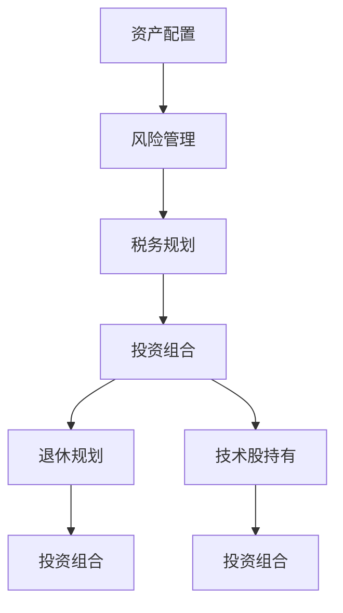

                 

# 从零开始：程序员的理财之路

> 关键词：理财, 程序员, 投资, 财务管理, 投资组合, 税务规划, 退休规划

## 1. 背景介绍

### 1.1 问题由来
在现代经济社会中，理财与投资已成为每个人必须面对的课题。尤其是在信息技术飞速发展的今天，程序员作为高收入人群，更应当关注个人财务状况，提前进行财务规划，实现财富的稳健增值。然而，许多程序员对理财缺乏基本知识，甚至存在误解，如将财富等同于编码技能、项目奖金，忽略长期财富管理。因此，本文将从理财的基本概念出发，详细介绍程序员应该具备的理财知识和技能。

### 1.2 问题核心关键点
本节将探讨如何构建合理的财务框架，以及基于程序员职业特点的理财策略。

- **财务框架构建**：包括资产配置、风险管理、税务规划等基本原则。
- **理财策略设计**：结合程序员职业特性，如高收入、技术股持有、长期工作稳定性等，设计适合程序员的理财方案。

## 2. 核心概念与联系

### 2.1 核心概念概述

理财与投资，是维持个人财务健康、实现财富增值的重要手段。本文将介绍以下几个核心概念：

- **资产配置**：指将个人资产按照风险偏好和收益目标进行合理分配，以达到风险和收益的平衡。
- **风险管理**：识别、评估和控制投资风险，通过分散投资降低潜在损失。
- **税务规划**：在法律允许的范围内，最大化合法税负减免，优化财务状况。
- **投资组合**：由多种资产构成，通过组合方式提高整体收益和降低单一资产风险。
- **退休规划**：通过规划确保在退休后有足够的资金支持生活，实现财务自由。
- **技术股持有**：程序员通常持有公司股票，通过合理的股票管理策略，优化收益和风险。

这些概念之间通过投资组合理论、风险管理技术、税务规则等联系起来，构成了一个完整的理财框架。

### 2.2 核心概念原理和架构的 Mermaid 流程图



这个流程图展示了理财过程中各个概念之间的联系和相互作用：

1. **资产配置**：确定了风险偏好和收益目标后，进行资产配置，从而决定了后续的风险管理和投资组合设计。
2. **风险管理**：基于配置结果，实施风险控制策略。
3. **税务规划**：在风险管理的基础上，进一步优化税务策略。
4. **投资组合**：结合风险管理、税务规划等，构建投资组合，实现风险与收益的平衡。
5. **退休规划**：在投资组合的基础上，进行长期的退休规划。
6. **技术股持有**：针对程序员的职业特点，进行股票管理，优化收益和风险。
7. **整体优化**：最终，所有这些步骤共同构成了一个完整的理财框架。

## 3. 核心算法原理 & 具体操作步骤

### 3.1 算法原理概述

理财的核心理论是投资组合理论，目标是构建一个风险与收益平衡的投资组合。对于程序员而言，理财过程可以简化为以下几个步骤：

1. **需求分析**：确定理财目标，如购房、子女教育、退休等。
2. **风险评估**：评估个人风险承受能力，选择适合的风险等级。
3. **资产配置**：根据需求和风险评估，进行资产分配。
4. **投资选择**：基于资产配置结果，选择具体的投资标的。
5. **策略优化**：根据市场变化，动态调整投资组合，优化收益和风险。
6. **持续监控**：定期评估理财策略，确保其适应新环境。

### 3.2 算法步骤详解

#### 3.2.1 需求分析
- **明确目标**：区分长期和短期需求，如退休规划和购房计划。
- **时间框架**：设定实现目标的时间节点，便于资金安排。
- **资金需求**：计算实现目标所需的总资金。

#### 3.2.2 风险评估
- **风险容忍度**：评估个人对风险的容忍程度，如对损失的接受范围。
- **风险类型**：识别面临的风险类型，如市场风险、信用风险、流动性风险等。
- **风险管理**：制定风险管理策略，如分散投资、保险配置等。

#### 3.2.3 资产配置
- **风险与收益权衡**：根据风险偏好和收益目标，选择适合的资产类别，如股票、债券、房地产等。
- **分散投资**：避免过度集中，分散投资于不同资产类别和地域，降低单一资产风险。
- **动态调整**：定期审视资产配置结果，根据市场变化和自身需求进行动态调整。

#### 3.2.4 投资选择
- **标的选择**：根据资产类别，选择具体的投资标的，如股票、基金、债券等。
- **成本考量**：考虑投资标的的费用和税负，选择低成本、高收益的投资工具。
- **流动性管理**：确保投资标的有良好的流动性，便于应对突发需求。

#### 3.2.5 策略优化
- **定期评估**：定期评估投资组合表现，根据市场情况调整资产配置。
- **收益再投资**：将投资收益进行再投资，复利效应最大化。
- **新兴市场探索**：考虑新兴市场的投资机会，分散风险同时提升收益。

#### 3.2.6 持续监控
- **定期审计**：定期进行财务审计，检查理财策略的执行情况。
- **调整计划**：根据审计结果和市场变化，调整财务计划和投资策略。
- **预算管理**：实施严格的预算管理，确保资金按计划分配。

### 3.3 算法优缺点

#### 3.3.1 优点
- **风险分散**：通过多样化投资降低单一资产风险。
- **收益最大化**：合理配置资产，优化收益。
- **灵活调整**：根据市场变化动态调整策略，适应新环境。

#### 3.3.2 缺点
- **复杂性**：涉及多因素、多变量，决策过程复杂。
- **成本较高**：专业咨询和动态调整需投入较高成本。
- **市场风险**：市场波动可能导致投资收益不稳定。

### 3.4 算法应用领域

理财算法不仅适用于传统金融领域，程序员可以通过这些策略，实现个人财富的稳健增值。应用领域包括：

- **股票投资**：根据个人风险偏好和市场分析，构建投资组合。
- **债券投资**：选择稳健的债券产品，获取固定收益。
- **房地产投资**：选择适合的房地产标的，进行长期持有或出租。
- **基金定投**：通过定期定额投资，分散风险，平滑收益。
- **退休储蓄**：提前规划，确保退休后有充足的资金支持。

## 4. 数学模型和公式 & 详细讲解 & 举例说明

### 4.1 数学模型构建

理财过程中的数学模型通常包括风险模型、收益模型、税务模型等。以下将以收益模型和风险模型为例进行详细讲解。

#### 4.1.1 收益模型
收益模型旨在计算投资组合在不同市场条件下的预期收益。常见的收益模型有线性模型和马尔可夫模型。

线性模型假设资产价格服从正态分布，表达为：

$$
R_i = \mu_i + \sigma_i \cdot N(0,1) \quad (1)
$$

其中 $R_i$ 为资产 $i$ 的收益率，$\mu_i$ 为期望收益，$\sigma_i$ 为标准差，$N(0,1)$ 为标准正态分布随机变量。

#### 4.1.2 风险模型
风险模型用于评估投资组合的整体风险，常用方差-协方差模型和CAPM模型。

方差-协方差模型表达为：

$$
Var(X) = \Sigma \quad (2)
$$

其中 $\Sigma$ 为协方差矩阵，反映了资产之间的相关性。

CAPM模型则通过beta值评估系统性风险，表达为：

$$
E(R_i) = r_f + \beta_i [E(R_m) - r_f] \quad (3)
$$

其中 $E(R_i)$ 为资产 $i$ 的期望收益率，$r_f$ 为无风险收益率，$E(R_m)$ 为市场平均收益率，$\beta_i$ 为资产 $i$ 的系统性风险系数。

### 4.2 公式推导过程

#### 4.2.1 收益模型推导
以线性模型为例，资产的期望收益 $\mu_i$ 为：

$$
\mu_i = \int_{-\infty}^{\infty} p(x) \cdot x \, dx \quad (4)
$$

其中 $p(x)$ 为资产价格的概率密度函数。

#### 4.2.2 风险模型推导
方差-协方差模型中，协方差矩阵 $\Sigma$ 为：

$$
\Sigma_{ij} = Cov(X_i, X_j) = E[(X_i - \mu_i)(X_j - \mu_j)] \quad (5)
$$

其中 $Cov(X_i, X_j)$ 为资产 $i$ 和 $j$ 的协方差。

CAPM模型中，系统性风险系数 $\beta_i$ 为：

$$
\beta_i = \frac{\sigma_i}{\sigma_m} \quad (6)
$$

其中 $\sigma_i$ 为资产 $i$ 的标准差，$\sigma_m$ 为市场标准差。

### 4.3 案例分析与讲解

假设程序员小王持有 $10\%$ 的股票和 $90\%$ 的债券，股票的期望收益为 $15\%$，标准差为 $25\%$，债券的期望收益为 $5\%$，标准差为 $4\%$。

使用线性模型计算小王投资组合的期望收益：

$$
E(R_{p}) = 0.1 \times 0.15 + 0.9 \times 0.05 = 0.09 \quad (7)
$$

使用方差-协方差模型计算投资组合的风险：

$$
\Sigma_{p} = \begin{bmatrix}
0.0625 & 0.0625 \\
0.0625 & 0.16
\end{bmatrix} \quad (8)
$$

其中 $0.0625$ 为股票与股票之间的协方差，$0.0625$ 为股票与债券之间的协方差，$0.16$ 为债券与债券之间的协方差。

使用CAPM模型计算投资组合的系统性风险：

$$
\beta_{p} = \frac{0.25}{0.15} = 1.6667 \quad (9)
$$

这意味着小王投资组合的系统性风险系数为 $1.6667$，高于市场平均水平。

## 5. 项目实践：代码实例和详细解释说明

### 5.1 开发环境搭建

在进行理财计算前，需要准备好开发环境。以下是使用Python进行理财计算的环境配置流程：

1. 安装Anaconda：从官网下载并安装Anaconda，用于创建独立的Python环境。

2. 创建并激活虚拟环境：
```bash
conda create -n finance-env python=3.8 
conda activate finance-env
```

3. 安装PyTorch和相关库：
```bash
conda install pytorch torchvision torchaudio
```

4. 安装NumPy和Pandas：
```bash
conda install numpy pandas
```

5. 安装TensorFlow和相关库：
```bash
conda install tensorflow
```

6. 安装Matplotlib和Seaborn：
```bash
conda install matplotlib seaborn
```

完成上述步骤后，即可在`finance-env`环境中开始理财计算。

### 5.2 源代码详细实现

以下是使用Python实现理财计算的示例代码：

```python
import numpy as np
import pandas as pd
import matplotlib.pyplot as plt
import seaborn as sns

# 资产配置
stock_ratio = 0.1
bond_ratio = 0.9

# 期望收益和标准差
stock_mu = 0.15
bond_mu = 0.05
stock_sigma = 0.25
bond_sigma = 0.04

# 计算投资组合的期望收益和风险
comb_mu = stock_ratio * stock_mu + bond_ratio * bond_mu
comb_sigma = np.sqrt(stock_ratio**2 * stock_sigma**2 + bond_ratio**2 * bond_sigma**2)

# 风险管理
# 计算协方差矩阵
comb_cov = stock_ratio * bond_ratio * 0.0625

# 系统性风险系数
comb_beta = stock_ratio * stock_sigma / np.sqrt(stock_ratio**2 * stock_sigma**2 + bond_ratio**2 * bond_sigma**2)

# 输出结果
print(f"投资组合期望收益: {comb_mu}")
print(f"投资组合风险: {comb_sigma}")
print(f"协方差矩阵:\n{comb_cov}")
print(f"系统性风险系数: {comb_beta}")

# 可视化
plt.figure(figsize=(10, 6))
sns.heatmap(comb_cov, annot=True, fmt='.2f')
plt.title("协方差矩阵")
plt.xlabel("资产")
plt.ylabel("资产")
plt.show()
```

### 5.3 代码解读与分析

让我们再详细解读一下关键代码的实现细节：

**资产配置**：
- `stock_ratio`和`bond_ratio`变量分别表示股票和债券的配置比例。

**期望收益和标准差**：
- `stock_mu`和`bond_mu`为股票和债券的期望收益。
- `stock_sigma`和`bond_sigma`为股票和债券的标准差。

**投资组合的期望收益和风险**：
- `comb_mu`变量计算投资组合的期望收益。
- `comb_sigma`变量计算投资组合的风险，使用标准差公式计算。

**协方差矩阵**：
- `comb_cov`变量计算投资组合的协方差矩阵，使用相关系数公式计算。

**系统性风险系数**：
- `comb_beta`变量计算投资组合的系统性风险系数，使用CAPM模型公式计算。

**可视化**：
- 使用`matplotlib`和`seaborn`库对协方差矩阵进行可视化展示。

可以看到，使用Python进行理财计算可以方便地进行各种数学和统计分析，为理财决策提供数据支持。

## 6. 实际应用场景

### 6.1 股票投资
假设程序员小李想要进行股票投资，可以选择以下步骤：

1. **需求分析**：小李的目标是5年内购买一套房价为500万元的房产。
2. **风险评估**：小李的风险容忍度为20%，即最多可以接受20%的资产损失。
3. **资产配置**：根据需求和风险评估，小李决定将70%的资金投入股票市场，30%的资金投资债券市场。
4. **投资选择**：选择低成本、高收益的指数基金作为股票投资标的。
5. **策略优化**：定期审视投资组合表现，根据市场情况调整资产配置，如2021年大量买入科技股。
6. **持续监控**：小李每月审计财务状况，确保资金按计划分配。

### 6.2 债券投资
假设程序员小王希望进行债券投资，可以选择以下步骤：

1. **需求分析**：小王的目标是5年内退休，确保每月有5000元的退休金。
2. **风险评估**：小王的风险容忍度为5%，即只接受5%的资产损失。
3. **资产配置**：根据需求和风险评估，小王决定将80%的资金投资于高评级债券，20%的资金投资于国债。
4. **投资选择**：选择低风险、稳定收益的企业债和高收益的国债作为投资标的。
5. **策略优化**：定期调整投资组合，避免单一债券集中，如2019年大量买入AAA级企业债。
6. **持续监控**：小王每年审计财务状况，确保投资策略适应新环境。

### 6.3 退休规划
假设程序员小张希望进行退休规划，可以选择以下步骤：

1. **需求分析**：小张的目标是20年后退休，每月有10000元的退休金。
2. **风险评估**：小张的风险容忍度为10%，即可以接受10%的资产损失。
3. **资产配置**：根据需求和风险评估，小张决定将50%的资金投资于股票市场，40%的资金投资于债券市场，10%的资金投资于房地产市场。
4. **投资选择**：选择长期收益稳健的指数基金和优质企业债作为投资标的。
5. **策略优化**：定期调整投资组合，确保资产配置与目标一致，如2021年大量买入高股息股票。
6. **持续监控**：小张每年审计财务状况，确保投资策略适应新环境。

### 6.4 未来应用展望
未来，理财技术将进一步发展，为程序员提供更加智能化的理财建议。以下是几个可能的发展方向：

1. **智能投顾**：利用人工智能技术，为程序员提供个性化的理财建议和策略优化。
2. **量化投资**：通过大数据分析和机器学习模型，优化投资组合，提升收益。
3. **区块链应用**：利用区块链技术进行透明、安全的资金管理，确保理财安全。
4. **元宇宙理财**：探索虚拟世界中的理财新场景，为程序员提供更广阔的理财空间。
5. **隐私保护**：采用先进的隐私保护技术，确保程序员财务数据的安全。

## 7. 工具和资源推荐

### 7.1 学习资源推荐

为了帮助程序员系统掌握理财知识，这里推荐一些优质的学习资源：

1. 《富爸爸穷爸爸》：罗伯特·清崎的经典理财书籍，介绍了财务自由和财富积累的核心理念。
2. 《证券分析》：本杰明·格雷厄姆的理财经典之作，详细介绍了价值投资的方法。
3. 《理财规划与投资分析》：系统介绍理财规划和投资分析的理论和实践，适合入门学习。
4. Coursera《投资组合管理》课程：提供系统的投资组合理论课程，结合案例讲解。
5. Khan Academy《财务和投资》课程：通过动画讲解，适合初学者理解基本概念。

### 7.2 开发工具推荐

高效的工具可以大大提高理财计算和投资的效率。以下是几个常用的开发工具：

1. Python：强大的编程语言，广泛应用于理财计算和量化投资。
2. Excel：简单易用的电子表格工具，适合基本的财务分析和预算管理。
3. Google Sheets：支持大数据分析和可视化，适合团队协作和数据共享。
4. Tableau：强大的数据可视化工具，支持复杂的数据分析和报表生成。
5. R：统计分析能力强，支持数据挖掘和机器学习模型。

### 7.3 相关论文推荐

理财领域的研究成果丰富，以下是几篇经典的学术论文，推荐阅读：

1. Black, Fischer; Litterman, Robert (1990). "Global Portfolio Optimization". Financial Analysts Journal.
2. Markowitz, Harry M. (1952). "Portfolio Selection". The Journal of Finance.
3. Sharpe, William F. (1966). "Capital Asset Prices: A Theory of Market Equilibrium under Conditions of Risk". Journal of Finance.

这些论文代表了大理财理论的发展脉络，为理财实践提供了坚实的理论基础。

## 8. 总结：未来发展趋势与挑战

### 8.1 总结

本文从理财的基本概念出发，系统介绍了程序员应该如何进行理财和投资。通过需求分析、风险评估、资产配置、投资选择、策略优化和持续监控等步骤，构建了完整的理财框架。同时，结合程序员的职业特点，提供了适合程序员的理财策略。通过本文的系统梳理，程序员可以更好地理解理财的核心原理，制定科学的理财计划，实现财富稳健增值。

### 8.2 未来发展趋势

展望未来，理财技术将进一步发展，为程序员提供更加智能化的理财建议和策略优化。以下是几个可能的发展方向：

1. **智能投顾**：利用人工智能技术，为程序员提供个性化的理财建议和策略优化。
2. **量化投资**：通过大数据分析和机器学习模型，优化投资组合，提升收益。
3. **区块链应用**：利用区块链技术进行透明、安全的资金管理，确保理财安全。
4. **元宇宙理财**：探索虚拟世界中的理财新场景，为程序员提供更广阔的理财空间。
5. **隐私保护**：采用先进的隐私保护技术，确保程序员财务数据的安全。

### 8.3 面临的挑战

尽管理财技术已经取得了显著进步，但在迈向更加智能化、普适化应用的过程中，仍面临诸多挑战：

1. **数据隐私**：如何保护程序员的财务数据，防止数据泄露和滥用。
2. **算法透明度**：确保理财建议和投资策略的透明性，避免“黑箱”决策。
3. **市场波动**：市场的不确定性可能导致投资收益不稳定，需建立风险应对机制。
4. **技术壁垒**：理财技术的普及需克服技术壁垒，确保普适性和易用性。
5. **合规性**：理财工具需符合法律法规，确保合规性和道德性。

### 8.4 研究展望

面对理财面临的这些挑战，未来的研究需要在以下几个方面寻求新的突破：

1. **隐私保护技术**：开发更为先进的隐私保护算法，确保程序员财务数据的安全。
2. **算法透明性**：建立透明的理财建议和投资策略评估机制，增强算法的可信性。
3. **风险管理技术**：开发更加稳健的风险管理模型，提高理财工具的鲁棒性。
4. **普适性技术**：开发易于使用的理财工具，降低技术门槛，普及理财知识。
5. **合规性技术**：建立合规性保障机制，确保理财工具符合法律法规。

这些研究方向的探索，必将引领理财技术迈向更高的台阶，为程序员提供更加智能化、安全化的理财解决方案。

## 9. 附录：常见问题与解答

**Q1：如何评估理财工具的性能？**

A: 理财工具的性能评估主要包括以下几个方面：
- **收益率**：计算投资组合的年化收益率，评估投资收益。
- **风险系数**：计算投资组合的系统性风险系数，评估风险水平。
- **波动性**：计算投资组合的标准差，评估收益的波动性。
- **相关性**：计算投资组合中各资产之间的相关系数，评估风险分散效果。

**Q2：如何构建多样化的投资组合？**

A: 构建多样化的投资组合主要通过以下几个步骤：
- **资产选择**：选择不同类型和风格的资产，如股票、债券、基金等。
- **风险分散**：避免资产集中，通过分散投资降低单一资产风险。
- **动态调整**：根据市场变化和自身需求，定期调整投资组合。

**Q3：如何处理税务问题？**

A: 税务问题的处理主要包括以下几个方面：
- **合理避税**：利用税法规定，进行合理避税，如利用养老金账户。
- **税务优化**：通过资产配置和税务策略，优化税务负担。
- **及时申报**：按时申报税务，避免逾期罚款和额外负担。

**Q4：如何应对市场波动？**

A: 应对市场波动主要通过以下几个策略：
- **分散投资**：通过多样化投资降低单一资产风险。
- **风险管理**：使用对冲和期权等金融工具进行风险对冲。
- **动态调整**：根据市场变化，及时调整投资组合。

**Q5：如何进行退休规划？**

A: 退休规划主要包括以下几个步骤：
- **需求评估**：评估退休后的生活需求，确定资金目标。
- **资产配置**：根据需求和风险评估，进行合理的资产配置。
- **投资选择**：选择稳健的投资标的，确保退休金充足。
- **定期审计**：定期审计财务状况，确保投资策略适应新环境。

通过本文的系统梳理，程序员可以更好地理解理财的核心原理，制定科学的理财计划，实现财富稳健增值。

