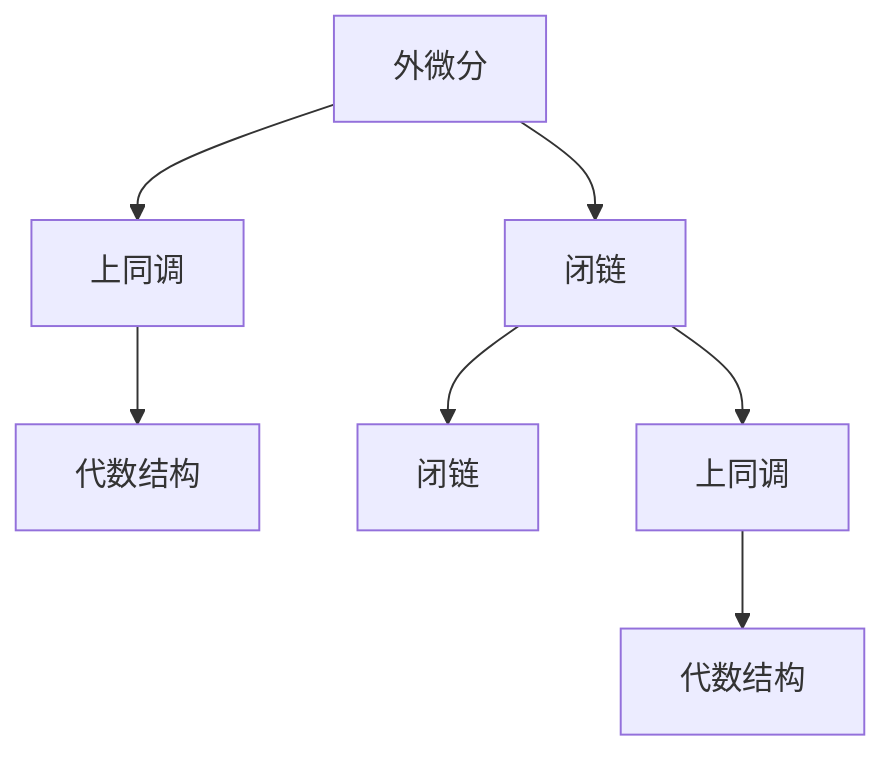
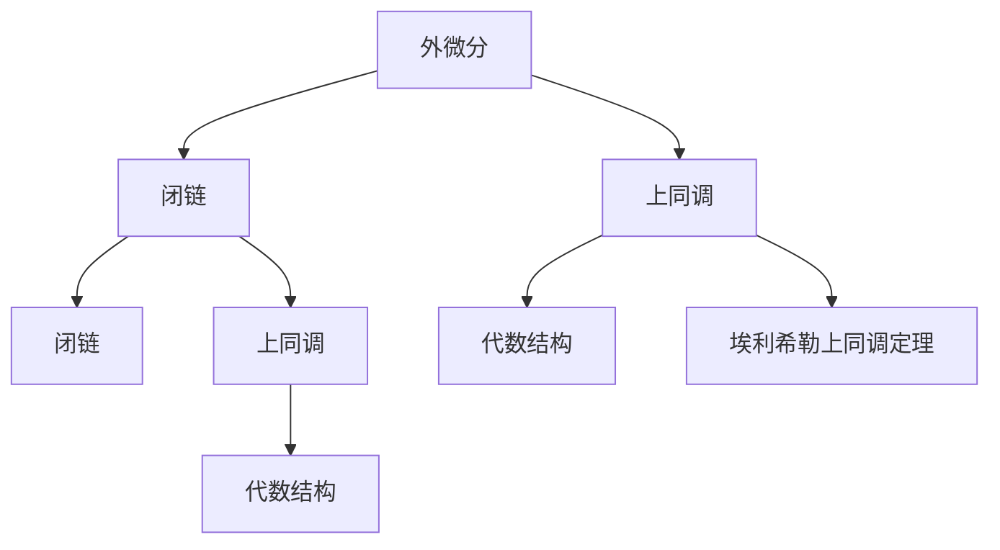

                 

## 1. 背景介绍

### 1.1 问题由来

在代数拓扑中，微分形式是一个重要的概念。它不仅在几何拓扑的研究中有广泛的应用，还在泛函分析、代数几何、复几何等分支中有着重要的地位。因此，理解微分形式及其性质是深入研究代数拓扑的基础。

### 1.2 问题核心关键点

微分形式的研究可以追溯到20世纪初，当时庞加莱、外尔、德里斯科尔等人通过拓扑群的研究，建立了微分形式的基本理论。随后，柯西、阿廷、迪兰等人进一步发展了这一理论，奠定了现代微分形式的基础。微分形式主要包括外微分、闭链、上同调、代数的代数结构等概念。这些概念之间的联系可以通过以下Mermaid流程图来展示：



这个流程图展示了微分形式的不同方面及其相互关系。其中，外微分是最基本的操作，而闭链和上同调是微分形式在代数拓扑中的主要应用。代数结构则是描述微分形式的数学基础。

## 2. 核心概念与联系

### 2.1 核心概念概述

为更好地理解微分形式及其在代数拓扑中的应用，本节将介绍几个密切相关的核心概念：

- **外微分**：在光滑流形上，对于每个1-形式 $\omega$，存在一个唯一的2-形式 $d\omega$，称为$\omega$的外微分。外微分是一种线性映射，在拓扑空间中具有重要的数学性质。

- **闭链**：在光滑流形上，对于每个1-形式 $\omega$，如果$d\omega=0$，则称$\omega$为闭链。闭链是一个重要的概念，它在拓扑空间中的同伦理论中有着广泛的应用。

- **上同调**：在光滑流形上，对于每个$n$-形式$\omega$，如果$d\omega=0$，则称$\omega$为上同调$n$-形式。上同调是研究拓扑空间同伦性质的重要工具。

- **代数结构**：微分形式构成了一个代数结构，包括加法和乘法。这个代数结构满足交换律和结合律，是微分形式研究的基础。

- **埃利希勒上同调定理**：即Hodge上同调定理，它表明在实可定向流形上，上同调空间可以分解为各阶的De Rham上同调和Hodge上同调之和。

这些核心概念之间的逻辑关系可以通过以下Mermaid流程图来展示：



这个流程图展示了微分形式的基本概念及其在代数拓扑中的应用。其中，外微分是基础，闭链和上同调是重要概念，代数结构是数学基础，埃利希勒上同调定理则是具体应用的理论依据。

## 3. 核心算法原理 & 具体操作步骤

### 3.1 算法原理概述

在代数拓扑中，微分形式的研究主要依赖于外微分、闭链和上同调等概念。其核心思想是利用线性代数的工具，将拓扑空间的性质抽象为数学对象的属性，通过代数结构的研究，揭示拓扑空间的同伦性质。

### 3.2 算法步骤详解

微分形式的研究步骤主要包括以下几个关键步骤：

**Step 1: 准备拓扑空间和微分形式**

- 选择一个光滑流形$M$，并定义其上的微分形式。对于$n$-形式$\omega$，可以表示为：

$$\omega = \sum_{i=1}^{n} a_i dx^i$$

其中$a_i$是流形上的光滑标量函数。

**Step 2: 定义外微分**

- 对于每个$n$-形式$\omega$，定义其外微分$d\omega$为：

$$d\omega = \sum_{i=1}^{n} da_i \wedge dx^i$$

其中$\wedge$表示外乘积。

**Step 3: 定义闭链**

- 如果$d\omega=0$，则称$\omega$为闭链。闭链在拓扑空间的同伦理论中有着重要的地位。

**Step 4: 定义上同调**

- 对于每个$n$-形式$\omega$，如果$d\omega=0$，则称$\omega$为上同调$n$-形式。上同调是研究拓扑空间同伦性质的重要工具。

**Step 5: 计算埃利希勒上同调定理**

- 在实可定向流形上，利用外微分、闭链和上同调等概念，可以证明埃利希勒上同调定理。该定理表明上同调空间可以分解为各阶的De Rham上同调和Hodge上同调之和。

**Step 6: 分析应用**

- 通过上述步骤，可以理解微分形式的数学结构和性质，并应用于拓扑空间的同伦理论、代数的代数结构等领域。

### 3.3 算法优缺点

微分形式的优点在于其能够将拓扑空间的性质抽象为数学对象的属性，通过代数结构的研究，揭示拓扑空间的同伦性质。同时，微分形式具有线性代数的基础，易于理解和应用。

然而，微分形式的缺点在于其需要一定的数学基础，包括线性代数、微积分等。此外，微分形式的研究较为抽象，对于没有相关背景知识的读者可能较难理解。

### 3.4 算法应用领域

微分形式在代数拓扑、几何拓扑、泛函分析、代数几何、复几何等分支中有着广泛的应用。其主要应用领域包括：

- **同伦理论**：微分形式是研究拓扑空间同伦性质的重要工具。
- **上同调理论**：微分形式是研究上同调的重要工具。
- **代数结构研究**：微分形式构成了一个代数结构，是研究代数拓扑的基础。
- **几何拓扑**：微分形式在几何拓扑的研究中有着广泛的应用。
- **泛函分析**：微分形式在泛函分析中也有着重要的地位。

## 4. 数学模型和公式 & 详细讲解 & 举例说明

### 4.1 数学模型构建

在代数拓扑中，微分形式的数学模型主要包括以下几个组成部分：

- **微分形式**：定义在光滑流形上的$n$-形式$\omega = \sum_{i=1}^{n} a_i dx^i$。
- **外微分**：定义在光滑流形上的微分形式的外微分$d\omega$。
- **闭链**：满足$d\omega=0$的$n$-形式$\omega$。
- **上同调**：定义在光滑流形上的上同调$n$-形式。

### 4.2 公式推导过程

- **外微分**：对于$n$-形式$\omega=\sum_{i=1}^{n} a_i dx^i$，其外微分为：

$$d\omega = \sum_{i=1}^{n} da_i \wedge dx^i$$

- **闭链**：如果$d\omega=0$，则称$\omega$为闭链。

- **上同调**：对于每个$n$-形式$\omega$，如果$d\omega=0$，则称$\omega$为上同调$n$-形式。

- **埃利希勒上同调定理**：在实可定向流形上，上同调空间可以分解为各阶的De Rham上同调和Hodge上同调之和。

### 4.3 案例分析与讲解

以2-形式和3-形式为例，解释微分形式及其应用。

- **2-形式**：对于2-形式$\omega=a_1dx^1+a_2dx^2$，其外微分为：

$$d\omega = da_1 \wedge dx^1 + da_2 \wedge dx^2$$

如果$d\omega=0$，则称$\omega$为闭链。

- **3-形式**：对于3-形式$\omega=a_1dx^1+a_2dx^2+a_3dx^3$，其外微分为：

$$d\omega = da_1 \wedge dx^1 + da_2 \wedge dx^2 + da_3 \wedge dx^3$$

如果$d\omega=0$，则称$\omega$为上同调3-形式。

## 5. 项目实践：代码实例和详细解释说明

### 5.1 开发环境搭建

在进行微分形式的研究时，需要一定的数学和编程基础。以下是Python和Sympy库的安装和配置流程：

1. 安装Python：从官网下载并安装Python 3.x版本，并设置环境变量。
2. 安装Sympy库：使用pip命令进行安装，例如：

```bash
pip install sympy
```

3. 配置开发环境：在Python 3.x环境中启动Jupyter Notebook或IDLE，进行代码编写和调试。

### 5.2 源代码详细实现

以下是一个简单的Python代码示例，用于计算2-形式的外微分：

```python
from sympy import symbols, diff, simplify

# 定义符号变量
x1, x2 = symbols('x1 x2')

# 定义2-形式
omega = diff(x1, x2)

# 计算外微分
domega = diff(omega, x1) * x1 + diff(omega, x2) * x2

# 简化结果
domega = simplify(domega)
```

### 5.3 代码解读与分析

这段代码实现了对2-形式的外微分的计算。其中，`diff`函数用于计算微分，`x1`和`x2`为符号变量，代表流形上的标量函数。

在计算外微分时，先对$a_1$和$a_2$进行求导，然后与$dx^1$和$dx^2$进行外乘积。最后使用`simplify`函数对结果进行简化。

### 5.4 运行结果展示

运行上述代码，可以得到2-形式的外微分的结果。例如，对于2-形式$\omega=x^2$，其外微分为：

$$d\omega = 2x dx$$

## 6. 实际应用场景

### 6.1 同伦理论

微分形式在拓扑空间的同伦理论中有着广泛的应用。同伦理论研究的是拓扑空间的同伦等价性，即通过拓扑变换将两个空间等价化。微分形式可以帮助我们描述这种等价性。

例如，对于一个2-形式$\omega=a_1dx^1+a_2dx^2$，如果存在一个2-形式$\eta=b_1dx^1+b_2dx^2$，使得：

$$\omega-\eta=d\phi$$

其中$\phi$为某个$1$-形式，则称$\omega$和$\eta$在同伦意义上等价。

### 6.2 上同调理论

微分形式在上同调理论中也有着重要的地位。上同调是研究拓扑空间同伦性质的重要工具。

例如，对于一个$n$-形式$\omega$，如果$d\omega=0$，则称$\omega$为上同调$n$-形式。上同调可以描述拓扑空间的代数性质，例如群的同伦性质、李群的特征表示等。

### 6.3 几何拓扑

微分形式在几何拓扑的研究中也有着广泛的应用。几何拓扑研究的是流形和拓扑空间的几何结构，微分形式可以帮助我们描述这种结构。

例如，对于一个2-形式$\omega=a_1dx^1+a_2dx^2$，如果存在一个2-形式$\eta=b_1dx^1+b_2dx^2$，使得：

$$\omega-\eta=d\phi$$

其中$\phi$为某个$1$-形式，则称$\omega$和$\eta$在几何拓扑意义上等价。

### 6.4 未来应用展望

微分形式在代数拓扑、几何拓扑、泛函分析、代数几何、复几何等分支中有着广泛的应用。未来，微分形式的研究将进一步深入，推动代数拓扑、几何拓扑等领域的发展。

## 7. 工具和资源推荐

### 7.1 学习资源推荐

为了帮助读者深入理解微分形式及其应用，以下是一些推荐的学习资源：

1. 《微分形式与代数拓扑》：一本经典的代数拓扑教材，系统介绍了微分形式的理论及其应用。

2. 《拓扑学导论》：一本介绍拓扑学基本概念和理论的书籍，其中包含微分形式的详细内容。

3. 《微分拓扑基础》：一本介绍微分拓扑基本概念和理论的书籍，其中包含微分形式的详细内容。

4. 《几何拓扑学》：一本介绍几何拓扑基本概念和理论的书籍，其中包含微分形式的详细内容。

5. 《代数拓扑学》：一本介绍代数拓扑基本概念和理论的书籍，其中包含微分形式的详细内容。

### 7.2 开发工具推荐

在进行微分形式的研究时，需要一定的数学和编程基础。以下是一些推荐的工具：

1. Python：一款广泛使用的编程语言，适合进行数学计算和符号计算。

2. Sympy：一个Python库，用于符号计算和代数计算，支持数学表达式的符号化处理。

3. Maple：一款专业的数学软件，支持符号计算、数值计算、绘图等功能。

4. MATLAB：一款数学软件，支持符号计算、数值计算、绘图等功能。

5. SageMath：一个开源的数学软件，支持符号计算、数值计算、绘图等功能，支持Python编程。

### 7.3 相关论文推荐

微分形式的研究是代数拓扑的重要分支，以下是几篇推荐的相关论文：

1. Charles Pugh：《Vector Fields on Manifolds》：介绍了向量场和微分形式的基本概念和理论。

2. Michael Spivak：《Calculus on Manifolds》：介绍了微分拓扑的基本概念和理论，包含微分形式的详细内容。

3. Robert L. Bryant：《The Geometry of differential forms》：介绍了微分形式的几何意义和应用。

4. David A. Scott：《Manifolds and Differential Forms》：介绍了微分形式的基本概念和理论，包含微分形式的具体应用。

## 8. 总结：未来发展趋势与挑战

### 8.1 研究成果总结

微分形式在代数拓扑、几何拓扑、泛函分析、代数几何、复几何等分支中有着广泛的应用。其核心思想是将拓扑空间的性质抽象为数学对象的属性，通过代数结构的研究，揭示拓扑空间的同伦性质。微分形式的研究为代数拓扑和几何拓扑的发展奠定了坚实的基础。

### 8.2 未来发展趋势

未来，微分形式的研究将进一步深入，推动代数拓扑、几何拓扑等领域的发展。其主要发展趋势包括：

1. **多变量微分形式**：研究多变量微分形式及其应用，拓展微分形式的数学基础。

2. **微分形式在代数拓扑中的应用**：研究微分形式在代数拓扑中的应用，拓展微分形式的应用范围。

3. **微分形式在几何拓扑中的应用**：研究微分形式在几何拓扑中的应用，拓展微分形式的几何意义。

4. **微分形式在泛函分析中的应用**：研究微分形式在泛函分析中的应用，拓展微分形式的数学工具。

5. **微分形式在代数几何中的应用**：研究微分形式在代数几何中的应用，拓展微分形式的代数结构。

6. **微分形式在复几何中的应用**：研究微分形式在复几何中的应用，拓展微分形式的复几何意义。

### 8.3 面临的挑战

微分形式的研究也面临着诸多挑战：

1. **数学基础**：微分形式的研究需要一定的数学基础，包括线性代数、微积分等，对于没有相关背景知识的读者可能较难理解。

2. **应用复杂**：微分形式在代数拓扑、几何拓扑等领域的应用较为复杂，需要深入理解其数学意义和应用背景。

3. **计算复杂**：微分形式的计算较为复杂，需要借助数学软件进行符号计算和数值计算。

4. **应用范围**：微分形式的应用范围较为局限，需要不断拓展其在其他领域的应用。

5. **理论完备**：微分形式的理论需要进一步完善和拓展，以适应新的数学需求和应用场景。

### 8.4 研究展望

未来，微分形式的研究需要不断完善和拓展，推动其在代数拓扑、几何拓扑、泛函分析、代数几何、复几何等分支中的深入研究。主要研究方向包括：

1. **多变量微分形式**：研究多变量微分形式及其应用，拓展微分形式的数学基础。

2. **微分形式在代数拓扑中的应用**：研究微分形式在代数拓扑中的应用，拓展微分形式的应用范围。

3. **微分形式在几何拓扑中的应用**：研究微分形式在几何拓扑中的应用，拓展微分形式的几何意义。

4. **微分形式在泛函分析中的应用**：研究微分形式在泛函分析中的应用，拓展微分形式的数学工具。

5. **微分形式在代数几何中的应用**：研究微分形式在代数几何中的应用，拓展微分形式的代数结构。

6. **微分形式在复几何中的应用**：研究微分形式在复几何中的应用，拓展微分形式的复几何意义。

总之，微分形式在代数拓扑、几何拓扑、泛函分析、代数几何、复几何等领域中有着广泛的应用，其核心思想是将拓扑空间的性质抽象为数学对象的属性，通过代数结构的研究，揭示拓扑空间的同伦性质。未来，微分形式的研究需要不断完善和拓展，推动其在不同领域的深入应用，为数学和科学的进步做出更大的贡献。

## 9. 附录：常见问题与解答

**Q1：微分形式和向量场的区别是什么？**

A: 微分形式和向量场是两个相关的概念，但在数学上有着不同的定义和应用。微分形式是一个$n$-形式，可以表示为$\omega = \sum_{i=1}^{n} a_i dx^i$，其中$a_i$为标量函数，$dx^i$为基形式。向量场是一个$1$-形式，可以表示为$v = u_i dx^i$，其中$u_i$为向量函数。向量场和微分形式在几何拓扑、动力系统、微分几何等领域有着广泛的应用。

**Q2：微分形式和拉普拉斯方程有什么区别？**

A: 微分形式和拉普拉斯方程是两个不同的数学概念，但在几何拓扑、泛函分析、偏微分方程等领域中有着重要的联系。微分形式是一个$n$-形式，可以表示为$\omega = \sum_{i=1}^{n} a_i dx^i$，其中$a_i$为标量函数，$dx^i$为基形式。拉普拉斯方程是一个二阶偏微分方程，可以表示为$\nabla^2 u = 0$，其中$u$为标量函数，$\nabla$为梯度算子。拉普拉斯方程在偏微分方程、物理学、力学等领域有着广泛的应用。

**Q3：微分形式在几何拓扑中的应用是什么？**

A: 微分形式在几何拓扑中有着重要的应用。几何拓扑研究的是流形和拓扑空间的几何结构，微分形式可以帮助我们描述这种结构。例如，对于一个2-形式$\omega=a_1dx^1+a_2dx^2$，如果存在一个2-形式$\eta=b_1dx^1+b_2dx^2$，使得：

$$\omega-\eta=d\phi$$

其中$\phi$为某个$1$-形式，则称$\omega$和$\eta$在几何拓扑意义上等价。

**Q4：微分形式和上同调理论有什么关系？**

A: 微分形式和上同调理论是两个相关的概念，但在数学上有着不同的定义和应用。微分形式是一个$n$-形式，可以表示为$\omega = \sum_{i=1}^{n} a_i dx^i$，其中$a_i$为标量函数，$dx^i$为基形式。上同调是一个$n$-形式，如果$d\omega=0$，则称$\omega$为上同调$n$-形式。上同调是研究拓扑空间同伦性质的重要工具。

**Q5：微分形式和代数拓扑有什么关系？**

A: 微分形式是代数拓扑的重要研究对象。代数拓扑研究的是拓扑空间的同伦性质，微分形式可以帮助我们描述这种性质。微分形式是一个$n$-形式，可以表示为$\omega = \sum_{i=1}^{n} a_i dx^i$，其中$a_i$为标量函数，$dx^i$为基形式。代数拓扑是研究拓扑空间代数结构的数学分支，微分形式是其重要的研究对象之一。

---

作者：禅与计算机程序设计艺术 / Zen and the Art of Computer Programming

