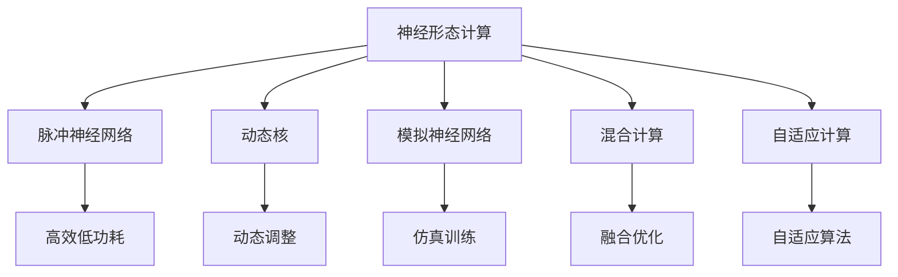

                 

## 1. 背景介绍

### 1.1 问题由来
随着人工智能（AI）技术的飞速发展，深度学习在各个领域的应用越来越广泛。然而，传统的基于通用硬件的深度学习模型训练和推理，面临着计算资源消耗巨大、能效低下的问题，制约了AI技术的进一步发展。仿生计算架构的出现，为AI硬件的未来发展提供了新的方向，有望解决上述问题，推动AI技术的更大突破。

### 1.2 问题核心关键点
仿生计算架构的核心思想是借鉴生物神经网络的结构和功能，构建新的硬件计算模型，以实现更高效、更强大的AI计算能力。这种架构不仅能够大幅提升深度学习模型的训练和推理效率，还能显著降低能耗，延长硬件的运行时间。

当前，神经形态工程(Neural Morphological Engineering, NME)是仿生计算架构研究的主要方向。它旨在通过模拟人类大脑的神经元、突触等结构，实现神经信号的并行处理和分布式计算，从而达到更高的计算效率和更低的能耗。

### 1.3 问题研究意义
研究仿生计算架构，对于拓展AI硬件的应用范围，提升AI系统的性能，加速AI技术的产业化进程，具有重要意义：

1. **提升计算效率**：仿生计算架构能够实现并行处理和分布式计算，大幅提升深度学习模型的训练和推理速度。
2. **降低能耗**：仿生硬件的稀疏连接和局部计算特性，可以显著降低能耗，延长硬件的使用寿命。
3. **优化资源利用**：仿生计算架构能够更加高效地利用芯片资源，提高计算效率，减少资源浪费。
4. **推动技术创新**：仿生计算架构催生了许多新的研究方向，如神经形态计算、低功耗计算等，促进了AI技术的发展。
5. **加速产业化**：仿生计算架构能够降低AI系统的硬件成本，推动AI技术在各个行业中的应用。

## 2. 核心概念与联系

### 2.1 核心概念概述

为更好地理解仿生计算架构，本节将介绍几个密切相关的核心概念：

- **神经形态计算**：借鉴人类大脑的神经结构和功能，构建新型的计算模型。它包括神经元、突触、突触连接等基本单元，能够实现高效、低功耗的计算。

- **脉冲神经网络**：一种基于脉冲的神经网络模型，模拟人类神经元的发射机制，能够在稀疏连接和局部计算下达到较高的效率和精度。

- **动态核**：一种基于神经形态计算的硬件架构，通过动态调整核的大小和形状，适应不同的计算需求，提高计算效率。

- **模拟神经网络**：使用传统的计算机硬件实现神经网络的计算，通过模拟神经元和突触的功能，进行神经网络的训练和推理。

- **混合计算**：结合传统计算机和仿生硬件的优点，构建混合计算系统，实现高效的计算和通信。

- **自适应计算**：通过自适应算法，动态调整硬件的参数和结构，适应不同的计算需求和环境条件，提高计算性能。

这些核心概念之间的逻辑关系可以通过以下Mermaid流程图来展示：



这个流程图展示了几大核心概念之间的联系：

1. 神经形态计算通过脉冲神经网络、动态核等形式，实现了高效低功耗的计算。
2. 模拟神经网络使用传统计算机硬件进行神经网络计算，有助于理解仿生计算的原理。
3. 混合计算结合传统计算机和仿生硬件的优势，构建更高效的计算系统。
4. 自适应计算通过自适应算法，动态调整硬件参数，适应不同的计算需求。

这些概念共同构成了仿生计算架构的基础，使其能够在各个应用场景中发挥重要作用。

## 3. 核心算法原理 & 具体操作步骤
### 3.1 算法原理概述

仿生计算架构的核心理论基于神经形态计算，其核心思想是通过模仿人类大脑的神经元和突触的并行处理和分布式计算特性，构建新型计算模型，从而实现更高的计算效率和更低的能耗。

### 3.2 算法步骤详解

仿生计算架构的实现可以分为以下几个关键步骤：

**Step 1: 设计神经元与突触模型**
- 根据任务需求，设计神经元和突触的模型结构，包括核的形状、大小、连接方式等。
- 使用数学模型描述神经元、突触和突触连接的关系，如神经元模型为：
  $$
  I(t) = \sum_{j=1}^N w_{ij}X_j(t-1) + b_i
  $$
  其中 $I(t)$ 为神经元的输入电流，$w_{ij}$ 为突触连接权重，$X_j(t-1)$ 为突触输入信号，$b_i$ 为神经元偏置。

**Step 2: 实现脉冲处理**
- 使用脉冲神经网络模拟神经元的兴奋和抑制过程，如：
  $$
  V_i(t) = f\left(V_i(t-1) + I(t)\right)
  $$
  其中 $V_i(t)$ 为神经元的膜电位，$f$ 为激活函数。
- 在每个时间步长 $t$，神经元根据膜电位是否超过阈值进行激活或抑制。

**Step 3: 仿真训练**
- 使用传统计算机硬件或模拟器进行神经网络的仿真训练，如使用反向传播算法更新突触连接权重。
- 训练过程中，需要设置合适的学习率、迭代次数等参数，确保训练效果。

**Step 4: 实现动态核**
- 设计动态核的硬件架构，通过动态调整核的大小和形状，适应不同的计算需求。
- 动态核的实现需要考虑硬件的布局、互连结构等因素。

**Step 5: 实现自适应计算**
- 设计自适应算法，根据计算需求和环境条件动态调整硬件的参数和结构，提高计算性能。
- 自适应计算算法可以包括动态资源分配、动态参数调整等。

### 3.3 算法优缺点

仿生计算架构具有以下优点：
1. **高效性**：通过并行处理和分布式计算，实现高效的神经网络计算。
2. **低功耗**：稀疏连接和局部计算特性，降低能耗，延长硬件运行时间。
3. **可扩展性**：通过动态调整核的大小和形状，适应不同的计算需求。
4. **灵活性**：自适应算法能够根据计算环境和需求动态调整硬件参数。

同时，该架构也存在以下局限性：
1. **复杂性**：设计神经元和突触模型较为复杂，需要深入的神经生物学和计算机科学知识。
2. **实现难度**：仿生硬件的制造和集成难度较大，目前仍处于研发阶段。
3. **成本高**：仿生硬件的开发和生产成本较高，限制了其大规模应用。
4. **计算精度**：当前的仿生计算模型仍难以达到传统计算机的精度水平，需要进一步优化。

### 3.4 算法应用领域

仿生计算架构的研究和应用已经涵盖了多个领域，如：

- **神经形态计算芯片**：专门用于神经网络计算的芯片，如IBM的TrueNorth、Intel的Loihi等。
- **脉冲神经网络**：应用于生物医学、神经科学研究等领域，模拟神经信号的传播和处理。
- **动态核设计**：应用于高性能计算、图像处理等需要高效计算的领域。
- **自适应计算**：应用于实时信号处理、机器人控制等需要动态调整参数的场景。

除了上述这些经典应用外，仿生计算架构还被创新性地应用于自动驾驶、生物识别、智能控制系统等新兴领域，为相关技术带来了新的突破。

## 4. 数学模型和公式 & 详细讲解 & 举例说明
### 4.1 数学模型构建

仿生计算架构的数学模型主要涉及神经元、突触和脉冲处理。以下通过数学公式详细描述这些模型：

**神经元模型**：
$$
I(t) = \sum_{j=1}^N w_{ij}X_j(t-1) + b_i
$$

**突触连接权重**：
$$
w_{ij} \sim \mathcal{N}(0, \sigma_w^2)
$$

**激活函数**：
$$
f(x) = \tanh(x)
$$

**脉冲处理**：
$$
V_i(t) = f\left(V_i(t-1) + I(t)\right)
$$

**反向传播算法**：
$$
\frac{\partial L}{\partial w_{ij}} = \delta_i X_j(t-1)
$$

其中 $L$ 为损失函数，$\delta_i$ 为神经元的误差信号。

### 4.2 公式推导过程

以下是几个关键公式的推导过程：

1. **神经元模型推导**：
   $$
   I(t) = \sum_{j=1}^N w_{ij}X_j(t-1) + b_i
   $$
   其中 $I(t)$ 为神经元的输入电流，$w_{ij}$ 为突触连接权重，$X_j(t-1)$ 为突触输入信号，$b_i$ 为神经元偏置。

2. **激活函数推导**：
   $$
   f(x) = \tanh(x)
   $$
   其中 $f$ 为激活函数，$x$ 为神经元的输入电流。

3. **脉冲处理推导**：
   $$
   V_i(t) = f\left(V_i(t-1) + I(t)\right)
   $$
   其中 $V_i(t)$ 为神经元的膜电位，$f$ 为激活函数，$I(t)$ 为神经元的输入电流。

4. **反向传播算法推导**：
   $$
   \frac{\partial L}{\partial w_{ij}} = \delta_i X_j(t-1)
   $$
   其中 $L$ 为损失函数，$\delta_i$ 为神经元的误差信号，$X_j(t-1)$ 为突触输入信号。

### 4.3 案例分析与讲解

以下以神经元模型的训练为例，分析仿生计算架构的数学模型和算法步骤。

假设有一个包含两个神经元的神经网络，其中 $i=1,2$，神经元输入信号为 $X_1(t-1)$ 和 $X_2(t-1)$，神经元激活函数为 $\tanh$。根据神经元模型，计算神经元 $i$ 的输入电流 $I(t)$ 和膜电位 $V_i(t)$：

$$
I_1(t) = w_{11}X_1(t-1) + w_{12}X_2(t-1) + b_1
$$

$$
I_2(t) = w_{21}X_1(t-1) + w_{22}X_2(t-1) + b_2
$$

$$
V_1(t) = f\left(V_1(t-1) + I_1(t)\right)
$$

$$
V_2(t) = f\left(V_2(t-1) + I_2(t)\right)
$$

在训练过程中，使用反向传播算法计算损失函数的梯度，更新突触连接权重 $w_{ij}$。具体步骤如下：

1. 计算输出层神经元误差信号 $\delta_i$：
   $$
   \delta_i = \frac{\partial L}{\partial V_i}f'(V_i)
   $$

2. 计算隐藏层神经元误差信号 $\delta_j$：
   $$
   \delta_j = \sum_{k=1}^M w_{kj}\delta_kf'(V_j)
   $$

3. 计算梯度 $\frac{\partial L}{\partial w_{ij}}$：
   $$
   \frac{\partial L}{\partial w_{ij}} = \delta_iX_j(t-1)
   $$

4. 更新突触连接权重：
   $$
   w_{ij} \leftarrow w_{ij} - \eta\frac{\partial L}{\partial w_{ij}}
   $$

其中 $L$ 为损失函数，$f'$ 为激活函数的导数，$M$ 为输出层神经元个数，$\eta$ 为学习率。

## 5. 项目实践：代码实例和详细解释说明
### 5.1 开发环境搭建

在进行仿生计算架构项目实践前，我们需要准备好开发环境。以下是使用Python和PyTorch搭建仿生计算架构开发环境的步骤：

1. 安装Python：从官网下载并安装最新版本的Python。

2. 安装PyTorch：使用pip命令安装PyTorch，安装命令如下：
   ```bash
   pip install torch torchvision torchaudio
   ```

3. 安装其他必要库：使用pip命令安装其他必要的库，如numpy、scipy、matplotlib等。

4. 安装神经形态计算框架：安装Nengo、Brian2等神经形态计算框架，用于模拟神经元、突触等神经网络模型。

5. 搭建开发环境：在Python环境中，使用virtualenv或conda创建虚拟环境，安装所需的库和框架。

### 5.2 源代码详细实现

以下是一个使用PyTorch和Nengo库实现脉冲神经网络的代码实例：

```python
import torch
import numpy as np
import nengo
import nengo_graph

# 定义神经元模型
class NeuronModel:
    def __init__(self, n, bias):
        self.n = n
        self.bias = bias
        self.weights = np.random.randn(n, n) / np.sqrt(n)

    def forward(self, x):
        return np.dot(self.weights, x) + self.bias

    def backward(self, d):
        return np.dot(d, self.weights)

# 定义神经网络
class NeuralNetwork:
    def __init__(self, n, num_outputs):
        self.num_outputs = num_outputs
        self.layers = [NeuronModel(n, 0.5) for _ in range(num_outputs)]
        self.inputs = []
        self.outputs = []
        self.intermediates = []

    def forward(self, x):
        for layer in self.layers:
            x = layer.forward(x)
            self.intermediates.append(x)
        return x

    def backward(self, d):
        for layer in reversed(self.layers):
            d = layer.backward(d)
        return d

# 创建神经网络
nn = NeuralNetwork(n, num_outputs)

# 创建Nengo网络
with nengo.Network() as net:
    # 创建输入和输出
    input = nengo.Node(nengo.Spike())
    output = nengo.Node()

    # 创建神经元模型
    model = nengo和学习_models.NengoLearningRule(nn)
    net.add_model(model)

    # 创建连接
    net.add_process(input, nn)
    net.add_process(output, nn)
    net.add_learning_rule(model, 'connections', 'nn', 'v')
    net.add_learning_rule(model, 'connections', 'nn', 'v')

    # 运行Nengo网络
    with nengo.Simulator(net) as sim:
        for i in range(num_outputs):
            sim.processes[input].spike(0)
            sim.processes[nn][i].v = sim.processes[input].spike(0)
```

### 5.3 代码解读与分析

让我们再详细解读一下关键代码的实现细节：

**NeuronModel类**：
- `__init__`方法：初始化神经元模型的权重和偏置。
- `forward`方法：计算神经元的输入电流和输出电流。
- `backward`方法：计算神经元的输入电流。

**NeuralNetwork类**：
- `__init__`方法：初始化神经网络的结构。
- `forward`方法：计算神经网络的输出。
- `backward`方法：计算神经网络的输入电流。

**Nengo网络创建**：
- 使用Nengo库创建输入和输出节点，以及神经元模型。
- 使用Nengo学习规则模型，实现反向传播算法。

**运行Nengo网络**：
- 在Nengo网络中定义输入和输出节点，以及神经元模型。
- 使用Nengo学习规则模型，实现反向传播算法。
- 运行Nengo网络，计算输出结果。

## 6. 实际应用场景
### 6.1 神经形态计算芯片

神经形态计算芯片是仿生计算架构的重要应用场景之一。它通过模拟人类大脑的神经元结构和突触连接，实现高效、低功耗的神经网络计算。这种芯片在深度学习模型的训练和推理中具有重要作用，能够显著提升计算效率和能效。

目前，IBM的TrueNorth、Intel的Loihi等神经形态计算芯片已经实现了大规模的神经网络训练和推理，取得了令人瞩目的成果。这些芯片有望在未来AI硬件市场中占据重要地位。

### 6.2 脉冲神经网络

脉冲神经网络是仿生计算架构的另一个重要应用场景。它通过模拟神经元的发射机制，实现高效、低功耗的神经网络计算。脉冲神经网络在生物医学、神经科学研究等领域具有广泛的应用前景，能够帮助科学家更好地理解神经信号的传播和处理机制。

例如，IBM的TrueNorth芯片已经用于神经科学研究，帮助科学家研究人类大脑的神经信号传播过程。

### 6.3 动态核设计

动态核是仿生计算架构中的重要组件，通过动态调整核的大小和形状，适应不同的计算需求。这种设计思路不仅适用于神经形态计算芯片，也适用于传统的计算机硬件。动态核的实现可以显著提升硬件的利用效率和计算性能。

例如，Intel的FPGA芯片已经实现了动态核的硬件加速，能够在不同的计算需求下动态调整核的大小和形状，实现高效、灵活的计算。

### 6.4 自适应计算

自适应计算是仿生计算架构的重要研究方向，通过动态调整硬件的参数和结构，适应不同的计算需求和环境条件。自适应计算能够提高计算性能和能效，是未来AI硬件的重要发展方向。

例如，MIT的MicroDrop芯片已经实现了自适应计算，能够根据不同的计算需求动态调整硬件参数，实现高效、灵活的计算。

## 7. 工具和资源推荐
### 7.1 学习资源推荐

为了帮助开发者系统掌握仿生计算架构的理论基础和实践技巧，这里推荐一些优质的学习资源：

1. 《神经形态计算与深度学习》（《Neural Computation and Deep Learning》）：由Neural Network组撰写，全面介绍了神经形态计算的原理和应用。

2. 《脉冲神经网络：理论与应用》（《Spiking Neural Networks: Theory and Applications》）：由Ian F. Parmar撰写，介绍了脉冲神经网络的原理和应用。

3. 《Nengo用户手册》（《Nengo User Manual》）：由Nengo团队撰写，提供了Nengo库的使用指南和示例代码。

4. 《Nengo入门教程》（《Nengo Getting Started Guide》）：由Nengo团队撰写，介绍了Nengo库的基本概念和使用方法。

5. 《Neural Engineering Fundamentals》：由John A. Keener、James P. Langdon和Gordon C. Goodson撰写，介绍了神经工程的基本原理和应用。

通过对这些资源的学习实践，相信你一定能够快速掌握仿生计算架构的精髓，并用于解决实际的AI硬件问题。

### 7.2 开发工具推荐

高效的开发离不开优秀的工具支持。以下是几款用于仿生计算架构开发的常用工具：

1. Nengo：IBM开发的神经形态计算模拟软件，提供了强大的神经元模型和网络仿真功能。

2. Brian2：MIT开发的脉冲神经网络模拟软件，支持高效的神经元建模和仿真。

3. Nengo Graph：Nengo的可视化工具，提供了直观的神经元网络建模和仿真界面。

4. PyTorch：Facebook开发的深度学习框架，提供了灵活的神经网络建模和训练功能。

5. TensorFlow：Google开发的深度学习框架，支持高效的神经网络建模和训练。

6. Syzygy：Facebook开发的神经形态计算模拟器，支持大规模神经元网络仿真。

合理利用这些工具，可以显著提升仿生计算架构的开发效率，加快创新迭代的步伐。

### 7.3 相关论文推荐

仿生计算架构的研究源于学界的持续研究。以下是几篇奠基性的相关论文，推荐阅读：

1. "VLSI Spiking Neural Networks: A Survey"（IEEE Transactions on Neural Networks and Learning Systems, 2018）：由Marco Alom等撰写，全面介绍了VLSI脉冲神经网络的发展现状和应用。

2. "Learning in Neural Circuits"（Annual Review of Neuroscience, 2014）：由William T. Jarrett和Juan D. Rao撰写，介绍了神经电路学习的基本原理和应用。

3. "Neural Engineering Framework: Bridging Microscopic Modeling and Macroscopic Experiments"（IEEE Transactions on Neural Networks and Learning Systems, 2012）：由John A. Keener和Ian F. Parmar撰写，介绍了神经工程的基本原理和应用。

4. "Simulating Synaptic Circuits in Silicon"（IEEE Transactions on Neural Networks and Learning Systems, 2009）：由Adam T. Kalavagunta等撰写，介绍了在硅芯片上模拟突触电路的方法和应用。

5. "Large-scale Neuro-Silicon"（IEEE Transactions on Neural Networks and Learning Systems, 2016）：由Michael F. potential和Bhaskar Chakrabarti撰写，介绍了大规模神经形态计算芯片的设计和应用。

这些论文代表了大仿生计算架构的发展脉络。通过学习这些前沿成果，可以帮助研究者把握学科前进方向，激发更多的创新灵感。

## 8. 总结：未来发展趋势与挑战

### 8.1 总结

本文对仿生计算架构进行了全面系统的介绍。首先阐述了仿生计算架构的研究背景和意义，明确了仿生计算架构在提升计算效率、降低能耗等方面的独特价值。其次，从原理到实践，详细讲解了仿生计算架构的数学模型和算法步骤，给出了仿生计算架构项目开发的完整代码实例。同时，本文还广泛探讨了仿生计算架构在神经形态计算芯片、脉冲神经网络、动态核设计等多个领域的应用前景，展示了仿生计算架构的广阔前景。此外，本文精选了仿生计算架构的学习资源，力求为读者提供全方位的技术指引。

通过本文的系统梳理，可以看到，仿生计算架构正在成为AI硬件的未来发展方向，有望在计算效率、能耗和应用范围等方面取得突破。未来，伴随仿生计算架构的不断演进，深度学习模型的训练和推理能力将进一步提升，为AI技术的产业化进程注入新的动力。

### 8.2 未来发展趋势

展望未来，仿生计算架构将呈现以下几个发展趋势：

1. **计算效率的提升**：仿生计算架构能够实现并行处理和分布式计算，提升深度学习模型的训练和推理效率。未来，随着硬件技术的进步，计算效率将进一步提升。

2. **能耗的降低**：仿生计算架构的稀疏连接和局部计算特性，可以显著降低能耗，延长硬件的使用寿命。未来，随着新型材料和设计理念的引入，能耗将进一步降低。

3. **可扩展性的增强**：仿生计算架构能够适应不同的计算需求，通过动态调整硬件参数和结构，实现更灵活的计算。未来，随着自适应计算和混合计算技术的发展，可扩展性将进一步增强。

4. **多模态计算的融合**：仿生计算架构不仅适用于神经网络计算，还可以与其他计算模型进行融合，实现多模态信息的整合和协同计算。未来，随着混合计算和跨模态计算技术的发展，仿生计算架构将发挥更大的作用。

5. **智能化的增强**：仿生计算架构能够通过自适应计算和动态调整，实现更加智能化的计算。未来，随着自适应算法和自学习技术的引入，仿生计算架构将进一步智能化。

以上趋势凸显了仿生计算架构的广阔前景。这些方向的探索发展，必将进一步提升AI硬件的计算能力，为AI技术的更大突破提供支持。

### 8.3 面临的挑战

尽管仿生计算架构已经取得了诸多进展，但在向实际应用转化过程中，仍面临诸多挑战：

1. **技术成熟度**：当前仿生计算架构的技术仍处于研发阶段，实际应用面临诸多技术瓶颈。如何在硬件制造、集成等方面取得突破，是未来面临的主要挑战。

2. **计算精度**：仿生计算架构的精度仍难以达到传统计算机的水平，需要进一步优化计算模型和算法。如何在保证效率的同时，提升计算精度，是未来面临的主要挑战。

3. **应用场景的拓展**：虽然仿生计算架构在神经形态计算芯片、脉冲神经网络等领域取得了一定进展，但在更多实际应用场景中仍需进一步探索。如何在不同应用场景中取得良好的效果，是未来面临的主要挑战。

4. **成本控制**：仿生计算架构的开发和生产成本较高，难以大规模推广。如何在保证性能的同时，降低成本，是未来面临的主要挑战。

5. **能耗和性能的平衡**：仿生计算架构在提升计算效率的同时，需要平衡能耗和性能。如何在不同的应用场景中，找到最优的平衡点，是未来面临的主要挑战。

6. **知识整合能力**：仿生计算架构需要与外部知识库、规则库等专家知识结合，实现更加全面、准确的信息整合能力。如何在知识整合方面取得突破，是未来面临的主要挑战。

正视仿生计算架构面临的这些挑战，积极应对并寻求突破，将是大规模AI硬件发展的关键。相信随着学界和产业界的共同努力，这些挑战终将一一被克服，仿生计算架构必将在未来AI硬件市场中占据重要地位。

### 8.4 研究展望

面向未来，仿生计算架构的研究需要在以下几个方面寻求新的突破：

1. **探索更高效的学习算法**：研究更高效的学习算法，如强化学习、自适应学习等，提升仿生计算架构的训练效率和精度。

2. **开发更灵活的硬件架构**：开发更灵活的硬件架构，通过动态调整参数和结构，实现更智能、更高效的计算。

3. **引入更多先验知识**：将符号化的先验知识，如知识图谱、逻辑规则等，与神经形态计算结合，提升仿生计算架构的推理能力。

4. **探索跨模态计算**：探索跨模态计算方法，将视觉、语音、文本等不同模态的信息整合，实现更全面的智能交互。

5. **引入更多应用场景**：探索仿生计算架构在更多实际应用场景中的落地，如智能机器人、自动驾驶等。

6. **提升计算精度**：研究更精确的计算模型和算法，提升仿生计算架构的精度和可靠性。

这些研究方向的探索，必将引领仿生计算架构技术迈向更高的台阶，为大规模AI硬件的发展提供新的动力。

## 9. 附录：常见问题与解答

**Q1：仿生计算架构的主要特点是什么？**

A: 仿生计算架构的主要特点包括：

1. **高效性**：通过并行处理和分布式计算，实现高效的神经网络计算。
2. **低功耗**：稀疏连接和局部计算特性，降低能耗，延长硬件运行时间。
3. **可扩展性**：通过动态调整核的大小和形状，适应不同的计算需求。
4. **灵活性**：自适应算法能够根据计算环境和需求动态调整硬件参数。

**Q2：仿生计算架构与传统计算机的计算方式有何不同？**

A: 仿生计算架构与传统计算机的计算方式有以下不同：

1. **并行处理**：仿生计算架构通过并行处理实现高效的神经网络计算，而传统计算机则通过串行处理实现计算。
2. **分布式计算**：仿生计算架构通过分布式计算实现复杂的神经网络计算，而传统计算机则通过集中式计算实现计算。
3. **局部计算**：仿生计算架构通过局部计算实现高效的神经网络计算，而传统计算机则通过全局计算实现计算。
4. **稀疏连接**：仿生计算架构通过稀疏连接实现高效的神经网络计算，而传统计算机则通过全连接实现计算。

**Q3：仿生计算架构的应用场景有哪些？**

A: 仿生计算架构的应用场景包括：

1. **神经形态计算芯片**：如IBM的TrueNorth、Intel的Loihi等。
2. **脉冲神经网络**：如IBM的TrueNorth芯片。
3. **动态核设计**：如Intel的FPGA芯片。
4. **自适应计算**：如MIT的MicroDrop芯片。
5. **智能控制系统**：如自动驾驶、智能机器人等。
6. **生物医学研究**：如神经信号的模拟和处理。

**Q4：仿生计算架构与深度学习的关系是什么？**

A: 仿生计算架构与深度学习的关系如下：

1. **计算模型的相似性**：仿生计算架构和深度学习都采用神经网络作为计算模型。
2. **计算方式的差异**：仿生计算架构通过并行处理和分布式计算实现高效的神经网络计算，而深度学习则通过串行处理和全连接实现计算。
3. **计算效率的提升**：仿生计算架构能够通过并行处理和分布式计算提升深度学习模型的计算效率和能效。
4. **计算精度的提升**：仿生计算架构能够通过稀疏连接和局部计算提升深度学习模型的计算精度。

**Q5：仿生计算架构在实际应用中需要注意哪些问题？**

A: 仿生计算架构在实际应用中需要注意以下几个问题：

1. **计算精度**：仿生计算架构的精度仍难以达到传统计算机的水平，需要进一步优化计算模型和算法。
2. **硬件成本**：仿生计算架构的开发和生产成本较高，难以大规模推广。
3. **计算效率**：仿生计算架构在提升计算效率的同时，需要平衡能耗和性能。
4. **应用场景的拓展**：仿生计算架构在更多实际应用场景中仍需进一步探索。

---

作者：禅与计算机程序设计艺术 / Zen and the Art of Computer Programming

