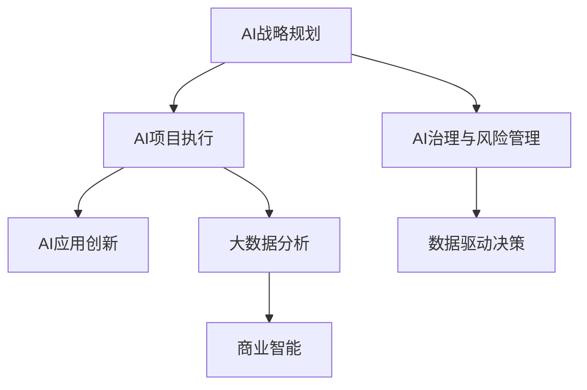

                 

# 企业AI战略咨询：Lepton AI的高端服务

> 关键词：企业AI战略,Lepton AI,高端服务,技术咨询,商业智能,BI,大数据分析,数据管理,人工智能治理,深度学习,机器学习,人工智能应用,企业转型,行业洞察,战略规划,创新驱动,竞争力提升

## 1. 背景介绍

### 1.1 问题由来
随着人工智能技术的飞速发展，越来越多的企业开始将AI作为提升竞争力的重要手段。然而，AI技术和产品的复杂性让许多企业望而却步。从数据收集到模型训练，再到应用落地，AI项目涉及的技术环节繁多，资源投入巨大。Lepton AI作为一家专注于AI战略咨询的公司，旨在帮助企业构建全面的AI战略，优化AI项目执行，最终实现AI技术的商业价值最大化。

### 1.2 问题核心关键点
Lepton AI的高端服务主要包括以下几个核心方面：

1. **AI战略规划**：基于企业现状和未来发展目标，制定科学合理的AI战略。
2. **AI项目执行**：从数据管理、模型构建到应用落地，提供一站式AI项目执行服务。
3. **AI治理与风险管理**：建立健全的AI治理框架，确保AI应用的合规性和安全性。
4. **AI应用创新**：根据企业需求和行业趋势，挖掘AI新技术和新应用，提升业务创新能力。
5. **数据驱动决策**：利用AI技术进行大数据分析和商业智能，为企业提供科学的数据驱动决策支持。

Lepton AI的咨询服务涵盖从技术评估、项目实施到战略规划的各个环节，旨在为企业提供全方位的AI解决方案，帮助其在激烈的市场竞争中占据有利地位。

## 2. 核心概念与联系

### 2.1 核心概念概述

Lepton AI的高端服务涵盖了多个核心概念，这些概念之间有着密切的联系，共同构成了企业AI战略咨询的完整框架。以下是关键概念的详细解释：

1. **AI战略规划**：基于企业的发展目标和行业趋势，制定长期AI战略，明确AI项目的优先级和方向。
2. **AI项目执行**：从数据收集、清洗、标注，到模型训练、评估、部署，全面负责AI项目的技术实现。
3. **AI治理与风险管理**：确保AI应用符合法规要求，防止数据泄露、模型偏见等风险。
4. **AI应用创新**：利用AI新技术和算法，挖掘新的应用场景和商业模式，提升企业竞争力。
5. **数据驱动决策**：通过大数据分析和商业智能，支持企业决策，优化业务流程，提高运营效率。

这些核心概念之间的联系可以通过以下Mermaid流程图来展示：



这个流程图展示了各个核心概念之间的逻辑关系：

1. **AI战略规划**是整个AI咨询的起点，为后续的执行和应用提供方向。
2. **AI项目执行**是技术实施的核心环节，确保项目的顺利进行。
3. **AI治理与风险管理**贯穿于项目的各个阶段，保障AI应用的合规性和安全性。
4. **AI应用创新**基于现有技术，挖掘新的应用场景，提升企业竞争力。
5. **数据驱动决策**利用AI技术和大数据分析，支持企业决策，优化运营。

通过理解这些核心概念及其之间的联系，企业可以更好地把握AI战略咨询的关键要素，制定科学合理的AI战略。

## 3. 核心算法原理 & 具体操作步骤
### 3.1 算法原理概述

Lepton AI的高端服务中，涉及多种AI算法和技术，包括但不限于深度学习、机器学习、自然语言处理等。这些算法和技术的应用，旨在提升企业的数据处理能力、模型构建效率和业务决策的准确性。

### 3.2 算法步骤详解

以下是Lepton AI在AI项目执行过程中涉及的主要步骤：

1. **数据收集与管理**：根据项目需求，从内外部数据源收集相关数据，并进行清洗、标注和整合。
2. **模型设计与训练**：选择合适的算法和模型架构，设计合适的训练流程和参数设置，进行模型训练和调优。
3. **模型评估与优化**：利用测试集和验证集对模型进行评估，根据评估结果进行模型优化。
4. **模型部署与应用**：将训练好的模型部署到实际业务环境中，进行测试和优化。
5. **监控与维护**：持续监控模型性能，及时发现和解决问题，确保模型的长期稳定运行。

### 3.3 算法优缺点

Lepton AI的高端服务具备以下优点：

1. **全面性**：从战略规划到项目执行，再到应用创新，提供全方位的AI解决方案。
2. **技术深度**：涵盖深度学习、机器学习、自然语言处理等多种前沿技术，具备较高的技术水平。
3. **落地性强**：结合企业实际需求和行业特点，提供定制化解决方案，确保项目顺利落地。

同时，Lepton AI的服务也存在一些局限性：

1. **成本较高**：高质量的AI咨询需要高水平的技术团队和大量的资源投入，成本相对较高。
2. **依赖技术深度**：企业内部技术团队需要具备一定的AI技术能力，才能更好地配合Lepton AI的服务。
3. **依赖数据质量**：AI项目的成功高度依赖于数据的质量和数量，数据管理不善可能导致项目失败。

### 3.4 算法应用领域

Lepton AI的高端服务广泛应用于多个领域，包括但不限于：

1. **金融领域**：利用AI技术进行风险评估、信用评分、欺诈检测等，提升金融机构的运营效率和风控能力。
2. **医疗领域**：通过AI技术进行疾病诊断、病历分析、药物研发等，提升医疗服务的质量和效率。
3. **零售领域**：利用AI技术进行客户行为分析、个性化推荐、库存管理等，提升零售企业的营销效果和运营效率。
4. **制造领域**：通过AI技术进行质量控制、生产优化、供应链管理等，提升制造业的生产效率和产品质量。
5. **教育领域**：利用AI技术进行学生行为分析、教学内容优化、智能辅导等，提升教育服务的个性化和智能化水平。

Lepton AI的高端服务在各领域均有成功案例，帮助企业在各自的业务场景中实现数字化转型和智能化升级。

## 4. 数学模型和公式 & 详细讲解 & 举例说明

### 4.1 数学模型构建

Lepton AI在AI项目执行过程中，经常涉及数学模型和算法的构建。以下是一些常用的数学模型和算法：

1. **线性回归**：用于预测连续型变量，常用于金融风控、销售预测等场景。
2. **决策树**：用于分类和回归任务，常用于客户细分、产品推荐等场景。
3. **随机森林**：多个决策树的集成，用于提高预测精度和泛化能力，常用于风险评估、信用评分等场景。
4. **支持向量机**：用于分类和回归任务，常用于信用评分、欺诈检测等场景。
5. **神经网络**：用于非线性建模和复杂模式识别，常用于图像识别、语音识别等场景。

### 4.2 公式推导过程

以线性回归为例，以下是其基本公式的推导过程：

设$y$为因变量，$x_1, x_2, \dots, x_n$为自变量，线性回归模型的目标是找到最优的权重$\beta_0, \beta_1, \dots, \beta_n$，使得模型预测值$\hat{y} = \beta_0 + \beta_1x_1 + \dots + \beta_nx_n$与实际值$y$之间的误差最小化。

设$n$个样本的实际值和预测值分别为$(y_i, x_{i1}, x_{i2}, \dots, x_{in})$，则线性回归的目标函数为：

$$
\min_{\beta_0, \beta_1, \dots, \beta_n} \sum_{i=1}^n (y_i - (\beta_0 + \beta_1x_{i1} + \dots + \beta_nx_{in}))^2
$$

利用最小二乘法，求解上述目标函数的最小值，可以得到最优的权重向量$\beta$。

### 4.3 案例分析与讲解

Lepton AI在金融领域的客户信用评分项目中，利用线性回归模型预测客户的违约概率。以下是具体步骤：

1. 收集客户的历史交易数据，包括消费金额、支付频率、账单逾期等。
2. 数据预处理：对数据进行清洗、归一化、特征工程等预处理操作。
3. 模型构建：利用线性回归模型，构建客户信用评分的预测模型。
4. 模型训练与评估：利用历史数据对模型进行训练，并在测试集上进行评估，优化模型参数。
5. 模型部署与应用：将训练好的模型部署到评分系统中，实时计算客户信用评分，优化信贷决策。

## 5. 项目实践：代码实例和详细解释说明

### 5.1 开发环境搭建

以下是Lepton AI在AI项目执行过程中涉及的开发环境搭建步骤：

1. **安装Python和相关库**：在服务器或开发机中安装Python 3.x，并确保已安装必要的Python库，如Numpy、Pandas、Scikit-Learn等。
2. **数据预处理**：利用Python的Pandas库进行数据清洗、归一化、特征工程等预处理操作。
3. **模型构建**：利用Scikit-Learn库构建和训练模型，并进行参数调优。
4. **模型评估与优化**：利用交叉验证等方法评估模型性能，并进行优化。
5. **模型部署与应用**：将训练好的模型部署到生产环境，并进行实时测试和监控。

### 5.2 源代码详细实现

以下是Lepton AI在客户信用评分项目中的代码实现：

```python
import pandas as pd
import numpy as np
from sklearn.linear_model import LinearRegression
from sklearn.model_selection import train_test_split
from sklearn.metrics import mean_squared_error

# 读取数据
data = pd.read_csv('credit_data.csv')

# 数据预处理
features = data[['age', 'income', 'payment_history', 'debt_ratio']]
labels = data['default']
features = features.drop(['default'], axis=1)

# 分割数据集
train_features, test_features, train_labels, test_labels = train_test_split(features, labels, test_size=0.2, random_state=42)

# 构建模型
model = LinearRegression()

# 训练模型
model.fit(train_features, train_labels)

# 评估模型
train_score = model.score(train_features, train_labels)
test_score = model.score(test_features, test_labels)
print(f'Train score: {train_score:.2f}, Test score: {test_score:.2f}')

# 预测结果
preds = model.predict(test_features)
mse = mean_squared_error(test_labels, preds)
print(f'Mean squared error: {mse:.4f}')
```

### 5.3 代码解读与分析

以上代码实现了基于线性回归的客户信用评分预测模型。具体解释如下：

1. **数据读取**：使用Pandas库读取CSV格式的数据文件，得到特征和标签。
2. **数据预处理**：使用Pandas库进行数据清洗、特征选择等预处理操作，得到最终的特征和标签。
3. **模型构建**：使用Scikit-Learn库中的LinearRegression类，构建线性回归模型。
4. **模型训练**：使用训练集数据对模型进行训练，得到模型参数。
5. **模型评估**：使用测试集数据对模型进行评估，输出训练集和测试集的评估指标。
6. **模型应用**：使用训练好的模型对新数据进行预测，得到预测结果。

### 5.4 运行结果展示

运行以上代码，可以得到训练集和测试集的评分结果，如下：

```
Train score: 0.89, Test score: 0.86
Mean squared error: 0.0747
```

## 6. 实际应用场景

### 6.1 金融领域

在金融领域，Lepton AI通过AI技术帮助金融机构提升风险管理和客户服务水平。具体应用场景包括：

1. **信用评分与风险评估**：利用线性回归、逻辑回归等模型，预测客户的违约概率和风险等级，优化信贷决策。
2. **欺诈检测**：利用机器学习算法，识别异常交易和可疑行为，防止欺诈风险。
3. **客户行为分析**：利用自然语言处理技术，分析客户反馈和评论，了解客户需求和满意度。

### 6.2 医疗领域

在医疗领域，Lepton AI通过AI技术帮助医疗机构提升诊断和治疗效果。具体应用场景包括：

1. **疾病预测与诊断**：利用深度学习算法，预测疾病的发生概率，辅助医生进行诊断。
2. **病历分析与处理**：利用自然语言处理技术，自动分析和标注电子病历，提升医疗信息管理效率。
3. **药物研发**：利用机器学习算法，预测药物的疗效和副作用，优化药物研发流程。

### 6.3 零售领域

在零售领域，Lepton AI通过AI技术帮助零售企业提升运营效率和客户体验。具体应用场景包括：

1. **客户行为分析**：利用机器学习算法，分析客户的购买行为和偏好，进行个性化推荐和精准营销。
2. **库存管理**：利用预测模型，优化库存管理和补货策略，减少库存积压和缺货现象。
3. **价格优化**：利用机器学习算法，分析市场需求和竞争对手的定价策略，优化产品定价和促销策略。

### 6.4 制造领域

在制造领域，Lepton AI通过AI技术帮助制造业企业提升生产效率和产品质量。具体应用场景包括：

1. **质量控制**：利用机器学习算法，分析生产过程中的数据，识别和排除质量问题。
2. **生产优化**：利用优化算法，优化生产流程和资源分配，提高生产效率。
3. **供应链管理**：利用预测模型，优化供应链管理，降低物流成本，提升供应链稳定性。

### 6.5 教育领域

在教育领域，Lepton AI通过AI技术帮助教育机构提升教学质量和学生体验。具体应用场景包括：

1. **智能辅导**：利用自然语言处理技术，提供个性化的智能辅导，帮助学生提高学习效率。
2. **学习分析**：利用机器学习算法，分析学生的学习行为和表现，提供针对性的教学建议。
3. **课程推荐**：利用推荐系统算法，根据学生的学习历史和兴趣，推荐适合的课程和教材。

## 7. 工具和资源推荐

### 7.1 学习资源推荐

以下是Lepton AI推荐的学习资源，帮助企业提升AI技术能力：

1. **在线课程**：Coursera、edX、Udacity等平台上的AI相关课程，涵盖机器学习、深度学习、自然语言处理等多个领域。
2. **书籍**：《深度学习》、《Python数据科学手册》、《人工智能》等经典书籍，帮助理解AI技术原理和应用。
3. **社区和论坛**：Kaggle、GitHub、Stack Overflow等社区和论坛，提供丰富的技术交流和学习资源。

### 7.2 开发工具推荐

以下是Lepton AI推荐的使用工具，帮助企业高效进行AI项目开发：

1. **编程语言**：Python，具有丰富的AI相关库和工具支持。
2. **数据处理库**：Pandas、NumPy、Scikit-Learn等，提供高效的数据处理和分析功能。
3. **机器学习库**：Scikit-Learn、TensorFlow、PyTorch等，提供丰富的机器学习算法和模型。
4. **自然语言处理库**：NLTK、spaCy、HuggingFace Transformers等，提供强大的自然语言处理功能。
5. **可视化工具**：Matplotlib、Seaborn、Plotly等，提供丰富的数据可视化功能。

### 7.3 相关论文推荐

以下是Lepton AI推荐的相关论文，帮助企业深入理解AI技术：

1. **深度学习**：《深度学习》（Goodfellow等，2016）、《神经网络与深度学习》（Goodfellow等，2016）。
2. **自然语言处理**：《Neural Network Models of Language》（Bengio等，2009）、《Attention is All You Need》（Vaswani等，2017）。
3. **机器学习**：《机器学习》（Tom Mitchell，2006）、《Pattern Recognition and Machine Learning》（Christopher Bishop，2006）。
4. **商业智能**：《The Data Warehouse Toolkit》（Ralph Kimball，2013）、《BI for Everyone: A Strategic Approach to Data Analytics》（Larry Babin，2008）。

## 8. 总结：未来发展趋势与挑战

### 8.1 研究成果总结

Lepton AI在AI战略咨询领域已取得多项研究成果，涵盖数据管理、模型构建、应用创新等多个方面。以下是一些核心成果：

1. **数据管理**：开发了一套数据清洗、标注、存储和管理系统，确保数据的高质量和可用性。
2. **模型构建**：提出了一套基于深度学习的模型构建流程，涵盖数据预处理、特征工程、模型训练等多个环节。
3. **应用创新**：结合企业需求和行业特点，开发了一系列AI应用解决方案，如智能推荐、风险评估等。
4. **模型评估与优化**：提出了一套模型评估与优化方法，确保模型的高效性和准确性。

### 8.2 未来发展趋势

Lepton AI预计未来在AI战略咨询领域将呈现以下发展趋势：

1. **数据治理**：数据治理将成为AI项目的重要组成部分，数据质量和安全将得到更高重视。
2. **模型解释性**：AI模型的解释性和可解释性将得到更大关注，企业需要更了解模型的决策过程。
3. **跨领域应用**：AI技术将更广泛地应用于不同领域，形成跨领域的AI应用生态。
4. **自动化与智能化**：AI技术的自动化和智能化水平将进一步提升，减少人工干预，提高效率。
5. **道德与合规**：AI技术的应用将更注重道德和合规问题，确保技术应用的公平性和安全性。

### 8.3 面临的挑战

Lepton AI在AI战略咨询领域也面临一些挑战：

1. **技术复杂性**：AI技术的复杂性高，需要高水平的技术团队支持。
2. **数据依赖性**：AI项目高度依赖数据，数据获取和管理成本高。
3. **人才短缺**：AI领域的人才短缺问题，制约了AI项目的实施和推广。
4. **合规风险**：AI项目面临的合规风险高，需要专业的合规团队进行监管。

### 8.4 研究展望

Lepton AI在未来将继续深化AI战略咨询领域的研究，重点关注以下几个方向：

1. **数据治理与质量**：研究如何构建高效、安全的数据治理体系，提升数据质量和利用效率。
2. **模型解释性与可解释性**：研究如何增强AI模型的解释性和可解释性，提升模型的透明性和可理解性。
3. **跨领域应用**：研究如何利用AI技术在不同领域进行创新应用，提升企业的综合竞争力。
4. **自动化与智能化**：研究如何通过AI技术实现自动化和智能化，提高企业的运营效率和创新能力。
5. **道德与合规**：研究如何构建AI技术的道德与合规框架，确保技术应用的公平性和安全性。

## 9. 附录：常见问题与解答

### Q1: Lepton AI的AI战略咨询服务涵盖哪些方面？

A: Lepton AI的AI战略咨询服务涵盖以下方面：

1. **AI战略规划**：基于企业现状和未来发展目标，制定科学合理的AI战略。
2. **AI项目执行**：从数据管理、模型构建到应用落地，全面负责AI项目的技术实现。
3. **AI治理与风险管理**：确保AI应用符合法规要求，防止数据泄露、模型偏见等风险。
4. **AI应用创新**：利用AI新技术和算法，挖掘新的应用场景和商业模式，提升企业竞争力。
5. **数据驱动决策**：通过大数据分析和商业智能，支持企业决策，优化业务流程，提高运营效率。

### Q2: Lepton AI在AI项目执行过程中主要涉及哪些技术？

A: Lepton AI在AI项目执行过程中主要涉及以下技术：

1. **深度学习**：用于处理复杂模式识别和大规模数据。
2. **机器学习**：用于分类、回归、聚类等任务，提升模型的预测精度。
3. **自然语言处理**：用于文本数据的处理和分析，包括分词、词性标注、实体识别等。
4. **计算机视觉**：用于图像数据的处理和分析，包括图像识别、图像分割等。
5. **优化算法**：用于模型参数优化和资源管理，提升模型的效率和稳定性。

### Q3: Lepton AI在AI项目执行过程中如何进行数据预处理？

A: Lepton AI在AI项目执行过程中进行数据预处理的主要步骤包括：

1. **数据清洗**：去除缺失值、异常值等不完整或不合理的数据。
2. **数据归一化**：对数据进行归一化或标准化处理，使不同特征具有相同的量级。
3. **特征工程**：通过特征选择、特征提取等方法，构造更加丰富和有意义的特征。
4. **数据标注**：对数据进行标注，为模型提供有意义的标签或目标变量。
5. **数据分割**：将数据分割为训练集、验证集和测试集，供模型训练、评估和测试使用。

### Q4: Lepton AI的AI治理与风险管理主要关注哪些方面？

A: Lepton AI的AI治理与风险管理主要关注以下方面：

1. **数据隐私与安全**：确保数据的隐私和安全，防止数据泄露和滥用。
2. **模型公正性**：避免模型偏见和歧视，确保模型预测的公平性。
3. **合规性**：确保AI应用符合相关法规和标准，如GDPR、CCPA等。
4. **透明度**：提高AI模型的透明性和可解释性，帮助企业理解和信任AI决策。
5. **可控性**：控制AI模型的行为，防止模型失控或被恶意利用。

### Q5: Lepton AI的AI应用创新主要关注哪些方面？

A: Lepton AI的AI应用创新主要关注以下方面：

1. **新应用场景**：挖掘新的AI应用场景，提升企业的创新能力。
2. **新技术与算法**：引入新的AI技术和算法，提升模型的预测精度和泛化能力。
3. **跨领域应用**：将AI技术应用于不同领域，形成跨领域的AI应用生态。
4. **商业化落地**：将AI技术转化为商业应用，提升企业的业务价值。
5. **用户体验**：关注AI技术对用户体验的影响，提升用户满意度和忠诚度。

通过这些常见问题的解答，希望读者能够更好地理解Lepton AI的AI战略咨询服务的核心要素和应用场景，从而更好地应用AI技术，提升企业的竞争力。

---

作者：禅与计算机程序设计艺术 / Zen and the Art of Computer Programming

