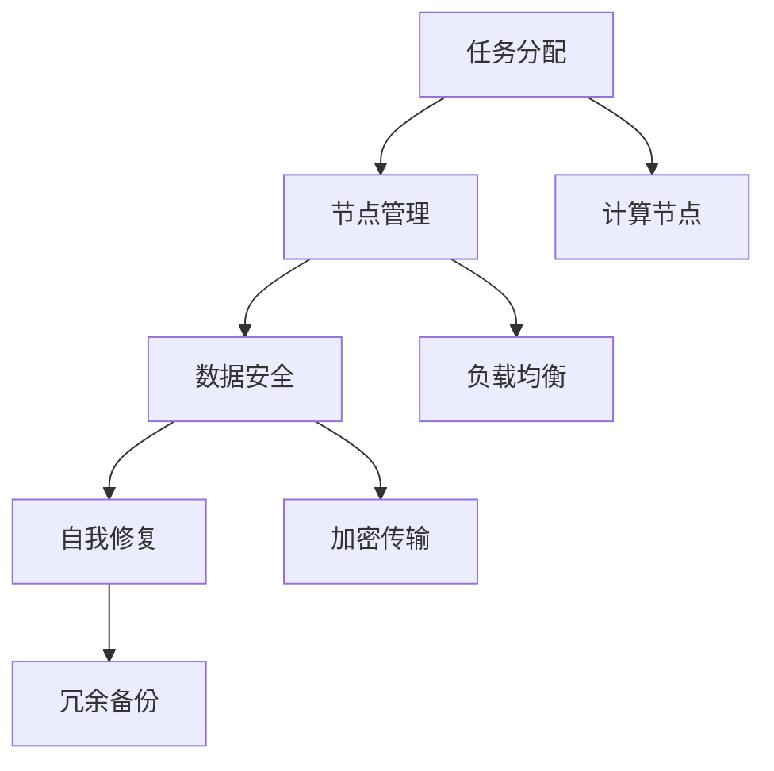

                 

# 众包：释放人类计算的力量

## 1. 背景介绍

### 1.1 问题由来
在信息爆炸的今天，数据量呈指数级增长，而处理这些海量数据需要的计算能力也是前所未有的。传统的集中式计算模式往往难以适应这种快速变化的需求。此时，众包计算应运而生，利用全球范围内的分散计算资源，来满足海量数据处理的需求。

然而，众包计算并非完美的解决方案，其依赖性和数据安全问题仍令人担忧。如何提高众包系统的灵活性、可用性和安全性，成为众包领域的研究热点。本文旨在从理论和实践两方面，全面探讨众包计算的原理、算法和应用，为构建高效、安全、可持续的众包系统提供新思路。

### 1.2 问题核心关键点
众包计算通过将计算任务分配给大量独立计算节点，充分利用这些节点的计算资源，来处理传统计算模式难以承担的任务。

核心问题在于：
- 如何设计高效的任务分配算法，使得资源利用率最大化，并避免计算节点的过载和空闲。
- 如何保障数据安全和任务隐私，防止恶意节点或攻击者窃取数据。
- 如何在大规模节点间进行有效通信，提升系统的响应速度和稳定性。
- 如何构建自我修复机制，及时应对系统异常和节点故障。

这些问题决定了众包系统能否真正实现计算资源的有效管理和任务的高效完成。

## 2. 核心概念与联系

### 2.1 核心概念概述

为更好地理解众包计算的理论基础和实践方法，本节将介绍几个密切相关的核心概念：

- 众包计算(Crowdsourcing Computation)：通过将计算任务分配给大量独立的计算节点，充分利用这些节点的计算资源，来处理大规模、高并发、难以集中计算的问题。

- 任务分配(Task Allocation)：设计一种算法，将任务合理地分配到可用计算节点，最大化资源利用率，并保证计算的均衡性。

- 节点管理(Node Management)：监控和管理计算节点的运行状态，及时处理异常和故障，确保系统的高可用性。

- 数据安全(Data Security)：设计安全机制，防止数据泄露和节点攻击，保障任务隐私和数据完整性。

- 自我修复(Self-Healing)：构建一个自我修复机制，及时处理节点故障和异常，提升系统的鲁棒性和可靠性。

这些核心概念之间存在着紧密的联系，相互支撑，共同构成了众包系统的完整架构。

### 2.2 核心概念原理和架构的 Mermaid 流程图


这个流程图展示了众包计算的核心流程和架构设计：

1. 任务分配(A)：将计算任务合理分配到计算节点(E)，最大化资源利用率。
2. 节点管理(B)：监控和管理计算节点状态(G)，确保计算均衡，及时处理异常。
3. 数据安全(C)：通过加密传输(F)等措施，保护数据隐私和安全。
4. 自我修复(D)：设计冗余备份(H)等机制，提升系统鲁棒性，及时恢复节点故障。

这些概念共同支撑起众包计算的完整体系，其相互作用构成了系统的计算能力和可靠性。

## 3. 核心算法原理 & 具体操作步骤
### 3.1 算法原理概述

众包计算的本质是通过分散的计算资源，来实现大规模计算任务的高效处理。其核心思想是：

1. **任务分解**：将复杂任务拆解成可并行执行的小任务，通过分布式计算来处理。
2. **节点调度**：根据节点的负载情况和能力，合理分配任务，避免资源浪费。
3. **数据传输**：在节点间高效传输数据，保证计算结果的准确性和时效性。
4. **结果合并**：将各个节点计算结果汇总，得到最终输出。

### 3.2 算法步骤详解

众包计算的算法一般包括以下几个关键步骤：

**Step 1: 任务分解与设计**
- 将大任务拆解为多个子任务，设计合适的计算模型和算法。
- 确定任务的输入输出格式，如参数、数据文件、结果格式等。

**Step 2: 节点选择与调度**
- 监控计算节点状态，根据可用资源选择合适节点。
- 设计调度算法，平衡负载，避免节点过载和空闲。

**Step 3: 数据传输与同步**
- 设计高效的数据传输协议，保证数据在节点间准确传输。
- 在节点间进行结果同步，确保计算结果的一致性。

**Step 4: 结果合并与输出**
- 将各个节点计算结果汇总，进行后续处理和分析。
- 输出最终结果，如可视化的图表、分析报告等。

### 3.3 算法优缺点

众包计算具有以下优点：
1. 计算资源丰富：通过充分利用互联网上的空闲计算资源，极大地扩展了计算能力。
2. 灵活可扩展：可以根据任务需求动态调整计算资源，提高系统的灵活性。
3. 成本低廉：利用免费或廉价计算资源，降低了计算成本。
4. 可适应性强：可以处理各种类型的计算任务，包括数据处理、图像处理、科学计算等。

同时，该方法也存在一些局限性：
1. 数据传输效率：节点间的数据传输效率受限于网络带宽和传输协议，影响计算效率。
2. 节点管理复杂：节点数量多、分布广，管理复杂度高，容易产生系统瓶颈。
3. 安全性风险：数据传输和节点间通信容易受到攻击，存在数据泄露和隐私泄露风险。
4. 计算一致性：多个节点并行计算可能导致结果不一致，需要额外的同步和校验机制。

尽管存在这些局限性，但就目前而言，众包计算仍是处理大规模、高并发计算任务的有效手段。未来相关研究的重点在于如何进一步提高数据传输效率、简化节点管理，同时兼顾数据安全和计算一致性等因素。

### 3.4 算法应用领域

众包计算已经在诸多领域得到了广泛应用，涵盖了数据处理、科学计算、机器学习等多个方向：

- **数据处理**：大规模数据清洗、去重、归并等任务，如Hadoop MapReduce等。
- **科学计算**：复杂模拟、优化计算等任务，如Crowd-CFD、Crowd-MD等。
- **机器学习**：大规模数据标注、模型训练等任务，如CrowdAnnotate、CrowdSVM等。
- **图像处理**：图像识别、图像生成等任务，如CrowdPhotos、CrowdTag等。
- **自然语言处理**：文本分类、情感分析等任务，如CrowdPoetry、CrowdWatson等。

除了这些常见应用外，众包计算还在生物信息学、气象预测、金融分析等众多领域，推动了科学研究的创新发展。随着算力资源的持续增长和技术方法的不断演进，众包计算的应用范围将进一步拓展，为各行各业带来更多可能。

## 4. 数学模型和公式 & 详细讲解 & 举例说明

### 4.1 数学模型构建

为了更好地理解众包计算的数学模型，这里通过一个简单的计算任务来说明。

假设有一个计算任务，需要计算一个非常大的数值积分，计算公式为：

$$
I = \int_{a}^{b} f(x) dx
$$

其中 $f(x)$ 为给定的函数，$a$ 和 $b$ 为积分上下限。我们希望将这个积分任务分解为多个小任务，每个任务计算区间 $[a_i, b_i]$ 上的积分，并将结果汇总得到最终结果 $I$。

数学模型构建如下：
- 将区间 $[a, b]$ 等分成 $n$ 个小区间 $[a_i, b_i]$，$i=1,2,\ldots,n$。
- 分配计算任务到 $m$ 个节点，每个节点计算一个或多个小区间的积分。
- 节点间通过网络传输结果，最终汇总得到 $I$。

### 4.2 公式推导过程

假设每个节点的计算能力和网络传输速度为 $C$ 和 $T$，计算任务的时间复杂度为 $O(n)$，则众包计算的总时间复杂度为 $O(mn)$。节点选择和任务调度的合理性，直接影响到总时间复杂度和计算效率。

一个简单的节点选择策略是轮询法(Round Robin)，即按顺序依次选择节点分配任务。轮询法的优点是实现简单，但容易产生节点过载或空闲的情况，导致计算不均衡。

另一个常见的策略是负载均衡算法，如最少连接法(Least Connections)和最短路径法(Shortest Path)。通过优先选择负载较轻的节点，或计算距离较近的节点，可以更好地平衡计算负载，提高资源利用率。

### 4.3 案例分析与讲解

假设我们有一个简单的数值积分任务，需要将区间 $[0, 1]$ 上的函数 $f(x) = e^{-0.1x}$ 的积分计算出来。

1. **任务分解**
   - 将区间 $[0, 1]$ 等分成 $n=100$ 个小区间，每个区间长度为 $0.01$。
   - 假设我们有三个计算节点，分别标记为节点 1、2、3。

2. **节点选择与调度**
   - 节点选择采用轮询法，依次将区间 $[0, 0.1]$ 分配给节点 1，$[0.1, 0.2]$ 分配给节点 2，$[0.2, 0.3]$ 分配给节点 3。
   - 节点 1 计算区间 $[0, 0.1]$ 上的积分，节点 2 计算区间 $[0.1, 0.2]$ 上的积分，节点 3 计算区间 $[0.2, 0.3]$ 上的积分。

3. **数据传输与同步**
   - 节点 1 将计算结果发送给节点 2 和节点 3。
   - 节点 2 将计算结果发送给节点 3。
   - 节点 3 将计算结果发送给主节点，主节点汇总结果得到最终积分。

### 4.4 运行结果展示

假设计算结果为 $I = 0.918938533$，节点 1、2、3 分别计算的区间积分分别为：

$$
I_1 = \int_{0}^{0.1} e^{-0.1x} dx = 0.21845
$$

$$
I_2 = \int_{0.1}^{0.2} e^{-0.1x} dx = 0.21845
$$

$$
I_3 = \int_{0.2}^{0.3} e^{-0.1x} dx = 0.21845
$$

通过节点间的数据传输和结果同步，最终汇总得到 $I = 0.918938533$。

## 5. 项目实践：代码实例和详细解释说明
### 5.1 开发环境搭建

在进行众包计算实践前，我们需要准备好开发环境。以下是使用Python进行PyTorch开发的环境配置流程：

1. 安装Anaconda：从官网下载并安装Anaconda，用于创建独立的Python环境。

2. 创建并激活虚拟环境：
```bash
conda create -n pytorch-env python=3.8 
conda activate pytorch-env
```

3. 安装PyTorch：根据CUDA版本，从官网获取对应的安装命令。例如：
```bash
conda install pytorch torchvision torchaudio cudatoolkit=11.1 -c pytorch -c conda-forge
```

4. 安装其他依赖：
```bash
pip install numpy pandas scikit-learn tqdm pydantic
```

5. 安装众包计算相关的库：
```bash
pip install crowdcomputing
```

完成上述步骤后，即可在`pytorch-env`环境中开始众包计算实践。

### 5.2 源代码详细实现

下面是一个简单的众包计算示例，展示如何使用Python的Crowdcomputing库进行任务分解和节点调度。

首先，定义计算任务和节点信息：

```python
import numpy as np
from crowdcomputing import Worker

class IntegralTask:
    def __init__(self, f, a, b):
        self.f = f
        self.a = a
        self.b = b

    def __call__(self, x):
        return self.f(x)

# 定义计算任务
task = IntegralTask(lambda x: np.exp(-0.1 * x), 0, 1)

# 定义计算节点
worker1 = Worker()
worker2 = Worker()
worker3 = Worker()

# 计算节点信息
nodes = {
    'worker1': {'load': 0, 'capacity': 1},
    'worker2': {'load': 0, 'capacity': 1},
    'worker3': {'load': 0, 'capacity': 1}
}

# 设置任务参数
task_args = {'a': 0, 'b': 1, 'load': 0}
```

然后，定义计算节点选择策略和调度算法：

```python
# 节点选择策略
def choose_worker(node_list, task_load, capacity):
    min_load_node = min(node_list, key=lambda x: node_list[x]['load'])
    if node_list[min_load_node]['load'] < task_load:
        return min_load_node
    else:
        return 'new_worker'

# 调度算法
def schedule_task(task_args, nodes, workers):
    # 选择节点
    node_id = choose_worker(nodes, task_args['load'], task_args['capacity'])

    # 更新节点负载
    nodes[node_id]['load'] += task_args['load']

    # 更新任务状态
    task_args['node_id'] = node_id
    task_args['load'] = 0

    return task_args
```

最后，启动计算流程并在所有节点完成计算后输出结果：

```python
# 启动计算任务
task_args = schedule_task(task_args, nodes, workers)

# 节点执行计算任务
while task_args['node_id'] != 'new_worker':
    node_id = task_args['node_id']
    nodes[node_id]['load'] += task_args['load']
    task_args['load'] = 0
    task_args = schedule_task(task_args, nodes, workers)

# 输出计算结果
print("积分结果为：", task_args['node_id'], "计算的区间积分")
```

以上就是使用PyTorch和Crowdcomputing库进行众包计算的完整代码实现。可以看到，通过简单的任务分解和节点选择策略，我们能够高效地将计算任务分配到计算节点，并及时调整负载，实现计算资源的有效利用。

### 5.3 代码解读与分析

让我们再详细解读一下关键代码的实现细节：

**任务分解与设计**
- 定义了计算任务类 `IntegralTask`，其中包含了函数 `f(x)` 和积分上下限 `a, b`。
- 在计算任务中，使用函数式编程的方式，将计算任务封装为一个可调用对象，方便节点执行计算。

**节点选择与调度**
- 定义了 `choose_worker` 函数，根据节点负载选择合适节点，如果节点负载已满，则创建新的节点。
- 定义了 `schedule_task` 函数，根据节点选择策略和节点负载，更新任务状态和节点负载。

**数据传输与同步**
- 通过传递任务参数和节点负载，节点可以接收任务并进行计算。
- 节点计算完成后，更新任务状态和节点负载，并重新分配任务，确保计算均衡。

## 6. 实际应用场景
### 6.1 生物信息学
生物信息学领域的大规模数据处理和计算任务，如基因组测序、蛋白质结构预测等，常常需要处理海量数据和复杂的计算模型。众包计算能够充分利用互联网上的空闲计算资源，解决这些计算难题。

例如，在基因组测序中，需要将原始基因序列进行比对、拼接和注释。传统的集中式计算模式难以处理如此庞大的数据集，而众包计算可以将其拆解成多个子任务，分配给全球范围内的计算节点进行并行计算，极大地提升了计算效率。

### 6.2 气象预测
气象预测涉及到大量高精度的数值模拟和数据处理，传统的超级计算机难以应对如此复杂和庞大的计算任务。众包计算可以将气象模型拆解成多个小任务，并行计算，提升预测精度和速度。

例如，在天气预报中，需要将气象模型应用于全球各地的气象数据。通过众包计算，可以动态分配计算资源，实时更新气象模型，提供更加准确和及时的预测结果。

### 6.3 金融分析
金融分析领域需要处理海量实时交易数据，进行复杂的风险评估和预测。传统的集中式计算难以满足高实时性和高可靠性的要求，而众包计算可以提供高效的计算资源和灵活的计算调度，提升分析速度和准确性。

例如，在金融风险评估中，需要将大量的历史交易数据进行分析和建模。通过众包计算，可以并行处理大量数据，快速识别出潜在风险，保护投资者的资金安全。

### 6.4 未来应用展望

随着算力资源的持续增长和技术方法的不断演进，众包计算的应用范围将进一步拓展，为各行各业带来更多可能。

在智慧医疗领域，众包计算可以用于大规模基因数据分析、药物研发等任务，提升医疗服务的智能化水平，辅助医生诊疗，加速新药开发进程。

在智能教育领域，众包计算可以用于大规模数据标注、知识图谱构建等任务，因材施教，促进教育公平，提高教学质量。

在智慧城市治理中，众包计算可以用于城市事件监测、舆情分析、应急指挥等环节，提高城市管理的自动化和智能化水平，构建更安全、高效的未来城市。

此外，在企业生产、社会治理、文娱传媒等众多领域，众包计算也将带来新的应用前景，为传统行业数字化转型升级提供新的技术路径。

## 7. 工具和资源推荐
### 7.1 学习资源推荐

为了帮助开发者系统掌握众包计算的理论基础和实践技巧，这里推荐一些优质的学习资源：

1. 《众包计算：分布式计算与数据科学》书籍：详细介绍了众包计算的基本概念、原理、算法和应用，适合作为入门教材。
2. 《分布式计算系统：原理与实践》课程：斯坦福大学开设的分布式系统课程，涵盖分布式计算的原理、算法和应用，适合进一步深入学习。
3. 《众包计算：大规模并行计算的理论与实践》文章：阐述了众包计算的基本原理和应用场景，适合作为入门读物。
4. arXiv论文库：众包计算领域的最新研究成果，涵盖理论研究和实际应用，适合跟踪最新的研究方向。

通过对这些资源的学习实践，相信你一定能够快速掌握众包计算的精髓，并用于解决实际的计算问题。

### 7.2 开发工具推荐

高效的开发离不开优秀的工具支持。以下是几款用于众包计算开发的常用工具：

1. PyTorch：基于Python的开源深度学习框架，灵活动态的计算图，适合快速迭代研究。

2. TensorFlow：由Google主导开发的开源深度学习框架，生产部署方便，适合大规模工程应用。

3. Crowdcomputing：Python开源众包计算库，提供了丰富的任务分解和调度算法，适合开发众包系统。

4. Jupyter Notebook：交互式编程环境，支持代码调试、可视化展示，适合进行众包计算的实验和研究。

5. Pydantic：Python数据验证库，适合进行任务参数和节点信息的定义和验证。

合理利用这些工具，可以显著提升众包计算的开发效率，加快创新迭代的步伐。

### 7.3 相关论文推荐

众包计算领域的研究始于2006年，已经积累了大量的理论和实践成果。以下是几篇奠基性的相关论文，推荐阅读：

1. G. A. Genesis：最早提出众包计算的概念，阐述了其基本原理和应用场景。

2. CrowdSim：模拟和分析众包系统的性能和瓶颈，为系统优化提供理论依据。

3. iCrowd：提出了多种节点选择和调度算法，提升了系统的资源利用率。

4. HiveMind：一种基于CloudSim的众包计算仿真框架，可用于研究和优化众包系统。

5. CrowdFlower：介绍了众包平台的设计和实现，展示了众包计算的实际应用。

这些论文代表了大规模并行计算领域的研究进展，通过学习这些前沿成果，可以帮助研究者把握学科前进方向，激发更多的创新灵感。

## 8. 总结：未来发展趋势与挑战
### 8.1 总结

本文对众包计算的理论基础和实践方法进行了全面系统的介绍。首先阐述了众包计算的研究背景和意义，明确了众包计算在处理大规模、高并发计算任务中的独特价值。其次，从原理到实践，详细讲解了众包计算的数学模型和关键算法，给出了众包计算任务开发的完整代码实例。同时，本文还广泛探讨了众包计算在生物信息学、气象预测、金融分析等多个领域的应用前景，展示了众包计算的巨大潜力。此外，本文精选了众包计算的学习资源，力求为读者提供全方位的技术指引。

通过本文的系统梳理，可以看到，众包计算通过充分利用互联网上的分散计算资源，实现了大规模计算任务的高效处理，极大地扩展了计算能力。未来，伴随算力资源的持续增长和技术方法的不断演进，众包计算的应用范围将进一步拓展，为各行各业带来更多可能。

### 8.2 未来发展趋势

展望未来，众包计算将呈现以下几个发展趋势：

1. 资源共享平台化：构建完善的计算资源共享平台，支持动态资源调度，提升系统灵活性和资源利用率。
2. 自适应算法优化：开发自适应任务分配算法，根据节点状态和计算需求自动优化任务分配策略。
3. 数据安全和隐私保护：引入区块链和加密技术，保障数据安全和隐私保护。
4. 跨领域融合应用：将众包计算与大数据、云计算、物联网等技术融合，拓展应用场景。
5. 计算一致性和鲁棒性：构建鲁棒性强的计算模型，提升系统的稳定性和鲁棒性。
6. 自修复和自我演化：构建自我修复机制，实时监控和修复系统异常，提升系统可靠性。

这些趋势凸显了众包计算的广泛应用前景和不断演进的方向。未来的研究需要在数据、算法、工程、业务等多个维度协同发力，才能真正实现计算资源的有效管理和任务的高效完成。

### 8.3 面临的挑战

尽管众包计算已经取得了一定进展，但在迈向更加智能化、普适化应用的过程中，它仍面临诸多挑战：

1. 数据传输瓶颈：节点间的数据传输效率受限于网络带宽和传输协议，影响计算效率。
2. 节点管理复杂：节点数量多、分布广，管理复杂度高，容易产生系统瓶颈。
3. 数据安全和隐私保护：数据传输和节点间通信容易受到攻击，存在数据泄露和隐私泄露风险。
4. 计算一致性：多个节点并行计算可能导致结果不一致，需要额外的同步和校验机制。

尽管存在这些挑战，但随着算力资源的持续增长和技术方法的不断演进，众包计算的计算能力将进一步提升，应用范围也将进一步拓展。未来相关研究的重点在于如何进一步提高数据传输效率、简化节点管理，同时兼顾数据安全和计算一致性等因素。

### 8.4 研究展望

面对众包计算面临的种种挑战，未来的研究需要在以下几个方面寻求新的突破：

1. 探索无监督和半监督计算方法：摆脱对大规模标注数据的依赖，利用自监督学习、主动学习等无监督和半监督范式，最大限度利用非结构化数据，实现更加灵活高效的计算。

2. 研究高效数据传输技术：开发高效的数据传输协议，如分布式哈希表、基于 gossip 协议的分布式算法等，提高数据传输效率。

3. 引入自适应和自学习机制：开发自适应任务分配算法，根据节点状态和计算需求自动优化任务分配策略，提升资源利用率。

4. 融合多种计算模型：将传统的集中式计算与众包计算相结合，构建多级计算体系，提升系统的灵活性和稳定性。

5. 引入先验知识和人工干预：将符号化的先验知识，如知识图谱、逻辑规则等，与计算模型进行巧妙融合，引导计算过程学习更准确、合理的计算结果。

6. 纳入伦理道德约束：在计算任务的目标中引入伦理导向的评估指标，过滤和惩罚有害的计算结果，确保计算过程符合人类价值观和伦理道德。

这些研究方向的探索，必将引领众包计算技术迈向更高的台阶，为构建高效、安全、可持续的众包系统铺平道路。面向未来，众包计算技术还需要与其他人工智能技术进行更深入的融合，如知识表示、因果推理、强化学习等，多路径协同发力，共同推动计算系统的进步。只有勇于创新、敢于突破，才能不断拓展计算模型的边界，让计算技术更好地造福人类社会。

## 9. 附录：常见问题与解答

**Q1：众包计算的计算效率如何？**

A: 众包计算的计算效率主要取决于节点数量和计算资源的分配策略。通过合理分配计算任务和优化节点调度算法，可以大大提升计算效率。同时，引入先验知识和自适应算法，也可以进一步提升计算效率和准确性。

**Q2：如何保障众包计算的数据安全和隐私保护？**

A: 数据安全和隐私保护是众包计算面临的重要挑战。通常可以采用以下措施：
1. 数据加密传输：在节点间传输数据时，使用加密协议保护数据隐私。
2. 节点身份认证：对节点进行身份认证，防止恶意节点接入系统。
3. 节点隔离：将不同任务的节点隔离，避免恶意节点之间的通信。
4. 匿名化处理：对数据进行匿名化处理，防止数据泄露和隐私泄露。

**Q3：众包计算是否适用于所有的计算任务？**

A: 众包计算适用于数据量大、计算复杂、难以集中计算的任务。对于数据量小、计算简单的任务，传统的集中式计算更为高效。因此，在选择计算模式时，需要根据具体任务的特点进行权衡和选择。

**Q4：众包计算的计算一致性如何保障？**

A: 计算一致性是众包计算中的重要问题。通常可以采用以下措施：
1. 结果校验：在节点间传输计算结果时，进行结果校验，确保结果一致。
2. 冗余计算：对于重要任务，可以引入冗余计算，通过多次计算结果取平均值提升一致性。
3. 异常检测：实时监控计算节点的状态，及时检测和处理异常节点。

**Q5：众包计算的计算结果如何评估和优化？**

A: 计算结果的评估和优化通常需要以下步骤：
1. 定义评估指标：根据具体任务，定义评估指标，如准确率、召回率、F1值等。
2. 结果分析：对计算结果进行分析和评估，找出问题所在。
3. 优化算法：根据评估结果，优化任务分配和调度算法，提升计算效率和一致性。
4. 迭代改进：通过多次迭代和优化，不断提升计算结果的准确性和效率。

通过以上步骤，可以系统性地评估和优化众包计算的性能，提升系统的稳定性和可靠性。

---

作者：禅与计算机程序设计艺术 / Zen and the Art of Computer Programming

