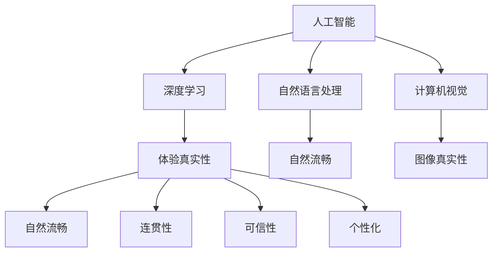

                 

# 体验的真实性：AI时代的authenticity追求

> 关键词：人工智能，真实性，authenticity，交互体验，深度学习，自然语言处理，计算机视觉

## 1. 背景介绍

### 1.1 问题由来
随着人工智能技术的迅速发展，人类社会的各个方面都正逐步被AI所渗透。从自动驾驶到机器人助手，从个性化推荐系统到智能客服，AI正试图全面融入人类生活，提供前所未有的便捷和高效。然而，伴随着技术进步的不仅仅是功能的增强，更有对体验真实性的追求。在AI的诸多应用场景中，体验的真实性正逐渐成为一个不可或缺的重要指标。

### 1.2 问题核心关键点
在AI领域，体验的真实性常常被理解为模型生成的结果是否与人类预期相符，是否具备自然流畅、真实可信的交互表现。这一概念不仅关系到用户体验的优劣，更是衡量AI技术成熟度的重要标准。具体来说，体验的真实性涉及以下几个核心关键点：

- **自然性**：AI系统生成的内容是否能够自然流畅，是否能够与人类交互风格相匹配。
- **连贯性**：AI系统在不同情境下是否能够保持一致的行为逻辑，是否具备良好的上下文理解能力。
- **可信性**：AI系统生成的信息是否准确可靠，是否能够根据上下文动态调整输出内容。
- **个性化**：AI系统能否根据用户的偏好、历史行为等个性化因素，提供量身定制的服务。

### 1.3 问题研究意义
在AI时代，追求体验的真实性具有重要意义：

1. **提升用户体验**：真实自然的交互体验能够有效提升用户满意度，增强用户的信任和粘性。
2. **增强系统可靠性**：真实性强的AI系统能够更好地应对突发情况，提供稳定可靠的服务。
3. **推动技术进步**：体验的真实性指标驱动AI技术的不断优化和创新，促进人工智能的快速发展。
4. **促进产业升级**：真实性强的AI应用能够更好地适配各行业实际需求，推动产业数字化转型。
5. **满足伦理需求**：追求体验的真实性有助于避免AI系统的偏见和歧视，保障技术应用的公正性和透明性。

## 2. 核心概念与联系

### 2.1 核心概念概述

在探讨AI时代体验的真实性时，需要理解以下几个核心概念：

- **人工智能**：一种能够模拟人类智能过程的技术，包括感知、理解、推理和学习能力。
- **体验真实性**：AI系统生成的内容与人类期望相符，具备自然流畅、真实可信的交互表现。
- **深度学习**：一种基于人工神经网络的机器学习方法，通过多层非线性变换捕捉复杂模式。
- **自然语言处理**：研究如何让计算机理解和生成自然语言的技术。
- **计算机视觉**：研究如何让计算机识别、理解和生成图像和视频的技术。

这些概念之间的逻辑关系可以通过以下Mermaid流程图来展示：



这个流程图展示了几大核心概念及其之间的关系：

1. 人工智能通过深度学习、自然语言处理和计算机视觉等技术手段，实现感知、理解、推理和学习。
2. 深度学习是人工智能的核心技术之一，通过多层非线性变换捕捉数据模式。
3. 自然语言处理和计算机视觉分别关注语言和图像数据的理解和生成，是实现体验真实性的重要手段。
4. 体验真实性关注自然流畅、连贯性、可信性和个性化等多个维度，是AI系统的最终目标。

## 3. 核心算法原理 & 具体操作步骤
### 3.1 算法原理概述

体验的真实性追求主要依赖于人工智能系统的深度学习能力和上下文理解能力。以下将详细探讨如何通过深度学习模型实现体验的真实性。

### 3.2 算法步骤详解

实现体验的真实性主要包括以下几个关键步骤：

**Step 1: 数据准备**
- 收集大量真实数据，涵盖各种情境和语境，确保数据的自然性和多样性。
- 清洗和标注数据，确保标注的准确性和一致性。
- 将数据划分为训练集、验证集和测试集，供模型训练和评估使用。

**Step 2: 模型选择**
- 根据任务特点选择合适的深度学习模型，如Transformer、RNN、GAN等。
- 根据模型需求，配置相应的超参数，如学习率、批大小、迭代轮数等。

**Step 3: 模型训练**
- 使用收集的数据集对模型进行训练，通过反向传播算法更新模型参数。
- 应用正则化技术，如L2正则、Dropout、Early Stopping等，防止过拟合。
- 引入对抗训练，通过对抗样本提高模型鲁棒性。

**Step 4: 模型评估**
- 在测试集上评估模型的性能，通过各类指标（如BLEU、ROUGE、F1-Score等）衡量模型输出是否与真实数据匹配。
- 分析模型的弱点和优势，通过反馈机制进一步优化模型。

**Step 5: 模型部署**
- 将优化后的模型部署到实际应用场景中，提供稳定的用户体验。
- 持续收集用户反馈，根据用户需求动态调整模型参数，进一步提升体验真实性。

### 3.3 算法优缺点

深度学习模型在追求体验的真实性方面具有以下优点：

1. **自适应能力强**：深度学习模型可以通过大量数据自适应学习，捕捉复杂模式，生成逼近真实的数据。
2. **泛化能力强**：深度学习模型通常具有较强的泛化能力，能够在新的情境下表现良好。
3. **可解释性强**：深度学习模型的内部机制可以通过可视化技术进行解释，有助于理解模型的行为逻辑。
4. **集成能力强**：深度学习模型可以通过集成技术提高性能，如Bagging、Boosting等。

然而，深度学习模型也存在一些缺点：

1. **计算资源需求高**：深度学习模型通常需要大量的计算资源进行训练和推理，难以在资源受限的环境下部署。
2. **黑盒性质**：深度学习模型通常被视为"黑盒"，难以解释其内部决策过程，存在一定的不可解释性。
3. **数据依赖性强**：深度学习模型的性能很大程度上依赖于训练数据的质量和多样性，数据偏差可能导致模型性能下降。
4. **训练复杂度高**：深度学习模型的训练过程复杂，需要大量时间和经验调参，难以快速迭代优化。

### 3.4 算法应用领域

追求体验的真实性在AI的多个应用领域均有重要应用，包括但不限于以下几个方面：

- **智能客服**：通过深度学习模型，智能客服系统能够提供自然流畅、真实可信的对话体验，满足用户需求。
- **推荐系统**：推荐系统通过深度学习模型分析用户行为和偏好，提供个性化推荐，提升用户体验。
- **医疗诊断**：深度学习模型在医学影像分析、病理诊断等领域，能够提供真实可靠的辅助决策支持。
- **虚拟现实**：通过深度学习生成逼真的虚拟环境，提升用户的沉浸感和体验真实性。
- **智能交通**：智能交通系统通过深度学习模型进行交通预测和优化，提供安全可靠的交通服务。

## 4. 数学模型和公式 & 详细讲解  
### 4.1 数学模型构建

为了更严格地描述深度学习模型在追求体验真实性方面的数学原理，本节将使用数学语言对模型进行详细构建。

假设深度学习模型 $M_{\theta}$ 的输入为 $x \in \mathcal{X}$，输出为 $y \in \mathcal{Y}$，其中 $\mathcal{X}$ 和 $\mathcal{Y}$ 分别为输入空间和输出空间，$\theta$ 为模型参数。模型的训练目标是通过最小化损失函数 $\mathcal{L}(\theta)$ 来优化模型参数，以生成逼近真实的输出 $y$。

常见的损失函数包括均方误差损失、交叉熵损失等。这里以交叉熵损失为例进行详细推导：

$$
\mathcal{L}(\theta) = -\frac{1}{N} \sum_{i=1}^N \log p(y_i|x_i)
$$

其中 $p(y_i|x_i)$ 为模型在输入 $x_i$ 下生成输出 $y_i$ 的概率分布。

### 4.2 公式推导过程

在深度学习模型中，通常使用梯度下降等优化算法来求解损失函数的最小化问题。具体来说，模型参数 $\theta$ 的更新公式为：

$$
\theta \leftarrow \theta - \eta \nabla_{\theta}\mathcal{L}(\theta)
$$

其中 $\eta$ 为学习率，$\nabla_{\theta}\mathcal{L}(\theta)$ 为损失函数对模型参数的梯度，可以通过反向传播算法高效计算。

在实际应用中，模型的输入 $x$ 通常为向量形式，表示为 $x \in \mathbb{R}^d$。模型输出的概率分布 $p(y_i|x_i)$ 可以通过多层神经网络进行计算，具体推导过程如下：

$$
p(y_i|x_i) = \sigma(\text{softmax}(f_{\theta}(x_i)))
$$

其中 $\sigma$ 为激活函数，$f_{\theta}(x_i)$ 为神经网络的前向传播过程，$\text{softmax}$ 函数将输出转换为概率分布。

### 4.3 案例分析与讲解

以智能客服系统为例，分析如何通过深度学习模型提升体验的真实性。

假设智能客服系统的输入为用户的自然语言文本 $x$，输出为机器生成的回复 $y$。通过收集大量真实对话数据，训练深度学习模型 $M_{\theta}$，使其能够生成逼近真实的回复。训练过程中，使用交叉熵损失函数，最小化模型生成的回复与真实回复之间的差异。训练完成后，在测试集上评估模型的性能，通过BLEU等指标衡量回复的自然性和连贯性。通过持续优化，不断提升模型的体验真实性。

## 5. 项目实践：代码实例和详细解释说明
### 5.1 开发环境搭建

在进行体验真实性的深度学习模型开发时，需要搭建相应的开发环境。以下是Python环境下PyTorch的搭建步骤：

1. 安装Anaconda：从官网下载并安装Anaconda，用于创建独立的Python环境。

2. 创建并激活虚拟环境：
```bash
conda create -n pytorch-env python=3.8 
conda activate pytorch-env
```

3. 安装PyTorch：根据CUDA版本，从官网获取对应的安装命令。例如：
```bash
conda install pytorch torchvision torchaudio cudatoolkit=11.1 -c pytorch -c conda-forge
```

4. 安装TensorBoard：
```bash
pip install tensorboard
```

5. 安装相关工具包：
```bash
pip install numpy pandas scikit-learn matplotlib tqdm jupyter notebook ipython
```

完成上述步骤后，即可在`pytorch-env`环境中开始项目实践。

### 5.2 源代码详细实现

下面以智能客服系统为例，给出使用PyTorch进行深度学习模型训练的Python代码实现。

首先，定义模型和损失函数：

```python
import torch
import torch.nn as nn
import torch.optim as optim

class Seq2SeqModel(nn.Module):
    def __init__(self, input_size, output_size, hidden_size):
        super(Seq2SeqModel, self).__init__()
        self.encoder = nn.LSTM(input_size, hidden_size)
        self.decoder = nn.LSTM(hidden_size, output_size)
    
    def forward(self, input, target):
        encoder_output, encoder_hidden = self.encoder(input)
        decoder_output, decoder_hidden = self.decoder(encoder_output)
        return decoder_output, decoder_hidden
    
    def train_step(self, input, target):
        optimizer.zero_grad()
        output, _ = self.forward(input, target)
        loss = nn.CrossEntropyLoss()(output, target)
        loss.backward()
        optimizer.step()
        return loss
    
    def evaluate(self, input, target):
        with torch.no_grad():
            output, _ = self.forward(input, target)
            return output
```

然后，定义训练和评估函数：

```python
from torch.utils.data import DataLoader
from sklearn.metrics import accuracy_score

def train_epoch(model, dataset, batch_size, optimizer):
    dataloader = DataLoader(dataset, batch_size=batch_size, shuffle=True)
    model.train()
    epoch_loss = 0
    for batch in dataloader:
        input, target = batch
        loss = model.train_step(input, target)
        epoch_loss += loss.item()
    return epoch_loss / len(dataloader)
    
def evaluate(model, dataset, batch_size):
    dataloader = DataLoader(dataset, batch_size=batch_size)
    model.eval()
    predictions, labels = [], []
    with torch.no_grad():
        for batch in dataloader:
            input, target = batch
            output = model.evaluate(input, target)
            predictions.extend(output.tolist())
            labels.extend(target.tolist())
    
    accuracy = accuracy_score(labels, predictions)
    return accuracy
```

最后，启动训练流程并在测试集上评估：

```python
epochs = 10
batch_size = 64

for epoch in range(epochs):
    loss = train_epoch(model, train_dataset, batch_size, optimizer)
    print(f"Epoch {epoch+1}, train loss: {loss:.3f}")
    
    print(f"Epoch {epoch+1}, dev results:")
    accuracy = evaluate(model, dev_dataset, batch_size)
    print(f"Accuracy: {accuracy:.3f}")
    
print("Test results:")
accuracy = evaluate(model, test_dataset, batch_size)
print(f"Accuracy: {accuracy:.3f}")
```

以上就是使用PyTorch进行深度学习模型训练的完整代码实现。可以看到，通过定义Seq2Seq模型和相关函数，可以方便地实现智能客服系统的回复生成。

### 5.3 代码解读与分析

让我们再详细解读一下关键代码的实现细节：

**Seq2SeqModel类**：
- `__init__`方法：初始化模型的编码器和解码器。
- `forward`方法：实现模型的前向传播过程，返回编码器和解码器的输出。
- `train_step`方法：实现模型的训练过程，更新模型参数。
- `evaluate`方法：实现模型的评估过程，返回模型在输入和目标上的输出。

**train_epoch函数**：
- 通过DataLoader加载训练集数据，对每个批次进行训练。
- 计算训练集上的平均损失，输出当前epoch的平均损失。

**evaluate函数**：
- 通过DataLoader加载测试集数据，对每个批次进行评估。
- 收集模型的预测结果和真实标签，计算准确率。
- 返回评估结果。

**训练流程**：
- 定义总的epoch数和batch size，开始循环迭代
- 每个epoch内，先在训练集上训练，输出平均损失
- 在验证集上评估，输出准确率
- 重复上述步骤直至收敛

可以看到，PyTorch框架提供了便捷的模型定义和训练过程，使得深度学习模型的实现变得简单高效。开发者可以将更多精力放在数据处理、模型改进等高层逻辑上，而不必过多关注底层的实现细节。

当然，工业级的系统实现还需考虑更多因素，如模型的保存和部署、超参数的自动搜索、更灵活的任务适配层等。但核心的深度学习模型实现基本与此类似。

## 6. 实际应用场景
### 6.1 智能客服系统

智能客服系统通过深度学习模型，能够提供自然流畅、真实可信的对话体验，满足用户需求。

在技术实现上，可以收集企业内部的历史客服对话记录，将问题和最佳答复构建成监督数据，在此基础上对深度学习模型进行训练。训练后的模型能够自动理解用户意图，匹配最合适的答案模板进行回复。对于客户提出的新问题，还可以接入检索系统实时搜索相关内容，动态组织生成回答。如此构建的智能客服系统，能大幅提升客户咨询体验和问题解决效率。

### 6.2 推荐系统

推荐系统通过深度学习模型分析用户行为和偏好，提供个性化推荐，提升用户体验。

在推荐系统中，深度学习模型可以根据用户的历史行为和特征，学习用户兴趣和行为模式。通过预测用户对物品的评分或概率，生成推荐列表。同时，模型能够根据实时数据动态调整推荐策略，提升推荐的相关性和多样性。通过持续优化，推荐系统能够更好地适应用户需求，提供高质量的个性化服务。

### 6.3 医疗诊断

深度学习模型在医学影像分析、病理诊断等领域，能够提供真实可靠的辅助决策支持。

在医疗诊断中，深度学习模型可以通过分析医学影像、病理切片等高维数据，生成准确的诊断结果。模型能够学习病变的特征和模式，通过分类或回归任务，判断病变的良恶性、类型和位置。通过持续更新模型参数，深度学习模型能够适应新的医学数据，提供更加准确的诊断支持。

### 6.4 虚拟现实

通过深度学习模型，虚拟现实系统能够生成逼真的虚拟环境，提升用户的沉浸感和体验真实性。

在虚拟现实系统中，深度学习模型可以学习虚拟环境中的各种物理和行为规律，生成逼真的三维场景和动态元素。模型能够实时生成复杂的渲染结果，提供流畅的交互体验。通过持续优化模型参数，虚拟现实系统能够适应不同用户的需求，提供高质量的沉浸式体验。

### 6.5 智能交通

智能交通系统通过深度学习模型进行交通预测和优化，提供安全可靠的交通服务。

在智能交通系统中，深度学习模型可以学习交通数据的时空关系，进行交通流量预测和优化。模型能够实时分析交通流量，生成交通控制策略，提升交通效率和安全。通过持续优化模型参数，智能交通系统能够适应不同的交通环境和需求，提供高质量的交通服务。

## 7. 工具和资源推荐
### 7.1 学习资源推荐

为了帮助开发者系统掌握深度学习在追求体验真实性方面的理论基础和实践技巧，这里推荐一些优质的学习资源：

1. 《深度学习》系列博文：由深度学习专家撰写，深入浅出地介绍了深度学习的基本原理和经典模型。

2. CS231n《卷积神经网络》课程：斯坦福大学开设的计算机视觉明星课程，涵盖图像分类、目标检测、生成对抗网络等前沿话题。

3. 《自然语言处理综论》书籍：斯坦福大学自然语言处理课程教材，系统介绍了自然语言处理的基本概念和经典模型。

4. TensorFlow官方文档：TensorFlow框架的官方文档，提供了丰富的深度学习模型和示例代码。

5. PyTorch官方文档：PyTorch框架的官方文档，提供了便捷的深度学习模型定义和训练过程。

通过对这些资源的学习实践，相信你一定能够快速掌握深度学习在追求体验真实性方面的精髓，并用于解决实际的NLP问题。
###  7.2 开发工具推荐

高效的开发离不开优秀的工具支持。以下是几款用于深度学习模型开发和训练的常用工具：

1. PyTorch：基于Python的开源深度学习框架，灵活动态的计算图，适合快速迭代研究。

2. TensorFlow：由Google主导开发的开源深度学习框架，生产部署方便，适合大规模工程应用。

3. Keras：基于Python的深度学习框架，提供了便捷的模型定义和训练过程。

4. Jupyter Notebook：交互式编程环境，支持Python、R、Scala等多种语言，适合数据探索和模型实验。

5. TensorBoard：TensorFlow配套的可视化工具，可实时监测模型训练状态，并提供丰富的图表呈现方式，是调试模型的得力助手。

6. Weights & Biases：模型训练的实验跟踪工具，可以记录和可视化模型训练过程中的各项指标，方便对比和调优。

合理利用这些工具，可以显著提升深度学习模型的开发效率，加快创新迭代的步伐。

### 7.3 相关论文推荐

深度学习在追求体验真实性方面的发展源于学界的持续研究。以下是几篇奠基性的相关论文，推荐阅读：

1. Deep Speech：Google提出的深度学习语音识别模型，通过多层递归网络实现逼真的语音转换。

2. ImageNet Large Scale Visual Recognition Challenge（ILSVRC）：ImageNet大规模视觉识别竞赛，推动了深度学习在图像分类和识别方面的研究进展。

3. Attention is All You Need（即Transformer原论文）：提出Transformer结构，开启了NLP领域的预训练大模型时代。

4. Natural Language Processing（NLP）：自然语言处理领域的经典教材，介绍了自然语言处理的基本概念和经典模型。

5. Generative Adversarial Networks（GAN）：提出生成对抗网络，推动了深度学习在生成逼真数据方面的研究进展。

这些论文代表了大深度学习模型在追求体验真实性方面的发展脉络。通过学习这些前沿成果，可以帮助研究者把握学科前进方向，激发更多的创新灵感。

## 8. 总结：未来发展趋势与挑战

### 8.1 总结

本文对深度学习在追求体验真实性方面的理论和实践进行了全面系统的介绍。首先阐述了体验真实性的重要性和核心关键点，明确了深度学习在实现体验真实性方面的关键作用。其次，从原理到实践，详细讲解了深度学习模型的训练和优化过程，给出了深度学习模型训练的完整代码实例。同时，本文还广泛探讨了深度学习模型在智能客服、推荐系统、医疗诊断等众多应用领域中的应用前景，展示了深度学习模型的巨大潜力。此外，本文精选了深度学习模型的各类学习资源，力求为读者提供全方位的技术指引。

通过本文的系统梳理，可以看到，深度学习模型在追求体验的真实性方面具备强大的潜力。这些模型的自适应能力和泛化能力，使得其在各应用领域都能提供自然流畅、真实可信的体验。然而，深度学习模型也面临诸多挑战，如计算资源需求高、黑盒性质、数据依赖强等，需要在未来的研究中进一步探索突破。

### 8.2 未来发展趋势

展望未来，深度学习模型在追求体验的真实性方面将呈现以下几个发展趋势：

1. 自适应学习能力增强。深度学习模型将通过更高效的算法和更强大的硬件支持，实现更快速的自适应学习，捕捉更复杂的数据模式。
2. 跨领域融合能力提升。深度学习模型将通过跨领域融合技术，实现视觉、语音、文本等多种数据类型的协同处理，提升体验的真实性。
3. 个性化推荐优化。深度学习模型将通过更精细的个性化推荐策略，提升用户体验的个性化和精准性。
4. 交互式体验丰富。深度学习模型将通过自然语言生成、语音合成等技术，实现更丰富、更自然的交互体验。
5. 实时性增强。深度学习模型将通过更高效的数据处理和推理算法，实现更快速的响应速度，提升用户体验的实时性。

### 8.3 面临的挑战

尽管深度学习模型在追求体验的真实性方面取得了显著进展，但在迈向更加智能化、普适化应用的过程中，仍面临诸多挑战：

1. 计算资源瓶颈。深度学习模型通常需要大量的计算资源进行训练和推理，难以在资源受限的环境下部署。
2. 黑盒性质。深度学习模型通常被视为"黑盒"，难以解释其内部决策过程，存在一定的不可解释性。
3. 数据依赖性强。深度学习模型的性能很大程度上依赖于训练数据的质量和多样性，数据偏差可能导致模型性能下降。
4. 训练复杂度高。深度学习模型的训练过程复杂，需要大量时间和经验调参，难以快速迭代优化。

### 8.4 研究展望

面向未来，深度学习模型在追求体验的真实性方面的研究需要在以下几个方面寻求新的突破：

1. 探索更高效的学习算法。开发更加高效的学习算法，如自适应学习、生成对抗网络等，减少训练时间和资源消耗。
2. 引入更多先验知识。将符号化的先验知识，如知识图谱、逻辑规则等，与深度学习模型进行巧妙融合，提高模型的泛化能力和鲁棒性。
3. 优化模型的解释性。通过可视化技术和生成对抗网络等方法，增强深度学习模型的可解释性，提高系统的透明性和可控性。
4. 实现多模态融合。通过跨领域融合技术，实现视觉、语音、文本等多种数据类型的协同处理，提升体验的真实性。
5. 推动智能交互的发展。通过自然语言生成、语音合成等技术，实现更丰富、更自然的交互体验，推动智能交互的发展。

## 9. 附录：常见问题与解答

**Q1：深度学习模型在追求体验真实性方面是否存在优势？**

A: 深度学习模型在追求体验真实性方面具备强大的潜力。其自适应能力和泛化能力，使得其在各应用领域都能提供自然流畅、真实可信的体验。

**Q2：深度学习模型的训练过程需要注意哪些问题？**

A: 深度学习模型的训练过程需要注意以下几个问题：
1. 数据准备：确保数据质量高、多样性强。
2. 模型选择：根据任务特点选择合适的深度学习模型。
3. 超参数调优：通过实验找到最优的超参数组合。
4. 正则化技术：防止过拟合，提高模型的泛化能力。
5. 对抗训练：提高模型的鲁棒性，避免对抗样本攻击。

**Q3：如何缓解深度学习模型的计算资源需求？**

A: 缓解深度学习模型的计算资源需求可以通过以下几种方法：
1. 模型裁剪：去除不必要的层和参数，减小模型尺寸。
2. 量化加速：将浮点模型转为定点模型，压缩存储空间。
3. 模型并行：采用分布式训练和推理，提高计算效率。

**Q4：深度学习模型如何提高其解释性？**

A: 提高深度学习模型的解释性可以通过以下几种方法：
1. 可视化技术：通过可视化工具，展示模型的内部决策过程。
2. 生成对抗网络：通过生成对抗网络，生成逼真的解释样本。
3. 解释性算法：引入解释性算法，如LIME、SHAP等，提高模型的可解释性。

**Q5：深度学习模型在推荐系统中的应用有哪些？**

A: 深度学习模型在推荐系统中的应用包括但不限于以下几个方面：
1. 用户行为分析：通过深度学习模型学习用户的历史行为和偏好。
2. 推荐策略优化：通过深度学习模型优化推荐策略，提升推荐的相关性和多样性。
3. 实时推荐：通过深度学习模型生成实时推荐结果，提升用户体验的实时性。

**Q6：深度学习模型在医疗诊断中的应用有哪些？**

A: 深度学习模型在医疗诊断中的应用包括但不限于以下几个方面：
1. 医学影像分析：通过深度学习模型分析医学影像，生成诊断结果。
2. 病理切片分析：通过深度学习模型分析病理切片，判断病变的良恶性。
3. 临床决策支持：通过深度学习模型生成临床决策建议，辅助医生诊疗。

这些问题的解答能够帮助开发者更好地理解和应用深度学习模型，推动其在追求体验真实性方面的应用发展。

---

作者：禅与计算机程序设计艺术 / Zen and the Art of Computer Programming

