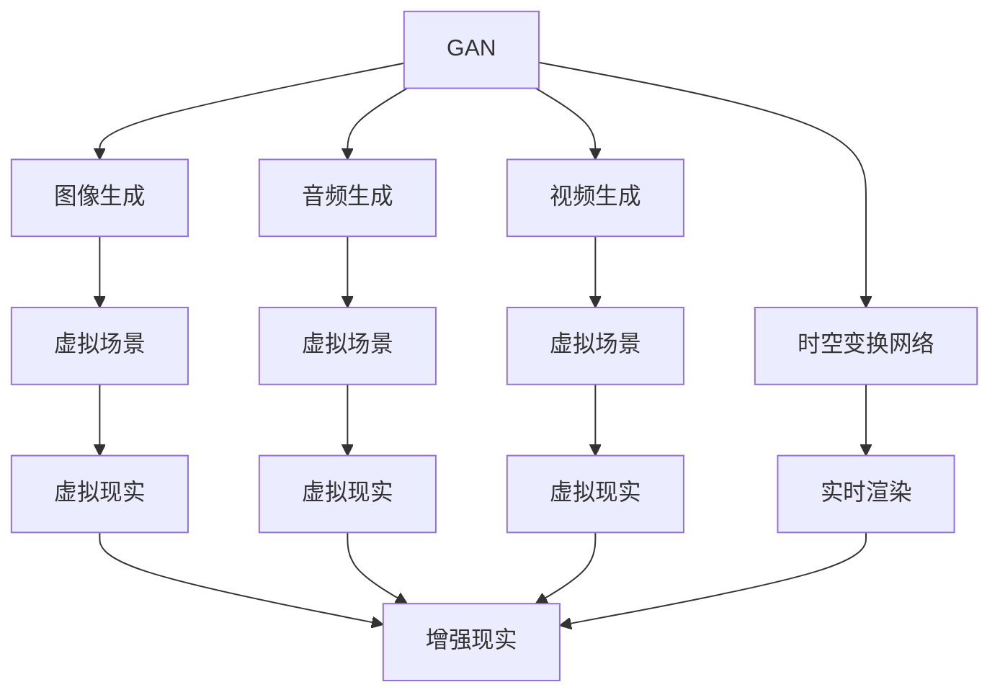

                 

# 体验的跨时空性：AI创造的时空穿越

> 关键词：时空穿越, 人工智能, 体验增强, 虚拟现实, 数据科学, 生成对抗网络

## 1. 背景介绍

### 1.1 问题由来

在信息爆炸的今天，我们早已习惯了通过屏幕获取信息的方式。但这种“扁平化”的信息交流方式，在深度和广度上都远远不够。我们希望能够通过增强现实(AR)和虚拟现实(VR)技术，沉浸式地体验世界。然而，传统的AR和VR技术通常需要消耗大量计算资源，才能在实时渲染中提供真实感。

幸运的是，人工智能技术的迅猛发展，为体验的跨时空性创造了新的可能性。通过先进的AI算法，我们可以在有限的计算资源下，构建出高保真的虚拟场景，使得用户体验更接近现实。

### 1.2 问题核心关键点

本文聚焦于如何通过人工智能技术，实现体验的跨时空性。具体而言，将探讨：

- 如何利用生成对抗网络(Generative Adversarial Network, GAN)，生成逼真的虚拟场景？
- 如何利用时空变换网络(Spatial-Temporal Transformer, ST-Transformer)，实时渲染虚拟场景？
- 如何通过AI与用户交互，提供沉浸式体验？
- 如何在有限的计算资源下，提升AI生成场景的保真度和实时性？

通过回答这些问题，我们希望展示AI技术在体验设计上的巨大潜力。

## 2. 核心概念与联系

### 2.1 核心概念概述

为更好地理解AI在体验跨时空性方面的应用，本节将介绍几个关键概念：

- 生成对抗网络(GAN)：一种通过两个网络模型相互竞争，生成高质量虚假数据的生成模型。GAN在图像、音频、视频生成等领域有广泛应用。

- 时空变换网络(TR-Transformer)：一种基于Transformer模型的时间序列生成网络，能够实时生成多模态数据。

- 虚拟现实(VR)：通过计算机技术，创建并模拟出一个虚拟的三维环境，使用户可以沉浸式体验。

- 增强现实(AR)：将虚拟信息与现实场景结合，增强用户的现实体验。

- 用户交互(User Interaction)：通过AI技术，与用户进行自然、流畅的互动，提升体验的沉浸感。

这些概念之间的联系可以通过以下Mermaid流程图来展示：



这个流程图展示了生成对抗网络在不同模态数据生成上的应用，以及通过时空变换网络生成虚拟场景后，如何与虚拟现实、增强现实等技术结合，实现体验的跨时空性。

## 3. 核心算法原理 & 具体操作步骤
### 3.1 算法原理概述

实现体验的跨时空性，离不开生成对抗网络和时空变换网络这两个关键技术。

生成对抗网络由一个生成器和一个判别器组成，通过对抗训练的方式，生成逼真的虚假数据。时空变换网络则基于Transformer模型，通过时间序列数据生成技术，实时渲染虚拟场景。

生成对抗网络的思想是，让生成器网络生成虚假数据，判别器网络判断这些数据的真实性。两者相互竞争，生成器试图生成让判别器难以识别的虚假数据，而判别器则希望尽可能准确地检测虚假数据。在不断对抗中，生成器的生成能力不断提高，最终生成高质量的虚假数据。

时空变换网络则通过Transformer模型，利用时间序列数据预测下一个时间步的输出。在体验跨时空性的应用中，可以利用时空变换网络实时生成虚拟场景，将其与现实场景叠加，创造出沉浸式体验。

### 3.2 算法步骤详解

以下将详细介绍生成对抗网络和时空变换网络的具体步骤。

**生成对抗网络：**

1. 初始化生成器和判别器网络结构，设定损失函数和优化器。
2. 生成器尝试生成虚假数据，判别器尝试判断数据的真实性。
3. 计算生成器和判别器的损失函数，反向传播更新网络参数。
4. 重复迭代，直至生成器生成的数据，判别器难以区分。

**时空变换网络：**

1. 准备时间序列数据集，设定模型参数。
2. 通过Transformer模型对时间序列数据进行编码和解码。
3. 计算模型的损失函数，反向传播更新网络参数。
4. 利用训练好的模型，实时生成新时间步的数据。

**实现步骤：**

1. 使用GPU/TPU等高性能设备，进行大量计算训练生成对抗网络。
2. 使用GPU/TPU等高性能设备，实时渲染时空变换网络生成的虚拟场景。
3. 将虚拟场景与现实场景叠加，实现增强现实或虚拟现实体验。
4. 通过用户交互技术，与虚拟场景进行互动，提升沉浸感。

### 3.3 算法优缺点

生成对抗网络的优势在于能够生成高质量的虚假数据，但同时也需要大量的计算资源和时间。时空变换网络则能够实时生成虚拟场景，但模型的训练复杂度较高，需要高质量的时间序列数据。

## 4. 数学模型和公式 & 详细讲解 & 举例说明

### 4.1 数学模型构建

生成对抗网络由生成器和判别器组成，其中生成器的目标函数为：

$$
\max_{G} \mathbb{E}_{x \sim p_{data}(x)} [\log D(G(z))]
$$

其中，$G$为生成器，$D$为判别器，$z$为噪声向量，$p_{data}$为数据分布。

判别器的目标函数为：

$$
\max_{D} \mathbb{E}_{x \sim p_{data}(x)} [\log D(x)] + \mathbb{E}_{z \sim p(z)} [\log (1 - D(G(z)))]
$$

其中，$p(z)$为噪声分布。

时空变换网络则通过Transformer模型对时间序列数据进行编码和解码。设输入序列为$x_1, x_2, ..., x_T$，预测序列为$y_1, y_2, ..., y_{T+1}$。则目标函数为：

$$
L = \sum_{t=1}^{T} \sum_{t'=1}^{T} (\hat{y}_{t',t} - y_{t'})^2
$$

其中，$\hat{y}_{t',t}$为预测序列在时间步$t'$对$t$的预测。

### 4.2 公式推导过程

对于生成对抗网络的推导，可以从最大化生成器损失的角度进行。设生成器生成的数据为$G(z)$，判别器判断的真实性概率为$D(G(z))$。则生成器的目标函数可以写为：

$$
\min_{G} \mathbb{E}_{x \sim p_{data}(x)} [-\log D(x)] + \mathbb{E}_{z \sim p(z)} [-\log (1 - D(G(z))))
$$

这与判别器的目标函数是一致的。

对于时空变换网络的推导，需要考虑时间序列数据的预测。假设输入序列为$x_t$，目标为预测下一个时间步的输出$y_{t+1}$。则目标函数为：

$$
\min_{\theta} \sum_{t=1}^{T} (\hat{y}_{t+1} - y_{t+1})^2
$$

其中，$\theta$为模型参数，$\hat{y}_{t+1}$为模型预测的序列输出。

### 4.3 案例分析与讲解

以生成对抗网络在图像生成中的应用为例。设原始图像为$x$，生成器生成的虚假图像为$G(z)$。判别器通过卷积神经网络(CNN)来提取图像特征，将$x$和$G(z)$映射到高维空间。生成器的目标是最小化判别器判断虚假的概率，即：

$$
\min_{G} \mathbb{E}_{z \sim p(z)} [-\log D(G(z))]
$$

判别器的目标是最小化生成器生成的虚假图像，即：

$$
\min_{D} \mathbb{E}_{z \sim p(z)} [\log D(G(z))] + \mathbb{E}_{x \sim p_{data}(x)} [\log (1 - D(x))]
$$

通过不断训练，生成器逐渐学会了生成逼真的虚假图像。在测试阶段，生成器可以用于生成高质量的虚拟图像，用于虚拟现实或增强现实场景的渲染。

## 5. 项目实践：代码实例和详细解释说明
### 5.1 开发环境搭建

在进行AI项目实践前，我们需要准备好开发环境。以下是使用Python进行TensorFlow开发的Python环境配置流程：

1. 安装Anaconda：从官网下载并安装Anaconda，用于创建独立的Python环境。

2. 创建并激活虚拟环境：
```bash
conda create -n tf-env python=3.8 
conda activate tf-env
```

3. 安装TensorFlow：根据CUDA版本，从官网获取对应的安装命令。例如：
```bash
conda install tensorflow tensorflow-gpu=cuda11.1 -c conda-forge -c pytorch -c pypi
```

4. 安装相关库：
```bash
pip install numpy pandas matplotlib scikit-learn 
```

5. 安装TensorBoard：TensorFlow配套的可视化工具。
```bash
pip install tensorboard
```

完成上述步骤后，即可在`tf-env`环境中开始AI项目实践。

### 5.2 源代码详细实现

以下是一个基于TensorFlow实现生成对抗网络的基本框架：

```python
import tensorflow as tf
from tensorflow.keras import layers, models
from tensorflow.keras.optimizers import Adam

# 生成器网络
def build_generator():
    generator = models.Sequential()
    generator.add(layers.Dense(256, input_dim=100, activation='relu'))
    generator.add(layers.BatchNormalization())
    generator.add(layers.Dense(512, activation='relu'))
    generator.add(layers.BatchNormalization())
    generator.add(layers.Dense(784, activation='tanh'))
    return generator

# 判别器网络
def build_discriminator():
    discriminator = models.Sequential()
    discriminator.add(layers.Dense(512, input_dim=784, activation='relu'))
    discriminator.add(layers.BatchNormalization())
    discriminator.add(layers.Dropout(0.3))
    discriminator.add(layers.Dense(256, activation='relu'))
    discriminator.add(layers.BatchNormalization())
    discriminator.add(layers.Dropout(0.3))
    discriminator.add(layers.Dense(1, activation='sigmoid'))
    return discriminator

# 生成对抗网络
def build_gan(generator, discriminator):
    discriminator.compile(loss='binary_crossentropy', optimizer=Adam(lr=0.0002))
    generator.compile(loss='binary_crossentropy', optimizer=Adam(lr=0.0002))
    return discriminator, generator

# 加载数据集
mnist = tf.keras.datasets.mnist
(x_train, y_train), (x_test, y_test) = mnist.load_data()
x_train = x_train / 255.0
x_test = x_test / 255.0

# 构建生成器、判别器、生成对抗网络
generator = build_generator()
discriminator, generator = build_gan(generator, discriminator)

# 训练生成对抗网络
epochs = 10000
batch_size = 32
for epoch in range(epochs):
    for batch in tf.data.Dataset.from_tensor_slices((x_train, y_train)).batch(batch_size):
        noise = tf.random.normal([batch_size, 100])
        gen_images = generator(noise)
        real_images = tf.reshape(batch[0], [batch_size, 784])
        d_loss_real = discriminator.train_on_batch(real_images, tf.ones_like(real_images))
        d_loss_fake = discriminator.train_on_batch(gen_images, tf.zeros_like(real_images))
        g_loss = generator.train_on_batch(noise, tf.ones_like(real_images))
        print('Epoch: {}, D_Loss_Real: {:.4f}, D_Loss_Fake: {:.4f}, G_Loss: {:.4f}'.format(epoch, d_loss_real, d_loss_fake, g_loss))
```

### 5.3 代码解读与分析

让我们再详细解读一下关键代码的实现细节：

**GAN框架：**
- 首先定义生成器和判别器的基本网络结构，通过Sequential模型堆叠多个Dense层、BatchNormalization层和Dropout层。
- 在生成器中，将随机噪声作为输入，最终输出高维的虚假图像。
- 在判别器中，将真实图像和虚假图像作为输入，输出判别器判断的真假概率。

**训练过程：**
- 在训练循环中，每次迭代随机生成一批噪声，通过生成器生成虚假图像。
- 将真实图像和虚假图像分别输入判别器，计算判别器的损失函数。
- 将真实图像和虚假图像分别输入生成器，计算生成器的损失函数。
- 通过Adam优化器，更新生成器和判别器的参数。

## 6. 实际应用场景
### 6.1 虚拟现实游戏

虚拟现实游戏是一种利用生成对抗网络创造逼真虚拟场景的应用。通过大量计算，生成对抗网络可以生成高度逼真的虚拟环境，为玩家提供沉浸式体验。

在游戏中，生成对抗网络根据玩家操作实时生成环境变化，使得游戏更加生动逼真。例如，通过生成对抗网络实时生成山脉、河流、树木等自然景观，玩家仿佛置身于真实世界。同时，生成对抗网络还可以生成复杂的敌对生物、NPC等角色，增强游戏的挑战性和趣味性。

### 6.2 医疗影像模拟

在医疗影像领域，生成对抗网络可以用于生成高质量的医学图像，用于模拟和治疗训练。例如，可以生成逼真的CT图像、MRI图像等，帮助医生进行诊断和手术训练。

在医疗影像模拟中，生成对抗网络可以根据现有的真实图像，生成大量高质量的虚拟图像，供医生进行诊断和手术训练。同时，生成对抗网络还可以用于模拟不同病例的变化，帮助医生了解疾病的发展过程，提高诊断和治疗的精准度。

### 6.3 影视制作

影视制作是生成对抗网络的重要应用场景之一。通过生成对抗网络，可以生成逼真的虚拟角色、场景、特效等，用于影视作品的后期制作和特效渲染。

在影视制作中，生成对抗网络可以生成逼真的虚拟角色，供演员进行表情捕捉和动作模拟，大大缩短制作周期。同时，生成对抗网络还可以生成逼真的虚拟场景和特效，用于电影特效渲染，使得电影视觉效果更加逼真。

### 6.4 未来应用展望

随着生成对抗网络和时空变换网络技术的不断进步，AI在体验跨时空性方面的应用将更加广泛。未来可以预见的应用包括：

1. 虚拟现实娱乐：通过生成对抗网络，生成逼真的虚拟世界，提供沉浸式娱乐体验。
2. 医疗诊断训练：通过生成对抗网络，生成高质量的虚拟医疗影像，用于医生诊断和治疗训练。
3. 影视制作特效：通过生成对抗网络，生成逼真的虚拟角色、场景和特效，提升影视作品的质量和效果。
4. 教育培训：通过生成对抗网络，生成虚拟实验室、实验场景等，为学生提供沉浸式学习体验。
5. 艺术创作：通过生成对抗网络，生成逼真的虚拟艺术作品，激发艺术家的创作灵感。

随着这些技术的不断发展，AI在体验跨时空性方面的应用将更加深入和广泛，为人类创造更多的沉浸式体验。

## 7. 工具和资源推荐
### 7.1 学习资源推荐

为了帮助开发者系统掌握生成对抗网络的时空变换网络技术，这里推荐一些优质的学习资源：

1. 《Deep Learning with Python》书籍：该书详细介绍了深度学习的基本概念和TensorFlow的使用方法，是学习AI算法的基础。

2. 《Generative Adversarial Networks with TensorFlow》教程：由Google官方提供的TensorFlow GAN教程，详细介绍了生成对抗网络的基本原理和TensorFlow实现。

3. 《Time Series Forecasting with Transformers》教程：由TensorFlow官方提供的时空变换网络教程，详细介绍了时空变换网络的基本原理和TensorFlow实现。

4. 《TensorFlow Playground》网站：Google提供的TensorFlow在线实验平台，可以实时可视化模型训练过程，非常适合初学者。

5. 《Deep Learning Specialization》课程：Coursera上的深度学习专项课程，由Andrew Ng教授主讲，是深度学习领域的学习利器。

通过对这些资源的学习实践，相信你一定能够快速掌握生成对抗网络和时空变换网络技术，并将其应用于实际开发中。

### 7.2 开发工具推荐

高效的开发离不开优秀的工具支持。以下是几款用于生成对抗网络和时空变换网络开发的常用工具：

1. TensorFlow：由Google主导开发的深度学习框架，生产部署方便，适合大规模工程应用。提供了丰富的生成对抗网络和时空变换网络资源。

2. PyTorch：基于Python的开源深度学习框架，灵活度较高，适合研究和实验。也提供了生成对抗网络和时空变换网络资源。

3. Keras：基于TensorFlow和Theano的高级API，提供了简单易用的API接口，方便快速原型开发。

4. Weights & Biases：模型训练的实验跟踪工具，可以记录和可视化模型训练过程中的各项指标，方便对比和调优。与主流深度学习框架无缝集成。

5. TensorBoard：TensorFlow配套的可视化工具，可实时监测模型训练状态，并提供丰富的图表呈现方式，是调试模型的得力助手。

合理利用这些工具，可以显著提升生成对抗网络和时空变换网络任务的开发效率，加快创新迭代的步伐。

### 7.3 相关论文推荐

生成对抗网络和时空变换网络的发展源于学界的持续研究。以下是几篇奠基性的相关论文，推荐阅读：

1. Generative Adversarial Nets（GAN原始论文）：由Ian Goodfellow等人提出的生成对抗网络，奠定了GAN的基础。

2. Conditional Image Synthesis with Auxiliary Classifier GANs（C-GAN论文）：通过添加分类器，解决了GAN生成图像多样性不足的问题。

3. A Comprehensive Survey on Generative Adversarial Networks：由Tian Qi等人编写的生成对抗网络综述论文，系统总结了GAN的发展历程和应用领域。

4. Transformer-XL: Attentive Language Models Beyond a Fixed-Length Context（Transformer-XL论文）：提出了Transformer-XL模型，解决了长序列时间序列数据的处理问题。

5. Time-Series Forecasting with Attention-Based Architectures（Attention论文）：由Andrew Ng等人提出的注意力机制时间序列模型，提高了时间序列预测的准确性。

这些论文代表了大模型微调技术的发展脉络。通过学习这些前沿成果，可以帮助研究者把握学科前进方向，激发更多的创新灵感。

## 8. 总结：未来发展趋势与挑战

### 8.1 总结

本文对生成对抗网络和时空变换网络在体验跨时空性方面的应用进行了全面系统的介绍。首先阐述了生成对抗网络和时空变换网络的基本原理和训练过程，明确了它们在图像生成和时间序列预测方面的独特优势。其次，从原理到实践，详细讲解了生成对抗网络和时空变换网络的数学模型和公式推导，给出了相关代码实现。同时，本文还广泛探讨了这些技术在虚拟现实、医疗影像、影视制作等领域的广泛应用前景，展示了AI技术在体验设计上的巨大潜力。

通过本文的系统梳理，可以看到，生成对抗网络和时空变换网络为实现体验的跨时空性创造了新的可能性。在有限的计算资源下，这些技术能够生成高质量的虚假数据，实时渲染逼真的虚拟场景，提升用户的沉浸式体验。未来，随着生成对抗网络和时空变换网络技术的不断进步，AI在体验跨时空性方面的应用将更加广泛和深入。

### 8.2 未来发展趋势

展望未来，生成对抗网络和时空变换网络技术将呈现以下几个发展趋势：

1. 生成对抗网络的图像生成能力将进一步提升，生成的虚假数据将更加逼真、多样化。

2. 时空变换网络的时间序列预测能力将进一步提升，能够生成更长、更复杂的序列数据。

3. 生成对抗网络和时空变换网络将与其他AI技术深度融合，如自然语言处理、计算机视觉等，提供更加全面的体验设计方案。

4. 生成对抗网络和时空变换网络将在更多的领域得到应用，如医疗、教育、艺术等，提升各行业的智能化水平。

5. 生成对抗网络和时空变换网络将结合硬件加速技术，如GPU、TPU等，提升实时渲染的保真度和效率。

这些趋势凸显了生成对抗网络和时空变换网络技术的广阔前景。这些方向的探索发展，必将进一步提升AI生成场景的保真度和实时性，为用户带来更逼真、更沉浸的体验。

### 8.3 面临的挑战

尽管生成对抗网络和时空变换网络技术已经取得了瞩目成就，但在迈向更加智能化、普适化应用的过程中，仍面临诸多挑战：

1. 生成对抗网络的计算资源消耗巨大，训练时间较长，限制了其在实际应用中的普及。如何降低计算资源消耗，缩短训练时间，将是未来研究的重要方向。

2. 生成对抗网络生成的虚假数据存在质量不稳定的现象，容易受到噪声干扰。如何提高生成数据的稳定性和多样性，还需要更多理论和实践的积累。

3. 时空变换网络的模型复杂度较高，训练难度较大，需要高质量的时间序列数据。如何降低模型复杂度，提高训练效率，增强模型的鲁棒性，仍需更多研究。

4. 生成对抗网络和时空变换网络的应用场景较为狭窄，推广难度较大。如何拓展应用场景，提供更加广泛、多样化的应用，也将是重要的研究方向。

5. 生成对抗网络和时空变换网络的输出结果缺乏可解释性，难以理解和调试。如何提高模型的可解释性，增强用户对AI算法的信任，也将是未来的挑战之一。

6. 生成对抗网络和时空变换网络的伦理和安全性问题仍需解决。如何确保AI算法的公平性、安全性，避免偏见和恶意用途，也将是重要的研究课题。

正视这些挑战，积极应对并寻求突破，将是大语言模型微调走向成熟的必由之路。相信随着学界和产业界的共同努力，这些挑战终将一一被克服，AI在体验跨时空性方面的应用将更加广泛和深入。

### 8.4 研究展望

面对生成对抗网络和时空变换网络面临的种种挑战，未来的研究需要在以下几个方面寻求新的突破：

1. 探索无监督和半监督生成对抗网络方法。摆脱对大规模标注数据的依赖，利用自监督学习、主动学习等无监督和半监督范式，最大限度利用非结构化数据，实现更加灵活高效的生成对抗网络。

2. 研究参数高效和计算高效的生成对抗网络范式。开发更加参数高效的生成对抗网络方法，在固定大部分预训练参数的同时，只更新极少量的任务相关参数。同时优化生成对抗网络的计算图，减少前向传播和反向传播的资源消耗，实现更加轻量级、实时性的部署。

3. 引入更多先验知识。将符号化的先验知识，如知识图谱、逻辑规则等，与神经网络模型进行巧妙融合，引导生成对抗网络生成更准确、合理的虚拟数据。同时加强不同模态数据的整合，实现视觉、语音等多模态信息与文本信息的协同建模。

4. 结合因果分析和博弈论工具。将因果分析方法引入生成对抗网络，识别出生成器生成的虚假数据的关键特征，增强生成数据的因果关系，学习更加普适、鲁棒的数据生成模型。借助博弈论工具刻画人机交互过程，主动探索并规避生成对抗网络脆弱点，提高系统稳定性。

5. 纳入伦理道德约束。在生成对抗网络的目标函数中引入伦理导向的评估指标，过滤和惩罚有偏见、有害的输出倾向。同时加强人工干预和审核，建立生成对抗网络行为的监管机制，确保生成数据的安全性和合法性。

这些研究方向的探索，必将引领生成对抗网络和时空变换网络技术迈向更高的台阶，为构建安全、可靠、可解释、可控的智能系统铺平道路。面向未来，生成对抗网络和时空变换网络技术还需要与其他人工智能技术进行更深入的融合，如知识表示、因果推理、强化学习等，多路径协同发力，共同推动自然语言理解和智能交互系统的进步。只有勇于创新、敢于突破，才能不断拓展AI在体验设计上的边界，让智能技术更好地造福人类社会。

## 9. 附录：常见问题与解答

**Q1：如何提升生成对抗网络生成数据的稳定性？**

A: 提升生成对抗网络生成数据的稳定性，可以从以下几个方面入手：

1. 增加训练数据量：通过增加训练数据，可以减少生成对抗网络的学习噪声，提高生成数据的稳定性。

2. 优化生成器网络结构：增加生成器网络的深度和宽度，提高生成器网络的表示能力，有助于生成更稳定、多样化的数据。

3. 引入噪声注入技术：在生成器网络的输入中加入随机噪声，可以增强生成数据的随机性，减少生成数据的过拟合现象。

4. 使用对抗训练：通过对抗训练，可以增强生成对抗网络对噪声的鲁棒性，提高生成数据的稳定性。

**Q2：如何降低生成对抗网络的计算资源消耗？**

A: 降低生成对抗网络的计算资源消耗，可以从以下几个方面入手：

1. 使用混合精度训练：将模型的数据类型从float32转换为float16，可以显著降低计算资源消耗，提高训练效率。

2. 使用分布式训练：通过分布式训练，可以将训练任务分散到多个GPU/TPU上进行，加速训练过程。

3. 使用参数共享技术：通过参数共享，可以减少生成对抗网络的参数量，降低计算资源消耗。

4. 使用量化技术：通过量化技术，将浮点模型转为定点模型，进一步压缩存储空间，提高计算效率。

**Q3：如何提高时空变换网络的时间序列预测能力？**

A: 提高时空变换网络的时间序列预测能力，可以从以下几个方面入手：

1. 增加模型的深度和宽度：通过增加Transformer模型的层数和隐藏单元数，可以提高模型的表示能力，增强时间序列预测的准确性。

2. 引入注意力机制：通过引入自注意力机制，可以增强模型对时间序列中不同时间步的关系建模能力，提高时间序列预测的准确性。

3. 引入长短时记忆网络：通过引入长短时记忆网络(LSTM)，可以解决时间序列预测中的梯度消失问题，提高时间序列预测的稳定性。

4. 使用多种时间序列数据源：通过融合多种时间序列数据源，可以提高模型的预测准确性，增强时间序列预测的鲁棒性。

**Q4：时空变换网络在实时渲染中的应用场景有哪些？**

A: 时空变换网络在实时渲染中的应用场景非常广泛，包括以下几个方面：

1. 虚拟现实游戏：通过时空变换网络实时生成游戏场景，提供沉浸式游戏体验。

2. 医疗影像模拟：通过时空变换网络实时生成医疗影像，用于医生诊断和治疗训练。

3. 影视制作特效：通过时空变换网络实时生成特效场景，提升影视作品的质量和效果。

4. 交通模拟：通过时空变换网络实时生成交通场景，用于城市交通规划和模拟。

5. 金融市场预测：通过时空变换网络实时生成金融市场数据，用于金融市场预测和风险评估。

6. 自然语言处理：通过时空变换网络实时生成自然语言数据，用于自然语言理解和生成。

通过时空变换网络技术，可以实现多种实时渲染场景，为用户提供更加逼真、多样化的体验。

**Q5：时空变换网络在实际应用中需要注意哪些问题？**

A: 时空变换网络在实际应用中需要注意以下几个问题：

1. 数据质量：时空变换网络对时间序列数据的质量要求较高，需要保证数据的时序一致性和完整性。

2. 计算资源：时空变换网络的计算资源消耗较大，需要配备高性能GPU/TPU设备，以便快速训练和推理。

3. 模型调参：时空变换网络的参数调参较为复杂，需要根据具体任务和数据特点进行优化。

4. 数据增强：时空变换网络对数据增强技术的要求较高，需要引入多种数据增强策略，增强模型的泛化能力。

5. 鲁棒性：时空变换网络对噪声和异常值的鲁棒性要求较高，需要引入鲁棒性增强技术，提高模型的鲁棒性。

6. 可解释性：时空变换网络的输出结果缺乏可解释性，需要引入可解释性增强技术，增强用户对AI算法的信任。

只有合理应对这些问题，时空变换网络才能在实际应用中发挥更大的作用。

---

作者：禅与计算机程序设计艺术 / Zen and the Art of Computer Programming

