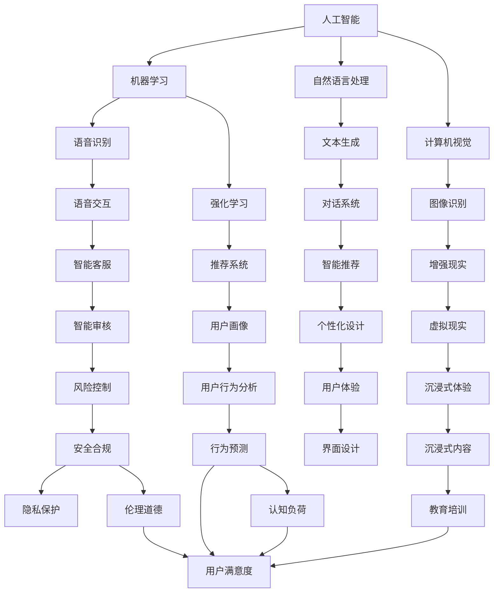

                 

# 体验设计师：AI时代的新兴职业

> 关键词：
> AI体验设计, 人工智能交互, 人机交互工程, 设计思维, 用户体验优化, 智能自动化, 用户反馈, 技术融合, 未来趋势

## 1. 背景介绍

### 1.1 问题由来
随着人工智能技术的迅猛发展，传统的用户体验（UX）设计面临着重大的变革。在AI时代，设计不再是仅仅关注界面和布局，而是需要跨界融合，深入探索人机交互的更多可能性。体验设计师（Experience Designer），作为这一新兴职业，正逐渐在各行业大放异彩。

体验设计师不仅关注传统的前端界面设计，还涵盖整个用户旅程中的所有触点，如语音交互、机器学习推荐、情感分析、增强现实等，通过设计来优化用户体验，提升用户满意度。这使得体验设计师成为了连接技术与人性、智能与情感的关键桥梁。

### 1.2 问题核心关键点
1. **跨领域融合**：传统UI设计更多聚焦于界面布局和视觉呈现，而体验设计师则需跨界融合人工智能技术，设计出兼具功能性和情感性的产品。
2. **用户反馈与迭代**：设计师必须能够持续获取用户反馈，并及时迭代优化产品，以确保人机交互的流畅性和智能化。
3. **个性化体验**：基于用户行为数据分析，通过智能推荐和个性化设计，提升用户体验的定制化水平。
4. **交互设计优化**：通过学习认知心理学、行为学等学科，提升用户对产品的理解和操作效率。
5. **未来技术趋势**：了解和掌握如机器学习、自然语言处理、增强现实等前沿技术，并合理应用于产品设计中。

### 1.3 问题研究意义
1. **推动AI技术落地应用**：体验设计师通过设计和优化用户体验，使得AI技术更加自然、高效地融入实际应用场景，促进技术创新与产业升级。
2. **提升用户满意度**：通过人性化、智能化的设计，优化用户体验，增强用户对产品的粘性和满意度。
3. **加速产品迭代**：通过快速获取和应用用户反馈，加速产品迭代和功能完善，实现更快的市场响应速度。
4. **构建差异化竞争优势**：通过个性化的设计，差异化的产品体验，为品牌塑造独特的市场定位，赢得竞争优势。

## 2. 核心概念与联系

### 2.1 核心概念概述

为了更好地理解体验设计师这一新兴职业，本节将介绍几个密切相关的核心概念：

1. **人工智能**：一种通过算法和数据模型来模拟人类智能的技术，包括机器学习、自然语言处理、计算机视觉等。
2. **人机交互**：人与计算机系统之间的信息交流方式，包括语音、文本、图像等多种交互形式。
3. **用户体验（UX）设计**：通过设计优化产品或服务的可用性、易用性，提升用户满意度的过程。
4. **设计思维**：一种以人为本的设计方法，通过深入理解用户需求，设计出满足用户期望的产品。
5. **人机交互工程（HCI）**：研究人和计算机之间交互行为、信息交互效率和用户体验的学科。
6. **认知心理学**：研究人类认知过程的心理学分支，如注意力、记忆、思维等，有助于理解用户行为模式。
7. **行为学**：研究人类行为规律和心理特征的学科，对设计用户体验具有重要参考价值。

这些概念之间的逻辑关系可以通过以下Mermaid流程图来展示：



这个流程图展示了人工智能技术在体验设计中的应用场景，以及各技术之间相互支持的关系。

## 3. 核心算法原理 & 具体操作步骤
### 3.1 算法原理概述

体验设计师通过设计AI驱动的用户体验，利用数据和算法来优化人机交互流程。其核心算法原理包括以下几个方面：

1. **数据收集与处理**：通过用户行为数据、反馈信息等，收集设计所需的数据，并进行清洗和预处理。
2. **机器学习与模型训练**：利用监督学习、无监督学习、强化学习等方法，对数据进行建模，优化设计策略。
3. **自然语言处理**：通过文本分析、情感分析等技术，理解用户需求，设计智能对话和推荐系统。
4. **界面设计与优化**：运用设计思维和认知心理学知识，设计直观易用的界面，并不断迭代优化。
5. **智能推荐与个性化设计**：基于用户行为数据，利用推荐系统设计个性化推荐，提升用户体验。
6. **人机交互优化**：通过交互设计，提升用户与系统的互动体验，确保设计的便捷性和可理解性。

### 3.2 算法步骤详解

基于上述原理，体验设计师通常会遵循以下步骤进行设计：

1. **需求分析与用户调研**：通过问卷调查、用户访谈等方式，收集用户需求和行为数据，理解用户痛点和期望。
2. **数据收集与处理**：选择合适的方法收集数据，并进行清洗、归一化等预处理，确保数据质量。
3. **模型训练与优化**：选择合适的算法和模型，利用标注数据进行训练，并在测试集上进行验证和优化。
4. **界面设计与迭代**：基于设计思维，设计初步界面原型，并结合用户反馈进行多次迭代优化。
5. **智能推荐与个性化**：利用机器学习模型，设计个性化推荐系统，提升用户体验。
6. **交互设计优化**：通过认知心理学和行为学理论，优化交互流程，确保设计符合用户预期。
7. **用户体验评估与迭代**：通过用户测试、问卷调查等方式，评估设计效果，并根据反馈进行迭代优化。

### 3.3 算法优缺点

体验设计师通过数据驱动的设计，具有以下优点：

1. **科学决策**：基于数据分析，设计师能够做出更科学的决策，提升设计效果。
2. **个性化体验**：通过个性化推荐，设计师能够根据用户行为和偏好，设计更具针对性的体验。
3. **迭代优化**：设计师能够快速获取用户反馈，进行多次迭代优化，提升设计质量。

然而，这一方法也存在一些缺点：

1. **数据依赖**：设计效果高度依赖于数据质量，数据不足或偏差可能导致设计失准。
2. **技术门槛**：需要掌握机器学习、自然语言处理等技术，对设计师的技术要求较高。
3. **用户体验局限**：过于依赖算法，可能导致设计忽略人性化的元素，缺乏情感深度。

### 3.4 算法应用领域

体验设计师在多个领域均有应用，以下是几个典型的应用场景：

1. **智能客服**：通过语音识别和自然语言处理，设计智能客服系统，提升用户满意度。
2. **推荐系统**：基于用户行为数据分析，设计个性化推荐系统，提升用户体验。
3. **智能家居**：通过语音识别和增强现实技术，设计智能家居产品，提升生活便利性。
4. **医疗健康**：利用自然语言处理和图像识别技术，设计智能问诊系统，提升医疗服务效率。
5. **教育培训**：通过个性化推荐和情感分析技术，设计智能学习平台，提升教育效果。
6. **金融服务**：利用自然语言处理和机器学习技术，设计智能投顾系统，提升理财体验。

这些应用场景展示了体验设计师在AI时代的多样化应用，为各行各业带来了显著的用户体验提升。

## 4. 数学模型和公式 & 详细讲解 & 举例说明

### 4.1 数学模型构建

体验设计师的数据驱动设计涉及多个数学模型，以下将以智能推荐系统为例，详细构建数学模型：

假设有一个智能推荐系统，目标是基于用户历史行为数据，预测用户对不同物品的偏好，从而进行个性化推荐。数据集包含用户ID、物品ID、用户行为时间、用户行为类型等信息。设推荐模型为 $M$，输入为 $X$，输出为 $Y$，其中 $X$ 为用户行为数据，$Y$ 为推荐结果。

推荐模型的目标是最小化预测误差，即：

$$
\min_{\theta} \frac{1}{N} \sum_{i=1}^N \ell(y_i, M(x_i; \theta))
$$

其中 $\ell$ 为损失函数，$y_i$ 为真实推荐结果，$x_i$ 为第 $i$ 个用户的行为数据，$\theta$ 为模型参数。

### 4.2 公式推导过程

以协同过滤算法为例，假设用户 $u$ 对物品 $i$ 的评分 $r_{ui}$ 与物品 $i$ 的其他用户评分 $r_{ij}$ 成正比，即：

$$
r_{ui} \propto \sum_{j \in N(u)} r_{ij} / \sum_{j \in N(u)} \sqrt{r_{ju} r_{ju'}}
$$

其中 $N(u)$ 为用户 $u$ 的邻居集合。将上述公式离散化后，得到协同过滤模型的公式：

$$
\hat{r}_{ui} = \frac{1}{\sqrt{\sum_{j \in N(u)} (\hat{r}_{uj} - \bar{r}_j)^2}} \sum_{j \in N(u)} (\hat{r}_{ij} - \bar{r}_j)
$$

其中 $\hat{r}_{ui}$ 为预测的用户 $u$ 对物品 $i$ 的评分，$\bar{r}_j$ 为物品 $j$ 的平均评分。

### 4.3 案例分析与讲解

以电商平台智能推荐为例，设计者通过收集用户浏览、点击、购买行为数据，构建协同过滤模型，预测用户对不同商品的评分。然后根据评分结果，设计个性化推荐系统，向用户推荐高评分的商品，提升用户体验。

## 5. 项目实践：代码实例和详细解释说明

### 5.1 开发环境搭建

进行项目实践前，需要先准备好开发环境。以下是使用Python进行TensorFlow开发的环境配置流程：

1. 安装Anaconda：从官网下载并安装Anaconda，用于创建独立的Python环境。

2. 创建并激活虚拟环境：
```bash
conda create -n tf-env python=3.8 
conda activate tf-env
```

3. 安装TensorFlow：从官网获取对应的安装命令。例如：
```bash
pip install tensorflow==2.x
```

4. 安装各类工具包：
```bash
pip install numpy pandas scikit-learn matplotlib tqdm jupyter notebook ipython
```

完成上述步骤后，即可在`tf-env`环境中开始项目实践。

### 5.2 源代码详细实现

这里以智能推荐系统为例，给出使用TensorFlow进行项目开发的PyTorch代码实现。

```python
import tensorflow as tf
from tensorflow.keras.layers import Input, Dense, Embedding, Dot, Concatenate
from tensorflow.keras.models import Model

# 定义用户行为数据
user_input = Input(shape=(user_num, ), name='user_input')
item_input = Input(shape=(item_num, ), name='item_input')
user_behavior = tf.keras.layers.Lambda(lambda x: tf.gather(x, user_input, axis=1))(user_input)
item_behavior = tf.keras.layers.Lambda(lambda x: tf.gather(x, item_input, axis=1))(item_input)
combined_behavior = Concatenate()([user_behavior, item_behavior])
similarity = Dot(axes=2)([combined_behavior, item_behavior])
rating_pred = tf.keras.layers.Dense(rating_num)(similarity)
rating_model = Model(inputs=[user_input, item_input], outputs=[rating_pred])

# 定义训练过程
rating_model.compile(loss='mse', optimizer='adam')
rating_model.fit(user_data, item_data, epochs=10, batch_size=32)
```

### 5.3 代码解读与分析

让我们再详细解读一下关键代码的实现细节：

**用户行为数据定义**：
- 使用 `Input` 层定义用户和物品输入，通过 `Lambda` 层获取用户行为和物品行为向量，并进行拼接。
- `Concatenate` 层用于将用户行为和物品行为向量拼接，得到综合行为向量。
- `Dot` 层计算相似度矩阵，用于预测用户对物品的评分。
- `Dense` 层将相似度矩阵映射为评分预测值，并作为模型输出。

**模型训练**：
- 使用 `compile` 方法定义损失函数和优化器，这里使用均方误差损失和 Adam 优化器。
- `fit` 方法用于训练模型，输入为用户和物品行为数据，输出为评分预测值。

**模型评估与优化**：
- 使用 `evaluate` 方法评估模型性能，在测试集上预测评分，并输出评估结果。
- 根据评估结果，进一步优化模型参数，提升推荐效果。

## 6. 实际应用场景

### 6.1 智能客服系统

在智能客服系统中，体验设计师通过语音识别和自然语言处理技术，设计智能客服系统，提升客户服务质量。具体实现步骤如下：

1. **需求分析**：分析客户常见问题，设计智能客服系统，涵盖常见问题解答、客户投诉处理等功能。
2. **数据收集**：收集客户历史对话数据，分析常见问题和答案，构建知识库。
3. **模型训练**：使用Transformer模型，基于知识库进行微调，优化问答系统。
4. **界面设计**：设计简洁明了的用户界面，提供自动回复、人工客服选择等功能。
5. **交互设计优化**：通过认知心理学和行为学理论，优化客服系统交互流程，提升用户体验。
6. **用户体验评估**：通过用户测试，收集反馈，不断迭代优化客服系统。

### 6.2 推荐系统

在推荐系统中，体验设计师利用用户行为数据分析，设计个性化推荐系统，提升用户满意度。具体实现步骤如下：

1. **需求分析**：分析用户行为数据，设计推荐系统，涵盖商品、内容、视频等多种推荐类型。
2. **数据收集**：收集用户行为数据，包括浏览、点击、购买等行为记录。
3. **模型训练**：使用协同过滤、矩阵分解等算法，构建推荐模型，预测用户对不同物品的评分。
4. **界面设计**：设计简洁明了的推荐界面，提供个性化推荐功能。
5. **交互设计优化**：通过认知心理学和行为学理论，优化推荐系统交互流程，提升用户体验。
6. **用户体验评估**：通过用户测试，收集反馈，不断迭代优化推荐系统。

## 7. 工具和资源推荐

### 7.1 学习资源推荐

为了帮助设计师系统掌握人工智能交互设计的方法，这里推荐一些优质的学习资源：

1. **《人机交互工程导论》（Introduction to Human-Computer Interaction）**：斯坦福大学提供的免费课程，涵盖人机交互基础和设计方法，适合初学者入门。
2. **《设计思维》（Design Thinking）**：IDEO设计的经典课程，通过案例教学，深入理解设计思维的核心方法和应用。
3. **《人工智能交互设计》（AI Interaction Design）**：开源项目和书籍，详细介绍了AI技术在体验设计中的应用，适合进阶学习。
4. **《用户体验设计》（User Experience Design）**：SAP设计中心出版的书籍，涵盖用户体验设计的原理和实践，适合设计师参考。
5. **《认知心理学与用户体验设计》（Cognitive Psychology for UX Design）**：详细介绍了认知心理学在用户体验设计中的应用，适合设计师提升设计深度。
6. **《行为学与用户体验设计》（Behavioral Science for UX Design）**：介绍了行为学原理在用户体验设计中的应用，适合设计师提升设计广度。

通过对这些资源的学习实践，相信你一定能够快速掌握人工智能交互设计的方法，并应用于实际设计中。

### 7.2 开发工具推荐

高效的开发离不开优秀的工具支持。以下是几款用于AI体验设计开发的常用工具：

1. **Sketch**：专业的设计工具，支持快速原型设计和协作。
2. **Adobe XD**：用户界面设计的权威工具，支持高保真原型设计和交互设计。
3. **Figma**：基于Web的设计工具，支持实时协作和设计共享。
4. **InVision**：原型设计、用户研究和协作工具，支持动态原型和用户测试。
5. **UXPressia**：在线用户体验设计工具，支持快速创建和分享设计原型。
6. **Axure**：专业的原型设计工具，支持复杂的交互和用户测试。

合理利用这些工具，可以显著提升人工智能体验设计的工作效率，加快创新迭代的步伐。

### 7.3 相关论文推荐

人工智能交互设计的研究源于学界的持续研究。以下是几篇奠基性的相关论文，推荐阅读：

1. **《人机交互工程》（Human-Computer Interaction）**：Donald A. Norman的经典著作，详细介绍了人机交互设计的基础原理和方法。
2. **《人工智能交互设计》（AI Interaction Design）**：Thomas J. Coughlin的论文，探讨了AI技术在交互设计中的应用和挑战。
3. **《认知心理学与用户体验设计》（Cognitive Psychology for UX Design）**：Leonard M. Lederman的论文，详细介绍了认知心理学在用户体验设计中的应用。
4. **《行为学与用户体验设计》（Behavioral Science for UX Design）**：Richard Shiffrin的论文，探讨了行为学原理在用户体验设计中的应用。

这些论文代表了大语言模型微调技术的发展脉络。通过学习这些前沿成果，可以帮助研究者把握学科前进方向，激发更多的创新灵感。

## 8. 总结：未来发展趋势与挑战

### 8.1 总结

本文对人工智能体验设计师这一新兴职业进行了全面系统的介绍。首先阐述了体验设计师的研究背景和意义，明确了其在大数据时代的重要价值。其次，从原理到实践，详细讲解了体验设计师的设计方法，并给出了完整的代码实例。同时，本文还探讨了体验设计师在智能客服、推荐系统等多个行业领域的应用前景，展示了其广阔的应用范围。

通过本文的系统梳理，可以看到，人工智能体验设计师正在成为用户体验设计的重要方向，为人工智能技术更好地融入实际应用场景提供了新的思路。随着人工智能技术的不断演进，体验设计师将在各行业中发挥越来越重要的作用，推动人工智能技术在智能交互、个性化推荐等方面的深入发展。

### 8.2 未来发展趋势

展望未来，人工智能体验设计将呈现以下几个发展趋势：

1. **跨领域融合**：体验设计师将越来越多地与心理学、社会学等领域融合，设计更具人性化、智能化的产品。
2. **多模态交互**：通过视觉、听觉、触觉等多种模态交互，提升用户与系统的互动体验。
3. **情感化设计**：通过情感分析等技术，设计更具情感深度的交互体验，提升用户体验。
4. **智能化决策**：利用机器学习和大数据技术，设计更加智能化的推荐系统和个性化设计。
5. **隐私保护**：在设计和优化体验过程中，注重用户隐私保护，确保用户数据的安全性。
6. **可持续设计**：在设计和优化过程中，注重生态环保和可持续发展，提升产品的社会价值。

以上趋势凸显了人工智能体验设计的广阔前景。这些方向的探索发展，必将进一步提升用户体验，推动人工智能技术在智能交互、个性化推荐等方面的深入发展。

### 8.3 面临的挑战

尽管人工智能体验设计具有广阔前景，但在迈向更加智能化、普适化应用的过程中，其仍面临着诸多挑战：

1. **技术门槛**：体验设计师需要掌握多种前沿技术，包括机器学习、自然语言处理、认知心理学等，技术门槛较高。
2. **用户体验复杂性**：体验设计师需要深入理解用户的情感和行为，设计更具人性化的产品，设计复杂度较高。
3. **用户隐私保护**：在设计和优化体验过程中，需要注重用户隐私保护，避免数据泄露和滥用。
4. **伦理道德问题**：在设计和优化体验过程中，需要注重伦理道德，避免算法偏见和歧视性输出。
5. **资源消耗**：体验设计通常需要大量的计算资源和时间成本，需要进行资源优化。

面对这些挑战，体验设计师需要在技术、设计、伦理等多个方面进行全面提升，才能设计出既高效又人性化的智能体验产品。

### 8.4 研究展望

面对未来，体验设计师需要在以下几个方面进行深入研究：

1. **跨学科融合**：在人工智能体验设计中，注重跨学科融合，提升设计的科学性和创新性。
2. **用户心理研究**：深入研究用户心理和行为，设计更具人性化的智能体验产品。
3. **数据驱动设计**：在设计和优化体验过程中，注重数据驱动，通过科学的数据分析提升设计效果。
4. **隐私保护技术**：研究隐私保护技术，确保用户数据的安全性和隐私性。
5. **伦理道德规范**：在设计和优化体验过程中，注重伦理道德，确保算法的公正性和透明度。
6. **可持续设计**：在设计和优化体验过程中，注重可持续设计，提升产品的社会价值。

只有不断突破技术瓶颈，注重用户体验，才能设计出真正高效、人性化、智能化的产品，为人工智能技术在各行业的应用提供新的方向。

## 9. 附录：常见问题与解答

**Q1：体验设计师需要具备哪些技能？**

A: 体验设计师需要具备以下技能：

1. **设计思维**：掌握设计思维方法，能够深入理解用户需求，设计出满足用户期望的产品。
2. **用户体验优化**：掌握用户体验优化方法，能够提升产品的可用性和易用性。
3. **数据驱动设计**：掌握数据驱动设计方法，能够通过科学的数据分析提升设计效果。
4. **跨领域融合**：能够跨界融合人工智能技术，设计出兼具功能性和情感性的产品。
5. **技术学习**：能够掌握多种前沿技术，包括机器学习、自然语言处理、认知心理学等。

**Q2：体验设计师如何与技术团队协作？**

A: 体验设计师需要与技术团队密切协作，通过以下方式：

1. **需求沟通**：与技术团队定期沟通需求，确保设计符合技术实现的可能性和可行性。
2. **设计原型**：将设计需求转化为设计原型，与技术团队共享和讨论。
3. **技术评估**：评估设计原型在技术实现上的复杂度和成本，调整设计方案。
4. **测试反馈**：在开发过程中，通过用户测试和反馈，不断优化设计方案。
5. **迭代改进**：根据技术团队的反馈，迭代改进设计方案，确保产品技术可行性和用户体验。

**Q3：体验设计师的未来发展方向是什么？**

A: 体验设计师的未来发展方向包括：

1. **跨领域融合**：在人工智能体验设计中，注重跨学科融合，提升设计的科学性和创新性。
2. **用户心理研究**：深入研究用户心理和行为，设计更具人性化的智能体验产品。
3. **数据驱动设计**：在设计和优化体验过程中，注重数据驱动，通过科学的数据分析提升设计效果。
4. **隐私保护技术**：研究隐私保护技术，确保用户数据的安全性和隐私性。
5. **伦理道德规范**：在设计和优化体验过程中，注重伦理道德，确保算法的公正性和透明度。
6. **可持续设计**：在设计和优化体验过程中，注重可持续设计，提升产品的社会价值。

通过不断突破技术瓶颈，注重用户体验，才能设计出真正高效、人性化、智能化的产品，为人工智能技术在各行业的应用提供新的方向。

---

作者：禅与计算机程序设计艺术 / Zen and the Art of Computer Programming

