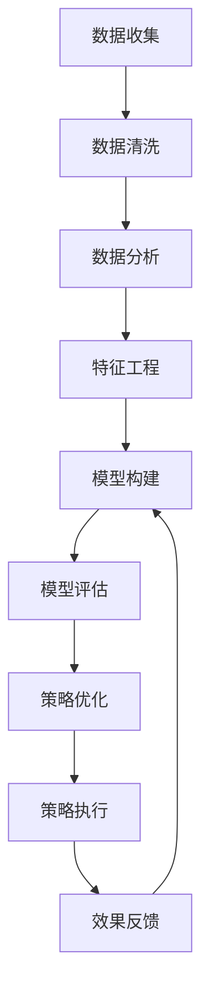

                 

# 促销策略优化：AI的案例

> 关键词：AI, 促销策略, 数据分析, 模型优化, 客户行为, 需求预测

## 1. 背景介绍

### 1.1 问题由来

在当今数字化时代，企业通过促销活动来提升销售额、提高市场份额已成为常见做法。然而，促销策略的成功往往依赖于对市场趋势的敏锐洞察和对客户需求的精准把握。传统的促销策略制定往往依赖经验或者简单的市场调查，但在数据日益丰富的今天，企业越来越需要依赖数据分析和人工智能技术来辅助决策。AI不仅能够处理海量数据，还能从数据中提取深入的洞见，从而实现更高效、更精准的促销策略优化。

### 1.2 问题核心关键点

在促销策略优化中，AI主要通过以下核心关键点发挥作用：

1. **数据驱动决策**：利用客户数据、市场趋势、销售数据等多维度的数据，构建准确的预测模型，为促销策略提供数据支持。
2. **个性化营销**：通过分析客户行为和偏好，实现个性化推荐和促销，提高客户满意度和转化率。
3. **实时调整**：基于实时反馈和市场变化，快速调整促销策略，确保策略始终有效。
4. **效果评估**：通过模型评估和客户反馈，优化促销策略，确保投入产出比最大化。

### 1.3 问题研究意义

利用AI优化促销策略，对企业具有重要意义：

1. **提高销售效率**：通过精确的预测和个性化的推荐，最大化促销效果，提高销售额。
2. **降低运营成本**：优化促销资源配置，减少无效投入，降低运营成本。
3. **增强市场竞争力**：基于深入的市场洞察，制定更有效的促销策略，提升企业市场竞争力。
4. **提升客户体验**：通过个性化推荐和定制化服务，提升客户满意度和忠诚度。

## 2. 核心概念与联系

### 2.1 核心概念概述

为更好地理解AI在促销策略优化中的应用，本节将介绍几个关键概念：

- **AI（人工智能）**：利用算法和数据，使计算机系统能够执行需要人类智能的任务，如数据分析、模式识别、自然语言处理等。
- **促销策略优化**：通过数据分析和机器学习算法，优化促销活动的策略，提高销售效率和客户满意度。
- **数据分析**：通过收集和分析客户数据、市场数据等，提取有价值的洞见，支持决策制定。
- **预测模型**：基于历史数据和特征，构建模型预测未来趋势，支持促销策略的制定。
- **客户行为分析**：通过分析客户在各个渠道的行为，了解其偏好和需求，实现个性化营销。
- **模型评估**：通过评估促销策略的效果，不断优化模型和策略。

这些概念之间的联系可以简要概括为：AI技术利用数据分析和机器学习模型，从海量数据中提取有价值的洞见，支持促销策略的制定和优化，从而提高销售效率和客户满意度。

### 2.2 核心概念原理和架构的 Mermaid 流程图



## 3. 核心算法原理 & 具体操作步骤

### 3.1 算法原理概述

促销策略优化中的核心算法原理包括以下几个方面：

1. **数据收集与清洗**：收集客户数据、市场数据、销售数据等多维度数据，并进行清洗，去除异常值和噪音。
2. **特征工程**：从清洗后的数据中提取有意义的特征，如客户历史购买记录、浏览记录、人口统计信息等。
3. **预测模型构建**：基于特征工程的结果，构建预测模型，如线性回归、逻辑回归、决策树、随机森林、神经网络等，预测未来的销售趋势。
4. **模型评估**：使用历史数据对模型进行评估，如均方误差（MSE）、均方根误差（RMSE）、准确率、召回率等指标，选择性能最优的模型。
5. **策略优化**：基于评估结果，优化促销策略，如确定促销时间、促销对象、促销手段等。
6. **策略执行与反馈**：将优化后的策略执行，并根据实际效果进行反馈，不断调整和优化策略。

### 3.2 算法步骤详解

1. **数据收集与清洗**：
   - 使用API或爬虫技术，从不同渠道（如CRM系统、电商平台、社交媒体等）收集客户数据和市场数据。
   - 对收集到的数据进行清洗，去除缺失值、异常值和噪音，确保数据质量。

2. **特征工程**：
   - 根据业务需求，选择和构造有意义的特征，如客户历史购买记录、浏览记录、人口统计信息、消费行为等。
   - 使用特征选择技术，选择对预测目标影响较大的特征。
   - 对特征进行标准化或归一化，确保模型训练的稳定性和准确性。

3. **预测模型构建**：
   - 选择适当的预测模型，如线性回归、逻辑回归、随机森林等，根据业务需求进行训练。
   - 使用交叉验证技术，评估模型的泛化能力。
   - 调整模型参数，优化模型性能。

4. **模型评估**：
   - 使用历史数据对模型进行评估，计算模型性能指标，如MSE、RMSE、准确率、召回率等。
   - 使用混淆矩阵、ROC曲线等可视化工具，直观展示模型性能。
   - 根据评估结果，选择性能最优的模型。

5. **策略优化**：
   - 基于评估结果，制定优化策略，如确定促销时间、促销对象、促销手段等。
   - 使用A/B测试等方法，验证优化策略的有效性。
   - 根据测试结果，调整和优化策略。

6. **策略执行与反馈**：
   - 执行优化后的策略，并实时监控销售数据和客户反馈。
   - 根据执行效果，调整和优化策略，确保策略始终有效。

### 3.3 算法优缺点

AI在促销策略优化中的应用具有以下优点：

1. **数据驱动**：利用大数据和算法，提取有价值的洞见，支持决策制定。
2. **预测准确**：基于历史数据和模型，准确预测未来趋势，提高决策的科学性。
3. **个性化推荐**：通过分析客户行为和偏好，实现个性化营销，提高客户满意度和转化率。
4. **实时调整**：基于实时反馈和市场变化，快速调整促销策略，确保策略始终有效。
5. **效果评估**：通过模型评估和客户反馈，优化促销策略，确保投入产出比最大化。

同时，AI在促销策略优化中也存在一些局限：

1. **数据质量依赖**：模型的效果高度依赖于数据的质量，数据偏差可能导致模型失效。
2. **模型复杂性**：复杂的预测模型可能导致计算资源消耗较大，影响模型训练和推理速度。
3. **策略透明度不足**：黑盒模型难以解释其内部决策逻辑，导致策略透明度不足。
4. **成本高**：构建和维护AI系统需要投入较高的人力和物力成本。
5. **业务适应性**：需要适应不同的业务场景和需求，模型泛化能力可能受到限制。

### 3.4 算法应用领域

AI在促销策略优化中的应用广泛，主要涵盖以下几个领域：

1. **电子商务**：利用AI分析客户行为，实现个性化推荐和促销，提高销售额和客户满意度。
2. **零售**：通过预测销售趋势，制定精准的促销策略，优化库存管理，提升运营效率。
3. **金融**：基于客户交易数据，预测市场趋势，制定更有效的促销策略，提高客户粘性。
4. **医疗**：分析患者行为数据，制定个性化的健康促进策略，提高患者依从性和治疗效果。
5. **旅游**：通过分析游客行为数据，制定个性化的旅游促销策略，提升游客体验和转化率。

## 4. 数学模型和公式 & 详细讲解 & 举例说明

### 4.1 数学模型构建

促销策略优化的数学模型主要包括以下几个部分：

1. **客户行为数据**：如客户购买历史、浏览记录、点击行为等。
2. **市场数据**：如季节性变化、节假日、促销活动等。
3. **销售数据**：如销售额、利润率、库存水平等。

### 4.2 公式推导过程

以线性回归模型为例，其公式推导过程如下：

$$
y = \beta_0 + \beta_1 x_1 + \beta_2 x_2 + \ldots + \beta_n x_n + \epsilon
$$

其中：
- $y$：预测的目标值，如销售额。
- $\beta_0$：截距项。
- $\beta_1, \beta_2, \ldots, \beta_n$：各个特征的系数。
- $x_1, x_2, \ldots, x_n$：各个特征值，如客户历史购买记录、浏览记录等。
- $\epsilon$：误差项，表示模型预测误差。

### 4.3 案例分析与讲解

以某电商平台的促销策略优化为例：

1. **数据收集**：
   - 从电商平台收集客户购买历史、浏览记录、客户评价等数据。
   - 从市场数据中获取节假日、季节性变化、促销活动等特征。

2. **特征工程**：
   - 提取客户购买历史、浏览记录、客户评价等特征。
   - 对数据进行标准化处理，确保模型训练的稳定性和准确性。

3. **模型构建**：
   - 选择线性回归模型，并使用历史数据进行训练。
   - 使用交叉验证技术，评估模型性能。

4. **模型评估**：
   - 计算模型的MSE、RMSE等性能指标。
   - 使用混淆矩阵、ROC曲线等可视化工具，展示模型效果。

5. **策略优化**：
   - 基于模型评估结果，制定优化策略，如确定促销时间、促销对象、促销手段等。
   - 使用A/B测试等方法，验证优化策略的有效性。

6. **策略执行与反馈**：
   - 执行优化后的策略，并实时监控销售数据和客户反馈。
   - 根据执行效果，调整和优化策略，确保策略始终有效。

## 5. 项目实践：代码实例和详细解释说明

### 5.1 开发环境搭建

在进行促销策略优化项目时，需要搭建一个支持Python和相关库的环境。以下是一个简单的开发环境搭建步骤：

1. **安装Python**：
   - 下载并安装Python 3.8或更高版本。
   - 在环境中添加Python到系统路径。

2. **安装相关库**：
   - 安装numpy、pandas、scikit-learn等常用库。
   - 安装TensorFlow、PyTorch等深度学习库。
   - 安装flask、dask等Web和分布式计算库。

3. **配置环境**：
   - 配置pip、virtualenv等工具，创建虚拟环境。
   - 配置Docker、Kubernetes等容器化工具，方便部署和管理。

### 5.2 源代码详细实现

以下是一个简单的促销策略优化项目的代码实现，以线性回归模型为例：

```python
import pandas as pd
from sklearn.linear_model import LinearRegression
from sklearn.model_selection import train_test_split
from sklearn.metrics import mean_squared_error, r2_score

# 数据加载
data = pd.read_csv('sales_data.csv')

# 特征选择
features = ['purchase_history', 'browsing_time', 'customer_age', 'customer_gender']
target = 'sales'

# 数据预处理
X = data[features]
y = data[target]
X_train, X_test, y_train, y_test = train_test_split(X, y, test_size=0.2, random_state=42)

# 模型训练
model = LinearRegression()
model.fit(X_train, y_train)

# 模型评估
y_pred = model.predict(X_test)
mse = mean_squared_error(y_test, y_pred)
rmse = mean_squared_error(y_test, y_pred, squared=False)
r2 = r2_score(y_test, y_pred)

# 结果展示
print(f"MSE: {mse:.2f}")
print(f"RMSE: {rmse:.2f}")
print(f"R^2: {r2:.2f}")
```

### 5.3 代码解读与分析

1. **数据加载**：
   - 使用pandas库加载销售数据CSV文件。

2. **特征选择**：
   - 选择对销售额影响较大的特征，如客户历史购买记录、浏览时间、客户年龄等。

3. **数据预处理**：
   - 使用train_test_split函数将数据集划分为训练集和测试集。
   - 对数据进行标准化处理，确保模型训练的稳定性和准确性。

4. **模型训练**：
   - 选择线性回归模型，并使用训练集数据进行训练。

5. **模型评估**：
   - 使用测试集数据进行模型预测，计算模型性能指标，如MSE、RMSE、R^2等。

6. **结果展示**：
   - 输出模型的性能指标，评估模型效果。

## 6. 实际应用场景

### 6.1 电子商务

在电子商务中，利用AI优化促销策略可以提高客户转化率和销售额。以下是一个简单的应用场景：

1. **数据收集**：
   - 从电商平台收集客户购买历史、浏览记录、评价等数据。
   - 从市场数据中获取节假日、季节性变化、促销活动等特征。

2. **特征工程**：
   - 提取客户购买历史、浏览记录、评价等特征。
   - 对数据进行标准化处理，确保模型训练的稳定性和准确性。

3. **模型构建**：
   - 选择适当的预测模型，如线性回归、随机森林等，根据业务需求进行训练。

4. **模型评估**：
   - 使用历史数据对模型进行评估，计算模型性能指标，如MSE、RMSE、准确率等。

5. **策略优化**：
   - 基于评估结果，制定优化策略，如确定促销时间、促销对象、促销手段等。
   - 使用A/B测试等方法，验证优化策略的有效性。

6. **策略执行与反馈**：
   - 执行优化后的策略，并实时监控销售数据和客户反馈。
   - 根据执行效果，调整和优化策略，确保策略始终有效。

### 6.2 金融

在金融领域，利用AI优化促销策略可以提高客户粘性和交易量。以下是一个简单的应用场景：

1. **数据收集**：
   - 从银行系统收集客户交易历史、消费行为等数据。
   - 从市场数据中获取季节性变化、节假日、促销活动等特征。

2. **特征工程**：
   - 提取客户交易历史、消费行为等特征。
   - 对数据进行标准化处理，确保模型训练的稳定性和准确性。

3. **模型构建**：
   - 选择适当的预测模型，如线性回归、随机森林等，根据业务需求进行训练。

4. **模型评估**：
   - 使用历史数据对模型进行评估，计算模型性能指标，如MSE、RMSE、准确率等。

5. **策略优化**：
   - 基于评估结果，制定优化策略，如确定促销时间、促销对象、促销手段等。
   - 使用A/B测试等方法，验证优化策略的有效性。

6. **策略执行与反馈**：
   - 执行优化后的策略，并实时监控交易数据和客户反馈。
   - 根据执行效果，调整和优化策略，确保策略始终有效。

### 6.3 医疗

在医疗领域，利用AI优化促销策略可以提高患者依从性和治疗效果。以下是一个简单的应用场景：

1. **数据收集**：
   - 从医疗系统收集患者健康数据、就诊记录等数据。
   - 从市场数据中获取季节性变化、节假日、促销活动等特征。

2. **特征工程**：
   - 提取患者健康数据、就诊记录等特征。
   - 对数据进行标准化处理，确保模型训练的稳定性和准确性。

3. **模型构建**：
   - 选择适当的预测模型，如线性回归、随机森林等，根据业务需求进行训练。

4. **模型评估**：
   - 使用历史数据对模型进行评估，计算模型性能指标，如MSE、RMSE、准确率等。

5. **策略优化**：
   - 基于评估结果，制定优化策略，如确定促销时间、促销对象、促销手段等。
   - 使用A/B测试等方法，验证优化策略的有效性。

6. **策略执行与反馈**：
   - 执行优化后的策略，并实时监控健康数据和患者反馈。
   - 根据执行效果，调整和优化策略，确保策略始终有效。

## 7. 工具和资源推荐

### 7.1 学习资源推荐

1. **《Python机器学习基础》**：介绍机器学习基础和常用算法，适合入门学习。
2. **《深度学习框架PyTorch入门与实战》**：详细讲解PyTorch框架的使用，适合实践操作。
3. **《TensorFlow实战》**：详细介绍TensorFlow框架的使用和实战案例，适合深度学习开发。
4. **《数据分析与Python实战》**：介绍数据分析基础和常用技术，适合数据处理和分析。
5. **《机器学习实战案例》**：结合实际案例，讲解机器学习算法的应用，适合实战练习。

### 7.2 开发工具推荐

1. **Jupyter Notebook**：一个强大的交互式编程环境，支持Python和多种库，方便数据处理和模型训练。
2. **TensorFlow**：由Google开发的深度学习框架，支持分布式计算和模型部署，适合大规模模型训练。
3. **PyTorch**：一个灵活的深度学习框架，支持动态图和静态图，适合研究和实验。
4. **Pandas**：一个强大的数据处理库，支持数据清洗、转换和分析。
5. **Scikit-learn**：一个机器学习库，支持分类、回归、聚类等常用算法。

### 7.3 相关论文推荐

1. **《深度学习在促销策略优化中的应用》**：介绍深度学习在促销策略优化中的应用，适合了解前沿研究方向。
2. **《基于机器学习的客户行为预测》**：详细介绍机器学习算法在客户行为预测中的应用，适合深入学习。
3. **《个性化推荐系统构建》**：详细介绍个性化推荐系统的构建方法和优化策略，适合实践应用。
4. **《数据驱动的促销策略优化》**：详细介绍数据驱动的促销策略优化方法，适合理论研究。

## 8. 总结：未来发展趋势与挑战

### 8.1 研究成果总结

AI在促销策略优化中的应用已经取得显著成果，主要体现在以下几个方面：

1. **数据驱动决策**：利用大数据和算法，提取有价值的洞见，支持决策制定。
2. **预测准确**：基于历史数据和模型，准确预测未来趋势，提高决策的科学性。
3. **个性化推荐**：通过分析客户行为和偏好，实现个性化营销，提高客户满意度和转化率。
4. **实时调整**：基于实时反馈和市场变化，快速调整促销策略，确保策略始终有效。
5. **效果评估**：通过模型评估和客户反馈，优化促销策略，确保投入产出比最大化。

### 8.2 未来发展趋势

1. **更精确的预测模型**：未来的模型将更加复杂和精准，能够更准确地预测客户行为和市场趋势。
2. **更个性化的推荐**：通过更深入的客户行为分析，实现更加个性化的推荐，提高客户满意度和转化率。
3. **更实时的调整**：利用实时数据和算法，快速调整促销策略，确保策略始终有效。
4. **更全面的数据融合**：结合多模态数据（如图像、视频、语音等），实现更全面的客户行为分析。
5. **更广泛的场景应用**：在更多领域和场景中应用AI技术，实现更广泛的业务优化。

### 8.3 面临的挑战

尽管AI在促销策略优化中取得了显著成效，但仍面临以下挑战：

1. **数据质量和获取**：数据质量和获取成本较高，数据偏差可能导致模型失效。
2. **模型复杂度和计算资源**：复杂的预测模型可能导致计算资源消耗较大，影响模型训练和推理速度。
3. **策略透明度和可解释性**：黑盒模型难以解释其内部决策逻辑，导致策略透明度不足。
4. **业务适应性和泛化能力**：需要适应不同的业务场景和需求，模型泛化能力可能受到限制。
5. **伦理和法律问题**：需要确保算法的公平性、透明性和安全性，避免产生偏见和歧视。

### 8.4 研究展望

未来的研究需要从以下几个方面进行突破：

1. **更高效的数据处理技术**：开发更高效的数据清洗、预处理和特征工程技术，降低数据获取和处理成本。
2. **更轻量级的模型**：开发更轻量级的模型，减少计算资源消耗，提高模型训练和推理速度。
3. **更透明的算法**：开发更透明的算法，提高模型的可解释性和可理解性，确保策略透明度。
4. **更广泛的业务适应**：开发更广泛的业务适应性模型，提高模型的泛化能力和适应性。
5. **更强的伦理和法律保障**：制定更严格的伦理和法律规范，确保算法的公平性、透明性和安全性。

## 9. 附录：常见问题与解答

**Q1: 如何构建一个有效的促销策略优化模型？**

A: 构建一个有效的促销策略优化模型，需要以下步骤：

1. **数据收集与清洗**：收集和清洗客户数据、市场数据、销售数据等多维度数据。
2. **特征工程**：从清洗后的数据中提取有意义的特征，并进行标准化处理。
3. **模型选择与训练**：选择适当的预测模型，如线性回归、逻辑回归、随机森林等，并使用历史数据进行训练。
4. **模型评估**：使用历史数据对模型进行评估，计算模型性能指标。
5. **策略优化**：基于评估结果，制定优化策略，如确定促销时间、促销对象、促销手段等。
6. **策略执行与反馈**：执行优化后的策略，并实时监控销售数据和客户反馈，不断调整和优化策略。

**Q2: 在促销策略优化中，如何处理数据偏差问题？**

A: 处理数据偏差问题，可以采取以下措施：

1. **数据收集**：收集多样化的数据，避免单一数据源带来的偏差。
2. **数据清洗**：对数据进行清洗，去除异常值和噪音。
3. **特征工程**：选择合适的特征，避免不相关或有害特征的影响。
4. **模型训练**：使用多个模型进行交叉验证，确保模型泛化能力。
5. **模型调整**：根据数据偏差调整模型参数，确保模型公平性和透明性。

**Q3: 如何提高模型的可解释性和透明度？**

A: 提高模型的可解释性和透明度，可以采取以下措施：

1. **模型简化**：使用更简单的模型，减少计算资源消耗，提高模型透明度。
2. **特征选择**：选择合适的特征，避免不相关或有害特征的影响。
3. **可视化工具**：使用可视化工具，展示模型决策过程和特征重要性。
4. **模型解释**：开发模型解释工具，帮助用户理解模型决策逻辑。

**Q4: 如何在不同的业务场景中应用AI优化促销策略？**

A: 在不同的业务场景中应用AI优化促销策略，需要根据具体业务需求进行调整和优化：

1. **电子商务**：利用AI分析客户行为，实现个性化推荐和促销，提高销售额和客户满意度。
2. **零售**：通过预测销售趋势，制定精准的促销策略，优化库存管理，提升运营效率。
3. **金融**：基于客户交易数据，预测市场趋势，制定更有效的促销策略，提高客户粘性。
4. **医疗**：分析患者行为数据，制定个性化的健康促进策略，提高患者依从性和治疗效果。

---

作者：禅与计算机程序设计艺术 / Zen and the Art of Computer Programming

