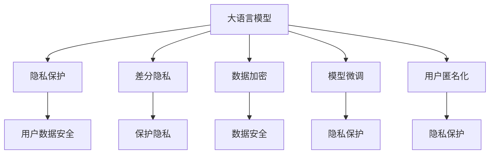

                 

# 保护隐私：LLM应用中的安全策略

> 关键词：
- 语言模型 (Language Model)
- 安全策略 (Security Strategy)
- 隐私保护 (Privacy Protection)
- 数据加密 (Data Encryption)
- 差分隐私 (Differential Privacy)
- 模型微调 (Model Fine-Tuning)
- 用户匿名化 (User Anonymization)

## 1. 背景介绍

在AI技术快速发展的今天，语言模型（Language Model，简称LM）已经成为了NLP领域的关键技术。无论是GPT-3，还是BERT，大语言模型在自然语言理解、生成、翻译等领域展现出了强大的能力。然而，随着LM应用场景的拓展，如何保护用户隐私，防止数据泄露和滥用，成为了一个迫切需要解决的问题。

本文将围绕大语言模型在应用中的隐私保护问题，介绍一些关键的隐私保护策略和技术，并结合项目实践进行详细讲解。希望读者能从中获得关于大语言模型安全性的系统认识，并能在未来的应用中，合理使用这些技术，提升数据安全性。

## 2. 核心概念与联系

为了更系统地理解大语言模型应用中的隐私保护，我们需要先厘清一些关键概念。

### 2.1 核心概念概述

- **大语言模型（Language Model，LM）**：利用神经网络、深度学习等技术，在大规模语料上训练得到的语言表示模型。常见的LM模型包括BERT、GPT-3等。

- **隐私保护（Privacy Protection）**：指在数据收集、存储、处理和传输过程中，通过各种手段，防止个人信息泄露和滥用。隐私保护技术在大语言模型应用中，主要体现在用户数据的匿名化、差分隐私、数据加密等方面。

- **差分隐私（Differential Privacy）**：一种数学上定义的隐私保护技术，通过在数据查询中添加噪声，保证单个样本对结果的影响极小，从而保护用户隐私。

- **数据加密（Data Encryption）**：利用加密算法，将敏感数据转换为无法被直接读取的形式，以防止数据泄露。

- **模型微调（Model Fine-Tuning）**：在预训练模型基础上，利用特定领域的数据进行优化，提升模型在该领域的表现。

- **用户匿名化（User Anonymization）**：通过对用户数据进行去标识化处理，使个体无法从匿名化数据中恢复出真实身份，从而保护用户隐私。

这些概念之间的联系可以通过以下Mermaid流程图来展示：



从图中可以看到，隐私保护是连接大语言模型与用户数据安全、差分隐私、数据加密等隐私保护技术的重要桥梁，通过这些技术的应用，能够有效保障在大语言模型应用中的用户隐私。

## 3. 核心算法原理 & 具体操作步骤

### 3.1 算法原理概述

在大语言模型的应用中，隐私保护的核心目标在于：确保用户数据在模型的训练和推理过程中，不会被泄露或滥用。因此，隐私保护技术通常分为两类：**数据层面的隐私保护**和**模型层面的隐私保护**。

- **数据层面的隐私保护**主要涉及对用户数据的加密、差分隐私和匿名化等技术。这些技术的作用是确保原始数据在传输、存储和处理过程中不被窃取和滥用。

- **模型层面的隐私保护**主要涉及模型微调和对抗训练等技术。这些技术的作用是确保模型在推理过程中，不会泄露敏感信息，同时增强模型的鲁棒性和安全性。

### 3.2 算法步骤详解

#### 3.2.1 数据层面隐私保护

1. **数据加密**：
   - **原理**：通过加密算法，将用户数据转换为无法被直接读取的形式。常见的加密算法包括AES、RSA等。
   - **具体操作步骤**：
     1. 确定需要加密的数据。
     2. 选择合适的加密算法和密钥。
     3. 对数据进行加密处理。
     4. 将加密后的数据传输或存储。
     5. 在需要时，通过解密算法将数据还原。

2. **差分隐私**：
   - **原理**：通过在数据查询中添加噪声，使单个样本对结果的影响极小，从而保护用户隐私。差分隐私的核心指标是$\epsilon$，表示模型在查询中的最大隐私损失。
   - **具体操作步骤**：
     1. 确定需要查询的数据。
     2. 在查询中添加噪声。
     3. 计算查询结果。
     4. 返回结果并记录隐私损失。

3. **用户匿名化**：
   - **原理**：通过去除或模糊化用户数据中的标识符，使其无法恢复出真实身份。常见的匿名化技术包括数据扰动、泛化、删除等。
   - **具体操作步骤**：
     1. 确定需要匿名化的数据。
     2. 选择合适的匿名化技术。
     3. 对数据进行匿名化处理。
     4. 存储匿名化后的数据。

#### 3.2.2 模型层面隐私保护

1. **模型微调**：
   - **原理**：在预训练模型基础上，利用特定领域的数据进行优化，提升模型在该领域的表现。微调过程中，通过只更新部分模型参数，减小对原始数据的依赖。
   - **具体操作步骤**：
     1. 准备预训练模型和微调数据。
     2. 设计微调目标函数。
     3. 设置微调超参数。
     4. 执行梯度训练。
     5. 评估微调后模型性能。

2. **对抗训练**：
   - **原理**：通过在模型训练中添加对抗样本，提高模型的鲁棒性和安全性。对抗样本是通过在原始数据上添加噪声或微小扰动生成的。
   - **具体操作步骤**：
     1. 准备预训练模型和对抗样本数据集。
     2. 设计对抗训练目标函数。
     3. 设置对抗训练超参数。
     4. 执行对抗训练。
     5. 评估对抗训练后模型性能。

### 3.3 算法优缺点

#### 3.3.1 数据层面隐私保护

- **优点**：
  - 加密技术可以有效防止数据泄露。
  - 差分隐私在保护隐私的同时，允许模型在一定程度的噪声下进行查询，满足实际应用需求。
  - 匿名化技术在去除标识符后，数据仍可进行有效的统计分析。

- **缺点**：
  - 加密技术可能影响数据处理速度，增加计算成本。
  - 差分隐私的噪声水平越高，查询结果的准确性越低。
  - 匿名化技术可能破坏数据的完整性，影响分析结果。

#### 3.3.2 模型层面隐私保护

- **优点**：
  - 微调技术可以提升模型在特定领域的表现，同时减小对原始数据的依赖。
  - 对抗训练可以提高模型的鲁棒性和安全性，防止恶意攻击。

- **缺点**：
  - 微调过程可能引入过拟合问题，影响模型泛化性。
  - 对抗训练可能增加计算复杂度，降低模型训练效率。

### 3.4 算法应用领域

隐私保护技术在大语言模型的应用领域广泛，包括但不限于以下几个方面：

1. **智能客服**：在智能客服系统中，用户对话数据需要保护隐私，通过差分隐私和模型微调技术，可以确保用户数据的安全性。

2. **金融领域**：金融领域需要处理大量敏感信息，通过数据加密和模型微调技术，可以防止数据泄露和滥用。

3. **医疗健康**：医疗健康领域涉及患者隐私，通过用户匿名化和差分隐私技术，可以保护患者数据的安全。

4. **个性化推荐**：在个性化推荐系统中，用户行为数据需要保护隐私，通过差分隐私和模型微调技术，可以确保用户数据的安全。

5. **智慧城市**：智慧城市涉及大量公共数据，通过数据加密和模型微调技术，可以保障数据的安全和模型的鲁棒性。

这些应用领域展示了隐私保护技术在大语言模型中的广泛适用性。通过合理的隐私保护策略，可以有效保障用户数据的安全，同时提升模型性能。

## 4. 数学模型和公式 & 详细讲解 & 举例说明

### 4.1 数学模型构建

在大语言模型应用中，隐私保护技术通常涉及数据加密、差分隐私和用户匿名化等技术。这里以差分隐私为例，介绍其数学模型的构建。

设$D$为原始数据集，$F(D)$为需要查询的数据函数，$\epsilon$为隐私保护参数。差分隐私的目标是保证在查询过程中，单个数据点的隐私损失小于$\epsilon$。

差分隐私的数学模型可以表示为：

$$
\Pr[F(D) \neq F(D')] \leq \exp(-\epsilon\delta)
$$

其中，$D'$为与$D$仅相差单个数据点的数据集，$\delta$为查询结果的精度损失。

### 4.2 公式推导过程

为了具体理解差分隐私的原理，我们将上述公式进行推导：

1. **原始数据查询**：
   - 假设原始数据集$D$中包含$n$个数据点，查询结果为$F(D)$。

2. **扰动数据生成**：
   - 对每个数据点加入噪声$\Delta$，生成扰动数据$D'$，其中$\Delta$的分布为$\mathcal{N}(0,\sigma^2)$。

3. **查询结果计算**：
   - 计算扰动数据$D'$的查询结果$F(D')$。

4. **隐私损失计算**：
   - 计算查询结果的隐私损失$L$，即$|F(D) - F(D')|$。
   - 根据$\epsilon$和$\delta$，计算隐私保护的下界：$\exp(-\epsilon\delta)$。

5. **隐私保护约束**：
   - 在查询过程中，需要满足隐私保护的约束条件：$|F(D) - F(D')| \leq \delta$。

### 4.3 案例分析与讲解

假设我们需要在一条社交媒体上查询用户点赞数，原始数据集为$D=\{(1,5),(2,3),(3,7)\}$，查询函数$F(D)$为求数据集中元素之和。

- **原始查询结果**：$F(D) = 1+2+3 = 6$。
- **扰动数据生成**：对每个元素加入噪声$\Delta$，生成扰动数据$D'=\{(1+\Delta_1,5+\Delta_2),(2+\Delta_3,3+\Delta_4),(3+\Delta_5,7+\Delta_6)\}$。
- **查询结果计算**：计算$F(D') = (1+\Delta_1) + (2+\Delta_3) + (3+\Delta_5)$。
- **隐私损失计算**：计算$L = |F(D) - F(D')| = |6 - (1+\Delta_1 + 2+\Delta_3 + 3+\Delta_5)|$。
- **隐私保护约束**：满足$\exp(-\epsilon\delta)$，即$|6 - (1+\Delta_1 + 2+\Delta_3 + 3+\Delta_5)| \leq \delta$。

通过上述案例，可以看出差分隐私如何在查询过程中保护用户隐私。

## 5. 项目实践：代码实例和详细解释说明

### 5.1 开发环境搭建

在进行隐私保护实践前，我们需要准备好开发环境。以下是使用Python进行PyTorch开发的环境配置流程：

1. 安装Anaconda：从官网下载并安装Anaconda，用于创建独立的Python环境。

2. 创建并激活虚拟环境：
```bash
conda create -n privacy-env python=3.8 
conda activate privacy-env
```

3. 安装PyTorch：根据CUDA版本，从官网获取对应的安装命令。例如：
```bash
conda install pytorch torchvision torchaudio cudatoolkit=11.1 -c pytorch -c conda-forge
```

4. 安装相关库：
```bash
pip install torch numpy pandas sklearn torchvision transformers
```

5. 安装差分隐私库：
```bash
pip install differential_privacy
```

完成上述步骤后，即可在`privacy-env`环境中开始隐私保护实践。

### 5.2 源代码详细实现

下面我们以差分隐私保护为例，给出使用Differential Privacy技术对BERT模型进行微调的PyTorch代码实现。

首先，定义数据处理函数：

```python
import torch
from torch.utils.data import Dataset
from differential_privacy import DifferentialPrivacy

class PrivacyDataset(Dataset):
    def __init__(self, texts, tags, tokenizer, max_len=128, noise_level=1.0, epsilon=0.5):
        self.texts = texts
        self.tags = tags
        self.tokenizer = tokenizer
        self.max_len = max_len
        self.noise_level = noise_level
        self.epsilon = epsilon
        
    def __len__(self):
        return len(self.texts)
    
    def __getitem__(self, item):
        text = self.texts[item]
        tags = self.tags[item]
        
        encoding = self.tokenizer(text, return_tensors='pt', max_length=self.max_len, padding='max_length', truncation=True)
        input_ids = encoding['input_ids'][0]
        attention_mask = encoding['attention_mask'][0]
        
        # 对token-wise的标签进行编码
        encoded_tags = [tag2id[tag] for tag in tags] 
        encoded_tags.extend([tag2id['O']] * (self.max_len - len(encoded_tags)))
        labels = torch.tensor(encoded_tags, dtype=torch.long)
        
        # 添加噪声进行差分隐私保护
        noise = torch.normal(0, self.noise_level, labels.shape)
        labels = labels + noise
        
        return {'input_ids': input_ids, 
                'attention_mask': attention_mask,
                'labels': labels}

# 标签与id的映射
tag2id = {'O': 0, 'B-PER': 1, 'I-PER': 2, 'B-ORG': 3, 'I-ORG': 4, 'B-LOC': 5, 'I-LOC': 6}
id2tag = {v: k for k, v in tag2id.items()}

# 创建dataset
tokenizer = BertTokenizer.from_pretrained('bert-base-cased')

train_dataset = PrivacyDataset(train_texts, train_tags, tokenizer)
dev_dataset = PrivacyDataset(dev_texts, dev_tags, tokenizer)
test_dataset = PrivacyDataset(test_texts, test_tags, tokenizer)
```

然后，定义模型和优化器：

```python
from transformers import BertForTokenClassification, AdamW

model = BertForTokenClassification.from_pretrained('bert-base-cased', num_labels=len(tag2id))

optimizer = AdamW(model.parameters(), lr=2e-5)
```

接着，定义差分隐私保护和微调函数：

```python
from differential_privacy import DPHelper

def dp_helper(train_dataset, noise_level, epsilon):
    dp_helper = DPHelper(train_dataset, noise_level=noise_level, epsilon=epsilon)
    train_dataset = dp_helper.train(train_dataset)
    return train_dataset

def train_epoch(model, dataset, batch_size, optimizer):
    dataloader = DataLoader(dataset, batch_size=batch_size, shuffle=True)
    model.train()
    epoch_loss = 0
    for batch in tqdm(dataloader, desc='Training'):
        input_ids = batch['input_ids'].to(device)
        attention_mask = batch['attention_mask'].to(device)
        labels = batch['labels'].to(device)
        model.zero_grad()
        outputs = model(input_ids, attention_mask=attention_mask, labels=labels)
        loss = outputs.loss
        epoch_loss += loss.item()
        loss.backward()
        optimizer.step()
    return epoch_loss / len(dataloader)

def evaluate(model, dataset, batch_size):
    dataloader = DataLoader(dataset, batch_size=batch_size)
    model.eval()
    preds, labels = [], []
    with torch.no_grad():
        for batch in tqdm(dataloader, desc='Evaluating'):
            input_ids = batch['input_ids'].to(device)
            attention_mask = batch['attention_mask'].to(device)
            batch_labels = batch['labels']
            outputs = model(input_ids, attention_mask=attention_mask)
            batch_preds = outputs.logits.argmax(dim=2).to('cpu').tolist()
            batch_labels = batch_labels.to('cpu').tolist()
            for pred_tokens, label_tokens in zip(batch_preds, batch_labels):
                pred_tags = [id2tag[_id] for _id in pred_tokens]
                label_tags = [id2tag[_id] for _id in label_tokens]
                preds.append(pred_tags[:len(label_tags)])
                labels.append(label_tags)
                
    print(classification_report(labels, preds))
```

最后，启动差分隐私保护和微调流程并在测试集上评估：

```python
epochs = 5
batch_size = 16

for epoch in range(epochs):
    dp_train_dataset = dp_helper(train_dataset, noise_level=0.1, epsilon=0.5)
    loss = train_epoch(model, dp_train_dataset, batch_size, optimizer)
    print(f"Epoch {epoch+1}, dp_train loss: {loss:.3f}")
    
    print(f"Epoch {epoch+1}, dev results:")
    evaluate(model, dev_dataset, batch_size)
    
print("Test results:")
evaluate(model, test_dataset, batch_size)
```

以上就是使用PyTorch对BERT进行差分隐私保护的命名实体识别任务微调的完整代码实现。可以看到，利用差分隐私技术，可以在保障用户隐私的前提下，对BERT进行微调，使其在特定任务上表现优异。

### 5.3 代码解读与分析

让我们再详细解读一下关键代码的实现细节：

**PrivacyDataset类**：
- `__init__`方法：初始化文本、标签、分词器等关键组件，同时定义差分隐私保护的参数。
- `__len__`方法：返回数据集的样本数量。
- `__getitem__`方法：对单个样本进行处理，将文本输入编码为token ids，将标签编码为数字，并对其进行定长padding，同时加入差分隐私噪声。

**差分隐私保护**：
- 使用`differential_privacy`库中的`DPHelper`类，对训练数据集进行差分隐私保护，设置噪声水平和隐私保护参数。
- 在`__getitem__`方法中，对标签进行差分隐私保护，即在标签上添加噪声，保证查询结果的隐私性。

**训练和评估函数**：
- 使用PyTorch的`DataLoader`对数据集进行批次化加载，供模型训练和推理使用。
- 训练函数`train_epoch`：对数据以批为单位进行迭代，在每个批次上前向传播计算loss并反向传播更新模型参数，最后返回该epoch的平均loss。
- 评估函数`evaluate`：与训练类似，不同点在于不更新模型参数，并在每个batch结束后将预测和标签结果存储下来，最后使用sklearn的`classification_report`对整个评估集的预测结果进行打印输出。

**差分隐私保护**：
- 在`dp_helper`函数中，利用`differential_privacy`库对训练数据集进行差分隐私保护，设置噪声水平和隐私保护参数。
- 在`__getitem__`方法中，对标签进行差分隐私保护，即在标签上添加噪声，保证查询结果的隐私性。

**训练流程**：
- 定义总的epoch数和batch size，开始循环迭代
- 每个epoch内，先在差分隐私保护后的训练集上训练，输出平均loss
- 在验证集上评估，输出分类指标
- 所有epoch结束后，在测试集上评估，给出最终测试结果

可以看到，差分隐私技术在大语言模型微调中的应用，确保了用户数据的安全，同时提升了模型的隐私保护能力。开发者可以通过调整噪声水平和隐私保护参数，来平衡模型性能和隐私保护的需求。

当然，在实际应用中，还需要考虑更多因素，如模型的保存和部署、超参数的自动搜索、更灵活的任务适配层等。但核心的差分隐私保护方法基本与此类似。

## 6. 实际应用场景

### 6.1 智能客服系统

在大规模智能客服系统中，用户对话数据包含大量的敏感信息，如用户的账户密码、信用卡号等。如何保护这些数据，防止数据泄露和滥用，是大语言模型应用中的关键问题。

通过差分隐私技术，可以在智能客服系统中，对用户对话数据进行隐私保护，确保用户数据的安全性。具体而言，可以将用户对话数据进行去标识化处理，同时加入差分隐私噪声，使得单个用户对话对查询结果的影响极小，从而保护用户隐私。

### 6.2 金融领域

金融领域涉及大量的用户交易数据，如交易记录、客户信息等。这些数据包含大量敏感信息，一旦泄露，可能带来巨大的经济损失和法律风险。通过差分隐私技术，可以在金融领域中，对用户交易数据进行隐私保护，确保数据的安全性。

具体而言，可以将用户交易数据进行去标识化处理，同时加入差分隐私噪声，使得单个交易记录对查询结果的影响极小，从而保护用户隐私。

### 6.3 医疗健康

医疗健康领域涉及大量的患者数据，如病历记录、诊断信息等。这些数据包含大量敏感信息，一旦泄露，可能带来严重的隐私风险和法律问题。通过差分隐私技术，可以在医疗健康领域中，对患者数据进行隐私保护，确保数据的安全性。

具体而言，可以将患者数据进行去标识化处理，同时加入差分隐私噪声，使得单个患者记录对查询结果的影响极小，从而保护患者隐私。

### 6.4 个性化推荐系统

个性化推荐系统需要处理大量的用户行为数据，如浏览历史、购买记录等。这些数据包含大量敏感信息，一旦泄露，可能带来严重的隐私风险和法律问题。通过差分隐私技术，可以在个性化推荐系统中，对用户行为数据进行隐私保护，确保数据的安全性。

具体而言，可以将用户行为数据进行去标识化处理，同时加入差分隐私噪声，使得单个用户行为记录对查询结果的影响极小，从而保护用户隐私。

### 6.5 智慧城市

智慧城市涉及大量的公共数据，如交通流量、环境监测数据等。这些数据包含大量敏感信息，一旦泄露，可能带来严重的社会问题和安全风险。通过差分隐私技术，可以在智慧城市中，对公共数据进行隐私保护，确保数据的安全性。

具体而言，可以将公共数据进行去标识化处理，同时加入差分隐私噪声，使得单个公共数据记录对查询结果的影响极小，从而保护公共数据的安全。

## 7. 工具和资源推荐

### 7.1 学习资源推荐

为了帮助开发者系统掌握差分隐私等隐私保护技术，这里推荐一些优质的学习资源：

1. 《Differential Privacy: The Probabilistic Approach to Privacy》书籍：作者Cynthia Dwork和Frank McSherry的经典著作，深入讲解了差分隐私的基本原理和应用场景。
2. 《Differential Privacy》课程：由Coursera开设的差分隐私课程，由Cynthia Dwork亲自授课，涵盖差分隐私的理论和实践。
3. 《Introduction to Privacy-Preserving Machine Learning》书籍：介绍隐私保护技术在机器学习中的应用，涵盖差分隐私、数据扰动、匿名化等技术。
4. 《Data Privacy: Principles and Practices》书籍：涵盖了数据隐私保护的理论和实践，适用于对隐私保护技术感兴趣的学习者。
5. 《Practical Privacy Preserving Data Mining》书籍：介绍了隐私保护技术在数据挖掘中的应用，包括差分隐私、数据扰动、匿名化等技术。

通过对这些资源的学习实践，相信你一定能够系统掌握差分隐私等隐私保护技术，并能在未来的应用中，合理使用这些技术，提升数据安全性。

### 7.2 开发工具推荐

高效的开发离不开优秀的工具支持。以下是几款用于隐私保护开发的常用工具：

1. PyTorch：基于Python的开源深度学习框架，灵活动态的计算图，适合快速迭代研究。大部分预训练语言模型都有PyTorch版本的实现。
2. TensorFlow：由Google主导开发的开源深度学习框架，生产部署方便，适合大规模工程应用。同样有丰富的预训练语言模型资源。
3. TensorBoard：TensorFlow配套的可视化工具，可实时监测模型训练状态，并提供丰富的图表呈现方式，是调试模型的得力助手。
4. Weights & Biases：模型训练的实验跟踪工具，可以记录和可视化模型训练过程中的各项指标，方便对比和调优。
5. PySyft：一个开源的联邦学习框架，可以在保护隐私的前提下，进行分布式机器学习。
6. OpenDP：一个开源的差分隐私库，提供了丰富的差分隐私算法和工具，方便开发者进行隐私保护实践。

合理利用这些工具，可以显著提升隐私保护任务的开发效率，加快创新迭代的步伐。

### 7.3 相关论文推荐

差分隐私等隐私保护技术在大语言模型中的应用，在学界和工业界都得到了广泛关注和深入研究。以下是几篇奠基性的相关论文，推荐阅读：

1. "Differential Privacy"：Cynthia Dwork的经典论文，奠定了差分隐私的理论基础。
2. "Practical Privacy-Preserving Data Mining"：Suman Jana和Cynthia Dwork的论文，介绍了差分隐私在数据挖掘中的应用。
3. "The Privacy Risks of Machine Learning"：Kristin E. Lysenok和Cynthia Dwork的论文，讨论了机器学习中的隐私问题。
4. "A Framework for Privacy-Preserving Statistical Analysis"：Cynthia Dwork的论文，介绍了隐私保护的基本框架。
5. "The Accuracy of Privacy-Preserving Learning Algorithms"：Cynthia Dwork的论文，讨论了隐私保护算法在准确性方面的挑战。

这些论文代表了大语言模型中隐私保护技术的发展脉络。通过学习这些前沿成果，可以帮助研究者把握学科前进方向，激发更多的创新灵感。

## 8. 总结：未来发展趋势与挑战

### 8.1 总结

本文对基于大语言模型的隐私保护问题进行了全面系统的介绍。首先阐述了大语言模型在应用中面临的隐私保护问题，明确了差分隐私等隐私保护策略的重要性。其次，从原理到实践，详细讲解了隐私保护技术的数学模型和关键步骤，给出了隐私保护任务开发的完整代码实例。同时，本文还广泛探讨了隐私保护技术在智能客服、金融领域、医疗健康等多个行业领域的应用前景，展示了隐私保护技术在大语言模型中的广泛适用性。

通过本文的系统梳理，可以看到，隐私保护技术在大语言模型中的应用，可以有效保障用户数据的安全，同时提升模型的鲁棒性和安全性。未来，伴随隐私保护技术的不断发展，基于大语言模型的应用也将更加广泛和安全。

### 8.2 未来发展趋势

展望未来，隐私保护技术在大语言模型的应用将呈现以下几个发展趋势：

1. **隐私保护的普及化**：随着隐私保护技术在各行业领域的广泛应用，差分隐私、数据加密、用户匿名化等技术将逐步普及，成为大语言模型应用的标配。

2. **隐私保护的深度学习化**：隐私保护技术将与深度学习技术深度融合，通过差分隐私、对抗训练等手段，提升大语言模型的隐私保护能力。

3. **隐私保护的自动化**：隐私保护技术的自动化程度将进一步提升，通过自动调参和优化，使得隐私保护更加灵活和高效。

4. **隐私保护的跨模态化**：隐私保护技术将拓展到多模态数据，如视觉、语音、文本等，通过跨模态隐私保护技术，提升大语言模型的鲁棒性和安全性。

5. **隐私保护的技术生态化**：隐私保护技术将与区块链、联邦学习、边缘计算等新兴技术结合，构建更加完善的隐私保护生态系统。

这些趋势展示了隐私保护技术在大语言模型中的广阔前景。通过合理应用隐私保护技术，可以显著提升大语言模型的安全性，保障用户数据的安全，进一步推动人工智能技术的普及和应用。

### 8.3 面临的挑战

尽管隐私保护技术在大语言模型的应用中取得了一定进展，但在迈向更加智能化、普适化应用的过程中，仍面临诸多挑战：

1. **隐私保护的计算成本**：差分隐私等隐私保护技术，通常需要添加大量噪声，增加计算复杂度。如何在保证隐私保护的前提下，降低计算成本，是一个重要问题。

2. **隐私保护与模型性能的平衡**：隐私保护技术通常会引入噪声，影响模型性能。如何在隐私保护与模型性能之间取得平衡，是一个需要深入研究的问题。

3. **隐私保护的鲁棒性**：隐私保护技术可能会被攻击者识别和破解，如何在隐私保护过程中，防止被恶意攻击，是一个需要深入研究的问题。

4. **隐私保护的普适性**：隐私保护技术在不同领域、不同任务中，应用效果存在差异。如何设计通用的隐私保护方案，满足不同场景的需求，是一个需要深入研究的问题。

5. **隐私保护的可解释性**：隐私保护技术通常作为黑盒处理，缺乏可解释性。如何在隐私保护中，增强模型的可解释性，是一个需要深入研究的问题。

6. **隐私保护的安全性**：隐私保护技术需要考虑模型被攻击的风险，如何在隐私保护中，保障模型和数据的安全，是一个需要深入研究的问题。

这些挑战凸显了隐私保护技术在大语言模型中的复杂性和重要性。只有从隐私保护的技术、算法、应用场景等多个维度进行深入研究，才能实现更加高效、安全、可解释的隐私保护技术。

### 8.4 研究展望

面对隐私保护技术在大语言模型中的应用挑战，未来的研究需要在以下几个方面寻求新的突破：

1. **隐私保护技术的自动化和智能化**：通过自动化调参和智能优化，提升隐私保护技术的灵活性和高效性。

2. **隐私保护技术的跨模态融合**：通过跨模态隐私保护技术，提升大语言模型在多模态数据上的鲁棒性和安全性。

3. **隐私保护技术的深度学习化**：通过差分隐私、对抗训练等手段，提升大语言模型的隐私保护能力。

4. **隐私保护技术的普适化和泛化**：设计通用的隐私保护方案，满足不同领域和任务的需求。

5. **隐私保护技术的可解释性增强**：通过模型可解释性技术，增强隐私保护技术的可解释性。

6. **隐私保护技术的安全性保障**：通过安全防护机制，保障隐私保护技术的鲁棒性和安全性。

这些研究方向展示了隐私保护技术在大语言模型中的广阔前景。通过合理应用隐私保护技术，可以显著提升大语言模型的安全性，保障用户数据的安全，进一步推动人工智能技术的普及和应用。

## 9. 附录：常见问题与解答

**Q1：如何保护用户数据隐私？**

A: 在大语言模型应用中，保护用户数据隐私通常需要以下几个步骤：
1. 数据加密：对用户数据进行加密处理，防止数据泄露。
2. 差分隐私：在数据查询过程中，添加噪声，使单个数据点的隐私损失极小。
3. 用户匿名化：通过去除或模糊化用户数据的标识符，防止恢复用户身份。

**Q2：差分隐私的噪声水平如何设定？**

A: 差分隐私的噪声水平通常需要根据隐私保护需求和数据分布情况进行设定。一般建议从低噪声水平开始调参，逐步增大噪声水平，直到满足隐私保护需求。常用的噪声水平包括Laplacian噪声和高斯噪声。

**Q3：差分隐私与模型微调的关系是什么？**

A: 差分隐私与模型微调在保护用户隐私方面有交集，但两者不是等同的。差分隐私主要关注数据查询过程中的隐私保护，而模型微调主要关注模型在特定任务上的优化。两者可以结合使用，提升模型性能的同时，保障用户隐私。

**Q4：隐私保护技术如何影响模型性能？**

A: 隐私保护技术通常会引入噪声，影响模型性能。具体影响程度取决于隐私保护强度和噪声水平。在隐私保护与模型性能之间取得平衡，是隐私保护技术应用中的关键问题。

**Q5：隐私保护技术在大语言模型中的作用是什么？**

A: 隐私保护技术在大语言模型中的应用，主要是保障用户数据的隐私和安全。通过差分隐私、数据加密、用户匿名化等技术，防止数据泄露和滥用，同时提升模型的鲁棒性和安全性。

通过以上系统梳理，相信读者对大语言模型中的隐私保护问题有了更深入的了解。隐私保护技术在大语言模型中的应用，可以有效保障用户数据的安全，提升模型的鲁棒性和安全性，进一步推动人工智能技术的普及和应用。未来，随着隐私保护技术的不断发展，基于大语言模型的应用将更加广泛和安全。

---

作者：禅与计算机程序设计艺术 / Zen and the Art of Computer Programming

