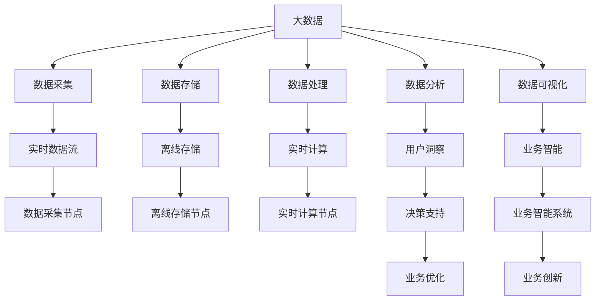

                 

# 信息差的产品管理优化：大数据如何优化产品管理

> 关键词：信息差，产品管理，大数据，数据驱动决策，个性化推荐，用户行为分析

## 1. 背景介绍

### 1.1 问题由来

在快速变化的数字化时代，产品管理已成为企业竞争的关键环节。然而，传统的产品管理方式往往依赖于经验判断，缺乏科学数据支持，导致决策偏差、市场反应迟缓等问题。为了解决这一痛点，大数据和人工智能技术开始被广泛应用，助力企业更精准、高效地进行产品管理。

### 1.2 问题核心关键点

信息差（Information Gap），指的是在产品管理过程中，由于数据获取和利用不足，导致决策者和执行者之间存在的认知偏差和信息不对称。这种信息差不仅影响产品管理的决策质量，还导致资源浪费和市场机会损失。

为解决这一问题，大数据和人工智能技术提供了新的解决方案，通过科学的数据驱动决策，有效缩小信息差，提升产品管理效率和效果。

### 1.3 问题研究意义

消除信息差，优化产品管理，对企业提升市场竞争力、增强用户体验、提升运营效率具有重要意义：

1. **提升决策质量**：通过数据驱动，产品决策将更加科学、客观，减少主观判断带来的偏差。
2. **优化资源配置**：精准的数据分析能够有效识别高潜用户、高价值市场，优化资源配置，提升投资回报率。
3. **增强用户洞察**：大数据分析能够深入理解用户行为和需求，实现个性化推荐和差异化服务，增强用户粘性和满意度。
4. **加速产品迭代**：通过快速获取用户反馈和市场数据，企业能够更灵活、敏捷地进行产品迭代和优化，快速响应市场变化。

## 2. 核心概念与联系

### 2.1 核心概念概述

为更好地理解大数据如何优化产品管理，本节将介绍几个关键概念：

- **大数据（Big Data）**：指体量巨大、结构复杂、多样化的数据集，通常无法通过传统数据库软件进行处理和分析。大数据技术包括数据采集、存储、处理、分析和可视化等环节。

- **产品管理（Product Management）**：指企业通过数据驱动和用户洞察，进行产品规划、开发、推广和优化等活动，以提升产品市场竞争力和用户满意度。

- **数据驱动决策（Data-Driven Decision Making）**：指企业以数据为基础，通过科学分析，做出客观、高效的决策过程。

- **个性化推荐（Personalized Recommendation）**：指根据用户历史行为和偏好，推荐相关产品或内容，提升用户体验和满意度。

- **用户行为分析（User Behavior Analysis）**：指通过数据分析，理解用户行为模式、需求和偏好，为产品优化提供依据。

- **A/B测试（A/B Testing）**：指同时发布两个或多个版本的产品或服务，通过对比用户行为数据，评估各版本的效果，选择最优方案。

### 2.2 核心概念原理和架构的 Mermaid 流程图



这个流程图展示了大数据在产品管理中的核心流程和架构：

1. 通过数据采集和存储，企业收集各类数据。
2. 采用数据处理技术，清洗、转换和聚合数据。
3. 利用数据分析方法，提取有价值的用户洞察和市场信息。
4. 借助数据可视化工具，生成直观的业务智能报告。
5. 最终，通过数据驱动决策，优化产品策略和市场活动。

这些核心概念之间相互联系，共同构成了大数据支持产品管理的全链条。通过科学地应用大数据技术，企业可以更好地把握市场动态、提升产品性能和用户满意度。

## 3. 核心算法原理 & 具体操作步骤

### 3.1 算法原理概述

大数据优化产品管理的核心在于数据驱动决策。通过科学的数据分析和处理，提取有价值的用户洞察和市场信息，帮助企业做出更精准、高效的决策。

具体来说，大数据优化产品管理包括以下几个关键步骤：

1. **数据采集与清洗**：收集并处理企业内外部的各类数据，确保数据质量和一致性。
2. **数据分析与挖掘**：运用统计学、机器学习等方法，分析数据，发现潜在的市场趋势和用户需求。
3. **数据可视化与报告**：通过图表、报表等形式，直观展示数据分析结果，辅助决策。
4. **决策支持与优化**：结合用户洞察和市场分析，制定科学的产品策略和市场活动。

### 3.2 算法步骤详解

以下是大数据优化产品管理的详细步骤：

**Step 1: 数据采集与清洗**

1. **数据源选择**：根据产品管理需求，确定需要收集的数据源，包括内部数据（如销售记录、用户反馈、市场调研等）和外部数据（如社交媒体、市场报告、公开数据等）。
2. **数据采集**：通过API接口、爬虫等方式，自动采集数据。
3. **数据清洗**：清洗重复、缺失、异常的数据，确保数据质量和一致性。

**Step 2: 数据分析与挖掘**

1. **特征工程**：提取和构造有价值的数据特征，如用户年龄、性别、消费行为、用户行为轨迹等。
2. **模型训练**：使用机器学习算法（如回归、分类、聚类等）对数据进行建模分析，提取有价值的信息。
3. **异常检测**：使用统计学方法（如离群点检测、时间序列分析等）识别异常数据或异常行为。

**Step 3: 数据可视化与报告**

1. **数据可视化**：通过图表、仪表盘等形式，直观展示分析结果，如用户画像、市场趋势、销售数据等。
2. **业务智能报告**：编写业务智能报告，分析数据背后的业务洞察和市场机会。
3. **决策支持**：根据业务智能报告，制定科学的产品策略和市场活动。

**Step 4: 决策支持与优化**

1. **产品策略制定**：结合用户洞察和市场分析，制定科学的产品规划和市场活动策略。
2. **市场活动优化**：根据数据分析结果，优化营销、广告等市场活动，提升投资回报率。
3. **产品迭代与优化**：根据用户反馈和市场数据，快速迭代和优化产品，满足用户需求。

### 3.3 算法优缺点

大数据优化产品管理有以下优点：

1. **提升决策质量**：通过科学的数据驱动决策，减少主观判断带来的偏差，提高决策质量。
2. **优化资源配置**：精准的数据分析能够有效识别高潜用户、高价值市场，优化资源配置，提升投资回报率。
3. **增强用户洞察**：大数据分析能够深入理解用户行为和需求，实现个性化推荐和差异化服务，增强用户粘性和满意度。
4. **加速产品迭代**：通过快速获取用户反馈和市场数据，企业能够更灵活、敏捷地进行产品迭代和优化，快速响应市场变化。

同时，该方法也存在一定的局限性：

1. **数据质量依赖**：大数据分析的准确性和有效性依赖于数据质量和完整性，数据收集和清洗成本较高。
2. **算法复杂度**：大数据分析和建模通常涉及复杂的统计学和机器学习算法，对技术要求较高。
3. **隐私和安全问题**：大数据分析涉及大量敏感用户数据，需要严格的数据隐私保护和安全措施。
4. **实时性不足**：大数据分析通常基于离线数据，无法实时响应市场变化和用户需求。
5. **成本高昂**：大数据处理和分析需要高性能计算资源，成本较高。

尽管存在这些局限性，但就目前而言，大数据优化产品管理仍是一种高效、科学的产品管理方式。未来相关研究的重点在于如何进一步降低数据获取和处理的成本，提高实时性和算法效率，同时兼顾数据隐私和安全。

### 3.4 算法应用领域

大数据优化产品管理的应用领域非常广泛，包括但不限于以下几个方面：

1. **市场营销**：通过用户行为分析，实现精准的广告投放和营销活动优化。
2. **产品设计**：通过用户反馈和市场分析，指导产品设计和功能优化。
3. **供应链管理**：通过数据分析，优化供应链资源配置和库存管理。
4. **客户服务**：通过用户反馈分析，提升客户服务质量和满意度。
5. **品牌管理**：通过市场数据分析，制定品牌战略和市场活动策略。
6. **产品定价**：通过数据分析，优化产品定价策略，提升市场竞争力。
7. **渠道优化**：通过渠道数据分析，优化渠道布局和资源配置。

## 4. 数学模型和公式 & 详细讲解 & 举例说明

### 4.1 数学模型构建

假设企业收集了用户行为数据 $D=\{x_i\}_{i=1}^N$，其中 $x_i$ 包含用户的购买记录、浏览行为、搜索历史等。设产品市场价值为 $V$，用户转化率为 $r$，用户价值为 $u_i$，用户价值函数为 $u(x_i)$，则产品市场价值函数可表示为：

$$
V=\sum_{i=1}^N r u_i
$$

用户价值函数 $u_i$ 可以进一步表示为：

$$
u_i=\sum_{j=1}^M w_j f_j(x_i)
$$

其中 $f_j(x_i)$ 表示用户行为特征 $x_i$ 对应的特征函数，$w_j$ 表示特征系数。

### 4.2 公式推导过程

以下推导基于假设用户的转化率和购买行为是线性的，忽略次要因素。

**用户行为分析**

1. **用户转化率**：设用户 $i$ 的转化率为 $r_i$，根据历史数据，可以建立用户转化率的回归模型：

$$
r_i = \alpha_0 + \alpha_1 x_{i1} + \alpha_2 x_{i2} + \cdots + \alpha_k x_{ik}
$$

其中 $\alpha_0, \alpha_1, \cdots, \alpha_k$ 为回归系数，$x_{ij}$ 表示用户 $i$ 对应的行为特征 $j$。

2. **用户价值函数**：设用户 $i$ 的当前价值为 $u_i$，可以建立用户价值函数的回归模型：

$$
u_i = \beta_0 + \beta_1 x_{i1} + \beta_2 x_{i2} + \cdots + \beta_k x_{ik}
$$

其中 $\beta_0, \beta_1, \cdots, \beta_k$ 为回归系数，$x_{ij}$ 表示用户 $i$ 对应的行为特征 $j$。

**市场价值优化**

1. **回归模型训练**：使用历史数据 $D=\{x_i, r_i, u_i\}_{i=1}^N$ 训练回归模型：

$$
\hat{r_i} = \alpha_0 + \alpha_1 x_{i1} + \alpha_2 x_{i2} + \cdots + \alpha_k x_{ik}
$$

$$
\hat{u_i} = \beta_0 + \beta_1 x_{i1} + \beta_2 x_{i2} + \cdots + \beta_k x_{ik}
$$

2. **市场价值计算**：根据训练好的模型，计算当前市场价值 $V$：

$$
V = \sum_{i=1}^N \hat{r_i} \hat{u_i}
$$

通过以上公式，企业可以科学地计算市场价值，优化产品策略和市场活动，提升市场竞争力。

### 4.3 案例分析与讲解

以一家电商平台为例，分析大数据如何优化产品管理。

1. **数据采集**：电商平台收集用户的历史购买记录、浏览行为、搜索关键词等数据。

2. **数据清洗**：对数据进行去重、补全、清洗等处理，确保数据质量和一致性。

3. **特征工程**：提取用户行为特征，如浏览时长、购买频率、热门商品等。

4. **模型训练**：使用回归模型对用户转化率和用户价值函数进行建模分析。

5. **数据分析**：通过数据分析，识别高潜用户和高价值市场。

6. **决策支持**：根据数据分析结果，优化产品策略和市场活动，提升投资回报率。

7. **产品迭代**：根据用户反馈和市场数据，快速迭代和优化产品，满足用户需求。

## 5. 项目实践：代码实例和详细解释说明

### 5.1 开发环境搭建

在进行项目实践前，我们需要准备好开发环境。以下是使用Python进行Pandas和Scikit-learn开发的环境配置流程：

1. 安装Anaconda：从官网下载并安装Anaconda，用于创建独立的Python环境。

2. 创建并激活虚拟环境：
```bash
conda create -n pydata-env python=3.8 
conda activate pydata-env
```

3. 安装Pandas和Scikit-learn：
```bash
pip install pandas scikit-learn
```

4. 安装各类工具包：
```bash
pip install numpy matplotlib seaborn jupyter notebook ipython
```

完成上述步骤后，即可在`pydata-env`环境中开始项目实践。

### 5.2 源代码详细实现

下面我们以电商平台的用户行为分析为例，给出使用Pandas和Scikit-learn对用户行为数据进行回归分析的Python代码实现。

首先，定义数据处理函数：

```python
import pandas as pd
from sklearn.preprocessing import StandardScaler
from sklearn.linear_model import LinearRegression

def load_and_clean_data(file_path):
    df = pd.read_csv(file_path)
    # 数据清洗
    df = df.dropna()  # 去除缺失值
    df = df.drop_duplicates()  # 去除重复值
    # 特征选择
    features = ['browsing_time', 'purchase_frequency', 'favorited_items']
    target = 'conversion_rate'
    X = df[features]
    y = df[target]
    # 标准化处理
    scaler = StandardScaler()
    X = scaler.fit_transform(X)
    return X, y
```

然后，定义模型训练函数：

```python
from sklearn.model_selection import train_test_split
from sklearn.metrics import mean_squared_error

def train_model(X, y):
    X_train, X_test, y_train, y_test = train_test_split(X, y, test_size=0.2, random_state=42)
    # 模型训练
    model = LinearRegression()
    model.fit(X_train, y_train)
    # 模型评估
    y_pred = model.predict(X_test)
    mse = mean_squared_error(y_test, y_pred)
    return model, mse
```

接着，定义用户行为分析函数：

```python
def analyze_user_behavior(X, y, threshold):
    model, mse = train_model(X, y)
    # 预测用户行为
    X_new = [[browsing_time, purchase_frequency, favorited_items]]
    X_new = scaler.transform(X_new)
    y_pred = model.predict(X_new)
    if y_pred[0] > threshold:
        return 'High-value user'
    else:
        return 'Low-value user'
```

最后，启动数据分析流程：

```python
# 数据加载和清洗
X, y = load_and_clean_data('user_behavior_data.csv')

# 用户行为分析
user_analysis_result = [analyze_user_behavior(X_new, y_new, threshold) for X_new, y_new in zip(X, y)]

# 结果展示
print(user_analysis_result)
```

以上就是使用Pandas和Scikit-learn对电商平台用户行为数据进行回归分析的完整代码实现。可以看到，Pandas和Scikit-learn提供了丰富的数据分析和建模工具，使得项目实践变得简洁高效。

### 5.3 代码解读与分析

让我们再详细解读一下关键代码的实现细节：

**load_and_clean_data函数**：
- 定义了数据加载和清洗流程，通过Pandas读取CSV文件，去除缺失值和重复值，提取和选择特征。
- 对特征进行标准化处理，确保数据在不同特征之间的可比性。

**train_model函数**：
- 使用train_test_split方法将数据集划分为训练集和测试集，比例为8:2。
- 使用LinearRegression模型对训练集进行回归建模，并评估模型在测试集上的均方误差（MSE）。

**analyze_user_behavior函数**：
- 调用train_model函数，训练回归模型，计算预测结果与真实值的均方误差。
- 使用训练好的模型对新的用户行为数据进行预测，判断用户是否为高价值用户。
- 通过设定阈值，将用户分为高价值用户和低价值用户两类。

## 6. 实际应用场景

### 6.1 智能推荐系统

大数据优化产品管理的典型应用之一是智能推荐系统。通过数据分析，推荐系统能够深入理解用户行为和偏好，实现个性化推荐，提升用户体验和满意度。

在技术实现上，可以收集用户的历史浏览、购买、评价等行为数据，通过数据分析挖掘用户兴趣点和行为模式，建立用户行为模型。然后，结合实时数据和产品信息，利用推荐算法（如协同过滤、内容推荐等）生成个性化推荐结果。

例如，电商平台的推荐系统可以通过分析用户历史购买记录，识别用户偏好商品类别，结合当前热门商品，生成个性化推荐列表。用户在使用推荐系统时，会根据推荐结果进行浏览和购买，提升平台的用户粘性和转化率。

### 6.2 市场分析与营销优化

大数据优化产品管理的另一个重要应用是市场分析与营销优化。通过数据分析，企业能够深入了解市场动态和用户需求，优化营销策略和活动，提升市场竞争力。

在市场分析方面，企业可以通过数据分析挖掘市场趋势和用户需求变化，及时调整产品策略和市场活动。例如，通过分析社交媒体和市场调研数据，企业可以识别出市场热门话题和用户关注点，制定针对性的营销活动。

在营销优化方面，企业可以通过数据分析优化广告投放和营销效果。例如，通过分析用户行为数据，企业可以识别出高价值用户和高效营销渠道，优化广告投放策略，提高广告ROI（投资回报率）。

### 6.3 产品设计和优化

大数据优化产品管理的另一个重要应用是产品设计和优化。通过数据分析，企业能够深入理解用户需求和市场反馈，指导产品设计和功能优化，提升产品竞争力和用户体验。

在产品设计方面，企业可以通过数据分析挖掘用户需求和市场趋势，优化产品功能和设计。例如，通过分析用户反馈和市场调研数据，企业可以识别出用户痛点和需求，优化产品设计和功能，提升用户体验。

在产品优化方面，企业可以通过数据分析评估产品表现和市场反响，快速迭代和优化产品。例如，通过分析用户使用数据和市场反馈，企业可以识别出产品缺陷和改进点，快速进行产品迭代和优化，提升产品市场竞争力。

## 7. 工具和资源推荐

### 7.1 学习资源推荐

为了帮助开发者系统掌握大数据优化产品管理的理论基础和实践技巧，这里推荐一些优质的学习资源：

1. 《大数据分析基础》课程：由知名数据科学家开设的在线课程，系统介绍了大数据分析的基础知识和常用工具。

2. 《Python数据分析实战》书籍：深入浅出地介绍了Pandas、Scikit-learn等Python数据分析工具的使用方法，并通过实战项目讲解了数据分析的各个环节。

3. 《数据分析与决策支持》书籍：系统介绍了数据分析在企业决策中的应用，涵盖数据分析、数据可视化和业务智能等内容。

4. 《数据科学实战》课程：由知名数据科学家开设的在线课程，讲解了数据科学在企业中的应用，涵盖数据采集、数据处理、数据分析和数据可视化等内容。

5. 《产品管理》课程：由知名产品经理开设的在线课程，讲解了产品管理的全流程和关键环节，涵盖需求分析、产品规划、市场推广和产品优化等内容。

通过对这些资源的学习实践，相信你一定能够快速掌握大数据优化产品管理的精髓，并用于解决实际的NLP问题。

### 7.2 开发工具推荐

高效的开发离不开优秀的工具支持。以下是几款用于大数据优化产品管理的常用工具：

1. Apache Spark：由Apache基金会开源的大数据处理框架，支持分布式计算和大数据处理，适合大规模数据集的处理和分析。

2. Hadoop：由Apache基金会开源的大数据生态系统，支持分布式文件系统和数据处理，适合大规模数据集的存储和分析。

3. Python Pandas：Python数据处理库，支持数据清洗、数据处理和数据分析，适合快速数据处理和分析任务。

4. Python Scikit-learn：Python机器学习库，支持数据建模、特征工程和模型评估，适合快速建模和数据分析任务。

5. Tableau：数据可视化工具，支持数据可视化报表和仪表盘，适合业务智能报表的生成和展示。

6. Power BI：微软推出的数据可视化工具，支持数据可视化报表和仪表盘，适合业务智能报表的生成和展示。

合理利用这些工具，可以显著提升大数据优化产品管理的开发效率，加快创新迭代的步伐。

### 7.3 相关论文推荐

大数据优化产品管理的研究领域非常广泛，以下是几篇奠基性的相关论文，推荐阅读：

1. 《Big Data in Product Management: A Survey》：系统总结了大数据在产品管理中的应用，涵盖数据分析、数据驱动决策和产品优化等内容。

2. 《Data-Driven Product Development: A Case Study》：通过案例研究，探讨了数据驱动在产品开发中的应用，展示了大数据在产品决策中的实际效果。

3. 《Big Data and Product Management: A Roadmap》：系统介绍了大数据在产品管理中的各个环节，从数据采集、数据处理到数据分析和决策支持，提供了详细的步骤和方法。

4. 《The Role of Big Data in Product Innovation》：探讨了大数据在产品创新中的应用，通过数据分析挖掘市场趋势和用户需求，指导产品创新。

5. 《Big Data Analytics for Product Management》：探讨了大数据在产品管理中的应用，从数据采集、数据处理到数据分析和决策支持，提供了详细的步骤和方法。

这些论文代表了大数据优化产品管理的研究方向，通过学习这些前沿成果，可以帮助研究者把握学科前进方向，激发更多的创新灵感。

## 8. 总结：未来发展趋势与挑战

### 8.1 研究成果总结

本文对大数据优化产品管理的方法进行了全面系统的介绍。首先阐述了大数据和产品管理的研究背景和意义，明确了大数据在产品管理中的核心作用。其次，从原理到实践，详细讲解了大数据优化产品管理的数学模型和操作步骤，给出了完整的代码实现。同时，本文还广泛探讨了大数据优化产品管理在智能推荐、市场分析、产品设计等多个领域的实际应用，展示了大数据的巨大潜力。此外，本文精选了大数据优化产品管理的各类学习资源，力求为读者提供全方位的技术指引。

通过本文的系统梳理，可以看到，大数据优化产品管理已经成为企业提升市场竞争力、增强用户体验、提升运营效率的重要手段。得益于大数据技术的广泛应用，企业能够更精准、高效地进行产品管理和市场优化，实现业务创新和价值增长。

### 8.2 未来发展趋势

展望未来，大数据优化产品管理将呈现以下几个发展趋势：

1. **数据融合与协同分析**：未来的大数据优化产品管理将更多地关注跨部门、跨业务的数据融合与协同分析，实现更全面、深入的用户洞察和市场分析。

2. **实时数据处理与分析**：随着物联网和大数据技术的不断发展，实时数据处理与分析将成为大数据优化产品管理的重要方向，提升市场反应速度和决策效率。

3. **人工智能与大数据的融合**：未来的大数据优化产品管理将更多地引入人工智能技术，如机器学习、深度学习等，提升数据分析的准确性和效率。

4. **数据隐私与安全**：随着数据量的增大和数据处理方式的多样化，数据隐私和安全将成为大数据优化产品管理的重要挑战，企业需要采取严格的数据保护措施。

5. **自动化与智能化**：未来的大数据优化产品管理将更多地引入自动化和智能化技术，如自动数据采集、自动特征工程、自动模型训练等，提升数据处理和分析的效率。

6. **多模态数据融合**：未来的大数据优化产品管理将更多地融合多模态数据，如文本、图像、视频等，提升数据理解和分析的深度和广度。

这些趋势将进一步拓展大数据优化产品管理的边界，提升其应用效果和市场竞争力。

### 8.3 面临的挑战

尽管大数据优化产品管理已经取得了显著成果，但在迈向更加智能化、普适化应用的过程中，仍面临诸多挑战：

1. **数据质量与完整性**：大数据优化产品管理的效果很大程度上依赖于数据质量和完整性，数据收集和处理成本较高。如何确保数据质量，降低数据获取成本，将是未来的一大挑战。

2. **算法复杂度与效率**：大数据优化产品管理通常涉及复杂的统计学和机器学习算法，对技术要求较高。如何在保证算法准确性的同时，提升算法效率和计算速度，将是未来的一个重要课题。

3. **数据隐私与安全**：大数据优化产品管理涉及大量敏感用户数据，需要严格的数据隐私保护和安全措施。如何在确保数据安全的同时，提升数据利用率，将是未来的一大挑战。

4. **实时性与成本**：大数据优化产品管理通常基于离线数据，无法实时响应市场变化和用户需求。如何在保证实时性的同时，降低数据处理和存储成本，将是未来的一大挑战。

5. **技术与业务融合**：大数据优化产品管理需要跨部门、跨业务的协同合作，如何打通数据孤岛，实现数据融合与共享，将是未来的一大挑战。

6. **数据隐私与安全**：大数据优化产品管理涉及大量敏感用户数据，需要严格的数据隐私保护和安全措施。如何在确保数据安全的同时，提升数据利用率，将是未来的一大挑战。

这些挑战需要企业持续探索和优化，才能实现大数据优化产品管理的长期发展。

### 8.4 研究展望

面向未来，大数据优化产品管理的研究方向包括以下几个方面：

1. **数据融合与协同分析**：通过跨部门、跨业务的数据融合与协同分析，实现更全面、深入的用户洞察和市场分析。

2. **实时数据处理与分析**：引入实时数据处理与分析技术，提升市场反应速度和决策效率。

3. **人工智能与大数据的融合**：通过引入人工智能技术，提升数据分析的准确性和效率。

4. **多模态数据融合**：引入多模态数据融合技术，提升数据理解和分析的深度和广度。

5. **数据隐私与安全**：采取严格的数据隐私保护和安全措施，确保用户数据安全。

6. **自动化与智能化**：引入自动化和智能化技术，提升数据处理和分析的效率。

这些研究方向将进一步推动大数据优化产品管理技术的发展，为企业带来更高效、更精准的产品管理方式。

## 9. 附录：常见问题与解答

**Q1：大数据优化产品管理是否适用于所有企业？**

A: 大数据优化产品管理适用于绝大多数企业，特别是那些具有一定规模和数据量的企业。但不同企业的数据量和数据质量不同，应用效果也会有所差异。对于数据量较小或数据质量较低的企业，可能需要结合业务实际进行适当调整。

**Q2：数据质量对大数据优化产品管理的影响有多大？**

A: 数据质量对大数据优化产品管理的影响非常大。数据质量越高，数据分析和建模的效果越好，决策准确性越高。反之，数据质量较低，数据清洗和处理的成本较高，分析结果的准确性也会大打折扣。因此，保证数据质量是企业进行大数据优化产品管理的前提。

**Q3：大数据优化产品管理对业务流程的改进有多大？**

A: 大数据优化产品管理对业务流程的改进非常大。通过数据分析和建模，企业可以深入理解用户需求和市场变化，优化业务流程和决策过程，提升业务效率和市场竞争力。

**Q4：大数据优化产品管理是否需要专业技能？**

A: 大数据优化产品管理需要一定的专业技能，包括数据分析、数据建模、机器学习等技术。但对于具有一定数据分析基础的企业，可以通过自学或外部培训等方式快速掌握相关技能。

**Q5：大数据优化产品管理的实施成本如何？**

A: 大数据优化产品管理的实施成本相对较高，主要体现在数据收集和处理、数据分析和建模、数据存储和维护等方面。但对于有规模和数据量的企业，通过合理利用技术和资源，实施成本可以在可控范围内。

通过本文的系统梳理，可以看到，大数据优化产品管理已经成为企业提升市场竞争力、增强用户体验、提升运营效率的重要手段。未来，随着大数据技术的不断发展和应用，其优化效果将更加显著，应用范围也将更加广泛。

