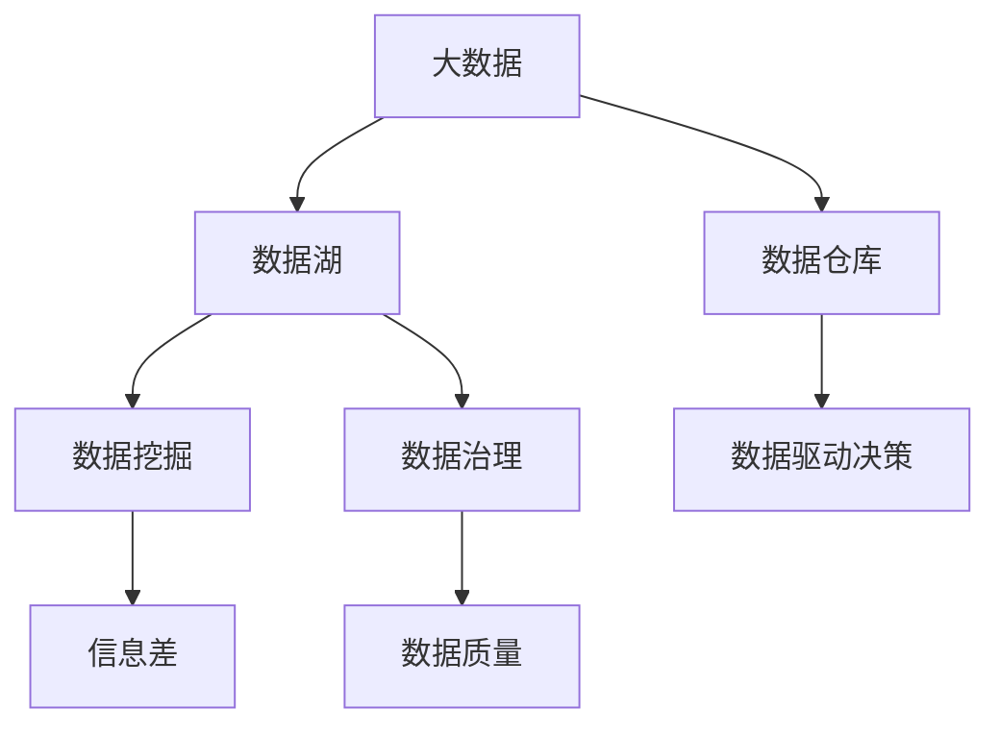

                 

## 1. 背景介绍

### 1.1 问题由来
在数字化时代，企业面对的市场环境瞬息万变，信息量的激增和企业经营决策的频繁调整，使得数据成为企业核心竞争力的重要组成部分。如何有效地利用大数据，挖掘其中的信息差，直接关系到企业竞争优势的构建和价值创造能力的提升。

在实际经营中，企业通过积累、分析和利用大数据，可以在产品研发、市场推广、客户关系管理等多个环节产生显著的价值创造效果。例如，通过数据分析，企业可以优化产品设计、改进供应链管理、提升营销效果，进而降低成本、增加收入，提高市场占有率。

### 1.2 问题核心关键点
大数据的价值创造主要依赖于对信息差的挖掘和利用。信息差指的是数据中未被充分利用的、潜在的价值，即从数据中提取出来的、可以用于决策或预测的有用信息与实际应用中的信息和决策之间的差距。有效挖掘信息差，能够帮助企业在面对不确定性时，做出更精准的决策，降低风险，创造更高的价值。

企业在大数据价值创造的过程中，需要关注以下几个关键点：
1. **数据质量**：高质量的数据是挖掘信息差的基础。数据必须准确、完整、一致，且能够反映真实的业务情况。
2. **数据存储和管理**：高效的数据存储和管理方式，是支撑大数据分析的基础。需要构建可靠的数据仓库和数据湖，实现数据的集中管理和统一访问。
3. **数据分析能力**：先进的数据分析技术和工具，是挖掘信息差的核心。需要具备数据挖掘、机器学习、人工智能等多种分析手段。
4. **业务理解和应用**：数据分析的目的在于支持业务决策和优化运营。需要企业内部各层级的充分理解和支持。

### 1.3 问题研究意义
探索大数据如何提升企业价值，对于构建企业竞争优势、推动数字化转型、提升运营效率具有重要意义：

1. **增强决策能力**：基于大数据的决策能够提供更全面的信息支持，帮助企业做出更加精准的决策。
2. **提升运营效率**：通过大数据分析，可以优化流程，减少资源浪费，提升企业的运营效率。
3. **创造新业务机会**：利用大数据技术，企业可以发掘新市场、新需求，开拓新的业务增长点。
4. **降低风险**：大数据分析能够识别潜在风险，帮助企业提前规避风险，确保稳健发展。
5. **提高客户满意度**：通过大数据分析客户行为和需求，企业可以提供个性化的服务和产品，提升客户体验和满意度。

## 2. 核心概念与联系

### 2.1 核心概念概述

为了更好地理解大数据如何提升企业价值，本节将介绍几个密切相关的核心概念：

1. **大数据**：指以容量大、类型多、速度快为特点的数据集合。通常包括结构化数据、半结构化数据和非结构化数据。
2. **数据仓库**：用于存储和管理历史数据的集中式数据库系统。通过数据仓库，企业可以整合和分析来自不同来源的数据。
3. **数据湖**：相比数据仓库，数据湖可以存储更原始的数据，包括非结构化数据和实时数据。数据湖能够支持大规模数据存储和分析。
4. **数据挖掘**：从大数据中提取有用信息和模式，为企业决策提供支持。包括统计分析、机器学习等多种技术手段。
5. **信息差**：数据中未被充分利用的价值。挖掘信息差是提升企业价值的关键。
6. **数据治理**：管理和规范数据的采集、存储、使用和共享，确保数据的质量和安全性。
7. **数据驱动决策**：基于数据信息的决策过程，强调以数据为基础，提升决策的科学性和有效性。

这些核心概念之间的逻辑关系可以通过以下Mermaid流程图来展示：



这个流程图展示了大数据的相关核心概念及其之间的关系：

1. 大数据通过数据仓库和数据湖存储和管理。
2. 数据挖掘从数据中提取有用信息和模式。
3. 数据治理规范数据的使用和管理，确保数据质量。
4. 信息差是数据中未被充分利用的价值，通过挖掘可以提升企业价值。
5. 数据驱动决策利用挖掘出的信息差，提升决策质量和业务运营效率。

## 3. 核心算法原理 & 具体操作步骤
### 3.1 算法原理概述

大数据的价值创造过程，本质上是一个从数据中提取信息差，并将其应用于决策和运营优化的过程。其核心思想是：

1. **数据集成**：从不同数据源收集数据，构建统一的数据集，形成数据仓库或数据湖。
2. **数据清洗和预处理**：清洗数据，消除噪声和错误，标准化数据格式。
3. **数据挖掘和分析**：利用数据挖掘技术和分析工具，从数据中挖掘出有用的信息和模式。
4. **模型建立和优化**：根据分析结果，建立模型，并通过优化提升模型的预测准确性。
5. **信息差挖掘**：识别数据中未被充分利用的价值，即信息差。
6. **数据驱动决策**：将信息差应用于决策和运营，提升企业的价值创造能力。

具体来说，大数据价值创造的过程可以总结为以下几个步骤：

1. **数据收集与整合**：从不同来源收集数据，并将其整合到一个统一的数据仓库或数据湖中。
2. **数据清洗与预处理**：清洗数据，确保数据质量和一致性，为后续分析做准备。
3. **数据探索与分析**：通过统计分析、数据可视化等方法，探索数据的分布、趋势和关系。
4. **数据建模与预测**：利用机器学习、深度学习等技术，建立预测模型，对未来趋势进行预测。
5. **信息差识别与利用**：识别数据中的未利用价值，即信息差，并将其转化为实际应用。
6. **数据驱动决策**：将信息差应用于企业决策和运营优化，实现价值创造。

### 3.2 算法步骤详解

以下是大数据价值创造的具体操作步骤：

**Step 1: 数据收集与整合**

- **数据源收集**：从各种来源（如客户数据库、社交媒体、销售系统等）收集数据。
- **数据标准化**：将不同格式的数据转换为统一格式，如JSON、CSV等。
- **数据清洗**：处理缺失值、异常值和噪声，确保数据质量。
- **数据整合**：将收集的数据整合到数据仓库或数据湖中，形成统一的数据集。

**Step 2: 数据清洗与预处理**

- **数据清洗**：移除重复数据，修正错误，处理缺失值。
- **数据预处理**：进行数据转换和归一化，如标准化、归一化、离散化等。
- **数据标注**：为数据添加标签和元数据，便于后续分析和应用。

**Step 3: 数据探索与分析**

- **数据可视化**：使用可视化工具，如Tableau、PowerBI等，探索数据的分布、趋势和关系。
- **关联分析**：通过关联规则挖掘，发现数据之间的关联性。
- **聚类分析**：使用聚类算法，将数据分组，发现潜在模式。
- **时间序列分析**：对时间序列数据进行分析，识别趋势和周期性。

**Step 4: 数据建模与预测**

- **模型选择**：根据业务需求和数据特征，选择合适的模型，如线性回归、决策树、神经网络等。
- **模型训练**：使用历史数据训练模型，调整模型参数，提高预测准确性。
- **模型验证**：使用验证集评估模型性能，调整模型结构和参数。
- **模型部署**：将模型部署到实际环境中，进行实时预测和决策。

**Step 5: 信息差识别与利用**

- **信息差识别**：通过模型预测和业务分析，识别数据中未被充分利用的价值，即信息差。
- **信息差利用**：将信息差转化为实际应用，如优化运营流程、提升营销效果、改进客户服务等。
- **信息差监控**：持续监控信息差，及时调整模型和业务策略，确保其持续价值。

**Step 6: 数据驱动决策**

- **决策支持**：基于信息差，提供决策支持，优化业务运营。
- **运营优化**：通过数据驱动的运营决策，提升企业的效率和效益。
- **持续改进**：根据新的数据和业务反馈，持续改进模型和策略，提升价值创造能力。

### 3.3 算法优缺点

大数据价值创造方法具有以下优点：

1. **全面性**：通过数据收集和整合，可以涵盖企业运营的各个方面，全面支持业务决策。
2. **高效性**：利用数据挖掘和机器学习等先进技术，可以快速发现数据中的有用信息和模式。
3. **灵活性**：根据不同业务需求，可以灵活选择不同的数据挖掘和分析方法，适应不同的场景。
4. **可操作性**：通过信息差识别和应用，将数据转化为可操作的业务决策，实现价值创造。

同时，该方法也存在以下局限性：

1. **数据质量问题**：数据收集和清洗过程较为复杂，需要投入大量资源和时间。
2. **技术门槛较高**：需要具备较强的数据科学和机器学习技术能力，才能进行复杂的数据分析和建模。
3. **隐私和安全风险**：大数据分析和应用可能涉及敏感数据，需要严格的数据治理和隐私保护措施。
4. **模型解释性不足**：高级模型（如深度学习）的决策过程复杂，难以解释其内部机制。
5. **实时性要求高**：数据驱动决策需要实时数据支持，对数据处理和传输速度有较高要求。

尽管存在这些局限性，但大数据价值创造方法仍然是企业数字化转型和价值提升的重要手段。通过不断优化数据质量、提升技术能力、加强数据治理和隐私保护，可以克服这些挑战，实现大数据的深度应用。

### 3.4 算法应用领域

大数据价值创造方法在多个行业和领域中都有广泛的应用，例如：

1. **金融行业**：通过大数据分析，进行信用评估、风险管理、投资决策等，提升金融服务质量。
2. **零售行业**：利用大数据分析客户行为和市场趋势，进行精准营销、库存管理、价格优化等，提升销售额和客户满意度。
3. **制造业**：通过大数据分析，进行设备监控、供应链优化、生产计划管理等，提高生产效率和质量。
4. **医疗行业**：利用大数据分析患者数据，进行疾病预测、个性化治疗、医疗资源分配等，提升医疗服务水平。
5. **物流行业**：通过大数据分析，进行路线规划、配送优化、库存管理等，降低物流成本，提升配送效率。
6. **政府公共服务**：利用大数据分析城市数据，进行交通管理、公共安全、环境监测等，提升城市管理水平。

## 4. 数学模型和公式 & 详细讲解  
### 4.1 数学模型构建

在大数据价值创造过程中，我们可以使用以下数学模型进行量化分析：

设大数据集为 $D=\{(x_i, y_i)\}_{i=1}^N$，其中 $x_i$ 表示第 $i$ 个样本的特征向量，$y_i$ 表示对应的标签或目标变量。我们希望通过数据挖掘和建模，建立模型 $f$，使得 $f(x)$ 能够预测 $y$。具体来说，我们可以使用回归模型、分类模型或预测模型，如下所示：

$$
f(x) = \begin{cases}
y_i, & \text{if } x = x_i \\
\hat{y}, & \text{if } x \notin D
\end{cases}
$$

其中 $\hat{y}$ 表示模型的预测值，目标是使 $\hat{y}$ 尽可能接近 $y_i$。

### 4.2 公式推导过程

以线性回归模型为例，推导其最小二乘法的求解过程。

设回归模型为 $y = \beta_0 + \beta_1 x_1 + \beta_2 x_2 + \cdots + \beta_n x_n + \epsilon$，其中 $\epsilon$ 为误差项。我们的目标是寻找 $\beta_0, \beta_1, \beta_2, \cdots, \beta_n$，使得 $\sum_{i=1}^N (y_i - \hat{y})^2$ 最小。

最小二乘法的求解步骤如下：

1. **计算均值**：$\bar{x}_i = \frac{1}{N} \sum_{i=1}^N x_i$，$\bar{y} = \frac{1}{N} \sum_{i=1}^N y_i$。
2. **计算协方差矩阵**：$\Sigma = \frac{1}{N} \sum_{i=1}^N (x_i - \bar{x})(x_i - \bar{x})^T$。
3. **计算回归系数**：$\beta = (\Sigma^{-1}) \sum_{i=1}^N (x_i - \bar{x}) y_i$。

最终得到的回归系数 $\beta$，可以用于预测新的数据点。

### 4.3 案例分析与讲解

以一家零售企业为例，分析如何利用大数据价值创造方法提升销售业绩：

**数据收集与整合**：
- **数据源**：销售数据、客户数据、市场数据、社交媒体数据。
- **数据标准化**：将数据转换为统一格式，如CSV。
- **数据清洗**：处理缺失值、异常值和噪声。
- **数据整合**：将所有数据整合到数据仓库中，形成统一的数据集。

**数据探索与分析**：
- **数据可视化**：使用Tableau进行销售数据和客户数据的可视化，识别销售趋势和客户行为模式。
- **关联分析**：通过关联规则挖掘，发现商品之间的关系，如搭配销售、季节性趋势等。
- **聚类分析**：使用K-means聚类算法，将客户分为不同群体，识别高价值客户。
- **时间序列分析**：对销售数据进行时间序列分析，识别季节性波动和趋势。

**数据建模与预测**：
- **模型选择**：选择线性回归模型，预测未来销售趋势。
- **模型训练**：使用历史销售数据训练模型，调整模型参数。
- **模型验证**：使用验证集评估模型性能，调整模型结构和参数。
- **模型部署**：将模型部署到实际环境中，进行实时预测。

**信息差识别与利用**：
- **信息差识别**：通过模型预测，识别销售数据的未利用价值，如预测销售额、识别高价值客户。
- **信息差利用**：利用预测结果进行销售预测，优化库存管理；利用高价值客户进行精准营销；利用关联分析进行商品搭配推荐。

**数据驱动决策**：
- **决策支持**：根据销售预测结果，优化库存策略，提升库存周转率；根据高价值客户信息，制定精准营销策略，提升客户转化率。
- **运营优化**：通过数据驱动的运营决策，提升企业的运营效率和效益。

通过上述步骤，该零售企业实现了基于大数据的价值创造，提升了销售业绩和客户满意度。

## 5. 项目实践：代码实例和详细解释说明
### 5.1 开发环境搭建

在进行大数据价值创造项目实践前，我们需要准备好开发环境。以下是使用Python进行Pandas、Scikit-learn等库开发的环境配置流程：

1. 安装Anaconda：从官网下载并安装Anaconda，用于创建独立的Python环境。

2. 创建并激活虚拟环境：
```bash
conda create -n bigdata-env python=3.8 
conda activate bigdata-env
```

3. 安装Pandas、Scikit-learn等常用库：
```bash
conda install pandas scikit-learn numpy matplotlib tqdm jupyter notebook ipython
```

4. 安装相关数据分析工具：
```bash
conda install statsmodels matplotlib seaborn
```

完成上述步骤后，即可在`bigdata-env`环境中开始大数据价值创造项目实践。

### 5.2 源代码详细实现

这里以一家零售企业为例，展示如何使用Pandas和Scikit-learn库进行大数据价值创造的实现。

首先，准备销售数据和客户数据，并清洗数据：

```python
import pandas as pd
from sklearn.preprocessing import StandardScaler

# 读取数据
sales_data = pd.read_csv('sales_data.csv')
customer_data = pd.read_csv('customer_data.csv')

# 数据清洗
sales_data = sales_data.dropna()
customer_data = customer_data.dropna()

# 标准化数据
scaler = StandardScaler()
sales_data[['price', 'quantity']] = scaler.fit_transform(sales_data[['price', 'quantity']])
```

然后，进行数据探索与分析：

```python
# 数据可视化
import matplotlib.pyplot as plt
import seaborn as sns

sns.lineplot(x='date', y='sales', data=sales_data)
plt.show()

# 关联分析
from sklearn.cluster import KMeans

# 聚类分析
kmeans = KMeans(n_clusters=3, random_state=0)
kmeans.fit(customer_data[['age', 'income', 'gender']])
customer_data['cluster'] = kmeans.labels_

# 时间序列分析
from statsmodels.tsa.seasonal import SeasonalDecompose

# 分解时间序列
decomposition = SeasonalDecompose(sales_data['sales'], model='additive', freq='M')
trend, seasonal, residual = decomposition.fit()
```

接着，建立模型并进行预测：

```python
# 模型选择
from sklearn.linear_model import LinearRegression

# 模型训练
model = LinearRegression()
model.fit(sales_data[['price', 'quantity', 'seasonality']], sales_data['sales'])

# 模型验证
from sklearn.model_selection import train_test_split

X_train, X_test, y_train, y_test = train_test_split(sales_data[['price', 'quantity', 'seasonality']], sales_data['sales'], test_size=0.2)

# 模型评估
from sklearn.metrics import mean_squared_error

y_pred = model.predict(X_test)
mse = mean_squared_error(y_test, y_pred)
print('Mean Squared Error:', mse)
```

最后，利用信息差进行数据驱动决策：

```python
# 预测未来销售
from datetime import datetime

future_date = datetime(2023, 12, 31)
future_sales = model.predict([[price, quantity, seasonality.subs({'date': future_date})]])
print('Predicted Future Sales:', future_sales)

# 识别高价值客户
high_value_customers = customer_data[customer_data['cluster'] == 2]
```

以上就是利用Pandas和Scikit-learn库进行大数据价值创造的完整代码实现。可以看到，通过Python和相关库，我们可以高效地进行数据清洗、探索、分析和建模，实现大数据价值创造。

### 5.3 代码解读与分析

让我们再详细解读一下关键代码的实现细节：

**数据清洗和预处理**：
- `dropna()`方法：删除缺失值。
- `StandardScaler()`类：标准化数据，使得数据具有相同的尺度和分布。

**数据探索与分析**：
- `sns.lineplot()`函数：绘制时间序列图，直观展示销售趋势。
- `KMeans()`类：聚类分析，将客户分为不同群体。
- `SeasonalDecompose()`类：时间序列分解，识别销售数据的趋势和周期性。

**模型建立与预测**：
- `LinearRegression()`类：线性回归模型，进行销售预测。
- `train_test_split()`函数：将数据集分为训练集和测试集，进行模型评估。
- `mean_squared_error()`函数：计算预测误差的均方误差。

**信息差识别与利用**：
- `predict()`方法：使用模型进行未来销售预测。
- `customer_data.loc[customer_data['cluster'] == 2]`：根据聚类结果，识别高价值客户。

通过这些步骤，我们可以系统地实现大数据价值创造过程，帮助企业提升业务运营效率和价值创造能力。

## 6. 实际应用场景
### 6.1 智能制造

大数据价值创造方法在智能制造中具有重要应用。通过数据分析，可以优化生产流程、提高设备利用率、预测设备故障等，从而提升生产效率和产品质量。

例如，一家制造企业可以使用大数据分析其生产数据，识别设备故障的早期预警信号，优化设备维护计划，降低停机时间和维修成本。同时，通过分析生产数据，可以优化生产流程，减少资源浪费，提高生产效率。

### 6.2 智慧城市

在智慧城市建设中，大数据价值创造方法可以发挥重要作用。通过数据分析，可以实现城市管理的智能化、精细化，提升城市运行效率和居民生活质量。

例如，通过分析交通流量数据，可以优化交通信号灯控制，减少交通拥堵。通过分析环境数据，可以优化垃圾回收和垃圾分类。通过分析公共服务数据，可以优化资源配置，提高公共服务效率。

### 6.3 金融风控

在金融领域，大数据价值创造方法可以帮助金融机构进行风险评估和管理。通过分析客户数据和交易数据，可以识别高风险客户和交易，提前采取风险控制措施，降低损失。

例如，一家银行可以使用大数据分析其客户交易数据，识别异常交易行为，进行反欺诈预警。通过分析客户信用数据，可以预测客户违约风险，制定相应的信用评估和贷款策略。

### 6.4 未来应用展望

随着大数据技术的不断进步，大数据价值创造方法将呈现出以下几个发展趋势：

1. **实时性要求提高**：大数据应用对实时性的要求越来越高，需要构建实时数据流处理平台，支持实时数据分析和决策。
2. **多源数据融合**：不同来源的数据需要高效融合，形成统一的数据视图，支持全面分析。
3. **人工智能与大数据结合**：大数据与人工智能技术的深度结合，将推动更高级的数据分析和建模方法，提升预测准确性和决策效果。
4. **边缘计算普及**：边缘计算技术的应用，将数据处理从中心云向边缘节点转移，提升数据处理的响应速度和效率。
5. **数据安全与隐私保护**：数据安全与隐私保护成为大数据应用的重要关注点，需要采取先进的数据治理和隐私保护措施。

未来，随着数据采集和处理技术的不断进步，大数据价值创造方法将更加高效、智能，为企业创造更大的价值。

## 7. 工具和资源推荐
### 7.1 学习资源推荐

为了帮助开发者系统掌握大数据价值创造的理论基础和实践技巧，这里推荐一些优质的学习资源：

1. 《Python数据分析实战》系列书籍：深入讲解Python数据分析和机器学习的核心技术，涵盖Pandas、Scikit-learn等库的使用。
2. 《大数据技术与应用》课程：系统介绍大数据技术的原理和应用，涵盖数据收集、存储、处理、分析等多个环节。
3. 《机器学习实战》书籍：讲解机器学习算法和模型，通过实战案例帮助读者理解大数据应用。
4. 《大数据分析与可视化》课程：系统介绍大数据分析和可视化技术，涵盖统计分析、数据可视化等。
5. 《大数据应用案例分析》书籍：通过真实案例分析，展示大数据技术在各个行业中的应用。

通过这些资源的学习实践，相信你一定能够快速掌握大数据价值创造的精髓，并用于解决实际的业务问题。
###  7.2 开发工具推荐

高效的开发离不开优秀的工具支持。以下是几款用于大数据价值创造开发的常用工具：

1. Jupyter Notebook：基于Python的交互式开发环境，支持代码编辑、运行和可视化展示。
2. Tableau：数据可视化工具，支持快速创建复杂的图表和仪表盘。
3. Apache Spark：分布式计算框架，支持大规模数据处理和分析。
4. Apache Hadoop：分布式文件系统，支持海量数据的存储和管理。
5. Apache Kafka：分布式流处理平台，支持实时数据采集和处理。
6. Elasticsearch：分布式搜索和分析引擎，支持快速查询和分析大量数据。

合理利用这些工具，可以显著提升大数据价值创造任务的开发效率，加快创新迭代的步伐。

### 7.3 相关论文推荐

大数据价值创造技术的发展得益于学界的持续研究。以下是几篇奠基性的相关论文，推荐阅读：

1. "Data Mining: Concepts and Techniques"（《数据挖掘：概念与技术》）：本书系统介绍了数据挖掘的理论和实践，涵盖统计分析、聚类分析、关联分析等多种方法。
2. "Big Data: Principles and Best Practices of Scalable Real-time Data Systems"（《大数据：可扩展的实时数据系统原理与实践》）：本书介绍了大数据技术的基础和应用，涵盖数据采集、存储、处理等多个环节。
3. "A Survey on Big Data Analytics Technologies and Applications"（《大数据分析技术与应用综述》）：综述性论文，介绍了大数据分析的多种技术和应用，涵盖数据仓库、数据湖、数据挖掘等。
4. "Big Data Analytics: Techniques and Applications in Real-time"（《大数据实时分析技术与应用》）：介绍了大数据实时分析的技术和应用，涵盖流处理、实时计算、实时可视化等。
5. "Big Data Analytics for Healthcare"（《医疗大数据分析》）：介绍了大数据在医疗领域的应用，涵盖数据分析、预测建模、决策支持等。

这些论文代表了大数据价值创造技术的发展脉络。通过学习这些前沿成果，可以帮助研究者把握学科前进方向，激发更多的创新灵感。

## 8. 总结：未来发展趋势与挑战

### 8.1 总结

本文对大数据如何提升企业价值进行了全面系统的介绍。首先阐述了大数据价值创造的基本概念和重要性，明确了大数据在企业运营和决策支持中的关键作用。其次，从原理到实践，详细讲解了大数据价值创造的核心步骤和技术方法，给出了系统的大数据价值创造实现案例。同时，本文还广泛探讨了大数据在多个行业的应用场景，展示了大数据价值创造的广泛应用前景。最后，推荐了相关学习资源和开发工具，帮助读者系统掌握大数据价值创造的理论基础和实践技巧。

通过本文的系统梳理，可以看到，大数据价值创造方法在企业数字化转型和价值提升中发挥了重要作用。未来，随着数据采集和处理技术的不断进步，大数据价值创造方法将更加高效、智能，为企业的运营决策和业务创新提供强大的支持。

### 8.2 未来发展趋势

展望未来，大数据价值创造技术将呈现出以下几个发展趋势：

1. **实时性要求提高**：大数据应用对实时性的要求越来越高，需要构建实时数据流处理平台，支持实时数据分析和决策。
2. **多源数据融合**：不同来源的数据需要高效融合，形成统一的数据视图，支持全面分析。
3. **人工智能与大数据结合**：大数据与人工智能技术的深度结合，将推动更高级的数据分析和建模方法，提升预测准确性和决策效果。
4. **边缘计算普及**：边缘计算技术的应用，将数据处理从中心云向边缘节点转移，提升数据处理的响应速度和效率。
5. **数据安全与隐私保护**：数据安全与隐私保护成为大数据应用的重要关注点，需要采取先进的数据治理和隐私保护措施。

这些趋势凸显了大数据价值创造技术的广阔前景。这些方向的探索发展，必将进一步提升大数据应用的价值创造能力，推动企业数字化转型和业务创新。

### 8.3 面临的挑战

尽管大数据价值创造技术已经取得了显著成果，但在迈向更加智能化、普适化应用的过程中，它仍面临诸多挑战：

1. **数据质量问题**：数据收集和清洗过程较为复杂，需要投入大量资源和时间。
2. **技术门槛较高**：需要具备较强的数据科学和机器学习技术能力，才能进行复杂的数据分析和建模。
3. **隐私和安全风险**：大数据分析和应用可能涉及敏感数据，需要严格的数据治理和隐私保护措施。
4. **模型解释性不足**：高级模型（如深度学习）的决策过程复杂，难以解释其内部机制。
5. **实时性要求高**：数据驱动决策需要实时数据支持，对数据处理和传输速度有较高要求。

尽管存在这些挑战，但通过不断优化数据质量、提升技术能力、加强数据治理和隐私保护，可以克服这些挑战，实现大数据的深度应用。

### 8.4 研究展望

面对大数据价值创造所面临的挑战，未来的研究需要在以下几个方面寻求新的突破：

1. **探索无监督和半监督大数据分析方法**：摆脱对大规模标注数据的依赖，利用自监督学习、主动学习等无监督和半监督方法，最大限度利用非结构化数据，实现更加灵活高效的大数据分析。
2. **研究参数高效和大规模数据处理技术**：开发更加参数高效和大规模数据处理的技术，在固定大部分数据集的情况下，只更新极少量的任务相关参数，减小过拟合风险。
3. **融合因果推断和对比学习技术**：通过引入因果推断和对比学习思想，增强大数据分析建立稳定因果关系的能力，学习更加普适、鲁棒的数据表征。
4. **引入更多先验知识**：将符号化的先验知识，如知识图谱、逻辑规则等，与神经网络模型进行巧妙融合，引导大数据分析过程学习更准确、合理的语言模型。
5. **结合因果分析和博弈论工具**：将因果分析方法引入大数据分析，识别出分析结果的关键特征，增强输出解释的因果性和逻辑性。借助博弈论工具刻画人机交互过程，主动探索并规避分析过程的脆弱点，提高系统稳定性。
6. **纳入伦理道德约束**：在数据分析目标中引入伦理导向的评估指标，过滤和惩罚有偏见、有害的输出倾向。同时加强人工干预和审核，建立数据分析行为的监管机制，确保数据分析的公平性和安全性。

这些研究方向和技术的探索，必将引领大数据价值创造技术迈向更高的台阶，为构建安全、可靠、可解释、可控的智能系统铺平道路。面向未来，大数据价值创造技术还需要与其他人工智能技术进行更深入的融合，如知识表示、因果推理、强化学习等，多路径协同发力，共同推动大数据分析技术的进步。只有勇于创新、敢于突破，才能不断拓展大数据分析的边界，让数据分析技术更好地造福人类社会。

## 9. 附录：常见问题与解答

**Q1：如何选择合适的数据源？**

A: 选择合适的数据源是大数据分析的第一步。需要根据业务需求和分析目标，选择覆盖业务场景的数据源。可以从内部数据（如企业内部数据、客户数据等）和外部数据（如公共数据、社交媒体数据等）中获取数据。

**Q2：数据清洗和预处理过程中需要注意哪些问题？**

A: 数据清洗和预处理是大数据分析的重要环节，需要注意以下问题：
1. 数据缺失处理：处理缺失值，如均值填补、插值填补等。
2. 数据异常处理：处理异常值，如截断、替换等。
3. 数据标准化：将数据转换为统一格式，如归一化、标准化等。
4. 数据标注：为数据添加标签和元数据，便于后续分析和应用。

**Q3：如何选择合适的大数据分析方法？**

A: 选择合适的大数据分析方法需要根据业务需求和数据特征进行综合考虑：
1. 数据分析目标：根据分析目标，选择合适的分析方法，如统计分析、聚类分析、关联分析等。
2. 数据特征：根据数据特征，选择合适的分析方法，如时间序列分析、文本分析等。
3. 数据量：根据数据量，选择合适的分析方法，如分布式计算、流处理等。

**Q4：大数据分析模型如何评估和优化？**

A: 大数据分析模型的评估和优化主要包括以下几个步骤：
1. 模型选择：根据业务需求和数据特征，选择合适的模型，如线性回归、决策树、神经网络等。
2. 模型训练：使用历史数据训练模型，调整模型参数。
3. 模型验证：使用验证集评估模型性能，调整模型结构和参数。
4. 模型部署：将模型部署到实际环境中，进行实时预测和决策。
5. 模型监控：持续监控模型性能，及时调整模型和业务策略，提升模型效果。

**Q5：大数据分析结果如何转化为实际应用？**

A: 大数据分析结果的转化为实际应用主要包括以下几个步骤：
1. 数据可视化：通过数据可视化工具，直观展示分析结果，支持决策支持。
2. 业务应用：根据分析结果，优化业务流程，提升运营效率。
3. 数据驱动决策：将分析结果应用于业务决策，提升决策质量和业务运营效果。

通过这些步骤，可以将大数据分析结果转化为实际应用，为企业创造更大的价值。

---

作者：禅与计算机程序设计艺术 / Zen and the Art of Computer Programming

