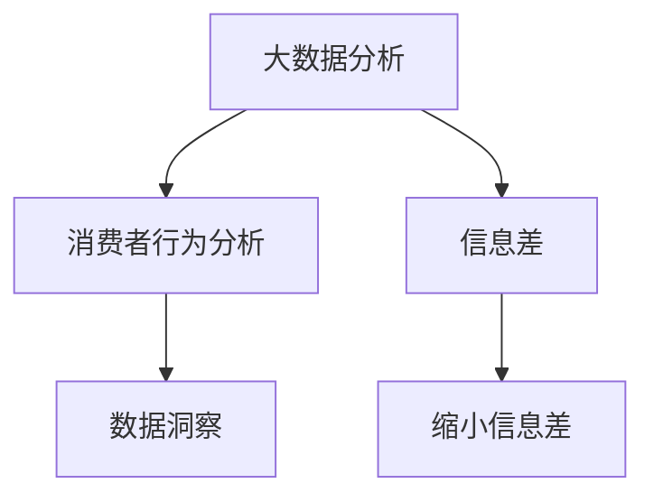

                 

# 信息差的商业消费者洞察：大数据如何深入了解消费者

> 关键词：数据洞察, 消费者行为, 信息差, 大数据分析, 商业决策

## 1. 背景介绍

### 1.1 问题由来
在数字化转型迅速的今天，企业面临着前所未有的挑战和机遇。随着消费者行为的不断变化，企业需要更加精准地了解市场动态，制定出更为有效的营销策略。然而，传统的市场调研和用户反馈机制往往受限于成本和时间，无法全面深入地洞察消费者行为，导致信息差的问题愈发严重。

### 1.2 问题核心关键点
信息差(Information Gap)指的是企业与消费者之间存在的认知和行为上的差距，这种差距可能导致企业产品不符合消费者需求，营销活动效果不佳，品牌形象受损等问题。因此，如何通过大数据分析，深入了解消费者行为，缩小信息差，成为了当前商业领域亟待解决的问题。

## 2. 核心概念与联系

### 2.1 核心概念概述

为更好地理解如何利用大数据深入洞察消费者行为，本节将介绍几个密切相关的核心概念：

- **大数据分析(Big Data Analysis)**：通过对大规模数据集进行收集、存储、处理和分析，从中提取有价值的信息，支持决策制定的过程。大数据分析在商业洞察、市场预测、客户行为分析等方面具有重要作用。

- **消费者行为(Consumer Behavior)**：指消费者在购买和使用产品或服务过程中所表现出的心理和行为模式，如购买动机、购买决策过程、使用习惯等。通过了解消费者行为，企业可以更好地满足其需求，提升产品市场竞争力。

- **信息差(Information Gap)**：企业与消费者之间存在认知和行为上的差异，导致企业无法准确理解消费者需求，从而产生的不匹配现象。缩小信息差是提升企业市场竞争力的关键。

- **数据洞察(Data Insights)**：通过数据分析，深入理解消费者行为和市场动态，为企业提供数据支持的决策依据，从而优化产品设计和营销策略。

这些核心概念之间的逻辑关系可以通过以下Mermaid流程图来展示：



这个流程图展示了大数据分析在缩小信息差、提升消费者行为洞察方面的核心作用。

## 3. 核心算法原理 & 具体操作步骤
### 3.1 算法原理概述

利用大数据分析深入了解消费者行为，需要借助一系列算法和技术手段。其核心思想是通过数据分析，挖掘和提取消费者行为的相关特征，从中洞察消费者行为模式，进而指导商业决策。

形式化地，设企业已获得大规模消费者行为数据集 $D$，其中包含 $N$ 条记录，每条记录包含若干特征 $X_i$，目标为通过数据分析挖掘出消费者行为的关键特征 $X_k$。在数学上，可以表述为：

$$
\arg\min_{X_k} \mathcal{L}(D,X_k)
$$

其中 $\mathcal{L}$ 为损失函数，用于衡量模型在数据集 $D$ 上的预测误差。

### 3.2 算法步骤详解

基于大数据分析洞察消费者行为的主要步骤包括：

**Step 1: 数据准备与预处理**
- 收集企业内外部的大规模消费者行为数据，包括在线交易记录、社交媒体互动、客户反馈等。
- 对数据进行清洗、去重、归一化等预处理操作，保证数据质量。
- 选择合适的特征提取方法，如因子分析、主成分分析等，对数据进行降维。

**Step 2: 数据分析与建模**
- 选择合适的统计学方法或机器学习方法进行数据分析，如回归分析、聚类分析、决策树、随机森林等。
- 建立消费者行为模型，预测消费者购买行为、流失率、满意度等关键指标。

**Step 3: 结果解读与业务应用**
- 对分析结果进行可视化展示，如图表、仪表盘等，帮助业务人员直观理解消费者行为模式。
- 根据分析结果，优化产品设计、定价策略、营销活动等，提升企业市场竞争力。
- 定期对模型进行评估和迭代，确保分析结果的准确性和时效性。

### 3.3 算法优缺点

利用大数据分析洞察消费者行为的方法具有以下优点：
1. 数据量大：大规模数据集可以提供更全面的消费者行为信息，帮助企业深入理解市场动态。
2. 实时性：大数据分析可以实时处理和分析消费者行为数据，为企业提供及时的决策依据。
3. 自动化：利用机器学习算法自动化数据分析过程，减少人工干预，提高效率。
4. 可扩展性：大数据分析可以扩展到多领域和多平台，为企业提供跨领域的消费者洞察。

同时，该方法也存在一定的局限性：
1. 数据隐私：大规模消费者数据收集和处理过程中，可能涉及隐私问题，需要严格遵守数据保护法规。
2. 数据质量：数据清洗和预处理过程中，需要投入大量时间和资源，保证数据质量。
3. 算法复杂度：不同的数据分析方法复杂度不一，需要根据实际情况选择合适的算法。
4. 结果解释：复杂的分析模型可能难以解释其输出结果，影响业务人员理解和使用。

尽管存在这些局限性，但总体而言，大数据分析方法在洞察消费者行为方面仍具有不可替代的价值。

### 3.4 算法应用领域

基于大数据分析的消费者洞察方法，在诸多商业领域得到了广泛应用，例如：

- 零售业：通过分析消费者购买记录和行为数据，优化库存管理、个性化推荐、精准营销等。
- 金融行业：利用消费者交易和信用数据，预测客户流失、评估信用风险、推荐理财产品等。
- 旅游业：分析游客出行行为和评价数据，优化景区服务、提升旅游体验、精准营销等。
- 医疗健康：利用患者健康数据和行为信息，提供个性化医疗建议、提升医疗服务质量等。
- 媒体与广告：分析消费者观看习惯和互动数据，优化广告投放策略、提高广告效果等。

这些领域中，消费者行为洞察对企业决策的支撑作用显著，通过深入分析消费者数据，企业可以制定出更为精准、高效的商业策略。

## 4. 数学模型和公式 & 详细讲解 & 举例说明

### 4.1 数学模型构建

为更好地理解大数据分析中的数学模型构建，本节将介绍几个典型的数学模型：

- **因子分析(Factor Analysis)**：将多个相关变量通过线性组合的方式转换为少数几个因子，用于解释数据中的方差贡献。
- **主成分分析(Principal Component Analysis, PCA)**：通过线性变换将高维数据转换为低维空间，保留最大方差的信息。
- **回归分析(Regression Analysis)**：通过建立预测模型，将自变量与因变量之间的关系进行建模，用于预测未来的数据。
- **聚类分析(Clustering Analysis)**：将相似的数据点分为一组，用于识别数据中的内在结构。

这些数学模型在数据分析中扮演着重要角色，帮助企业从数据中提取出有用的信息，洞察消费者行为。

### 4.2 公式推导过程

以回归分析为例，我们推导线性回归模型的公式：

假设企业收集到 $N$ 个消费者的购买记录，每个记录包含若干特征 $X_i$ 和购买金额 $Y$，可以建立线性回归模型：

$$
Y = \beta_0 + \sum_{i=1}^{p} \beta_i X_i + \epsilon
$$

其中，$\beta_0$ 为截距，$\beta_i$ 为第 $i$ 个特征的系数，$\epsilon$ 为误差项。模型的目标是最小化预测误差，即：

$$
\mathcal{L}(\beta) = \frac{1}{N} \sum_{i=1}^{N} (Y_i - \hat{Y}_i)^2
$$

其中，$\hat{Y}_i$ 为第 $i$ 个样本的预测值。通过梯度下降等优化算法求解上述最小化问题，可以得到最优的系数 $\beta$，从而构建出预测模型。

### 4.3 案例分析与讲解

以下我们以电商平台为例，展示如何使用回归分析模型洞察消费者行为：

假设一个电商平台收集到 $N=10000$ 个用户的购买记录，每个记录包含用户年龄、性别、收入、购买金额等特征 $X_i$，以及购买金额 $Y$。使用线性回归模型分析用户的购买行为：

1. **数据准备**：将数据集划分为训练集和测试集，并进行特征归一化处理。

2. **模型训练**：使用梯度下降算法优化模型参数，求解 $\beta$ 使得预测误差最小。

3. **结果验证**：在测试集上评估模型性能，使用均方误差（MSE）等指标衡量模型预测的准确性。

4. **业务应用**：根据模型预测结果，分析不同特征对购买金额的影响，优化营销策略，如针对高收入用户推出高端产品，针对年轻用户推出时尚商品等。

通过回归分析，电商平台可以深入理解用户购买行为的模式，制定更为精准的营销方案，提升用户体验和销售额。

## 5. 项目实践：代码实例和详细解释说明
### 5.1 开发环境搭建

在进行消费者行为分析项目开发前，我们需要准备好开发环境。以下是使用Python进行Pandas、Scikit-learn等库开发的环境配置流程：

1. 安装Anaconda：从官网下载并安装Anaconda，用于创建独立的Python环境。

2. 创建并激活虚拟环境：
```bash
conda create -n consumer-behavior python=3.8 
conda activate consumer-behavior
```

3. 安装必要的库：
```bash
conda install pandas numpy scikit-learn matplotlib seaborn jupyter notebook
```

4. 安装相关模型库：
```bash
pip install statsmodels matplotlib seaborn jupyter notebook
```

完成上述步骤后，即可在`consumer-behavior`环境中开始消费者行为分析项目。

### 5.2 源代码详细实现

下面我们以电商平台数据为例，给出使用Pandas、Scikit-learn等库进行消费者行为分析的Python代码实现。

```python
import pandas as pd
import numpy as np
from sklearn.linear_model import LinearRegression
from sklearn.model_selection import train_test_split
from sklearn.metrics import mean_squared_error
from statsmodels.stats.outliers_influence import variance_inflation_factor
import matplotlib.pyplot as plt
import seaborn as sns

# 读取数据集
data = pd.read_csv('consumer_behavior.csv')

# 数据清洗和预处理
# 假设数据已经处理完成，无缺失值和异常值

# 特征选择
features = data[['age', 'gender', 'income', 'purchasing_amount']]
target = data['purchasing_amount']

# 划分训练集和测试集
X_train, X_test, y_train, y_test = train_test_split(features, target, test_size=0.2, random_state=42)

# 模型训练
model = LinearRegression()
model.fit(X_train, y_train)

# 模型评估
y_pred = model.predict(X_test)
mse = mean_squared_error(y_test, y_pred)
rmse = np.sqrt(mse)

# 输出结果
print(f'Root Mean Squared Error: {rmse:.2f}')

# 特征重要性分析
vif = variance_inflation_factor(X_train, regression=True)
print(f'Variance Inflation Factor (VIF): {vif}')
```

### 5.3 代码解读与分析

让我们再详细解读一下关键代码的实现细节：

**特征选择**：
- 选择年龄、性别、收入等特征，用于建立购买金额的预测模型。

**数据划分**：
- 将数据集划分为训练集和测试集，用于模型训练和验证。

**模型训练**：
- 使用线性回归模型拟合训练数据，求解模型参数。

**模型评估**：
- 在测试集上评估模型性能，计算均方误差（MSE）和均方根误差（RMSE）。

**特征重要性分析**：
- 计算各特征的方差膨胀因子（VIF），分析特征之间的相关性和重要性。

**结果输出**：
- 输出模型评估结果和特征重要性分析结果，帮助业务人员理解消费者行为。

通过这些步骤，我们完成了使用回归分析模型对消费者行为数据的分析。需要注意的是，实际项目中可能涉及更多的特征选择、模型调参、模型评估等环节，需要根据具体情况灵活处理。

## 6. 实际应用场景
### 6.1 零售业

基于大数据分析的消费者洞察，在零售业中的应用广泛而深入。电商、超市等零售企业通过分析消费者购买行为，可以实现精准营销、库存管理、价格优化等。

例如，一家电商企业可以通过分析消费者购买记录，发现用户对不同商品类别和价格敏感度的变化趋势，据此优化商品推荐策略，提升用户满意度和销售额。同时，企业还可以通过分析用户反馈，调整库存结构，确保热门商品供货充足，减少缺货率。

### 6.2 金融行业

金融行业同样可以借助大数据分析洞察消费者行为，优化金融产品设计和风险控制。保险公司可以通过分析客户保险购买记录和理赔数据，预测客户流失风险，提前采取措施，降低赔付率。银行可以利用消费者交易数据，预测信用卡违约风险，优化信用评分模型。

例如，一家银行可以通过分析信用卡用户的消费行为和信用历史，构建预测模型，提前识别高风险用户，制定个性化的风险管理策略。同时，银行还可以利用客户消费数据，进行精准营销，提升客户忠诚度。

### 6.3 旅游业

旅游业中，大数据分析同样发挥着重要作用。通过分析游客出行数据和评价信息，旅游企业可以优化景区服务、提升旅游体验。

例如，一家旅游公司可以通过分析游客的浏览记录和评价数据，了解游客对不同景点的偏好，优化景区推荐算法，提升游客满意度。同时，企业还可以通过分析游客评价数据，及时发现景区服务问题，进行改进，提升服务质量。

### 6.4 医疗健康

在医疗健康领域，大数据分析可以帮助医院和保险公司洞察患者行为，提升医疗服务质量。通过分析患者健康数据和行为信息，医疗机构可以提供个性化医疗建议，提升诊疗效果。保险公司可以利用患者健康数据，评估健康风险，制定个性化的保险方案。

例如，一家医院可以通过分析患者的就诊记录和健康数据，构建预测模型，预测患者的再入院率和死亡率，优化诊疗方案，提高医疗服务质量。同时，保险公司可以利用患者健康数据，进行健康风险评估，制定个性化的保险方案，降低赔付率。

## 7. 工具和资源推荐
### 7.1 学习资源推荐

为了帮助开发者系统掌握大数据分析的理论基础和实践技巧，这里推荐一些优质的学习资源：

1. 《Python数据分析实战》系列书籍：由知名数据分析专家撰写，深入浅出地介绍了Python在数据分析中的应用，包括Pandas、NumPy、Scikit-learn等库的使用。

2. 《R语言实战》系列书籍：由R语言社区知名博主撰写，系统介绍了R语言在数据分析和可视化中的应用，包括ggplot2、dplyr等包的使用。

3. Coursera《Data Science》课程：由Johns Hopkins大学开设的在线课程，涵盖数据分析、统计学、机器学习等领域的知识，适合全面学习数据分析技能。

4. Kaggle数据科学竞赛：一个开放的平台，提供海量数据集和实际项目，让学习者通过参与竞赛，实践数据分析和建模技能。

5. Udacity《Data Analyst Nanodegree》课程：由Udacity提供的在线课程，涵盖数据分析的各个方面，包括数据清洗、数据可视化、机器学习等。

通过对这些资源的学习实践，相信你一定能够快速掌握大数据分析的精髓，并用于解决实际的商业问题。

### 7.2 开发工具推荐

高效的开发离不开优秀的工具支持。以下是几款用于大数据分析开发的常用工具：

1. Jupyter Notebook：一个交互式的Python笔记本环境，支持Python、R等语言，适合数据探索和分析。

2. Tableau：一款商业智能和数据可视化工具，提供直观的数据展示和交互功能，适合业务人员的分析工作。

3. Power BI：微软提供的商业智能和数据可视化工具，支持多种数据源，提供强大的数据探索和可视化功能。

4. Python：一门功能强大的编程语言，支持Pandas、NumPy、Scikit-learn等数据科学库，适合科学计算和数据分析。

5. R：一门专门用于统计分析和数据可视化的编程语言，支持ggplot2、dplyr等包，适合统计分析和数据探索。

合理利用这些工具，可以显著提升大数据分析任务的开发效率，加快创新迭代的步伐。

### 7.3 相关论文推荐

大数据分析技术的发展源于学界的持续研究。以下是几篇奠基性的相关论文，推荐阅读：

1. "Introduction to Statistical Learning" by Gareth James et al.：介绍了统计学习的理论和方法，适合初学者系统学习数据分析的基础知识。

2. "The Elements of Statistical Learning" by Trevor Hastie et al.：系统介绍了统计学习的基本概念和方法，适合深入学习数据分析的高级知识。

3. "Machine Learning Yearning" by Andrew Ng：介绍了机器学习的应用和实践，适合了解机器学习在实际项目中的应用。

4. "Data Science for Business" by Foster Provost et al.：介绍了数据科学在商业中的应用，适合学习如何将数据分析技术应用于实际业务场景。

5. "Data Science and Statistical Learning" by John W.itten et al.：系统介绍了数据科学的基本概念和方法，适合全面学习数据分析和机器学习的知识。

这些论文代表了大数据分析技术的发展脉络。通过学习这些前沿成果，可以帮助研究者把握学科前进方向，激发更多的创新灵感。

## 8. 总结：未来发展趋势与挑战

### 8.1 总结

本文对基于大数据分析的消费者行为洞察方法进行了全面系统的介绍。首先阐述了大数据分析在商业洞察、市场预测、消费者行为分析等方面的重要作用，明确了利用大数据分析洞察消费者行为，缩小信息差，提升企业市场竞争力的核心价值。其次，从原理到实践，详细讲解了大数据分析的数学模型和操作步骤，给出了消费者行为分析的完整代码实例。同时，本文还广泛探讨了大数据分析方法在零售业、金融行业、旅游业、医疗健康等诸多领域的应用前景，展示了大数据分析方法的广阔应用空间。

通过本文的系统梳理，可以看到，大数据分析方法在商业洞察、市场预测、消费者行为分析等方面具有不可替代的价值。大数据分析不仅能帮助企业深入了解消费者行为，还能优化产品设计和营销策略，提升企业市场竞争力。

### 8.2 未来发展趋势

展望未来，大数据分析技术将呈现以下几个发展趋势：

1. 数据量增大：随着互联网和物联网的不断发展，数据的来源和种类将更加多样化，数据量将不断增大，为企业提供更加全面和深入的数据洞察。

2. 数据分析自动化：大数据分析工具和平台将更加智能化和自动化，能够自动识别和处理数据，减少人工干预，提升效率。

3. 实时分析：大数据分析技术将支持实时数据处理和分析，帮助企业及时洞察市场动态，快速响应市场变化。

4. 跨领域应用：大数据分析将更多地应用于多领域和多平台，为企业提供跨领域的消费者洞察，提升整体市场竞争力。

5. 机器学习和深度学习：结合机器学习和深度学习技术，大数据分析将具备更强的预测能力和模式识别能力，提供更精准的消费者行为预测。

6. 数据隐私和安全：随着数据量的增大，数据隐私和安全问题将更加凸显，企业需要采取更加严格的数据保护措施，确保数据安全和合规。

以上趋势凸显了大数据分析技术的广阔前景。这些方向的探索发展，必将进一步提升企业的数据分析能力，推动商业决策的科学化和精准化。

### 8.3 面临的挑战

尽管大数据分析技术已经取得了显著进展，但在迈向更加智能化、普适化应用的过程中，它仍面临着诸多挑战：

1. 数据质量：大规模数据集收集和处理过程中，数据质量问题依然存在，需要投入大量时间和资源进行数据清洗和预处理。

2. 数据隐私：随着数据量的增大，数据隐私和安全问题将更加突出，需要严格遵守数据保护法规，保护消费者隐私。

3. 算法复杂度：大数据分析涉及的算法和技术复杂度较高，需要具备较强的数学和编程能力，才能有效地应用和优化算法。

4. 结果解释：复杂的分析模型可能难以解释其输出结果，影响业务人员理解和应用。

5. 数据存储：大规模数据存储和处理需要高成本的硬件设备和计算资源，存储成本和计算成本较高。

尽管存在这些挑战，但总体而言，大数据分析技术在商业洞察和消费者行为分析方面具有不可替代的价值。未来，随着技术的不断进步和优化，大数据分析将更好地服务于商业决策，提升企业市场竞争力。

### 8.4 研究展望

面对大数据分析面临的挑战，未来的研究需要在以下几个方面寻求新的突破：

1. 探索自动化和大规模数据处理技术：进一步提高数据处理和分析的自动化水平，减少人工干预，提升效率。

2. 开发高效的数据存储和传输技术：优化数据存储和传输方式，降低存储成本和计算成本。

3. 结合机器学习和深度学习技术：将机器学习和深度学习技术与大数据分析结合，提升数据模型的预测能力和解释能力。

4. 引入更多跨领域数据：结合其他领域的数据，如社交媒体数据、传感器数据等，提升消费者行为的全面性。

5. 加强数据隐私保护：开发更加严格的数据隐私保护技术，确保数据安全。

6. 提高数据模型的可解释性：通过引入因果分析、决策树等技术，提高大数据分析模型的可解释性。

这些研究方向的探索，必将引领大数据分析技术迈向更高的台阶，为商业决策提供更精准、可靠的依据。

## 9. 附录：常见问题与解答

**Q1：大数据分析是否适用于所有商业场景？**

A: 大数据分析在大多数商业场景中都具有重要作用，尤其是对于数据量较大的行业，如零售、金融、旅游等。但对于一些特定场景，如小型企业或个人项目，可能不需要进行复杂的数据分析，可以直接通过经验或简单的统计方法解决问题。

**Q2：如何选择适合的大数据分析工具？**

A: 选择大数据分析工具需要考虑多个因素，如数据量、数据类型、分析目的等。常见的工具包括Python、R、Tableau、Power BI等。一般来说，Python适合数据科学和机器学习应用，R适合统计分析和数据可视化，Tableau和Power BI适合业务人员进行数据探索和可视化。

**Q3：如何进行特征选择和模型调参？**

A: 特征选择和模型调参是大数据分析中两个关键环节。特征选择需要根据领域知识和实际需求选择最重要的特征，一般通过相关性分析、方差分析等方法实现。模型调参则需要根据模型评估结果调整超参数，如学习率、正则化系数等，一般通过网格搜索、随机搜索等方法实现。

**Q4：如何处理数据隐私和安全问题？**

A: 数据隐私和安全问题是大数据分析中的重要挑战。需要采取多项措施，如数据去标识化、加密传输、访问控制等，确保数据安全和隐私保护。同时，企业应遵守相关法律法规，如GDPR、CCPA等，确保数据合规。

**Q5：如何实现跨领域数据融合？**

A: 跨领域数据融合需要结合不同数据源的特点，进行数据清洗和整合。一般通过数据格式转换、数据对齐等方法实现。同时，需要考虑不同数据源之间的相关性和互补性，选择合适的数据融合策略。

通过回答这些问题，我们进一步了解了大数据分析在商业应用中的重要性和面临的挑战，相信能够为实际项目提供有用的参考和指导。

---

作者：禅与计算机程序设计艺术 / Zen and the Art of Computer Programming

