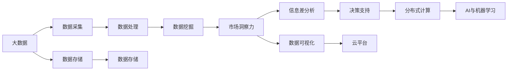

                 

# 信息差的市场洞察力提升：大数据如何增强市场洞察力

## 1. 背景介绍

在现代社会，信息差已成为市场竞争中的重要壁垒。企业能否在瞬息万变的信息海洋中获取和利用高价值信息，直接决定了其市场洞察力和竞争优势。大数据技术的快速发展，为提升市场洞察力提供了新的工具和思路。本文将从背景介绍、核心概念与联系、算法原理与操作步骤、数学模型与公式推导、项目实践、实际应用场景、工具与资源推荐、总结与发展趋势等多个方面，深入探讨大数据在增强市场洞察力方面的应用与挑战。

## 2. 核心概念与联系

### 2.1 核心概念概述

大数据与市场洞察力提升密切相关的核心概念包括：

- **大数据**：指通过信息技术手段收集、存储、管理和分析的海量数据集。大数据技术包括数据采集、数据存储、数据处理、数据挖掘等多个环节。
- **市场洞察力**：指企业通过分析和利用市场数据，识别市场趋势、需求变化和竞争格局，从而做出精准的市场决策。
- **信息差**：指不同企业或个体在获取和利用信息方面的差异，信息差的存在可能导致市场竞争中的不平等。
- **机器学习与人工智能**：指通过算法模型自动分析和处理大数据，从中提取有价值的信息和知识，辅助决策和预测。
- **数据可视化**：指通过图表、图形等形式，直观展示大数据分析结果，便于理解和使用。
- **分布式计算与云平台**：指利用分布式计算资源和大数据平台，支持大数据处理与分析。

这些核心概念之间存在着紧密的联系，通过大数据技术、机器学习与人工智能手段，可以分析和挖掘市场数据，识别信息差，提升市场洞察力，最终实现企业竞争优势。

### 2.2 核心概念原理和架构的 Mermaid 流程图



这个流程图展示了大数据与市场洞察力提升之间的逻辑关系：

1. **数据采集**：从各个来源收集原始数据。
2. **数据存储**：将数据存储在高效、可扩展的数据库中。
3. **数据处理**：清洗、预处理数据，去除噪声和错误。
4. **数据挖掘**：通过算法模型分析数据，提取有价值的信息和知识。
5. **市场洞察力**：基于数据挖掘结果，识别市场趋势、需求变化和竞争格局。
6. **信息差分析**：分析不同企业或个体在获取和利用信息方面的差异。
7. **决策支持**：利用市场洞察力和信息差分析结果，支持企业做出精准决策。
8. **数据可视化**：通过图表、图形等形式，直观展示分析结果，便于理解和使用。
9. **分布式计算与云平台**：利用分布式计算资源和大数据平台，支持大数据处理与分析。
10. **AI与机器学习**：通过算法模型自动分析和处理大数据，辅助决策和预测。

## 3. 核心算法原理 & 具体操作步骤

### 3.1 算法原理概述

大数据在增强市场洞察力方面，主要通过以下几个步骤实现：

1. **数据采集与存储**：收集和存储来自各种来源的市场数据，如客户反馈、交易记录、社交媒体数据等。
2. **数据清洗与预处理**：对原始数据进行清洗和预处理，去除噪声和错误，提升数据质量。
3. **数据挖掘与分析**：通过算法模型分析数据，提取有价值的信息和知识，如市场趋势、消费者行为、竞争格局等。
4. **信息差分析与可视化**：分析不同企业或个体在获取和利用信息方面的差异，并通过数据可视化展示结果。
5. **决策支持与优化**：基于市场洞察力和信息差分析结果，支持企业做出精准决策，并不断优化和调整策略。

### 3.2 算法步骤详解

以下是具体的算法步骤：

1. **数据采集与存储**：
   - 选择合适的数据采集工具和平台，如ETL工具、数据湖平台等。
   - 从不同的数据源（如社交媒体、客户反馈、交易记录等）收集数据，并将其存储在高效、可扩展的数据库中。

2. **数据清洗与预处理**：
   - 对收集到的数据进行清洗，去除重复、缺失、噪声等数据。
   - 对数据进行预处理，包括数据格式转换、标准化、归一化等。

3. **数据挖掘与分析**：
   - 选择合适的算法模型进行数据挖掘，如聚类分析、关联规则挖掘、分类算法等。
   - 对挖掘结果进行分析，提取有价值的信息和知识，如市场趋势、消费者行为、竞争格局等。

4. **信息差分析与可视化**：
   - 分析不同企业或个体在获取和利用信息方面的差异，识别信息差。
   - 利用数据可视化工具，如Tableau、Power BI等，将分析结果直观展示出来。

5. **决策支持与优化**：
   - 基于市场洞察力和信息差分析结果，支持企业做出精准决策。
   - 不断优化和调整策略，提升市场竞争力。

### 3.3 算法优缺点

大数据在增强市场洞察力方面的优点包括：

- **数据规模大**：大数据技术可以处理海量的市场数据，从中提取有价值的信息和知识。
- **实时性好**：大数据技术可以实时处理和分析数据，快速响应市场变化。
- **算法多样性**：大数据技术支持多种算法模型，如聚类分析、分类算法、关联规则挖掘等，适用于不同场景。
- **可视化直观**：大数据技术可以直观展示分析结果，便于理解和使用。

大数据在增强市场洞察力方面的缺点包括：

- **数据质量问题**：大数据来源多样，数据质量参差不齐，可能存在噪声和错误。
- **计算资源消耗大**：大数据处理和分析需要大量计算资源，可能面临算力瓶颈。
- **隐私和安全问题**：大数据处理可能涉及敏感数据，存在隐私和安全风险。
- **算法复杂性高**：大数据技术支持多种算法模型，但算法复杂度高，需要专业的知识和技能。

### 3.4 算法应用领域

大数据在市场洞察力提升方面的应用领域包括：

- **市场分析与预测**：通过大数据分析，识别市场趋势和需求变化，进行精准的市场预测。
- **消费者行为分析**：通过大数据分析，了解消费者行为和偏好，制定针对性的营销策略。
- **竞争分析与策略优化**：通过大数据分析，了解竞争对手的市场表现和策略，优化自身的市场策略。
- **产品设计与优化**：通过大数据分析，了解用户需求和反馈，优化产品设计和功能。
- **供应链管理**：通过大数据分析，优化供应链流程，提升供应链效率和响应速度。

## 4. 数学模型和公式 & 详细讲解 & 举例说明

### 4.1 数学模型构建

市场洞察力提升的大数据模型构建可以抽象为以下几个步骤：

1. **数据预处理**：包括数据清洗、归一化、标准化等。
2. **特征提取**：从原始数据中提取有意义的特征。
3. **模型选择与训练**：选择合适的机器学习模型，并使用训练数据对其进行训练。
4. **模型评估与优化**：对训练好的模型进行评估，并根据评估结果进行优化。
5. **结果应用**：将模型应用于实际场景，进行市场洞察力和决策支持。

### 4.2 公式推导过程

以下以市场趋势预测为例，推导常用的回归分析模型。

假设市场数据为 $y_i$，特征数据为 $x_i$，$i=1,2,\cdots,N$。回归分析的目标是建立 $y_i$ 和 $x_i$ 之间的关系，可以使用线性回归模型：

$$
y_i = \beta_0 + \beta_1 x_{i1} + \beta_2 x_{i2} + \cdots + \beta_p x_{ip} + \epsilon_i
$$

其中 $\beta_0,\beta_1,\cdots,\beta_p$ 为回归系数，$\epsilon_i$ 为误差项。

根据最小二乘法，回归系数的求解公式为：

$$
\beta = (X^T X)^{-1} X^T y
$$

其中 $X$ 为特征矩阵，$y$ 为市场数据向量。

### 4.3 案例分析与讲解

假设某电商企业收集了过去一年中的月度销售数据，并使用大数据分析预测未来一个月的销售趋势。具体步骤如下：

1. **数据预处理**：对原始数据进行清洗和归一化。
2. **特征提取**：提取过去一年的季节性、促销活动、节假日等特征。
3. **模型选择与训练**：选择线性回归模型，并使用训练数据对其进行训练。
4. **模型评估与优化**：使用测试数据对模型进行评估，并根据评估结果进行优化。
5. **结果应用**：将训练好的模型应用于实际场景，预测未来一个月的销售趋势，并根据预测结果调整库存和营销策略。

## 5. 项目实践：代码实例和详细解释说明

### 5.1 开发环境搭建

在进行大数据项目实践前，我们需要准备好开发环境。以下是使用Python进行大数据开发的环境配置流程：

1. 安装Anaconda：从官网下载并安装Anaconda，用于创建独立的Python环境。

2. 创建并激活虚拟环境：
```bash
conda create -n bigdata-env python=3.8 
conda activate bigdata-env
```

3. 安装相关工具包：
```bash
pip install pandas numpy scikit-learn matplotlib seaborn pyspark dask bigquery airflow
```

4. 安装分布式计算框架：
```bash
pip install pyarrow cassandra-driver
```

5. 安装云平台相关工具：
```bash
pip install awscli google-cloud-storage
```

完成上述步骤后，即可在`bigdata-env`环境中开始大数据项目实践。

### 5.2 源代码详细实现

下面以电商企业市场趋势预测项目为例，给出使用Python和PySpark进行大数据分析的代码实现。

首先，准备数据集：

```python
import pandas as pd
from pyspark.sql import SparkSession

spark = SparkSession.builder.getOrCreate()

# 读取数据
df = spark.read.json('sales_data.json')

# 数据清洗
df = df.dropna().drop_duplicates()

# 特征提取
df = df.withColumn('season', F.when(df['date'].month.in_(3, 4, 5), 1).when(df['date'].month.in_(6, 7, 8), 2).otherwise(0))
df = df.withColumn('holiday', F.when(df['date'].month.in_(12), 1).otherwise(0))

# 划分训练集和测试集
train_df = df.sample(fraction=0.7, random=random())
test_df = df.drop(train_df)

# 保存数据
train_df.write.json('train_data.json')
test_df.write.json('test_data.json')
```

然后，定义回归模型：

```python
from pyspark.ml.regression import LinearRegression
from pyspark.ml.evaluation import RegressionEvaluator

# 选择线性回归模型
reg_model = LinearRegression(maxIter=10, regParam=0.3, elasticNetParam=0.8)

# 训练模型
model = reg_model.fit(train_df.drop('sales', ignore=False), reg_model.withLabelCol('sales'))

# 评估模型
evaluator = RegressionEvaluator(metricName='rmse')
rmse = evaluator.evaluate(model.transform(test_df.drop('sales', ignore=False)), labelCol='sales')
print('rmse: ', rmse)

# 应用模型
future_sales = model.transform(df.drop('sales', ignore=False))['prediction'].collect()

# 可视化结果
import matplotlib.pyplot as plt
import seaborn as sns

sns.lineplot(x=df['date'], y=df['sales'])
sns.lineplot(x=df['date'], y=future_sales)
plt.show()
```

以上代码实现了电商企业市场趋势预测的基本流程，包括数据清洗、特征提取、模型训练、模型评估和结果可视化。

### 5.3 代码解读与分析

让我们再详细解读一下关键代码的实现细节：

**数据预处理**：
- `df.dropna()`：去除缺失值。
- `df.drop_duplicates()`：去除重复值。

**特征提取**：
- `df.withColumn()`：根据日期月份添加季节性特征和节假日特征。

**模型训练与评估**：
- `LinearRegression()`：选择线性回归模型，并设置相关参数。
- `model.fit()`：使用训练数据训练模型。
- `RegressionEvaluator()`：选择评估指标，这里使用RMSE（均方根误差）。
- `evaluator.evaluate()`：使用测试数据评估模型性能。

**结果应用与可视化**：
- `model.transform()`：使用模型对历史数据进行预测。
- `future_sales.collect()`：将预测结果收集到一个列表。
- `sns.lineplot()`：绘制预测结果与真实数据的对比图。

可以看到，PySpark使得大数据项目的实现变得简洁高效。开发者可以将更多精力放在数据处理和模型优化上，而不必过多关注底层的实现细节。

当然，工业级的系统实现还需考虑更多因素，如数据质量监控、模型持续更新、模型部署等。但核心的流程基本与此类似。

## 6. 实际应用场景

### 6.1 电商企业销售预测

大数据技术可以帮助电商企业预测未来销售趋势，从而优化库存管理、制定促销策略、提升客户满意度。具体而言，电商企业可以收集历史销售数据、节假日促销活动、季节性趋势等数据，使用回归分析、时间序列分析等方法进行销售预测。

在技术实现上，可以使用Hadoop、Spark等分布式计算框架，对大规模数据进行处理和分析。同时，可以结合机器学习技术，选择适合的算法模型，提升预测精度和实时性。

### 6.2 金融市场投资分析

金融市场投资分析是大数据技术的重要应用场景之一。通过收集和分析金融市场数据，如股票价格、交易量、新闻事件等，投资者可以识别市场趋势、识别交易机会，优化投资组合。

具体而言，金融企业可以使用大数据技术，进行股票价格预测、市场情绪分析、舆情监测等，为投资决策提供支持。同时，可以结合自然语言处理技术，对新闻事件进行情感分析和实体识别，提取有价值的信息。

### 6.3 社交媒体舆情监测

社交媒体舆情监测是大数据技术的重要应用场景之一。通过收集和分析社交媒体数据，企业可以了解公众对品牌、产品、服务的看法，识别市场趋势和需求变化，优化营销策略。

具体而言，企业可以使用大数据技术，进行舆情分析、情感分析、话题识别等，了解公众对品牌的看法。同时，可以结合机器学习技术，自动识别和分类舆情信息，提高分析效率。

### 6.4 未来应用展望

随着大数据技术和人工智能技术的不断发展，基于大数据的市场洞察力提升将呈现以下几个发展趋势：

1. **实时性增强**：随着实时计算和流计算技术的发展，市场洞察力提升将实现实时响应，更快速地捕捉市场变化。
2. **多模态融合**：结合文本、图像、视频等多种数据类型，提升市场洞察力的全面性和准确性。
3. **深度学习应用**：深度学习技术的发展，将提升市场洞察力的精度和效果，如利用卷积神经网络进行图像识别，利用循环神经网络进行序列分析。
4. **云计算支持**：云计算平台提供的弹性计算资源和大数据服务，将降低市场洞察力提升的技术门槛，支持更大规模的计算和分析。
5. **人工智能普及**：人工智能技术的普及，将使得更多企业能够利用大数据技术提升市场洞察力，推动人工智能在各行各业的落地应用。

以上趋势凸显了大数据技术在提升市场洞察力方面的广阔前景。这些方向的探索发展，必将进一步提升市场洞察力的精度和时效性，为企业的决策支持提供更强大的技术支持。

## 7. 工具和资源推荐

### 7.1 学习资源推荐

为了帮助开发者系统掌握大数据在市场洞察力提升中的应用，这里推荐一些优质的学习资源：

1. **《大数据实战》**：一本详细介绍大数据技术在各行各业应用的好书，涵盖数据采集、数据存储、数据处理等多个方面。
2. **《Python数据分析》**：一本介绍如何使用Python进行数据处理、数据分析的入门书籍，适合初学者快速上手。
3. **《机器学习实战》**：一本介绍机器学习算法及其实现的书籍，涵盖分类、回归、聚类等多个算法。
4. **Kaggle**：一个数据科学竞赛平台，提供大量的数据集和竞赛题目，可以实践和提升大数据和机器学习技能。
5. **Coursera**：一个在线学习平台，提供多门大数据和机器学习课程，包括数据科学、机器学习、深度学习等多个方向。

通过对这些资源的学习实践，相信你一定能够快速掌握大数据在市场洞察力提升中的应用，并用于解决实际的问题。

### 7.2 开发工具推荐

高效的工具支持是大数据项目开发的关键。以下是几款用于大数据项目开发的好用工具：

1. **Hadoop**：一个开源的分布式计算框架，支持大规模数据处理。
2. **Spark**：一个开源的大数据处理引擎，支持内存计算、流计算、机器学习等多种功能。
3. **PySpark**：Python语言版的Spark，支持大数据的分布式计算和机器学习。
4. **Airflow**：一个开源的工作流管理系统，支持大数据任务的调度和管理。
5. **AWS**：亚马逊云平台，提供弹性计算资源和大数据服务，支持大数据项目部署。
6. **Google Cloud Platform**：谷歌云平台，提供弹性计算资源和大数据服务，支持大数据项目部署。

合理利用这些工具，可以显著提升大数据项目的开发效率，加快创新迭代的步伐。

### 7.3 相关论文推荐

大数据技术在市场洞察力提升方面的研究主要集中在以下几个领域：

1. **大数据采集与处理**：论文研究如何高效、可靠地采集和处理大规模数据，如分布式存储、数据清洗等。
2. **大数据分析与挖掘**：论文研究如何利用大数据技术进行市场分析、消费者行为分析等，如聚类分析、关联规则挖掘、分类算法等。
3. **大数据可视化**：论文研究如何通过数据可视化工具，直观展示大数据分析结果，如Tableau、Power BI等。
4. **机器学习与深度学习**：论文研究如何利用机器学习与深度学习技术，提升市场洞察力的精度和效果，如卷积神经网络、循环神经网络等。

这些论文代表了大数据技术在市场洞察力提升方面的研究进展，为未来的研究提供了丰富的理论基础和实践经验。

## 8. 总结：未来发展趋势与挑战

### 8.1 总结

本文对大数据在提升市场洞察力方面的应用进行了全面系统的介绍。首先阐述了市场洞察力的重要性，详细讲解了大数据、机器学习、人工智能等关键概念之间的联系，以及它们如何协同工作，提升市场洞察力。其次，从原理到实践，详细讲解了大数据在市场洞察力提升过程中的核心算法和操作步骤，给出了具体实现案例。同时，本文还广泛探讨了大数据技术在电商企业、金融市场、社交媒体等多个领域的应用场景，展示了大数据技术的巨大潜力。此外，本文精选了大数据技术的各类学习资源，力求为读者提供全方位的技术指引。

通过本文的系统梳理，可以看到，大数据技术在提升市场洞察力方面具有广阔的应用前景。大数据技术通过处理和分析大规模市场数据，提取有价值的信息和知识，辅助企业做出精准的市场决策，提升市场竞争力和经济效益。未来，伴随大数据技术的不断进步，市场洞察力的提升将更加智能、高效、可靠，推动企业在全球竞争中占据优势地位。

### 8.2 未来发展趋势

展望未来，大数据在提升市场洞察力方面的发展趋势包括：

1. **实时计算与流计算**：随着实时计算和流计算技术的发展，市场洞察力提升将实现实时响应，更快速地捕捉市场变化。
2. **多模态融合**：结合文本、图像、视频等多种数据类型，提升市场洞察力的全面性和准确性。
3. **深度学习应用**：深度学习技术的发展，将提升市场洞察力的精度和效果，如利用卷积神经网络进行图像识别，利用循环神经网络进行序列分析。
4. **云计算支持**：云计算平台提供的弹性计算资源和大数据服务，将降低市场洞察力提升的技术门槛，支持更大规模的计算和分析。
5. **人工智能普及**：人工智能技术的普及，将使得更多企业能够利用大数据技术提升市场洞察力，推动人工智能在各行各业的落地应用。

### 8.3 面临的挑战

尽管大数据在提升市场洞察力方面已经取得了瞩目成就，但在迈向更加智能化、普适化应用的过程中，它仍面临着诸多挑战：

1. **数据质量问题**：大数据来源多样，数据质量参差不齐，可能存在噪声和错误。如何提升数据质量，保证数据的一致性和完整性，是重要的挑战之一。
2. **计算资源消耗大**：大数据处理和分析需要大量计算资源，可能面临算力瓶颈。如何提升计算效率，降低计算成本，是重要的技术挑战。
3. **隐私和安全问题**：大数据处理可能涉及敏感数据，存在隐私和安全风险。如何保护数据隐私和安全，是重要的伦理和法律挑战。
4. **算法复杂性高**：大数据技术支持多种算法模型，但算法复杂度高，需要专业的知识和技能。如何降低算法复杂度，提升算法的易用性和可解释性，是重要的研究方向。

### 8.4 研究展望

面向未来，大数据在提升市场洞察力方面的研究需要在以下几个方面寻求新的突破：

1. **数据质量提升**：研究如何提升数据质量，保证数据的一致性和完整性，提升大数据分析的精度和可靠性。
2. **计算资源优化**：研究如何优化计算资源配置，提升计算效率，降低计算成本，支持更大规模的大数据处理和分析。
3. **隐私和安全保护**：研究如何保护数据隐私和安全，确保数据在处理和使用过程中的安全性，防止数据泄露和滥用。
4. **算法易用性和可解释性**：研究如何降低算法复杂度，提升算法的易用性和可解释性，使更多企业能够利用大数据技术提升市场洞察力。

这些研究方向的探索，必将引领大数据技术在市场洞察力提升方面的持续进步，为企业的决策支持提供更强大的技术支撑。相信随着大数据技术的不断发展和普及，市场洞察力的提升将更加智能、高效、可靠，推动企业在全球竞争中占据优势地位。

## 9. 附录：常见问题与解答

**Q1：大数据在市场洞察力提升中有哪些应用？**

A: 大数据在市场洞察力提升中主要应用于以下几个方面：
1. **市场趋势预测**：通过收集历史销售数据、节假日促销活动、季节性趋势等数据，使用回归分析、时间序列分析等方法进行市场趋势预测。
2. **消费者行为分析**：通过收集客户反馈、购买记录等数据，了解消费者行为和偏好，制定针对性的营销策略。
3. **竞争分析与策略优化**：通过收集竞争对手的市场表现和策略，优化自身的市场策略。
4. **产品设计与优化**：通过收集用户需求和反馈，优化产品设计和功能。
5. **供应链管理**：通过收集供应链数据，优化供应链流程，提升供应链效率和响应速度。

**Q2：如何提升大数据分析的精度和效率？**

A: 提升大数据分析的精度和效率，需要从以下几个方面进行优化：
1. **数据质量提升**：对原始数据进行清洗和预处理，去除噪声和错误，提升数据质量。
2. **算法模型优化**：选择合适的算法模型，并对其进行优化和调参，提升模型精度和效率。
3. **分布式计算优化**：利用分布式计算资源，提升大数据处理的并行性和效率，支持更大规模的数据分析。
4. **实时计算与流计算**：使用实时计算和流计算技术，实现数据的实时处理和分析，更快速地捕捉市场变化。
5. **云计算支持**：利用云计算平台提供的弹性计算资源和大数据服务，降低计算成本，支持更大规模的数据处理和分析。

**Q3：如何保护大数据处理的隐私和安全？**

A: 保护大数据处理的隐私和安全，需要从以下几个方面进行优化：
1. **数据匿名化**：对敏感数据进行匿名化处理，防止数据泄露和滥用。
2. **数据加密**：对数据进行加密存储和传输，防止数据被非法访问和篡改。
3. **访问控制**：设置严格的数据访问权限，确保只有授权人员可以访问和处理数据。
4. **审计和监控**：对数据处理过程进行审计和监控，防止数据被非法使用和篡改。
5. **合规和法律保障**：遵守相关法律法规，确保数据处理过程符合隐私保护和安全要求。

**Q4：如何选择适合的大数据分析算法？**

A: 选择适合的大数据分析算法需要考虑以下几个方面：
1. **数据类型和特征**：根据数据的类型和特征选择合适的算法，如分类算法、聚类算法、回归算法等。
2. **任务需求**：根据任务需求选择合适的算法，如市场趋势预测、消费者行为分析等。
3. **模型复杂度**：根据模型的复杂度选择合适的算法，如简单算法（如线性回归）、复杂算法（如深度学习）。
4. **数据规模**：根据数据规模选择合适的算法，如适合小规模数据处理的简单算法，适合大规模数据处理的分布式算法。
5. **计算资源**：根据计算资源选择合适的算法，如适合单机处理的简单算法，适合分布式处理的复杂算法。

**Q5：如何利用大数据提升市场洞察力？**

A: 利用大数据提升市场洞察力需要从以下几个方面进行优化：
1. **数据收集和存储**：收集和存储来自各个来源的市场数据，如客户反馈、交易记录、社交媒体数据等。
2. **数据清洗和预处理**：对收集到的数据进行清洗和预处理，去除噪声和错误，提升数据质量。
3. **特征提取和分析**：从原始数据中提取有意义的特征，使用算法模型进行分析，提取有价值的信息和知识。
4. **信息差分析**：分析不同企业或个体在获取和利用信息方面的差异，识别信息差。
5. **数据可视化**：利用数据可视化工具，直观展示分析结果，便于理解和使用。
6. **决策支持**：基于市场洞察力和信息差分析结果，支持企业做出精准决策，并不断优化和调整策略。

这些优化措施将有助于企业利用大数据技术提升市场洞察力，做出更加精准的市场决策，提升市场竞争力和经济效益。

---

作者：禅与计算机程序设计艺术 / Zen and the Art of Computer Programming

